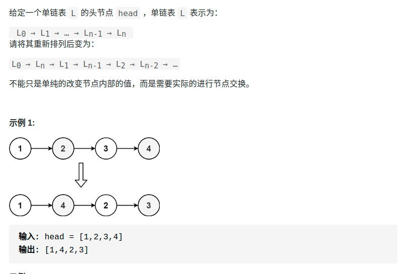

> 难度：简单
- 用一个dequeue，先按序装入，后面分别从一头一尾取。
- 有更巧妙的，有空看
> 题目

<div align="center" style="zoom:60%"></div>

> 代码

```cpp
class Solution {
public:
    void reorderList(ListNode* head) {
        if(head == nullptr) return;
        deque<ListNode*> nodeq;
        ListNode *itn = head;
        while(itn != nullptr){
            nodeq.push_back(itn);
            itn = itn->next;
        }
        ListNode *lo;
        ListNode *hi;

        while(!nodeq.empty()){
            hi = nodeq.back();
            nodeq.pop_back();
            if(nodeq.empty()) break;

            lo = nodeq.front();
            nodeq.pop_front();

            hi->next = lo->next;
            lo->next = hi;
        }

        hi->next = nullptr;
    }
};
```
```
执行用时：36 ms, 在所有 C++ 提交中击败了81.41%的用户
内存消耗：18.1 MB, 在所有 C++ 提交中击败了29.87%的用户
```

> 更好的方法
- 空间复杂度 O(1)
- 思路：**目标链表即为将原链表的左半端和反转后的右半端合并后的结果**
- 涉及：
  - 找中点，快慢指针
  - 反转整个链表
  - 交叉merge链表

```cpp
class Solution {
public:
    ListNode* reverse(ListNode* head){
        if(head->next == nullptr)
            return head;
        auto rtn = reverse(head->next);
        head->next->next = head;
        head->next = nullptr;
        return rtn;
    }

    void reorderList(ListNode* head) {
        if(head == nullptr) return;
        if(head->next == nullptr) return;

        // 1. 找中点
        ListNode* fast = head, *slow = head;
        while(fast->next != nullptr && fast->next->next != nullptr){
            fast = fast->next->next;
            slow = slow->next;
        }
        // 截断成两条链表，左半部分和右半部分
        ListNode* p1,*p2;
        p1 = head;
        p2 = slow->next;
        slow->next = nullptr;// 截断

        // 2. 反转右部分的俩表
        p2 = reverse(p2);

        // 3. merge 链表
        ListNode* it = p1;
        bool flag = true;
        assert( it == head);
        while(p1 != nullptr && p2 != nullptr){
            if(flag){
                p1 = p1->next;
                it->next = p2;
                it = it->next;
                flag = false;
            }else{
                p2 = p2->next;
                it->next = p1;
                it = it->next;
                flag = true;
            }
        }
    }
};
```