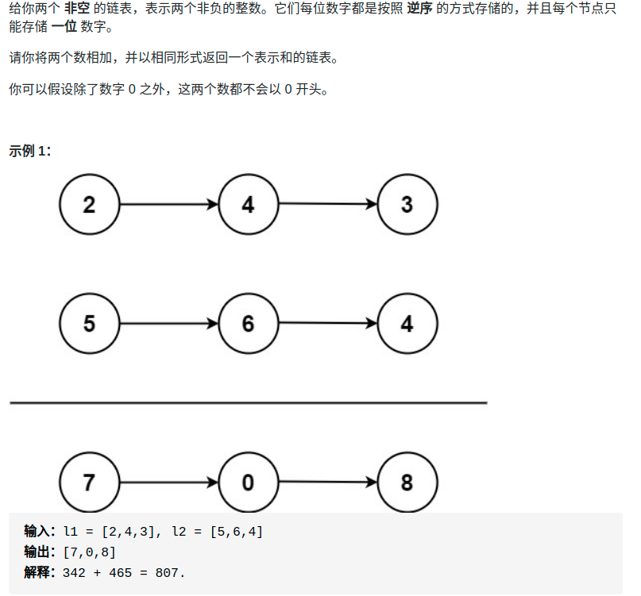

> 难度：简单
- 链表遍历
> 题目
<div align="center" style="zoom:80%"></div>

> 代码

```cpp
class Solution {
public:
    ListNode* addTwoNumbers(ListNode* l1, ListNode* l2) {
        ListNode *res = nullptr, *resit=nullptr;
        ListNode *it1,*it2;
        it1 = l1;
        it2 = l2;
        int n = 0;
        // 借用l1的空间
        while(it1 != nullptr && it2 != nullptr){
            it1->val= it1->val + it2->val + n;
            n = it1->val /10;
            it1->val %= 10;
            if(res == nullptr){
                res = it1;
                resit = it1;
            }else{
                resit->next = it1;
                resit = resit->next;
            }
            it1 = it1->next;
            it2 = it2->next;
        }
        // 如果l1没遍历完
        while(it1 != nullptr){
            resit->next = it1;
            resit = resit->next;
            resit->val += n;
            n = resit->val /10;
            resit->val %= 10;

            it1 = it1->next;
        }
        // 如果l2没遍历完
        while(it2 != nullptr){
            resit->next = it2;
            resit = resit->next;
            resit->val += n;
            n = resit->val /10;
            resit->val %= 10;

            it2 = it2->next;
        }

        // 如果最后了还进位了，则要new一个
        if(n == 1){
            resit->next = new ListNode(1);
        }
        return res;
    }
};

```