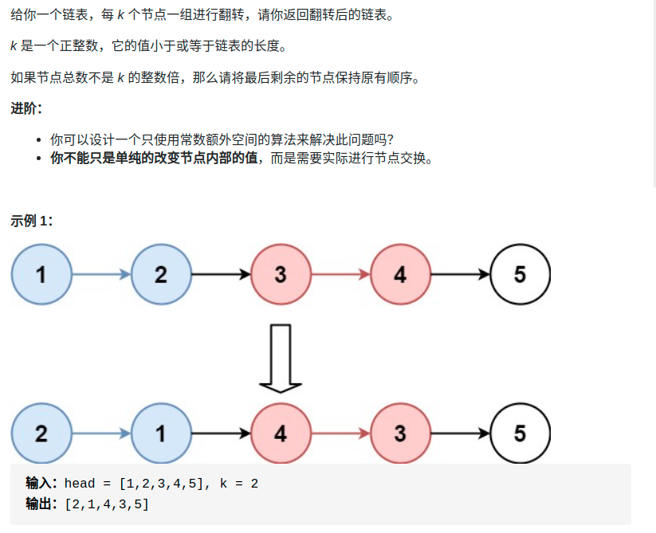

> 难度：中等
- 和leetcode92（反转链表的一个区间）是同一中做法

> 题目

<div align="center" style="zoom:80%"></div>

> 代码
```cpp

class Solution {
public:
    ListNode* reverseKGroup(ListNode* head, int k) {
        auto size = getSize(head);
        int i = 0;
        while(size >= k){
            head = reverseBetween(head, i*k, (i+1)*k);
            ++i;
            size -= k;
        }

        return head;
    }

    ListNode* reverseBetween(ListNode*head, int lo, int hi){
        if(lo == 0){
            return reverserPre(head, hi);
        }
        head->next = reverseBetween(head->next, lo-1, hi-1);
        return head;
    }
    ListNode* successor = nullptr;
    ListNode* reverserPre(ListNode* head, int n){
        // base case
        if( n == 1 ){
            successor = head->next;
            return head;
        }
        ListNode* last = reverserPre(head->next, n-1);
        head->next->next = head;
        head->next = successor;
        return last;
    }

    int getSize(ListNode* head){
        int rtn = 0;
        while(head != nullptr){
            ++rtn;
            head = head->next;
        }
        return rtn;
    }

};
```
```
执行用时：8 ms, 在所有 C++ 提交中击败了99.69%的用户
内存消耗：11.4 MB, 在所有 C++ 提交中击败了9.04%的用户
```