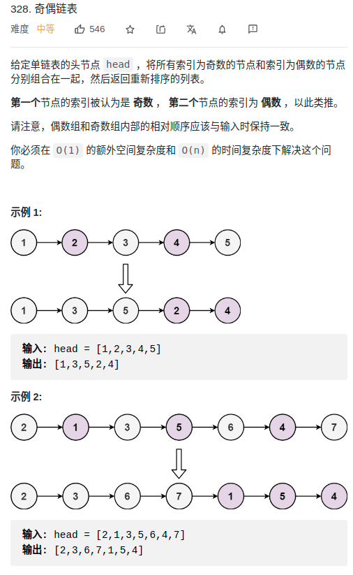

> 难度：简单
- 特解，画图，多用几个指针
> 题目

<div align="center" style="zoom:80%"></div>

> 代码

```cpp
class Solution {
public:
    ListNode* oddEvenList(ListNode* head) {
        if(head == nullptr) return nullptr;
        ListNode *it1, *it2, *h1, *h2;
        h1 = head;
        h2 = head->next;
        it1 = h1;
        it2 = h2;

        while(it1 != nullptr && it2 != nullptr){
            if(it1->next == it2){
                // it1 在后
                it1->next = it2->next;
                if(it1->next == nullptr)
                    break;// 偶数个情况
                else
                    it1 = it1->next;
            }else{
                // it2 在后
                it2->next = it1->next;
                if(it2->next == nullptr)
                    break;// 奇数个情况
                else
                    it2 = it2->next;
            }
        }

        it1->next = h2;

        return h1;
    }
};
```