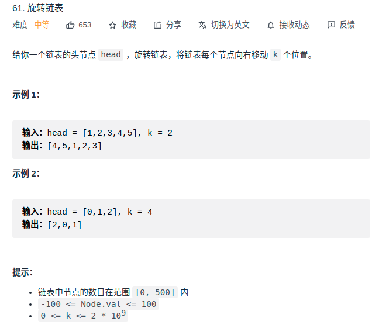

> 难度：简单
- 思路
  - 双指针，找到倒数第k个位置。
  - k可能大于链表长度，要先得到链表长度len后,更新 k， `k <- k % n`.

> 题目
<div align="center" style="zoom:80%"></div>

> 代码

```cpp
class Solution {
public:
    ListNode* rotateRight(ListNode* head, int k) {
        if(head == nullptr) return nullptr;
        ListNode *slow, *fast;
        int record,len;

        slow = head;
        fast = head;
        while(k){
            fast = fast->next;
            ++record;
            --k;
            if(fast == nullptr) {
                len = record; // 链表长度
                k %= len;       // 减少接下来循环次数
                fast = head;
            }
        }

        // 原链表不需要改变的情况
        if(fast == slow) return head;
        
        while(fast->next != nullptr){
            slow = slow->next;
            fast = fast->next;
        }
        auto temp = slow->next;
        slow->next  = nullptr;
        fast->next = head;
        return temp;
    }
};
```