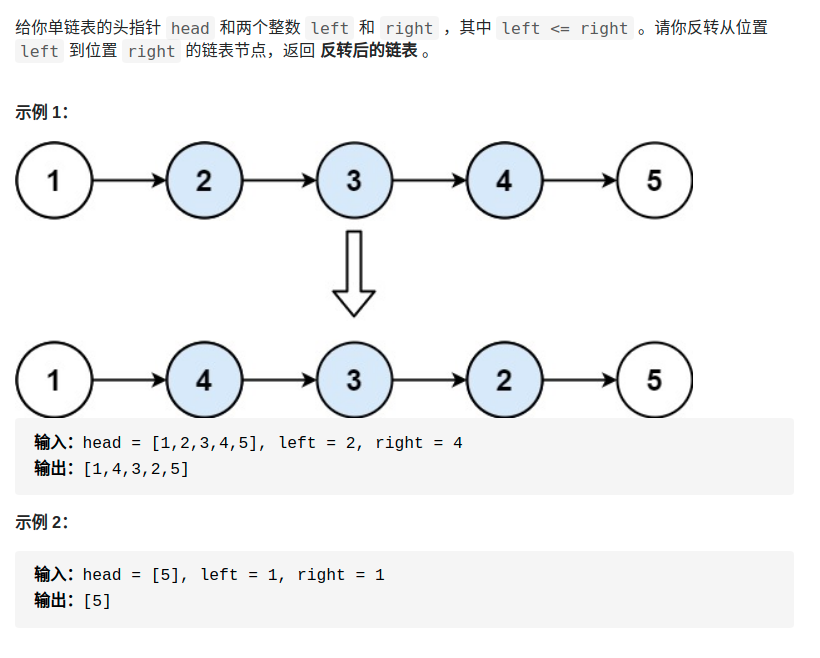

> 难度：简单
- 思路：递归or迭代
  - 递归比较简洁，但是理解比较难一点，不过只要弄懂确定了递归函数定义，就好很多。
  - 迭代需要注意更加多的细节。


> 题目

<div align="center" style="zoom:60%"></div>

> 代码
```cpp
class Solution {
public:
    ListNode *success;
    // 反转前n个节点,返回反转后的头结点
    ListNode *reverseN(ListNode *head, int n) {
        if(n == 1){
            success = head->next;
            return head;
        }
        ListNode * tail = reverseN(head->next, n-1);
        head->next->next = head;
        head->next = success;
        return tail;
    }

    // 反转【left,right】区间的节点，返回反转后的头结点
    ListNode *reverseBetween(ListNode *head, int left, int right) {
        if(left == 1){
            return reverseN(head,right);
        }
        head->next = reverseBetween(head->next, left-1, right-1);
        return head;
    }

};
```
```
执行用时：0 ms, 在所有 C++ 提交中击败了100.00%的用户
内存消耗：7.3 MB, 在所有 C++ 提交中击败了53.22%的用户
```
