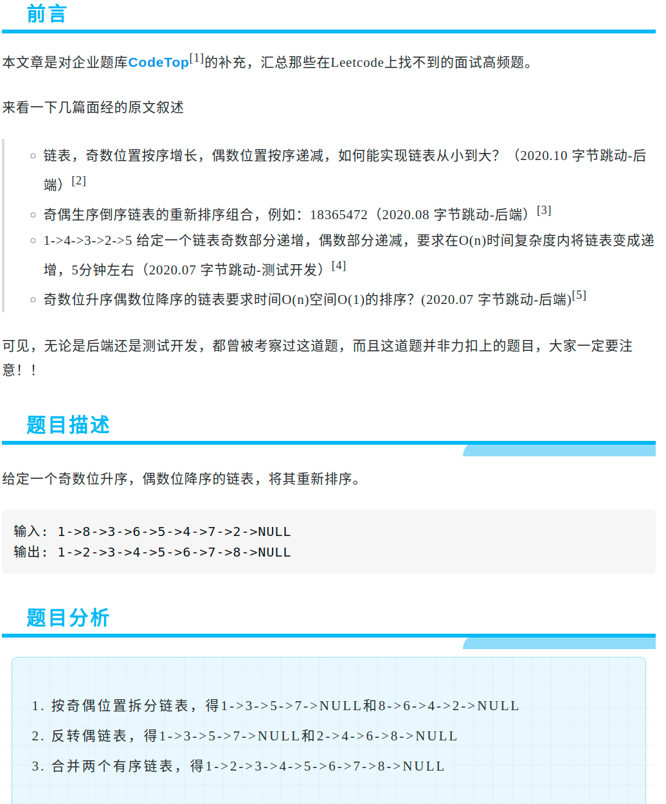

<div align="center" style="zoom:80%"></div>

> 代码

```cpp

class Solution {
public:
    // 奇偶链表拆分
    void oddEvenList(ListNode* head, ListNode*& h1, ListNode*& h2){
        ListNode *it1, *it2;
        h1 = head;
        h2 = head->next;
        it1 = h1;
        it2 = h2;

        while(it1 != nullptr && it2 != nullptr){
            if(it1->next == it2){
                it1->next = it2->next;
                if(it1->next == nullptr)// 偶数个
                    break;
                else
                    it1 = it2->next;
            }else{
                it2->next = it1->next;
                if(it2->next == nullptr)// 奇数个
                    break;
                else
                    it2 = it1->next;
            }
        }
        return;
    }

    // 反转链表
    ListNode* reverse(ListNode* node){
        if(node->next == nullptr)
            return node;

        auto rtn = reverse(node->next);
        node->next->next = node;
        node->next = nullptr;
        return rtn;
    }

    ListNode* mergeByorder(ListNode* lp, ListNode* rp){
        ListNode* rtn = nullptr, *it = nullptr;
        while(lp != nullptr && rp != nullptr){
            auto t = lp->val < rp->val ? lp : rp;
            if(!rtn) {
                rtn = t;
                it = t;
            } else{
                it->next = t;
                it = it->next;
            }
            lp->val < rp->val ? lp=lp->next : rp=rp->next;
        }

        // 链表直接接上去就行了，不用循环
        ListNode* t;
        if(lp == nullptr) it->next = rp;
        else it->next = lp;
        assert(it->next != nullptr);


        return rtn;
    }

    ListNode* solve(ListNode* head) {
        if(head == nullptr) return nullptr;
        // 1. 奇偶链表
        ListNode* h1, *h2;
        oddEvenList(head, h1, h2);

        // 2. 反转链表
        h2 = reverse(h2);

        // 3. merge
        auto rtn = mergeByorder(h1, h2);
        return rtn;
    }
};

```