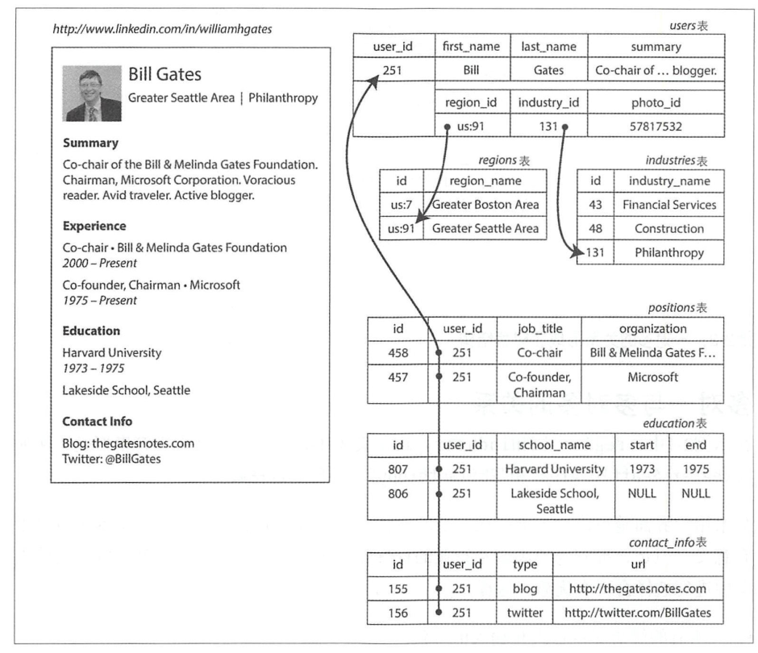

- https://cloud.tencent.com/developer/article/1676119

# 数据模型与查询语言
- 数据模型：对数据的组织和存储样式，数据的表示

## 多层叠加，层层抽象
- 大多数应用程序是**通过一层一层叠加数据模型**来构建的
  - 比如属性图的底层，通过KV数据库管理。
  - 层级样例
    - 应用层：对象和数据结构（对象模型）
    - 通用数据模型：JSON或XML文档（文档模型，如MongoDB）、关系数据库中的表（关系模型，Mysql）、图模型
    - 内部机制：怎么存储，在内存、磁盘或网络的字节格式是什么样的。（数据表示需要支持多种方式的查询、搜索、操作和处理数据）
    - 物理层：考虑如何表现字节，选什么硬件设备

- 复杂的应用程序可能会有更多的中间层，例如**基于API来构建上层 API** ，但是基本思想相同：每层都通过提供一个简洁的数据模型来隐藏下层的复杂性。

## 关系模型和文档模型
- 70年代-80年代：层次模型和网络模型

- 关系模型：数据被组织成**关系**（relations），在SQL中称为**表**（table），其中每个关系都是元组(tuples）的无序集合（在SQL中称为**行**）。

- **NoSQL**：“NoSQL”这个名字是不恰当的，因为它其实**并不代表具体的某些技术**，其含义也已经被逆向重新解释为“不仅仅是SQL”

- **混合持久化**：关系型和非关系型一起使用
- 关系模型遇到的问题：
  - **对象－关系不匹配**：那么应用层代码中的对象与表、行和列的数据库模型之间需要一个笨拙的转换层。不是有ORM吗？有，但是不能完全隐藏两个模型之间的差异

###  一对多关系
- 方式
  - 传统SQL模型。如下图1所示
  - 之后SQL标准增加了对结构化数据类型和XML数据的支持
  - 直接编码为JSON和XML文档
    - **JSON比传统SQL有更好的局部性。** 而对于ISON表示方法，所有的相关信息都在一个地方，一次查询就够了，而SQL要查询多个然后连接。
    - **JSON天然树结构**。如图2所示。

 图1

 图2

