- [=======第一部分 数据系统基础](#第一部分-数据系统基础)
- [第一章：可靠、可扩展与可维护的应用系统](#第一章可靠可扩展与可维护的应用系统)
  - [可靠性](#可靠性)
  - [可扩展性](#可扩展性)
    - [性能描述](#性能描述)
    - [应对负载增加的方法](#应对负载增加的方法)
  - [可维护性](#可维护性)
- [第二章：数据模型与查询语言](#第二章数据模型与查询语言)
  - [多层叠加，层层抽象](#多层叠加层层抽象)
  - [关系模型和文档模型](#关系模型和文档模型)
    - [一对多关系](#一对多关系)
    - [多对一与多对多关系](#多对一与多对多关系)
    - [关系数据库与文档数据库现状](#关系数据库与文档数据库现状)
      - [文档数据模型：灵活性](#文档数据模型灵活性)
      - [文档数据模型：局部性](#文档数据模型局部性)
      - [文挡数据库与关系数据库的融合](#文挡数据库与关系数据库的融合)
  - [数据库查询语言](#数据库查询语言)
  - [图状数据模型](#图状数据模型)
  - [总结](#总结)
- [第三章：数据存储与检索](#第三章数据存储与检索)
  - [哈希索引](#哈希索引)
  - [SSTables和LSM-Tree](#sstables和lsm-tree)
    - [性能优化](#性能优化)
    - [压缩策略](#压缩策略)
  - [B-tree](#b-tree)
    - [BTree可靠性](#btree可靠性)
  - [对比B-tree和LSM-tree](#对比b-tree和lsm-tree)
    - [LSM-tree优点](#lsm-tree优点)
  - [其他索引结构](#其他索引结构)
    - [索引中存储值](#索引中存储值)
    - [多列索引](#多列索引)
    - [全文检索和模糊索引](#全文检索和模糊索引)
    - [在内存中保存所有内容](#在内存中保存所有内容)

- https://cloud.tencent.com/developer/article/1676119
# =======第一部分 数据系统基础
- **数据密集型应用**：对于一个应用系统，如果“**数据**”是其成败决定性因素，则可称为 “数据密集型应用”。
  - 对比：**计算密集型应用**，CPU的处理能力是限制

# 第一章：可靠、可扩展与可维护的应用系统
- 数据库、队列、高速缓存 这些系统，统称为数据系统。因为**系统**之间的界限正在变得模糊。Eg:Redis可以是消息队列也可以作为数据存储。
- 现**应用系统**中，单个**组件（数据系统）** 无法完成业务，需要拆分任务，每个组件高效完成其中一部分，**多个组件通过应用层代码驱动衔接起来**

- 软件系统极为重要的三个问题（本书重点阐述方向）
  - 可靠性
  - 可扩展性
  - 可维护性

## 可靠性
- 何为**可靠性**
  - 可以认为可靠性大致意味着：即使发生了**某些**错误，系统仍可以继续正常工作。
- 定义：可能出错的事情称为**错误（faults）或故障**，系统可应对错误则称为**容错（fault-tolerant）或者弹性（resilient ）**（注：和弹性计算的弹性不是同一概念）。 
  - **故障与失效**：故障与失效（failure）不完全一致
    - **故障**通常是**某个组件**和正常所设想的出现偏离。
    - **失效**是指**整体**停止，无法提供服务。
    - 通过容错，避免从故障引发系统失效。
  - **容错测试**： eg :kill process ， 断电...
  - **通常是容忍故障而不是预防故障**，但是有例外：比如安全问题。
- 盈利成本——可靠性——信誉。可靠性在这中间拉扯
> 种类
- 硬件故障
  - 解决：
    - 硬件冗余：如增加设备或硬件
    - 软件容错：云服务集群硬件故障上升，软件容错为新手段。eg:机群动态管理
- 软件故障：即bug
  - 本质：对环境存在某种假设，假设多数时间成立，所以没触发bug。
  - 解决：
    - 各种test
    - 安拆check
- 人为失误

## 可扩展性
- 可扩展性：可扩展性是用来描述系统应对**负载**增加能力的术语
- **负载**：负载可以用称为**负载参数**的若干数字来描述
  - 参数的最佳选择取决于系统的体系结构，它可能是Web服务器的每秒请求处理次数，数据库中写入的比例 ，聊天室的同时活动用户数量， 缓存命中率等。 
  - 有时平均值很重要 ，有时系统瓶颈来自于少数峰值 。

### 性能描述
- 负载增加了，怎么去考虑问题，两种考虑方式：
  - 负载增加，资源不变，性能怎么变
  - 负载增加，性能不变，资源怎么变
- 性能指标
  - **吞吐量**：每秒可处理的记录条数或数据量（批处理系统，如Hadoop）
  - **响应时间**：客户端从发送请求到接收响应之间的间隔 （在线系统）
    - **延迟**（区分响应时间）：花费在处理上的时间，没包括包括来回网络延迟和各种排队延迟。
    - **非固定**：最好**不要将响应时间视为一个固定的数字**，而是可度量的一种数值分布。（由于各种变化因素，如网络，系统刚好垃圾回收...）
    - **百分位数**：**平均时间可能会掩盖一些信息，无法告诉有多少用户实际经历了多少延迟**——可以用**p50 p95 p99 p999**等百分位数
      - p999可以意味着大客户（亚马逊）
    - **队头阻塞**：很简单的小任务被前面的大任务堵住了，造成排队延迟很高。**故响应时间要再客户端测量**
    - **测试端要持续发送请求**：不能等请求完成再发送下一个这样的形式，这样会认为缩短累计队列的深度，带来和正常环境下的偏差。
- 一个完整服务包含多个并发请求时，高百分位很重要。最终响应时间取决于最慢的那个子服务。
  - 可以怎么监控测量高分位数 p23

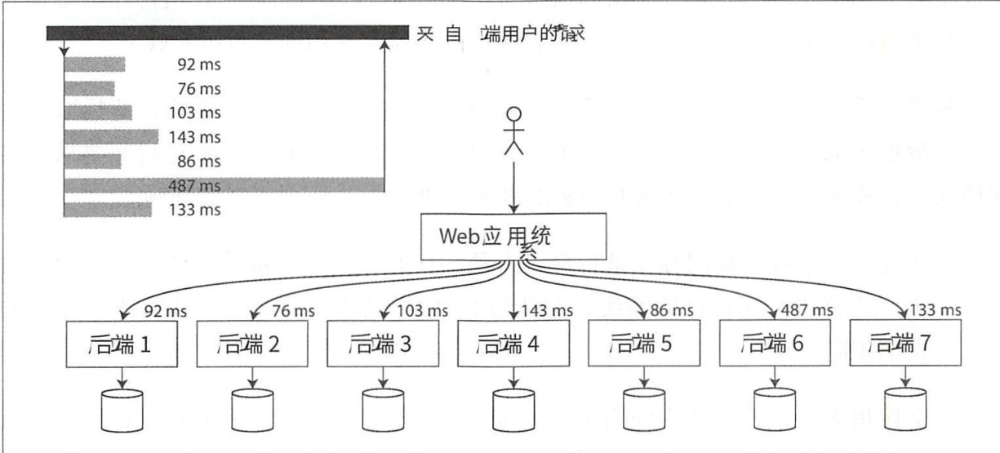

### 应对负载增加的方法
- p22
- 垂直扩展 和 水平扩展之间的取舍
  - 垂直扩展：升级到更强大的机器。
  - 水平扩展：负载分布到多个更小的机器。
- 弹性扩展 和 手动扩展
  - 弹性扩展：负载更多，自动添加资源
  - 手动扩展：人为分析，然后决定计算资源
  - 如果**负载高度**不可预测，则自动弹性系统会更加高效 ，但或许**手动方式可以减少执行期间的意外情况**
- **无状态服务** 和 **有状态服务**
  - 有状态服务 复杂性更高。数据库
  - 无状态：后端应用
- 往往是基于某种假设去有针对扩展。假设错误，可能扩展就白费了

## 可维护性
- 软件的大部分成本并不在最初的开发阶段，而是在于整个生命周期内**持续的投入**（如维护）。
- （*）**每一个遗留系统总有其过期的理由**，所以很难给出一个通用的建议该如何处理它们。

- 软件系统的三个设计原则
  - **可运维性**：方便运营团队来保持系统平稳运行
  - **简单性**：简化系统复杂性，使新工程师能够轻松理解系统
    - 简化系统设计并不意味着减少系统功能，而主要意味着消**除意外方面的复杂性**
    - 消除意外复杂性最好手段之一是**抽象**
  - **可演化性**：向后兼容，向前兼容，适应变化

# 第二章：数据模型与查询语言
- 数据模型：对数据的组织和存储形式（我的理解）
- 多对多关系是不同数据模型之间的重要区别特征

  

## 多层叠加，层层抽象
- 大多数应用程序是**通过一层一层叠加数据模型**来构建的
  - 比如属性图的底层，通过KV数据库管理。
  - 层级样例
    - 应用层：对象和数据结构（对象模型）
    - 通用数据模型：JSON或XML文档（文档模型，如MongoDB）、关系数据库中的表（关系模型，Mysql）、图模型
    - 内部机制：怎么存储，在内存、磁盘或网络的字节格式是什么样的。（数据表示需要支持多种方式的查询、搜索、操作和处理数据）
    - 物理层：考虑如何表现字节，选什么硬件设备

- 复杂的应用程序可能会有更多的中间层，例如**基于API来构建上层 API** ，但是基本思想相同：每层都通过提供一个简洁的数据模型来隐藏下层的复杂性。

## 关系模型和文档模型
- 70年代-80年代：层次模型和网络模型

- 关系模型（定义）：数据被组织成**关系**（relations），在SQL中称为**表**（table），其中**每个关系都是元组**(tuples）的无序集合（在SQL中称为**行**）。

- **NoSQL（定义）**：“NoSQL”这个名字是不恰当的，因为它其实**并不代表具体的某些技术**，其含义也已经被逆向重新解释为“不仅仅是SQL”

- **混合持久化**：关系型和非关系型一起使用
- 关系模型遇到的问题：
  - **对象－关系不匹配**：那么应用层代码中的对象与表、行和列的数据库模型之间需要一个笨拙的转换层。不是有ORM吗？有，但是不能完全隐藏两个模型之间的差异

###  一对多关系
- 方式
  - 传统SQL模型。如下图1所示
  - 之后SQL标准增加了对结构化数据类型和XML数据的支持
  - 直接编码为JSON和XML文档
    - **JSON比传统SQL有更好的局部性。** 而对于JSON表示方法，所有的相关信息都在一个地方，一次查询就够了，而SQL要查询多个然后连接。
    - **JSON天然树结构**。如图2所示。

 图1

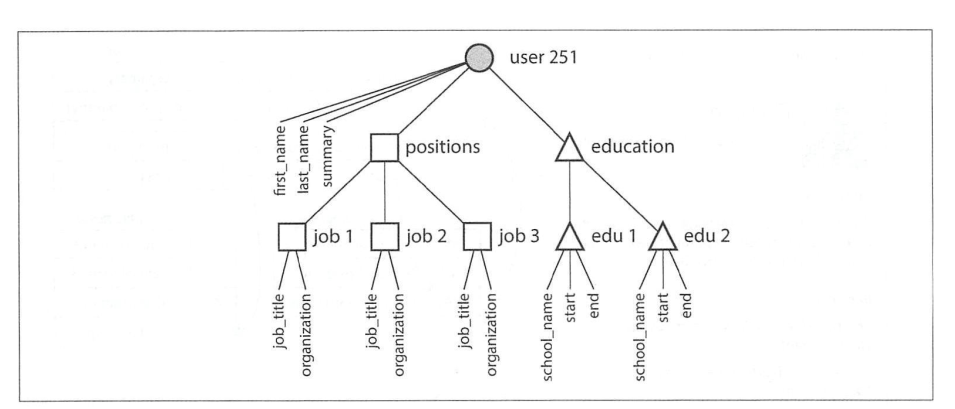 图2

### 多对一与多对多关系
- 为什么用**无意义ID**
  - 因为它无意义，任何有意义的东西都有可能变。
  - 如果其作为主键，主键变了，外键的表都要变。（一更新，多个表同时要更新。也很容易一致性出问题）

- 关系例子
  - 一对多：一个人担任多个职务
  - 多对一：许多人生活在同个地区
  - 多对多：社交网络

- 什么叫数据规范化？？？？不太懂（p39）

- 多对一并不是很适合文档模型。（文档模型在连接上很弱）

> 文档数据库是不是在重演历史
- 一开始是层次模型，由于**需要解决多对多问题**，出现了**网络模型和关系模型**。
- 网络模型：p41简介
  - 访问路径的设计使其复杂。
  - 程序员手动选择路径
- 关系数据库
  - 查询优化器自动决定以何种顺序执行查询 ，以及使用哪些索引（实际等价于选择 访问路径，区别在于自动化）
  - **如果想用新的方式查询数据，只需声明一个新的索引，查询会自动使用最合适的索引。不需要更改查询即可利用新的索引**
  - 查询优化器十分复杂。但是通用更加长远。

> 关系型和文档型的比较
- 一对多：
  - 关系型：连接
  - 文档型：嵌套
- 多对一和多对多：
  - 并没有根本的不同：相关项都由唯一的标识符引用， 该标识符在**关系模型**中被称为**外键**，在**文档模型**中被称为**文档引用**

### 关系数据库与文档数据库现状
- 文档数据模型
  - 灵活
  - 局部性
  - 更接近应用程序的数据结构
- 关系模型
  - 联结能力强
  - 多对一、多对多表达强。

#### 文档数据模型：灵活性
> 模式
- 不会强制要求**模式**。写时任意键值随便写，读时不保证存在哪些字段。
- **读时模式和写时模式**
  - 文档数据库有时被称为无模式，但这具有误导性，应该说是**无写时模式**（即对数据写入的模式没有要求，不像关系型数据库，**显式的**）。
  - 文档数据模型有**读时模式**，因为读数据的代码通常采用某种结构因而存在某种**隐形模式**，而不是由数据库强制执行。
- 读时模式类似编程语言中的动态（**运行时**） 类型检查，而写模式类似于静态（**编译时**）类型检查 。

> 模式更新时的差异（有无写时模式之间）
- 注：大多数关系数据库系统可以在几毫秒内执行ALTER TABLEi吾句。 **MySQL则需要注意，它执行ALTER TABLE时会把现在的整张表复制**（相当于update了，update一个字段，一行都要重写）。
- **无写时模式不一定就很好**，需要看是存什么数据

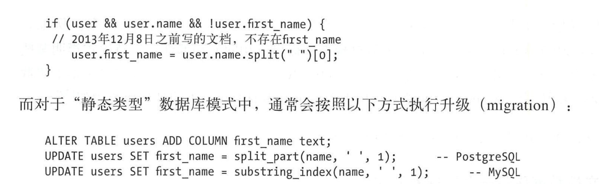

#### 文档数据模型：局部性
- 文档通常存储为编码为JSON、XML或其二进制变体（如`MongoDB的BSON` ）的连续字符串。
- **局部性优势仅适用需要同时访问文档大部分内容的场景**。
  - 数据库通常加载一整个文档，如果每次只读一小部分，那么非常浪费。。因此，通常建议文档应该尽量小且避免写入时增加文档大小
- 注意：将相关数据归为一组的**局部性想法并不仅见于文档模型**。

#### 文挡数据库与关系数据库的融合
- 许多关系型开始支持XML或JSON
- 许多文档型开始支持更多联结
- 作者：随着时间的推移，似乎关系数据库与文档数据库变得越来越相近，或许这是一件好事 ：数据模型可以相互补充

## 数据库查询语言
- 三类（p46）
  - 声明式
    - 更简单
    - 更好并行
  - 命令式
  - MapReduce查询（更底层）（p50）
    - 一种编程模型
    - map发射一对键值，对map相同的键调用reduce。最终输出到集合

- 限制：map和reduce函数对于可执行的操作有所限制
  - 必须是纯函数，这意味着只能使用传递进去的数据作为输入，而**不能执行额外的数据库查询，也不能有任何副作用**。
  - （注：不管怎么样，对数据库里数据没影响，出错了重新运行就好了）
- MapReduce是一个相当底层的编程模型，SQL可以基于其实现分布式。也有很多 SQL的分布式实现并不借助MapReduce
  - **SQL并没有任何限制规定它只能在单个机器上运行，而MapReduce也并非垄断了分布式查询**
## 图状数据模型
- 关系型hold不住太多的多对多关系
- 种类：属性图 和 RDF图
- 查询语言
  - 属性图：Cypher（Neo4j）
  - RDF图：SPARQL
  - Datalog:古老的语言
- RDF图
  - 三元存储数据模型（主体，谓语，客体）（p58）
  - RDF数据模型：有多种格式，Turtle、XML等等，如下图所示
- 语义网与三元组p59
  - 三元存储数据模型其实完全独立于语义网。
  - RDF是语义网上的概念。SPARQL是RDF上的查询语言，即使语义网从未实际出现。

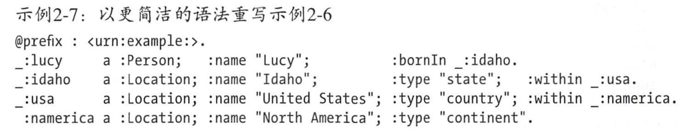

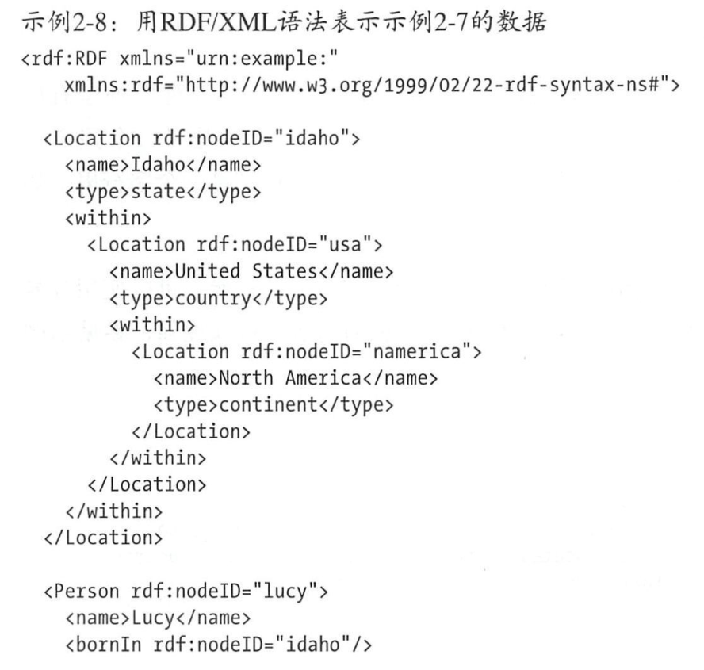

- 如果把图数据放在关系结构中，是否意味着也可以支持SQL查询呢？
  - 可以，但是有困难。在找到要查找的顶点之前，可能需要遍历数量未知的边。（每个种类的边一次join，不知道当前节点有哪些关系，可能只能将以三元组形式分别为三个字段，其存在一个表中来解决）

## 总结
- 层次模型 ====由于多对多关系表示需求===》关系模型

- 新的非关系“NoSQL”数据存储在两个主要方向上存在分歧（**面向的方向不同，一种是多对多很少的情况，一种是多对多很多的情况，走两个极端**）
  - 文档数据库的目标用例是数据来自于自包含文挡，且一个文档与其他文档之间的联很少。
  - 图数据库则针对相反的场景，目标用例是所有数据都可能会互相关联。

# 第三章：数据存储与检索
- OLTP和OLAP负载的存储引擎优化存在很大的差异
- 两个存储引擎家族
  - 日志结构的存储引擎，LSM-Tree
  - 面向页的存储引擎，B-Tree
- **索引**是基于原始数据派生而来的额外数据结构。
  - 加快读，写变慢：适当的索引可以加速读取查询，但每个索引都会减慢写速度

> demo:追加式更新的数据文件。
- 特点：
  - 写：每次只能追加写
    - O(1)
  - 读：读的时候**从后往前**扫，读取到的第一条为准
    - O(n)
  - key-value格式

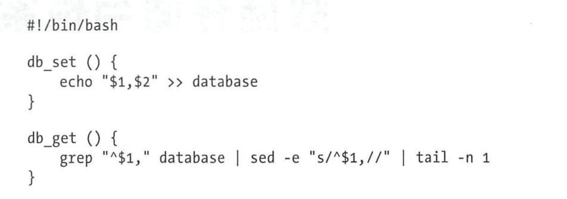

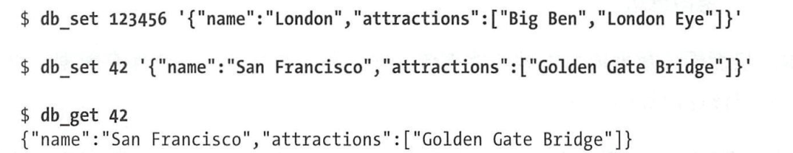

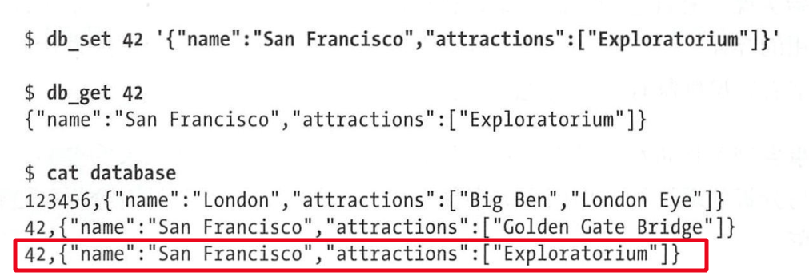

- 问题：**如何更快的读**
  - 加索引
## 哈希索引
- 使用hashmap：根据hashmap来找到对应关键字的数据在磁盘中的位置。
- `Bitcask`存储引擎：核心做法就是哈希索引。**只要所有的key都能在内存中**。只需要一次磁盘寻址，就可以读数据，并且可以缓存。
  - 像Bitcask这样的存储引擎非常适合每个键的值频繁更新的场景。（比如统计视频播放量（key:url; value:计数））
  - 适合没有太多不同的key的场景，内存装得了的场景。

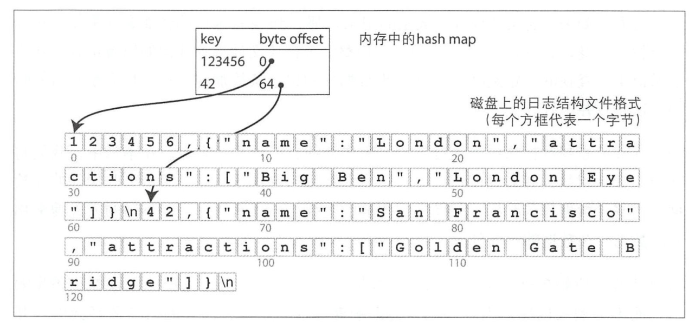

- 问题：**如何避免磁盘空间用尽**
  - 分段（文件达一定大小后换一个。段文件），压缩。
  - 每个段都有一个hashmap，检索时，先找最新的hashmap，再找第二新的...
  - 压缩有： 如下图
    - 段内压缩
    - 多段合并

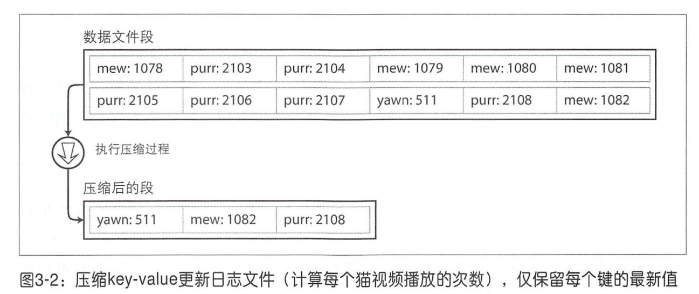

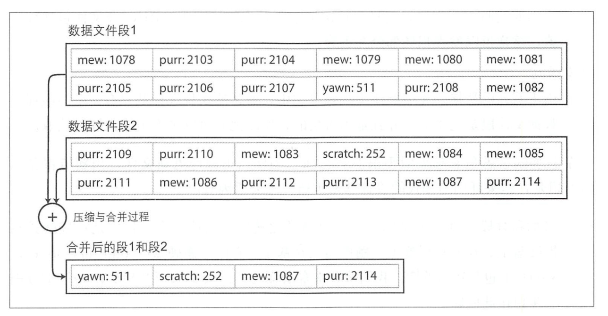

- 真正实现一个追加式数据系统，还得考虑
  - 文件格式
    - 更好是二进制格式。`keylen|key|valueLen|val`
  - 删除记录
    - 追加墓碑
  - 崩溃恢复
    - hashmap丢失怎么办？快照
  - 部分写入
    - 校验值
  - 并发控制
    - 只能单线程写
- 问题：**为什么不随机更改而要追加**
  - 磁盘速度。顺序读比随机读快多了
  - 简单。崩溃和并发读 时好处理多了。
  - 避免碎片。追加后合并的方式可以避免碎片。

> 哈希索引局限性
- 哈希表必须**全部**放在内存。
  - 原则上可以在硬盘，但是要大量随机IO。**计算key的hash之后，找到value的位置需要随机读**。
  - 你没全部放，你找不到的嘛
- 区间查询的效率不高。
  - 只能一个个查找后汇总

## SSTables和LSM-Tree
- 参考：https://zhuanlan.zhihu.com/p/181498475
- **排序字符串表（SSTable）**：原有的段文件key-value无序，现在按key排序，这样的格式就是SSTable。优点如下：
  - **合并高效**：有点像归并外排序。如下图所示。
  - **稀疏索引**：查找某个key时，可以用 `一次随机读+顺序读`的方式。因为现在已经有序了。索引如下图所示。
    - 仍然需要一个内存索引来记录某些键的偏移，但它可以是**稀疏的**
  - **以块为粒度**：既有顺序存，又有粒度。让稀疏索引中，一个索引指向一块。

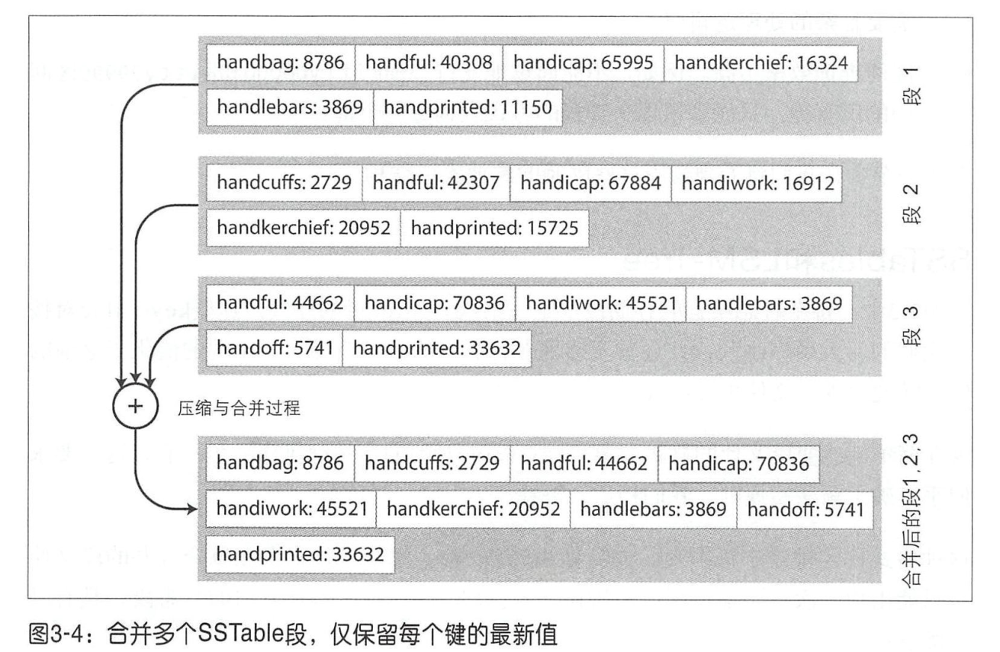

-----------

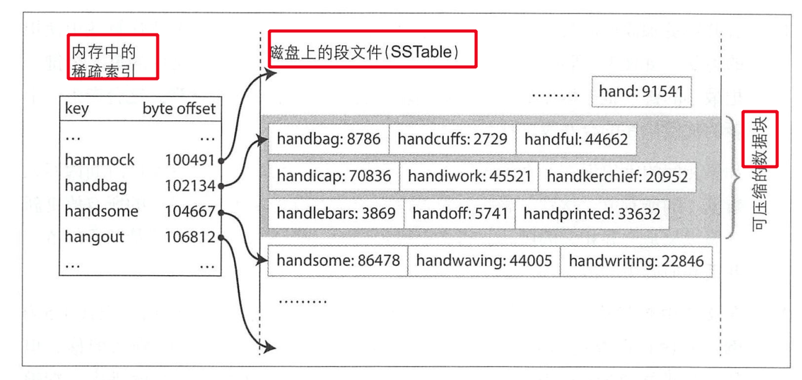

> **究极问题**：**有序很好，如何构建**
- 插曲：维护排序结构
  - 硬盘：B-Tree
  - 内存：红黑树或AVL树。
  - 内存更为容易快速。
- 大致战略：先在内存维护有序，到了一定规模，直接顺序写，形成段文件。

- 详细工作流程：
  - `动态单个存内存`：写入时，将其添加到**内存中的平衡树数据结构**中（例如红黑树）。这个内存中的树有时被**称为内存表**。
  - `批量存磁盘`：当**内存表**大于某个阈值（通常为几兆字节）时，将其作为SSTable文件写入磁盘。
  - `批量存过程中`：开始往新建的**内存表**写
  - `读顺序`：内存表-->最新的段文件-->第二新...
  - `压缩`：交给后台进程，定期压缩合并。
- 案例
  - 以上是LevelDB和RocksDB的本质
    - 应用于嵌入到其他应用程序的**key-value**存储引擎库
    - 都受到Google的BigTable启发
  - Lucene：Es和Solr等**全文搜索**（给定单词，给出匹配的文档）系统所使用的索引引擎。
    - 键是单词（词条），值是所有包含该单词的文档ID的列表 （倒排表，posting list）

- `LSM-Tree`：最初这个索引结构由 Patrick O’Neil等人以日志结构的合并树（Log-Structured MergeTree，或LSM-Tree)命名。
  - 因此，基于合并和压缩排序文件原理的存储引擎通常都被称为**LSM存储引擎**

> 问题：构建方式很妙，崩溃了内存数据怎么办？
- 解决：日志文件(WAL，write-ahead log)
- 用最淳朴的追加式的数据系统。日志文件对key顺序没要求。（本身自带时序）

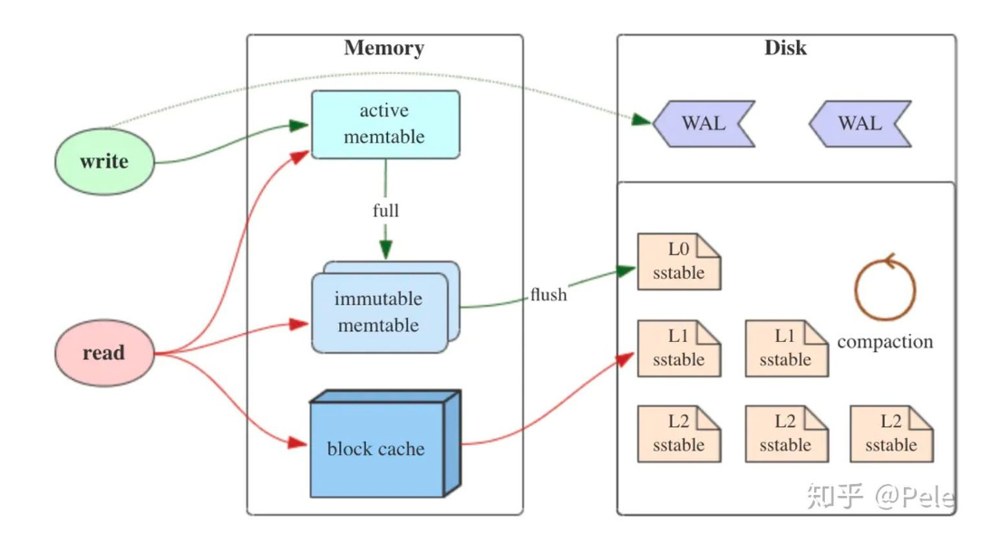 LSM-Tree机制

-----

### 性能优化
- 情况：当某个Key不存在的时候，LSM-Tree可能很慢。
  - 比如要`内存表-->最新的段文件-->第二新...`,读到最旧的才能确定没有。
  - 解决：布隆过滤器，如果某个键没有，能够很快告诉你。但是可能没有这个key，还是没被过滤
- 压缩策略影响性能。

### 压缩策略
> 大小分级（size-tiered 策略）
- size-tiered策略保证每层SSTable的大小相近，同时限制每一层SSTable的数量。
- 如下图，每层限制SSTable为N，当每层SSTable达到N后，则触发Compact操作合并这些SSTable，并将合并后的结果写入到下一层成为一个更大的sstable。

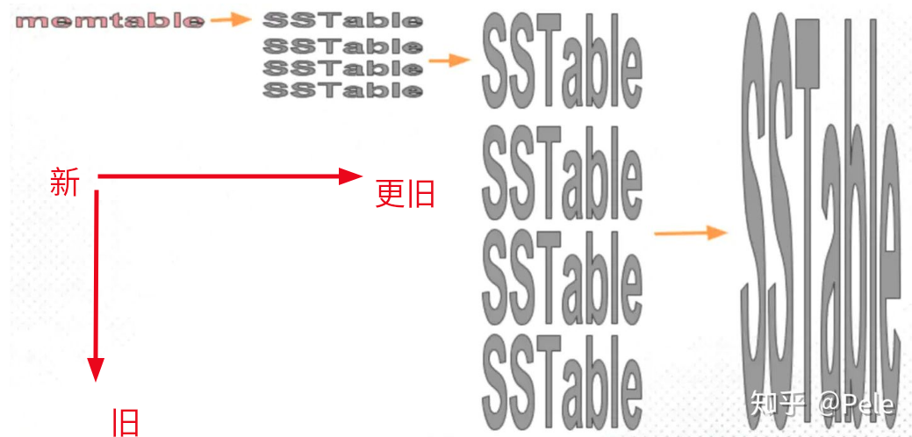 size-tiered机制

- 缺点：
  - 层数到一定数量，单个SSTable非常大。
  - 空间放大：统一层中key可能多份

> 分层压缩（leveled策略）
- 特点
  - 特点1：每一层限制总文件的大小。每层的SStable都大小相近。
  - 特点2：**每层**中的SSTable，在该层中保持**全局有序**，并且每个key在每层中至多只有1条记录。
  - 特点3：这些特点取决于其合并策略
  - 特点4：可并发

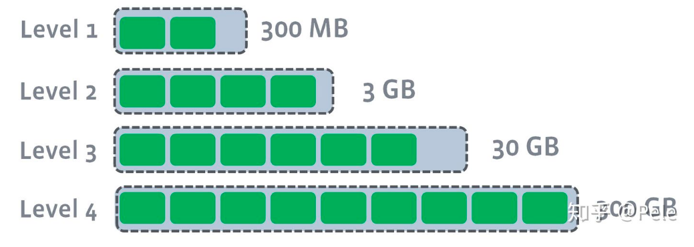 特点1

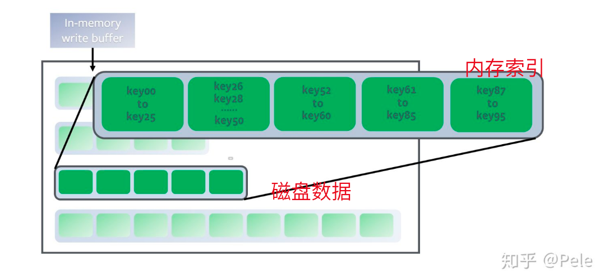 特点1

> leveled策略的合并过程
- L1的总大小超过L1本身大小限制

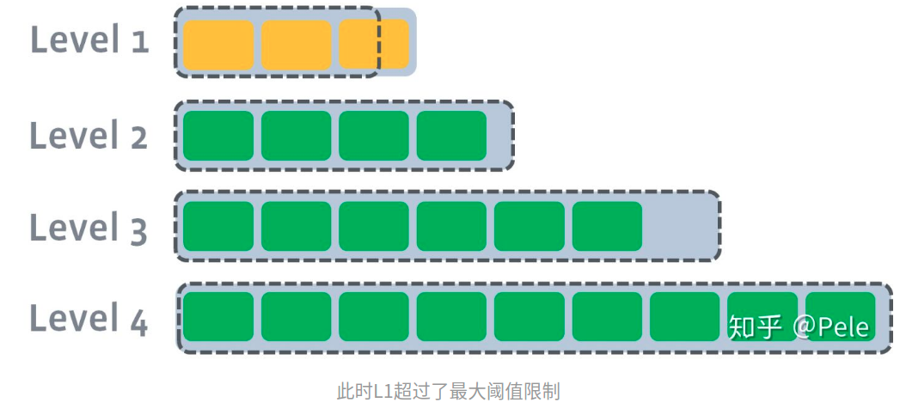

- 此时会从L1中选择至少一个文件，然后把它 **`跟L2有交集的部分(非常关键)进行合并`**。生成的文件会放在L2

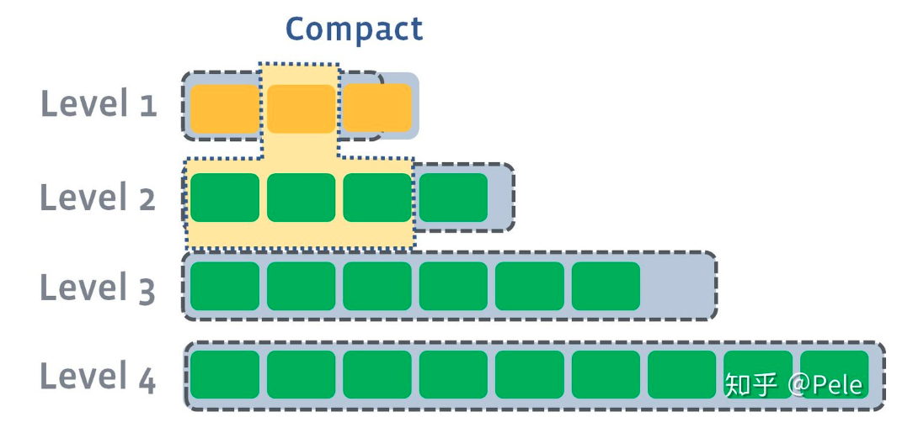

- 如果L2合并后的结果仍旧超出L2的阈值大小，需要重复之前的操作 —— 选至少一个文件然后把它合并到下一层

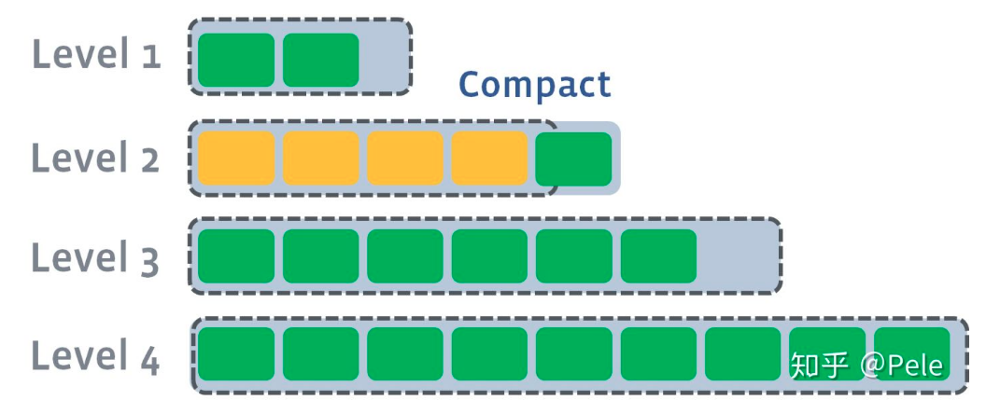

- **多个不相干的合并是可以并发进行的**

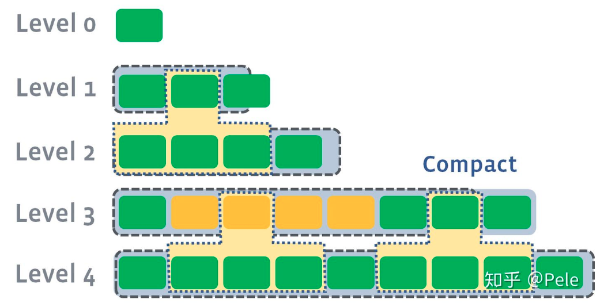

> 空间性能分析
- 有点：leveled策略相较于size-tiered策略来说，每层内key是不会重复的，即使是最坏的情况，除开最底层外，其余层都是重复key，按照相邻层大小比例为10来算，冗余占比也很小。因此空间放大问题得到缓解。
- 缺点：但是**写放大**问题会更加突出。举一个最坏场景，如果LevelN层某个SSTable的key的范围跨度非常大，覆盖了LevelN+1层所有key的范围，那么进行Compact时将涉及LevelN+1层的全部数据。

## B-tree
- 与SSTable的唯一相似点：
  - 保留按键排序的key-value对
- 特点：
  - 特点1：分页（块），传统4KB。
    - **页是内部读写的最小单元**。
    - 每个页用地址标志，这样可以一个页面引用另一个
    - 分支因子：一个页所包含的子页数量
    - 认识：大多数数据库可以适合3~4层的B-tree ，因此不需要遍历非常深的页面层次即可找到所需的页（分支因子为500的4KB页的四级树可以存储高达**256TB**） 
    - 叶子页：单个键的页，存数据值（但是一般都是值所在的地址）。
    - 改：直接改叶子页
    - 添：找到范围，添加。如果满了需要分割。如下图所示。
    - 删：比较复杂

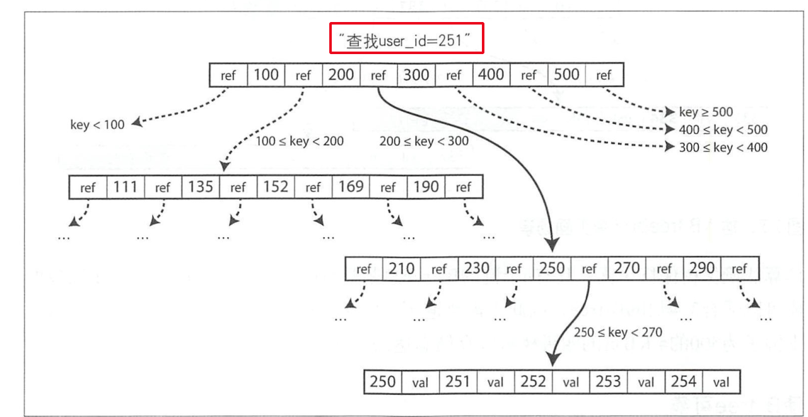 特点1

 添加后满了，分割的情景

- 对B-tree的优化见P83
### BTree可靠性
- 可靠性的挑战比LSM-Tree大：
  - 原因：可以对页进行覆盖。而LSM-Tree只是简单的追加
  - LSM-Tree不在原数据上改的原因

- 挑战
  - 崩溃处理
  - 并发处理

> 崩溃处理
- 覆盖页的时候突然崩溃，而且有些操作需要分割页（更危险）。可能产生孤儿页
  - 解决：WAL

> 并发处理
- 数据一致性的问题，改的时候避免被读了
  - 解决：锁存器（轻量级的锁）

## 对比B-tree和LSM-tree
- LSM-tree通常对于写入更快，而 B-tree被认为对于读取更快
  - 这是基准测试结果，通常不太确定。最好与实际业务结合来测。

### LSM-tree优点
- 写
  - B-tree至少写两次：一次WAL，一次树的页。**即使该页中只有几个字节更改，也必须承受写整个页的开销**
  - LSM-tree：一次内存写，一次WAL（追加）。但是存在**写放大**
    - 由于反复压缩和SSTable的合井， 日志结构索引也会重写数据多次。这种影响（在数据库内，由于一次数据库写入请求导致的多次磁盘写）称为写放大。（注：就是一次写，刚好触发了合并或者触发了内存表满了，导致这次写的效率慢，但是写操作也只是顺序写）
  - LSM-tree更高的吞吐量（一般写只是追加）
  - LSM-tree更好的压缩，占用空间小。（压缩消除碎片）

- 注：（SSD的底层工作，随机写转顺序写。减少了B-tree和LSM-tree写的性能差异）在许多 SSD上，固件内部使用日志结构化算位将随机写入转换为底层存储芯片上的顺序写入，所以存储引擎写入模式的影响不那么明显

## 其他索引结构
- 看这一节时，注意跳开B-tree。
> key-value索引
- 目前讲的都属于这卦
  - 哈希索引
  - LSM-Tree
  - B-Tree
- 它们**像关系模型中的主键（primary key）索引**。主键唯一标识关系表中的一行，或文档数据库中的一个文档，或图形数据库中的一个顶点 。
- 用于数据库中其他记录通过key，来找到 行/文档/顶点

> **二级索引**：key-value索引扩展
- 可以使用 `CREATE INDEX`命令在同一个表上创建多个二级索引
- 二级索 引可以容易地基于key-value索引来构建 。主要**区别在于它的键不是唯一的**，即可能有许多行（文档，顶点）具有相同键
  - 解决：
    - 法1：类似`posting list（key-->[val1,val2]）`
    - 法2：追加标识符，使每个**键**唯一

### 索引中存储值
- 索引中value可以是什么
  - 实际数据
    - 这种索引称为`聚集索引`
  - (折中)实际数据的部分copy
    - 这种索引称为`覆盖索引或包含列的索引`
  - 实际数据的**地址**。
    - 这种索引称为`非聚集索引`
    - 这种情况下，地址指向的位置称为**堆文件**      
    - 注意：堆文件**不以特定的顺序存储数据**（它可以是追加的，或者记录删掉的行以便用新数据在之后覆盖它们） （注：针对Btree的形式）
    - 修改时，可能导致堆换位置。这个时候所有的索引需要更改地址，或者在原来的位置保留**间接指针**。

- 从索引到堆文件会损失读性能。（**找到了堆文件！=找到了数据。还得再堆文件继续找**）
  - 在MySQL InnoDB 存储引擎中，表的主键始终是聚集索引，二级索引引用主键（再通过主键去找，在堆文件中找可能实在太慢了，他才会这样设计，再通过主键检索。）

### 多列索引
- **级联索引**：比如 (lastname , firstname )去做索引
  - 构建的索引可以查找某个`lastname`的所有人，但是没法找特定`firstname`的所有人
- **多维索引**
  - 地理空间数据尤为重要。eg：餐馆搜索网站可能有一个包含每个餐厅的纬度和经度的数据库。当用户在地图上查看餐馆时，网站需要搜索用户正在查看的矩形地图区域内的所有餐馆。SQL如下。
  - **B-tree或LSM-tree 只能提供一个维度范围**
  - 做法简介：p87
  - 更多应用：p88

### 全文检索和模糊索引
- p88
- 主要说了全文索引（底层实现借助LSM-Tree）下怎么模糊查询（如拼写错了）

### 在内存中保存所有内容
- B-Tree和LSM-Tree设计的数据结构都是为了更好的适应磁盘。
  - 磁盘优势在哪？
    - 持久化
    - 低成本
- 内存中的key-value存储
  - 主要用于缓存
  - 机器重启造成的数据丢失是可以接受的
  - 重启需要从**磁盘或者网络副本**载入状态
  - **非无磁盘IO**：仍需磁盘操作，但是读取服务都在内存（与LSM-Tree区分）。**磁盘操作主要是为了支持弱持久化的日志追加**
  - **内存特色数据结构**：提供了磁盘中难实现的数据结构。例如， **Redis的优先级队列和集合**
  - **支持远大于内存的数据集**：做法**类似操作系统的swap**，但是粒度是以记录为粒度，不是以页为粒度。因而比操作系统更有效地管理内存。
- 与直觉相反，**内存数据库的性能优势并不是因为它们不需要从磁盘读取**。
  - 原因：如果有足够的内存，即使是基于磁盘的存储引擎 ，也可能永远不需要从磁盘读取，因为操作系统将最近使用的磁盘块缓存在内存中。
  - **相反，内存数据库可以更快，是因为它们避免用写磁盘的格式对内存数据结构编码的开销**
  - **总结**：不是因为摆脱磁盘，而是因为摆脱为磁盘专门设计的结构。
