- [=======第二部分 分布式数据系统](#第二部分-分布式数据系统)
- [第五章：数据复制](#第五章数据复制)
  - [主从复制](#主从复制)
    - [复制日志的实现](#复制日志的实现)
    - [复制滞后问题](#复制滞后问题)
      - [**问题：读自己的写（读写一致性）**](#问题读自己的写读写一致性)
      - [**问题：单调读（单调读一致性）**](#问题单调读单调读一致性)
      - [**问题3：前缀一致读**](#问题3前缀一致读)
      - [**复制滞后的解决方案**](#复制滞后的解决方案)
  - [多主节点复制](#多主节点复制)
    - [适用场景](#适用场景)
    - [处理写冲突](#处理写冲突)
    - [拓扑结构](#拓扑结构)
  - [无主节点复制](#无主节点复制)
    - [失效节点与数据恢复](#失效节点与数据恢复)
    - [Quorum一致性局限性](#quorum一致性局限性)
    - [检测并发写(再谈写冲突)](#检测并发写再谈写冲突)
      - [**方法1：最后写入者获胜（last write wins,LWW）（丢弃并发写入）**](#方法1最后写入者获胜last-write-winslww丢弃并发写入)
      - [**方法2：通过算法区分并发和Happens-before（全书重点之一）**](#方法2通过算法区分并发和happens-before全书重点之一)
- [第六章：数据分区](#第六章数据分区)
  - [怎么分区](#怎么分区)
    - [键值数据的分区](#键值数据的分区)
      - [**基于关键字区间分区**](#基于关键字区间分区)
      - [**基于关键字哈希值分区**](#基于关键字哈希值分区)
  - [分区与二级索引](#分区与二级索引)
    - [基于文档分区的二级索引](#基于文档分区的二级索引)
    - [基于词条的二级索引分区](#基于词条的二级索引分区)
  - [分区再平衡](#分区再平衡)
    - [固定数量的分区](#固定数量的分区)
    - [动态分区](#动态分区)
    - [按节点比例分区](#按节点比例分区)
  - [请求路由](#请求路由)
- [第七章：事务](#第七章事务)
  - [ACID](#acid)
  - [读提交](#读提交)
  - [快照级别隔离（可重复读）](#快照级别隔离可重复读)
    - [更新丢失](#更新丢失)
    - [写倾斜与幻读](#写倾斜与幻读)
  - [串行化](#串行化)
    - [严格按照串行顺序](#严格按照串行顺序)
    - [2PL](#2pl)
    - [可串行化的快照隔离](#可串行化的快照隔离)
      - [检测是否是即将过期的MVCC对象](#检测是否是即将过期的mvcc对象)
      - [检测写入是否影响其他的即将完成的读取](#检测写入是否影响其他的即将完成的读取)
# =======第二部分 分布式数据系统
- 分布式目的
  - 高吞吐。扩展，负载均衡
  - 高可用性。冗余，容错
  - 低延迟。就近服务

- 扩展方式
  - **共享结构（垂直扩展）**
    - **共享内存架构**：单台机子
      - 优点：提供有限的容错能力。例如高端的服务器可以热插拔很多组件（在不关闭机器的情况下更换磁盘，内存模块，甚至是CPU ）
      - 缺点：成本高。成本增长过快甚至超过了线性
    - **共享磁盘架构**：多台服务器，共享磁盘阵列
      - 缺点：资源竞争和锁的开销比较大
  - **无共享结构（水平扩展）**（分布式）：数据分布在多个节点
    - 优点：灵活，高性价比，云趋势。
    - 缺点：复杂

- 数据分布式时，两种常见方式
  - 分区
  - 复制

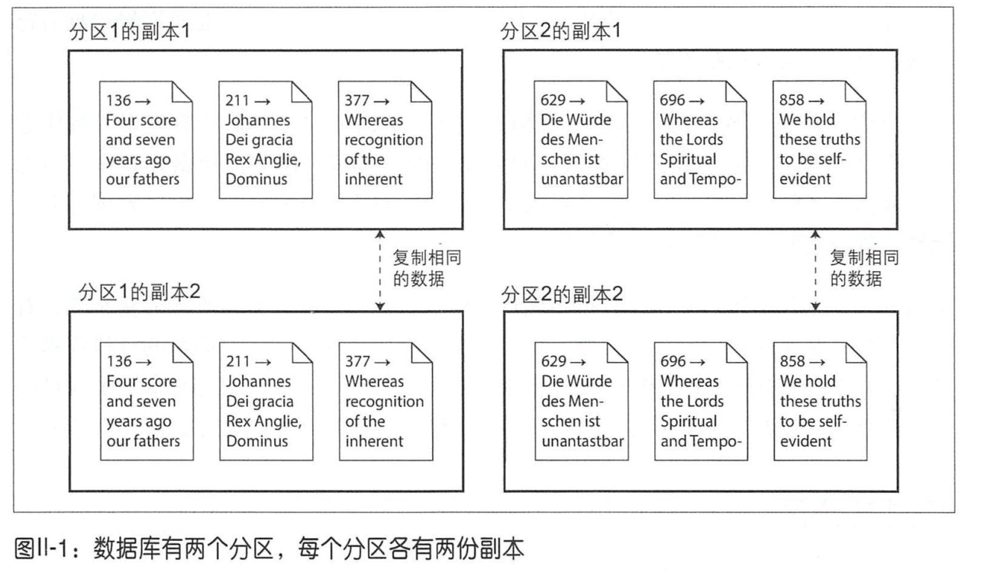 复制和分区

# 第五章：数据复制
- 理解视图：单分区下。每个分区可以看成一个小数据库，所以如果在多分区下，当前节点可能是A分区的主副本，B分区的从副本，从而实现读写的负载均衡。
- 如果数据不变，复制十分简单。**所有的难点都在于那些持续更改的数据**。
- 三种流行的复制数据变化的方法：
  - **主从复制**
  - **多主节点复制**
  - **无主节点复制**

## 主从复制
- **副本**：每个保存数据库完整数据集的节点称之为副本
- **工作原理**：
  - 指定某一个副本为**主副本**（或称为主节点）。只能往主节点写。
  - 其他副本全部称为**从副本**（或称为从节点）。主节点更改信息后，发送某种形式的更新数据（称为**复制日志**），从节点获取后应用到本地，且严格保持与主副本**相同的写入顺序**。
  - 读主/副节点都可以。
- 注：主从复制技术也不仅限于数据库，还广泛用于分布式消息队列（Kafka）等。

> 同步复制和异步复制

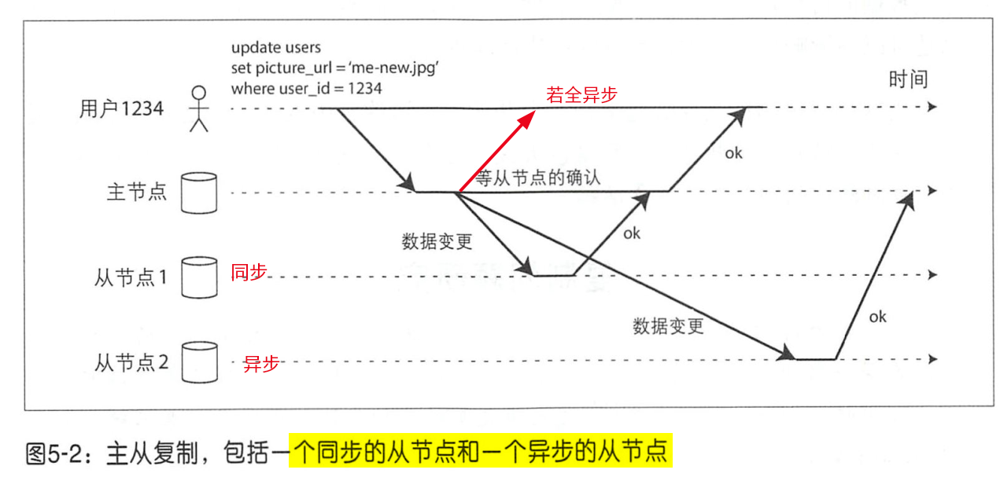

- **同步复制**
  - 优点：主节点故障，总是可以在从节点访问到最新数据
  - 缺点：同步的从节点无法完成确认，会阻塞。
  - **半同步**：实践中，如果数据库启用了同步复制，通常意味着其中某一个从节点是同步的，而其他节点则是异步模式。万一同步的从节点变得不可用或性能下降，则将另一个异步的从节点提升为同步模式。
- **异步模式**
  - 全异步模式
    - 缺点：持久性无法保证
    - 优点：吞吐性能好

> 如何配置新的从节点
- 步骤
  - 快照
  - 追赶

> fault tolerant
- 从节点
  - 追赶
- 主节点
  - **处理步骤**
    - 确认主节点失效
    - 选举
    - 重新配置系统使主节点生效
  - 问题：
    - **情况1**：使用了异步复制，失效前刚写了数据还没复制；主节点切换；之后原主节点迅速恢复，还未意识角色切换，仍进行复制导致**新主节点收到了冲突的写请求**。
      - 常见解决方案：直接丢了数据。但违背了持久化承诺。
    - **情况2**：有其他数据系统依赖于数据库的内容，并一起协同工作。
      - eg:Redis和MySQL：在GitHub的一个事故中，**某个数据并非完全同步的MySQL从节点被提升为主副本**，数据库使用了自增计数器将主键分配给新创建的行，但是因为新的主节点计数器落后于原主节点（ 即二者并非完全同步），它重新使用了已被原主节点分配出去的某些主键，而恰好这些主键已被外部Redis所引用，结果出现MySQL和Redis之间的不一致，最后**导致了某些私有数据被错误地泄露给了其他用户**
    - **情况3**：**脑裂**，发生两个节点同时都自认为是主节点。它非常危险：两个主节点都可能接受写请求，并且没有很好解决冲突的办法。
      - 解决：强制关闭其中一个。
    - **情况4**：如何设置合适超时检测主节点失效：
      - 太长：恢复时间太长
      - 太短：太多没必要的切换

### 复制日志的实现
- 基于语句的复制
- 基于预写日志（WAL）传输
- 基于行的逻辑日志复制
- 基于触发器的复制
> 基于语句的复制
- 该操作语句作为日志发送给从节点。如SQL上INSERT 、 UPDATE或DELETE语句
- 局限：
  - 调用**非确定性函数**的语句可能会在不同的副本上产生不同的值
  - 如果语句中使用了自增列，或者依赖于数据库的现有数据（如 `update ... where ...`，**副本必须按照完全形同的顺序执行**，否则结果不一样。这**对于多个同时并发执行的事务时，有很大限制**。
  - 有副作用的语句（例如，触发器、存储过程等`[由于每个节点定义不同原因]`），可能会在每个副本上产生不同的副作用

> 基于预写日志（WAL）传输
- 通过发送WAL
- 局限：
  - 太底层，和搜索引擎紧耦合

> 基于行的逻辑日志复制
- **逻辑日志**：复制和存储引擎采用不同的日志格式，这样**复制与存储逻辑剥离**
  - eg:Mysql的`binlog`
- 关系数据库的逻辑日志规则：p153

- 优点：
  - 外部应用程序容易解析
  - 逻辑日志与存储引擎解耦

> 基于触发器的复制
- 上面的都是数据库系统实现，这种是交给了应用层程序
- 需求（更灵活）：
  - 只想复制数据的一部分
  - 想从一种数据库复制到另一种数据库
  - 需要订制、 管理冲突解决逻辑
- 认识：基于触发器的复制通常比其他复制方式开销更高， 也比数据库内置复制更容易出错，或者暴露一些限制。然而，其高度灵活性仍有用武之地。

### 复制滞后问题
- **本质**：由于**并非所有的写入都反映在从副本上**，如果同时对主节点和从节点发起相同的查询，可能会得到不同的结果。
  - 最终一致性：这种不一致只是一个暂时的状态，如果停止写数据库，经过一段时间之后，从节点最终会赶上并与主节点保持一致。这种效应也被称为**最终一致性**

#### **问题：读自己的写（读写一致性）**
- 情况：用户写了再读，发现白写了
  - 角色：一个客户端

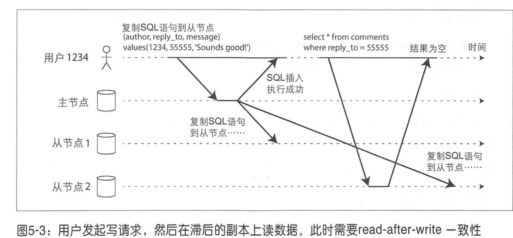

- **写后读一致性(读写一致性)**：其机制就是避免上图所示的场景。
- 如何实现读写一致性，解决方法：
  - 方法1：可能被用户自己修改的，从主节点读取。
    - eg：微博主页，自己的主页从主节点，别人的再从节点读取。
  - 方法2：如果大量数据都可能被用户自己修改，那么这样扩展性失去意义。**跟踪最近更新的时间**，如果更新后一分钟之内（**客户端角度**），则总是在主节点读取；井监控从节点的复制滞后程度，避免从那些滞后时间超过一分钟的从节点读取 
  - 方法3：**客户端**还可以记住最近更新时的时间戳，井附带在读请求中。
    - 时间戳可以是**逻辑时间戳**（例如用来指示写入顺序的日志序列号）或**实际系统时钟**（时钟同步是关键）
  - 如果是多数据中心，更复杂，必须先把请求路由到主节点（写入时的主节点）所在的数据中心。

- 多个终端的时候，面临问题
  - 方法2失效，需要全局共享的元数据
  - 无法保证设备路由后到达同个数据中心。

#### **问题：单调读（单调读一致性）**
- 情况：刷新前看到的，刷新后不见了。
  - 角色，两个客户端

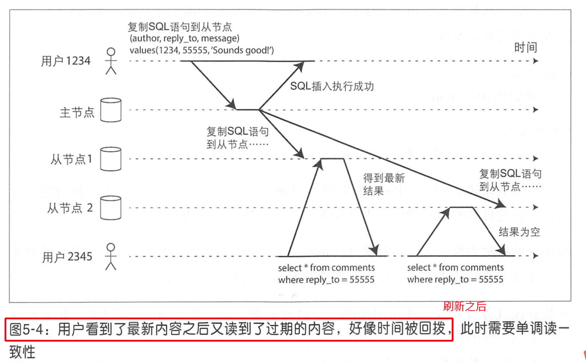

- 单调读一致性：解决这种情况的机制。
- 实现单调读一致性方法：
  - 方法1：确保每个用户总是从固定的同一副本执行读取
    - eg:基于用户 ID的哈希的方怯而不是｜随机选择副本

#### **问题3：前缀一致读**
- 情况：见图，注意多个分区
  - 角色：三个客户端

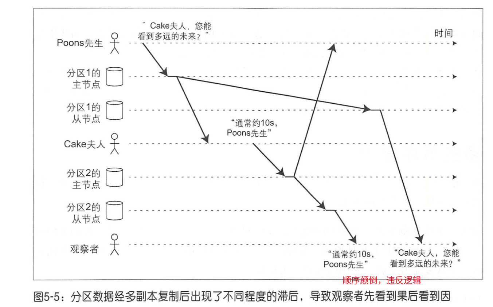

- 问题本质：如果数据库总是以相同的顺序写入，则读取总是看到一致的序列，不会发生这种反常。然而，**在许多分布式数据库中，不同的 分区 独立运行，因此不存在全局写入顺序**。这就导致当用户从数据库中读数据时，可能会看到数据库的某部分旧值和另一部分新值。
- 保证前缀一致读方法：
  - 确保任何具有因果顺序关系的写人都交给**一个分区**来完成
    - 该方案真实实现效率会大打折扣

#### **复制滞后的解决方案**
- 在使用最终一致性系统时，就该考虑一个问题：**如果复制延迟增加到几分钟甚至几小时，那么应用层的行为会是什么样子**？如果答案是“没问题”， 那没得说。
- 借助应用层：应用层可以提供比底层数据库更强有力的保证
  - 缺点：开发人员负担
- 使用事务：如果应用程序开发人员不必担心这么多底层的复制问题，而是**假定数据库在“做正确的事情”，情况就变得很简单**。而**这也是事务存在的原因**，事务是数据库提供更强保证的一种方式。（**单节点上**的事务支持已经很成熟）
  - 但是在**分布式的情况**，事务变得很复杂。事务在性能和可用性方面的代价高

## 多主节点复制

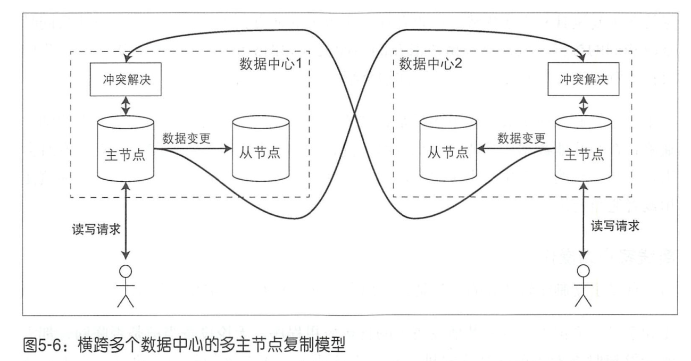

### 适用场景
> 多数据中心
- 方式：在每个数据中心内，采用常规的**主从复制**方案；而在数据中心之间，由各个数据中心的主节点来负责同其他数据中心的主节点进行数据的交换、更新。（通常各个主节点之间用**异步复制**，不然的话就没意思了）
- 其他主节点相当于该主节点的从节点。
- 多数据中心目的
  - 更强可用性：容忍数据中心失效
  - 更低延迟：更近服务

- 多数据中心下，但主节点和多主节点的差异p161
  - 性能
  - 容忍数据中心失效
  - 容忍网络问题

> 离线客户端操作
- 比如手机、笔记本上备忘录，为了支持离线。每个设备都有一个充当主节点的本地数据库。这其实就是极端情况下，数据中心之间的多主复制

> 写作编辑
- 比如腾讯文档
  - 通常不会将协作编辑完全等价于数据库复制问题，但二者确实有很多相似之处。
- 当一个用户编辑文档时，所做的更改会立即应用到本地副本，然后异步复制到服务器以及编辑同一文档的其他用户
- 如何确保不会发生编辑冲突：
  - 应用程序获得锁后才能编辑。可编辑的粒度需要非常小
  - 这种协作模式相当于主从复制模型下在主节点上执行事务操作。

### 处理写冲突
- 单主节点主要是读方面的冲突，多主节点更突出的是写冲突
- 情况：多个主节点在复制前，发生写同一个数据
  - 一致性破坏了。不知道该弄哪个，两难。解决其中一个其实就好了。

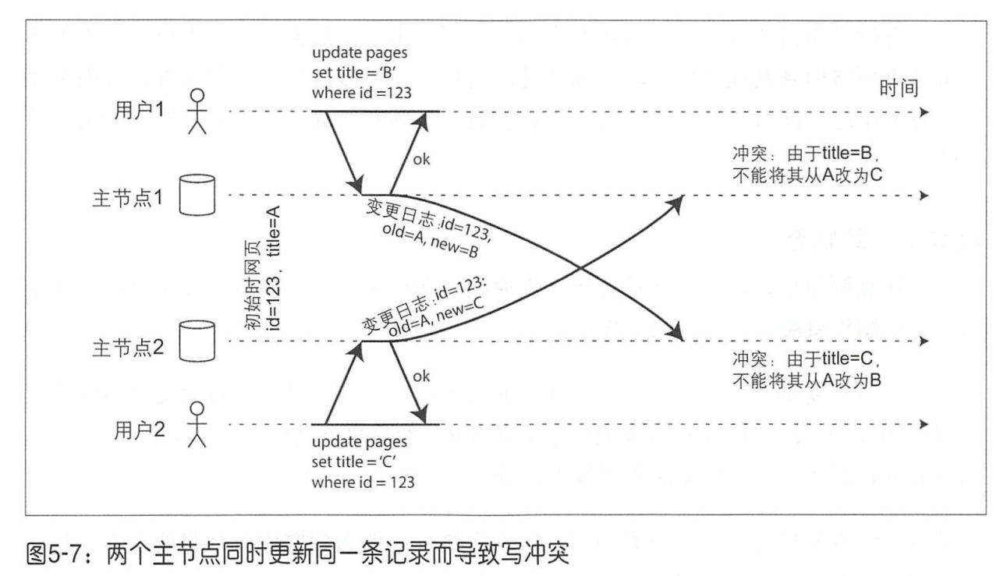

- 上图的问题是发了ok了，后来却发现并不ok（检测到冲突）。
- **发生写冲突的本质**：在整体系统中，写是无序的。

- 主从结构为什么没事
  - **因为写有序**，因为第二个请求要么被阻塞，要么无效（比如不存在A了，无效后可以通知用户）
  - 不是也无效了么，为什么没事？
    - **没有破坏一致性**

> 各个主节点使用同步复制
- 可以，因为同步复制后才发ok通知用户。但是这样做将会失去多主节点的主优势

> 避免冲突
- 处理冲突**最理想**的策略是**避免发生冲突**
- 比如：
  - 让用户更新自己数据的同时都是再同一个主节点。

> 收敛于一致性
- 就是让冲突最后被解决
  - 用户自己解决
    - 记录下来，下次让用户选择
  - 数据库自己解决（流行）
    - 某种机制选择一个。比如主节点权重，时间戳
  - 交给应用程序进行逻辑判断，可能告知用户

> 自定义冲突解决逻辑
- 解决冲突**最合适**的方式可能还是**依靠应用层**
- 现状：**有工具**
  - **写入时执行**：写入时发现冲突，就触发冲突处理程序。
    - EG：检测到冲突，记下来
  - **读取时执行**：读取时，给出多个版本到应用层。应用层可以提示用户或者自己解决冲突，并将最后结果返回到数据库。

### 拓扑结构

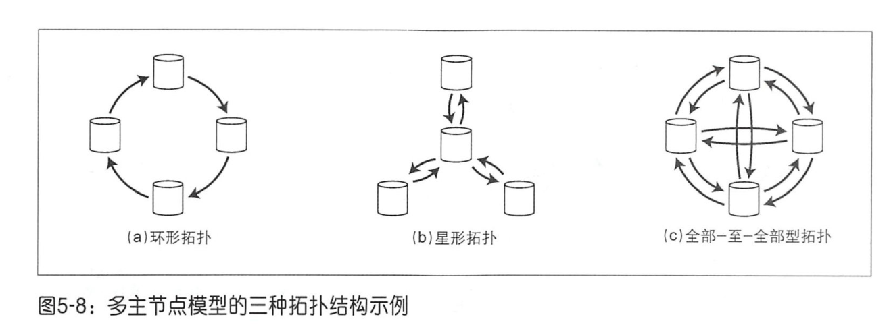

- 针对环形和星型的问题
  - **防止数据变更无限循环**：每个节点需要赋予一个唯一的标识符，在复制日志中的每个写请求都标记了已通过的节点标识符
    - 为什么 **全连接** 的不会？因为节点收到后不需要转发。
  - **防止节点故障对其他节点影响**：重新配置拓扑结构
- 针对全连接拓扑的问题
  - **复制日志到达乱序**，导致复制日志之间的覆盖。如下图
    - 原因：复制方向是散的
    - 解决：版本向量

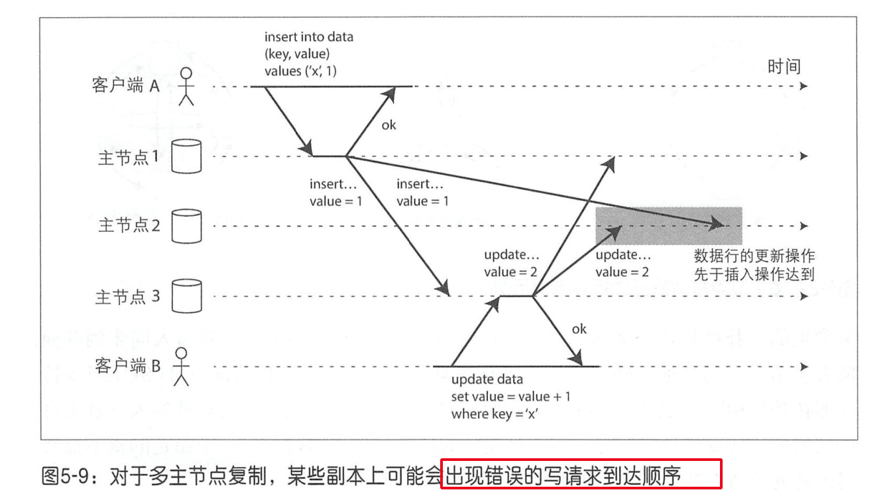

## 无主节点复制
- 亚马逊: **Dynamo系统**。使得无主复制流行。

### 失效节点与数据恢复
> 数据恢复
- 读修复
  - 被读到发现过期才更新
- 反熵修复
  - 一个后台进程查找副本间差异并修复。  

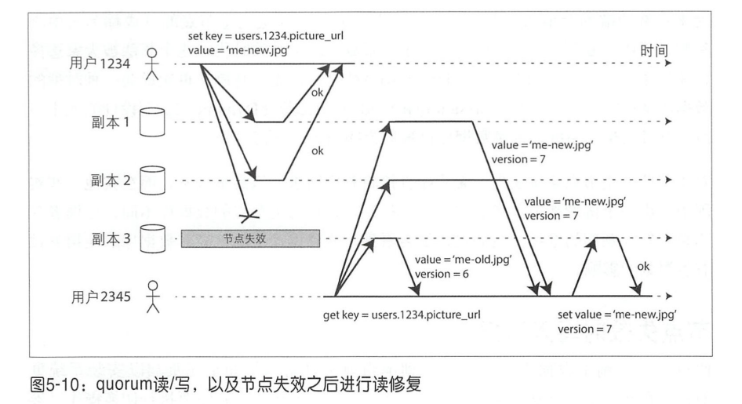

> 读写quorum
- 法定票数读/写
  - `n`：n个副本
  - `w`：写入需要w个节点确认
  - `r`：读取必须至少查询r个
  - **约束**：`w + r > n`，则读取的节点中一定有最新值。
    - **保证写读有重叠**。即成功写入的节点集合和读取的节点集合必然有重合。

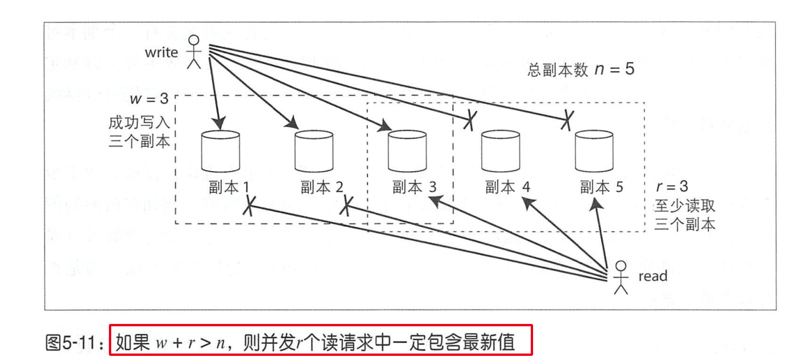

- 假设可用节点为`n*`，则
  - `n* >= w`：可写
  - `n* >= r`：可读
- 常见设置：设置n为某奇数（通常为3或5）, `w=r=(n+1)/2` （向上舍入）
  - 可以根据业务灵活配置。r越小读越快，w越小写越快

### Quorum一致性局限性
- 建议：**最好不要把参数w和r视为绝对的保证**，而是一种灵活可调的读取新值的概率。
- 一致性面临的问题：
  - 写冲突。（两个同时写）解决可以借鉴多主结构写冲突处理
    - 本质也是写无序
  - 写读同时。（注意不是写后读）在写的同时被别人读了，读取到的是新值还是旧值未知。
  - 写失败，但是不能回滚。写入的副本数少于w，失败了（不返回ok），但是在有些节点已经生效，不能回滚。
  - 存有新值节点失效，但是恢复数据来自某个旧值（还有这种情况？）。则总的新值副本可能低于w。（注：有点牵强啊）
  - `sloppy quorum`情况

> 监控旧值
- 主从结构做法
  - 因为**写入都是遵从相同的顺序**，每个节点都维护了复制日志执行的当前**偏移量**。
  - 监控主节点和从节点的偏移量差异就好了
- 无主结构做法
  - 写无序，监控困难。
  - 尚在研究。已有做法：根据参数 n, w和r来预测读到旧值的期望百分比（有兴趣再了解下）

- 作者：将旧值监控纳入到数据库标准指标集中还是很有必要。要知道，最终一致性其实是个非常**模糊**的保证，从可操作性上讲， **量化究竟何为“最终”很有实际价值**。
  - 后面体会

> 宽松的quorum（sloppy quorum）与数据回传
- 背景：网络故障可能导致一片节点失效，这个时候怎么让可用性更好？
- 容错能力并不是和期待的那样。**一个网络中断可以很容易切断一个客户端到多数数据库节点的链接。** 尽管这些集群的节点是活着的，但是对于网络异常的客户端，无疑等同于整体集群几乎失效。怎么办。两种选择
  - 1.告诉客户端出错
  - 2.放松的仲裁+数据回传。（sloppy quorum）
    - **放松的仲裁**：暂时先写入到其他可用节点（注：这些几点不再n的集合里），一旦网络好了就回传。（note：之前因网络而故障的节点，在故障期间不会新增数据吧）
    - **数据回传**：网络问题解决后，临时节点上的数据移交到原始节点。

- **sloppy quorum**
  - 优点：提高写的可用性
  - 缺点：一致性缺陷。即使`w+r>n`，也不能保证读到的一定是最新的。（注：sloppy quorum写入的可能暂时不被读到）
    - 很好说明 可用性 和 一致性 之间的矛盾（CAP)

> 多数据中心操作
- 两类风格
  - Cassandra和Voldemort数据库风格：
    - 客户端写入时，**发送到所有的副本**，但是只等待来自本地数据中心内quorum节点数的确认。（异步交给客户端）
  - Riak
    - 客户端写入时，发送限制在一个数据中心内，集群之间数据中心的复制通过后台异步运行（异步交给集群）

### 检测并发写(再谈写冲突)
- 写冲突情况：对**相同主键**同时发起写操作

- **本质**：写无序
- **核心问题**：网络延迟和局部失效，请求在不同的节点上可能会呈现不同的顺序

> 无主结构写冲突例子
- 节点2认为X的最终值是B ，而其他节点认为值是A

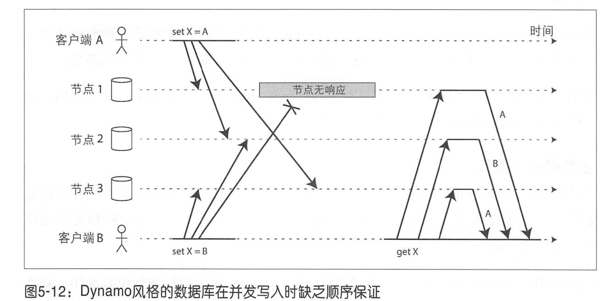

#### **方法1：最后写入者获胜（last write wins,LWW）（丢弃并发写入）**
- **关键点**：如何定义“最新”
  - eg:时间戳、事务计数
- LWW可以实现最终收敛的目标，但是以**牺牲数据持久性**为代价。
  - 并发写，最新的覆盖旧的
- 使用场景
  - 持久性要求不高：如缓存系统
- **确保LWW安全无副作用的唯一方法是**：只写入一次然后写入值视为不可变，这样就避免了对同一个主键的并发（覆盖）写（比如用UUID作为主键）。（在客户端看来，主键是Key，但是服务端存储时是用主键生成的UUID。）
  - note：KEY（用户视角），`/UUID/版本` 之间的关系思考下。
    - （KEY,版本号）===找到==》UUID===找到==》Value
#### **方法2：通过算法区分并发和Happens-before（全书重点之一）**
- **重点**：判断两个**涉及相同对象**的操作 是 **并发** 还是 **因果关系**
  - 注：比如这两个操作（记为A,B） 都对 x 进行写操作
- **因果关系**（`Happens-before`）：A 的操作发生在 B 的操作之前，B 的操作是基于 A 操作后的结果。下图为因果关系

- **并发**（无感知）：每个操作都不知道另一个操作也在 同一个对象 执行操作（图5-12，A和B互不知道，对方在操作）
  - **操作是否在时间上重叠并不重要**（时钟同步本身也难把握）。如果两个操作并不需妥意识到对方，我们即可声称它们是并发操作 

> 确定并发与因果关系
- 下面只是一个简单算法雏形，有些地方省略了，比如没有在写之前读，且是**单副本下的**
  - 写请求附带的版本，保证比其低的版本将被覆盖。**可以理解为 C 的请求，合并了 A 和 B 带来的分叉**，但是由于没有 写之前读，而是根据前一个写入返回的版本值，所以这里的分叉不会合并

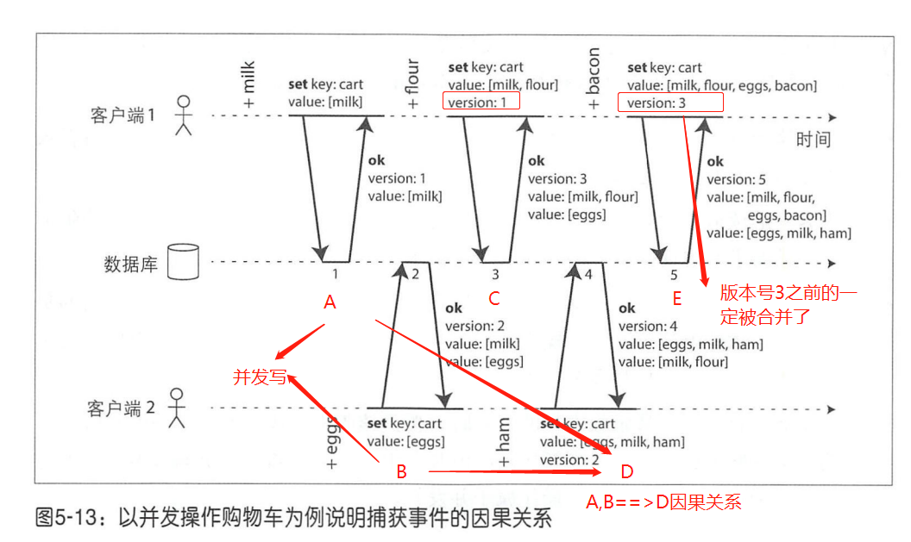

- 背后的因果关系如下所示
  - **并发 表现为 分叉**
  - **因果 表现为 箭头**

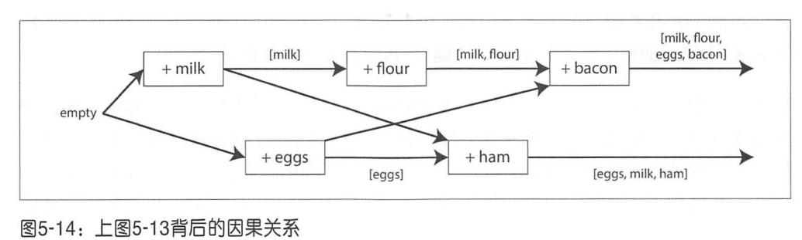

>  算法步骤：

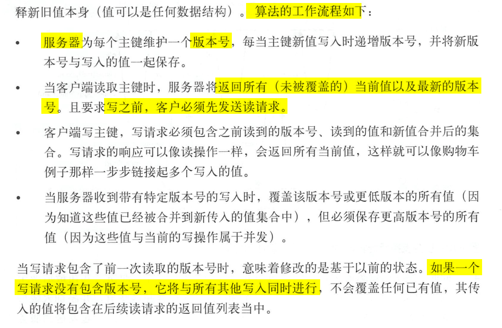

> 如何合并并发的分叉的
- 对集合union
  - 问题：删除怎么办，比如在 C 中删除 milk 在 D 中union之后，milk 又回来了.
    - 解决：通过标记墓碑。

> 版本矢量（难点，一个分布式研究方向）
- 将上面的算法放在**多副本**中。当多个副本同时接受写入时，版本号怎么处理。（涉及后面第九章的内容）
- 方法（详细在第九章讨论）：需要为每个副本和每个主键均定义一个版本号。每个副本在处理写入时增加自己的版本号，并且跟踪从其他副本看到的版本号。通过这些信息来指示要覆盖哪些值、该保留哪些并发值。
- **版本矢量**：所有副本的版本号集合
# 第六章：数据分区
- 分区：
  - 每一条数据（或者每条记录，每行或每个文档）只属于某个特定分区
  - 每个分区都可以视为一个完整的**小型数据库** ，虽然"数据库"可能存在一些跨分区的操作
  - **主要目的**：将**数据**（大小）和**查询负载**均匀分布在所有节点上
    - 不均匀===》倾斜===》出现系统热点
  - `数据<---映射(分区策略)--->分区<---映射(路由)--->节点`
- 考虑的问题
  - 数据怎么分区
    - 如何使数据和查询均匀
  - 索引怎么影响分区
    - 二级索引与分区
  - 分区再平衡
  - 节点路由
    - 服务发现

> 分区与复制
- 每个分区在多个节点存有副本。（小数据库就是了）
- 每个分区都有自己的主副本

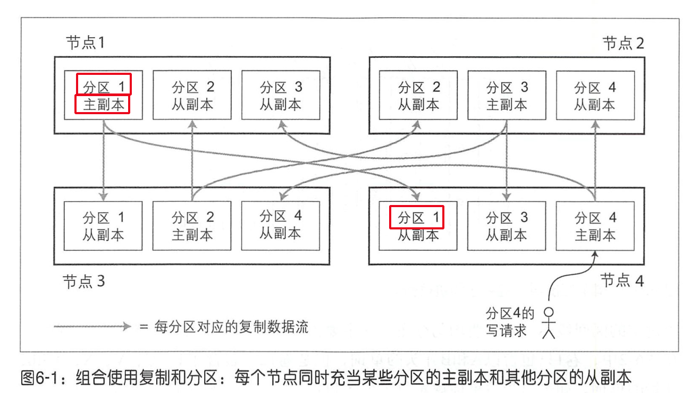

## 怎么分区
### 键值数据的分区
#### **基于关键字区间分区**

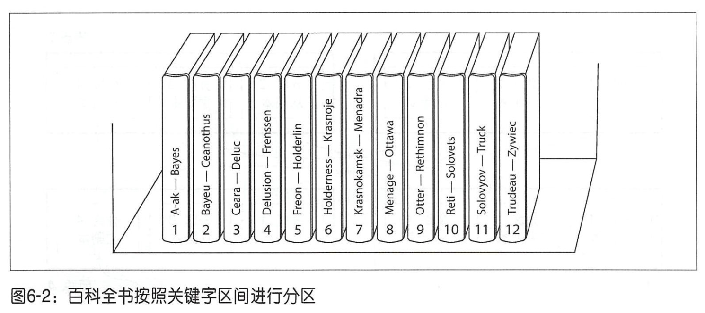

- 优点：轻松支持区间查询
- 缺点：容易导致热点。(如吴亦凡关键字)
  - 解决p192
#### **基于关键字哈希值分区**
- 优点：数据均匀，查询相对均匀（逃不过单关键字超热点，如吴亦凡）
- 缺点：丧失良好区间性

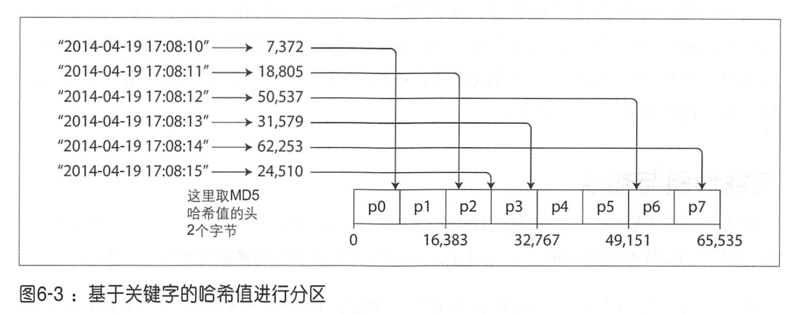

> 折中：组合索引
- 比如Cassandra：表可以声明为由多个列组成的**复合主键**。复合主键只有**第一部分可用于哈希分区**，而其他列则用作组合索引来对Cassandra SSTable中的数据进行排序。
  - eg：（user_id,update_timestamp）,不同的用户可以存储在不同的分区上，但是对于某一用户，消息按时间戳顺序存储在一个分区上。

> 哈希分区无法完全避免热点
- 比如超热关键字
  - 解决：通过应用层。一个关键字后加个东西，让他在数据库看来不是同一个关键字。
    - 缺点：读需要从多个分区读，后合并

## 分区与二级索引
- 二级索引技术也是 Solr 和 Elasticsearch等全文索引服务器存在之根本
  - 看的时候，有些东西的理解可以从全文索引数据库的角度去想
- 二级索引带来的主要挑战是它们**不能规整**的地映射到分区中
  - 这一块那一块的

### 基于文档分区的二级索引
- 每个列表都有一个**唯一的文档ID**，用此ID对数据库进行分区
- 每个分区**完全独立**，**各自维护**自己的二级索引
- 检索方式：**分散/聚集**
  - 如果想要搜索红色汽车，就需要将查询发送到所有的分区，然后合并所有返回的结果。
  - 缺点：**读放大，读取低效**。即使采用并行，也会容易导致读延迟显著放大（性能受置于最慢的）

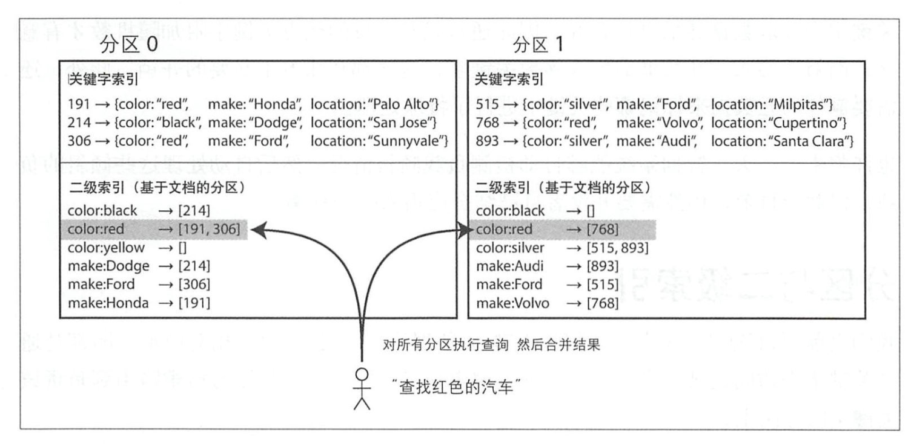

### 基于词条的二级索引分区
- 对所有的数据**构建全局索引**
- 全局索引也必须进行分区
  - 分区方式同键值数据分区
- 优点：读取更为高效
- 缺点：写入速度较慢且非常复杂。
  - 一个文档更新，涉及多个二级索引，二级索引分区可能在不同节点上，**写放大**。**所以现有的数据库都不支持同步更新二级索引**
- 实践中，对全局二级索引的更新往往都是异步的

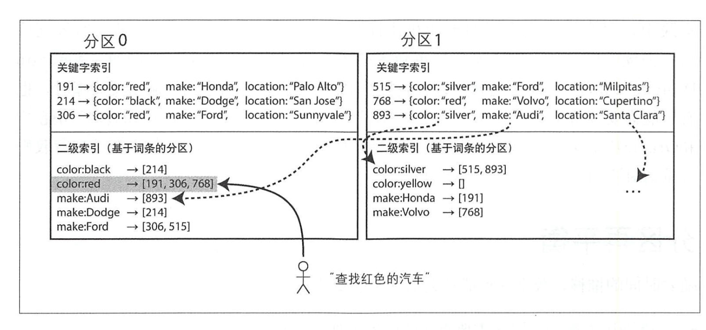

## 分区再平衡
- 针对的是负载。
- 原因：1.压力增加，加节点；2.数据规模增加，加节点；3.故障了，加节点；===》节点变化===》数据迁移
- **再平衡**：迁移负载的过程称为再平衡。
- **基本要求**
  - 要能正常读写
  - 要比原来更加的均匀
  - 要减少不必要的迁移。eg：**为什么hash之后不取模**
- **动态再平衡的策略**
  - 固定数量的分区
  - 动态分区
  - 按节点比例分区
- 自动还是手动再平衡
  - p201

### 固定数量的分区
- **特征**：**分区数量固定**。
  - 分区的大小和数据集大小成正比
- 方案：
  - 首先，分区数 远大于 节点数，然后为每个节点分配多个分区。
    - 如：10节点，1000分区，每节点100个分区（主分区）
  - 接下来，如果增加节点。从其他节点随机拿分区，直到再次平衡。
- 优点：简单。这里唯一要调整的是路由关系。
- 局限：
  - **分区数难定**。如果数据集的总规模高度不确定或可变（例如，开始非常小，但随着时间的推移可能会变得异常庞大）， 此时如何选择合适的分区数就有些困难。
  - **关键字区间分区边界设置 难定**。
    - 搞不好热点严重

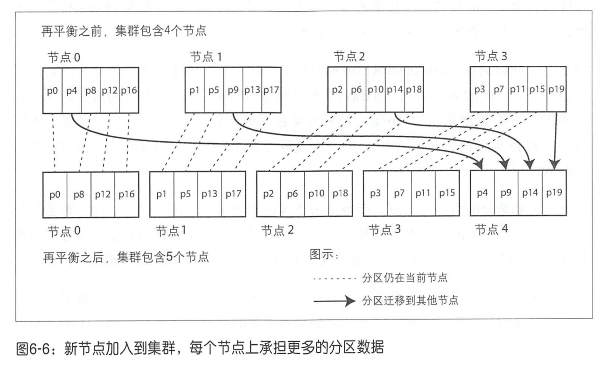

### 动态分区
- 特征：分区数动态
  - 分区数量和数据集大小成正比
- 方案
  - 给一个初始分区（预分裂）：避免前期都往一个分区挤
  - 拆分也阈值
  - 合并也阈值

- 优点：自适应
- 缺点：复杂

- 哈希分区和关键字区间分区都可以
### 按节点比例分区
- 特征：分区的数量与节点数成正比（前面两种都无关）
  - 每个节点具有固定数量的分区
  - 节点数不变，分区大小与数据集大小成正比。
  - 节点增，分区大小变小
- 方案
  - 新节点加入，随机选择固定数量的现有分区进行**分裂**，然后**拿走这些分区的一半数据量**，将另一半数据留在原节点
- 前提：基于哈希分区（可以从哈希函数产生的数字范围里设置边界）
  - 注：可以看出，这个时候如果算hash的时候mod分区数来分区，就gg了

## 请求路由
- **本质**：服务发现问题
- 三种方式

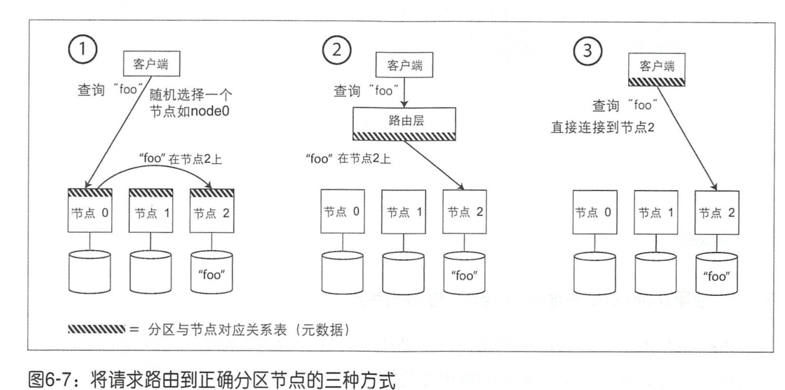

> 依靠独立的协调服务（如ZooKeeper）

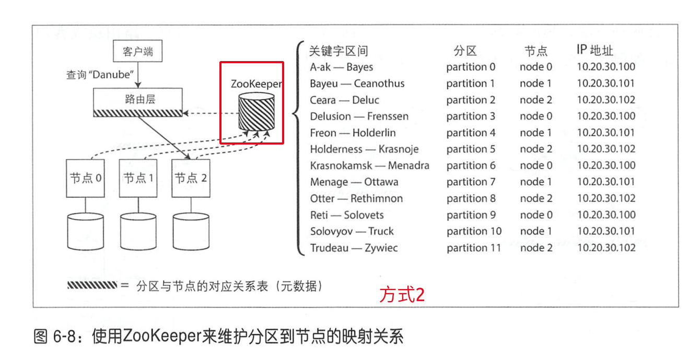

> 节点之间使用gossip协议同步群集状态的变化
- 方式1
- p203

# 第七章：事务
- 目的：简化应用层的编程模型
## ACID
- `原子性`：可以终止。要么全部提交，要么都终止
- `一致性`：保持某种状态的恒等
- `隔离性`：多个事务互相隔离，多个事务不能交叉。
  - 假装它是数据库唯一的事务
- `持久性`：事务一提交，东西就不会丢。

## 读提交
- 脏读：事务不会读到其他事务未提交的数据。防止的问题：
  - 万一其他事务没提交成功，回退了。
  - 等等问题，下同
- 脏写：事务不会覆盖其他事务未提交的写。

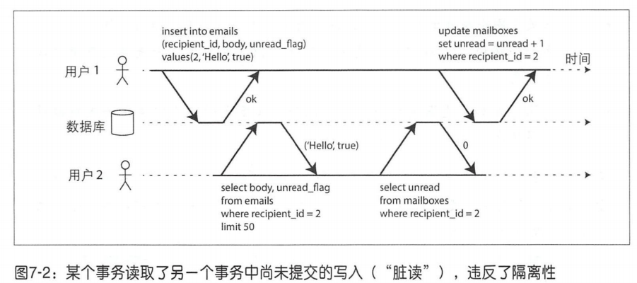

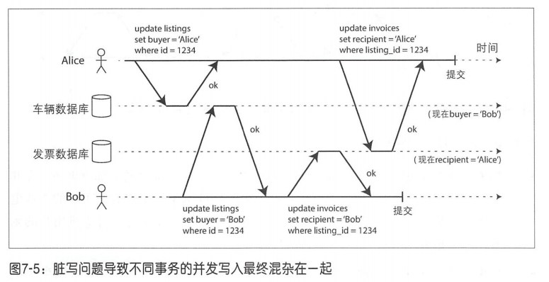

- 读提交可以保证不会出现脏读和脏写
  - 脏读解决：
    - 提供两个版本，一个新版本，一个旧版本。
  - 脏写解决：
    - 锁。行锁、表锁等等

## 快照级别隔离（可重复读）
- **读倾斜**：前后读取，一致性不对。
  - eg：下面的图7-6
  - eg：OLAP
  - eg：备份
  - 特征：长时间的读事务
  - 问题：读到时，无法知道是新值还是之前的旧值

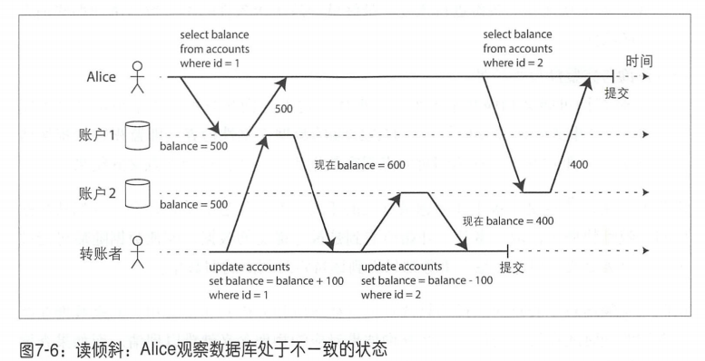

- **快照隔离级别** 解决读倾斜问题。典型做法为 **MVCC（多版本并发控制）**
- MVCC：如下所示，引入事务ID，每次修改后都在数据后面附上事务ID，然后有一个**当前还没提交的事务id表**，然后通过这个机制可以实现可见性规则。

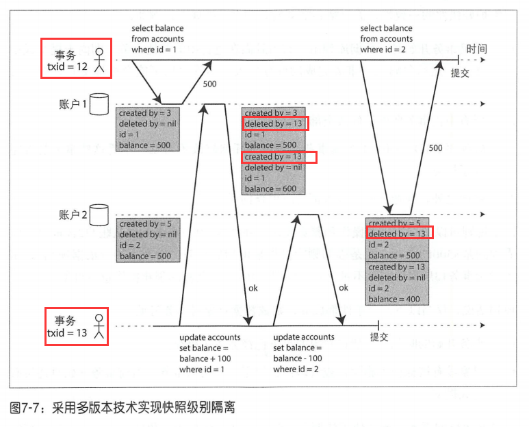

- 可见性规则，仅当这两个条件都成立，才可见。
  - 事务开始时，创建该对象的事务已经提交了。
    - 说明只要这个事务开始时，在 **未提交事务id表中** 的所有事务的修改在今后无论多久都看不到
    - 后面才开始的所有事务的修改也都看不到
  - 对象没有被标记为删除；或者即使标记了，但删除事务在当前事务开始时还没有完成提交

- 怎么实现，三种方式
  - 索引直接指向对象的所有版本（链表连接），内部引擎进行不可见处理，后台回收垃圾
  - 同一对象不同版本直接放在一个内存页面上
    - 避免更新索引。PostagreSQL
  - 写时复制。
    - 修改时不会修改原来的索引，而是copy索引中根（根带上事务ID，以便标识）到该节点的东西。

### 更新丢失
- 前面主要都是解决读事务遇到的问题，下面主要关于并发写发生的问题。
- **更新丢失**：read-modify-write的情况。读了之后处理完写回。并发写会覆盖，有些可重复读级别没法保证

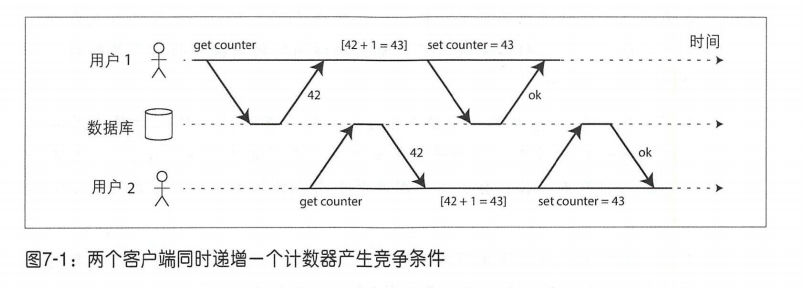

- 处理：
  - 原子写操作：`UPDATE counters SET value = value + 1 WHERE key ＝'foo'；`，这种在很多数据库中是并发安全的，数据库提供的**原子更新操作**。
    - 最佳选择
    - 局限：不是所有情况都符合，有些modify比较复杂
      - 比如多个用户同时修改维基百科页面
  - **显式加锁**：连读也不让对方读的那种
    - 局限：其他事务必须等等等，慢
  - **自动检测更新**：在快照级别隔离下可以防止 更新丢失
    - 支持的：postgreSQL，Oracle
    - 不支持的：MySQL/InnoDB
  - **原子的比较和设置**：如果当前和之前的没变化，则可以写
    - 注意：如果 `WHERE` 语句是运行在数据库的某个旧的快照上，即使另个并发写入正在运行，条件可能仍然为真，最终可能无法防止更新丢失问题。
  - **冲突解决与复制**：不覆盖，而是并存，互称兄弟。下次让应用层或者用户来决定

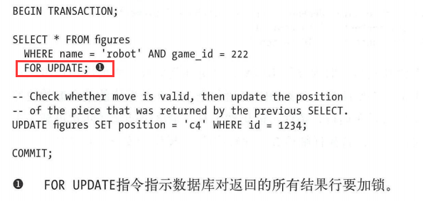 显式枷锁

 原子的比较和设置

### 写倾斜与幻读
- 个人觉得： **幻读** 包括 **脏读，读倾斜，写倾斜**
- 幻读：一个事务中的写入改变了另一个事务查询的结果，就称为幻读。
  - 我觉得这个定义相当的广。**而感觉网上很多都是把写倾斜当做幻读。**
- 写倾斜：不是脏写，也不是更新丢失，它们都是因为更新**同一个对象**引起的。两个事务都是**更新的不同的对象**，这里的冲突不是那么直接
  - eg；医生值班，至少要留一个，当只有两个人的时候，同时退了（如果count>=2，删了自己），而且成功了。
  - eg；预约会议室
  - eg：账户不重名
  - ...

- **产生写倾斜特征**：查多个对象---->判断(不是modify)----->修改对象（可能一个）

> 解决方案1：通过SELECT FOR UPDATE
- 注：select for update：是一种行级锁，排它锁
- 可以对医生的那种情况（特征，查询的时候结果不为空，可以加锁）
- 问题：预约会议室的没有东西，怎么SELECT FOR UPDATE
  - 没有我们就想办法实体化——**实体化冲突**
  - eg；对于会议室预订的例子，构造一个时间，房间表，表的每 行对应于特定时间段（例如最小15分钟间隔）的特定房间。我们提前，例如对接下来的6个月，创建好所有可能的房间与时间的组合。
- 其他解决方案：**串行化（更高的隔离级别）**

## 串行化
- 主要有三种实现技术
  - 严格按照串行顺序
  - 两阶段锁（2PL）
  - 乐观的并发控制技术，eg：可串行化的快照隔离

### 严格按照串行顺序
- 大致思路：存储过程 + 内存 + 单线程
- 单线程嘛。现在内存成本低，数据直接放内存，然后当线程处理起来速度也挺不错的，但是前提还是得处理短事务。
  - eg：redis
- 方式：**将事务封装在存储过程**，而让引擎调度的时候，存储过程是粒子的。
  - 注：现在许多存储过程都可以接脚本，或者java等语言。比以前好用
- 我不想单线程可以吗，我要利用多核
  - 可以，只要你能够很好的把数据 **分区**。每个分区都有一个独立的线程来跑任务。
    - 跨分区的事务，锁挺昂贵

- 这种方式的业务特点：  
  - 事务要短。不能支持交互式的事务
  - 数据量少，内存放得下
  - 写的吞吐量要足够低，不然就分区
  - 可支持跨分区事务，但是占比必须小

### 2PL
- 描述：**加锁和解锁分为两个阶段进行**
  - 扩张阶段：不断上锁，没有锁被释放
  - 收缩阶段：锁被陆续释放，没有新的加锁
- 锁的机制想成读写锁的机制就好了。然后下面主要围绕了锁的粒度来讨论效率

> 谓词锁
- 不是针对于某个特定的对象，而是针对 `字段 + 条件`
  - 机制还是读写锁机制。只是根据 读取或写入 设置的条件，去一个个匹配锁。
- 将两阶段加锁与谓词锁结合使用，数据库可以防止所有形式的斜以及其他竞争条件，隔离变得真正可串行化。

- 问题：谓词锁性能不佳 如果活动事务中存在许多锁，那么检查匹配这些锁就变
得非常耗时。
> 索引区间锁
- 谓词锁性能不佳 如果活动事务中存在许多锁，那么检查匹配这些锁就变得非常耗时。
- 思路：保护对象扩大。我锁的粒度不要太细了，大一点。
  - eg: `id = 3` ===》 `id <=3`
- 如果没有合适的索引可以施加区间锁，则数据库可以回退到对整个表施加共享锁。

### 可串行化的快照隔离
- 乐观和悲观
  - 一种乐观的态度，先读先写，出错了再来控制。
  - 悲观态度：我怕出错，我预防出错。
  - 就是一种处理并发写的一种态度，不是具体的锁。
  - 性能：
    - 乐观好：如果系统还有足够的性能提升空间，且如果事务之间的竞争不大，乐观并发控制会比悲观方式高效很多。
    - 悲观好：如果冲突很多，则乐观锁性能不佳（许多事务试图访问相同的对象），大量的事务必须中止。如果系统已接近其最大吞吐量，**反复重试事务会使系统性能变得更差**。

- SSI：可串行化的快照隔离
  - 思路：数**据库假定对查询结果（决策的前提条件）的任何变化都应使写事务失效。因为查询与写事务之间可能存在因果依赖关系（个人：最后有点悲观啊）**。
    - 其实就是记录，先提交先赢

- **如何知道查询结果已经改变了，主要是两种情况**。
  - 读取之前已经有了未提交的写。（**检测是否是即将过期的MVCC对象**)
  - 读取之后，有新的写入。(**检测写入是否影响其他的即将完成的读取**。)
- 性能：
  - 与两阶段加锁相比，可串行化快照隔离的一大优点是事务不需要等待其 事务所持有的锁。
  - 与串行执行相比，可串行化快照隔离可以突破单个CPU核的限制。
  - ，事务中止的比例会显著影响SSI 的性能表现。比如一个很长的事务，有读有写，提交很容易失败，如果在写很多的情况下。
#### 检测是否是即将过期的MVCC对象

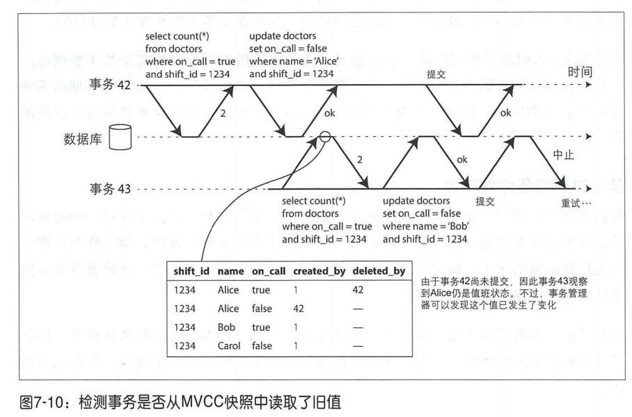

- **当事务提交时**，数据库会检查是否存在一些当初被忽略的写操作**现在已经完成了提交**，如果是则必须中止当前事务。
  - **为什么是提交时，而不是一检测到读旧值就停止**：
    - 为了更高效
    - 因为可能只是单纯的读取，当读取到旧值时，还不知道后面有没有写。就算后面有写，**也可能事务42终止了，或者还处于未提交**。

#### 检测写入是否影响其他的即将完成的读取

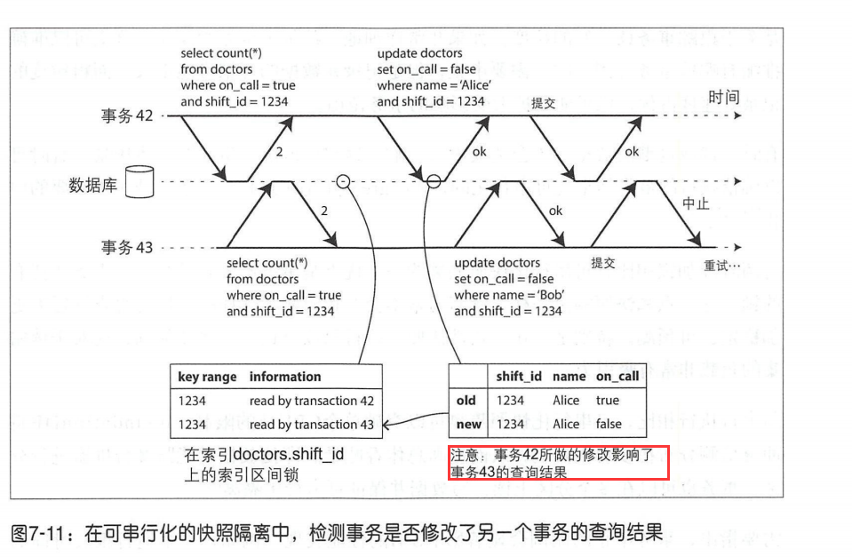

- 与索引区间所有点像，只是这里不会阻塞
- 谁先提交了就赢。

- 事务43和事务42会互相通知对方先前的读已经过期（在update的时候）。虽**然事务43的的修改的确影响了事务42，但事务的当时并未提交（修改未生效）**。而**事务42首先尝试提交，所以可以成功**；随后当事务43的试图提交时，来自 42 的冲突写已经提交生效，事务的不得不中止。