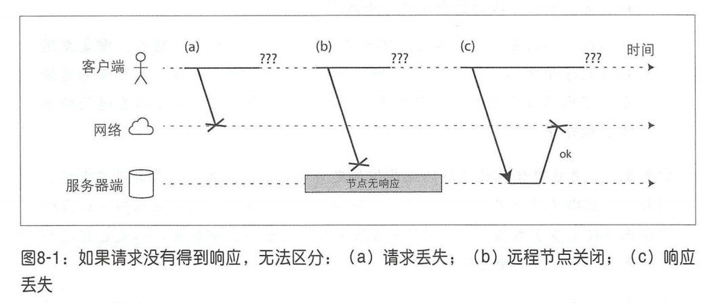
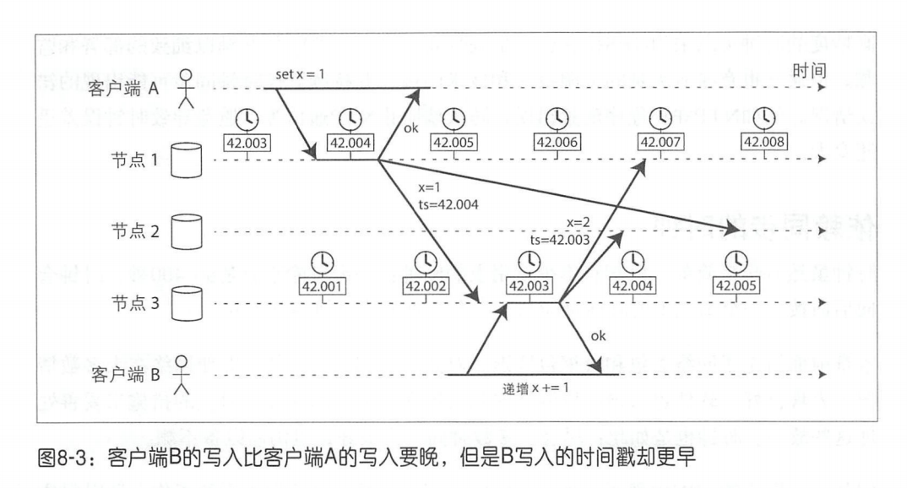
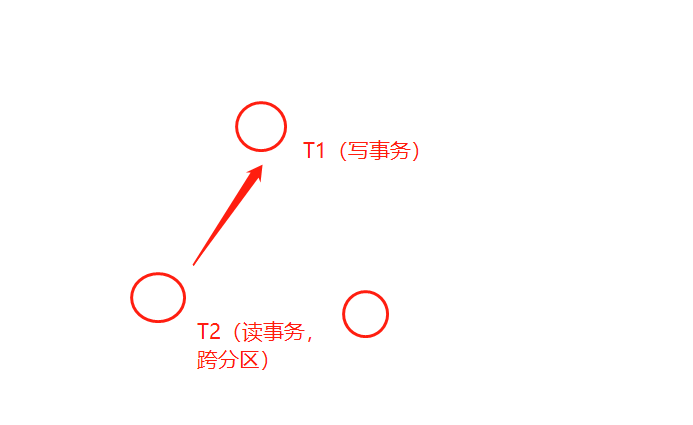
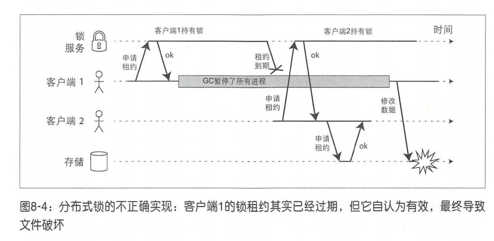
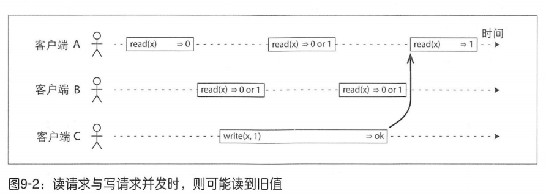
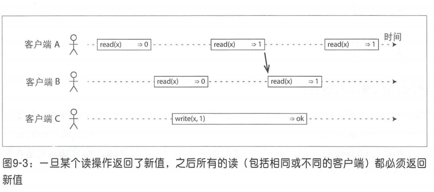
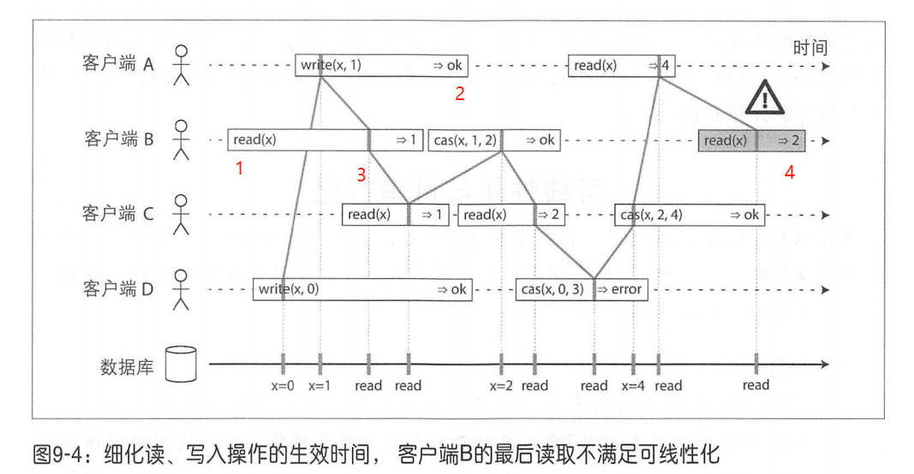
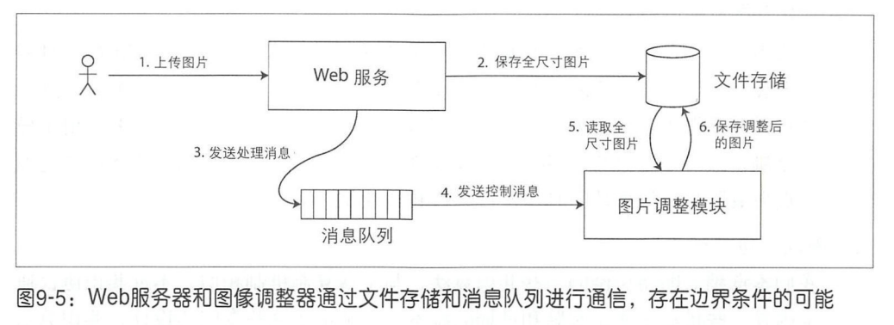
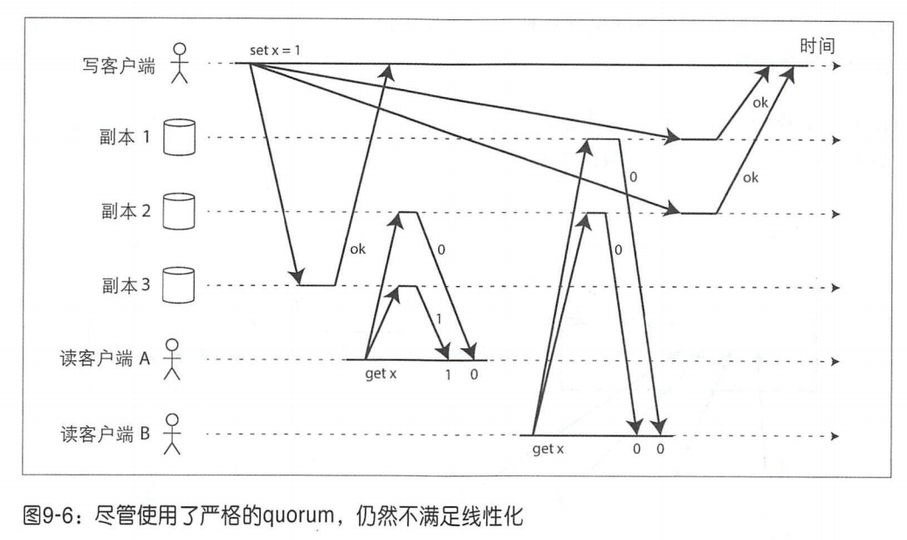
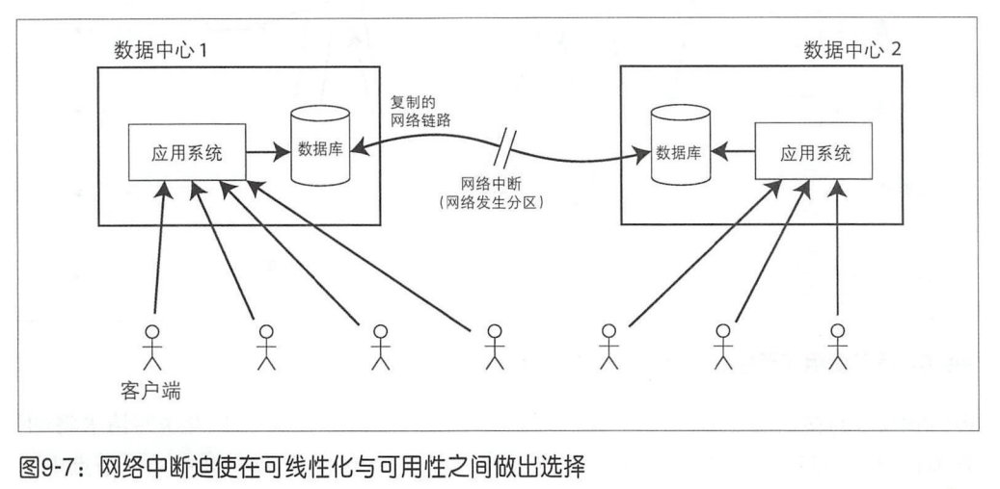

# 第八章：分布式系统的挑战
> 解决分布式问题所面对的场景
- 用户需要**随时**的**低延迟**。(即不能停下集群)
- 基于成本低廉的硬件设施，局部的**故障概率高**
  - 需要系统可以容忍某些失败，达到高可用，减低运营成本。但是**不可能完美高可用**
- 总结：需要对系统足够的悲观。

## 不可靠的网络
- 意识：只要有网络通信，就可能出现故障，不可以避免的。
> 出错的几个阶段：
- 发送阶段：丢包，延迟等
- 服务端处理阶段：服务器宕机，服务进程挂了等
- 相应阶段：丢包，延迟等

> 超时应该设置多长
- **超时是故障检测唯一可行的方法**。多长能够宣告节点失效？
  - 如果能够知道响应的最大时间界限，那么可以很容易确定。（但现实不可能）
  - 只能通过实验去验证多长合适。

> 网络为什么延迟？
- 网络延迟的根源往往来自于：**排队**
  - 发送时，发送窗口排队
  - 交换机、路由器排队
  - 系统处理排队

> 无限延迟意识（悲观态度）
- 理想（硬件层面去保证，软件层面就不会很复杂了）：如果可以规定延迟内保证完成数据包的发送，且不会丢包，那么分布式系统就会简单很多。（个人觉得处理时间界限也要可知）
  - 电话电路就趋近于这种理想状态，可以保证有界的延迟，因为足够稳定，**预留了电路，没有排队**。

- 为什么不用电路交换网络？
  - 现有的协议本身是基于分组交换的协议
- 为什么不换协议
  - 那多大的固定带宽合适呢。分组交换对突发流量做了很多优化。
  - 矛盾点

## 不可靠的时钟
- 硬件：通常是石英晶体振荡器
- 计算机上的两种时钟
  - 墙上时钟
  - 单调时钟

> 墙上时钟
- 通过 `clock_gettime(CLOCK_REALTIME)` 获取到
- 可以与**NTP同步**
  - 时间服务器从精确更高的时间源获取高精度时间
- NTP同步 的时候可能出现回跳（跳回之前的时间点），以及忽略闰秒等问题
  - 导致不太适合测量时间间隔

> 单调时钟
- 通过 `clock_gettime(CLOCK_MONOTONIC)` 获取到
- 保证总是向前
- 其绝对值没有意义，意义在于测量时间间隔
- 单个CPU可能有单独的计时器，线程可能调度到其他CPU上，不过操作系统会做计时器偏差补偿，但是最好还是对这种偏差补偿持有谨慎态度
- **NTP不改变其时间**，但是如果检测到比时间服务器上更快或者更慢，则会调整 **石英的震动频率**。

### 时间戳问题demo——多主节点
- 多主节点中，每个分区有多个主节点
- 如果节点2通过时间戳来判断事件的先后，将导致一致性的破坏
- 解决：使用逻辑时钟，比如一个递增的量（体现事件先后顺序）

### 时钟同步和准确性
- **同步时并非预想的那样可靠、准确**
- 原因：
  - 石英钟不稳定，存在漂移。（温度相关）
  - 网络延迟（实验表明，至少35ms，最坏还可能超过1s）
  - 其他：
    - 防火墙设置等原因导致长时间无法与ntp服务器同步，但是很难发现。
    - ntp服务器的不确定性
    - 等等
- 高精度时钟的方式：采用GPS接收机，精确时间协议（PTP）
  - 门槛高（技术、资源）

### 时钟的置信区间
- 重点：**不应该将时钟读数视为一个精确的时间点，而更应该视为带有置信区间的时间范围**
  - eg：系统可能有95%的置信度认为目前时间介于 10.3 ~10.5 秒之间
  - Google Spanner中的`TrueTime API`，就会报告本地时钟的置信区间。
    - 得到两个值`[不早于, 不晚于]`

### 全局快照的同步时钟（重点）
- 背景：**跨数据中心的分布式事务ID维护成本高**。在MVCC中需要维护一个 事务ID，在**多主节点**的分布式系统中，事务ID需要复杂的协调才可以得到，这样的话在分布式中 事务ID 将成为系统的瓶颈。
- 需求：**可不可以把墙上时钟作为事务ID？**
  - 困难：不确定同步、 不可靠

- **Google Spanner** 的做法：根据 `TrueTime API` 返回的时钟置信区间(`A=[A1,A2]` 和 `B=[B1,B2]`)
  - 只要`A1 < A2 < B1 < B2`就可以断定B一定发生在A之后
  - Spanner 在提交读写事务之前故意**等待置信区间的长度**。
    - 保证所有读事务在足够晚的时机发生。eg：比如一个很短的写事务，时钟置信区间为 `[T1,T2]`，可能在 T2 之前，该写事务就完成了，那如果现在有一个在另一个数据中心发起的事务，时钟置信区间和`[T1,T2]`有重合，那么怎么办。通过延长提交，可以避免这种情况，让此事的读事务，看到的是一个虽然置信区间重合，但是还没提交的写事务。
  - 尽量缩短潜在的等待时间====>使用GPS接收器或原子钟，保证同步在 7ms 内

### 时间戳问题demo——单主节点，进程暂停（重点）
- 单主节点：每个分区只有一个主节点
- 背景：确认主节点的一种方式是，主节点获得一个租约（分布式锁），然后不断的周期续约保活，如果主节点宕机，租约消失就可以知道主节点失效了，则从新选举一个主节点。
- 问题：**进程暂停 会让分布式系统 脑裂**。
  - 比如在 isValid 调用时，该线程被切出去，导致isValid运行了15s，这个时候很可能 租约 过期了，出现两个主节点（一个是自以为的）

- 进程暂停的情况：
  - GC。gc可能有时候持续数分钟
  - 虚拟化。调度策略可能会比较长暂停虚拟机（比如虚拟机在主机中迁移，或者高负载下长时间得不到调度）
  - 系统
    - 在续约线程中出现 长时间IO阻塞。
    - 内存压力大，大量和swap交换，大量缺页，导致实际工作完成很少（颠簸）。所以为了避免此类问题，通常服务器上禁用分页。（淘汰内存页直接丢弃就好了，不用再store到磁盘，只用load进来就行了，一次IO）
    - SIGSTOP信号，`ctrl + z`
- 意识：**不能假定任何有关时间的事情**
  - 分布式系统中的个节点**必须假定，执行过程中的任何时刻都可能被暂停相当长时间**，包括运行在某个函数中间。

> 响应时间保证
- 必要性：如航空等领域
- **实时操作系统**，可以在指定时间内完成任务。要以下支持
  - 保证给定的时间间隔内完成CPU时间片的调度
  - 库的支持，要考虑最坏的执行时间
  - 动态内存分配限制（保证不会太多GC时间）
  - 充分的实验和验证
  - 注：以上对于大多数服务器程序并不经济

- 调整垃圾回收的影响。
  - p282

## 知识、真相与谎言
- 分布式算法的研究方法：
  - 明确列出对系统行为的（**系统模型**）若干假设，在此基础上讨论问题
  - 然后以**满足这些假设条件为目标**，构建实际运行的系统
  - 在给定系统模型下，可以**验证算法的正确性**

### 真相由多数决定
- **意识：节点不能根据自己的信息来判断自身的状态**。
  - 由于节点可能随时会失效，可能会暂停－假死，甚至最终无法恢复
  - 采用 **定票数**，节点之间投票，**真相掌握在多数**

> 主节点和锁
- 只能有一个实例的例子
  - 主节点
  - 事务锁
  - 唯一标识

- 即使某个节点自认为它是“唯的那个”，但不一定获得了系统法定票数的同意！
- **自以为唯一** 的情况，如果系统设计不周，会很麻烦，如下所示（HBase曾遇到的问题，也是 **进程暂停** 导致的）

- 解决：Fencing令牌
  - 机制：获得租约(上锁)了之后，得到一个递增的令牌。如果服务端发现已经处理过更高令牌的请求，要拒绝持有低令牌的所有写请求。
  - eg：Zookeeper中，事务标识zxid可以作为fending令牌

### 拜占庭故障
- 之前的算法都是基于节点是**诚实的**而设计的，如果节点存在 **谎言**，分布式系统处理的难度就上了一个台阶
  - 本书不讨论
- **拜占庭式容错系统**：如果某个系统中即使发生部分节点故障，甚至不遵从协议，或者恶意攻击、干扰网络，但仍可继续正常运行，那么我们称之为拜占庭式容错系统

### 理论系统模型与现实
- 分布式算法的实现不能过分依赖特定的硬件和软件配置，需要**对预期的系统错误进行形式化描述**。

> 计时方面的常见系统模型
- 同步模型
  - 进程暂停、时钟误差、网络延迟，有**固定上界**
- 部分同步模型
  - 有固定上界，但是**有时候会超出**
- 异步模型
  - 没有任何假设。支持该模型不常见

> 节点失效方面的系统模型
- 崩溃－中止模型：
  - 崩溃了，无法恢复
- 崩愤－恢复模型
  - 崩溃了，可以恢复
  - **最普遍的建模**
- 拜占庭（任意）失效模型
  - 节点可能发生任何事情，包括欺骗

> 算法的正确性
- 为了定义算陆的正确性，**可以描述它的属性信息**。
  - p290

> 安全与活性
- p290
  

# 第九章：一致性共识
- 主题：构建容错式分布式系统的相关算法和协议。
- 方法论：先建立一套通用的**抽象机制**和与之对应的技术保证，这样只需实现一次 ，其上的各种应用程序都可以安全地信赖底 的保证
  - 屏蔽底层的复杂性，只需要实现一次，做抽象，上层应用进行调用
  - 例子
    - 事务 <——抽象—— ACID的复杂性
    - **共识** <——抽象—— 分布式复杂性
- 分布式系统最重要的抽象之一就是**共识**

## 一致性保证
- **最终一致性**
  - 非常弱的保证。就是最后会 **收敛** 到一致
  - 态度：不能太乐观，几小时都没一致都有可能。
- 更强的一致性需要更多的代价，比如容错差，效率低。
- **事务隔离级别 和 分布式一致性模型**（有相似之处）
  - 事务隔离级别：为了处理 **并发**执行事务的各种临界条件
  - 分布式一致性模型：根据 **故障和延迟等** 问题，协调副本之间的状态

## 可线性化
- 可线性化（原子一致性，强一致性）：最强的一致性保证。对上提供只有 **单个副本** 的假象，让每个客户端看到的都是 **相同的视图**，且所有的操作都是 **原子的**。
  - 一旦某个客户端成功提交写请求 ，所有客户端的读请求一定都能看到刚刚写入的值

### 可线性化的理解

> 理解示例1：
- 与写操作有时间重叠的任何读取操作可能返回 0 或者 1。
- 如果与写并发的读操作可能返回旧值或新值，那么在这个过程中，**不同的读客户端会看到旧值和新值之间来回跳变的**（故非线性化）。

> 理解示例2：
- **线性化精确描述**：一旦某个读操作返回了新值之后所有的读（包括相同或不同的客户端）都必须返回新值
  - 必须是**单调的**，而不能让客户端看到旧值和心智之间跳变的情况。

> 理解示例3:
- 从更微观的角度
  - 写操作的开始与结束之间，肯定有一个**时刻**，让x值发生变化
- 注：`cas(x, v_old, v_new)`

- 注1：B的请求有延迟。导致 B的读发生在 A、C 的写后面
- 注2：A收到的响应有延迟。导致 A 的写被B读了，自己还没收到响应
- 注3：该分布式模型不考虑事务的隔离，比如3的位置，就算是并发的读写，也不考虑 锁 等东西
- 注4：B 的最后一个读是一个**违反 可线性化** 的例子，因为这个时候A已经读到了新值，那么之后发起的所有读请求就应该读到新值

> 可线性化和可串行化

- 可串行化
  - 眼界：主从模式
  - 确保事务执行的结果和串行执行的结果完全一样。
- 可线性化
  - 眼界：跨数据中心
  - 读写寄存器(单个对象)的最新值保证。
  - **并不要求将操作组合到事务中，所以无法避免写倾斜等问题**
- 数据库可以同时支持可串行化与线性化，这种 组合又被称为严格的可串行化或者强的单副本可串行化

### 依赖线性化的场景

> 加锁方式的主节点选举
- 主节点选举
  - 范围：节点层面的锁
  - 如果不满足 可线性化，会容易出现脑裂
    - 强一致性的组件：Zookeeper、Etcd，常用来实现分布式锁和主节点选举。其使用了 **支持容错的公式算法** 确保了可线性化
- 有一些分布式数据库（如Oracle Real Application Clusters (RAC)），锁有更细粒度。
  - RAC 每个磁盘页面均设置一把锁 ===作用===> 支持共享访问存储系统（分布式文件系统）

> 约束与唯一性保证
- 业务上如 用户名、电子邮件 需要保证唯一性，标识一个用户
  - 用户注册等同于试图对用户名进行加锁操作。该操作也等同原子cas。（看存在不，不存在上锁）

> 跨通道的时间依赖
- Web服务器和调整模块之间存在两个不同的通信通道：**文件存储器和消息队列**
  - 可能造成消息队列比文件存储快，从而导致调整图片的时候，文件存储中还未存在

### 复制方案与线性化(有难度)
- **主从复制**：如果从主节点或者同步更新的从节点上读取，可以满足**线性化**。但并非每个主从 复制的具体数据库实例都是可线性化的，**主要是因为它们可能采用了快照隔离的设计，或者实现时存在并发方面的bug**。（note：不理解）
- **多主复制**：无法线性化，因为每个数据中心的主节点是异步复制，同时在多个节点上更新。
- **无主复制**：可能不是线性化的
  - **最安全的假定是类似Dynamo风格的无主复制系统无法保证线性化**。
  - 牺牲性能满足线性化方式：
    - 读操作返回结果前，同步执行读修复（只能支持线性化读写，无法支持线性化的cas）（note：不理解）

### 线性化的代价
- **可用性与一致性（线性化保证）**
  - 如果是多主结构，那么肯定线性性无法保证
  - 如果是主从结构，数据中心网络中断
    - 如果选择可用性，那么无法保证线性化。
    - 如果要保证线性化，那么不在主节点所在中心的客户端，无法正常读写，损失可用性。

### CAP理论
- CAP理论：一致性，可用性，网络分区。
  - 应该这么理解：
    - 网络分区是一种故障，不管喜不喜欢都可能发生。
    - **CAP探究的是，当网络分区出现时，是保证一致性还是可用性**。
    - 在网络正常的时候，一致性和可用性都是可以同时保证的。
- 目前 CAP 已被更精确的研究成果所取代，所以它现在更多的是代表历史上曾经的一个关注热点而已。
- 事实上，许多分布式数据库不支持线性化是为了提高性能，而不是保住容错特性

## 顺序保证
- 线性化（单一副本+操作原子性）===>意味着操作在整个分布式系统的角度看是按照某种顺序。
- **因果关系对所发生的的事件施加了某种顺序**。
  - 如果系统服从因果关系所规定的顺序，称之为**因果一致性**。
    - 比如：**快照隔离**提供了因果一致性（note：但是不是线性化的，比如一个很大的读事务A，中间过程有一个很小的写事务B，A和B都读一个对象 x ，但A比B晚。由于快照隔离，**B读到了新值，A读到了旧值，违反了线性化**）

### 全序与偏序
- 全序：支持任何两个元素之间比较。比如自然数。
- 偏序：某种情况可比较。比如 {a,b} 包含 {a}。
- 可线性化与因果关系（全序or偏序）
  - **可线性化**：全序的。系统的行为就好像只有一个数据副本，且每个操作都是原子的，这意味着对于**任何**两个操作，我们**总是可以指出哪个操作在先**。
    - 即使这两个操作没什么关系，也会有顺序
  - **因果关系**：偏序的。
    - 如果两个操作都没有发生在对方之前，那么这两个操作是**并发关系**。**并发的时间没法排序比较**
    - 如果两个事件是**因果关系**（一个发生在另一个之前），那么**这两个事件可以被排序**
- note：
  - 可线性化，一条线。
  - 因果一致性。并发为分支，因果关系一条线。

### 可线性化 和 因果一致性
- **可线性化一定意味着因果关系**，任何可线性化的系统都将正确地保证因果关系。
- 线性化并非保证因果一致性的唯一途径。
  - 因果一致性可以认为是，不会由于网络延迟而显著影响性能，又能对网络故障提供容错的最强的一致性模型。
  - note：
    - 可线性化相当于当单线程同步IO，遇到io阻塞就等。
    - 因果一致性相当于多线程同步IO，有多个线程，你等阻塞不了其他业务。

- 因果关系的捕获
  - 版本向量技术。

## 操作序列号
- **每个 对象 一个版本**，这样在大量读的时候，需要跟踪所有因果，需要很大的开销（不论是否后续只写一小部分）。
  - 解决：**每个操作分配一个序列号**。主从复制的日志同步就是通过一个**操作序号**保持顺序的。
  - 问题：多主和无主的结构，序列号怎么确定。
    - 解决：兰伯特时间戳（Lamport timestamp）
- 