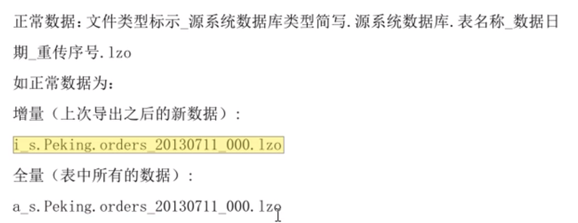
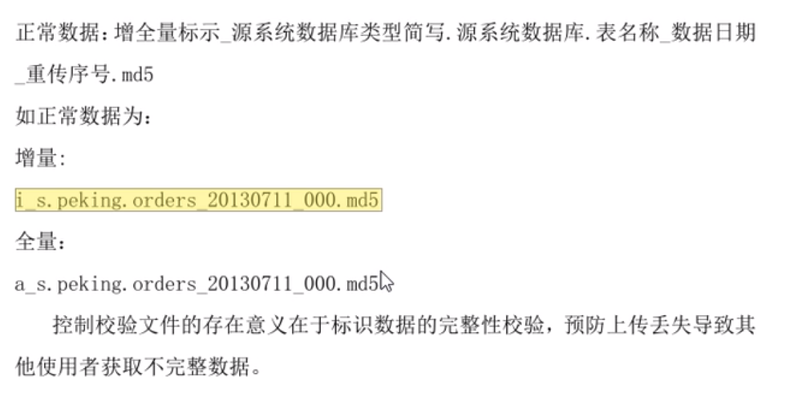
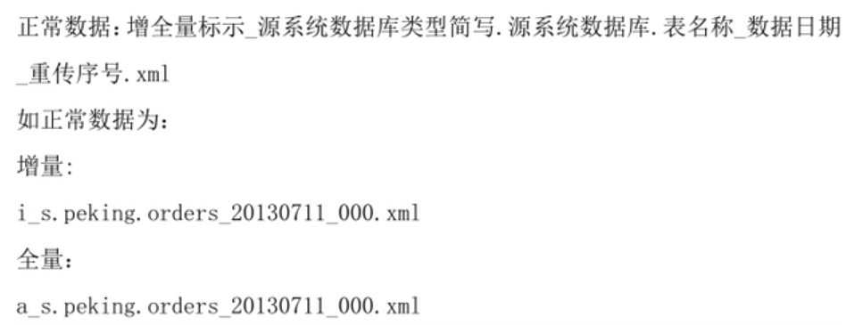
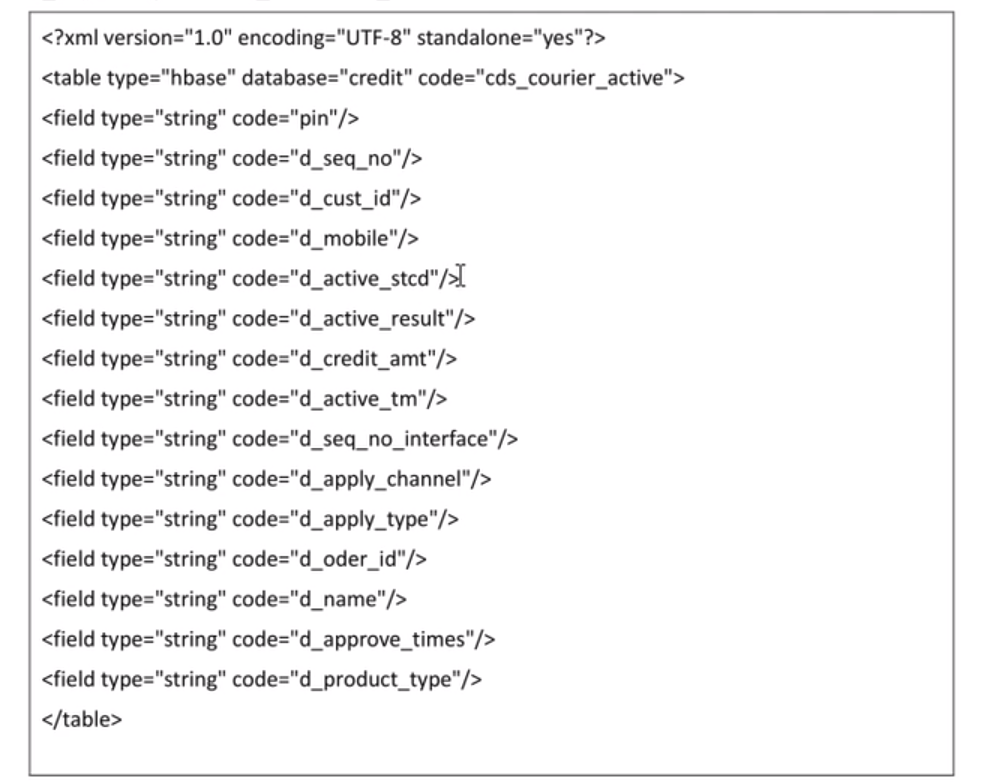

# 数据管理
## 文件管理
- 可以借助文件服务器
  - 文件服务器中的目录按（部门、需求、时间）进行归档
  - 可选技术（FTP，SMB，NPS）

## 文件规范
- 一套
  - 数据
  - 校验
  - 数据描述

### 数据文件命名规范

### 校验文件

### 接口表结构文件

## 数据质量检测
- 完整性
  - 关键数据是否缺失
- 一致性
  - 格式、单位
- 准确性
- 及时性
  - 指数据从产生到可以查看的时间间隔，也就数据的延时时长