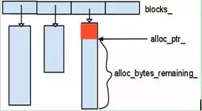

- 参考
  - http://luodw.cc/2015/10/15/leveldb-04/
# pre
- 内存池主要目的：减少malloc或new的调用

## Arena
- 没有提供内存释放的接口，通过析构函数来统一释放
- 申请内存的接口有两种
  - 一种考虑对齐、一种不考虑对齐
    - 以`sizeof(void*)`字节数来对齐
- 思路：
  - 通过一个指针（`alloc_ptr_`）指向当前块第一个未被申请的字节，记录当前块剩余的字节数
  - 用户的每次申请内存，从当前内存块中取，不够再new分配个
  - 每次分配（内存池的内存不够用的时候）的基本大小为一个**块**（默认为4096，如果用户申请的内存大于4096，以用户申请的字节数为申请的块大小）。
  - 每个块的地址存储在一个**vector**(blocks_)中（`alloc_bytes_remaining`）
<div align="center" style="zoom:100%"></div>

# 源码
- 位置：`util/arena.h`
- 内部重要成员：
  - `char* alloc_ptr_`：指向当内存块
  - `size_t alloc_bytes_remaining_`：当前内存块剩余的
- 对外接口：
  - 申请内存(不对齐)：`char* Allocate(size_t bytes)`
  - 申请内存(对齐)：`char* AllocateAligned(size_t bytes)`
  - 当前内存池所占用的内存（blocks（vector）+内存池分配的）：`size_t MemoryUsage()`
## Arena类的定义
- 默认块大小：`static const int kBlockSize = 4096;`
```cpp
class Arena {
 public:
  Arena();
  ~Arena();

  // Return a pointer to a newly allocated memory block of "bytes" bytes.
  // 申请内存，不对齐版；返回一个可用的堆内存指针
  char* Allocate(size_t bytes);

  // Allocate memory with the normal alignment guarantees provided by malloc
  // 申请内存，对齐版；返回一个可用的堆内存指针
  char* AllocateAligned(size_t bytes);

  // Returns an estimate of the total memory usage of data allocated
  // by the arena (including space allocated but not yet used for user
  // allocations).
  // 当前内存池所占内存，包括未被申请的
  size_t MemoryUsage() const {
    return blocks_memory_ + blocks_.capacity() * sizeof(char*);
  }

 private:
  // 包装AllocateNewBlock，增加一些策略，让内存池更加高效
  char* AllocateFallback(size_t bytes);
  // 分配一个内存块
  char* AllocateNewBlock(size_t block_bytes);

  // Allocation state
  char* alloc_ptr_; // 指向当前的内存块
  size_t alloc_bytes_remaining_; // 当前内存块剩下的字节数

  // Array of new[] allocated memory blocks
  std::vector<char*> blocks_; // 指向分配的内存块

  // Bytes of memory in blocks allocated so far
  size_t blocks_memory_; // 目前为止已经分配的字节数

  // No copying allowed
  // 是内存池对象不允许拷贝
  Arena(const Arena&);
  void operator=(const Arena&);
};

```

## 内存管理策略
### 分配内存块(private)
- 下面的方法是最底层分配内存块的方法。
- 就是直接new一块内存，首地址记录在vector blocks中
```cpp
/**
 * @brief 分配一个块的内存，块的大小为block_bytes，返回分配内存首地址
 */ 
char* Arena::AllocateNewBlock(size_t block_bytes) {
  char* result = new char[block_bytes];
  blocks_memory_ += block_bytes;
  blocks_.push_back(result);
  return result;
}
```

### 分配内存块（分配策略，内存池核心）(private)
- 对上面方法的包装（**内存池核心**）
  - 更新内存池状态。在分配一块新内存后，对内存池内部的变量进行更新（比如对当前内存块的指向和剩余容量进行更新）
  - 分配策略。
- 分配策略
  - **当需要分配的块的大小`bytes` 大于 默认块大小`kBlockSize`/4**，new bytes字节的独立内存块给申请的用户，当前的内存块不改变
    - 优点：避免了空间浪费，比如当前内存块只用了96字节（4096的标准块中），现在用户要4002字节，不够只能重新申请一块4096的，然后当前的内存块指向该块。这种做法其实让之前的内存块浪费了4000的字节
```cpp
char* Arena::AllocateFallback(size_t bytes) {
  if (bytes > kBlockSize / 4) {
    // Object is more than a quarter of our block size.  Allocate it separately
    // to avoid wasting too much space in leftover bytes.
    char* result = AllocateNewBlock(bytes);
    return result;
    // 注意：new bytes大小的块（注意不是kBlockSize），然后直接return，不更新当前的内存块状态。
  }

  // We waste the remaining space in the current block.
  alloc_ptr_ = AllocateNewBlock(kBlockSize); // 分配kBlockSize（默认4096）字节的块
  alloc_bytes_remaining_ = kBlockSize;
  
  // 更新当前内存块，可能造成之前的当前块最多<=kBlockSize /4 字节的浪费
  char* result = alloc_ptr_;
  alloc_ptr_ += bytes;
  alloc_bytes_remaining_ -= bytes;
  return result;
}
```

### 申请内存（对齐）(public)
- 思路：
  1. 先算出要按多少字节对齐（`align`）
  2. 算出对齐会导致多需要多少字节（`slop`）
  3. 算出此次申请总共需要多少字节（`needed = bytes + slop`）
  4. 判断当前内存块中的内存够不够
     - 够：用当前内存块的
     - 不够：重新分配内存块（至于重新的分配的内存块是否作为下一个当前内存块，AllocateFallback决定）


```cpp
char* Arena::AllocateAligned(size_t bytes) {
  // 1.算出按多少字节对齐
  const int align = sizeof(void*);    // We'll align to pointer size
  assert((align & (align-1)) == 0);   // Pointer size should be a power of 2

  // 2. 算出对齐会导致多需要多少字节； 算出此次申请总共需要多少字节
  size_t current_mod = reinterpret_cast<uintptr_t>(alloc_ptr_) & (align-1);
  size_t slop = (current_mod == 0 ? 0 : align - current_mod); // 对齐导致的膨胀
  size_t needed = bytes + slop; // 总共所需要的字节数（对齐所需 + 业务所需）

  // 3. 判断当前内存块中的内存够不够
  char* result;
  if (needed <= alloc_bytes_remaining_) {
    result = alloc_ptr_ + slop;
    alloc_ptr_ += needed;
    alloc_bytes_remaining_ -= needed;
  } else {
    // AllocateFallback always returned aligned memory
    result = AllocateFallback(bytes);
  }
  assert((reinterpret_cast<uintptr_t>(result) & (align-1)) == 0);
  return result;
}
```