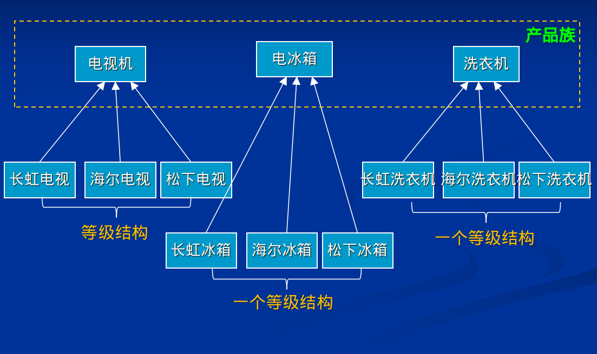
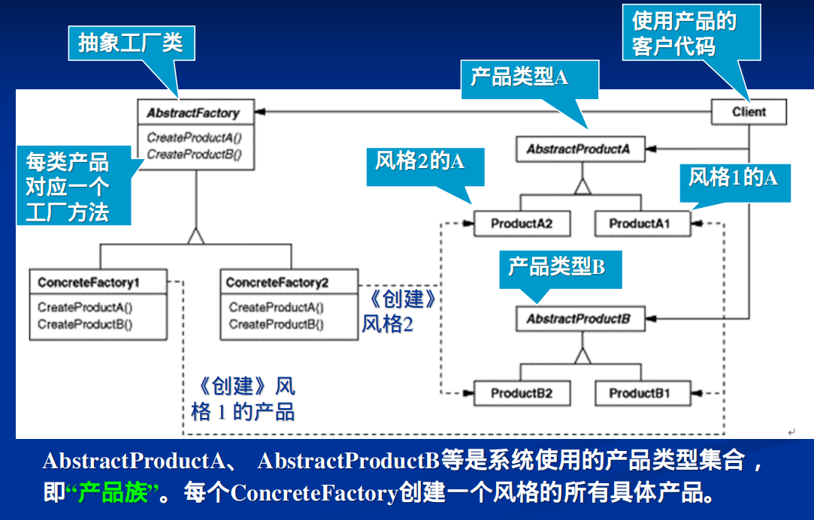
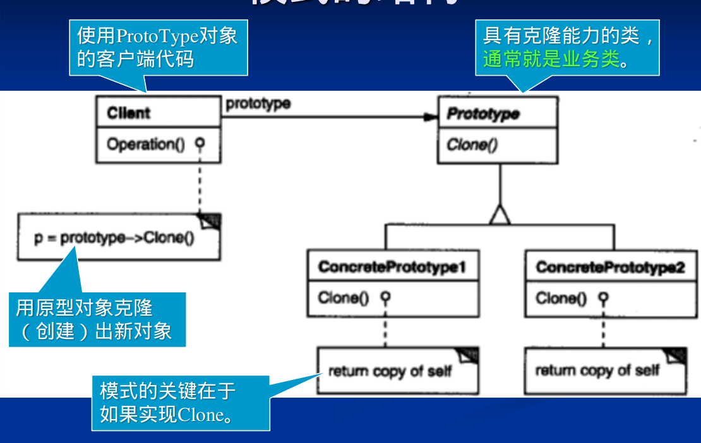
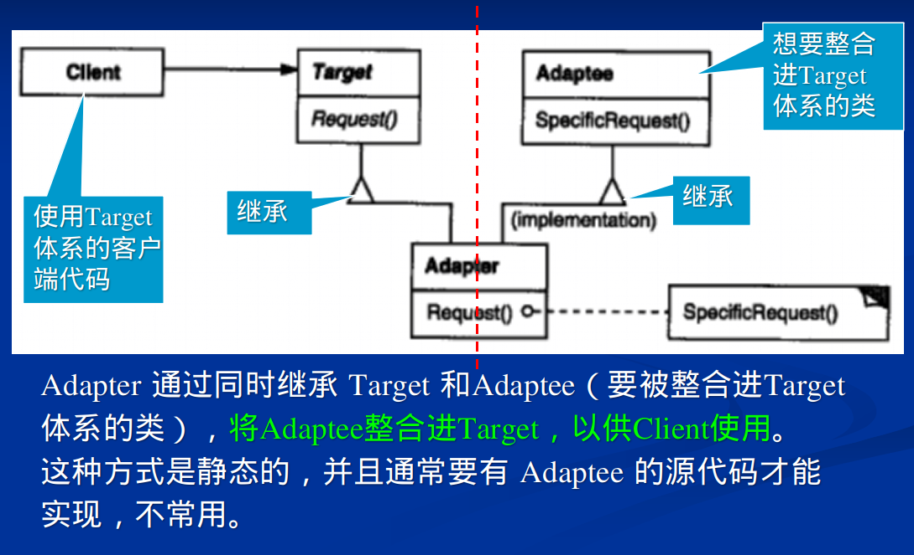
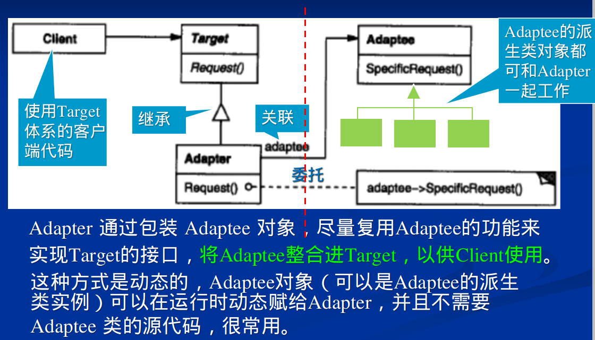
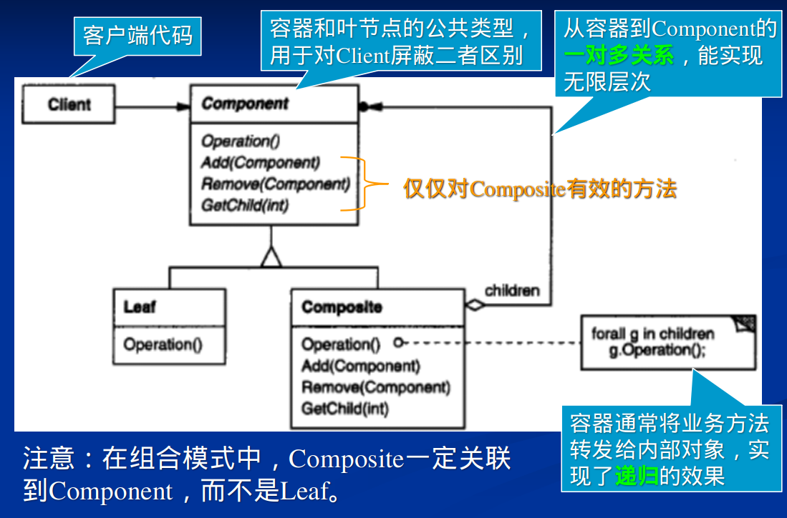

# 创建型模式

## 工厂模式
- 解决：对象创建的时候对细节的依赖（比如使用new，之后可能还要init一下）
- 打破的原则
  - 依赖倒置原则
    - 高层的client不应该依赖底层创建细节
  - 面向接口而不是针对实现 
    - client不应该面向具体的易变的类，而应该面向接口。
    - client只需要知道接口就够了
  - 开放封闭原则
    - 增加新的对象的时候，需要改变代码，而不是扩展类

<div align="center" style="zoom:80%"></div>


## 抽象工厂

> 典型应用


<div align="center" style="zoom:80%"></div>

- 产品族：电视机 电冰箱 洗衣机 ====》抽象工厂类里的函数
- 等级结构：长虹 海尔 松下 ===》   多个工厂类
<div align="center" style="zoom:80%"></div>

## 原型模式
- 应用
  - 复制粘贴，深拷贝
  - 原型工厂

> 原型工厂
```cpp
class MazePrototypeFactory : public MazeFactory {
public:
    MazePrototypeFactory(Maze*, Wall*, Room*, Door*);
    virtual Maze* MakeMaze() const;
    virtual Room* MakeRoom(int) const;
    virtual Wall* MakeWall() const;
    virtual Door* MakeDoor(Room*, Room*) const;
private:
    Maze* _prototypeMaze;  //工厂中的原型管理器
    Room* _prototypeRoom;
    Wall* _prototypeWall;
    Door* _prototypeDoor;
};

MazePrototypeFactory::MazePrototypeFactory (
    Maze* m, Wall* w, Room* r, Door* d
) {  //通过构造函数实现原型的注册
   _prototypeMaze = m;
   _prototypeWall = w;
   _prototypeRoom = r;
   _prototypeDoor = d;
}

// 利用原型对象实现工厂方法
Wall* MazePrototypeFactory::MakeWall () const {
    return _prototypeWall->Clone();   }

Door* MazePrototypeFactory::MakeDoor (Room* r1, Room *r2) const {
    Door* door = _prototypeDoor->Clone();
    door->Initialize(r1, r2); //额外的初始化操作
    return door;   }

```

<div align="center" style="zoom:80%"></div>

## 单件模式
- 应用：
  - 工厂类全局单一实例
  - 很多用途
- 如何多线程安全
  - static
  - once

<div align="center" style="zoom:100%"></div>

## Build模式
- 很想模板模式
- 应用：
  - 对象构建过于复杂，但是却逻辑清晰，可以分离为各个部分

## 依赖注入与反射
- 后面详细看

# 结构型模式
> 类的结构模式
- 类的结构模式用继承来把类、接口等组合在一起，已形成更大的结构。
- 类的结构模式是静态的，典型的有适配器模式

> 对象的结构模式
- 对象的结构模式用对象的关联关系把各种不同类型的对象组合在一起，以实现新的功能的方法。
- 对象的结构模式是动态的，可以在运行时刻改变对象组合关系，具有更大的灵活性。

- 有些模式会具有类形式和对象形式两种，如适配器模式。

## 适配器
- 应用
  - 引入包装外部代码，为我所用


> 类适配器
<div align="center" style="zoom:80%"></div>

> 对象适配器
- 一般使用这种
<div align="center" style="zoom:80%"></div>


## 桥接模式
后面补
## *组合模式
- 应用
  - 绘图软件中的组合
  - 树形结构，部分和整体，又使部分和整体有一致性

<div align="center" style="zoom:80%"></div>