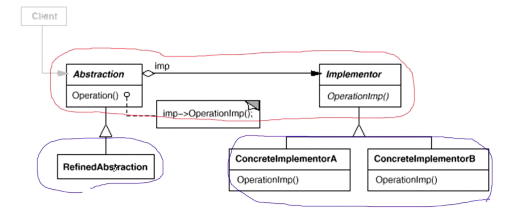

pre {
  overflow-y: auto;
  max-height: 300px;
}
- ["单一职责"模式](#单一职责模式)
- ["Decorator"装饰模式](#decorator装饰模式)
  - [动机](#动机)
  - [代码](#代码)
    - [decorator1.cpp](#decorator1cpp)
    - [decorator2.cpp](#decorator2cpp)
    - [decorator3.cpp](#decorator3cpp)
  - [模式定义](#模式定义)
  - [结构](#结构)
  - [要点总结](#要点总结)
- [桥模式](#桥模式)
  - [动机(Motivation)](#动机motivation)
  - [代码](#代码-1)
    - [bridge1.cpp](#bridge1cpp)
    - [bridge2.cpp](#bridge2cpp)
  - [模式定义](#模式定义-1)
  - [结构](#结构-1)
  - [要点总结](#要点总结-1)

# "单一职责"模式
在软件组件的设计中，如果责任划分的不清晰，使用继承得到的结果往往是随着需求的变化（**继承的不良使用**），子类急剧膨胀，同时充斥着重复代码（bad smelll），这时候的关键是划清责任。（io库的例子可以体现）
- 典型模式  
• Decorator  
• Bridge  
这两个在责任方面表现的特别突出，而不是其他模式没有在责任问题方面体现
# "Decorator"装饰模式
**(注：值得再看一遍)**
弹幕：装饰模式注重的是加强后的功能，代理模式注重的是自己本来的方法
## 动机
- 在某些情况下我们可能会“过度地使用继承来扩展对象的功能”，由于继承为类型引入的**静态特质**(注：比如原本的`CryptoNetworkStream`中使用`Read方法`是定死的，只使用`NetworkStream`的Read)，使得这种扩展方式缺乏灵活性；并且随着子类的增多（扩展功能的增多），各种子类的组合（扩展功能的组合）会导致更多子类的膨胀。
- 如何使“对象功能的扩展”能够根据需要来动态地实现？同时避免“扩展功能的增多”带来的子类膨胀问题？从而使得任何“功能扩展变化”所导致的影响将为最低？
## 代码
写的是一个io库，一个流操作；分为文件流，网络流，内存流；以及一些操作---加密，缓存。
### decorator1.cpp
比如通过代码可以知道，在加密的时候不同类加密操作一样，只是针对的流不一样，同样缓存也是这样。**现在如果要即加密又缓冲这样的多重操作CryptoBufferedFileStream，那么问题逐渐显现**----假设Stream的  数目是1，第二层假设其有n个，也就是1+n,假设有m种操作，那么加起来的个数将为1+n+n*!m/2（注：排列组合算出来的，知道很大就是了）,这个规模非常之大。  
  
我们可以看到额外的加密操作其实在每个子类中都是一样的，只是read操作对象的不一样，我们发现有许多代码冗余。这就是典型的bad smell---代码在大量重复。所以我们需要对其进行重构

```cpp
pre {
  overflow-y: auto;
  max-height: 300px;
}
//业务操作
class Stream{
public：
    virtual char Read(int number)=0;
    virtual void Seek(int position)=0;
    virtual void Write(char data)=0;
    
    virtual ~Stream(){}
};

//主体类
class FileStream: public Stream{
public:
    virtual char Read(int number){
        //读文件流
    }
    virtual void Seek(int position){
        //定位文件流
    }
    virtual void Write(char data){
        //写文件流
    }

};

class NetworkStream :public Stream{
public:
    virtual char Read(int number){
        //读网络流
    }
    virtual void Seek(int position){
        //定位网络流
    }
    virtual void Write(char data){
        //写网络流
    }
    
};

class MemoryStream :public Stream{
public:
    virtual char Read(int number){
        //读内存流
    }
    virtual void Seek(int position){
        //定位内存流
    }
    virtual void Write(char data){
        //写内存流
    }
    
};

//扩展操作
class CryptoFileStream :public FileStream{
public:
    virtual char Read(int number){
       
        //额外的加密操作...
        FileStream::Read(number);//读文件流
        
    }
    virtual void Seek(int position){
        //额外的加密操作...
        FileStream::Seek(position);//定位文件流
        //额外的加密操作...
    }
    virtual void Write(byte data){
        //额外的加密操作...
        FileStream::Write(data);//写文件流
        //额外的加密操作...
    }
};

class CryptoNetworkStream : :public NetworkStream{
public:
    virtual char Read(int number){
        
        //额外的加密操作...
        NetworkStream::Read(number);//读网络流
    }
    virtual void Seek(int position){
        //额外的加密操作...
        NetworkStream::Seek(position);//定位网络流
        //额外的加密操作...
    }
    virtual void Write(byte data){
        //额外的加密操作...
        NetworkStream::Write(data);//写网络流
        //额外的加密操作...
    }
};

class CryptoMemoryStream : public MemoryStream{
public:
    virtual char Read(int number){
        
        //额外的加密操作...
        MemoryStream::Read(number);//读内存流
    }
    virtual void Seek(int position){
        //额外的加密操作...
        MemoryStream::Seek(position);//定位内存流
        //额外的加密操作...
    }
    virtual void Write(byte data){
        //额外的加密操作...
        MemoryStream::Write(data);//写内存流
        //额外的加密操作...
    }
};

class BufferedFileStream : public FileStream{
    //...
};

class BufferedNetworkStream : public NetworkStream{
    //...
};

class BufferedMemoryStream : public MemoryStream{
    //...
};

class CryptoBufferedFileStream :public FileStream{
public:
    virtual char Read(int number){
        
        //额外的加密操作...
        //额外的缓冲操作...
        FileStream::Read(number);//读文件流
    }
    virtual void Seek(int position){
        //额外的加密操作...
        //额外的缓冲操作...
        FileStream::Seek(position);//定位文件流
        //额外的加密操作...
        //额外的缓冲操作...
    }
    virtual void Write(byte data){
        //额外的加密操作...
        //额外的缓冲操作...
        FileStream::Write(data);//写文件流
        //额外的加密操作...
        //额外的缓冲操作...
    }
};


void Process(){

    //编译时装配
    CryptoFileStream *fs1 = new CryptoFileStream();

    BufferedFileStream *fs2 = new BufferedFileStream();

    CryptoBufferedFileStream *fs3 =new CryptoBufferedFileStream();

}
```
### decorator2.cpp
组合替代继承。因为FileStream和NetworkStream等只有虚函数实现不太一样(如read)，但是都是基于同一基类，所以将其改为组合，可以消除重复代码。  
继承Stream是为了完善虚函数的接口规范的。而组合的Stream是为了将来支持实现的。  

```cpp
//业务操作
class Stream{

public：
    virtual char Read(int number)=0;
    virtual void Seek(int position)=0;
    virtual void Write(char data)=0;
    
    virtual ~Stream(){}
};

//主体类
class FileStream: public Stream{
public:
    virtual char Read(int number){
        //读文件流
    }
    virtual void Seek(int position){
        //定位文件流
    }
    virtual void Write(char data){
        //写文件流
    }

};

class NetworkStream :public Stream{
public:
    virtual char Read(int number){
        //读网络流
    }
    virtual void Seek(int position){
        //定位网络流
    }
    virtual void Write(char data){
        //写网络流
    }
    
};

class MemoryStream :public Stream{
public:
    virtual char Read(int number){
        //读内存流
    }
    virtual void Seek(int position){
        //定位内存流
    }
    virtual void Write(char data){
        //写内存流
    }
    
};

//扩展操作


class CryptoStream: public Stream {
    
    Stream* stream;//...

public:
    CryptoStream(Stream* stm):stream(stm){
    
    }
    
    
    virtual char Read(int number){
       
        //额外的加密操作...
        stream->Read(number);//读文件流
    }
    virtual void Seek(int position){
        //额外的加密操作...
        stream::Seek(position);//定位文件流
        //额外的加密操作...
    }
    virtual void Write(byte data){
        //额外的加密操作...
        stream::Write(data);//写文件流
        //额外的加密操作...
    }
};


class BufferedStream : public Stream{
    
    Stream* stream;//...
    
public:
    BufferedStream(Stream* stm):stream(stm){
        
    }
    //...
};


void Process(){

    // 运行时装配
    // 运行时装配，就是指编译时不存在那些加密文件流，缓存文件流，或者加密缓存文件流，而是在运行时通过组合的方式将其装配起来。
    FileStream* s1=new FileStream();
    // 加密
    CryptoStream* s2=new CryptoStream(s1);
    
    // 缓存
    BufferedStream* s3=new BufferedStream(s1);
    
    // 加密又缓存
    BufferedStream* s4=new BufferedStream(s2);
    
    

}
```
### decorator3.cpp
根据马丁福勒经典意义的重构理论----如果某一个类，它有多个子类有同个字段的时候，应该将其往上提。(注：这里的`CryptoStream`、`BufferedStream`中的`Stream*`成员字段)  
如果将`Stream*`成员字段提到`Stream基类`中会发现，`FileStream`根本不需要这个字段，这个时候应该设计一个中间类`DecoratorStream`


```cpp
//业务操作
class Stream{

public：
    virtual char Read(int number)=0;
    virtual void Seek(int position)=0;
    virtual void Write(char data)=0;
    
    virtual ~Stream(){}
};

//主体类
class FileStream: public Stream{
public:
    virtual char Read(int number){
        //读文件流
    }
    virtual void Seek(int position){
        //定位文件流
    }
    virtual void Write(char data){
        //写文件流
    }

};

class NetworkStream :public Stream{
public:
    virtual char Read(int number){
        //读网络流
    }
    virtual void Seek(int position){
        //定位网络流
    }
    virtual void Write(char data){
        //写网络流
    }
    
};

class MemoryStream :public Stream{
public:
    virtual char Read(int number){
        //读内存流
    }
    virtual void Seek(int position){
        //定位内存流
    }
    virtual void Write(char data){
        //写内存流
    }
    
};

//扩展操作

DecoratorStream: public Stream{
protected:
    Stream* stream;//整个设计的核心，通过组合引出多态
    
    DecoratorStream(Stream * stm):stream(stm){
    
    }
    
};

class CryptoStream: public DecoratorStream {
 

public:
    CryptoStream(Stream* stm):DecoratorStream(stm){
    
    }
    
    
    virtual char Read(int number){
       
        //额外的加密操作...
        stream->Read(number);//读文件流
    }
    virtual void Seek(int position){
        //额外的加密操作...
        stream::Seek(position);//定位文件流
        //额外的加密操作...
    }
    virtual void Write(byte data){
        //额外的加密操作...
        stream::Write(data);//写文件流
        //额外的加密操作...
    }
};


class BufferedStream : public DecoratorStream{
    
    Stream* stream;//...
    
public:
    BufferedStream(Stream* stm):DecoratorStream(stm){
        
    }
    //...
};


void Process(){

    //运行时装配
    FileStream* s1=new FileStream();
    
    CryptoStream* s2=new CryptoStream(s1);
    
    BufferedStream* s3=new BufferedStream(s1);
    
    BufferedStream* s4=new BufferedStream(s2);
}
```
## 模式定义
动态（组合）地给一个对象增加一些额外的职责。就增加功能而言，Decorator模式比生成子类（继承）更为灵活（消除重复代码 & 减少子类个数）。——《设计模式》GoF
## 结构
- Component相当于Stream  
- Decorator相当于DecoratorStream
- ConcreteComponent是FileStream这些
- ConcreteDecorator是CryptoStream、BufferedStream这些
- 红色表示稳定，蓝色表示变化的部分

## 要点总结
- 通过采用组合而非继承的手法， Decorator模式实现了在**运行时**动态扩展对象功能的能力，而且可以根据需要扩展多个功能。避免了使用继承带来的“灵活性差”和“多子类衍生问题”。
- Decorator类在**接口上表现为is-a** Component的继承关系，即Decorator类继承了Component类所具有的接口。**但在实现上又表现为has-a Component的组合关系**，即Decorator类又使用了另外一个Component类。**(注：如果一个类继承一个类又组合一个类，99%是Decorator设计模式，因为正常情况下不会这么干)**
- Decorator模式的目的并非解决“多子类衍生的多继承”问题，Decorator模式应用的要点在于解决“主体类在多个方向上的扩展功能”——是为“装饰”的含义  
**（注：FileStream和NetworkStream...是主体操作，这是一个变化的方向，而CryptoStream和BufferStream是扩展操作，不同方向的。主体操作和扩展操作应该分开分支继承）**
# 桥模式
## 动机(Motivation)
- 由于某些类型的固有的实现逻辑，使得它们具有两个变化的维度，乃至多个维度的变化。（**多个变化方向**）
- 如何应对这种“多维度的变化”？如何利用面向对象技术来使得类型可以轻松地沿着两个乃至多个方向变化，而不引入额外的复杂度？

## 代码
一个通信模块；假设现在要支持PC平台的设计还要支持Mobile平台的设计。这样会遇到一个问题，就是写PCMessagerBase，MobileMessagerBase会遇到PlaySound，DrawShape，WriteText，Connect平台实现的不同，所以这两个继承类都会overwrite这些函数。  
**我们在不同的平台需要不同的功能，比如我们推出一个精简版，一个完美版。**  ，如`PCMessagerLite`和`PCMessagerPerfect`


- 问题1：如果平台实现部分列为n,业务抽象部分列为m，类的数目有1+n+m*n。其实这里PC和Mobile完美版的Login等函数都有似曾相识的重复，不一样的代码中间夹着一些一样的代码(注：比如`PCMessagerPerfect`和`MobileMessagerPerfect`中的Login方法，`******`和`.......`对应的这些代码是一样的)。  
- 解决1：这个时候就可以把父类变成成员。 **(注：继承变组合)** 修改后如PCMessageLite和MobileMessageLite的代码已经没有区别。完美版也是通过如此修改
***
- 问题2：经过继承变组合之后，new PCMessagerBase给成员对象赋值时，会出现问题。因为这里CMessagerBase是抽象类（注：因为只overwrite部分純虚函数），如果MessageLIte也去继承Message，也只是overwrite部分純虚函数，原因就在于Message类设计不合适，应该拆分。
- 解决2：Message进行拆分
***
- 问题3：如果某一个类，它有多个子类的有同个字段的时候，应该将其往上提。
- 最终如代码bridge2.cpp所示
### bridge1.cpp
```cpp
class Messager{
public:
    virtual void Login(string username, string password)=0;
    virtual void SendMessage(string message)=0;
    virtual void SendPicture(Image image)=0;

    virtual void PlaySound()=0;
    virtual void DrawShape()=0;
    virtual void WriteText()=0;
    virtual void Connect()=0;
    
    virtual ~Messager(){}
};


//平台实现

class PCMessagerBase : public Messager{
public:
    
    virtual void PlaySound(){
        //**********
    }
    virtual void DrawShape(){
        //**********
    }
    virtual void WriteText(){
        //**********
    }
    virtual void Connect(){
        //**********
    }
};

class MobileMessagerBase : public Messager{
public:
    
    virtual void PlaySound(){
        //==========
    }
    virtual void DrawShape(){
        //==========
    }
    virtual void WriteText(){
        //==========
    }
    virtual void Connect(){
        //==========
    }
};


//业务抽象

class PCMessagerLite : public PCMessagerBase {
// 修改步骤1
// class PCMessagerLite{
    // 修改步骤2
    // PCMessagerBase *message;
    // 修改步骤4
    // MessagerBase *message; //new PcMessagerBase()
public:
    
    virtual void Login(string username, string password){
        
        PCMessagerBase::Connect();
        // 修改步骤3
        // message->Connect();
        
        //........
    }
    virtual void SendMessage(string message){
        
        PCMessagerBase::WriteText();
        //........
    }
    virtual void SendPicture(Image image){
        
        PCMessagerBase::DrawShape();
        //........
    }
};


class PCMessagerPerfect : public PCMessagerBase {
public:
    
    virtual void Login(string username, string password){
        
        PCMessagerBase::PlaySound();
        //********
        PCMessagerBase::Connect();
        //........
    }
    virtual void SendMessage(string message){
        
        PCMessagerBase::PlaySound();
        //********
        PCMessagerBase::WriteText();
        //........
    }
    virtual void SendPicture(Image image){
        
        PCMessagerBase::PlaySound();
        //********
        PCMessagerBase::DrawShape();
        //........
    }
};


class MobileMessagerLite : public MobileMessagerBase {
public:
    
    virtual void Login(string username, string password){
        
        MobileMessagerBase::Connect();
        //........
    }
    virtual void SendMessage(string message){
        
        MobileMessagerBase::WriteText();
        //........
    }
    virtual void SendPicture(Image image){
        
        MobileMessagerBase::DrawShape();
        //........
    }
};


class MobileMessagerPerfect : public MobileMessagerBase {
public:
    
    virtual void Login(string username, string password){
        
        MobileMessagerBase::PlaySound();
        //********
        MobileMessagerBase::Connect();
        //........
    }
    virtual void SendMessage(string message){
        
        MobileMessagerBase::PlaySound();
        //********
        MobileMessagerBase::WriteText();
        //........
    }
    virtual void SendPicture(Image image){
        
        MobileMessagerBase::PlaySound();
        //********
        MobileMessagerBase::DrawShape();
        //........
    }
};


void Process(){
    //编译时装配
    Messager *m =
        new MobileMessagerPerfect();
}
```
### bridge2.cpp
- 类的数目:1+n+m。
- 刚开始的代码在Message中放了**两个不同变化方向**的函数，一个是平台实现（PC Mobile），一个是业务抽象（Lite Perfect）。带来行为的多态方向也是往两个方向走，所以不应该放在同一个类里。
```cpp
class Messager{
protected:
    // 从子类往上提到父类
     MessagerImp* messagerImp;//...
public:
    virtual void Login(string username, string password)=0;
    virtual void SendMessage(string message)=0;
    virtual void SendPicture(Image image)=0;
    
    virtual ~Messager(){}
};

class MessagerImp{
public:
    virtual void PlaySound()=0;
    virtual void DrawShape()=0;
    virtual void WriteText()=0;
    virtual void Connect()=0;
    
    virtual MessagerImp(){}
};


//平台实现 n
class PCMessagerImp : public MessagerImp{
public:
    
    virtual void PlaySound(){
        //**********
    }
    virtual void DrawShape(){
        //**********
    }
    virtual void WriteText(){
        //**********
    }
    virtual void Connect(){
        //**********
    }
};

class MobileMessagerImp : public MessagerImp{
public:
    
    virtual void PlaySound(){
        //==========
    }
    virtual void DrawShape(){
        //==========
    }
    virtual void WriteText(){
        //==========
    }
    virtual void Connect(){
        //==========
    }
};


//业务抽象 m

//类的数目：1+n+m

class MessagerLite :public Messager {

    
public:
    
    virtual void Login(string username, string password){
        
        messagerImp->Connect();
        //........
    }
    virtual void SendMessage(string message){
        
        messagerImp->WriteText();
        //........
    }
    virtual void SendPicture(Image image){
        
        messagerImp->DrawShape();
        //........
    }
};


class MessagerPerfect  :public Messager {
    
   
public:
    
    virtual void Login(string username, string password){
        
        messagerImp->PlaySound();
        //********
        messagerImp->Connect();
        //........
    }
    virtual void SendMessage(string message){
        
        messagerImp->PlaySound();
        //********
        messagerImp->WriteText();
        //........
    }
    virtual void SendPicture(Image image){
        
        messagerImp->PlaySound();
        //********
        messagerImp->DrawShape();
        //........
    }
};

void Process(){
    //运行时装配
    MessagerImp* mImp=new PCMessagerImp();
    Messager *m =new Messager(mImp);
}

```
## 模式定义
将抽象部分(**业务功能**)与实现部分(**平台实现**)分离，使它们都可以独立地变化。——《设计模式》GoF
## 结构
- Abstraction就是Message
- Implementor就是MessageImp
- ConcreteImplementorA就是相当于PCMessageImp，ConcreteImplementorB就是相当于MobileMessageImp
- RefinedAbstraction相当于MessagerLite，MessagerPerfect。  
**（注：两个变化的方向独立变化，而不是搅在一起）**


## 要点总结
- Bridge模式使用 **“对象间的组合关系”** 解耦了抽象和实现之间固有的绑定关系，使得抽象和实现可以沿 着各自的维度来变化 **（注：子类化他们）**。所谓抽象和实现沿着各自维度的变化，即“子类化”它们。
- Bridge模式有时候类似于多继承方案，但**是多继承方案往往违背单一职责原则**（即一个类只有一个变化的原因），复用性比较差。Bridge模式是比多继承方案更好的解决方法。
- Bridge模式的应用一般在“**两个非常强的变化维度**”，有时一个类也有多于两个的变化维度，这时可以使用Bridge的扩展模式。**（注：bridge把某一个抽象维度打包为基类，用一个抽象指针指向他，如果有三个抽象维度，用三个抽象维度指向它）**