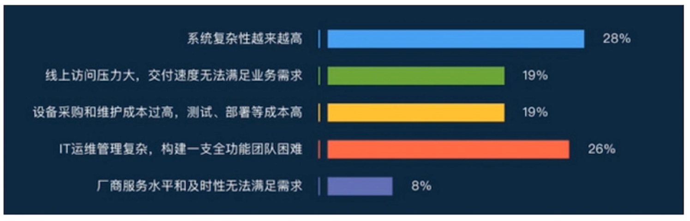

> https://coding.imooc.com/class/198.html 2017年视频

- [导学](#%E5%AF%BC%E5%AD%A6)
  - [IT系统支撑所存在的问题](#IT%E7%B3%BB%E7%BB%9F%E6%94%AF%E6%92%91%E6%89%80%E5%AD%98%E5%9C%A8%E7%9A%84%E9%97%AE%E9%A2%98)
  - [微服务架构落地情况](#%E5%BE%AE%E6%9C%8D%E5%8A%A1%E6%9E%B6%E6%9E%84%E8%90%BD%E5%9C%B0%E6%83%85%E5%86%B5)
- [初识微服务](#%E5%88%9D%E8%AF%86%E5%BE%AE%E6%9C%8D%E5%8A%A1)
  - [什么是软件架构](#%E4%BB%80%E4%B9%88%E6%98%AF%E8%BD%AF%E4%BB%B6%E6%9E%B6%E6%9E%84)
  - [什么是单体架构](#%E4%BB%80%E4%B9%88%E6%98%AF%E5%8D%95%E4%BD%93%E6%9E%B6%E6%9E%84)
  - [什么是微服务](#%E4%BB%80%E4%B9%88%E6%98%AF%E5%BE%AE%E6%9C%8D%E5%8A%A1)
  - [一个微服务例子](#%E4%B8%80%E4%B8%AA%E5%BE%AE%E6%9C%8D%E5%8A%A1%E4%BE%8B%E5%AD%90)
    - [假定业务场景](#%E5%81%87%E5%AE%9A%E4%B8%9A%E5%8A%A1%E5%9C%BA%E6%99%AF)
    - [假定是微服务](#%E5%81%87%E5%AE%9A%E6%98%AF%E5%BE%AE%E6%9C%8D%E5%8A%A1)
  - [微服务的优势和不足](#%E5%BE%AE%E6%9C%8D%E5%8A%A1%E7%9A%84%E4%BC%98%E5%8A%BF%E5%92%8C%E4%B8%8D%E8%B6%B3)
    - [优点](#%E4%BC%98%E7%82%B9)
    - [不足](#%E4%B8%8D%E8%B6%B3)
- [微服务架构引入的问题和解决方案](#%E5%BE%AE%E6%9C%8D%E5%8A%A1%E6%9E%B6%E6%9E%84%E5%BC%95%E5%85%A5%E7%9A%84%E9%97%AE%E9%A2%98%E5%92%8C%E8%A7%A3%E5%86%B3%E6%96%B9%E6%A1%88)
  - [如何通讯](#%E5%A6%82%E4%BD%95%E9%80%9A%E8%AE%AF)
    - [从铜须模式角度考虑](#%E4%BB%8E%E9%93%9C%E9%A1%BB%E6%A8%A1%E5%BC%8F%E8%A7%92%E5%BA%A6%E8%80%83%E8%99%91)
    - [从通讯协议角度考虑](#%E4%BB%8E%E9%80%9A%E8%AE%AF%E5%8D%8F%E8%AE%AE%E8%A7%92%E5%BA%A6%E8%80%83%E8%99%91)
    - [如何选择RPC框架](#%E5%A6%82%E4%BD%95%E9%80%89%E6%8B%A9RPC%E6%A1%86%E6%9E%B6)
    - [流行的RPC框架](#%E6%B5%81%E8%A1%8C%E7%9A%84RPC%E6%A1%86%E6%9E%B6)
      - [dubbo](#dubbo)
      - [Motan](#Motan)
      - [Thrift](#Thrift)
      - [GRPC](#GRPC)
      - [总结](#%E6%80%BB%E7%BB%93)
  - [服务发现](#%E6%9C%8D%E5%8A%A1%E5%8F%91%E7%8E%B0)
    - [传统单体服务](#%E4%BC%A0%E7%BB%9F%E5%8D%95%E4%BD%93%E6%9C%8D%E5%8A%A1)
    - [微服务](#%E5%BE%AE%E6%9C%8D%E5%8A%A1)
  - [服务的部署、更新和扩容](#%E6%9C%8D%E5%8A%A1%E7%9A%84%E9%83%A8%E7%BD%B2%E6%9B%B4%E6%96%B0%E5%92%8C%E6%89%A9%E5%AE%B9)
    - [服务编排](#%E6%9C%8D%E5%8A%A1%E7%BC%96%E6%8E%92)
- [SprintBoot 与微服务](#SprintBoot-%E4%B8%8E%E5%BE%AE%E6%9C%8D%E5%8A%A1)
- [SprintCloud 与微服务](#SprintCloud-%E4%B8%8E%E5%BE%AE%E6%9C%8D%E5%8A%A1)
  - [SprintCloud 和 SprintBoot](#SprintCloud-%E5%92%8C-SprintBoot)
  - [SprintCloud 和微服务](#SprintCloud-%E5%92%8C%E5%BE%AE%E6%9C%8D%E5%8A%A1)
  - [SpringCloud 核心组件](#SpringCloud-%E6%A0%B8%E5%BF%83%E7%BB%84%E4%BB%B6)
    - [Netflix Eureka](#Netflix-Eureka)
    - [Netflix Ribbon](#Netflix-Ribbon)
    - [Netflix Hystrix](#Netflix-Hystrix)
    - [Netflix Zuul](#Netflix-Zuul)
    - [Spring Cloud Config](#Spring-Cloud-Config)

# 导学
## IT系统支撑所存在的问题

## 微服务架构落地情况
- 2017

# 初识微服务
## 什么是软件架构

- 软件架构需要考虑哪些因素
  - 业务需求：系统需要实现哪些功能
  - 技术栈：每个员工和公司都有擅长和不擅长的技术
  - 成本：每个公司的人力财力都不同
  - 组织架构：每个公司有多少个部分可以给我们提供帮助，每个小组可以做什么。 
  - 可扩展性：需要考虑需求的变更
  - 可维护性：学习成本(如一个新人需要学习的时间)和bug修复的成本

## 什么是单体架构
- 定义：功能、业务集中在一个发布包里，部署运行在同一个进程中
- 优势
  - 易于开发：开发方式简单，现有的框架也都是单体架构的，容易理解，而且ide也都比较适合单体架构的开发和测试
  - 易于测试
  - 易于部署：只是一个进程的部署。
  - 易于水平伸缩：直接把软件在另外一台运行，配置以下负载均衡就可以了
- 面临的挑战
  - 代码膨胀，难以维护
  - 构建，部署的成本大：代码越来越多，构建、部署、启动时间越来越长，项目维护的人越来越多。一次完整bug的修复要提交给测试验证的窗口期就会越来越长，后果会导致效率越来越低
  - 新人上手困难
  - 创新困难：采用新技术风险大
  - 可扩展性差
    - 垂直扩展：我们代码都运行在一个进程，而一个进程运行在一个机器上，要给其加多少内存、cpu才够这个进程呢？
    - 水平扩展：由于所有的代码都在一个，有点可能对cpu的要求比较高，有点可能对内存的要求比较高，这要求我们用各个方面都很精良的机器。

## 什么是微服务

- 多微才算微
  - 代码量？ 语言不同，程序员质量不同
  - 开发时间？ 开发难易不同，程序员个人经验
  - **其实是不可度量的？**，他传递的是一种概念，一种设计的思想

- 微服务的特征
  - 单一职责：内聚性
  - 轻量级通信
  - 隔离性：都是一个进程不会相互干扰
  - 有自己的数据：业务数据独立
  - 技术多样性

 - 微服务诞生的背景
   - 互联网行业的快速发展
   - 敏捷开发精益方法深入人心
   - 容器技术的成熟

## 一个微服务例子

### 假定业务场景

- 可以查看课程列表和对课程的基本CRUD

 ### 假定是单体程序

 

### 假定是微服务

 

## 微服务的优势和不足
### 优点
- 独立性
  - 可以在扩缩容上做到非常精细：每个服务的体量可能是不同的，比如登录注册接口qbs为10，而用户信息接口为100，这样可以启动2个登录注册服务，5个用户信息接口。
  - 在容错上：一个微服务出现问题只会影响自己
  - 数据库上：每个服务有自己的数据库，避免了原来的小心翼翼，怕影响到其他模块。
- 敏捷性
  - 每个服务很简单，当有新需求的时候就可以找到需要修改哪个服务
- 技术栈灵活
  - 每一个微服务可以有独立的技术栈。服务重构会变得简单
- 高效团队
  - 这样可以使每个团队分工更加明确。

### 不足
- 额外的工作
  - 如服务的拆分是很复杂的。ddd领域驱动设计，非常适合做微服务的划分。拆分太小，调用多，比较低效。太大又会失去微服务的优势。
- 数据一致性
  - 单体架构只有一个数据库，我们可以使用事务，来级联的修改和删除。微服务都有自己的数据库，即使在拆分微服务的时候要尽量的保证对数据的连表操作，尽量让其在同一个微服务里。但是很难保证意外，一旦出现会给一致性带来挑战。
- 沟通成本
  - api的破坏性修改

# 微服务架构引入的问题和解决方案
- 微服务间如何通讯
- 微服务如何发现彼此
- 微服务怎样部署？更新?扩容
  - 可以直接手动部署(微服务很少的情况)
  - 也可以自动化，比如使用jekins

## 如何通讯
### 从铜须模式角度考虑
- 一对一还是一对多
- 同步还是异步

 

### 从通讯协议角度考虑
- REST API
  - REST API不等同于HTTP的一种设计，REST描述的是客户端和服务端的交互形式，本身是比较抽象的概念，比较实用的就是如何设计一个REST风格的API 
- RPC
  - 种类

- MQ（消息队列）

### 如何选择RPC框架
- IO、线程调度模型
  - 是同步IO还是异步非阻塞IO，是长连接还是短连接。单线程还是多线程，线程调度算法的性能
- 序列化方式
  - 是可读的还是二进制的方式
    - 可读：json，xml
  - 序列化方式效率直接影响通信效率，序列化反序列化所需要时间，序列化后的内容大小
- 多语言支持
- 服务治理
  - 有没有服务发现，服务监控
  - 一个支持服务治理的一般支持服务的部署和高可用。如果没有就需要自己实现

### 流行的RPC框架
- dubbo：阿里
- dubbox：当当
- motan：新浪
- thrift：Apache
- grpc：google

#### dubbo
 

- 支持服务治理
- 序列化采用阿里内部的序列化方式
- 只支持Java

#### Motan

 

- 支持服务治理
- 只支持java

#### Thrift

 

- 支持的语言特别多 
- 没有服务治理
- 提供多种序列化模式
- 提供多种线程调度模式

#### GRPC

- 支持多语言

#### 总结
 

## 服务发现
- 服务发现的本质是让客户端知道服务提供者的IP和端口号

### 传统单体服务
 

- 这种需要手动去配，当微服务量特别多的时候，配置起来很痛苦。

### 微服务
- 客户端的发现
  - 通过本地自个负载均衡

- 服务发现
  - 通过域名或者IP访问具有服务发现和负载均衡的服务，再将请求转发到后端。如nginx，负载均衡算法由nginx决定

## 服务的部署、更新和扩容
### 服务编排
包括服务发现、部署、更新和扩容

- 流行的编排工具
  - Mesos
  - Docker Swarm
  - Kubernetes

# SprintBoot 与微服务
- SprintBoot的使命
  - 化繁为简：让我们使用spring产品和开发spring应用更简单。简化开发，配置，部署。

- SprintBoot 核心功能
  - 独立运行
  - 内嵌web服务器
  - 简化部署
  - 准生产的应用监控

- SprintBoot 与微服务的关系
  - Java的润滑剂：正好应对了微服务的特征，让开发和部署变快。 

# SprintCloud 与微服务
- SprintCloud的使命
  - 简化Java的分布式系统：当把你的java应用，web服务也好，部署到多个服务器上的时候，会遇到 服务的负载均衡、服务之间的调用、事务管理等等。而SprintCloud用于简化上面的问题。

- SprintCloud
  - 一系列框架：已有框架的封装和二次开发
  - 简化java的分布式系统
  - Sprintboot封装

## SprintCloud 和 SprintBoot
- SprintBoot意在简化，是一种开发，配置风格。SprintBoot 简化配置，让我们开发一个服务基础设施变得足够简单 
- SprintCloud 意在简化分布式，是功能的集合，风格的统一。

## SprintCloud 和微服务
- Java的微服务解决方案：微服务就是一个个的分布式应用
- 侧重功能和开发。没有提供资源的管理和自动化部署。对于devops，SprintCloud只是dev没有ops。比如我们准备了十台服务器，想运行以下SprintCloud的微服务，抱歉，SprintCloud不支持自动化的管理。SprintCloud最终的产出就是镜像而已，而对于部署需要编排框架，像k8s。

## SpringCloud 核心组件

- Netflix 是美国一家公司，开源了很多产品，但是用的门槛高。SpringCloud对其进行二次开发。
### Netflix Eureka
- 服务发现，类似zookeeper

### Netflix Ribbon
- 负载均衡。通过获取Eureka的服务信息，然后做一个轮训算法进行负载均衡。

- 什么是 Edge Service
  - 把一些信息串联起来，统一对外展示，这样的就叫做Edge Service
  - 整合后端多个服务
  - 离用户最近

### Netflix Hystrix
- 调度器
- 解决的问题： 
  - 比如当一个数据库宕掉，一个用户对数据库做一个操作，如果没有反应，往往用户会重复的操作。访问量成倍增长，即使我们的数据库弄好了，也有可能再次被这些访问压坏。Hystrix解决这个场景
- 当发现服务方有问题，后续的请求就不会再访问服务方了。这样恢复的时候就不会有太大压力
- 当服务不可用，可以选择给用户一个更好的返回，而不是一个错误页面，比如说可以从缓存中取出用户数据来使用。

### Netflix Zuul
- API网关

- 功能
  - 路由
  - 负载均衡
  - 权限控制

### Spring Cloud Config
- 解决的是每个环境的配置不同

