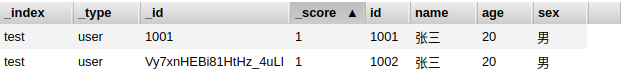
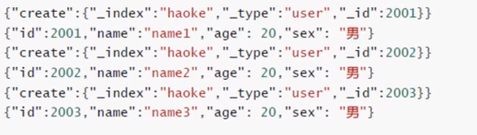
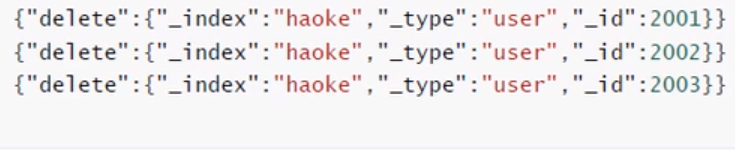
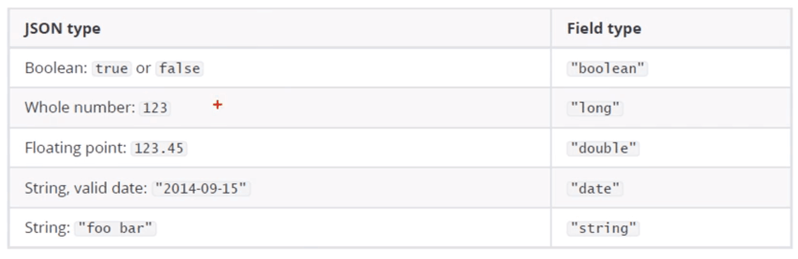
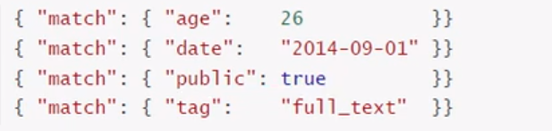
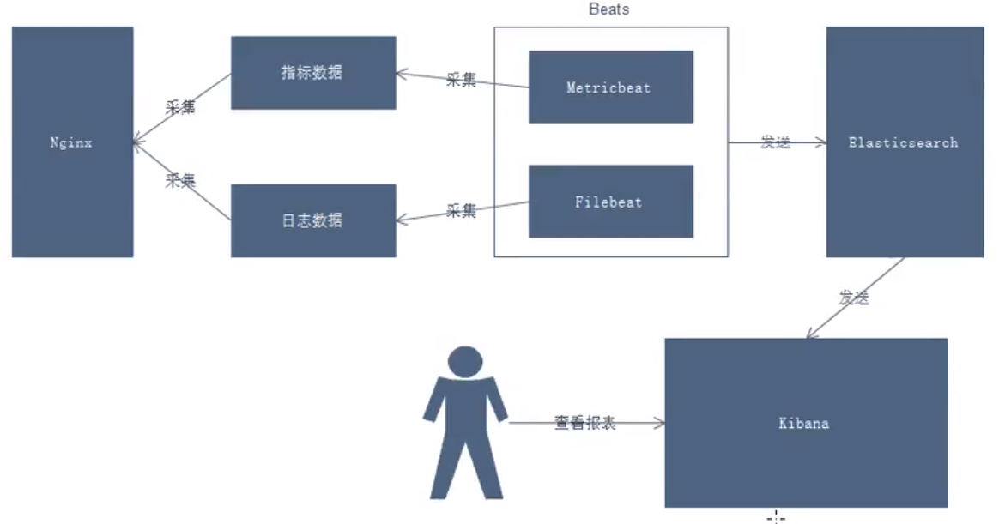
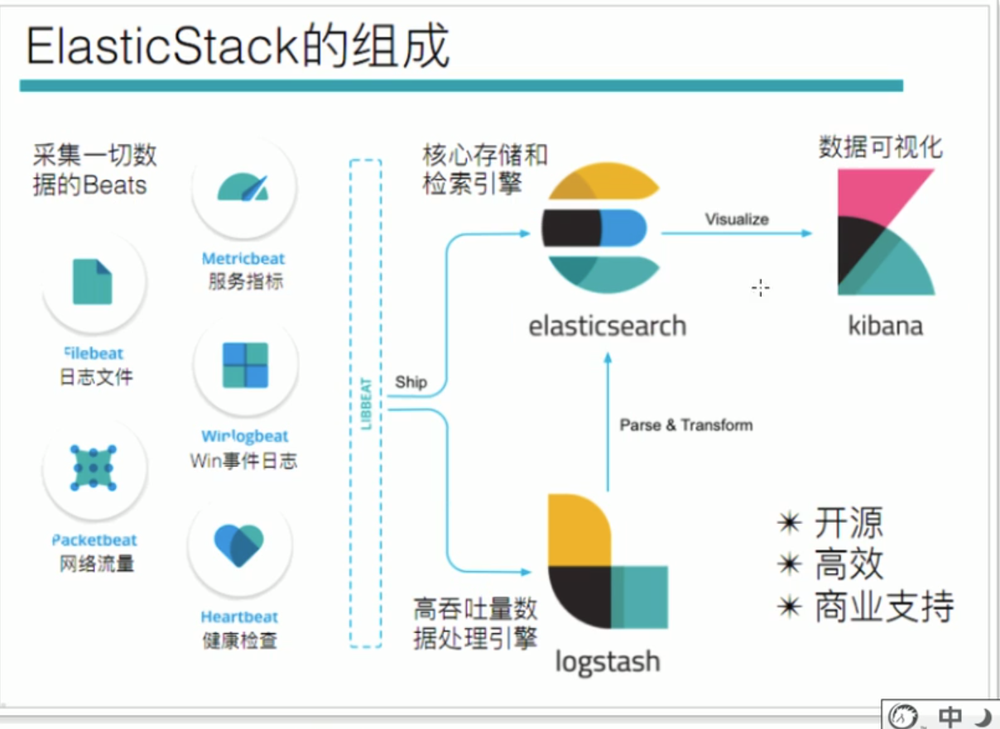
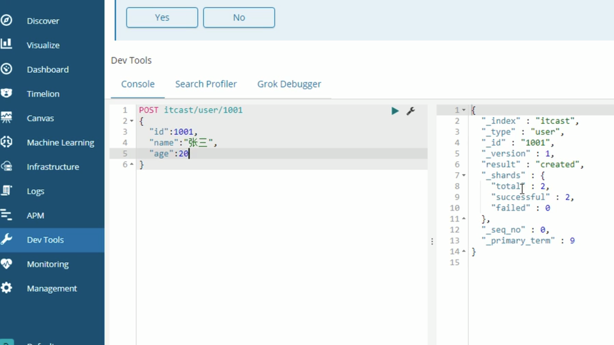

- [简介](#%E7%AE%80%E4%BB%8B)
- [Elasticsearch](#Elasticsearch)
  - [安装](#%E5%AE%89%E8%A3%85)
  - [配置启动及注意事项](#%E9%85%8D%E7%BD%AE%E5%90%AF%E5%8A%A8%E5%8F%8A%E6%B3%A8%E6%84%8F%E4%BA%8B%E9%A1%B9)
    - [启动](#%E5%90%AF%E5%8A%A8)
    - [关闭](#%E5%85%B3%E9%97%AD)
  - [Elasticsearch-head](#Elasticsearch-head)
    - [docker安装](#docker%E5%AE%89%E8%A3%85)
  - [基本概念](#%E5%9F%BA%E6%9C%AC%E6%A6%82%E5%BF%B5)
  - [RestFul API](#RestFul-API)
    - [创建索引](#%E5%88%9B%E5%BB%BA%E7%B4%A2%E5%BC%95)
    - [删除索引](#%E5%88%A0%E9%99%A4%E7%B4%A2%E5%BC%95)
    - [更新](#%E6%9B%B4%E6%96%B0)
    - [删除](#%E5%88%A0%E9%99%A4)
    - [DSL搜索](#DSL%E6%90%9C%E7%B4%A2)
    - [高亮显示](#%E9%AB%98%E4%BA%AE%E6%98%BE%E7%A4%BA)
    - [聚合](#%E8%81%9A%E5%90%88)
  - [核心详解](#%E6%A0%B8%E5%BF%83%E8%AF%A6%E8%A7%A3)
    - [元数据](#%E5%85%83%E6%95%B0%E6%8D%AE)
    - [查询响应](#%E6%9F%A5%E8%AF%A2%E5%93%8D%E5%BA%94)
    - [判断文档是否存在](#%E5%88%A4%E6%96%AD%E6%96%87%E6%A1%A3%E6%98%AF%E5%90%A6%E5%AD%98%E5%9C%A8)
    - [批量操作](#%E6%89%B9%E9%87%8F%E6%93%8D%E4%BD%9C)
      - [如何批量效率最高](#%E5%A6%82%E4%BD%95%E6%89%B9%E9%87%8F%E6%95%88%E7%8E%87%E6%9C%80%E9%AB%98)
    - [分页](#%E5%88%86%E9%A1%B5)
      - [在集群系统中深度分页](#%E5%9C%A8%E9%9B%86%E7%BE%A4%E7%B3%BB%E7%BB%9F%E4%B8%AD%E6%B7%B1%E5%BA%A6%E5%88%86%E9%A1%B5)
    - [映射](#%E6%98%A0%E5%B0%84)
    - [结构化查询](#%E7%BB%93%E6%9E%84%E5%8C%96%E6%9F%A5%E8%AF%A2)
  - [分词](#%E5%88%86%E8%AF%8D)
    - [分词API](#%E5%88%86%E8%AF%8DAPI)
    - [中文分词](#%E4%B8%AD%E6%96%87%E5%88%86%E8%AF%8D)
  - [全文搜索](#%E5%85%A8%E6%96%87%E6%90%9C%E7%B4%A2)
    - [单词搜索](#%E5%8D%95%E8%AF%8D%E6%90%9C%E7%B4%A2)
    - [多词搜索](#%E5%A4%9A%E8%AF%8D%E6%90%9C%E7%B4%A2)
    - [组合搜索](#%E7%BB%84%E5%90%88%E6%90%9C%E7%B4%A2)
      - [评分的计算规则](#%E8%AF%84%E5%88%86%E7%9A%84%E8%AE%A1%E7%AE%97%E8%A7%84%E5%88%99)
    - [权重](#%E6%9D%83%E9%87%8D)
  - [ES集群](#ES%E9%9B%86%E7%BE%A4)
    - [集群节点](#%E9%9B%86%E7%BE%A4%E8%8A%82%E7%82%B9)
- [粗糙](#%E7%B2%97%E7%B3%99)
- [filebeat](#filebeat)
  - [读取文件](#%E8%AF%BB%E5%8F%96%E6%96%87%E4%BB%B6)
  - [添加自定义字段](#%E6%B7%BB%E5%8A%A0%E8%87%AA%E5%AE%9A%E4%B9%89%E5%AD%97%E6%AE%B5)
  - [传到es中](#%E4%BC%A0%E5%88%B0es%E4%B8%AD)
  - [工作原理](#%E5%B7%A5%E4%BD%9C%E5%8E%9F%E7%90%86)
  - [读取nginx文件](#%E8%AF%BB%E5%8F%96nginx%E6%96%87%E4%BB%B6)
  - [nginx](#nginx)
- [启动](#%E5%90%AF%E5%8A%A8-1)
# 简介

未来发布的elasticsearch 6.0.0版本为保持兼容，仍然会支持单index，多type结构，但是作者已不推荐这么设置。在elasticsearch 7.0.0版本必须使用单index,单type，多type结构则会完全移除。

> Elasticsearch  

Elasticsearch基于java ,是个开源分布式搜索引擎,它的特点有:分布式,零配置,自动发现,索引自动分片,索副本机制, **restful风格接口**,多数据源,自动搜索负载等。
设计

> Logstash

Logstash基于java ,是一个开源的用于收集，分析和存储日志的工具。

> Kibana

Kibana基于nodejs ,也是一个开源和免费的工具 , Kibana可以为Logstash和ElasticSearch提供的日志分析友好Web界面,可以汇总、分析和搜索重要数据日志。

> Beats

Beats是elastic公司开源的一款采集系统监控数据的代理agent ,是在被监控服务器上以客户端形式运行的数据收集器的统称,可以直接把数据发送给Elasticsearch或者通过ogstash发送给Elasticsearch ,然后进行后续的数据分析动。
- Packetbeat :是一个网络数据包分析器,用于监控、收集网络流量信息, Packetbeat嗅探服务器之间的流量,解析应用层协议,并关联到消息的处理,支持ICMP (v4 and v6)、DNS、HTTP、 Mysql. PostgreSQL、Redis、MongoDB、 Memcache等协议;

# Elasticsearch
> 简介
ElasticSearch是一个基于Lucene的搜索服务器。它提供了一个分布式多用户能力的全文搜索引擎，基于RESTful web接口。Elasticsearch是用Java开发的，并作为Apache许可条款下的开放源码发布,是当前流行的企业级搜索引擎。**设计用于云计算中，能够达到实时搜索，稳定，可靠，快速，安装使用方便。**

> 场景

我们建立一个网站或应用程序,并要添加搜索功能，但是想要完成搜索工作的创建是非常困难的。我们希望搜索解决方案要运行速度快，我们希望能有一一个零配置和一个完全免费的搜索模式，我们希望能够简单地使用JSON通过HTTP来索引数据,我们希望我们的搜索服务器始终可用，我们希望能够从一台开始并扩展到数百台，我们要实时搜索,我们要简单的多租户,我们希望建立一个云的解决方案。因此我们利用Elasticsearch来解决所有这些问题及可能出现的更多其它问题。

当你经营一家网上商店，你可以让你的客户搜索你卖的商品。在这种情况下，你可以使用ElasticSearch来存储你的整个产品目录和库存信息，为客户提供精准搜索，可以为客户推荐相关商品。

当你想收集日志或者交易数据的时候，需要分析和挖掘这些数据，寻找趋势，进行统计，总结，或发现异常。在这种情况下，你可以使用Logstash或者其他工具来进行收集数据，当这引起数据存储到ElasticsSearch中。你可以搜索和汇总这些数据，找到任何你感兴趣的信息。

对于程序员来说，比较有名的案例是GitHub，GitHub的搜索是基于ElasticSearch构建的，在github.com/search页面，你可以搜索项目、用户、issue、pull request，还有代码。共有40~50个索引库，分别用于索引网站需要跟踪的各种数据。虽然只索引项目的主分支（master），但这个数据量依然巨大，包括20亿个索引文档，30TB的索引文件。


## 安装
- 官网安装，解压完事。

## 配置启动及注意事项
- 不支持root用户运行
- 一些配置及相关解决如下

```yml
# 修改配置，设置ip让其任意网络均可访问
vim conf/elasticsearch. ym1
network.host: 0.0.0.0 

#说明:在Elasticsearch中如果, network.host不是localhost或者127.0.0.1的话，就会认为是生产环境，会对环境的要求比较高，我们的测试环境不一定能够满足，一般情况下需要修改2处配置，如下:

#1 :修改jvm启动参数

vim conf/jvm.options

- xms128m #根据自己机器情况修改+

- Xmx128m

#2 :一个进程在VMAS (虚拟内存区域)创建内存映射最大数量

vim /etc/sysctl.conf

vm.max_map_count=655360

sysctl -p #配置生效

# Q1：启动出错，环境: Centos6，ubuntu18.04

[1]: max file descrtptors [4096] for elasticsearch process is too low, increase to atleast [65536]
 
# 解决:編輯limits.conf添加奬似如下内容
vim /etc/security/limits.conf
l1nkkk soft nofile 65536
l1nkkk hard nofile 131072
l1nkkk soft nproc 2048
l1nkkk hard nproc 4096
# 之后重新登录就可以
# Q2：
[2]: max number of threads [1024] for user [elsearch] is too low, increase to at least[4096]

#解决:
vim /etc/security/limits.d/90-nproc.conf
# 添加如下内容
l1nkkk soft nproc 4096
# 或
* soft nproc 4096

# Q3：
[3]: system call filters failed to install; check the logs and fix your configuration or disable system call fi1ters at your own risk

# 解决
vim config/elasticsearch.yml
# 添加
bootstrap.system_call_filter: false


```

### 启动

./elasticsearch 或./elasticsearch -d #后台系统

> 验证

访问：http://ip:9200 ，如果有以下数据说明成功了。

```json
{
  "name" : "V7iR5AL",
  "cluster_name" : "elasticsearch",
  "cluster_uuid" : "8_QOPa72Ri6vaqtJSKJOng",
  "version" : {
    "number" : "6.5.4",
    "build_flavor" : "default",
    "build_type" : "tar",
    "build_hash" : "d2ef93d",
    "build_date" : "2018-12-17T21:17:40.758843Z",
    "build_snapshot" : false,
    "lucene_version" : "7.5.0",
    "minimum_wire_compatibility_version" : "5.6.0",
    "minimum_index_compatibility_version" : "5.0.0"
  },
  "tagline" : "You Know, for Search"
}
```

### 关闭
- jps 查看其pid
- kill pid

## Elasticsearch-head
- 源码安装,通过npm run start启动(不推荐)
- 通过docker安装(推荐，但是只支持到了5，后面的版本不支持了)
- 通过chrome插件安装(推荐)
- 通过ES的plugin方式安装(不推荐)


由于前后端分离开发,所以会存在跨域问题,需要在服务端做CORS的配置,如下:
```yml
vim elasticsearch.yml

http.cors.enabled: true 
http.cors.allow-origin: "*”
```
- 通过chrome插件的方式安装不存在该问题。

### docker安装
```
#拉取镜像

docker pu11 mobz/elasticsearch-head:5

#创建容器

docker create --name elasticsearch-head -p 9100:9100 mobz/elasticsearch-head:5
#启动容器

docker start elasticsearch-head
```

## 基本概念
>https://doc.yonyoucloud.com/doc/mastering-elasticsearch/chapter-1/121_README.html

> Near Realtime(NRT) 几乎实时

Elasticsearch是一个几乎实时的搜索平台。意思是，从索引一个文档到这个文档可被搜索只需要一点点的延迟，这个时间一般为毫秒级。

> Index 索引

索引是**具有相似特性的文档集合**。例如，可以为客户数据提供索引，为产品目录建立另一个索引，以及为订单数据建立另一个索引。索引由名称（**必须全部为小写**）标识，该名称用于在对其中的文档执行索引、搜索、更新和删除操作时引用索引。在单个群集中，您可以定义尽可能多的索引。

可以把索引看成**关系型数据库的表**,索引的结构是为快速有效的全文索引准备的,特别是它不存储原始值。

Elasticsearch可以把索引存放在一台机器或者分散在多台服务器上,每个索引有一或多个**分片(shard)** , **每个分片可以有多个副本(replica)**。

> 文档

存储在Elasticsearch中的主要实体叫文档( document).用关系型数据库来类比的话, 一个文档相当于数据库表中的一行记录。

> 文档映射

所有文档写进索引之前都会先进行分析,如何将输入的文本分割为词条、哪些词条又会被过滤,这种行为叫做映射( mapping)。一般由用户自己定义规则。

> type：文档类型

每个文档在ElasticSearch中都必须设定它的类型。文档类型使得同一个索引中在 存储结构不同文档时，只需要依据文档类型就可以找到对应的参数映射(Mapping)信息，方便文档的存取。

在Elasticsearch中, 一个索引对象可以存储很多不同用途的对象。例如, 一个博客应用程序可以保存文章和评论。

每个文档可以有不同的结构。

不同的文档类型不能为相同的属性设置不同的类型。例如,在同一索引中的所有文档类型中,一个叫title的字段必须具有相同的类型。

- 索引(数据库) > 文档类型(表) > 属性(字段)

## RestFul API
- 版本：6.5.4

### 创建索引

- 创建test索引：PUT http://ip:9200/test
- send
  - 参数：
    - "number_of_shards":"2" // 分片数
    - "number_of_replicas":"0" // 副本数
```json
{
  "settings":{
    "index":{
      "number_of_shards":"2",
      "number_of_replicas":"0"
    }
  }
}
```
- recv
```json
{
    "acknowledged": true,
    "shards_acknowledged": true,
    "index": "test"
}
```


### 删除索引

- 删除test索引：DELETE http://ip:9200/test

- recv
```json
{
    "acknowledged": true
}
```


> 插入
- 说明
  - id是指文档的id，唯一标识符，如果没有会自动生成
  - 非结构化的索引，不需要事先创建，直接插入数据默认创建索引。
- 指定ID：POST http://ip:9200/test/user/1001
  - POST /{索引}/{类型}/{id}
- send
```json
{
  "id":1001,
  "name":"张三",
  "age":20,
  "sex":"男"
}
```
- recv
```json
{
    "_index": "test",
    "_type": "user",
    "_id": "1001",
    "_version": 1,
    "result": "created",
    "_shards":{
        "total": 1,
        "successful": 1,
        "failed": 0
    },
    "_seq_no": 0,
    "_primary_term": 1
}
```

- 不指定ID：POST http://39.107.83.89:9200/test/user
- send

```json
{
  "id":1002,
  "name":"张三",
  "age":20,
  "sex":"男"
}
```

- recv

```json
{
    "_index": "test",
    "_type": "user",
    "_id": "Vy7xnHEBi81HtHz_4uLI",
    "_version": 1,
    "result": "created",
    "_shards":{
        "total": 1,
        "successful": 1,
        "failed": 0
    },
    "_seq_no": 1,
    "_primary_term": 1
}
```

<div>

</div>

### 更新

- 在Elasticsearch中，文档数据是不能修改的，但是可以通过覆盖的方式进行更新。
- 法一：POST http://ip:9200/test/user/1001
  - send：
  ```json
  {
      "id":1001,
      "name":"张三",
      "age":20,
      "sex":"男"
  }
  ```
- 法二（局部更新）：POST http://ip:9200/test/user/1001/_update
  - 内部步骤
    - 从旧文档中检索JSON
    - 修改它
    - 删除旧文档
    - 索引新文档
  - send
```json
{
  "doc":{
      "age":23
  }
}
```

### 删除

- DELETE /{索引}/{类型}/{id}
  - eg:DELETE http://ip:9200/test/user/1001
- 注：
  - 删除一个文档也不会立即从磁盘上移除,它只是被标记成已删除。Elasticsearch将会在你之 后添加更多索引的时候才会在后台进行删除内容的清理。

> 查询

- 单条数据
  - GET /{索引}/{类型}/{id}
- 所有类型的数据（默认返回十条）
  - GET /{索引}/{类型}/_search
- 关键字搜索查询
  - GET /{索引}/{类型}/_search?{条件}
  - eg: GET http://ip:9200/test/user/_search?q=age:20

### DSL搜索

- 参考：https://blog.csdn.net/jiaminbao/article/details/80105636
- 通过json传输的
- POST /{索引}/{类型}/_search

### 高亮显示
- 指定让查询返回的数据高亮显示
- POST /{索引}/{类型}/_search
- send
```json
{
  "query": {
    "match": {
      "name": "张三 李四"
    }
  },
  "highlight": {
    "fields": {
      "name": {}
    }
  }
}
```

### 聚合
- 类似SQL中的group by操作
```json
POST /{索引}/{类型}/_search

{
    "aggs":{
        "all_interests":{
            "terms":{
                "field":"age"
            }
        }
    }
}
```

## 核心详解
### 元数据
一个文档不只有数据。它还包含元数据(metadata)——关于文档的信息。三个必须的元数据节点是：

| 节点   | 说明               |
| ------ | ------------------ |
| _index | 文档存储的地方     |
| _type  | 文档代表的对象的类 |
| _id    | 文档的唯一标识     |

> _index
- 索引(index)类似于关系型数据库里的"数据库"--它是我们存储和索引关联数据的地方。

- 提示:
  > 事实上,我们的**数据被存储和索引在分片(shards)**中,**索引只是一个把一个或多个分片分组在一起的逻辑空间**。然而,这只是一些内部细节——我们的程序完全不用关心分片。 对于我们的程序而言,文档存储在索引(index)中。剩下的细节由Elasticsearch关心既可。

> _type

- 在应用中,我们使用对象表示一些"事物” ,例如一个用户、一篇博客、一个评论,或者一封邮件。 **每个对象都属于一个类(class)** ,这个类定义了属性或与对象关联的数据。user 类的对象可能包含姓名、性别、年龄和Email地址。

- 在关系型数据库中,我们经常将相同类的对象存储在一个表里 ,因为它们有着相同的结构。同理,在Elasticsearch中,我们使用相同类型(type)的文档表示相同的“事物" ,因为他们的数据结构也是相同的。

- 每个类型(type)都有自己的映射(mapping)或者结构定义,就像传统数据库表中的列-样。所有类型下的文档被存储在同一个索引下,但是类型的映射(mapping)会告诉Elasticsearch不同的文档如何被索引。

- _type 的名字可以是大写或小写,不能包含下划线或逗号。我们将使用b1og做为类型名。

> _id

id仅仅是一个字符串 ,它与index 和 _type 组合时,就可以在Elasticsearch中**唯一标识一个文档**。当创建一个文档,**你可以自定义_id ,也可以让Elasticsearch帮你自动生成(32位长度)。**

### 查询响应
> pretty

可以在查询url后面添加pretty参数，使得返回的json更容易查看
- eg: ...?pretty

> 指定响应的字段

- 有时候不需要全部字段返回
  - 返回只有id和name：...?_source=id,name
- 有时候只想返回原始数据
  - /_source
- 以上两个可以配合


### 判断文档是否存在
有时候不需要获取数据只需要知道是否存在该数据，那么只需要对其发送HEAD请求就可以了。
```
HEAD /test/user/1003
```
- 如果存在：200；不存在：404

### 批量操作
有时候可以通过批量操作来减少网络请求。如：批量查询，批量插入数据。
> 查询
```json
HEAD /test/user/_mget

{
    "ids":["1001","1003"]
}
```
> _bulk操作

支持批量的插入、修改、删除操作，都是通过_bulk的api完成
- 注意最后一行回车
```json
{action:{metadata}}\n
{request body}\n
{action:{metadata}}\n
{request body}\n
...
```


<div align="center">

<span>批量插入</span>
</div>


<div align="center">

<span>批量删除</span>
</div>

#### 如何批量效率最高
- 整个批量请求需要被加载到接受我们请求节点的内存里,所以请求越大,给其它请求可用的内存就越小。有一个最佳的bulk请求大小。超过这个大小,性能不再提升而且可能降低。

- 最佳大小，当然并不是一个固定的数字。它完全取决于你的硬件、你文档的大小和复杂度以及索引和搜索的负载。

- 幸运的是,这个最佳点(sweetspot)还是容易找到的:试着批量索引标准的文档,随着大小的增长,当性能开始降低,说明你每个批次的大小太大了。开始的数量可以在1000~5000个文档之间,如果你的文档非常大,可以使用较小的批次。

- 通常着眼于你请求批次的物理大小是非常有用的。一千个1kB的文档和一千个1MB的文档大不相同。一个好的批次最好保持在5-15MB大小间。


### 分页
- 类似SQL的LIMIT，ES接收from和size参数
- 应该当心分页太深或者一次请求太多的结果。结果在返回前会被排序。但是记住一个搜索请求**常常涉及多个分片**。每个分片生成自己排好序的结果,它们接着需要集中起来排序以确保整体排序正确。
```
size:结果数，默认10

from:跳过开始的结果数,默认0
```
- eg：每页5个结果，页码1-3

<div align="center">

</div>


#### 在集群系统中深度分页


- 为了理解为什么深度分页是有问题的,让我们假设在一个有5个主分 片的索引中搜索。当我们请求结果的第一页(结果1到10)时,每个分片产生自己最顶端10个结果然后返回它们给请求节点(requesting node),它再排序这所有的50个结果以选出顶端的10个结果。
- 现在假设我们请求第1000页--结果 10001到10010。工作方式都相同,不同的是每个分片都必须产生顶端的10010个结果。然后请求节点排序这50050个结果并丢弃50040个!
- 你可以看到在分布式系统中,排序结果的花费随着分页的深入而成倍增长。这也是为什么网络搜索引擎中任何语句不能返回多于1000个结果的原因

### 映射

前面我们创建的索引以及插入数据,都是由Elasticsearch进行**自动判断类型**,有些时候我们是需要进行明确字段类型的，否则,自动判断的类型和实际需求是不相符的。

> 自动判断规则

<div align="center">

</div>

> ES支持的类型

<div align="center">

</div>

> String类型
- string类型在ElasticSearch旧版本中使用较多,从ElasticSearch 5.x开始不再支持string ,由text和keyword类型替代。

- text类型,当一个字段是要被全文搜索的,比如Email内容、 产品描述,应该使用text类型。 设置text类型以后,字段内容会被分析,在生成倒排索引以前,字符串会被分析器分成一个一 个词项。text类型的字段不用于排序,很少用于聚合。

- keyword类型适用于索引结构化的字段,比如email地址、主机名、状态码和标签。如果字段需要进行过滤(比如查找已发布博客中status属性为published的文章)、排序、聚合。keyword类型的字段只能通过精确值搜索到。

> 实例：创建明确类型的索引

```json
PUT /itcast
{
    "settings":{
        "index": {

        "number_of_shards": "2",
        "number_of_replicas":"0"
    }
  },
    "mappings":{
        "person":{
            "properties":{
                "name":{
                    "type":"text"
                },
                "age":{
                    "type":"integer"
                },
                "mail":{
                    "type":"keyword"
                },
                "hobby":{
                    "type":"text"
                }
            }
        }
    }
}
```

> 实例：查看索引类型

```json
GET http://39.107.83.89:9200/test2/_mapping
```

### 结构化查询
- term查询

term主要用于精确匹配哪些值,比如数字,日期,布尔值或not_ analyzed 的字符串(未经分析的文本数据类型):
> 实例：查询年龄20的人

```json
POST /test2/person/_search

{
    "query":{
        "term":{
            "age":20
        }
    }
}
```

- terms查询

terms跟term有点类似,但terms允许指定多个匹配条件。如果某个字段指定了多个值 ,那么文档需要一起去做匹配:

> 实例：查询年龄20，30的人
```json
POST /test2/person/_search

{
    "query":{
        "terms":{
            "age":[20,30]
        }
    }
}
```

- range查询

range过滤允许我们按照指定范围查找一批数据：
| 标识 | 作用     |
| ---- | -------- |
| gt   | 大于     |
| gte  | 大于等于 |
| 1t   | 小于     |
| 1te  | 小于等于 |


> 实例：20<=年龄<=22
```json
POST /test2/person/_search

{
    "query":{
        "range":{
            "age":{
                "gte": 20,
                "lte": 22
            }
        }
    }
}
```

- exists查询

> 实例：是否包含age属性

```json
POST /test2/person/_search

{
    "query":{
        "exits":{
            "field":"card"
        }
    }
}
```

- match查询

match查询是一个标准查询 ,不管你需要全文本查询还是精确查询基本上都要用到它。

如果你使用match查询一个全文本字段,它会在真正查询之前用分析器先分析match一下查询字符:
  > Elasticsearch中的数据可以概括的分为两类：精确值和全文。  
  精确值如其听起来那样精确。例如日期或用户ID，但字符串也可以表示精确值，例如用户名或邮箱地址。对于精确值而言，Foo和foo是不同的，2014和也是2014-09-15不同的    
  同时，全文是指文本数据（通常以人类容易识别的语言书写），例如一个推文的内容或邮件内容。


> 实例

<div align="center">

</div>

- bool查询
可以把之前的这些结构化查询全部连起来。
bool查询可以用来合并多个条件查询结果的布尔逻辑，它包含一下操作符：
- must::多个查询条件的完全匹配，相当于and。
- must_not::多个查询条件的相反匹配，相当于not。
- should::至少有一个查询条件匹配，相当于or。

<div align="center">

</div>

- 过滤查询
  
Elasticsearch也支持过滤查询，如term、range、match等。

<div align="center">

</div>


> 查询和过滤的对比

- 一条过滤语句会询问每个文档的字段值是否包含着特定值。
- 查询语句会询问每个文档的字段值与特定值的**匹配程度**如何。
  - 一条查询语句会计算每个文档与查询语句的相关性,会给出一个**相关性评分_score** ,并且按照相关性对匹配到的文档进行排序。这种评分方式非常适用于一个没有完全配置结果的全文本搜索。
- 一个简单的文档列表,快速匹配运算并存入内存是十分方便的，每个文档仅需要1个字节。这些缓存的过滤结果集与后续请求的结合使用是非常高效的。
- 查询语句不仅要查找相匹配的文档,还需要计算每个文档的相关性,所以一般来说**查询语句要比过滤语句更耗时**,并且查询结果也不可缓存。

> 建议:

**做精确匹配搜索时,最好用过滤语句,因为过滤语句可以缓存数据。**

## 分词
分词就是指将一个文本转化成- 系列单词的过程,也叫文本分析,在Elasticsearch中称之为Analysis.举例:我是中国人-->我/是/中国人
### 分词API
> 指定分词器进行分词

```json
POST /_analyze
{
  "analyzer":"standard",
  "text":"hello world"
}

RECV

{
  "tokens":[
    {
      "token": "hello",
      "start_offset": 0,
      "end_offset": 5,
      "type": "<ALPHANUM>",
      "position": 0
    },
    {
      "token": "world",
      "start_offset": 6,
      "end_offset": 11,
      "type": "<ALPHANUM>",
      "position": 1
    }
  ]
}
```

> 指定索引分词

```json
POST /test/_analyze
{
  "analyzer":"standard",
  "field":"hobby",
  "text":"hello world"
}
```

### 中文分词
- 下载插件：`https://github.com/medcl/elasticsearch-analysis-ik/releases?after=v6.7.0`
- 解压
```sh
l1nkkk@iZ2zebcdgh4e5liei40rzhZ:~$ tree ./opt/es/plugins/ -L 2
./opt/es/plugins/
└── ik
    ├── commons-codec-1.9.jar
    ├── commons-logging-1.2.jar
    ├── config
    ├── elasticsearch-analysis-ik-6.5.4.jar
    ├── httpclient-4.5.2.jar
    ├── httpcore-4.4.4.jar
    ├── plugin-descriptor.properties
    └── plugin-security.policy

2 directories, 8 files

```
- 启动
- 测试
```json
POST /_analyze
{
  "analyzer":"ik_max_word",
  "text":"我是中国人"
}


```

## 全文搜索

全文搜索两个最重要的方面是:

- **相关性(Relevance)**它是评价查询与其结果间的相关程度,并根据这种相关程度对结果排名的一种能力,这种计算方式可以是TF/IDF方法、地理位置邻近、模糊相似,或其他的某些算法。

- **分词(Analysis)**它是将文本块转换为有区别的、规范化的token的一个过程,目的是为了创建倒排索引以及查询倒排索引。

> 实例:创建测试环境
- 创建具有全文搜索属性的索引
```json

PUT /test3
{
    "settings":{
        "index": {

        "number_of_shards": "2",
        "number_of_replicas":"0"
    }
  },
    "mappings":{
        "person":{
            "properties":{
                "name":{
                    "type":"text"
                },
                "age":{
                    "type":"integer"
                },
                "mail":{
                    "type":"keyword"
                },
                "hobby":{
                    "type":"text",
                    "analyzer":"ik_max_word"
                }
            }
        }
    }
}
```

- 插入数据

```json
POST /test3/_bulk
{"index":{"_index":"test3","_type":"person"}}
{"name":"张三","age": 20, "mail": "111@qq. com","hobby":"羽毛球、乒乓球、足球"}
{"index":{"_index":"test3","_type":"person"}}
{"name":"李四" , "age": 21, "mail": "222@qq. com", "hobby":"羽毛球、乒乓球、足球、篮球"}
{"index":{"_index" :"test3","_type" :"person"}}
{"name":"王五" , "age": 22, "mail": "333@qq. com" , "hobby":"羽毛球、篮球、游泳、听音乐"}
{"index":{"_index":"test3" ,"_type":"person"}}
{"name":"赵六" , "age": 23, "mail": "444@qq. com","hobby":"跑步、游泳、篮球"}
{"index" :{"_index":"test3","_type": "person"}}
{"name":"孙七" , "age": 24, "mail": "555@qq. com","hobby":"听音乐、看电影、羽毛球"}

```

### 单词搜索
> 搜索过程
1. 检查字段类型  
爱好hobby字段是一个text类型(指定了IK分词器) ,这意味着查询字符串本身也应该被分词。

2. 分析查询字符串。  
将查询的字符串“音乐"传入IK分词器中,输出的结果是单个项音乐。因为只有一个单词项,所以match查询执行的是单个底层term查询。

3. 查找匹配文档。  
用term查询在倒排索引中查找“音乐"然后获取一组包含该项的文档。

4. 为每个文档评分。  
用term查询计算每个文档相关度评分，score , 这是种将词频(term frequency ,即词“音乐"在相关文档的hobby字段中出现的频率)和反向文档频率(inverse document frequency ,即词“音乐"在所有文档的hobby字段中出现的频率), 以及字段的长度(即字段越短相关度越高)相结合的计算方式。

```json
POST /test3/person/_search

{
  "query":{
      "match":{
      "hobby":"音乐"
    }
  },
  "highlight":{
    "fields":{
      "hobby":{}
    }
  }
}

```
### 多词搜索

> 实例：默认是or类型
```json
POST /itcast/person/_search
{
  "query":{
      "match":{
      "hobby":"音乐 篮球"
    }
  },
  "highlight":{
    "fields":{
      "hobby":{}
    }
  }
}

在结果中可以看到只要有篮球或者音乐的都可以显示
```

> 实例：and关系的多词搜索

如果要显示既有篮球又有音乐的话，如下
```json
{
  "query":{
      "match":{
        "hobby":{
          "query":"音乐 篮球",
          "operator":"and"
        }
    }
  },
  "highlight":{
    "fields":{
      "hobby":{}
    }
  }
```
前面测试了`"OR"和"AND"`搜索,这是两个极端,其实在实际场景中,并不会选取这2个极端,更有可能是选取这种，或者说，只需要符合一定的相似度就可以查询到数据 ,在Elasticsearch中也支持这样的查询,通过`minimum_should_match`来指定匹配度,如: 70% ;该值可以是数字也可以是百分比，数字表示匹配其中多少个。

> 实例：提供相似的进行匹配

```json
{
  "query":{
      "match":{
        "hobby":{
          "query":"音乐 篮球",
          "minimum_should_match":"120%"
        }
    }
  },
  "highlight":{
    "fields":{
      "hobby":{}
    }
  }
}
```

### 组合搜索
默认情况下, should中的内容不是必须匹配的,如果查询语句中没有must ,那么就会至少匹配其中一个。当然了,也可以通过minimum_should_match参数进行控制,该值可以是数字也可以的百分比。

> 实例：

- 搜索结果中必须包含篮球,不能包含音乐,如果包含了游泳,那么它的相似度更高。
```json
{
  "query":{
    "bool":{
      "must":{
        "match":{
          "hobby":"篮球"
        }
      },
      "must_not":{
        "match":{
          "hobby":"音乐"
        }
      },
      "should":{
        "match":{
          "hobby":"游泳"
        }
      }
    }
  },
  "highlight":{
    "fields":{
      "hobby":{}
    }
  }
}
```
- 匹配"游泳""篮球""音乐"其中两个
```json
{
    "query":{
        "bool":{
            "should":[
                {
                    "match":{
                        "hobby":"游泳"
                    }
                },
                {
                    "match":{
                        "hobby":"音乐"
                    }
                },
                {
                    "match":{
                        "hobby":"篮球"
                    }
                }
            ],
            "minimum_should_match":2
        }
    },
    "highlight":{
        "fields":{
            "hobby":{

            }
        }
    }
}
```

#### 评分的计算规则

bool查询会为每个文档计算相关度评分。_score再将所有匹配的must和should语句的分数_score 求和,最后除以must和should语句的总数。  
must_not语句不会影响评分;它的作用只是将不相关的文档排除。

### 权重
可以增加词的权重影响查询得分。
> 实例：关键字为”游泳篮球“，如果结果中包含了"音乐"权重为10，包含了"跑步"权重为2
```json
{
  "query":{
    "bool":{
      "must":{
        "match":{
          "hobby":{
            "query":"游泳 篮球",
            "operator":"and"
          }
        }
      },
      "should":[
        {
          "match":{
            "hobby":{
              "query":"音乐",
              "boost":10
            }
          }
 		},
   		{
          "match":{
            "hobby":{
              "query":"跑步",
              "boost":2
            }
          }
 		}
      ]
    }
  },
  "highlight":{
    "fields":{
      "hobby":{}
    }
  }
}
```

## ES集群
### 集群节点

ELasticsearch的集群是由多个节点组成的,通过cluster.name设置集群名称,并且用于区分其它的集群,每个节点通过node.name指定节点的名称。

在Elasticsearch中,节点的类型主要有4种:
- master节点
  - 配置文件中node.master属性 为true(默认为true) ,就有资格被选为master节点。
  - master节点用于控制整 个集群的操作。比如创建或删除索引,管理其它非master节点等。

- data节点
  - 配置文件中node.data属性为true(默认为true) ,就有资格被设置成data节点。
  - data节 点主要用于执行数据相关的操作。比如文档的CRUD。

- 客户端节点
  - 配置文件中node.master属性和node.data属性均为false.
  - 该节点不能作为master节点。也不能作为data节点。
  - 可以作为客户端节点,**用于响应用户的请求,把请求转发到其他节点**

- 部落节点
  - 当一个节点配置tribe.*的时候,它是一个特殊的客户端,它可以连接多个集群,在所有连接的集群上执行搜索和其他操作。


# 粗糙
- 收集nginx的运行指标（连接数，总连接数）和运行日志

<div align="center">

</div>

- ElasticStack技术栈
<div align="center">

</div>

# filebeat
下载

```yml
filebeat.inputs:
- type: stdin
  enabled: true
setup.template.settings:
  index.number_of_shards: 1
output.console:
  pretty: true
  enable: true
```
- 启用标准输入，输出到控制台

- 启动：` ./filebeat  -e -c itcast.yml `
- 架构和部署


- 参数
  - e：输出到标准输出，默认输出
  - c：指定配置文件
  - d：输出debug信息，可以查看输出，方便调试
## 读取文件

```yml
filebeat.inputs:
- type: log
  enabled: true
  path:
    - /
setup.template.settings:
  index.number_of_shards: 1
output.console:
  pretty: true
  enable: true
```

## 添加自定义字段

## 传到es中

```yml
filebeat.inputs:
- type: log
  enabled: true
  paths:
    - /home/l1nkkk/opt/testlog/*.log
  tags: ["web","test"]
setup.template.settings:
  index.number_of_shards: 1
output.console:
  hosts: ["39.107.83.89"]
```
## 工作原理

## 读取nginx文件

## nginx
```yml
#filebeat.inputs:
#- type: log
#  enabled: true
#  paths:
#    - /var/log/nginx/*.log
#  tags: ["nginx"]
setup.template.settings:
  index.number_of_shards: 1
output.elasticsearch:
  hosts: ["39.107.83.89"]
filebeat.config.modules:
  path: ${path.config}/modules.d/*yml
  reload.enable: false

```


```yml
filebeat.inputs:
#- type: log
#  enabled: true
#  paths:
#    - /var/log/nginx/*.log
#  tags: ["nginx"]
setup.template.settings:
  index.number_of_shards: 1
output.elasticsearch:
  hosts: ["39.107.83.89"]
filebeat.config.modules:
  path: ${path.config}/modules.d/*.yml
  reload.enabled: false

```

# 启动
nohup ./kibana/bin/kibana &  
./metricbeat -e  
./filebeat  -e -c itcast-nginx.yml  
vim ./kibana/config/kibana.yml  

 ./metricbeat setup --dashboards 安装仪表盘

 # 开发者工具
 <div align="center">

</div>
