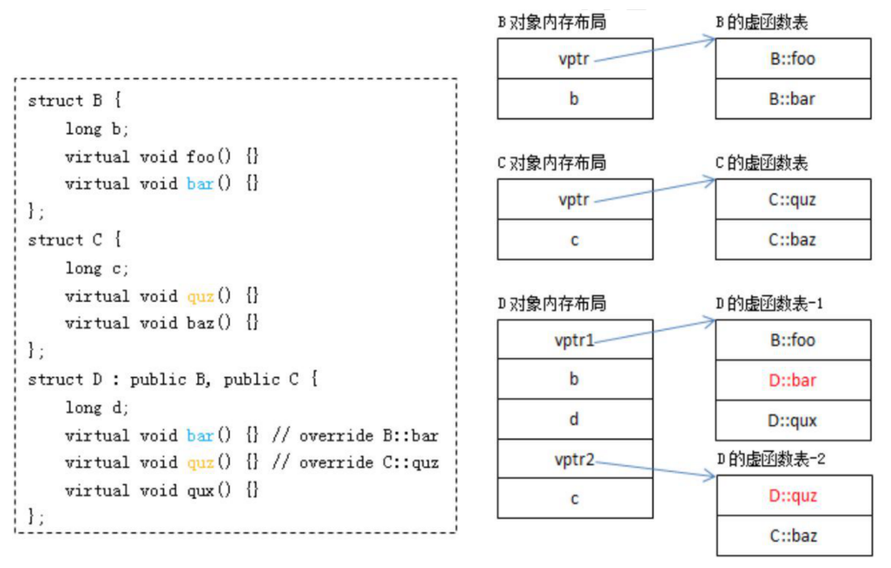

- [智能指针](#智能指针)
  - [简述智能指针](#简述智能指针)
  - [智能指针的常见接口](#智能指针的常见接口)
  - [智能指针种类](#智能指针种类)
- [底层](#底层)
  - [C++ 中内存分配情况](#c-中内存分配情况)
  - [指针参数传递，引用参数传递](#指针参数传递引用参数传递)
  - [内存对齐](#内存对齐)
- [关键字](#关键字)
  - [const 和 static](#const-和-static)
  - [volatile](#volatile)
  - [extern](#extern)
  - [define 与 const](#define-与-const)
  - [final](#final)
- [四种强制转换](#四种强制转换)
- [C和C++](#c和c)
- [面向对象](#面向对象)
  - [构造函数](#构造函数)
    - [拷贝构造函数](#拷贝构造函数)
  - [面向对象三大特性](#面向对象三大特性)
  - [多态的实现](#多态的实现)
  - [虚函数](#虚函数)
  - [构造和析构顺序](#构造和析构顺序)
  - [构造函数析构函数可否抛出异常](#构造函数析构函数可否抛出异常)
- [扯概念](#扯概念)
  - [重载、重写、重定义](#重载重写重定义)
  - [野指针和悬空指针](#野指针和悬空指针)
  - [函数指针](#函数指针)
  - [堆栈区别](#堆栈区别)
  - [抽象类](#抽象类)
  - [静态绑定和动态绑定](#静态绑定和动态绑定)
  - [深拷贝和浅拷贝](#深拷贝和浅拷贝)
  - [动态联编和静态联编](#动态联编和静态联编)
  - [字面值类型（常量类型）](#字面值类型常量类型)
  - [模板是什么，实现怎么回事](#模板是什么实现怎么回事)
- [STL](#stl)
  - [STL迭代器失效](#stl迭代器失效)
    - [insert](#insert)
    - [erase](#erase)
  - [resize和reverse](#resize和reverse)
- [情景](#情景)
  - [在main之前运行](#在main之前运行)
# 智能指针
## 简述智能指针
- 作用：管理指针，避免忘记释放
- RAII思想：充分的利用了C++语言局部对象自动销毁的特性来控制资源的生命周期

## 智能指针的常见接口
```
T* get();
T& operator*();
T* operator->();
T& operator=(const T& val);
T* release();
void reset (T* ptr = nullptr);
```

## 智能指针种类
```
auto_ptr // 已弃用
unique_ptr  // 独占
shared_ptr  // 共享
weak_ptr    // 弱引用
```
> auto_ptr
- 采⽤所有权模式
  - 被 `weak_ptr` 替代
```cpp
auto_ptr<std::string> p1 (new string ("hello"));
auto_ptr<std::string> p2;
p2 = p1; //auto_ptr 不会报错.
```
- 上面代码中：p2 剥夺了 p1 的所有权，但是当程序运⾏时访问 p1 将会报错。所以 auto_ptr 的缺点是：**存在潜在的内存崩溃问题**

> unique_ptr
- 独占。释放所有权必须 **显式调用方法**
```cpp
unique_ptr<string> p3 (new string (auto));//#4
unique_ptr<string> p4；//#5
p4 = p3;//此时会报错
```
> shared_ptr
- 共享式

> weak_ptr
- weak_ptr 是⽤来解决 shared_ptr 相互引⽤时的死锁问题


# 底层
## C++ 中内存分配情况
- 堆（`malloc/free`）、栈、自由存储区（`new delete`）、全局/静态存储区、代码区
  - `const`只是只读的意思，和存储在哪没有关系
  - `constexptr`：字面值常量，一般编译时在使用的时候被替换了。

## 指针参数传递，引用参数传递
- 参考：https://blog.csdn.net/weikangc/article/details/49762929
- **指针参数**传递本质上是值传递，它所传递的是一个地址值。
- **引用参数**传递过程中，被调函数的形式参数也作为局部变量在栈中开辟了内存空间，但是这时存放的是由主调函数放进来的所引用实参变量的地址。
  - 对其的操作都会默认**间接引用**
- 编译底层：`符号表---地址`，程序在编译时分别将指 针和引用添加到符号表上，符号表上记录的是变量名及变量所对应地址。指针变量在符号表上对应的地址值为指针变量的地址值，而**引用在符号表上对应的地址值为 引用对象的地址值**。符号表生成后就不会再改，因此指针可以改变其指向的对象（指针变量中的值可以改），而引用对象则不能修改。


## 内存对齐
- 为什么要：读的快

# 关键字
## const 和 static
> const
- const + 变量：只读
  - 如果是全局：局限本文件，否则 extern 声明
  - 如果是类成员变量：必须初始化
- const + 成员函数：这个函数不能修改 **对象成员变量**
- const + 指针：区分 顶层const和底层const

> static
- static + 局部变量：只初始化一次，放静态存储区，局部可见
- static + 全局变量/函数：本地性，仅本文件可见该变量
- static + 类函数：该函数属于一个类，没对象也能用
- static + 类变量：该变量属于一个类，没对象也能用
  - 静态非常量数据成员，其只能在类外定义和初始化，在类内仅是声明而已

## volatile
- 有空看
///
## extern
1. 表声明
2. `extern "C"`，表c风格的符号修饰

## define 与 const
- define：预编译
- cosnt：编译
  - 更准确是和constexpr

## final
1. 禁止继承（对类）
2. 禁止重写（对成员函数，让虚函数到此为止）

# 四种强制转换
- `static_cast`：只要不包含**底层const**(`volatile`也一样)，以及除了reinterpret_cast能做到的以外，其他都可以使用`static_cast`;
  - 当需要把一个较大的算数类型赋值给较小的类型的时候，非常有用
- `const_cas`t：只能改变运算对象的**底层const**
- `reinterpret_cas`t：改变指针或**引用（震惊）** 的类型、将指针或引用转换为一个足够长度的整形、将整型转换为指针或引用类型。
- `dynamic_cast`：在类型转换时会进行动态类型检查
  - 主要用在**基类转子类**中
# C和C++
- 有面向对象，继承，多态
- 模板
- STL

# 面向对象
## 构造函数
> 种类
- 默认构造函数
- 拷贝构造函数
- 移动拷贝构造
- 类型转换构造

> 执行过程
- 基类的构造函数
- vptr初始化（如果有虚函数）
- 初始化列表
- 执行函数体

### 拷贝构造函数
> 什么时候调用拷贝构造函数（三种情况）
- 传入
- 返回
- 初始化

> 为什么传进来的要是引用
- 禁止套娃

## 面向对象三大特性
- 继承
- 封装
- 多态
## 多态的实现
- 编译时多态：模板
- 运行时多态：继承+虚函数
## 虚函数 
<div style="zoom: 80%" align="center"></div>


> 虚函数表继承时的处理
- 对于派生类来说，编译器建立虚函数表的过程其实一共是三个步骤：
  - **先拷贝**， 拷贝基类的虚函数表，如果是多继承，就拷贝每个有虚函数基类的虚函数表
  - **多继承情况，其中一个为主基类（和继承类共用）**， 当然还有一个基类的虚函数表和派生类自身的虚函数表共用了一个虚函数表，也称为某个基类为派生类的主基类
  - **查看是否有重写，查看是否有自身虚函数**，查看派生类中是否有重写基类中的虚函数， 如果有，就替换成已经重写的虚函数地址；查看派生类是否有自身的虚函数，如果有，就追加自身的虚函数到自身的虚函数表中。
> 析构为什么虚函数
- 防止对父类delete，每调用子类的虚函数

> 纯虚函数作用
- 定义接口
- 多继承。 一个is-a ，其余皆为接口

> 哪些不能是虚函数
- 构造函数
  - 我们要创建⼀个对象的话，是需要知道对象的完整信息的
- 内联函数
  - 矛盾：又要内联 又要虚
- 静态函数
- ... 

> 构造函数和析构函数中调用虚函数会怎么样
- 一个还没出生，一个还没死去
- 其实都是调用自己的函数（不可能基类去调用自己派生类的，不符合伦理）

## 构造和析构顺序
- 构造
  - 基类
  - 成员类对象
  - 派生类
- 析构
  - 派生类
  - 成员类对象
  - 基类


## 构造函数析构函数可否抛出异常
///
# 扯概念
## 重载、重写、重定义
- 重载：函数名和返回相同，输入变量不同
  - 并存
- 重写：override
  - 不并存，虚
- 重定义：子类重新定义父类中有相同名称的非虚函数 
  - 不并存，不虚
## 野指针和悬空指针
- 野指针：没有初始化的指针
  - 避免：初始化nullptr
- 悬空指针：已经被释放了的
  - 避免：释放后初始化nullptr
## 函数指针
- 指向函数入口地址
- 函数与函数指针之间有隐式转换
## 堆栈区别
- balabala

## 抽象类
- 有纯虚函数的类

## 静态绑定和动态绑定
- 首先要知道**静态类型和动态类型**，静态类型就是它在程序中被声明时所采用的类型，在编译期间确定。动态类型则是指 **“目前所指对象的实际类型”，在运行期间确定**
- 静态绑定：绑定的是静态类型，所对应的函数或属性依赖于对象的静态类型，发生在编译期间
- 动态绑定：我在运行时才知道它实际是什么类型
  - 借助虚函数


## 深拷贝和浅拷贝
- 深拷贝：指针所指的东西都拷贝了
- 浅拷贝：只拷贝了指针

## 动态联编和静态联编
///

## 字面值类型（常量类型）
- 字面值类型是指编译时就能得到结果的类型，具体包括算术类型、引用和指针。自定义类、IO类不属于该类型。

## 模板是什么，实现怎么回事
- 先把实例化的编译好，然后编译代码调用的地方。


# STL
##  STL迭代器失效
> https://stackoverflow.com/questions/6438086/iterator-invalidation-rules-for-c-containers

- 总结：
  - 迭代器比引用严格，迭代器失效，引用肯定失效
- 问题：
  - 为什么erase vector之后引用失效，不就是指向其他的对象而已吗。
### insert
> 序列容器
- `vector` : **插入之前**的所有迭代器和引用不受影响，**除非导致容量改变**（这种情况下对元素的**引用和迭代器都失效**）
- `deque`：所有迭代器和引用都无效，除非插入的成员位于deque的末尾（前面或后面）（在这种情况下，**所有迭代器都无效，但对元素的引用不受影响**）
  - 迭代器都会失效
  - 为什么：///
- `list`：所有的迭代器和引用都不受影响

> 关联容器
- `[multi]{set,map}`：所有迭代器和引用都不受影响
- `unordered_[multi]{set,map}`：当rehash的时候，所有的迭代器都失效，但是引用不失效
  - 因为是拉链，链表节点的地址不会变的，所以引用有效


### erase
> 序列容器
- `vector`: 擦除点以及之后的每个迭代器和引用都失效
- `deque`: 所有的迭代器和引用无效，除非删除的成员位于deque的末尾（前面或后面）（在这种情况下，**删除元素的引用和迭代器无效**）
- `list`: 只有被擦除的迭代器和引用无效

> 关联容器
- `[multi]{set,map}`: 只有被擦除元素的迭代器和引用无效
- `unordered_[multi]{set,map}`：只有被擦除元素的迭代器和引用无效
  - 不用考虑rehash

## resize和reverse
- resize：元素数量改变
- reverse：容量改变


# 情景
## 在main之前运行
> gcc扩展
```cpp
__attribute((constructor))void before() {
  printf("before main 1\n");
}
```

> 利用全局变量

```cpp
int test1(){
  cout << "before main 2" << endl;
  return 1; 
}
int i = test1();
```