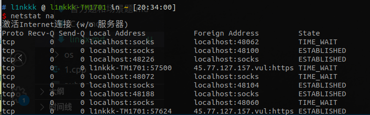
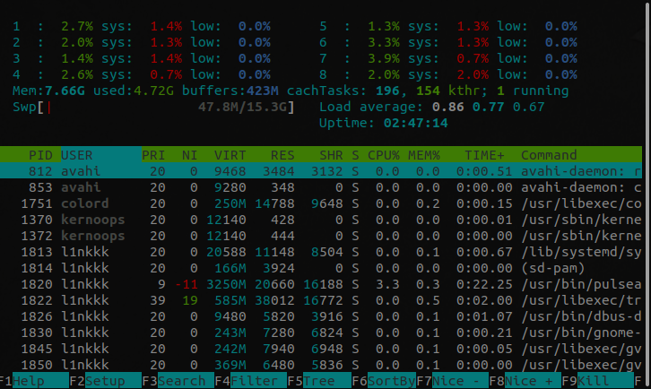
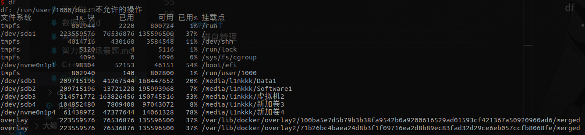

# linux工具
## 网络连接
### netstat
- 查socket连接
<div style="zoom: 80%" align="center"></div>

## 进程
### htop
- 进程状态 

<div style="zoom: 80%" align="center"></div>

## fd
### lsof
- https://www.cnblogs.com/peida/archive/2013/02/26/2932972.html
- 查看打开的文件
- `TYPE`:文件类型
  - REG：普通文件
  - DIR：目录
  - UNIX：UNIX套接字
  - IPv4：网络套接字
  - ...
```
COMMAND     PID USER   FD      TYPE             DEVICE     SIZE       NODE NAME
init          1 root  cwd       DIR                8,2     4096          2 /
init          1 root  rtd       DIR                8,2     4096          2 /
init          1 root  txt       REG                8,2    43496    6121706 /sbin/init
init          1 root  mem       REG                8,2   143600    7823908 /lib64/ld-2.5.so
init          1 root  mem       REG                8,2  1722304    7823915 /lib64/libc-2.5.so
init          1 root  mem       REG                8,2    23360    7823919 /lib64/libdl-2.5.so
init          1 root  mem       REG                8,2    95464    7824116 /lib64/libselinux.so.1
init          1 root  mem       REG                8,2   247496    7823947 /lib64/libsepol.so.1
init          1 root   10u     FIFO               0,17                1233 /dev/initctl
migration     2 root  cwd       DIR                8,2     4096          2 /
migration     2 root  rtd       DIR                8,2     4096          2 /
migration     2 root  txt   unknown                                        /proc/2/exe
ksoftirqd     3 root  cwd       DIR                8,2     4096          2 /
ksoftirqd     3 root  rtd       DIR                8,2     4096          2 /
ksoftirqd     3 root  txt   unknown                                        /proc/3/exe
migration     4 root  cwd       DIR                8,2     4096          2 /
migration     4 root  rtd       DIR                8,2     4096          2 /
migration     4 root  txt   unknown                                        /proc/4/exe
ksoftirqd     5 root  cwd       DIR                8,2     4096          2 /
ksoftirqd     5 root  rtd       DIR                8,2     4096          2 /
ksoftirqd     5 root  txt   unknown                                        /proc/5/exe
events/0      6 root  cwd       DIR                8,2     4096          2 /
events/0      6 root  rtd       DIR                8,2     4096          2 /
events/0      6 root  txt   unknown                                        /proc/6/exe
events/1      7 root  cwd       DIR                8,2     4096          2 /
```

## 磁盘
### du
- 磁盘占用空间
<div style="zoom: 80%" align="center"></div>

### df
- 磁盘管理
<div style="zoom: 80%" align="center"></div>