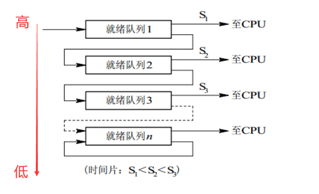
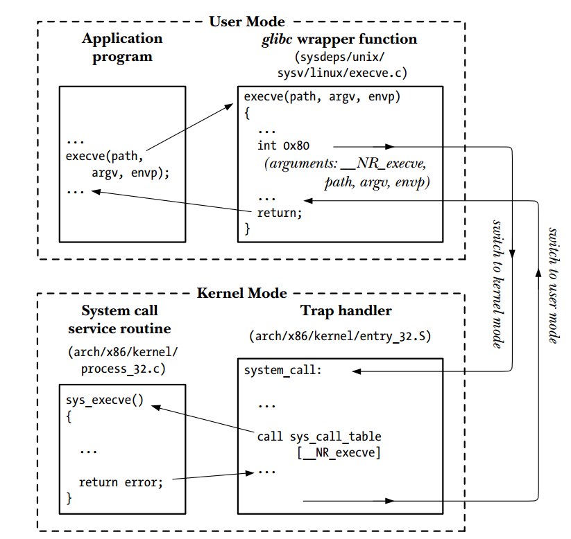
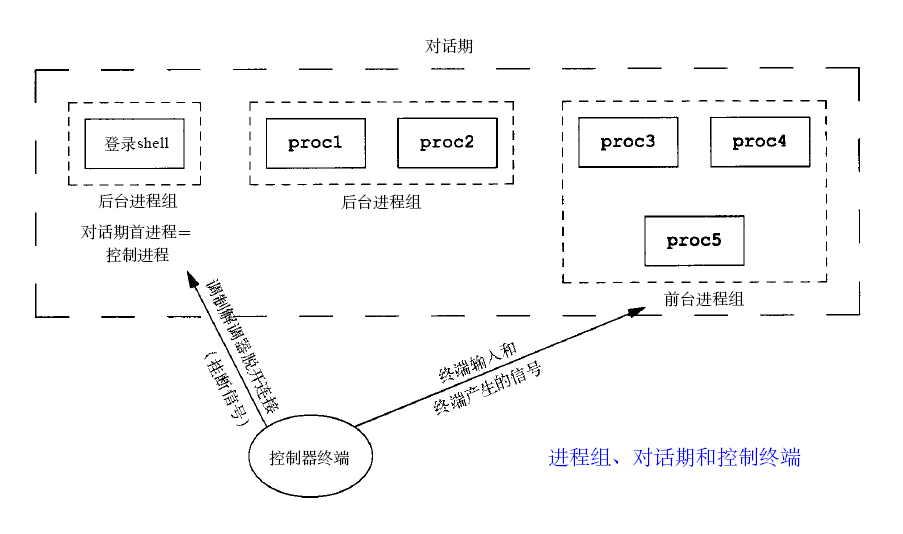

- [基本](#基本)
  - [什么是操作系统](#什么是操作系统)
  - [操作系统的分类](#操作系统的分类)
  - [内核态和用户态](#内核态和用户态)
- [进程和线程](#进程和线程)
  - [什么是进程](#什么是进程)
  - [什么是线程](#什么是线程)
  - [线程进程的区别](#线程进程的区别)
  - [进程和线程的切换区别](#进程和线程的切换区别)
  - [线程模型](#线程模型)
  - [进程间通信的方法](#进程间通信的方法)
    - [管道细节](#管道细节)
  - [同步](#同步)
  - [进程调度时机](#进程调度时机)
  - [不能进行进程调度的情况](#不能进行进程调度的情况)
  - [进程调度的指标](#进程调度的指标)
  - [进程的状态和状态之间的转换](#进程的状态和状态之间的转换)
  - [孤儿进程和僵尸进程](#孤儿进程和僵尸进程)
- [锁](#锁)
  - [为什么会产生死锁](#为什么会产生死锁)
  - [如何解决死锁问题？](#如何解决死锁问题)
  - [如何检查死锁](#如何检查死锁)
- [系统编程](#系统编程)
  - [系统调用过程](#系统调用过程)
  - [什么是信号](#什么是信号)
  - [如何编写正确且安全的信号处理函数](#如何编写正确且安全的信号处理函数)
  - [线程安全和可重入安全](#线程安全和可重入安全)
  - [fork继承什么](#fork继承什么)
  - [一些api（现场表演伪代码用）](#一些api现场表演伪代码用)
- [网络编程](#网络编程)
  - [简述select](#简述select)
  - [poll](#poll)
  - [epoll](#epoll)
    - [ET（边缘触发）和LT（水平触发）](#et边缘触发和lt水平触发)
    - [epoll底层实现](#epoll底层实现)
  - [什么是协程](#什么是协程)
- [内存](#内存)
  - [为什么要引入虚拟内存？](#为什么要引入虚拟内存)
  - [快表和MMU](#快表和mmu)
  - [多级页表](#多级页表)
  - [虚拟地址到物理地址转化过程](#虚拟地址到物理地址转化过程)
  - [页面置换算法](#页面置换算法)
- [进程、进程组和会话](#进程进程组和会话)
  - [进程组](#进程组)
  - [会话](#会话)
  - [前台进程组](#前台进程组)
  - [后台进程组](#后台进程组)
  - [终端进程组ID](#终端进程组id)
  - [进程组和会话和终端的关系](#进程组和会话和终端的关系)
  - [创建守护进程](#创建守护进程)
# 基本
## 什么是操作系统
- 向上提供接口，向下管理资源。
- 内核：操作系统的核心
## 操作系统的分类
- 批处理操作系统、分时操作系统、实时操作系统
- 若一个操作系统兼顾批操作和分时的功能，则称该系统为**通用操作系统**
  - 如：Windows、Linux、MacOS等

> 批处理系统
- 特点：没有太多的用户操作，调度算法目标是保证**吞吐量和周转时间**
- 调度算法
  - 先来先服务(FCFS)
  - 短作业优先
  - 最短剩余时间优先
    - 短作业优先+可抢占

> 分时操作系统
- 交互式系统：交互式系统有大量的用户交互操作，在该系统中调度算法的目标是快速地进行响应。（响应时间）
- 调度算法
  - 时间片轮转
    - FCFS+时间片（单个时间片）
  - 优先级调度
    - 优先级高先调度，等太久升级
  - 多级反馈队列
    - 解决的问题：一个进程需要100个时间片，每次执行单个时间片，需要切换100次。
    - 时间片轮转+优先级调度
      - 最上面的优先权最高。因此只有上一个队列没有进程在排队，才能调度当前队列上的进程。
<div style="zoom: 100%" align="center"></div>

> 实时操作系统
- 要求一个请求在一个确定时间内得到响应
- 分为**硬实时和软实时**，前者必须满足绝对的截止时间，后者可以容忍一定的超时

## 内核态和用户态
- 注：**特权指令和访问空间** 两点去展开说就好了
- 为了避免操作系统和关键数据被用户程序破坏，将处理器的执行状态分为内核态和用户态。

- 内核态是操作系统管理程序执行时所处的状态，能够执行包含特权指令在内的一切指令，能够访问系统内所有的存储空间。

- 用户态是用户程序执行时处理器所处的状态，不能执行特权指令，只能访问用户地址空间。

- 用户程序运行在用户态,操作系统内核运行在内核态。


# 进程和线程
## 什么是进程
- 资源分配基本单位
- 由以下部分组成：
  - **PCB**(进程存在的唯一标志)：包含进程标识符PID，进程当前状态，程序和数据地址，进程优先级、CPU现场保护区（用于进程切换），占有的资源清单等
  - 程序段
  - 数据段
## 什么是线程
- CPU调度的基本单位
- 独立的资源：寄存器组，栈，线程ID，错误返回码，信号掩码，PCB（线程优先级，处理器状态）
- 共享的资源：堆，打开的文件和其他内核资源。
- 注：以上资源都是线程所属进程的

> 为什么需要线程
- 并发时，上下文切换比较快
- 开发逻辑比较简单，线程通信也比较简单。
## 线程进程的区别
- 资源
  - 进程资源分配基本单位
- 调度
  - 线程调度基本单位
- 系统开销
  - 上下文切换，线程更快
- 通信
  - 线程通过读写同一进程数据
  - 进程通过IPC
- 可靠性，隔离性

## 进程和线程的切换区别
- 进程切换比较慢
- 因为进程切换他要把虚拟内存给切换了
  - 造成CPU缓存都要切换。（线程可能只序作废L1缓存）
  - 造成快表也要作废


## 线程模型
- 根据运行环境和调度者身份，线程可以分为：**内核线程和用户线程**
- 一个进程可以拥有M个内核线程和N各用户线程，按M:N可以分为多种模式。（M<=N）
  - 完全在用户空间实现（1:X)
    - 有点像协程管理了，内核不知道这些线程的存在。
    - 优点：
      - 速度快，创建线程无需内核的干预
    - 缺点：  
      - 无法利用多核
      - 用户线程的优先级只对同一个进程中的有效
  - 完全由内核调度（1:1）
    - 和完全在用户空间实现，优缺点互换
    - **LinuxThreads和NPTL**都是这种方式
  - 双层模式（X:Y）
    - 灵活但是复杂

## 进程间通信的方法
- 在内核中开辟一块缓冲区,进程A把数据从用户空间拷到内核缓冲区,进程B再从内核缓冲区把数据读走,内核提供的这种机制称为进程间通信。

- 管道、FIFO、消息队列、信号量、信号、共享内存、socket
> 管道
- 半双工
- 只能在父子进程间
> FIFO(命名管道)
- 管道+解除父子进程限制
> 消息队列
- 不一定像管道和命名管道一样，接收数据先入先出，可以有选择。
> 信号量
- 计数器，用于共享资源的访问控制
> 共享内存
- 允许多个进程共享一个给定的存储区。因为数据**不需要在进程之间复制**，所以这是**最快的一种 IPC**
- 需要同步，和互斥量一起使用
> 套接字

### 管道细节
> 进程如何通过管道进行通信
- 管道是一种最基本的IPC机制，作用于有血缘关系的进程之间，完成数据传递。调用pipe系统函数即可创建一个管道。有如下特质：
  - 其本质是一个伪文件(实为内核缓冲区)
  - 由两个文件描述符引用，一个表示读端，一个表示写端。
  - 规定数据从管道的写端流入管道，从读端流出。
> 内部原理
- 内核缓冲区中的环形队列

> 局限性
- 只能有关系的进程之间
- 不可以重复读，读了就没了。
- 半双工

## 同步
> 进程间
- 信号量
- 管道
- socket
> 线程间
- 条件变量+互斥量
- 信号量
- 管道
## 进程调度时机
- 时间片用完
- 抢占系统中，优先级更高的抢占
- 当前进程阻塞
- 当前进程结束

## 不能进行进程调度的情况
> http://c.biancheng.net/cpp/html/2594.html
- 在中断处理程序执行时。
- 在操作系统的内核程序临界区内。
  - 进入临界区后，需要独占式地访问共享数据，理论上必须加锁，以防止其他并行程序进入，在解锁前不应切换到其他进程运行，以加快该共享数据的释放
- 其它需要完全屏蔽中断的原子操作过程中。

## 进程调度的指标
> http://c.biancheng.net/cpp/html/2594.html
- CPU利用率。（忙的比例）
- 系统吞吐量：表示单位时间内CPU完成作业的数量
- 响应时间：是指从用户提交请求到系统首次产生响应所用的时间
- 周转时间= `作业完成时间 - 作业提交时间`
  - 平均周转时间 = `(作业1的周转时间 + … + 作业 n 的周转时间) / n`
  - 带权周转时间=`作业周转时间/作业实际运行时间`
  - 平均带权周转时间 = `(作业1的带权周转时间 + … + 作业 n 的带权周转时间) / n`

## 进程的状态和状态之间的转换
- 运行态
- 就绪态
- 阻塞态
> 切换
- 运行态-->就绪态：时间片完了
- 就绪态-->运行态：被调度了
- 运行态-->阻塞态：系统调用或io之类的。
- 阻塞态-->就绪态：等待的事件已经完成

## 孤儿进程和僵尸进程
- 孤儿：父挂了，孩子没挂
- 僵尸：孩子挂了，父没处理

# 锁
## 为什么会产生死锁
产生死锁需要满足下面四个条件：
- 互斥条件：你用了我不能用。
- 占有并等待条件：不释放，并且会阻塞
- 非抢占条件：被占有，不能抢
- 循环等待条件：形成环，我等你的，你等我的
## 如何解决死锁问题？
- 资源不共享，一次性分配
- 只要一个资源没拿到，必须释放其他已拿资源
- 可抢占。
- 资源有序分配：避免形成环。比如需要a，b资源，就按一定顺序申请。

## 如何检查死锁
- 工具：如gdb
- 打日志


# 系统编程
## 系统调用过程
- 系统调用的过程(p34)
  - C语言函数库中的外壳函数发起
  - 修改特定寄存器值(传参和传系统调用编号)
  - 外壳函数执行 int 80————处理器从**用户态切换到核心态**
  - 响应0x80中断，执行system_call()例程（进入中断处理函数），例程如下
    - \#
    - 内核栈中保存寄存器值
    - 审核调用编号有效性，然后进行系统调用服务例程的检索
    - 对参数进行审核
    - \#
    - 执行服务例程，并返回结果给system_call
    - 从内核栈中恢复寄存器
    - 返回到外壳函数，切回用户态

<div align="center" style="zoom:70%"></div>

## 什么是信号
- 信号是事件发生时对进程的通知机制。
- 信号
  - 标准信号（60多种）
  - 实时信号

## 如何编写正确且安全的信号处理函数
- 处理程序要尽可能简单。
- 保存和恢复errno
- 处理函数可重入
- 阻塞其他信号（不一定）
- 意识：**如果存在一个未处理的信号就表明至少有一个信号到达了**。

## 线程安全和可重入安全
- 线程安全：线程安全问题都是由全局变量及静态变量引起的。
  - 任何未使用静态数据或其他共享资源的函数都是**线程安全**的。
  - 而使用全局变量或静态局部变量的函数是**非线程安全的**。
- 可重入：
  - 函数被不同的控制流程调用,有可能在第一次调用还没返回时就再次有别的线程进入该函 数,这称为重入
- 线程安全 > 可重入安全
  - 访问全局变量，但是加锁了。（是线程安全，但是不是可重入）

## fork继承什么
1. 根目录
2. 打开的文件描述符
3. 信号(Signal)处理方式（包括信号处理函数）
   - exec后自定义的信号处理函数变为默认方式
4. 环境变量
   - exec多个api的处理方式不同
5. 用户号UIDs和用户组号GIDs
6. 堆栈（写时复制）
7. 执行时关闭(Close-on-exec)标志
   - 如果设置了：在执行exec时关闭该描述符
8. 进程组号
9.  控制终端和会话
10. ...

> 不继承什么
- 进程号
- pending signals
 
## 一些api（现场表演伪代码用）
- 线程
  - pthread_create
  - pthread_exit
  - pthread_join
  - pthread_cancel
  - pthread_detach
- 信号量
  - sem_init
  - sem_destory
  - sem_wait
  - sem_trywait
  - sem_post
- 互斥锁
  - pthread_mutex_init
  - pthread_mutex_destory
  - pthread_mutex_lock
  - pthread_mutex_trylock
  - pthread_mutex_unlock
- 条件变量
  - pthread_cond_init
  - pthread_cond_destroy
  - pthread_cond_broadcast
  - pthread_cond_signal
  - pthread_cond_wait

> 进程
- 管道
  - pipe
  - socketpair
- 信号量
  - semget：创建或者获取
  - semop：pv操作
  - sem_ctl 更精细控制
- 共享内存
  - shmget 创建
  - shmat 关联到进程地址空间
  - shmdt 与进程地址空间分离
  - shmclt 更精细控制
- 消息队列
  - msgget：创建
  - msgsnd：添加到消息队列
  - msgrcv：从消息队列中接收
  - msgctl：更精细控制

# 网络编程
## 简述select
- 检测方式：轮训方式，效率随监听数线性增长
- 数据结构：位图
- 文件描述符上限数比较小
- 需回传

## poll
- 检测方式：轮训
- 数据结构：链表
- 没有上限限制
- 需回传

## epoll
- 检测方式：回调方式
- 数据结构：内核中的事件表
- 过程：采用回调的方式。内核检测到就绪===>触发回调函数===>将就绪事件插入到内核就绪事件队列====>将内核就绪时间队列的内容拷贝到用户空间
- 注册一次之后不需要回传
### ET（边缘触发）和LT（水平触发）
- ET
  - 通知一次，没处理就不通知了。
  - ET一定非阻塞，不然没数据了就gg
- LT默认
  - 没处理一直通知
- 对比：LT简单；ET高效

### epoll底层实现 
- 参考
  - http://luodw.cc/2016/01/24/epoll/
  - https://www.codenong.com/cs109825836/

- `epoll_create`：内核高速缓冲区中开辟一块内存，**红黑树+双向链表（readylist）**
  - 红黑树：支持快速的查找，插入，删除
  - 双向链表：支持快速插入和删除
    - 中断处理函数将就绪的 `epitem` 插入到 `readylist`
- `epoll_ctl`（add）:一个fd被add之后，内核会为其生成一个 **epitem结构对象**。将该对象放到红黑树，并对该对象注册一个cb。
  - **红黑树的作用**是使用者调用EPOLL_MOD的时候可以快速找到fd对应的epitem
- `epoll_wait`：
  - 遍历的是readylist，而不是所有被监听的
  - 步骤
    1. 将readylist中的epitem出列
    2. 将触发的事件拷贝到用户空间
    3. 判断epitem是否需要重新添加回readylist

- `EPOLLONESHOT`：清空的是`epitem`上关注的事件，而不是删除红黑树中的节点。删除需要`EPOLL_DEL`

- LT(水平触发)和ET(边缘触发)：
  - 当一个socket句柄上有事件时，内核会把该句柄插入上面所说的准备就绪list链表，这时我们调用epoll_wait，会把准备就绪的socket拷贝到用户态内存，然后清空准备就绪list链表，最后，epoll_wait干了件事，就是检查这些socket，如果不是ET模式（就是LT模式的句柄了），并且这些socket上确实有未处理的事件时，又把该句柄放回到刚刚清空的准备就绪链表了。所以，非ET的句柄，只要它上面还有事件，epoll_wait每次都会返回。而ET模式的句柄，除非有新中断到，即使socket上的事件没有处理完，也是不会次次从epoll_wait返回的．
  - 注：我觉得是奇怪的，因为还没处理呢，怎么知道有未处理完的事件呢？


> ET和LT性能比较

经常看到比较ET和LT模式到底哪个效率高的问题．有一个回答是说**ET模式下减少epoll系统调用**．这话没错，也可以理解，但是在ET模式下，为了避免数据饿死问题，用户态必须用一个循环，将所有的数据一次性处理结束．所以在ET模式下下，虽然epoll系统调用减少了，但是用户态的逻**辑复杂了，write/read调用增多**了．**所以这不好判断，要看用户的性能瓶颈在哪**

## 什么是协程
- 用户态自己调度，内核无感知


# 内存
## 为什么要引入虚拟内存？
- 简化开发
- 高效利用内存
- 隔离

## 快表和MMU
> MMU  
- MMU即内存管理单元，该硬件负责处理虚拟地址到物理地址的转化工作。快表也存储在MMU上
> 快表
- 就是页表的缓存嘛。让原来要访问两次主存（一次页表，一次访问数据），变成一次高速缓存一次主存。
- 通常快表处于MMU中
- 内容：页面号——物理内存地址


## 多级页表
- https://blog.csdn.net/forDreamYue/article/details/78887035
- 考了算我输

## 虚拟地址到物理地址转化过程
- 虚拟地址由**虚拟页号和页偏移**两部分组成。 通过虚拟地址的页面号，首先在**快表**中查询是否有该映射，查询不成功，在**页表**中找到该页对应的物理地址。 然后通过页 **`物理地址+页偏移`**，得到真实的物理地址


## 页面置换算法
> OPT算法（理论最佳）
- 所选择的被换出的页面将是最长时间内不再被访问，通常可以**保证获得最低的缺页率**。
- 注：只是一种理论上算法

```
举例：一个系统为某进程分配了三个物理块，并有如下页面引用序列：

7，0，1，2，0，3，0，4，2，3，0，3，2，1，2，0，1，7，0，1

开始运行时，先将 7, 0, 1 三个页面装入内存。当进程要访问页面 2 时，产生缺页中断，会将页面 7 换出，因为页面 7 再次被访问的时间最长。
```

> FIFO
- 先进先出

> 最近最久未使用（LRU）
- 哈希链表
- 置换出最不常用的页面

> 最近最少使用淘汰LFU
- 当缓存达到容量 `capacity` 时，则应该在插入新的键值对之前，删除使用频次（ `freq` ）最低的键值对。如果 `freq` 最低的键值对有多个，则删除其中最旧的那个。

# 进程、进程组和会话
> https://zhuanlan.zhihu.com/p/266720121
## 进程组
- 作用：创建进程组的目的是**用于简化向组内所有进程发送信号的操作**，即如果一个信号是发给一个进程组，则这个组内的所有进程都会受到该信号。
- 进程组内的所有进程都有相同的PGID，等于该组组长的PID。
- 生命周期：进程组的生命周期到组中最后一个进程终止或其加入其他进程组（离开本进程组）为止

## 会话
- 一般一个用户登录后新建一个会话，每个会话也有一个ID来标识（**SID**）。登录后的第一个进程叫做**会话领头进程（session leader）**
- 控制终端：一个会话一般会拥有一个控制终端用于执行IO操作。与控制终端建立连接的会话领头进程也称为**控制进程**

## 前台进程组
- 可对终端读写

## 后台进程组
- 只可以对终端写

## 终端进程组ID
- 终端进程组ID(TPGID)：用来标识一个进程是否处于一个和终端相关的进程组中.
  - **TPGID=前台进程组的PGID**
- 对于前台进程组：前台进程组中的进程的**TPGID=PGID**
- 对于后台进程组：PGID≠TPGID
- 对于和终端无关的进程：**TPGID=-1**

## 进程组和会话和终端的关系
一个会话中只存在一个前台进程组，但可以存在多个后台进程组。
<div style="zoom: 80%" align="center"></div>

## 创建守护进程
> 流程
```
1. 创建子进程，父进程退出 
2. 在子进程中创建新会话 
3. 改变当前目录为根目录 
4. 重设文件权限掩码 
5. 关闭文件描述符 
```
1. 创建子进程，父进程退出 
     - 让子进程成为孤儿进程
2. 在子进程中创建新会话 
3. 改变当前目录为根目录 
     - fork会继承根目录，一般将根目录改为`/`
4. 重设文件权限掩码
5. 关闭文件描述符 
     - 守护进程已经与所属的控制终端失去了联系，所以fd 1 2 3 都没意义了

```cpp
int main()
{
 pid_t pid;
 int i, fd;
 char *buf = "This is a Daemon\n";

 pid = fork();
 if (pid < 0) {
  printf("Error fork\n");
  exit(1);
 } 
 
 /* 第一步,父进程退出 */
 if (pid > 0) {
  exit(0); 
 }
 /* 第二步 */
 setsid();
 /* 第三步 */  
 chdir("/");  
 /* 第四步 */
 umask(0);
 /* 第五步 */  
 for(i = 0; i < getdtablesize(); i++) 
 {
  close(i);
 }
 
 /* 这时创建完守护进程，以下开始正式进入守护进程实际工作
  * 注意：由于此时守护进程完全脱离了控制终端，因此，不能像其他普通进程
  * 一样通过printf或者perror将错误信息输出到控制终端，一种通用的办
  * 法是使用syslog服务，将程序中的出错信息输入到系统日志文件中。
  * 本程序着重演示创建守护进程的步骤，暂不演示syslog。
  */
 while(1) {
  if ((fd = open("/tmp/daemon.log", 
    O_CREAT|O_WRONLY|O_APPEND, 0600)) < 0) {
   exit(1);
  }
  write(fd, buf, strlen(buf) + 1);
  close(fd);
  sleep(10);
 }
 
 exit(0);
}
```