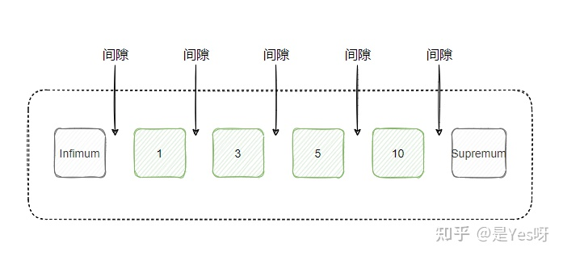
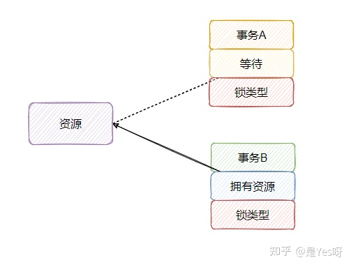
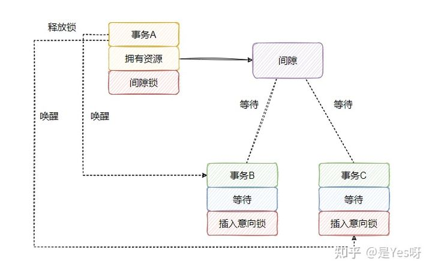
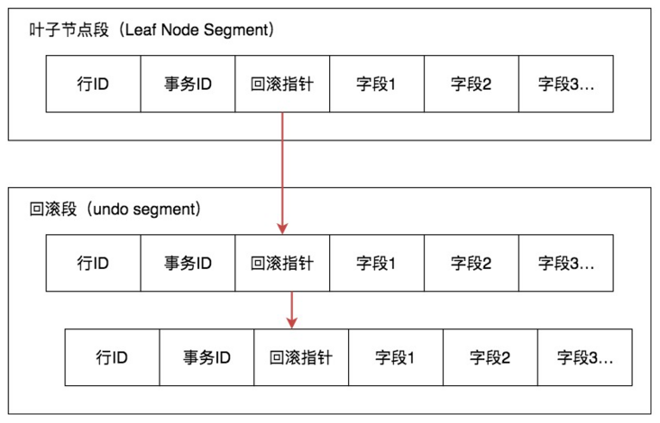
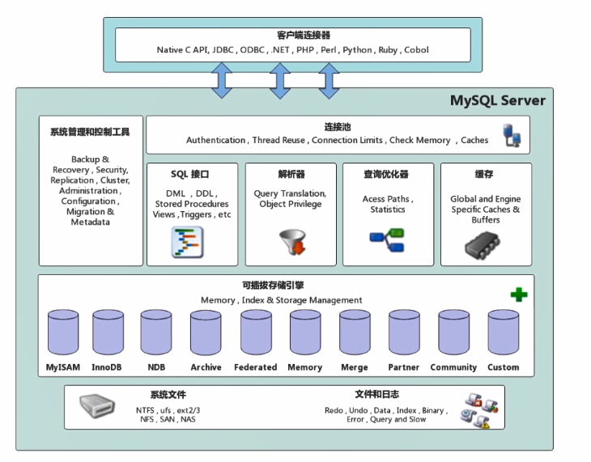
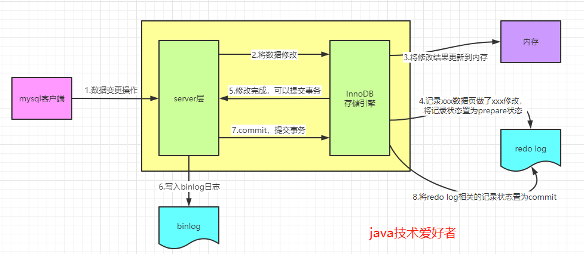
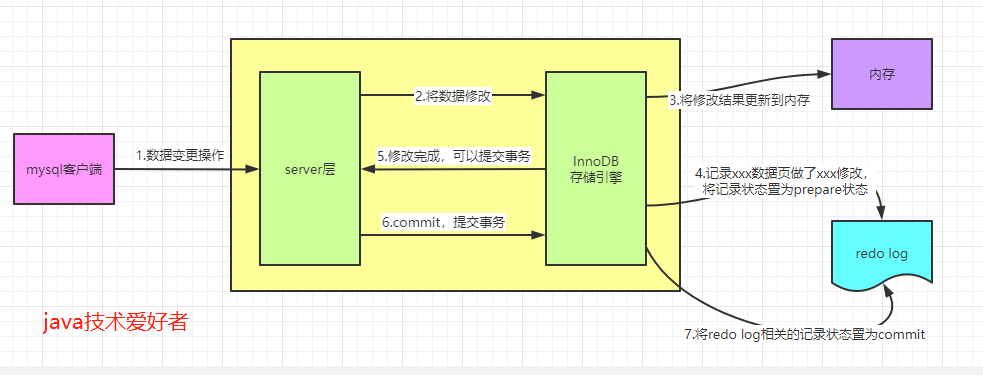

- [](#)
- [三大范式](#三大范式)
- [锁](#锁)
  - [InnoDB的几类行锁](#innodb的几类行锁)
  - [封锁协议](#封锁协议)
    - [三级封锁协议](#三级封锁协议)
    - [两阶段锁](#两阶段锁)
- [索引](#索引)
  - [B-Tree与B+树](#b-tree与b树)
  - [哈希索引](#哈希索引)
  - [聚集索引和非聚集索引（稀疏索引）](#聚集索引和非聚集索引稀疏索引)
  - [覆盖索引](#覆盖索引)
  - [主键索引和唯一索引](#主键索引和唯一索引)
- [事务](#事务)
  - [简述事务](#简述事务)
  - [事务隔离级别](#事务隔离级别)
  - [脏读、脏写、读倾斜（不可重复读）、更新丢失、写倾斜、幻读](#脏读脏写读倾斜不可重复读更新丢失写倾斜幻读)
  - [MVCC（多版本并发控制）](#mvcc多版本并发控制)
    - [快照读和当前读](#快照读和当前读)
- [分布式](#分布式)
  - [两阶段提交](#两阶段提交)
  - [分布式id生成方法](#分布式id生成方法)
- [复制和分区](#复制和分区)
  - [分库分表怎么做](#分库分表怎么做)
  - [什么情况下分表合适](#什么情况下分表合适)
- [Mysql](#mysql)
  - [Mysql架构](#mysql架构)
    - [服务层](#服务层)
    - [存储引擎层](#存储引擎层)
  - [InnoDB 和 MyISAM](#innodb-和-myisam)
    - [InnoDB](#innodb)
    - [MyISAM](#myisam)
  - [Mysql有哪些常见索引类型](#mysql有哪些常见索引类型)
  - [自适应Hash索引](#自适应hash索引)
  - [InnoDB的二级索引](#innodb的二级索引)
  - [联合索引和最左匹配原则](#联合索引和最左匹配原则)
  - [为什么数据库不用红黑树用B+树](#为什么数据库不用红黑树用b树)
  - [explain](#explain)
  - [MySQL优化流程](#mysql优化流程)
  - [日志](#日志)
    - [binlog](#binlog)
    - [redo log](#redo-log)
    - [undo log](#undo-log)
  - [MySQL主从复制](#mysql主从复制)
  - [只靠binlog可以支持数据库崩溃恢复吗](#只靠binlog可以支持数据库崩溃恢复吗)
  - [触发器](#触发器)
  - [增删改查](#增删改查)
  - [char和varchar区别](#char和varchar区别)
  - [delete和truncate区别](#delete和truncate区别)
  - [InnoDB可重复读是否存在幻读问题](#innodb可重复读是否存在幻读问题)
  - [crash-safe能力](#crash-safe能力)
  - [WAL](#wal)
  - [mysql为什么要用自增id作为主键](#mysql为什么要用自增id作为主键)

# 概念
## 关系型数据库与非关系型数据库区别
- 关系型数据库采用了**关系模型**（可以简单理解为**二维表格类型**）组织数据，一般可以遵守事务的ACID特性 不是由关系模型进行存储的均可视作非关系型数据库，比如以键值对的redis，图数据库等。
# 三大范式
> https://segmentfault.com/a/1190000013695030

- 可能存在的问题：
  - 从 冗余、增删改 去考虑
  - 消除了数据冗余、更新异常、插入异常和删除异常

- 第一范式：表中字段值是**原子的**
  - 表：字段1、 字段2(字段2.1、字段2.2)、字段3 ......
  - 如学生（学号，姓名，性别，高考成绩），如果认为最后一列还可以再分成（数学成绩，语文成绩，英语成绩），它就不是一范式了，否则就是；


- 第二范式：非主键字段**完全依赖**主键，而不是部分依赖。（第二范式针对联合主键的情况）
  - eg：考虑一个订单明细表：`【OrderDetail】（OrderID，ProductID，UnitPrice，Discount，Quantity，ProductName）`，主键应该是（OrderID，ProductID）
    - 问题：`UnitPrice，ProductName` 只依赖于 `ProductID`
  - 正确做法：【OrderDetail】表拆分为【OrderDetail】（OrderID，ProductID，Discount，Quantity）和【Product】（ProductID，UnitPrice，ProductName）


- 第三范式：不存在传递依赖
  - eg：考虑一个订单表`【Order】（OrderID，OrderDate，CustomerID，CustomerName，CustomerAddr，CustomerCity）`主键是（OrderID）
    - 问题：`CustomerName，CustomerAddr，CustomerCity` 直接依赖的是 CustomerID（非主键列），而不是直接依赖于主键
  - 正确做法：拆分【Order】为`【Order】（OrderID，OrderDate，CustomerID）`和`【Customer】（CustomerID，CustomerName，CustomerAddr，CustomerCity）`从而达到 3NF


- 反范式化
  - 适当的违反下范式，空间换时间


# 锁
- https://zhuanlan.zhihu.com/p/385693319
> 读写锁（锁的机制）
- 共享锁(读锁)：共享模式。
  - 需等待写锁释放
- 排它锁(写锁)：独占模式。
  - 需等待所有读锁释放
> 表级锁和行锁（锁的范围）
- 表级锁：整个表上锁
- 行锁：对某一行上锁
- 意向锁：更容易的支持多粒度锁。
  - eg：T想给表A上锁，得检查表中的每一行有没有行锁，十分耗时。如果有意向锁就不用了，就看**意向锁和表锁**被人拿了没有，没有就可以上锁，得益于以下规则：
    - 一个事务在获得某个数据行对象的 `S` 锁（读锁）之前，必须先获得表的 `IS` 锁或者更强的锁；
    - 一个事务在获得某个数据行对象的 `X` 锁（写锁）之前，必须先获得表的 `IX` 锁。
  - 作用：通过引入意向锁，事务 `T` 想要对表 `A` 加 `X` 锁，只需要先检测是否有其它事务对表 `A` 加了 `X/IX/S/IS` 锁，如果加了就表示有其它事务正在使用这个表或者表中某一行的锁，因此事务 `T` 加 `X` 锁失败。

> 乐观锁，悲观锁
- 一种解决和避免冲突的态度
  - 乐观锁是出现了问题后去解决
    - 可串行的快照隔离
  - 悲观锁是为了避免出现问题，一开始就严格串行
    - 2PL
> 乐观锁的实现
- 可串行化的快照隔离（MVCC+提交判断）
- CAS
  - ///


## InnoDB的几类行锁
- 深入:https://zhuanlan.zhihu.com/p/48269420
- 记录锁（Record Locks）、间隙锁（Gap Locks）、Next-Key Locks
  - 记录锁、间隙锁、临键锁**都是排它锁**

> 记录锁
- 记录锁总是锁定索引记录
  - `SELECT * FROM yes WHERE name = 'xx' FOR UPDATE;` 如果 name 不是索引的话，那么就是对整个表上锁
  - **没索引的列不要轻易的锁，不要以为有行锁就可以为所欲为**
```
比如，此时一个事务 A 执行 SELECT * FROM yes WHERE name = 'xx' FOR UPDATE; 那么 name = xx 这条记录就被锁定了，其他事务无法插入、删除、修改 name = xx 的记录。

此时事务 A 还未提交，另一个事务 B 要执行 insert into yes (name) values ('xx')，此时会被阻塞，这个很好理解。

但是，如果另一个事务 C 执行了 insert into yes (name) values ('aa')，这个语句会被阻塞吗？

看情况。

如果 name 没有索引。前面提到记录锁是加到索引上的，但是 name 没索引啊，那只能去找聚簇索引，但聚簇索引上面只有主键啊，它哪知道各自的 name 是什么，所以咋办？都锁了呗！

因此，如果 name 没有索引，那么事务 C 会被阻塞，如果有索引，则不会被阻塞
```

> Gap Lock间隙锁
- 解决的问题：对还未存在的记录也可以上锁，给一个索引范围上锁。
<div align="center" style="zoom:90%"></div>

> Next-key Lock
- InnoDB使用`Next-key Lock`让其在 **可重复读** 级别下避免幻读。
  - 也就是说InnoDB是2PL的
  - 设置为读提交模式就没有这种锁了。
- Next-key Lock：就是使用了Gap Lock也使用Record Lock，看是怎么查的，就给上什么锁
- 索引区间锁（DDIA上的）

> 补： Insert Intention Locks插入意向锁
- 描述：它也是一类间隙锁，但是它不是锁定间隙，而是等待某个间隙
- 作用：相当于加入到等待队列，等到等待的间隙锁释放后，就通知。
<div align="center" style="zoom:90%"></div>
<div align="center" style="zoom:90%"></div>

> 补：AUTO-INC Locks 锁
- 表锁，用于自增列插入数据时使用
- 注：在 `MySQL 5.1.22 `版本之后，又弄了个**互斥量**来进行自增减的累加。互斥量的性能高于 `Auto-Inc Lock`，因为 `Auto-Inc Lock`是语句插入完毕之后才释放锁，而互斥量是在语句插入的时候，**获得递增值之后，就可以释放锁**，所以性能更好。
  - 使用互斥量要注意并发插入时，基于 statement -based binlog 复制时，自增的值顺序无法把控的情况

> 谓词锁
- 不基于索引，**针对满足某些搜索条件的所有查询对象**
  - InnoDB 是支持空间数据的，所以有空间索引，为了处理涉及空间索引的操作的锁定，`next-key locking` 不好使，因为多维数据中没有绝对排序的概念，因此不清楚“下一个” key 在哪。

## 封锁协议
-  在运用X锁和S锁对数据对象加锁时，还**需要约定一些规则** ，例如何时申请X锁或S锁、持锁时间、何时释放等，称这些规则为**封锁协议**（Locking Protocol）。

### 三级封锁协议
> 一级封锁协议
- 描述：事务T在修改数据前，必须对数据加X锁，直到事务结束释放。
- 作用：防止脏写
> 二级封锁协议
- 描述：一级封锁协议基础上，在读取前必须获得S锁，读完释放。
- 作用：防止脏读
> 三级封锁协议
- 描述：**一级封锁协议基础上**，在读取前必须获得S锁，直到事务结束释放。
- 作用：防止了不可重复读（读倾斜）

### 两阶段锁
- 描述：**加锁和解锁分为两个阶段进行**
  - 扩张阶段：不断上锁，没有锁被释放
  - 收缩阶段：锁被陆续释放，没有新的加锁
- 2PL可能会导致死锁。
- MySQL 的 InnoDB 存储引擎采用两段锁协议，会**根据隔离级别在需要的时候自动加锁**，并且所有的锁都是在同一时刻被释放，这被称为**隐式锁定**。InnoDB 也可以使用特定的语句进行**显示锁定**：
```sql
SELECT ... LOCK In SHARE MODE;
SELECT ... FOR UPDATE;
```


# 索引
- 什么是索引：一种加快查找的特殊的数据结构。
- 目的：加快查询效率

- 什么时候需要创建索引：
  - 频繁作为查询条件
  - 查询中该字段需要排序
  - 查询中需要统计或者分组或者范围查询
- 什么时候索引失效：
  - 不满足最左匹配原则
  - 查询条件有or
    - 使用or，又想索引生效，只能将or条件中的每个列都加上索引
  - where 条件语句对索引列有数学运算或函数

## B-Tree与B+树
- 有图：https://zhuanlan.zhihu.com/p/27700617
- 红黑树：https://www.jianshu.com/p/e136ec79235c
- B-Tree 是一种自平衡的多叉树。每个节点都存储关键字值。其左子节点的关键字值小于该节点关键字值，且右子节点的关键字值大于或等于该节点关键字值。

- B+树也是是一种自平衡的多叉树。其基本定义与B树相同，不同点在于数据只出现在叶子节点，所有叶子节点增加了一个链指针，方便进行范围查询。

- B+树中间节点不存放数据，所以同样大小的磁盘页上可以容纳更多节点元素，访问叶子节点上关联的数据也具有更好的缓存命中率。并且数据顺序排列并且相连，所以便于区间查找和搜索。

## 哈希索引
- 哈希算法+大区间
- 不支持范围查询
- 不支持部分索引列查找
- 一般都是在内存，放在磁盘大量随机读

## 聚集索引和非聚集索引（稀疏索引）
- 聚集索引(聚簇索引)：索引中直接保存行数据
- 非聚集索引：索引中值保存部分数据

## 覆盖索引
- 覆盖索引指一个索引包含或覆盖了所有需要查询的字段的值，不需要回表查询，即索引本身存了对应的值。

## 主键索引和唯一索引
- 唯一索引：唯一索引不允许两行具有相同的索引值。
- 主键索引：主键索引是**唯一索引的特殊类型**。
# 事务
## 简述事务
- 目的：简化应用程序代码
- 描述：事务内的语句要么全部执行成功，要么全部执行失败
- ACID
  - 原子性：可中止
  - 一致性：维持某恒等关系
  - 隔离性：多个事务互相隔离，不能交叉
  - 持久性：持久化存储

## 事务隔离级别
- **读未提交**：一个事务还没提交，它做的变更就能被别的事务看到。
- **读提交**：一个事务提交后，它做的变更才能被别的事务看到。
- **可重复读（快照级别隔离）**： 保证在同一个事务中多次读取结果的一致性。
- **串行化**： 让多个事务串行执行（看上去是串行的），就是一个事务的执行不影响另一个事务的结果


## 脏读、脏写、读倾斜（不可重复读）、更新丢失、写倾斜、幻读
- 脏读：当前事务读到了其他事务尚未提交的写入。
- 脏写：当前事务覆盖了其他事务尚未提交的写入。
- 读倾斜（不可重复读）：一个事务的两次读取中，发现一致性似乎被破坏。
- 写倾斜：
  - 发生情况：查询---判断---修改（可能不是这个顺序），其中修改会影响判断
  - 很多幻读都指这种情况
- 更新丢失：
  - 发生情况：查询---操作（基于查询结果，修改数据库中的值）---修改
- 幻读：个人觉得幻读是一个很大的概念，包括读倾斜，写倾斜，脏读
  - DDIA定义：一个事务中的写入改变了另一个事务查询的结果，就称为幻读。

## MVCC（多版本并发控制）
- MVCC 利用了多版本的思想，写操作更新最新的版本快照，而读操作去读旧版本快照，没有互斥关系，这一点**和 CopyOnWrite 类似**

> 版本号
- 系统版本号 SYS_ID：是一个递增的数字，每开始一个新的事务，系统版本号就会自动递增。
- 事务版本号 TRX_ID ：事务开始时的系统版本号。

> Undo日志
- 快照存储在 `Undo` 日志中，该日志通过回滚指针 `ROLL_PTR` 把一个数据行的所有快照连接起来。
```sql
INSERT INTO t(id, x) VALUES(1, "a");
UPDATE t SET x="b" WHERE id=1;
UPDATE t SET x="c" WHERE id=1;
```
- `DEL` 字段，用于标记是否被删除，被哪个事务删除了
<div align="center" style="zoom:90%"></div>
<div align="center" style="zoom:90%"></div>


### 快照读和当前读
> 快照读
```sql
SELECT * FROM table ...;
```

> 当前读
- MVCC 其它会对数据库进行修改的操作（INSERT、UPDATE、DELETE）需要进行加锁操作，从而读取最新的数据。可以看到 **MVCC 并不是完全不用加锁，而只是避免了 SELECT 的加锁操作**。
```sql
INSERT;
UPDATE;
DELETE;
```
- 下面的读，可以保证读取到最新的数据
  - **需要加锁**
  - 第一个语句需要加 S 锁，第二个需要加 X 锁。
```sql
SELECT * FROM table WHERE ? lock in share mode;
SELECT * FROM table WHERE ? for update;
```

## InnoDB如何保证事务的原子性、持久性和一致性？
- 原子性：undo log
- 持久性：redo log
- 一致性：MVCC + Next-Key Locking

# 分布式
## 两阶段提交
## 分布式id生成方法
- snowflake算法：利用**时间戳，机器id，当前数据库自增id**进行拼接，生成的新的分布式id。

# 复制和分区
## 分库分表怎么做

## 什么情况下分表合适
针对存储了百万级乃至千万级条记录的大表。数据库在查询和插入的时候耗时太长，可通过分表，将大表拆分成小表，提升数据库性能。


# Mysql
## Mysql架构 
- https://segmentfault.com/a/1190000038844134
- https://juejin.cn/post/7011276065792327688

<div align="center" style="zoom:90%"></div>

### 服务层
- 主要包括：连接器、分析器、优化器、执行器、查询缓存
> 连接池
- 负责用户连接和鉴权

> 查询缓存
- 结构：一个key-value，key为sql语句，value为返回结果
- 建议不用，可能弊大于利。因为只要这里有一行修改，缓存全部都要删除。
  - 除非缓存的表是静态的，否则对于更新压力大的数据，只会影响性能
- 注：MySQL 8.0版本直接将查询缓存的整块功能删掉了
> 解析器
- 词法分析：分词
- 语法分析：是否满足MySQL语法

> 优化器
- 决定使用哪些索引。决定多个join时的顺序等等

> 执行器
- 实际执行sql的地方
  - 先鉴权
  - 再执行

### 存储引擎层
- 数据库存储引擎是数据库底层软件组织，数据库管理系统（DBMS）使用数据引擎进行创建、查询、更新和删除数据。不同的存储引擎提供不同的存储机制、索引技巧、锁定水平等功能，使用不同的存储引擎，还可以获得特定的功能。现在许多不同的数据库管理系统都支持多种不同的数据引擎。


## InnoDB 和 MyISAM
- https://github.com/CyC2018/CS-Notes/blob/master/notes/MySQL.md#innodb
### InnoDB
- 5.5之后默认的存储引擎
- 事务：实现了四个标准的隔离级别，默认级别是**可重复读**。可重复读隔离级别下，通过多版本并发控制 **（MVCC）+ Next-Key Locking 防止幻读**。
- 锁：行锁、表锁
- 索引：主索引是聚集索引
- 优化：做了很多优化，如自适应hash、可预测读等
- 备份：可以在线热备份，MVCC的功劳吧

### MyISAM
- 5.5之前默认的存储引擎
- 事务：不支持
- 锁：只支持表锁
  - 读取时会对需要读到的所有表加共享锁，写入时则对表加排它锁。但在**表有读取操作的同时，也可以往表中插入新的记录**，这被称为并发插入（CONCURRENT INSERT）
- 外键：不支持外键
- 特性：MyISAM 支持**压缩表和空间数据索引**
- 崩溃恢复：MyISAM 崩溃后发生损坏的概率比 InnoDB **高**很多，而且恢复的速度也更**慢**。


## Mysql有哪些常见索引类型
- 数据结构角度：B-Tree索引 哈希索引 R-Tree索引 全文索引
- 物理存储角度：
  - 主键索引（聚集索引）：叶子节点存的是整行的数据 
  - 二级索引：叶子节点为主键的值


## 自适应Hash索引
- InnoDB对于**频繁使用的某些索引值**，会在内存中基于 B-Tree 索引之上再创键一个哈希索引，这也被称为自适应Hash索引。

## InnoDB的二级索引
- 索引中的数据为主键。所以需要索引两次，一次二级索引中进行，找到主键，再到聚集索引中去找到数据。也称**回表查询**

## 联合索引和最左匹配原则
- https://segmentfault.com/a/1190000015416513
- **在mysql建立联合索引时会遵循最左前缀匹配的原则**，即最左优先。**在检索数据时从联合索引的最左边开始匹配**
> eg
- 对列col1、列col2和列col3建一个联合索引
  - 联合索引 test_col1_col2_col3 实际建立了`(col1)、(col1,col2)、(col,col2,col3)`三个索引
```
KEY test_col1_col2_col3 on test(col1,col2,col3);
```
- 下面这个查询语句执行时会**依照最左前缀匹配原则**，检索时会使用索引·进行数据匹配
```
SELECT * FROM test WHERE col1=“1” AND clo2=“2” AND clo4=“4”
```
> 为什么要使用联合索引
- 减少开销。建一个联合索引`(col1,col2,col3)`，实际相当于建了`(col1),(col1,col2),(col1,col2,col3)`三个索引。
- 覆盖索引。
  - `select col1,col2,col3 from test where col1=1 and col2=2`，不用回表
- 效率高。索引列越多，通过索引筛选出的数据越少


## 为什么数据库不用红黑树用B+树
- 红黑树的出度为 2。B+Tree 拥有更大的出度，IO次数较少，检索效率会更高。
- 并且B+树的设计使每个节点比B树存更多信息，减少IO随机读。


## explain
- 分析sql语句的执行情况
  - type：表示连接类型
  - key：显示MySQL实际决定使用的键
  - key_len：显示MySQL决定使用的键长度，长度越短越好
  - rows : 扫描的行数
  - Extra：额外信息

> type，从好到差的类型排序为
```
system：系统表，数据已经加载到内存里。
const：常量连接，通过索引一次就找到。
eq_ref：唯一性索引扫描，返回所有匹配某个单独值的行。
ref：非主键非唯一索引等值扫描，const或eq_ref改为普通非唯一索引。
range：范围扫描，在索引上扫码特定范围内的值。
index：索引树扫描，扫描索引上的全部数据。
all：全表扫描
```

## MySQL优化流程
- 分析方式：
  - 通过**慢日志定位**执行较慢的SQL语句
  - 利用**explain**对这些关键字段进行分析

- 优化数据访问
  - **只返回必要的列**：最好不要使用 SELECT * 语句
  - **只返回必要的行**：使用 LIMIT 语句来限制返回的数据
  - **使用缓存**：**对于更新较少的表**

- 重构查询方式
  - **切分大型更新**：一次写很多，可能需要锁很多数据，这个事务很长，影响其他的业务，如以下sql
    - `DELETE FROM messages WHERE create < DATE_SUB(NOW(), INTERVAL 3 MONTH);`
    - 解决
      ```sql
          rows_affected = 0
          do {
              rows_affected = do_query(
              "DELETE FROM messages WHERE create  < DATE_SUB(NOW(), INTERVAL 3 MONTH) LIMIT 10000")
          } while rows_affected > 0
      ```
  - **分解大连接查询**：将一个大连接查询分解成对每一个表进行一次单表查询，然后**在应用程序中进行关联**，好处如下
    - 缓存更加高效
    - 减少锁竞争
    - 数据库压力不会太大
### 大表分页查询优化
- ///
```sql
-- 优化前  3674ms
select * from orders_history where type=8 limit 100000,1;
-- 优化后 1327ms
select * from orders_history where type=8 and 
id>=(select id from orders_history where type=8 limit 100000,1) 
limit 100;
```

## 日志
- 参考：https://jishuin.proginn.com/p/763bfbd56537
- binlog
- redo log
- undo log
### binlog
- 记录数据库表结构和表数据变更的二进制日志，与存储引擎解耦
- 作用
  - 主从复制
  - 数据恢复
- 记录时间：在提交事务的时候
<div align="center" style="zoom:90%"></div>


### redo log
- 存储引擎相关（MyISAM没有）。针对的是事务的恢复。当内存数据刷新到磁盘中，redo log的数据就失效了
- redo log file记录着xxx页做了xxx修改，所以即使mysql发生宕机，也可以通过redo log进行数据恢复
  - 更细粒度的记录，与存储引擎的存储设计有关，提供更强持久化能力。
  - MyISAM持久化能力不如InnoDB，容易出错。
<div align="center" style="zoom:90%"></div>

- 记录时间：在内存修改后
- 删除时间：刷到磁盘后

> binlog和redo log都可以数据恢复，有什么区别？
- redo log：恢复的是，数据在缓存更新完，还没刷到磁盘的情况
- binlog存储所有数据变更情况
- 假如不小心整个数据库的数据被删除了，只能通过binlog恢复，因为当内存数据刷新到磁盘中，redo log的数据就失效了

### undo log
- 存储引擎相关（MyISAM没有）。主要用于回滚。
- `undo log`主要存储的是数据的逻辑变化日志，比如说我们要 `insert` 一条数据，那么`undo log`就会生成一条对应的 `delete` 日志。
- **undo log另一个作用是实现多版本控制(MVCC)**，**undo记录中包含了记录更改前的镜像**，如果更改数据的事务未提交，对于隔离级别大于等于read commit的事务而言，不应该返回更改后数据，而**应该返回老版本的数据**。

## MySQL主从复制
- 主要涉及三个线程：**binlog 线程、I/O 线程和 SQL 线程**
  - binlog 线程 ：负责将主服务器上的数据更改写入二进制日志（Binary log）中。
  - I/O 线程 ：负责从主服务器上读取二进制日志，并写入从服务器的中继日志（Relay log）。
  - SQL 线程 ：负责读取中继日志，解析出主服务器已经执行的数据更改并在从服务器中重放（Replay）。
<div align="center" style="zoom:90%"></div>


## 只靠binlog可以支持数据库崩溃恢复吗
- 考到算我输

## 触发器
- 监视某种情况，并触发某种操作
- 当触发器所在表上出现指定事件(insert/update/delete)时，可指定时间(after/before)执行特定事件(insert/update/delete)


## 增删改查
```sql
增：INSERT INTO 表名（字段名1，字段名2，…）VALUES（值1，值2，…）

删：DELETE FROM 表名 [WHERE 条件表达式] TRUNCTE [TABLE ] 表名（删除整张表数据）

改：UPDATE 表名 SET 字段名1=值1，[ ，字段名2=值2，…] [ WHERE 条件表达式 ]

查：SELECT 字段名1，字段名2，… FROM 表名 [ WHERE 条件表达式 ]
```


## char和varchar区别
- char：定长。效率较高
- varchar：不定长。灵活
  - 底层存储：字段开头包含一个变长字段的实际长度，后面存储的是真实字符

## delete和truncate区别

delete是数据操纵语言（**DML**），其按行删除，支持where语句，执行操作采用行锁，执行操作时会将该操作记录在redo和undo中，因此支持回滚。

truncate是数据定义语言（**DDL**），其操作隐式提交，不支持回滚，不支持where，删除时采用表级锁进行删除。

## InnoDB可重复读是否存在幻读问题

不存在，InnoDB通过引入间隙锁+行锁（next key lock）的方式，解决了幻读问题


## crash-safe能力
- InnoDB通过redo log保证即使数据库发生异常重启，之前提交的记录都不会丢失，这个能力称为crash-safe

## WAL
- 目的
  - 持久性
  - 效率
- WAL的全称是Write-Ahead Logging，它的关键点就是先写日志，再写磁盘。事务在提交写入磁盘前，会先写到redo log里面去。如果直接写入磁盘涉及磁盘的随机I/O访问，涉及磁盘随机I/O访问是非常消耗时间的一个过程，相比之下先写入redo log，后面再找合适的时机批量刷盘能提升性能。

## mysql为什么要用自增id作为主键
- 为了效率。
  - 如果是自增的，**页满了之后添加新页就好了**。那么可以避免因为主键索引因为插入而分页且拷贝一部分的过程，