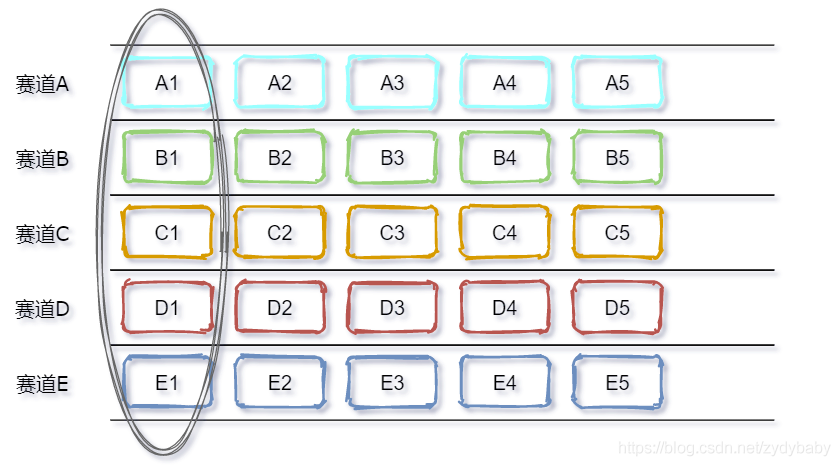
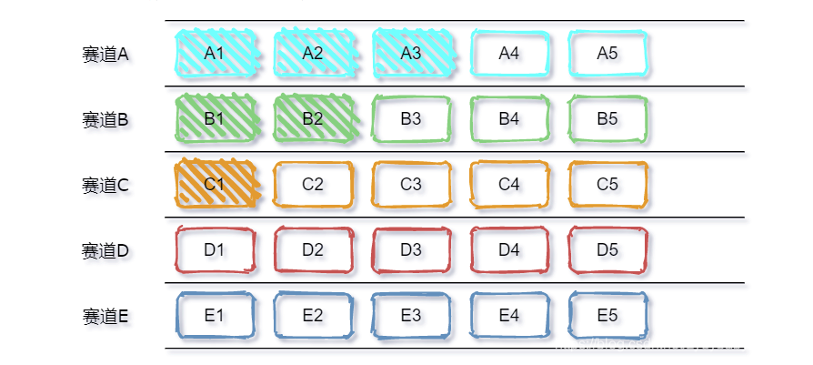
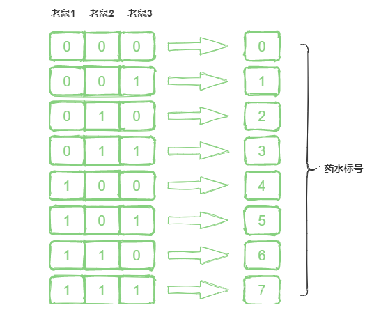

# 智力题
- [智力题](#智力题)
  - [赛马](#赛马)
  - [拿硬币（骰子）](#拿硬币骰子)
  - [试毒药](#试毒药)
  - [烧绳子定时](#烧绳子定时)
  - [天平称出一颗坏球](#天平称出一颗坏球)
  - [天平称药](#天平称药)
  - [取红球概率最大](#取红球概率最大)
## 赛马
- https://blog.csdn.net/zydybaby/article/details/119295098
> 题目
```
5个赛道，每次只能同时有5匹马跑，最少比赛几次选出最快的K匹马
```
> 解法：如果是前三名（k=3）
- 前五次，没只都跑一遍。假设A1、B1、C1、D1、E1分别为每组的第一名
<div style="zoom: 80%" align="center"></div>

- 第6次：A1、B1、C1、D1、E1 都跑一遍。假设名词排列为：A1、B1、C1、D1、E1
  - 找到第一名为A1
- 将A2、A3、B1、B2、C1放到一个赛道找出前两名。
<div style="zoom: 80%" align="center"></div>


## 拿硬币（骰子）
> 题目  

```
550个棋子，AB轮流，只能拿7~11个，拿到最后一个棋子的赢，A先拿，A要怎么拿才能赢
```
> 解法
- 7+11=18。表示不管对方怎么取，我都能取一定数量，凑出18
- 550/18 余 10，A拿10，剩下和B凑18
- 如果是最后拿的输，name就是拿9个，使余1，然后凑18

## 试毒药
> 题目
```
1000瓶药水里面只有1瓶是有毒的，毒发时间为24个小时，问需要多少只老鼠才能在24小时后试出那瓶有毒
```

> 解法
- 用一只老鼠老表示一位进行编码。死了那一位就显示`1`，没死显`0`
- 答案：log$_2$ 1000，向上取整

<div style="zoom: 80%" align="center"></div>

## 烧绳子定时
> 题目
```
烧一根不均匀的绳，从头烧到尾总共需要1个小时。现在有若干条材质相同的绳子，问如何用烧绳的方法来计时一个小时十五分钟呢?
```

> 解法

- 将绳子１从**一端**开始烧，同时将绳子２从**两端**烧，绳子２在半小时后烧完。
- 绳子２烧完的同时，点燃绳子1另一端。**开始计时**


## 天平称出一颗坏球
> 题目
```
一共12个一样的小球， 其中只有一个重量与其它不一样(未知轻重)，给你一个天平，找出那个不同重量的球
```
> 思路
- 二分的话不知道坏的球在哪。

> 解法
- 分三组A/B/C，A与B和B与C比，这个时候从结果中可以分析出坏的在哪。（2次）
- 假设C是坏的。现在有C里面有4个，分两组C1/C2。从A，B中取2个好的和C1/C2比。（2次）
- 假设C1是坏的，从A，B中取1个好的分别和C1中的两个比，便可得出结果。（2次）
- 共6次

## 天平称药
> 题目
- 注意是一次
```
有10瓶药，每瓶有10粒药，其中有一瓶是变质的。好药每颗重1克，变质的药每颗比好药重0.1克。问怎样用天秤称一次找出变质的那瓶药？
```
> 解法
- 1-10标号
- 1-10药瓶，分别拿1-10颗，一起去称。
- 如果是55.3克，则3号瓶有问题


## 取红球概率最大
> 题目
```
有两个罐子，50个红色弹球，50个蓝色弹球，如何将这100个球放入到两个罐子，随机选出一个罐子取出的球为红球的概率最大？
```
> 解法
- 将一个红球放到一个罐子中，另一个罐子放49个红球和50个蓝球，这样随便选出一个罐子取出红球的概率是`1/2 * 1 + 1/2 * 49 /（49+50）`，接近0.75