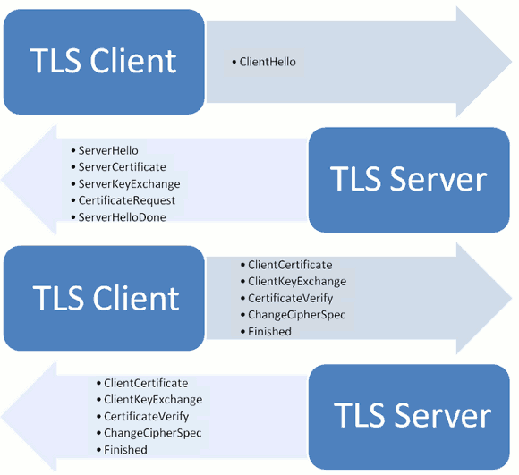

> https://zhuanlan.zhihu.com/p/108822858  
> https://github.com/CyC2018/CS-Notes/blob/master/notes/  
> 超级好:https://mp.weixin.qq.com/s/iSZp41SRmh5b2bXIvzemIw

- [MSS、MTU、MSL、RTT、RTTs和RTO](#mssmtumslrttrtts和rto)
- [UDP 和 TCP 的特点与区别](#udp-和-tcp-的特点与区别)
- [UDP和TCP的首部格式](#udp和tcp的首部格式)
  - [UDP](#udp)
  - [TCP](#tcp)
- [三次握手，四次挥手](#三次握手四次挥手)
  - [三次握手](#三次握手)
  - [四次挥手](#四次挥手)
- [TCP 短连接和长连接的区别](#tcp-短连接和长连接的区别)
  - [比较](#比较)
- [TCP最大连接数限制](#tcp最大连接数限制)
- [TIME_WAIT太多怎么办](#time_wait太多怎么办)
- [TCP粘包、拆包及解决办法](#tcp粘包拆包及解决办法)
- [提高网络利用率](#提高网络利用率)
  - [Nagle算法](#nagle算法)
  - [延迟确认应答](#延迟确认应答)
  - [捎带应答](#捎带应答)
- [keep-alive](#keep-alive)
  - [如何设置](#如何设置)
  - [场景](#场景)
  - [和http中keep-alive的关系](#和http中keep-alive的关系)
- [输入网址的时候，发生了什么](#输入网址的时候发生了什么)
  - [DNS解析过程](#dns解析过程)
    - [递归和迭代](#递归和迭代)
- [ssl/tls](#ssltls)
  - [握手阶段的详细过程](#握手阶段的详细过程)
  - [- **客户端握手结束通知**，表示客户端的握手阶段已经结束。这一项同时也是前面发送的所有内容的hash值，用来供服务器校验。](#--客户端握手结束通知表示客户端的握手阶段已经结束这一项同时也是前面发送的所有内容的hash值用来供服务器校验)
- [TCP的可靠性](#tcp的可靠性)
  - [重传](#重传)
    - [超时重传](#超时重传)
    - [快速重传](#快速重传)
    - [SACK 方法](#sack-方法)
    - [D-SACK 方法](#d-sack-方法)
  - [滑动窗口](#滑动窗口)
  - [流量控制](#流量控制)
    - [操作系统缓冲区与滑动窗口的关系](#操作系统缓冲区与滑动窗口的关系)
    - [窗口关闭](#窗口关闭)
    - [糊涂窗口综合症](#糊涂窗口综合症)
  - [拥塞控制](#拥塞控制)

# MSS、MTU、MSL、RTT、RTTs和RTO
- MTU（最大传输单元）：1500B（46-1500）（针对以太网）
  - 链路层
- MSS（最大报文长度）:经常设置为MTU-40，对于以太网来说为1460
  - 传输层
  - 该值在三次握手时协商
- MSL，即Maximum Segment Lifetime，指一个数据分片（报文）在网络中能够生存的最长时间
  - RFC 793中定义MSL通常为2分钟，可以在系统内核参数中设置。
- RTT：发送到确认的往返时间（动态测量）
- RTTs：加权平均往返时间
- RTO：超时时间

<div style="zoom: 80%" align="center"></div>


# UDP 和 TCP 的特点与区别
- UDP
  - 无连接
  - 没有流量控制
  - 没有拥塞控制
  - 面向报文（对应用层传下来的数据，不合并不拆分）
  - 支持一对多
- TCP
  - 面向连接
  - 有流量控制
  - 有拥塞控制
  - 面向字节流（可能对应用层传入的字节流进行合并和拆分）
  - 只能一对一

# UDP和TCP的首部格式
## UDP
<div style="zoom: 80%" align="center"></div>

- 头部长度：8字节（端口、目的端口、长度、检验和）
- 伪首部作用：计算检验和
- 检验和：伪首部+头部+数据

## TCP
<div style="zoom: 80%" align="center"></div>

- 数据偏移； 指出数据的位置
- 窗口：窗口值作为接收方让发送方设置其发送窗口的**依据**（仅仅是依据），告诉对方本端的TCP缓冲区能容纳多少数据。
  - 最大为65535，因为只有16字节。但是一般缓存比这个值大，所以需要**窗口扩大因子**。


# 三次握手，四次挥手
## 三次握手 
<div style="zoom: 80%" align="center"></div>

假设 A 为客户端，B 为服务器端。

- 首先 B 处于 LISTEN（监听）状态，等待客户的连接请求。
- A 向 B 发送连接请求报文，SYN=1，ACK=0，选择一个初始的序号 x。
- B 收到连接请求报文，如果同意建立连接，则向 A 发送连接确认报文，SYN=1，ACK=1，确认号为 x+1，同时也选择一个初始的序号 y。
- A 收到 B 的连接确认报文后，还要向 B 发出确认，确认号为 y+1，序号为 x+1。
- B 收到 A 的确认后，连接建立。

> 为什么三次握手
- 为了防止失效的连接请求到达服务器，让服务器错误打开连接。
  - 原因：客户端发送的连接请求如果在网络中滞留，那么就会隔很长一段时间才能收到服务器端发回的连接确认。客户端等待一个超时重传时间之后，就会重新请求连接。但是这个滞留的连接请求最后还是会到达服务器，**如果不进行三次握手，那么服务器就会打开两个连接**。如果有第三次握手，客户端会忽略服务器之后发送的对滞留连接请求的连接确认，不进行第三次握手，因此就不会再次打开连接。

> 三次握手协商的东西
- MSS
- 接收缓存（发送窗口的依据之一）
- seq
## 四次挥手
<div style="zoom: 80%" align="center"></div>

- A 发送连接释放报文，FIN=1。、
- B 收到之后发出确认，此时 TCP 属于半关闭状态，B 能向 A 发送数据但是 A 不能向 B 发送数据。
- 当 B 不再需要连接时，发送连接释放报文，FIN=1。
- A 收到后发出确认，进入 `TIME-WAIT` 状态，等待 2 MSL（最大报文存活时间）后释放连接。
- B 收到 A 的确认后释放连接。
> 原因
- `CLOSE-WAIT`：客户端发送FIN报文后，服务端进入`CLOSE-WAIT`状态 主要是为了让服务端发送还未传送完的数据。
- `Time_WAIT`：客户端收到服务端的FIN报文后，进入TIME-WAIT状态，等待2MSL时间。原因如下
  - 确保最后一个确认报文能够到达。不然服务端没收到，重发FIN，影响下一次连接，也会影响服务端效率
  - 让本连接持续时间内所产生的所有报文都从网络中消失，使得下一个新的连接不会出现旧的连接请求报文。

# TCP 短连接和长连接的区别

- 长连接是指，在一次TCP连接上进行多次交互。
  - 过程：连接→数据传输→保持连接(心跳)→数据传输→保持连接(心跳)→……→关闭连接；

- 短连接是指通信双方有数据交互时，就建立一个TCP连接，数据发送完成后，则断开此TCP连接
  - 过程：连接→数据传输→关闭连接

## 比较
- 短连接
  - 场景：对于请求比较少的，连接比较多
    - 如：http请求
  - 容易管理
- 长连接
  - 场景：对于请求比较频繁的，而且连接比较少的
    - 如：SQL连接池
  - 需要额外控制

# TCP最大连接数限制
- TCP连接标识：`{local ip, local port,remote ip,remote port}`。
- **client最大连接数**：65535最大
  - 端口号限制
    - 除非绑定端口，通常会让系统选取一个空闲的本地端口（local port），**该端口是独占的，不能和其他tcp连接共享**
    - tcp端口的数据类型是`unsigned short`，本地端口个数最大只有65536，端口0有特殊含义，不能使用
  - fd限制
    - `ulimit -n` ，默认1024。可以设置调高
- fd限制——65535
  - fd限制
  - 端口号范围的限制不影响。
    - accept 的时候只是 remote ip 和 remote port 在变
    - 最大tcp连接数约为**2的32次方（ip数）×2的16次方（port数）**，也就是server端单机最大tcp连接数约为**2的48次方**。

# TIME_WAIT太多怎么办
1. `SO_REUSEPORT`
2. 修改 TIME_WAIT 时间
3. 考虑长连接，连接池 

# TCP粘包、拆包及解决办法
- 原因：TCP面向字节流，对于一个应用层发送的包，将出现三种情况
  - TCP将这个包单独封装发出
  - TCP将这个包和另一个包合成一个报文发出
  - TCP将这个包截断发出，即只发出一部分
- 解决方式
  - 消息定长
  - 设置消息边界，比如用特殊的尾部来区分，如果内容有这部分，就转义。（像以太网帧）
  - 设计协议

# 提高网络利用率
## Nagle算法
- 发送端即使还有待发送的数据，如果数据量比较少，则延迟发送的一种机制。数据可以发送需满足以下几个条件
  - 已发送的数据都已经收到了确认应答
  - 可以发送最大段长度的数据时

## 延迟确认应答
接收方收到数据之后可以并不立即返回确认应答，而是延迟一段时间的机制。有以下方案：
- 在没有收到 2*最大段长度的数据为止不做确认应答。
- 其他情况下，最大延迟 0.5秒 发送确认应答。
- TCP 文件传输中，大多数是每两个数据段返回一次确认应答。

## 捎带应答
- 一个 TCP 包中既发送数据又发送确认应答的一种机制

# keep-alive
> https://zhuanlan.zhihu.com/p/28894266  
> https://www.jianshu.com/p/e3791f975d7b
- KeepAlive并不是TCP协议规范的一部分，但在几乎所有的TCP/IP协议栈（不管是Linux还是Windows）中，都实现了KeepAlive功能。
- 
## 如何设置
- 开启方式：设置 `SO_KEEPALIVE`
- KeepAlive默认情况下是关闭的，可以被上层应用开启和关闭
- `tcp_keepalive_time`: KeepAlive的空闲时长，或者说每次正常发送心跳的周期，默认值为7200s（2小时）
- `tcp_keepalive_intvl`: KeepAlive探测包的发送间隔，默认值为75s
- `tcp_keepalive_probes`: 在tcp_keepalive_time之后，没有接收到对方确认，继续发送保活探测包次数，默认值为9（次）
> 参数描述
- 在连接闲置 `tcp_keepalive_time` 秒后，发送探测包，如果对方回应ACK，便认为依然在线；否则间隔 `tcp_keepalive_intvl` 秒后，持续发送探测包，一直到发送了 `tcp_keepalive_probes` 个探测包后，还未得到ACK回馈，便认为对方crash了。


## 场景
- 检测挂掉的连接（导致连接挂掉的原因很多，如服务停止、网络波动、宕机、应用重启等）
- 保活，防止因为网络不活动而断连（使用NAT代理或者防火墙的时候，经常会出现这种问题）
  - TCP层面的心跳检测

----

- KeepAlive通过定时发送探测包来探测连接的对端是否存活，**但是也有许多在应用层上做心跳**。他们之间的特点是
  - TCP自带的KeepAlive**使用简单**，发送的数据包相比应用层心跳检测包更小，**仅提供检测连接功能**。应用层心跳包可以定制，可以应对更复杂的情况或传输一些额外信息
  - 应用层心跳包不依赖于传输层协议，无论传输层协议是**TCP还是UDP都可以用**
  - KeepAlive仅**代表连接保持着**，而心跳包往往还**代表客户端可正常工作**

## 和http中keep-alive的关系
- HTTP协议的Keep-Alive意图在于连接复用，同一个连接上串行方式传递请求-响应数据
- TCP的KeepAlive机制意图在于保活、心跳，检测连接错误（**面向连接**)

# 输入网址的时候，发生了什么
> https://mp.weixin.qq.com/s/iSZp41SRmh5b2bXIvzemIw  
> https://zhuanlan.zhihu.com/p/133906695  
> https://zhuanlan.zhihu.com/p/61394192

- 解析域名
   - 先看dns缓存
   - 再看host
   - DNS解析
- 发送请求
## DNS解析过程
- 域名的层级关系类似一个树状结构：
  - 根 DNS 服务器
  - 顶级域 DNS 服务器（com）
  - 权威 DNS 服务器（server.com）
### 递归和迭代
<div style="zoom: 80%" align="center"></div>


# ssl/tls
> https://segmentfault.com/a/1190000021559557  
> Good :https://www.ruanyifeng.com/blog/2014/02/ssl_tls.html

- 目的
  - 加密传输——防窃听——对称加密
  - 校验——防篡改——签名
  - 身份证书——防冒充——数字证书

> 基本过程
- 客户端向服务器端索要并验证公钥。
- 双方协商生成"对话密钥"。
- 双方采用"对话密钥"进行加密通信。

## 握手阶段的详细过程
<div style="zoom: 100%" align="center"></div>

> 客户端发出请求（ClientHello）
- 支持哪些版本列表
- 随机数a（用于生成会话密钥）
- 支持的加密方案列表
- 支持的压缩方法列表

> 服务器回应（SeverHello）
- 选择版本
- 随机数b（用于生成对话密钥）
- 确认加密算法和压缩算法
- 服务器证书

> 客户端回应
- pre:先验证证书

----
- 随机数c（采用公钥加密，保证推导出来的会话密钥不会被泄露）
- **编码改变通知**，表示随后的信息都将用双方商定的加密方法和密钥发送。
- **客户端握手结束通知**，表示客户端的握手阶段已经结束。这一项同时也是前面发送的所有内容的hash值，用来供服务器校验。
----

- F(a,b,c):得出会话密钥，F为一个确定性算法

> 服务器的最后回应
- **编码改变通知**，表示随后的信息都将用双方商定的加密方法和密钥发送。
- **服务器握手结束通知**，表示服务器的握手阶段已经结束。这一项同时也是前面发送的所有内容的hash值，用来供客户端校验。

-----
- F(a,b,c):得出会话密钥，F为一个确定性算法


# TCP的可靠性
> https://zhuanlan.zhihu.com/p/133307545

- 可靠需解决：重复，乱序，数据错误，丢包等问题

<div style="zoom: 80%" align="center"></div>

## 重传
- 超时重传
- 快速重传
- SACK
- D-SACK

- 故事线：
  - 为了可靠，**解决丢包问题**。没收到ACK需要重传。所以 **超时重传**。超时不好控，有时候需要等太久 =====》
  - 出现了 **快速重传** ，收到三个ACK就可以了。但是是传全部还是部分呢，没法处理=======》
  - 出现了 **SACK** ，可以通过ACK和SACK推出缺了哪部分，发送方重传那部分就好了。=======》
  - 现在还有一个问题，就是**重复问题**。如何优雅的解决重复问题，让发送方知道什么原因使对面收到重复的包（是ACK丢失，还是我的发送数据延迟了和重发一起导致的）=======**》DSACK**

### 超时重传
- 时间超过RTO还没有收到ACK就重传。
  - RTO太大。丢了半天才重传，效率差。
  - RTO太小。重复包变多，增加网络拥塞。
  - 综上，精确的RTO十分重要，其根据公式，动态更新。**超时重传时间 RTO 的值应该略大于报文往返 RTT 的值**
- 每当遇到一次超时重传的时候，都会将下一次超时时间间隔设为先前值的两倍。两次超时，就说明网络环境差，不宜频繁反复发送。

<div style="zoom: 80%" align="center"></br><span style="font-size:18px">RTO太大或太小的影响</span></div>

### 快速重传
- **不以时间为驱动，而是以数据驱动重传**。
- 三次同样的ACK就会重传
<div style="zoom: 80%" align="center"></br><span style="font-size:18px">快速重传过程</span></div>

- 快速重传解决了超时时间的问题。但是还有一个问题，就是要重传多少（是一部分，还是ACK确认之后的全部），这个问题没有解决。

### SACK 方法
- 注：和快速重传搭配
- 作用：**告诉对方哪一部分缺失**
  - 特点：**ACK在SACK前面**。
-  TCP 头部「选项」字段里加一个 SACK 的东西，它**可以将缓存的地图发送给发送方**
<div style="zoom: 80%" align="center"></br><span style="font-size:18px">SACK过程</span></div>

<div style="zoom: 80%" align="center"></br><span style="font-size:18px"></span></div>

### D-SACK 方法
- 作用：使用了 SACK 来告诉「发送方」有哪些数据被**重复接收了**
  - 特点：**ACK在SACK后面**。

<div style="zoom: 80%" align="center"></br><span style="font-size:18px">情况1：ACK 丢包</span></div>

<div style="zoom: 80%" align="center"></br><span style="font-size:18px">情况2：网络延时</span></div>


## 滑动窗口
- 作用：不用一来一回，这样效率太低。只要窗口有空间，继续发送。
  - **接收窗口的大小是约等于发送窗口的大小的**
    - 因为窗口的改变是通过接收方发送的TCP报文中的`Windows`字段告诉对方的，所以**存在时延**。
  - 注：发送窗口不等于发送方最后实际的窗口，其还要取决于拥塞控制算法。（我的理解）
## 流量控制

### 操作系统缓冲区与滑动窗口的关系
- 注：避免接收方处理不过来的情况，保证接收方来得及接收

<div style="zoom: 80%" align="center"></br><span style="font-size:18px">缓冲区与接收窗口关系</span></div>

- 采用先收缩窗口，过段时间再减少缓存，避免丢包情况。如下情况所示：
<div style="zoom: 80%" align="center"></br><span style="font-size:18px">缓冲区与接收窗口同时收缩带来的问题</span></div>

### 窗口关闭
- 如果窗口大小为 0 时，就会阻止发送方给接收方传递数据，直到窗口变为非 0 为止，这就是**窗口关闭**。
  - 再次开放时通过ACK通知发送端。存在一个问题：如果ACK丢失怎么办
<div style="zoom: 80%" align="center"></br><span style="font-size:18px">丢失ACK，带来死锁</span></div>

- 解决方法：**只要 TCP 连接一方收到对方的零窗口通知，就启动持续计时器，定时试探**
<div style="zoom: 80%" align="center"></br><span style="font-size:18px">持续计时器</span></div>

### 糊涂窗口综合症
- **糊涂窗口综合症**：一腾出一点点窗口，就发送了。造成利用率低
  - 解决：Nagle算法

## 拥塞控制
- 过程
```
- 慢启动
- 拥塞避免
  - 遇到 超时重传
- 慢启动
- 拥塞避免
  - 遇到 快重传
- 快速恢复
- 拥塞避免
```
<div style="zoom: 80%" align="center"></br><span style="font-size:18px">遇到超时重传</span></div>
<div style="zoom: 80%" align="center"></br><span style="font-size:18px">遇到快重传</span></div>