- [概述](#概述)
  - [八大原则（看一看，不用背）](#八大原则看一看不用背)
  - [分类](#分类)
- [创建型](#创建型)
  - [工厂模式](#工厂模式)
    - [标准模式](#标准模式)
    - [简单工厂模式](#简单工厂模式)
  - [抽象工厂模式](#抽象工厂模式)
  - [单例模式](#单例模式)
  - [原型模式](#原型模式)
  - [Builder模式](#builder模式)
- [结构型模式](#结构型模式)
  - [适配器模式](#适配器模式)
  - [装饰器模式](#装饰器模式)
  - [桥模式](#桥模式)
  - [组合模式](#组合模式)
  - [外观模式](#外观模式)
  - [享元模式](#享元模式)
  - [代理模式](#代理模式)
    - [与装饰器的区别](#与装饰器的区别)
- [行为型模式](#行为型模式)
  - [命令模式](#命令模式)
  - [迭代器模式](#迭代器模式)
  - [策略模式](#策略模式)
  - [模板方法](#模板方法)
  - [观察者模式](#观察者模式)
  - [状态模式](#状态模式)

# 概述
- 目标：适应变化，复用

## 八大原则（看一看，不用背）
- **依赖倒置原则(DIP)**
  - 高层模块(稳定)不应该依赖于低层模块(变化)，二者都应该依赖于抽象(稳定) 
  - 抽象(稳定)不应该依赖于实现细节(变化) ，实现细节应该依赖于抽象(稳定)。
  - 总的来说就是**不应该让稳定的依赖变化的**。
  - EG：`MainForm-----Shape----Line，Rect`
- **开放封闭原则（OCP）**
  - 对扩展开放，对更改封闭
  - EG：`MainForm-----Shape----Line，Rect，Circle`，扩展了Circle，而不是改MainForm逻辑
- **单一职责原则（SRP）**
  - 一个类、接口或方法只负责一个职责。
  - eg：当我们如果一个类放很多个方法，功能时，其实就是隐含着多个责任。当有多个责任就会出毛病，会让类往不同方向拉扯，比如用子类的时候
    - 一个类应该仅有一个引起它变化的原因。
    - 变化的方向隐含着类的责任
- **里氏替换原则（LSP）**
  - 子类和父类必须是IS-A关系
- **接口隔离原则(ISP)**
  - public出去的接口应该尽可能小
- **优先使用对象组合，而不是类继承**
  - 继承在某种程度上破坏了封装性，子类父类耦合度高。【注：继承中父类给子类暴露的东西是比较多的。】
  - 而对象组合则只要求被组合的对象具有良好定义的接口，耦合度低。
- **封装变化点**
  - 传统上：封装是封装数据和代码； 更高层次上：**封装变化点，一侧变一侧稳定**
  - 使用封装来创建对象之间的分界层，让设计者可以在分界层的一侧进行修改，而不会对另一侧产生不良的影响，从而实现层次间的松耦合。
- **针对接口编程，而不是针对实现编程**

## 分类
- 创建型：与对象的创建有关
  - 工厂方法模式、抽象工厂模式、单例模式、建造者模式、原型模式
- 结构型：处理类或对象的组合
  - 适配器模式、装饰器模式、代理模式、外观模式、桥接模式、组合模式、享元模式
- 行为型：对类或对象怎样交互和怎样分配职责进行描述
  - 策略模式、模板方法模式、观察者模式、迭代子模式、责任链模式、命令模式、备忘录模式、状态模式、访问者模式、中介者模式、解释器模式

# 创建型

## 工厂模式
- 思想：一个类将它的的 **创建职责** 交给了其他的类（平行的类层次）
- 避免了new遍地开花
- 两种不同的情况：
  - Creator是一个抽象类，不提供它所声明的工厂方法的实现。（标准模式(注：自己起的)）
  - Creator是一个具体类，为工厂方法提供一个缺省的实现（简单工厂模式）


### 标准模式
- 工厂模式：指定义一个创建对象的接口，让接口的实现类决定创建哪种对象，让类的**实例化推迟到子类**中进行。
  - 推迟到子类的好处：满足开放封闭原则。比如当增加新的图形的时候，只需要添加子类就够了。

- 优点：类的实例化推迟到了子类。通过添加类来应对变化
- 缺点：类太多了

> demo代码
- 一个疑问：传进来构造函数的`factor`不也是具体类吗，这不是产生依赖了吗
  - 通过改良后可以看出，至少MainForm再也没有具体类的依赖了。其依赖的SplitterFactory和ISplitter都是抽象基类。**我们很多时候并不是把变化给消灭掉，也就是并不是把依赖具体类这件事情给消灭掉，你消灭不掉的，实际上是将其赶到某一个地方(猫和笼子)，这里就是赶到了factory**

```cpp
class MainForm : public Form
{
    // 重点：工厂接口
    SplitterFactory*  factory;//工厂

public:
    
    MainForm(SplitterFactory*  factory){
        // 重点：从外界传来某一个具体的SplitterFactory
        this->factory=factory;
    }
    
    void Button1_Click(){

        
        ISplitter * splitter=
            factory->CreateSplitter(); //重点：多态new
        
        splitter->split();

    }
};
```

> 结构
- Product就相当于ISplitter
- ConcreteProduct相当于BinarySplitter....
- Creator相当于SplitterFactory
- ConcreteCreator相当于BinarySplitterFactory....
- MainForm依赖Product和Creator

<div style="zoom: 80%" align="center">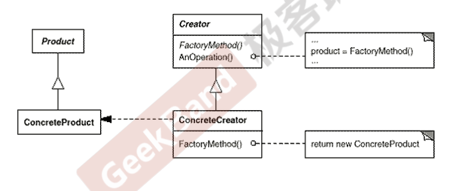</div>


### 简单工厂模式
- 定义：一个工厂类中，可以创建多种对象种类。
  - 把 `new` 赶到了这个类中，即把依赖赶到了这里统一管理。
- 实现方式：   
  - 给工厂方法传递参数
  - 多个工厂方法
- 优点：类不会太多
- 缺点：不满足开放封闭原则。
  - 即引入了新的类型的时候，需要修改工厂类

> demo代码
- 这里的代码返回类型也可以定义为`Shape`
```cpp
class FactoryShape
{
public:
//    FactoryShape() = delete;
    virtual LineItem* CreateLine(QPointF start, QPointF end){
        return  new LineItem(start, end, "LINE-");
    }
    virtual RectItem* CreateRect(QPointF start, QPointF end){
        return  new RectItem(start, end, "RECT-");
    }
    virtual ElliItem* CreateElli(QPointF start, QPointF end){
        return  new ElliItem(start, end, "ELLI-");
    }
    virtual ShapeButton* CreateButton(QPointF start, QPointF end){
        return  new ShapeButton(start, end, "BUTTON-");
    }
    virtual ImageProxy* CreateImage(QPointF start, QPointF end){
        return new ImageProxy(start, end, "Image-");
    }
};
```

## 抽象工厂模式
- 定义：提供一个接口，让该接口负责创建一系列“相关或者相互依赖的对象”，无需指定它们具体的类
  - eg1：Mysql，Oracle。假设现在有一个数据访问层，需要创建一系列的对象。比如SqlServer你需要创建连接对象、命令对象、数据读取对象但是可能过几天后我又是使用Mysql或者oracle,现在要做一个多种数据库的支持，所以需要面向接口编程
  - eg2：
    - 产品族：电视机 电冰箱 洗衣机。 ===》 工厂类里的函数
    - 等级结构：长虹 海尔 松下===》 多个工厂类
  - eg3:
    - 扩展版图形，如下面代码
- 多个简单工厂+一个抽象(AbstractFactory)

> 结构

<div style="zoom: 80%" align="center">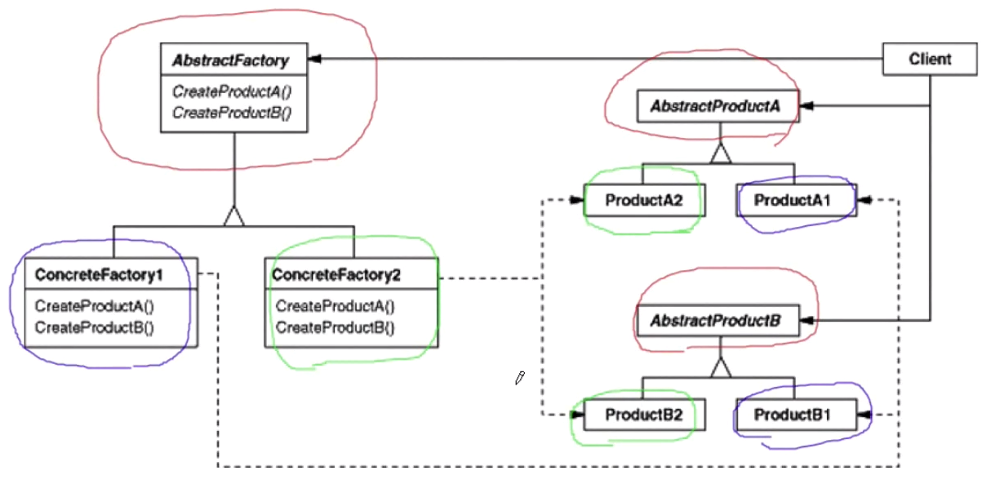</div>

> 代码

```cpp

class FactoryShape
{
public:
//    FactoryShape() = delete;
    virtual LineItem* CreateLine(QPointF start, QPointF end){
        return  new LineItem(start, end, "LINE-");
    }
    virtual RectItem* CreateRect(QPointF start, QPointF end){
        return  new RectItem(start, end, "RECT-");
    }
    virtual ElliItem* CreateElli(QPointF start, QPointF end){
        return  new ElliItem(start, end, "ELLI-");
    }
    virtual ShapeButton* CreateButton(QPointF start, QPointF end){
        return  new ShapeButton(start, end, "BUTTON-");
    }
    virtual ImageProxy* CreateImage(QPointF start, QPointF end){
        return new ImageProxy(start, end, "Image-");
    }
};

//抽象工厂
class ExFactoryShape: public FactoryShape{
public:
//    ExFactor() = delete;
    LineItem* CreateLine(QPointF start, QPointF end) override {
        auto rt = new LineItem(start, end, "EX_LINE-", Qt::black, Qt::gray, Qt::transparent);
        rt->setIsEnhanced(true);
        return rt;
    }
    RectItem* CreateRect(QPointF start, QPointF end) override {
        auto rt = new RectItem(start, end, "EX_RECT-", Qt::black, Qt::gray, Qt::transparent);
        rt->setIsEnhanced(true);
        return rt;
    }
    ElliItem* CreateElli(QPointF start, QPointF end) override {
        auto rt = new ElliItem(start, end, "EX_ELLI-", Qt::black, Qt::gray, Qt::transparent);
        rt->setIsEnhanced(true);
        return rt;
    }
};
```

## 单例模式
- 定义：保证一个类仅有一个实例，并提供一个该实例的全局访问点。


<div style="zoom: 80%" align="center">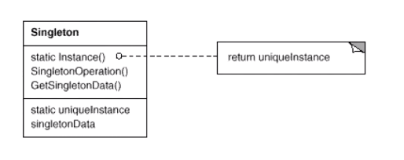</div>

> 代码

- 利用static再新标准下的多线程安全
```cpp
template <typename T, typename SRCT = T,int type = 0>
class Singletom
{
public:
    Singletom() = delete;
    static T* getInstance(){
        static SRCT instance;
        return &instance;
    }

};
```


## 原型模式
- 定义：使用原型实例指定创建对象的种类，然后通过拷贝（注：深拷贝）这些原型来创建新的对象。
  - eg：对象的克隆

<div style="zoom: 80%" align="center">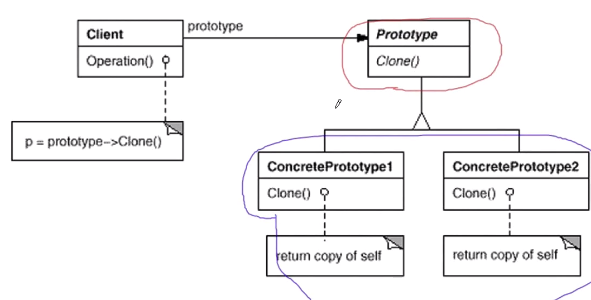</div>

## Builder模式
- 定义：是对象创建型模式，它将一个复杂对象的构建（HouseBuilder）与其表示（House）相分离，使得同样的构建过程(稳定)可以创建不同的表示(变化)。
  - 与模板方式很像，只是这里用在了生成对象上

<div style="zoom: 80%" align="center">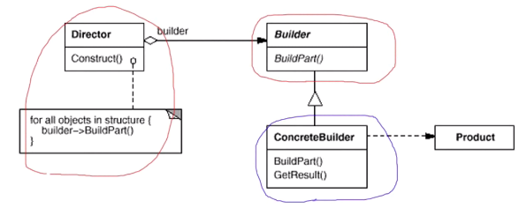</div>


- 场景：现在是一个游戏里的场景，假设现在游戏中要建一个房子，比如建个草房也是房，建个瓦房也是房，**流程其实都差不多（稳定）**，比如构建地基，墙壁，柱子，门之类的，这些皆为子步骤。**每一个子步骤里面都是变化的（变化）**

> 代码
- build1.cpp
  - House：相当于Builder
  - StoneHouse：相当于ConcreteBuilder
- 在下面的代码其实已经实现了开放封闭原则了。
```cpp
class House {
public:
    // 重点：思考为什么不能放在构造函数。因为这个时候子类还没构造好，违背伦理
    void Init(){

        this->BuildPart()://静态的
        for (int i= 0;i< 4; i++){
            this->BuildPart2();
        }
        bool flag=this->BuildPart3();
        if(flag){
            this->BuildPart4(); 
        }
        this->BuildPart5();
    }
    virtual ~House()
protected:
    virtual void BuildPart1()=0;
    virtual void BuildPart2()=0;
    virtual void BuildPart3()=0;
    virtual void BuildPart4()=0;
    virtual void BuildPart5()=0;
};
class StoneHouse: public Houselprotected{
    virtual void BuildPart1(){}
    virtual void BuildPart2(){}
    virtual void BuildPart3(){}
    virtual void BuildPart4(){}
    virtual void BuildPart5(){}
}
```

- build2.cpp
  - **如果Houser太复杂，可以将构建职责分出去**。builder模式在build1.cpp其实已经可以了。但是还有优化的空间。有点时候可能基类如House过于复杂，所以会做一个拆分。将Init初始化的过程拆出去，即把构建过程提取出来，一部分是类的行为，另一部分是专门是属性状态。
  - 建立平行的类层次：平行的类层次在我的笔记，工厂模式那有记录。非常重要的概念

```cpp

class House{
    //....
};
// 专门管构建
class HouseBuilder {
public:
    House* GetResult(){
        return pHouse;
    }
    virtual ~HouseBuilder(){}
protected:
    // 重点：通过组合，建立平行的类层次
    House* pHouse;
	virtual void BuildPart1()=0;
    virtual void BuildPart2()=0;
    virtual void BuildPart3()=0;
    virtual void BuildPart4()=0;
    virtual void BuildPart5()=0;
	
};

class StoneHouse: public House{
    
};

class StoneHouseBuilder: public HouseBuilder{
protected:
    
    virtual void BuildPart1(){
        //pHouse->Part1 = ...;
    }
    virtual void BuildPart2(){}
    virtual void BuildPart3(){}
    virtual void BuildPart4(){}
    virtual void BuildPart5(){}
    
};

// 重点：构建房子的模板
class HouseDirector{
    
public:
    HouseBuilder* pHouseBuilder;
    
    HouseDirector(HouseBuilder* pHouseBuilder){
        this->pHouseBuilder=pHouseBuilder;
    }
    
    House* Construct(){
        
        pHouseBuilder->BuildPart1();
        
        for (int i = 0; i < 4; i++){
            pHouseBuilder->BuildPart2();
        }
        
        bool flag=pHouseBuilder->BuildPart3();
        
        if(flag){
            pHouseBuilder->BuildPart4();
        }
        
        pHouseBuilder->BuildPart5();
        
        return pHouseBuilder->GetResult();
    }
};

```

# 结构型模式
## 适配器模式
- 定义：将一个类的接口转换或客户希望的另一个接口。Adaepter模式使得原本于接口不兼容而不能一起工作的那些类可以一起工作。
  - 具有“类的适配器”和“对象的适配器”两种
  - eg1：在我的画图软件中画按钮

> 类适配器
- 缺点：只能匹配 Adaptee。当要匹配 Adaptee 和其子类，是做不到的
<div style="zoom:100%" align="center">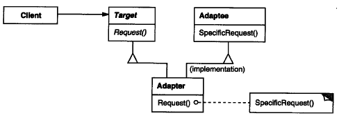</div>

> 对象适配器
<div style="zoom:100%" align="center">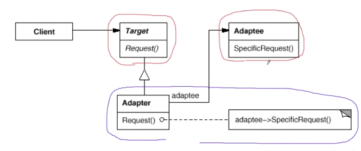</div>

## 装饰器模式
- 定义：动态（组合）地给一个对象增加一些额外的职责。就增加功能而言，Decorator模式比生成子类（继承）更为灵活（消除重复代码 & 减少子类个数）
  - eg：给我的图形添加了旋转和嵌入字体效果。使用了装饰器，我就不用定义诸如 `SpinCircle， SpinTextCircle`这些类。
- **解决类的数量的膨胀**

<div style="zoom:80%" align="center">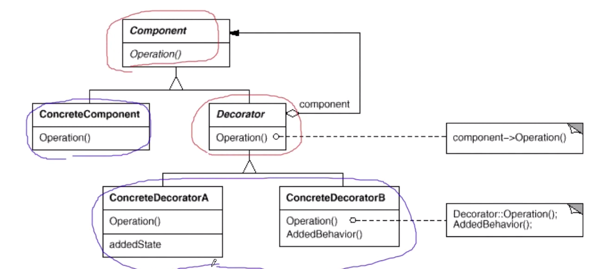</div>

> 场景
<div style="zoom:80%" align="center">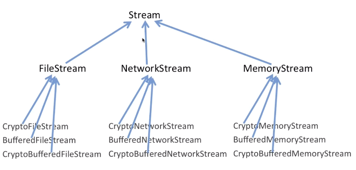</div>
<div style="zoom:80%" align="center">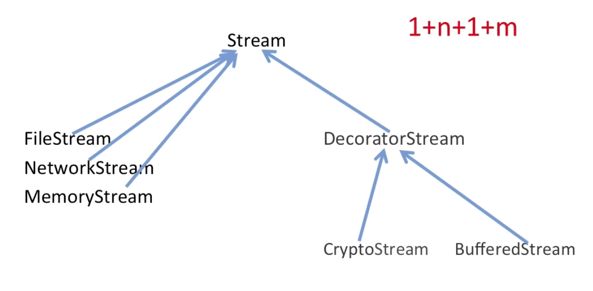</div>

## 桥模式
- 定义：将抽象部分(业务功能)与实现部分(平台实现)分离，使它们都可以独立地变化。
  - eg1:抽象部分：业务逻辑。实现部分：为业务提供底层实现。
- **解决类的数量的膨胀**

<div style="zoom:80%" align="center">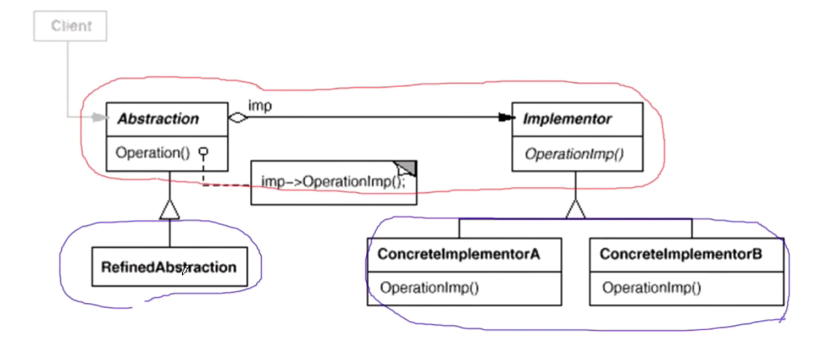</div>

> 背景
- 一个通信模块。假设现在要**支持PC平台的设计和Mobile平台的设计（平台实现）**。
  - **变化点1，实现部分的变化**。这样会遇到一个问题，就是写**PCMessagerBase，MobileMessagerBase（业务逻辑）** 会遇到PlaySound，DrawShape，WriteText，Connect平台实现的不同，所以这两个继承类都会overwrite这些**平台实现函数**。
  - **变化点2，抽象部分的变化**。我们统一平台需要实现不同的功能版本，比如我们推出一个精简版，一个完美版。如PCMessagerLite和PCMessagerPerfect
  - 如果把这个通信模块封装一起，就有两个变化点。
- 问题：假设现在n个平台，m个功能版本(继承平台类)，需要定义的类数量为`1 + n + n*m`
  - 其实这里PC和Mobile完美版的Login等函数都有似曾相识的重复，不一样的代码中间夹着一些一样的代码
  - 解决：继承变为组合，业务功能类 通过组合 平台实现（**架起了一道桥**）。
```cpp
class Messager{
public:
    // 职责1
    virtual void Login(string username, string password)=0;
    virtual void SendMessage(string message)=0;
    virtual void SendPicture(Image image)=0;

    // 职责2
    virtual void PlaySound()=0;
    virtual void DrawShape()=0;
    virtual void WriteText()=0;
    virtual void Connect()=0;
    
    virtual ~Messager(){}
};
```

> 使用了桥模式的代码

- 类的数量变为 2 + n + m，大大减少了
- 这里的两个基类都只有一个变化点
```cpp
// 重点：高层抽象的业务逻辑部分
class Messager{
protected:
    // 从子类往上提到父类
     MessagerImp* messagerImp;//...
public:
    virtual void Login(string username, string password)=0;
    virtual void SendMessage(string message)=0;
    virtual void SendPicture(Image image)=0;
    
    virtual ~Messager(){}
};

// 重点：底层的平台实现部分
class MessagerImp{
public:
    virtual void PlaySound()=0;
    virtual void DrawShape()=0;
    virtual void WriteText()=0;
    virtual void Connect()=0;
    
    virtual MessagerImp(){}
};


// 平台实现 n
class PCMessagerImp : public MessagerImp{
public:
    
    virtual void PlaySound(){
        //**********
    }
    virtual void DrawShape(){
        //**********
    }
    virtual void WriteText(){
        //**********
    }
    virtual void Connect(){
        //**********
    }
};

class MobileMessagerImp : public MessagerImp{
public:
    
    virtual void PlaySound(){
        //==========
    }
    virtual void DrawShape(){
        //==========
    }
    virtual void WriteText(){
        //==========
    }
    virtual void Connect(){
        //==========
    }
};


//业务抽象 m

//类的数目：1+n+m

class MessagerLite :public Messager {

    
public:
    
    virtual void Login(string username, string password){
        
        messagerImp->Connect();
        //........
    }
    virtual void SendMessage(string message){
        
        messagerImp->WriteText();
        //........
    }
    virtual void SendPicture(Image image){
        
        messagerImp->DrawShape();
        //........
    }
};


class MessagerPerfect  :public Messager {
    
   
public:
    
    virtual void Login(string username, string password){
        
        messagerImp->PlaySound();
        //********
        messagerImp->Connect();
        //........
    }
    virtual void SendMessage(string message){
        
        messagerImp->PlaySound();
        //********
        messagerImp->WriteText();
        //........
    }
    virtual void SendPicture(Image image){
        
        messagerImp->PlaySound();
        //********
        messagerImp->DrawShape();
        //........
    }
};

void Process(){
    //运行时装配
    MessagerImp* mImp=new PCMessagerImp();
    Messager *m =new Messager(mImp);
}
```

## 组合模式
- 定义：将对象组合成树形结构以表示“部分-整体”的层次结构。Composite使得用户对单**个对象和组合对象的使用具有一致性**(稳定)。
  - eg：图形中多个图形的组合以及取消组合
- `Add,Remove,GetChild`这里是有争议的，到底是放在 `Component` 父类还是 `Composite` 子类中都有不完善的地方，如果放在父类，对leaf节点就很尴尬，这里实现成空不太好，扔一个异常也不太好，这样其实**违背了is a原则。**
  - 自己觉得：`Add,Remove` 放 `Composite`，`GetChild`放 `Component`

<div style="zoom:100%" align="center">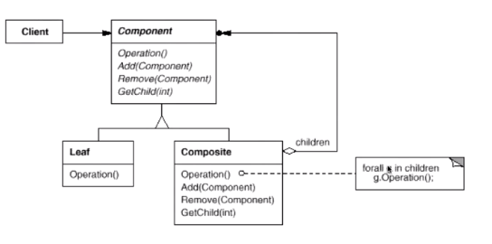</div>

## 外观模式
- 定义：外观（或门面，FACADE）模式是对象结构型模式，它为子系统中的一组接口提供一个一致的界面（定义高层接口），这个接口使得这一子系统更加容易使用
  - eg：写框架。写操作系统
<div style="zoom:100%" align="center">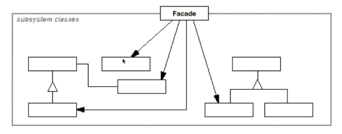</div>


## 享元模式
- 定义：享元（ FLYWEIGHT）模式是对象结构型模式，它运用共享技术有效地支持大量细粒度的对象。
  - eg：word里，不用为每一个字母都分配一个属性，他们可以共享属性
- 结构复杂

## 代理模式
- 定义：为其他对象提供一种代理以控制（隔离，使用接口）对这个对象的访问
- 场景：
  - 只有在确实需要这个对象时才对它进行创建和初始化（图片延迟加载）
  - 在操作对象的时候需要一些额外的操作（写日志之类的）
  - 不能直接访问或构造一个对象的时候（RPC）
  - 保护原始对象（控制对原始对象的访问）

### 与装饰器的区别
- 代理模式侧重于**不能直接访问**一个对象，只能通过代理来间接访问。
- 装饰器模式是因为没法在编译器就确定一个对象的功能，需要**运行时动态**的给对象**添加职责**，所以只能把对象的功能拆成一一个个的小部分，**动态组装**

# 行为型模式
## 命令模式
- 定义：将一个**请求(行为)封装为一个对象**，使命令请求的一方和执行的一方独立开来（“解耦”）
  - 注：请求一方不必知道接收方的接口，更不必知道请求如何被执行、是否被执行、何时被执行。
  - eg：我（请求方）想让一个图形左移30像素，我不用去调用这个图形的移动接口（不用我来执行），我只要把这个操作所封装成的命令对象交给执行方（也可能是自己）执行（**请求与执行解耦**）。
- 书上结构有点复杂，只要理解把执行的操作封装为Command就行了。
- 场景：
  - **回调函数**。Command模式是回调机制的一个面向对象的替代品
  - **生产者消费者**。支持在不同的时刻和位置执行请求
  - **支持取消（Undo）和重做（Redo）操作**。可以由具体的Command保留状态
  - **支持操作（修改）日志**。在Command接口中添加装载（Load）和存储（Save）功能，可以用来保存系统操作（修改）的日志记录。


> 代码

```cpp
class Command
{
public:
    Command(QString name):m_name(name){
        QDateTime current_date_time =QDateTime::currentDateTime();
        QString current_date =current_date_time.toString("yyyy.MM.dd hh:mm:ss.zzz ddd");
        m_date = current_date;
    };
    QString getName() { return m_name; }
    QString getDate() { return m_date; }
    virtual void Execute() = 0;
    virtual void undo() = 0;
protected:
    QString m_name;
    QString m_date;
};

// 具体命令
class MoveCommand: public Command{
public:
    MoveCommand(Shape* obj, double moveX, double moveY):
        Command(QString("move shapeItem(") + QString::number(moveX) + ", " + QString::number(moveY) + ")"),
        m_obj(obj), m_moveX(moveX), m_moveY(moveY) {
    }
    void Execute() override{
        m_obj->getItem()->setPos(
                    m_obj->getStart().x() + m_moveX,
                    m_obj->getStart().y() + m_moveY);
    }
    void undo() override{
        m_obj->getItem()->setPos(
                    m_obj->getStart().x() - m_moveX,
                    m_obj->getStart().y() - m_moveY);
    }
private:
    Shape* m_obj;
    double m_moveX, m_moveY;
};
```

## 迭代器模式
- 定义：提供一种方法顺序访问一个聚合对象中各个元素，而又不需暴露聚合对象的内部表示。
  - eg：c++自带的迭代器，从而对泛型算法的支持

<div style="zoom:100%" align="center">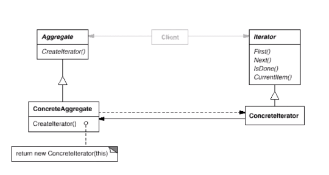</div>


## 策略模式
- 定义：定义一系列的算法，把算法一个个封装起来，并且使它们可相互替换。
  - 扩展的时候只要增加子类，OCP
  - eg：图形中的左对齐，右对齐...
<div style="zoom:100%" align="center">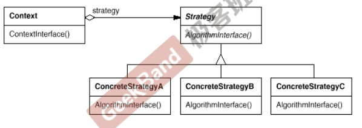</div>


> 场景
- 在软件构建过程中，某些对象使用的算法可能多种多样，经常改变，如果将这些算法都编码到对象中，将会使对象变得异常复杂；而且有时候支持不使用的算法也是一个**性能负担**。
  - (注：当if else 很多时，比如现在软件装在中国，只总是调用一个if，其他条件基本没有用到，这样很大代码段被加载但是实际上没有调用，这样会把其他代码挤出高级缓存，Strategy的使用就不存在这个问题，Strategy在运行时加载哪个他一般就只调用那个方法，一般叫做代码具有**良好本地性**，**缓存命中率高**。)
- 问题：违反了开放封闭原则(OCP)(注：对扩展开放对更改封闭)。

```cpp
enum TaxBase {
	CN_Tax, // 中国
	US_Tax, // 美国
	DE_Tax, // 德国
	FR_Tax       //更改
};

class SalesOrder{
    TaxBase tax;
public:
    double CalculateTax(){
        //...
        
        if (tax == CN_Tax){
            //CN***********
        }
        else if (tax == US_Tax){
            //US***********
        }
        else if (tax == DE_Tax){
            //DE***********
        }
        else if (tax == FR_Tax){  //更改
            //...
        }
        //....
     }
    
};
```

> 代码

```cpp
// 基类
class TaxStrategy{
public:
    // context为算法上下文，比如其需要取得某些参数之类的
    virtual double Calculate(const Context& context)=0;
    virtual ~TaxStrategy(){}
};


class CNTax : public TaxStrategy{
public:
    virtual double Calculate(const Context& context){
        //***********
    }
};

class USTax : public TaxStrategy{
public:
    virtual double Calculate(const Context& context){
        //***********
    }
};

class DETax : public TaxStrategy{
public:
    virtual double Calculate(const Context& context){
        //***********
    }
};


//扩展
//*********************************
class FRTax : public TaxStrategy{
public:
	virtual double Calculate(const Context& context){
		//.........
	}
};


class SalesOrder{
private:
    TaxStrategy* strategy;

public:
    SalesOrder(StrategyFactory* strategyFactory){
        // 创建：使用工厂模式，后面讲。
        this->strategy = strategyFactory->NewStrategy();
    }
    ~SalesOrder(){
        delete this->strategy;
    }

    public double CalculateTax(){
        //...
        Context context();
        
        double val = 
            strategy->Calculate(context); //多态调用
        //...
    }
    
};

```


## 模板方法
- 定义：定义一个操作中的算法的骨架 (稳定)，而将一些步骤延迟(注：虚函数)(变化)到子类中
  - 得子类可以不改变一个算法的结构（逻辑），即可重定义该算法的某些特定步骤
- **反向的控制结构**：由父类通过调用子类的操作来定义业务逻辑，而不是相反

- 参与者：
  - AbstractClass（抽象类）
    - 定义抽象的**原语操作**（ primitive operation），具体的子类将**重定义**它们以实现一个算法的可变步骤
    - 实现**模板方法**，定义一个算法的**骨架**。
  - ConcreteClass（具体类）
    - 实现原语操作以完成算法中与特定子类相关的步骤

- 模板方法中，调用下列集中类型的操作：
  - 具体操作（定义在AbstractClass或其他对象的操作）：不用override
  - （纯虚函数）原语操作（abstract操作），必须由子类实现。
  - （虚函数）钩子操作（hook operations），它提供了缺省的行为，子类可以在必要时进行扩展（override）。

<div style="zoom:80%" align="center">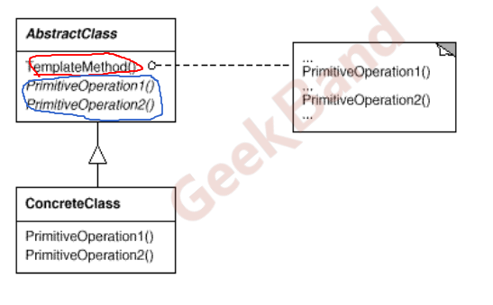</div>

## 观察者模式
- 定义：定义对象间的一种一对多（变化）的依赖关系，以便当一个对象(Subject)的状态发生改变时，所有依赖于它的对象都得到通知并自动更新
  - eg：新建图形的时候（一个函数），需要暂时更新 `TreeWidget`，后面完善可能需要更新更多的东西 ，为了让该函数不用依赖与`TreeWidget`等控件，使用观察者模式，创建后主需要notify一下就行了。
- 重点思想：使用 `notify` 对多个观察者调用 `Update`，通知更新
  - update接口有时候可能需要一些参数，比如：图形对象指针和发生的事件（决定着观察者怎么处理）
<div style="zoom:80%" align="center">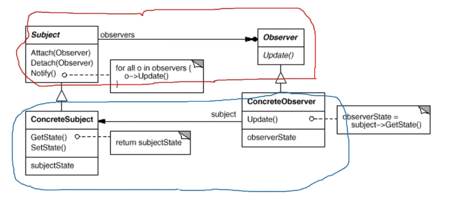</div>

> 实例
- Subject：MainWindow里定义，添加观察者（Attach），删除观察者（Detach），以及通知方法（Notify）
- Observer：观察者抽象，提供Update方法的接口

- 下面代码是一个观察者实例
```cpp
class SelectListObserver : public Observer{
public:
    SelectListObserver(QList<Shape*>* ssl) : Observer(){
        m_ssl = ssl;
        // 表示这个观察者，订阅了哪些事件
        mask = SelectItem | RemoveSelect | DeleteShapeItem
                | ClearSelect | ClearAll;
    }
    // 注：通过参数传递信息
    void update(Shape* sp, Aspect aspect) override{
        switch (aspect) {
        case Aspect::SelectItem:
            doSelectItem(sp);
            break;
        case Aspect::RemoveSelect:
        case Aspect::DeleteShapeItem:
            doRemoveSelect(sp);
            break;
        case Aspect::ClearSelect:
        case Aspect::ClearAll:
            doClearSelect();
            break;
        default:
            return;
        }
    }
}
```

## 状态模式
- 定义：它允许一个对象在其内部状态改变时改变它的行为，**对象看起来似乎修改了它所属的类**（实际只是让里面的状态对象变了）。

- 思路：将状态封装为对象

> 场景
- 一个根据网络状态而有不同行为的例子。假设现在添加了一种状态Wait，那么就需要做一些修改，添加else if，显然**违背了开闭原则**，这里也体现了if else的坏味道。
```cpp
enum NetworkState
{
    Network_Open,
    Network_Close,
    Network_Connect,
    // Network_Wait,
};

class NetworkProcessor{
    
    NetworkState state;

public:
    
    void Operation1(){
        if (state == Network_Open){

            //**********
            state = Network_Close;
        }
        else if (state == Network_Close){

            //..........
            state = Network_Connect;
        }
        else if (state == Network_Connect){

            //$$$$$$$$$$
            state = Network_Open;
        }
    }

    void Operation2(){

        if (state == Network_Open){
            
            //**********
            state = Network_Connect;
        }
        else if (state == Network_Close){

            //.....
            state = Network_Open;
        }
        else if (state == Network_Connect){

            //$$$$$$$$$$
            state = Network_Close;
        }
    
    }

    void Operation3(){

    }
};
```

> 使用状态模式的代码
- 客户端不用关心当前状态的下一个状态是什么，直接`pState = pState->pNext;`转换就够了
- 虚函数就是if-else的过程

```cpp
class NetworkState{

public:
    NetworkState* pNext;
    virtual void Operation1(...)=0;
    virtual void Operation2(...)=0;
    virtual void Operation3(...)=0;

    virtual ~NetworkState(){}
};


class OpenState :public NetworkState{
    
    static NetworkState* m_instance;
public:
    // 重点：使用单件Single
    static NetworkState* getInstance(){
        if (m_instance == nullptr) {
            m_instance = new OpenState();
        }
        return m_instance;
    }

    void Operation1(...){
        
        //**********
        pNext = CloseState::getInstance();
    }
    
    void Operation2(...){
        
        //..........
        pNext = ConnectState::getInstance();
    }
    
    void Operation3(...){
        
        //$$$$$$$$$$
        pNext = OpenState::getInstance();
    }
    
    
};

class CloseState:public NetworkState{ 

};
//...


class NetworkProcessor{
    
    NetworkState* pState;
    
public:
    
    NetworkProcessor(NetworkState* pState){
        
        this->pState = pState;
    }
    
    void Operation1(){
        //...
        // 注：虚函数的本质就是运行时的if-else
        pState->Operation1(...);
        // 重点：不需要关心下一个状态是什么
        pState = pState->pNext;
        //...
    }
    
    void Operation2(){
        //...
        pState->Operation2(...);
        pState = pState->pNext;
        //...
    }
    
    void Operation3(){
        //...
        pState->Operation3(...);
        pState = pState->pNext;
        //...
    }

};
```