- [大文件断点上传](#大文件断点上传)
  - [为什么多线程更快，带宽不是固定的吗](#为什么多线程更快带宽不是固定的吗)
  - [实现思路](#实现思路)
- [秒杀问题](#秒杀问题)
  - [页面静态化+CDN](#页面静态化cdn)
  - [读多写少——使用缓存](#读多写少使用缓存)
  - [并发写](#并发写)
  - [分布式锁](#分布式锁)
  - [消息队列](#消息队列)
  - [限流](#限流)
- [寻找最大k个数（top k）](#寻找最大k个数top-k)
  - [排序](#排序)
  - [构建堆](#构建堆)
  - [随机选择](#随机选择)
  - [分治法](#分治法)
- [](#)
# 大文件断点上传
- https://cloud.tencent.com/developer/article/1813858
- https://segmentfault.com/a/1190000038408148
- 重点：https://juejin.cn/post/6844904046436843527#heading-24

## 为什么多线程更快，带宽不是固定的吗
- 参考：多线程下载一个大文件的速度更快的真正原因是什么？ - 车小胖的回答 - 知乎。https://www.zhihu.com/question/376805151/answer/1098900713
- 分析
  - 理想状况：用户进程实时抢占的带宽 = 实时网络可用带宽
  - 实际状况：用户进程实时抢占的带宽 ≤实时网络可用带宽
  - 主要原因：丢包时，大减速
<div style="zoom: 80%" align="center">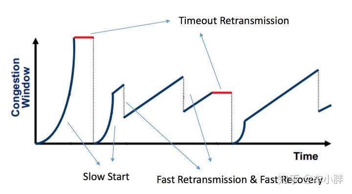</div>


- **所以多线程就是让更多线程去抢占带宽，让用户进程实时抢占的带宽 =（接近） 实时网络可用带宽**
- **BBR算法**：用户进程实时抢占的带宽 = 实时网络可用带宽

## 实现思路

- 考虑的问题：
  - 如何上传的更快===》断点多线程上传
    - 单个大文件，一个很长的TCP很容易受拥塞控制的影响
  - 如何断点重传
    - 如何避免全部重传

> 分片传输
1. 客户端：
   - 对文件生成hash
   - 对文件进行切片，生成sliceList（按每片最大空间，如10MB）
   - 对每个切片生成一个临时标志：`hash-id`
   - 并发传输`{hash-id, sliceList[id]}`
2. 服务端：
   - 创建专门一个文件夹，以 `hash-id` 为文件名，存储 `sliceList[id]` 数据

3. 客户端：
   - 发送归并通知，带上`{hash}`
4. 服务端：
   - 找到文件夹，对文件 `hash-id` 进行字节流归并，以`hash`命名
   - 最后可以再hash check一下

> 断点重传
1. 客户端：
   - 发送文件 `hash` 询问下什么情况
2. 服务端：
   - 收到之后，看以下服务器中的文件，有两种情况：
     - 文件已经存在，可以从文件名看出已经归并
     - 已有的文件切片 `set({hash-id})` 集合（告诉客户端缺了哪些）（有点像SACK机制，只不过SACK是告知缺少的部分）
3. 客户端：
   - 重传缺的文件切片


# 秒杀问题
- 参考：https://juejin.cn/post/6990307911117307934

- **本质**：应对瞬时高并发，如下图
<div style="zoom: 80%" align="center">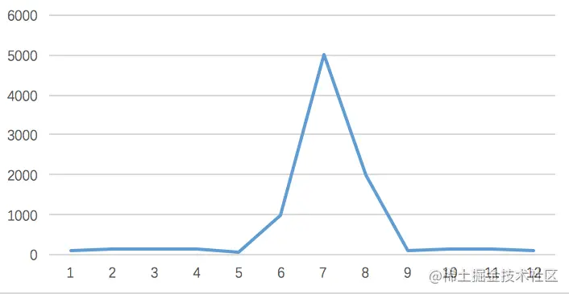</div>

- **业务过程**：秒杀---->下单----->付款
  - **主要的并发再秒杀环节**
- **为什么难以应付**：Mysql这些关系型数据库，在处理大量读的时候能力有限，其连接资源也就name几个。
- **目标**：**减少对数据库的直接查找**
- 传统系统难以应付，可以从以下方面入手
  - 页面静态化
  - CDN加速
  - 缓存
  - mq异步处理
  - 限流
  - 分布式锁

## 页面静态化+CDN
- 分析
  - 活动页面是用户流量的第一入口。
  - 活动页面绝大多数内容是固定的，比如：商品名称、商品描述、图片等。
  - 静态化之后放到各地的CDN中。

<div style="zoom: 80%" align="center"></div>
<div style="zoom: 80%" align="center">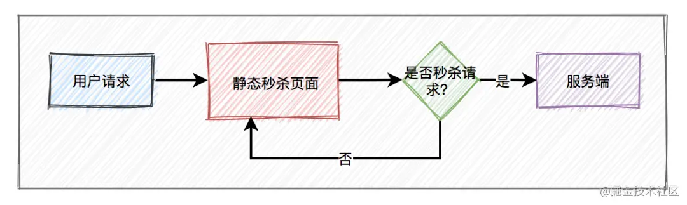</div>
<div style="zoom: 80%" align="center">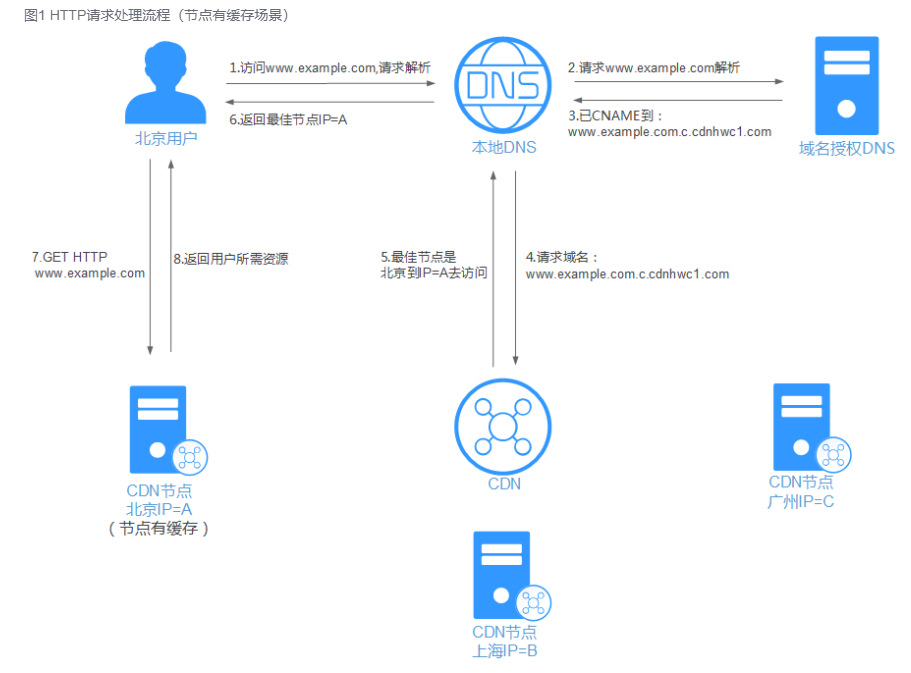</div>

- 秒杀开始之前，js标志为false，让秒杀按钮变暗
- 问题：那怎么让最后时间到了刷新之后他亮起来呢
  - 解决：当秒杀开始的时候系统会生成一个新的js文件，此时标志为true，并且随机参数生成一个新值，然后同步给CDN。**由于有了这个随机参数**，CDN不会缓存数据，每次都能从CDN中获取最新的js代码。
    - eg:`<script src="js/test.js?v=<%=Math.random()%>" type="text/javascript"></script>`

## 读多写少——使用缓存
- **读多写少**的场景：大量用户抢少量商品
  - 手段：借助缓存。如redis
- 方法：用redis保存秒杀商品的信息（信息从数据库中来），里面包含：商品id、商品名称、规格属性、库存等信息。

> 改进前：直接在数据库读
<div style="zoom:60%" align="center">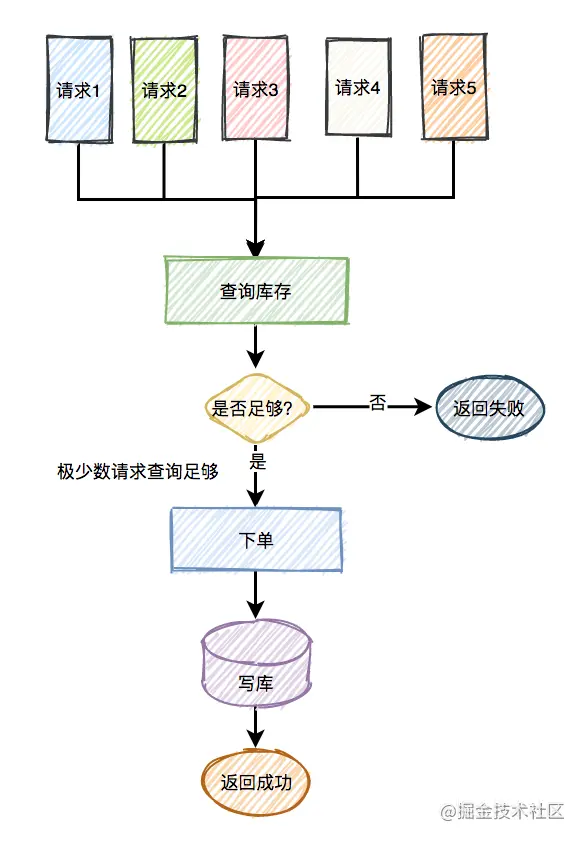</div>

> 改进1.0：使用redis做缓存
- 问题：存在热点id，要是不再缓存，将出现**缓存击穿**
<div style="zoom:60%" align="center">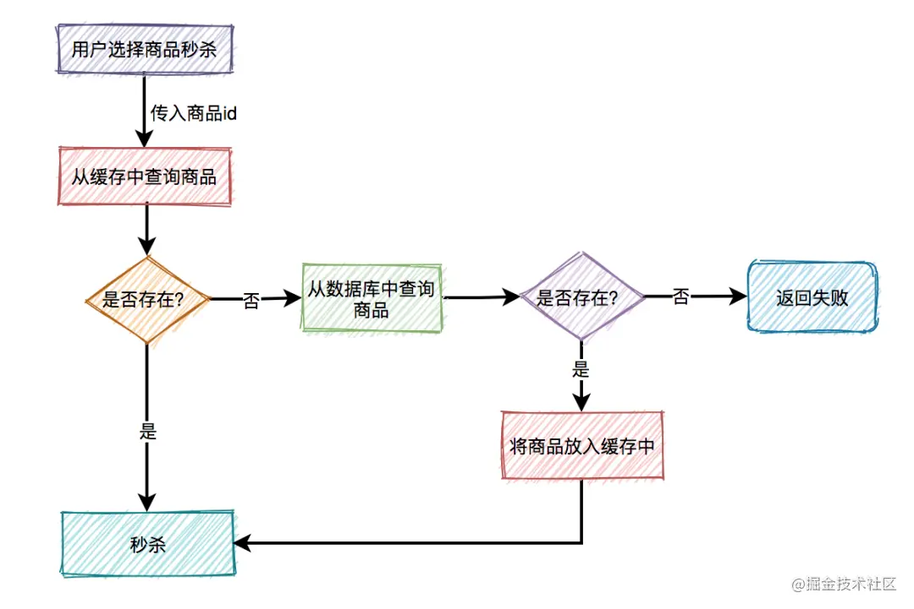</div>

> 改进2.0：使用分布式锁
- 解决缓存击穿问题
  - 但是最好还是从产生缓存击穿的源头上解决，就是秒杀前先把商品信息放到缓存
<div style="zoom:60%" align="center">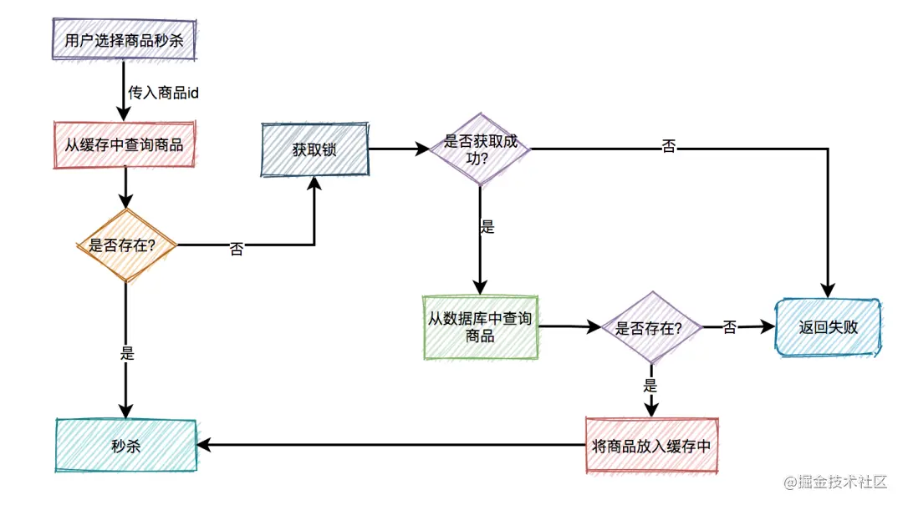</div>

- 问题：**缓存穿透**，如果有恶意用户行为，请求的商品id在缓存中和数据库中都没有，怎么办

> 改进3.0
- 解决1：**布隆过滤器**。但是又要考虑布隆过滤器和商品id的同步，没同步就gg，所以一般在高并发不会用这种方式
- 解决2：**建立不存在缓存**，推荐
<div style="zoom:60%" align="center">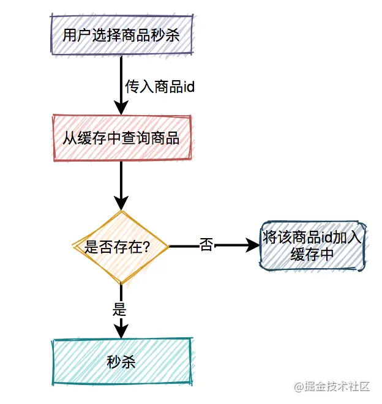</div>

## 并发写
- 写主要在 **预扣库存** 的环节：
<div style="zoom:60%" align="center">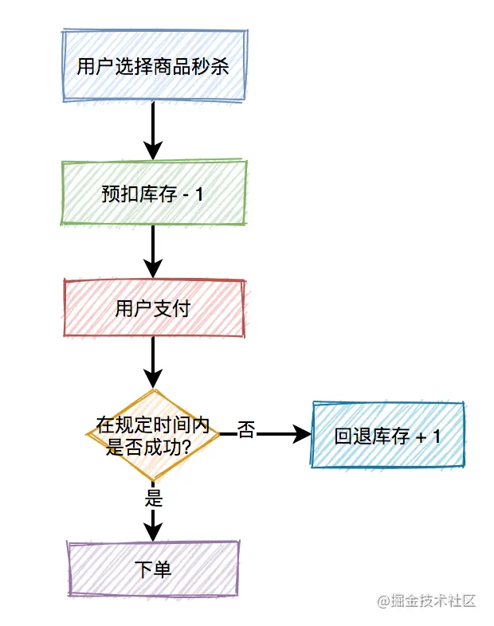</div>

> 数据库扣减库存
- 基于数据库的乐观锁，这样会少一次数据库查询，而且**能够天然的保证数据操作的原子性**。
```sql
update product set stock=stock-1 where id=product and stock > 0;
```
- 问题：大并发下，对数据库直接写还是不是很好

> redis扣减库存
- 直接用redis事务（个人觉得）
  - 先读库存，再确定是否修改

## 分布式锁
- 问题：如何实现分布式锁
  - 如何上锁
  - 如何放锁

> 方案1：setnx
```
if (jedis.setnx(lockKey, val) == 1) {
   jedis.expire(lockKey, timeout);
}
```
- 问题：不是原子的。万一设置超时没成功，gg

> 方案2：set
- set可以支持指定多个参数
  - 设置nx
  - 设置超时
```java
String result = jedis.set(lockKey, requestId, "NX", "PX", expireTime);
if ("OK".equals(result)) {
    return true;
}
return false;

```

> 释放锁
- 重点：
  - 只能释放本次请求的锁
  - 不能用userid替代requestid。原因是一个userid同一时刻，可能有多个分布式锁
```java
if (redis.get(lockKey).equals(requestId)) {
    redis.del(lockKey);
    return true;
}
return false;
```

> 方案3：自旋锁
- 不是系统的那种自旋锁的意思
- 问题：每1万个请求，有1个成功。再1万个请求，有1个成功。如此下去，直到库存不足。这就变成均匀分布的秒杀了，跟我们想象中的不一样。
  - 我们要的是先来先得
  - 解决使用自旋锁解决
- 大致方案：在规定的时间，比如500毫秒内，自旋不断尝试加锁，如果成功则直接返回。如果失败，则休眠50毫秒，再发起新一轮的尝试。如果到了超时时间，还未加锁成功，则直接返回失败
- 个人认为：有点扯

## 消息队列
- 目的：主要是用来让秒杀和下单、支付之间的隔离
- 使用消息队列后，业务如下
<div style="zoom:60%" align="center">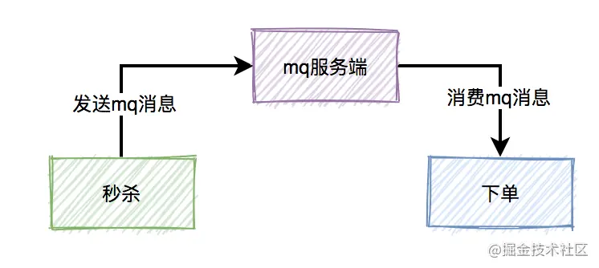</div>

- 问题：
  - 发送mq消息丢失怎么办

> 方案1：加 消息发送表
- 消息发送表加入之后，如果mq丢失，则
  - 用job每隔一段时间去查询消息发送表中状态为待处理的数据，然后重新发送mq消息
<div style="zoom:60%" align="center">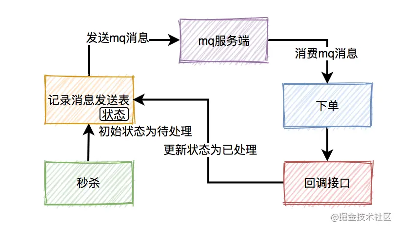</div>
<div style="zoom:60%" align="center">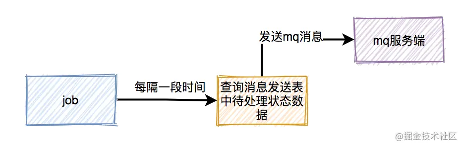</div>

- 问题：重传带来的**重复的消息**。本来消费者消费消息时，在ack应答的时候，如果网络超时，本身就可能会消费重复的消息

> 方案2：再加 消息发送表
- 重点：下单和写消息处理表，要放在同一个事务中，保证原子操作
<div style="zoom:60%" align="center">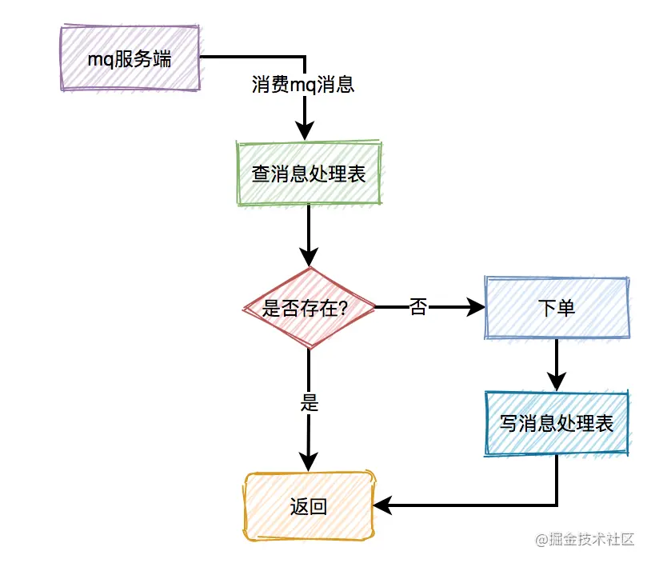</div>

- 问题：垃圾消息怎么办。
  - eg:由于某些原因，消息消费者下单一直失败，一直不能回调状态变更接口，这样job会不停的重试发消息。最后，会产生大量的垃圾消息。
  - 解决：设置重传次数

- 问题：延迟消费问题。秒杀成功了，下单了，但是没付钱，怎么办

> 使用延迟队列
- 延迟队列：就是延迟一段时间再被消费者消费。
<div style="zoom:60%" align="center">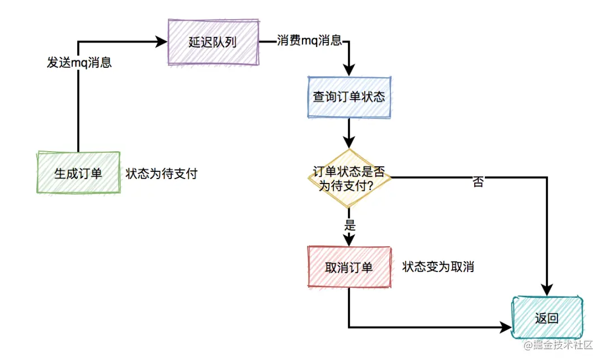</div>

## 限流
- 目前有两种常用的限流方式：
  - 基于nginx限流
  - 基于redis限流
    - 用来记录
- 做法：
  - 针对用户
  - 针对ip
    - 会被用ip代理破解。
  - 针对接口
  - 验证码
  - 提高业务门槛
    - eg：要会员


# 寻找最大k个数（top k）
- https://zhuanlan.zhihu.com/p/76734219
- https://www.cnblogs.com/xiaokang01/p/12562127.html

> 

## 排序
- 直接排序，取前k个
> 优化
- 只需要tok k，不用全排。直接冒泡，冒k个出来
## 构建堆
- 适合上亿级别的数的topk
- 最小堆：最大的topk
- 最大堆：最小的topk

> 优化：Hash法。
- 如果这1亿个书里面有很多重复的数，先通过Hash法，把这1亿个数字去重复，这样如果重复率很高的话，会减少很大的内存用量，从而缩小运算空间
- 感觉可以布隆过滤器

## 随机选择
- 减治法：一个大的问题，转化为若干个子问题（Reduce），这些子问题中“只”解决一个，大的问题便随之解决（Conquer）。这里的关键词是“只”
  - 分治法特例
- 思路：i = partition(arr, 1, n);
  - 如果i大于k，则说明arr[i]左边的元素都大于k，于是只递归arr[1, i-1]里第k大的元素即可；
  - 如果i小于k，则说明说明第k大的元素在`arr[i]`的右边，于是只递归`arr[i+1, n]`里第`k-i`大的元素即可；

```cpp
int RS(arr, low, high, k){
    if(low== high) return arr[low];
    i= partition(arr, low, high);
    temp= i-low; //数组前半部分元素个数
    if(temp>=k)
        return RS(arr, low, i-1, k); //求前半部分第k大
    else
        return RS(arr, i+1, high, k-i); //求后半部分第k-i大
}

```

## 分治法
- 大数据量下，比如100亿，取1000
  - 一直切割，切到足够小，每块取1000个，最后再归并
- 方案
  1. 将100亿个数据分为1000个大分区，每个区1000万个数据
  2. 每个大分区再细分成100个小分区。总共就有1000*100=10万个分区
  3. 计算每个小分区上最大的1000个数
  4. 将这100个分区的1000*100个数合并，找出每个大分区的前1000个数（构建堆或随机选择方法）
  5. 将这1000*1000个数合并，找出前1000.这1000个数就是所有数据中最大的1000个数


# 