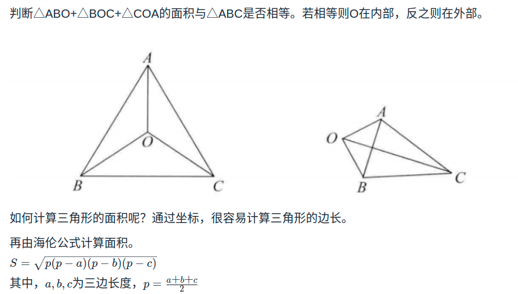

# 一个长度为n的数组，找出其中最大的k个数？n很大
> 公司
- 4399
- 网易互娱
  - 还问了由多种方法，每种方法的耗时分析一下
> 答案
- https://blog.csdn.net/shuiziliu1025/article/details/50958241
- 法1：直接排序
- 法2：快速排序切割思想，有点类似二分法。直到partition() == k返回。
- 法3（n很大时）：容量K的优先队列，满了就与最小的比。

# 如何判断一个点在三角形内部
> 公司
- 4399
> 答案
- https://leetcode-cn.com/circle/discuss/7OldE4/
- 法1：面积比较

- 法2：向量叉乘
  - 算了，会一种就好了

# 随机函数(洗牌算法)
> 公司
- 4399

# B树和B+树的区别
> 公司
- 腾讯

# 反转链表
> 公司
- 腾讯

# 区间题目
> 公司
- 网易互娱
  - 给定会议起始截止时间，至少要多少个房间，会议数 10^4，时间 10^6，写了两种方法，要求数学证明

# 归并排序
> 公司
- 网易互娱

# 数组求峰值
> 公司
- 字节

# LRU
> 公司
- 快手
- 