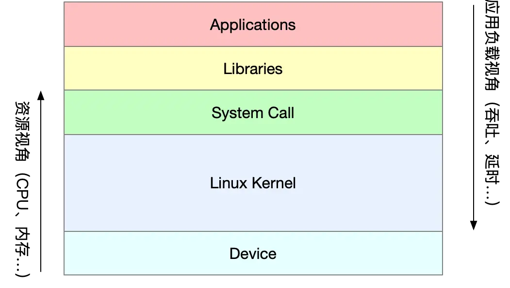
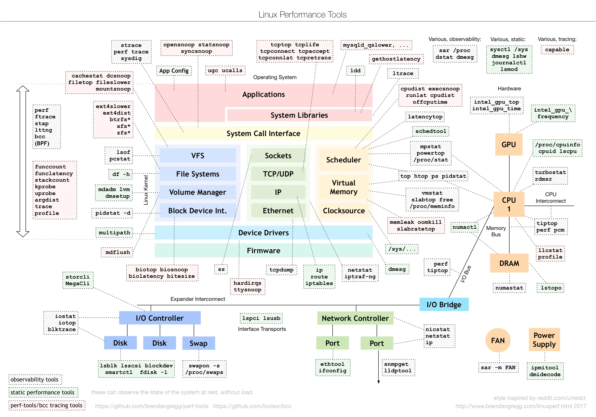
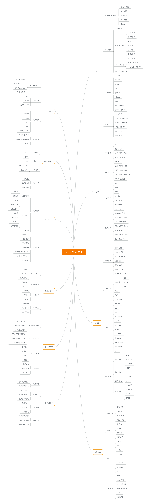

# 概述
- 学习方法：只要理解了应用程序和系统的**少数几个基本原理**，再进行大量的实战练习，**建立起整体性能的全局观**，大多数性能问题的优化就会水到渠成。
  - **不需要了解每个组件的所有实现细节**，只要能理解它们最基本的工作原理和协作方式
  - 

- 性能指标两个视角：
  - 应用负载视角：吞吐、延时等
  - 系统资源视角：资源使用率，饱和度等

- 性能问题的本质：当**系统资源已经到瓶颈**了，而请求处理不够快或者吞吐不够大时，**找出应用或系统的瓶颈，并设法去避免或者缓解**。
- 步骤
  1. 选择指标
  2. 设置目标
  3. 基准测试
  4. 分析瓶颈
  5. 优化应用
  6. 性能监控和告警

- Linux性能工具图谱（Brendan Gregg）
  - **千万不要把性能工具当成学习的全部，只是工具**

- 性能分析内容

