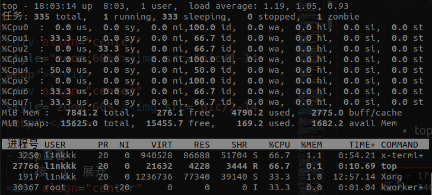
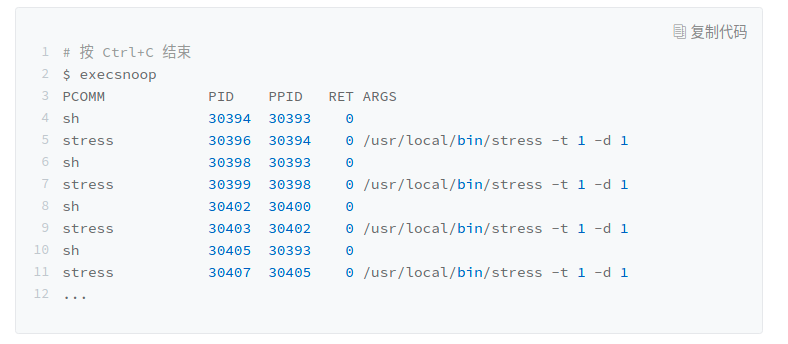
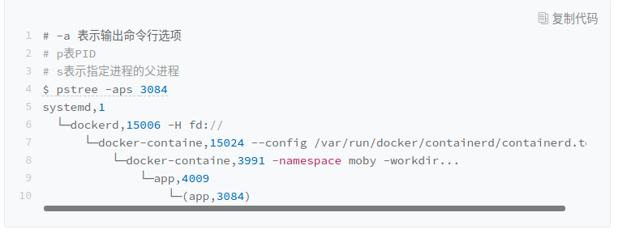
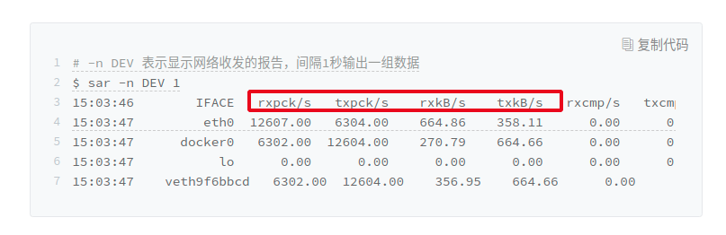

- [平均负载](#平均负载)
  - [什么是平均负载](#什么是平均负载)
  - [指标解读](#指标解读)
  - [案例](#案例)
    - [套路](#套路)
    - [CPU 密集型进程](#cpu-密集型进程)
    - [IO密集型](#io密集型)
    - [大量进程](#大量进程)
- [CPU上下文切换](#cpu上下文切换)
  - [切换场景](#切换场景)
    - [特权模式切换](#特权模式切换)
    - [进程上下文切换](#进程上下文切换)
    - [线程上下文切换](#线程上下文切换)
    - [中断上下文切换](#中断上下文切换)
  - [指标解读：上下文切换多少算正常](#指标解读上下文切换多少算正常)
  - [案例](#案例-1)
    - [vmstat](#vmstat)
    - [pidstat -w](#pidstat--w)
    - [案例分析](#案例分析)
- [CPU使用率](#cpu使用率)
  - [情况：系统的 CPU 使用率很高，但是没找到高CPU应用](#情况系统的-cpu-使用率很高但是没找到高cpu应用)
    - [工具推荐](#工具推荐)
  - [情況：系统中出现大量不可中断进程和僵尸进程](#情況系统中出现大量不可中断进程和僵尸进程)
    - [进程状态](#进程状态)
    - [案例](#案例-2)
      - [iowait 分析](#iowait-分析)
      - [僵尸进程分析](#僵尸进程分析)
      - [总结](#总结)
- [CPU软中断](#cpu软中断)
  - [如何理解软中断](#如何理解软中断)
    - [查看方式](#查看方式)
  - [案例：系统的软中断CPU使用率升高，如何排查](#案例系统的软中断cpu使用率升高如何排查)
    - [分析](#分析)
  - [软中断，硬中断，软件中断（我的理解）](#软中断硬中断软件中断我的理解)
- [总结](#总结-1)
  - [优化方法论](#优化方法论)
    - [性能评估](#性能评估)


# 平均负载
- top、uptime、htop ： 均可显示该系统性能指标
  - 显示的三个值，分别是：1min, 5min, 15min的平均负载


## 什么是平均负载
- 什么是**平均负载**（简单理解）：平均负载是指单位时间内，系统处于**可运行状态**和**不可中断状态**的平均进程数，也就是**平均活跃进程数**
  - **实际上**是活跃进程数的指数衰减平均值，这只是系统的一种更快速的计算方式，把它直接当成活跃进程数的平均值也没问题
  - 注：其实这里是**内核线程数**（调度的基本单位），下面说的进程都可以看成是在说内核线程。（已经过测试）

> 可运行状态
- 所谓可运行状态的进程，是指**正在使用 CPU 或者正在等待 CPU 的进程**，也就是我们常用 `ps` 命令看到的，**处于 R 状态（Running 或 Runnable）的进程**。

> 不可中断状态
- **不可中断状态**的进程则是正**处于内核态关键流程中的进程**，并且这些流程是不可打断的，比如最常见的是等待硬件设备的 **I/O** 响应，也就是我们在 `ps` 命令中看到的 `D` 状态（Uninterruptible Sleep，也称为 Disk Sleep）的进程

> 平均负载与 CPU 使用率
- 平均负载 与 CPU使用率 是两回事
- 对比：
  - **平均负载**是指单位时间内，处于可运行状态和不可中断状态的进程数。所以，它不仅包括了**正在使用 CPU 的进程**，还包括**等待 CPU 和等待 I/O 的进程**。
  - **CPU 使用率** 是单位时间内 CPU 繁忙情况的统计，跟平均负载并不一定完全对应。
- 场景
  - **CPU 密集型进程**，使用大量 CPU 会导致平均负载升高，此时这两者是一致的；
  - **I/O 密集型进程**，等待 I/O 也会导致平均负载升高，但 CPU 使用率不一定很高；
  - **大量等待 CPU 的进程调度**也会导致平均负载升高，此时的 CPU 使用率也会比较高。


## 指标解读
- 最理想：就是每个 CPU 上都刚好运行着一个进程，这样每个 CPU 都得到了充分利用
  - 个人觉得可以稍微高一点，**不可中断状态下其实 CPU 可以执行其他的进程**
- 平均负载为2时（比较粗暴）：
  - 在只有 2 个 CPU 的系统上，意味着所有的 CPU 都刚好被完全占用。
  - 在 4 个 CPU 的系统上，意味着 CPU 有 50% 的空闲。
  - 在只有 1 个 CPU 的系统中，则意味着有一半的进程竞争不到 CPU。

- **警惕指标**（不是绝对）：平均负载高于 CPU 数量 **70%** 的时候，就应该分析排查负载高的问题
  - 更好的做法：**监控历史 平均负载**，判断负载变化趋势


## 案例
- 环境：8CPU
- 安装：`apt install stress sysstat`
  - `stress`：压力测试工具，模拟场景用。
  - `sysstat`：一个工具集，用来对Linux性能进行监控和分析的工具。
- `sysstat`：
  - `mpstat`（针对CPU）：实时查看每个 **CPU** 的性能指标，以及所有 CPU 的平均指标。
  - `pidstat`（针对进程）：实时查看**进程**的 CPU、内存、I/O 以及上下文切换等性能指标。
### 套路
1. 发现问题。发现 平均负载 升高，查找什么原因，原因主要有三个
   - IO密集型
   - CPU密集型
   - 太多内核线程需要调度（进程）
2. 通过CPU指标定位。通过 `mpstat`，大致确定是什么原因
   - `%usr` 很高，原因
     - CPU密集型进程
     - 大量进程需要调度
   - `%sys`和`%iowait` 很高：IO密集型进程
3. 通过进程CPU指标定位。通过 `pidstat` 定位具体进程和具体原因
   - CPU密集型进程：`%usr` 和 `%cpu` 很高
   - IO密集型进程：`%system` 很高
   - 大量进程需要调度：`%wait` 很高

### CPU 密集型进程
- 场景模拟：
```sh
# 模拟一个单进程 CPU密集型进程
stress --cpu 1 --timeout 600
```
- 问题：指标变化（平均负载）：`uptime` 输出的 平均负载+1
  - `watch -d uptime`：持久监控，并且突出变化（-d）
- 定位：指标变化（CPU使用率）：
  - 注：发现某个核心的 `%usr` 达到100%，很大可能是 CPU密集型应用了
```sh
# -P ALL 表示监控所有CPU，后面数字5表示间隔5秒后输出一组数据
mpstat -P ALL 5
```
<div align="center" style="zoom:80%"></div>

- 具体定位（进程相关）：
  - 注：可以定位到 CPU密集型进程
```sh
# 间隔5秒后输出一组数据
$ pidstat -u 5 1
```
<div align="center" style="zoom:80%"></div>

### IO密集型
- 场景模拟
```sh
# 不停地执行 sync
stress -i 8 --timeout 600
```

- 问题：指标变化（平均负载）：`uptime` 输出的 平均负载+8

- 定位：指标变化（CPU使用率）：
  - 注：**`%usr`和 `%iowait`** 的变化。可以发现出现 iowait 和 系统调用 占用的CPU升高的情况，可以得出**主要由这两个原因使得 平均负载升高**。很大可能是一些 **IO的系统调用**
```sh
# 显示所有CPU的指标，并在间隔5秒输出一组数据
$ mpstat -P ALL 5 1
```
<div align="center" style="zoom:80%"></div>


- 具体定位（进程）：
```sh
# 显示所有CPU的指标，并在间隔5秒输出一组数据
$ pidstat -P ALL 5 1
```
<div align="center" style="zoom:80%"></div>


### 大量进程
- 场景模拟

```sh
$ stress -c 32 --timeout 600
```
- 问题：指标变化（平均负载）
```sh
$ uptime
 20:45:26 up  6:17,  1 user,  load average: 24.49, 11.38, 7.27
```

- 定位：指标变化（CPU利用率）
  - 注：cpu利用率飙升，全都100%
<div align="center" style="zoom:80%"></div>

- 具体定位（进程）：
  - 注：每个进程等待CPU的时间平均高达 **70%**，可以断定是因为 **大量内核线程需要调度**
<div align="center" style="zoom:80%"></div>

# CPU上下文切换
- CPU上下文：进程运行所需环境（寄存器，内存等）
- 根据任务的不同，CPU上下文切换分几个不同的切换场景：
  - 特权模式切换
  - 进程上下文切换
  - 线程上下文切换
  - 中断上下文切换
- 影响：频繁上下文切换占用CPU的使用
  - 上下文切换工作由内核处理
## 切换场景
### 特权模式切换
- 目的：**处理软件中断（系统调用需要软件中断切换到内核态）**
- 触发时机：内核态和用户态之间的转变（系统调用），共两次 **上下文切换**
  - 系统调用发生前：用户态CPU寄存器（包括程序计数器）等环境需要保存，更新为内核态的CPU寄存器（一次上下问切换）
  - 系统调用发生后：恢复原来保存的用户态CPU寄存器，切回用户空间。
- **切换内容**：主要是寄存器、少量缓存、PCB等内容
- 注：系统调用过程通常称为 **特权模式切换**，而不是上下文切换。但实际上，系统调用过程中，CPU 的上下文切换还是无法避免的。
  - 在上下文切换测试工具中，不体现。

### 进程上下文切换
- **切换内容**：寄存器、PCB、较多缓存、**内存**等
  - 重
- 切换时机即调度时机，调度时机如下：
  - 时间片完
  - 资源等待（如IO）
  - 进程完
  - sleep函数等主动挂起
  - 优先级更高的来了，抢占
### 线程上下文切换
- 看情况：
  - 不同进程：等同 进程上下文切换
  - 同进程：如下
- **切换内容**：寄存器、PCB、少量缓存等
  - 只切换 线程的私有数据、寄存器等不共享的数据


### 中断上下文切换
- 目的：**处理硬件中断**，异步特征
- 切换内容：跟进程上下文不同，**中断上下文切换并不涉及到进程的用户态**。所以，即便中断过程打断了一个正处在用户态的进程，也**不需要保存和恢复这个进程的虚拟内存、全局变量等用户态资源**。中断上下文，其实只包括内核态中断服务程序执行所必需的状态，包括 CPU 寄存器、内核堆栈、硬件中断参数等。
  - 注：虚拟内存中有一部分是内核保留的内存，直接用这一部分资源，并不需要切换出去（各个进程中这一部分都是映射到同一个物理内存）

- 注：中断处理程序中，不会再发生上下文切换。所以往往中断处理程序尽量短。

## 指标解读：上下文切换多少算正常
- **取决于CPU本身的性能**。
- 如果系统的上下文切换次数比较稳定，那么从**数百到一万以内**，都应该算是**正常**的。但当上下文切换次数**超过一万次**，或者**切换次数出现数量级的增长**时，就很可能已经出现了性能问题。

## 案例
- 环境：8 CPU
- 安装：`apt install sysbench sysstat`
- sysbench：一个多线程的基准测试工具，一般用来评估不同系统参数下的数据库负载情况。在该案例中，只把它当成一个异常进程来看，作用是模拟上下文切换过多的问题。

### vmstat
- `vmstat`：一个常用的系统性能分析工具，主要用来**分析系统的内存使用情况**，也常用来分析 **CPU 上下文切换和中断的次数**。
<div align="center" style="zoom:80%"></div>

- 用法： `vmstat 5 2`，5秒输出一次，共输出2次

- 案例重点关注列的含义：
  - `cs`（context switch）：每秒上下文切换的次数。
  - `in`（interrupt）：则是每秒中断的次数。
  - `r`（Running or Runnable）：是就绪队列的长度，也就是**正在运行和等待 CPU 的进程数**。
  - `b`（Blocked）：则是处于不可中断睡眠状态的进程数。
- 注：
  - cs > in

### pidstat -w
<div align="center" style="zoom:80%"></div>

- 案例重点关注的列：
  - `cswch`：表示每秒**自愿上下文切换**（voluntary context switches）的次数
  - `nvcswch`：表示每秒**非自愿上下文切换**（non voluntary context switches）的次数。

- 自愿上下文切换：**指进程无法获取所需资源，导致的上下文切换**。比如说， I/O、内存等系统资源不足时，就会发生自愿上下文切换。
- 非自愿上下文切换：**指进程由于时间片已到等原因，被系统强制调度，进而发生的上下文切换**。比如说，大量进程都在争抢 CPU 时，就容易发生非自愿上下文切换。

### 案例分析
- 场景模拟：
```sh
# 以8个线程运行5分钟的基准测试，模拟多线程切换的问题
$ sysbench --threads=8 --max-time=300 threads run
```
- 问题：指标变化（上下文切换）：`vmstat` 中，上下文切换发生几个数量级的变化
  - 注：cs和in数量级上升，说明 **中断处理** 和 **上下文切换**是一个潜在的问题
  - 下面找出哪个进程，以及何种中断
<div align="center" style="zoom:80%"></div>

- 具体定位（进程/线程相关）：
  - 注：发现 sysbench 的CPU使用率很高，并且其 **自愿上下文切换(cswch)** 和 **非自愿上下文切换(nvcswch)** 很高
  - 注：该工具如果是只输出一次，要注意第一次的性能测试结果不准确的问题。
  - 注：需要 带`t`参数，不然是进程层面的性能信息，而不是线程
```sh
# -wt 参数表示输出线程的上下文切换指标
# -u参数则表示输出CPU使用指标
pidstat -wt -u 1
```
<div align="center" style="zoom:80%"></div>

- 具体定位（中断类型）：`watch -d cat /proc/interrupts`
  - 注：RES，CAL中断比较高，分别是重调度中断，系统调用中断。RES中断高，表明存在许多进程/线程被调度；CAL中断高，表示该程序有许多系统调用。
  - 注：`/proc` 实际上是 Linux 的一个虚拟文件系统，用于内核空间与用户空间之间的通信。`/proc/interrupts` 就是这种通信机制的一部分，提供了一个只读的中断使用情况。

<div align="center" style="zoom:80%"></div>


# CPU使用率
- 节拍率（CONF_HZ）：
  - 意义：CPU时间片，CPU调度相关
  - 含义：每秒产生时间中断（LOC）的次数，每次中断 Jiffies 值+1。
  - 查看：`grep 'CONFIG_HZ=' /boot/config-$(uname -r)`
  - 可以设置，通常为250，就是每秒钟触发 250 次时间中断。
- USER_HZ
  - 正因为节拍率 HZ 是内核选项，所以用户空间程序并不能直接访问。为了方便用户空间程序，内核还提供了一个用户空间节拍率 USER_HZ，它总是固定为 100，也就是 1/100 秒。这样，用户空间程序并不需要关心内核中 HZ 被设置成了多少，因为它看到的总是固定值 USER_HZ。
- `/proc/stat` 提供的就是系统的 CPU 和任务统计信息。
  - man pro 查看各列含义
  - 记录从开机到现在的时间，单位为USER_HZ

<div align="center" style="zoom:60%"></div>

- **CPU 使用率**：就是除了空闲时间外的其他时间占总 CPU 时间的百分比
  - 通过 `/proc/stat` 算出来的，是开机到目前的平均值，没多大参考意义
  - 性能工具一般都会取**间隔一段时间**（比如 3 秒）的两次值，作差后，再计算出这段时间内的平均 CPU 使用率。
  - **注意时间间隔的设置，多个工具对比分析时，注意要保证时间间隔相同**


<div align="center" style="zoom:60%"></div>
<div align="center" style="zoom:60%"></div>

> top查看
  - 按 `1` 展开各个核心的情况
  - 每个进程都有一个 %CPU 列，表示**进程的 CPU 使用率**。它是**用户态和内核态 CPU 使用率的总和**，包括进程用户空间使用的 CPU、通过系统调用执行的内核空间 CPU 、以及在*就绪队列等待运行的 CPU*。（注：Runable状态也算进去？）
<div align="center" style="zoom:80%"></div>

> pidstat
- 精细每部分CPU使用率
  - 用户态 CPU 使用率 （%usr）；
  - 内核态 CPU 使用率（%system）；
  - 运行虚拟机 CPU 使用率（%guest）；
  - 等待 CPU 使用率（%wait）；
  - 总的 CPU 使用率（%CPU）

<div align="center" style="zoom:80%"></div>

> perf
- 功能：能够实时显示占用 CPU 时钟最多的函数或者指令，因此可以用来查找热点函数
- perf top：在线分析
- perf record 和 perf report：离线分析

> ab
- 功能：web压力测试工具
  - 可以测试每秒web能处理的请求数

<div align="center" style="zoom:80%"></div>

## 情况：系统的 CPU 使用率很高，但是没找到高CPU应用

- 碰到常规问题无法解释的 CPU 使用率情况时，首先要想到有可能是**短时应用**导致的问题，存在两种情况
  - 应用里调用了其他程序，这些程序运行时间短，top难以捕捉
  - 调用应用程序不断的崩溃重启，启动过程的资源初始化，可能占用过多的CPU。
- 原因：短时任务比较短，无法在 ps 和 top 这类系统概要和进程快照工具中发现。
### 工具推荐
- pstree
  - 例子：`pstree | grep ...`
  - 找到父进程调用某子进程的证据

- perf
  - 例子：`perf record -g`，等待一段时间按 ctrl+c，结束，生成报表并分析。
  - 分析一段时间内CPU的使用情况，才能确定在这段时间是否该进程占了很多CPU

<div align="center" style="zoom:60%"></div>

- execsnoop
  - 一个专门为短时进程设计的工具
<div align="center" style="zoom:60%"></div>


## 情況：系统中出现大量不可中断进程和僵尸进程

### 进程状态
- 状态
  - R：Running 或 Runnable，正在运行或就绪的进程
  - D：Disk Sleep 的缩写，也就是不可中断状态睡眠（Uninterruptible Sleep）。表示进程正在和硬件交互，不可被其他进程或中断打断。
  - Z：僵尸进程
  - S：Interruptible Sleep 的缩写，也就是可中断状态睡眠。表示进程正在等待某个事件，而被系统挂起。
  - I：Idel的缩写，用在 不可中断睡眠的内核线程上。
    - 注意，D 状态的进程会导致平均负载升高， I 状态的进程却不会。
  - T：暂停状态， `SIGSTOP` 和 `SIGCONT` 相关
  - t：跟踪状态。在使用断点中断进程后，进程就会变成跟踪状态，这其实也是一种特殊的暂停状态。
  - X：Dead ，表示进程已经死亡。

> 不可中断状态D
- 不可中断状态，表示进程正在跟硬件交互，为了保护进程数据和硬件的一致性，系统不允许其他进程或中断打断这个进程。进程长时间处于不可中断状态，通常表示系统有 I/O 性能问题。

> 僵尸进程Z
- 大量的僵尸进程会用尽 PID 进程号，导致新进程不能创建
- 僵尸进程表示进程已经退出，但它的父进程还没有回收子进程占用的资源。短暂的僵尸状态我们通常不必理会，但进程长时间处于僵尸状态，就应该注意了，可能有应用程序没有正常处理子进程的退出。

> 进程组和会话
- 进程组表示一组相互关联的进程，比如每个子进程都是父进程所在组的成员；
- 会话是指共享同一个控制终端的一个或多个进程组。
  - `+`：前台进程组
  - `s`：会话领导进程
<div align="center" style="zoom:60%"></div>

### 案例
- 安装：`apt install docker.io dstat sysstat`
- dstat：dstat 是一个新的性能工具，它吸收了 vmstat、iostat、ifstat 等几种工具的优点，可以同时观察系统的 CPU、磁盘 I/O、网络以及内存使用情况

- 场景模拟：`docker run --privileged --name=app -itd feisky/app:iowait`


<div align="center" style="zoom:60%"></div>

- 问题：
  - iowait 过高
  - 僵尸进程 过多

#### iowait 分析
- 套路：哪些资源，发生哪些事==> 定位进程 ===> 定位系统调用 ===> 定位程序代码

- 定位：（CPU中的iowait过高，io中的读数据比较大）
  - 可能是读数据影响了，但是读的数据量也不大，为什么这么高？
<div align="center" style="zoom:60%"></div>

- 定位：(哪个进程)
  - top
  - 发现 app 长时间以及大量的D状态
<div align="center" style="zoom:60%"></div>

- 定位（查看进程的具体使用资源）
  - pidstat
  - 发现该进程确实存在较大数据的读io
<div align="center" style="zoom:80%"></div>


- 定位：（系统调用）
  - 法1：`strace -p you_pid`
  - 法2：`perf record -g` 等待15s后 ctrl+c ， `perf report`
  - 发现 `new_sync_read` 和 `blkdev_direct_IO`，**得以看出是对 磁盘的读，以及没有使用缓存，直接读**
<div align="center" style="zoom:60%"></div>

- 定位：（程序代码，阅读源码）


#### 僵尸进程分析

- 无疑是父进程没有处理子进程资源回收，所以直接定位僵尸进程的父进程
- 定位：（父进程）
  - `pstree -aps zombie_pid`
    - a 表示输出命令行选项
    - p 表PID
    - s 表示指定进程的父进程

<div align="center" style="zoom:80%"></div>

- 定位：（代码分析，分析父进程的源码）

#### 总结

- **iowait 高不一定代表 I/O 有性能瓶颈**。当系统中只有 I/O 类型的进程在运行时，iowait 也会很高，但实际上，磁盘的读写远没有达到性能瓶颈的程度。

# CPU软中断
## 如何理解软中断
> 软中断的引入背景：
- 硬件中断由硬件发出
- **硬件中断** 其实是一种异步的事件处理机制，可以提高系统的并发处理能力。
- 为了减少对正常进程运行调度的影响，中断处理程序就需要尽可能快地运行
- 响应中断的时候，会临时关闭中断，即不能响应其他中段，所以**如果中断太长，其他中断很可能丢失，而不能得到响应**。

> 软中断
- 针对上面的问题，Linux将中断处理过程分为了两个阶段：**上半部和下半部**
  - 注：这里从linux的角度理解，而**不应该是从操作系统角度理解**。操作系统的角度理解太大了，很容易和 int 这种软中断搞混，我的理解是，**这里的软中断是为了解决硬件中断存在的上述问题，而进行的优化**。

- 上半部：**上半部用来快速处理中断**，它在中断禁止模式下运行，主要处理跟硬件紧密相关的或时间敏感的工作。
  - 硬件中断唤醒，这部分屏蔽中断
- 下半部：**下半部用来延迟处理上半部未完成的工作**，通常以**内核线程**的方式运行。
  - 软中断唤醒，这部分不屏蔽中断，可重入


- 【linux系统层面】上半部直接处理硬件请求【硬件中断】，也就是我们常说的**硬中断**【这里硬件中断和硬中断等同】，特点是快速执行，**最后触发软中断**；
- 【linux系统层面】下半部则是由**内核完成**，通过**软中断**进行触发，特点是延迟执行。

- **上半部和下半部的处理方式**
  - 上半部会打断 CPU 正在执行的任务，然后立即执行中断处理程序。
  - 下半部以内核线程的方式执行，并且每个 CPU 都对应一个软中断内核线程，名字为 “ksoftirqd/CPU 编号”，比如说， 0 号 CPU 对应的软中断内核线程的名字就是 `ksoftirqd/0`。

> 一个网络例子：体会 硬件中断 和 软中断

- 网卡接收到数据包后，会通过 **硬件中断**【操作系统之下的底层去理解，也就是说，硬件抛给你这样的一个硬件中断，操作系统怎么处理是你自己的事了】 的方式，通知内核有新的数据到了。这时，内核就应该调用中断处理程序来响应它。你可以自己先想一下，这种情况下的上半部和下半部分别负责什么工作呢？
- 对上半部来说，既然是快速处理，其实就是要把网卡的数据读到内存中，然后更新一下硬件寄存器的状态（表示数据已经读好了），最后再发送一个 **软中断**【操作系统是通过抛一个软中断的方式来处理的】 信号，通知下半部做进一步的处理。
- 而**下半部被软中断信号唤醒**后，需要从内存中找到网络数据，再按照网络协议栈，对数据进行逐层解析和处理，直到把它送给应用程序。


### 查看方式

- `/proc/softirqs` 提供了软中断的运行情况；
- `/proc/interrupts` 提供了硬中断的运行情况。

<div align="center" style="zoom:80%"></div>

- 注意点:
  - 共有10种类型，软中断包括网络收发、定时、调度、RCU 锁等各种类型
  - 每中正常情况下，每个cpu的中断次数都是同个数量级下的，相差不大。除了TASKLET等中断，因为其要求只在调用它的函数所在的 CPU 上运行。在比较空闲的情况下，一般都在同一线程都在同CPU上调度


- 每个 CPU 都对应一个软中断内核线程，这个软中断内核线程就叫做 `ksoftirqd/CPU编号`

<div align="center" style="zoom:80%"></div>

## 案例：系统的软中断CPU使用率升高，如何排查

- 安装：`apt-get install docker.io sysstat hping3 tcpdump`
- hping3：本案例用来发起SYN泛洪
- tcpdump：抓包工具
- sar：一个系统活动报告工具，既可以实时查看系统的当前活动，又可以配置保存和报告历史统计数据

> 场景
- 服务端：`docker run -itd --name=nginx -p 80:80 nginx`
- 客户端：`hping3 -S -p 80 -i u100 192.168.0.30`
<div align="center" style="zoom:60%"></div>


### 分析

- 定位：（软中断）
  - 特征
    - 平均负载很低，三个值都是0
    - CPU利用率也很低，空闲90%以上，但是其他都用在了 `si` 上，即用再了软中断上面了。
    - 进程列表中，**占CPU最高的居然是 处理软中断的内核线程**

<div align="center" style="zoom:80%"></div>

- 定位：（何种软中断）`watch -d cat /proc/softirqs`
  - 监控 软中断 变化速率，发现 `NET_RX`，也就是网络数据包接收软中断的变化速率最快

- 定位：（网络情况）
  - 接收到的网络帧数很多，但是接收到的字节数并不多，只有`664kb`
<div align="center" style="zoom:80%"></div>
<div align="center" style="zoom:80%"></div>

- 定位：（帧）`tcpdump -i eth0 -n tcp port 80`
  - 可以清楚发现，有很多 `SYN` 包

```sh

# -i eth0 只抓取eth0网卡，-n不解析协议名和主机名
# tcp port 80表示只抓取tcp协议并且端口号为80的网络帧
$ tcpdump -i eth0 -n tcp port 80
15:11:32.678966 IP 192.168.0.2.18238 > 192.168.0.30.80: Flags [S], seq 458303614, win 512, length 0
...
```

## 软中断，硬中断，软件中断（我的理解）
- https://en.wikipedia.org/wiki/Interrupt
- https://www.geeksforgeeks.org/difference-between-hardware-interrupt-and-software-interrupt/
- 软件中断和硬件中断一起理解
  - 软件中断：由软件触发，同步，用于通知内核，让内核进行处理。分为两类：`Normal Interrupts` 和 `Exception`
    - `Normal Interrupts`：`int` 触发，如系统调用...
    - `Exception`：缺页异常，除0异常...
  - 硬件中断：由硬件发起，异步，用于通知CPU，让内核进行处理。分为了两个步骤处理：上半部（处理硬中断），下半部（处理软中断）
    - eg：IO有数据可读
- 软中断：由处理硬中断的中断处理程序发出，告知上半部处理完成，可以处理下半部了。

# 总结
> 性能指标
- CPU 使用率
  - user：用户态CPU使用率
  - sys：内核态CPU使用率
  - iowait：等待IO的CPU使用率
  - hi,si：软中断和硬中断的CPU使用率
  - steal，guest：用于虚拟化环境中。分别表示被其他虚拟机占用的 CPU 时间百分比，和运行客户虚拟机的 CPU 时间百分比
- 平均负载
- 进程上下文切换
  - 自愿
  - 非自愿
- CPU缓存命中率
  - 这些缓存按照大小不同分为 L1、L2、L3 等三级缓存，性能依次降低。其中 L1 和 L2 常用在单核中， L3 则用在多核中

<div align="center" style="zoom:80%"></div>
<div align="center" style="zoom:80%"></div>

> 工具
<div align="center" style="zoom:40%"></div>

<div align="center" style="zoom:40%"></div>

## 优化方法论

- 性能优化前，问三个问题：
  - 该优化是否有效，大概能提升多少性能
  - 如果多个性能问题同时发生，先优化哪个
  - 有多种方法时，选用哪一个

### 性能评估
- 三步
  - 确定性能的量化指标
    - 性能的量化指标有很多，比如 CPU 使用率、应用程序的吞吐量、客户端请求的延迟等，都可以评估性能
  - 测试优化前的性能指标
  - 测试优化有的性能指标

- 不要局限在单一维度的指标上，至少要从**应用程序和系统资源**这两个维度
  - 应用程序的维度，我们可以用吞吐量和请求延迟来评估应用程序的性能。
    - 应用程序是性能优化的最终目的和结果，系统优化总是为应用程序服务的。
  - 系统资源的维度，我们可以用 CPU 使用率来评估系统的 CPU 使用情况。
    - 系统资源的使用情况是影响应用程序性能的根源。
- 性能测试注意点：
  - 避免性能测试工具干扰应用程序性能
  - 避免外部环境的变化影响性能指标的评估（控制变量）

