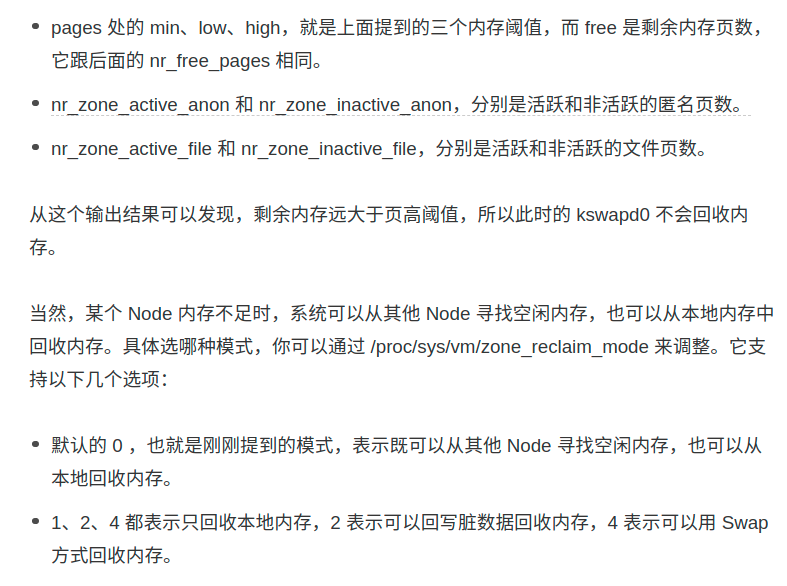

- [回顾](#回顾)
- [内存机制](#内存机制)
  - [内存的分配与回收](#内存的分配与回收)
  - [查看工具](#查看工具)
- [利用缓存优化系统效率](#利用缓存优化系统效率)
  - [缓存命中率](#缓存命中率)
  - [清除缓存的方式](#清除缓存的方式)
  - [案例：体会缓存带来的效率](#案例体会缓存带来的效率)
    - [读磁盘，写文件](#读磁盘写文件)
    - [读文件](#读文件)
- [案例：内存泄露检查](#案例内存泄露检查)
- [SWAP](#swap)
  - [内存回收](#内存回收)
    - [kswapd0 机制](#kswapd0-机制)
  - [NUMA 和 swap](#numa-和-swap)
  - [配置swap](#配置swap)
  - [swap 使用建议](#swap-使用建议)
  - [案例：为什么swap升高](#案例为什么swap升高)
- [总结](#总结)
  - [大致步骤](#大致步骤)

# 回顾
- 虚拟内存、页表、快表、内存分布
- 系统内存指标：free、used、shared、buffer/cache、avaible
- 进程内存指标：
- 内存页类型
  - 文件页：buffer/cache（存在脏页）、只读页等等
  - 匿名页：堆数据

> 分配
- 系统调用内存分配请求后，并不会立刻为其分配物理内存，而是在请求首次访问时，**通过缺页异常来分配**
- 缺页：
  - 主缺页异常：可以直接从物理内存中分配时
  - 次缺页异常：需要磁盘 I/O 介入（比如 Swap）时

> 回收
- 内存不足时处理方式
  - 内存回收内核线程
    - swap
    - 直接释放
  - OOM
- 内存回收机制：
  - 水位
  - 内核进程
  - 内核参数控制行为（swap的优先程度，水位的高低）
> 缓存
- 缓存
  - 命中率：极大影响IO性能
  - 使用量
> swap
- SWAP使用的谨慎


# 内存机制
- 内存
  - 物理内存：实际内存
  - 虚拟内存：操作系统为每个进程虚拟的
    - 内核空间：只有进程进入内核态才能访问，每个进程中该部分实际关联的物理内存都是相同的
    - 用户空间

> 每个进程的虚拟内存划分
<div align="center" style="zoom:80%"></div>

> 内存映射
- 页表：存于内存中，存储映射关系
- TLB（快表）：存于CPU中的缓存，存储映射关系
- 页为单位，一般4KB

<div align="center" style="zoom:80%"></div>

- **问题：页表过大**。
  - 参考：https://www.zhihu.com/question/63375062
  - 解决方式：多级页表 和 大页（HugePage）
- 多级页表
  - 为什么能解决页表过大问题：
    - 有些页表项可以为空，那么其下一层就可根本不存在（类似树的剪枝）。原因：实际上进程需要的内存达不到4GB（32位情况下的假设）
    - 只有一级页表**必须**在主存中，用来粗粒度的起始索引。如果是单级的，那么所有都要在主存上才能找到

<div align="center" style="zoom:80%"></div>

> 虚拟内存空间分布

<div align="center" style="zoom:80%"></div>

- 各个空间职责
  - **只读段**，包括代码和常量等。
  - **数据段**，包括全局变量等。
  - **堆**，包括动态分配的内存，从低地址开始向上增长。
  - **文件映射段**，包括动态分配的内存，动态库、共享内存等，从高地址开始向下增长。
  - **栈**，包括局部变量和函数调用的上下文等。栈的大小是固定的，一般是 8 MB。

- 动态分配的内存：可以分别在 **堆 和 文件映射段** 动态分配内存。

## 内存的分配与回收

> 分配
- malloc，对应调用的系统调用有两种方式，分别为 `brk` 和 `mmap`：
  - 小块内存：通过移动堆顶的位置来分配，这些内存释放时不会归还，而是被缓存起来，可以重复使用。
    - 优点：快，减少缺页异常。
    - 缺点：碎片
  - 大块内存（>128k）:使用 `mmap`，在文件映射段 找空闲内存进行分配，释放时就归还给系统了。
  - 注意：当这两种调用发生后，其实并没有真正分配内存，而是用的时候才分配。
- Linux 使用**伙伴系统**【一种内存调度管理机制】来管理内存分配。以页为管理单位，并且会对相邻页进行合并，减少碎片。
- **slab**：在内核空间，Linux 则**通过 slab 分配器来管理小内存**。你可以**把 slab 看成构建在伙伴系统上的一个缓存**，主要作用就是管理内核中分配的小对象。
  - 注：看成缓存

> 回收
- 内存紧张时，系统回收内存的三种方式：
  - 通过一定算法（如LRU），直接丢弃
  - 写入 swap
  - 杀死进程 （OOM,Out of Memory），一种内存保护机制。

- **oom_score**：为每个进程的内存使用情况进行评分
  - 消耗越多，oom_score 越大
  - 管理员可以通过 `/proc` 文件系统，手动设置进程的 oom_adj ，从而调整进程的 `oom_score`。eg：`echo -16 > /proc/$(pidof sshd)/oom_adj`
  - oom_adj 的范围是 [-17, 15]，数值越大，表示进程越容易被 OOM 杀死；数值越小，表示进程越不容易被 OOM 杀死，**其中 -17 表示禁止 OOM**

## 查看工具
> free

<div align="center" style="zoom:80%"></div>

- 输出信息
  - total： 总内存
  - used：已使用的内存，包括 shared 部分 ( `total - free - buffers - cache`)
  - free：未使用的内存
  - shared：共享内存，用于进程间通信以及临时文件存储等。
    - 共享内存是通过 tmpfs 实现的，所以它的大小也就是 tmpfs 使用的内存大小。tmpfs 其实也是一种特殊的缓存。（可以man以下看看文档）
  - buff/cache：缓存和缓冲区大小。
    - buff：内核缓冲区用到的内存，对应的是 /proc/meminfo 中的 Buffers 值。
    - cache：内核页缓存和 Slab 用到的内存，对应的是 /proc/meminfo 中的 Cached 与 SReclaimable 之和
  - available：新进程可用内存的大小。考虑了 page cache，但是并不是所有 page cache 都会被回收，因为可能正在被使用。

- `available` > `free`：因为其包含了可以回收的内存  

- buff、cache，man /proc/meminfo 
  - **Buffers 对磁盘数据的缓存（不论读写）**
  - **Cached 对文件数据的缓存（不论读写）**
- **对于磁盘或文件的缓存好处**
  - 写：写入缓存即可返回，而不用等到实际落盘。内核可以将多个系统调用写入的数据，一次性刷进去
  - 读：可以预读，而减少实际读取磁盘的次数。
```

Buffers %lu
    Relatively temporary storage for raw disk blocks that shouldn't get tremendously large (20MB or so).

Cached %lu
   In-memory cache for files read from the disk (the page cache).  Doesn't include SwapCached.
...
SReclaimable %lu (since Linux 2.6.19)
    Part of Slab, that might be reclaimed, such as caches.
    
SUnreclaim %lu (since Linux 2.6.19)
    Part of Slab, that cannot be reclaimed on memory pressure.
```
<div align="center" style="zoom:60%"></div>

> top：进程的内存指标

<div align="center" style="zoom:80%"></div>

- 输出信息
  - VIRT：进程虚拟内存大小。只要是进程申请过的，就算已经不在物理内存中，也算进去。
  - RES：当前该进程实际占用的内存，不包括 swap 和 SHR）
  - SHR：共享内存的大小，比如与其他进程共同使用的**共享内存、加载的动态链接库以及程序的代码段**等。
    - 在计算多个进程的内存使用时，不要把所有进程的 SHR 直接相加得出结果
    - 个人认为：与 free 中的 shared 有区别
  - %MEM：是进程使用物理内存占系统总内存的百分比。

# 利用缓存优化系统效率
- 指标：缓存命中率
## 缓存命中率
- **缓存命中率**（评价缓存收益）：直接通过缓存获取数据的请求次数，占所有数据请求次数的百分比
  - **一次命中读取 1页 的数据**，所以一般是4096
- 工具： `cachestat` 和 `cachetop`
  - 基于 Linux 内核的 **eBPF**（extended Berkeley Packet Filters）机制，来跟踪内核中管理的缓存，并输出缓存的使用和命中情况
  - 安装：https://github.com/iovisor/bcc/blob/master/INSTALL.md#ubuntu---source
    - 安装有点麻烦，建议源码安装
  - `cachetop 5`：5s 更新一次，测得的命中次数是5s内的命中次数。

- 工具： `pcstat`
  - 查看文件的缓存情况
  - 安装：github 上 readme

```sh
$ pcstat /bin/ls         
+---------+----------------+------------+-----------+---------+
| Name    | Size (bytes)   | Pages      | Cached    | Percent |
|---------+----------------+------------+-----------+---------|
| /bin/ls | 146392         | 36         | 36        | 100.000 |
+---------+----------------+------------+-----------+---------+

```

## 清除缓存的方式
- 参考：https://blog.csdn.net/XD_hebuters/article/details/79608136
- 方式：`echo N > /proc/sys/vm/drop_caches`，`N` 有三种情况
  - `1`：清除 pagecache。（文件和磁盘没有用到的缓存都会删除）
  - `2`：清除 slab 的数据。
  - `3`：清除 slab 和 pagecache 的数据
- 注
  - 只清除没有使用的 缓存 
  - 建议在清除之前 `sync` 一下，这样可以清除的数据会更多

## 案例：体会缓存带来的效率

### 读磁盘，写文件
- 场景：从 **硬盘** 读取，生成（写）一个文件

```sh
# 生成一个512MB的临时文件
$ dd if=/dev/sda1 of=file bs=1M count=512
记录了512+0 的读入
记录了512+0 的写出
536870912字节（537 MB，512 MiB）已复制，4.24457 s，126 MB/s
```

> 缓存变化：

- `/proc/meminfo` 的变化，主要的变化在 `Buffers` 和 `Cached`
  - Buffer 主要是 读硬盘 时的缓存， Cache 主要是 写文件 时的缓存，没毛病。
```sh
# 生成文件前
$ cat /proc/meminfo | grep -nE "Cached|SReclaimable|Buffer" 
4:Buffers:            9828 kB
5:Cached:          1433060 kB
6:SwapCached:       300584 kB
24:SReclaimable:     152428 kB

```
```sh
# 生成文件后
$ cat /proc/meminfo | grep -nE "Cached|SReclaimable|Buffer"
4:Buffers:          541940 kB
5:Cached:          1976528 kB
6:SwapCached:       300680 kB
24:SReclaimable:     165640 kB

```

- 文件的缓存情况：
  - 正好缓存的部分和 `Cached` 增加的部分对应上了。
```sh
$ pcstat ./file                          
+--------+----------------+------------+-----------+---------+
| Name   | Size (bytes)   | Pages      | Cached    | Percent |
|--------+----------------+------------+-----------+---------|
| ./file | 536870912      | 131072     | 114915    | 087.673 |
+--------+----------------+------------+-----------+---------+
****
```

### 读文件

> 清空缓存情况下

```sh
$ echo 3 > /proc/sys/vm/drop_caches      
$ pcstat ./file                    
+--------+----------------+------------+-----------+---------+
| Name   | Size (bytes)   | Pages      | Cached    | Percent |
|--------+----------------+------------+-----------+---------|
| ./file | 536870912      | 131072     | 0         | 000.000 |
+--------+----------------+------------+-----------+---------+

```
- 读文件：`dd if=file of=/dev/null bs=1M`，并检查缓存
  - 读取速度：`505 MB/s`
  - 读完后，文件缓存 100%
```sh
$ dd if=file of=/dev/null bs=1M
记录了512+0 的读入
记录了512+0 的写出
536870912字节（537 MB，512 MiB）已复制，1.0621 s，505 MB/s
$ pcstat ./file                
+--------+----------------+------------+-----------+---------+
| Name   | Size (bytes)   | Pages      | Cached    | Percent |
|--------+----------------+------------+-----------+---------|
| ./file | 536870912      | 131072     | 131072    | 100.000 |
+--------+----------------+------------+-----------+---------+

```

- 缓存命中率（`cachestat`）：命中率还是有个50%，说明读的时候，磁盘的预读还是起到了作用
<div align="center" style="zoom:80%"></div>

- 系统缓存的变化

```sh
$ cat /proc/meminfo | grep -nE "Cached|SReclaimable|Buffer"
4:Buffers:            3444 kB
5:Cached:          1564776 kB
6:SwapCached:       315664 kB
24:SReclaimable:     152824 kB

$ cat /proc/meminfo | grep -nE "Cached|SReclaimable|Buffer"
4:Buffers:            6140 kB
5:Cached:          2074248 kB
6:SwapCached:       315660 kB
24:SReclaimable:     152824 kB

```


> 带缓存情况下
- 读文件
  - 读取速度：`4.4 GB/s`
```cpp
# dd if=file of=/dev/null bs=1M
记录了512+0 的读入
记录了512+0 的写出
536870912字节（537 MB，512 MiB）已复制，0.120963 s，4.4 GB/s

```

# 案例：内存泄露检查
- 使用工具：`memleak`，bcc 工具包

> 环境模拟
- $ docker run --name=app -itd feisky/app:mem-leak
- 一个计算斐波那契数的程序，每秒计算输出一次

```

$ docker logs app
2th => 1
3th => 2
4th => 3
5th => 5
6th => 8
7th => 13
```

> 问题
- 如何检查我该程序有没有内存泄露呢？
  - 观察系统和进程的内存占用很不直观。我们重点要观察的是该进程的内存分配变化，可以通过 `memleak` 工具

> 工具检查
```sh
# -a 表示显示每个内存分配请求的大小以及地址
# -p 指定案例应用的PID号
$ /usr/share/bcc/tools/memleak -a -p $(pidof app)
```

<div align="center" style="zoom:80%"></div>

- 解析
  - 每5s输出一次，记录了从 attach 以来，系统为其分配的动态内存的变化，可以发现条目逐渐增多。
  - **从中还可以定位到是哪个 函数分配的，以及函数栈**。下面是程序源码

<div align="center" style="zoom:80%"></div>

# SWAP
-  文件页(File-backed Page)与匿名页(Anonymous Page)
   - **文件页**：比如 cache/buffer、进程中 通过内存映射获取的文件映射段、只读段等，大部分文件页都可以直接释放回收，而有一些脏页，就需要先写入磁盘，再回收。
     - 对于脏页一般两种选择：1.`fsync` 系统调用；2.交给操作系统，由 **内核线程pdflush** 负责这些脏页的刷新
   - **匿名页**：比如 应用程序动态分配的堆内存。这种页不能直接释放，如果其很少使用，可以将其转移到硬盘上，也就是 swap。

- swap：就是用磁盘空间来当内存使用。为了**回收内存**而在swap暂存

> 文件页 和 匿名页 的回收机制不同，那么当需要回收的时候，应该回收哪一个
- `swappiness`：Linux 提供了一个 `/proc/sys/vm/swappiness` 选项，用来调整使用 Swap 的积极程度。
  - `swappiness` 的范围是 0-100，**数值越大，越积极使用 Swap**，也就是更倾向于回收匿名页；数值越小，越消极使用 Swap，也就是更倾向于回收文件页。
  - 注：即使设置为0，当 `pages_free + 文件页 < pages_high` 时，还是会发生 Swap。


## 内存回收
> 什么时候回收内存
- **直接回收内存**：有大块内存需求的程序run的时候
- **kswapd0 内核线程**：内核线程定期回收

### kswapd0 机制
- kswapd0 定义了三个内存阈值（watermark，也称为水位），分别是：
  - 页最小阈值（pages_min）
  - 页低阈值（pages_low）
  - 页高阈值（pages_high）

<div align="center" style="zoom:80%"></div>

- 剩余内存(pages_free)
  - `pages_free < pages_min`，说明进程可用内存都耗尽了，只有内核才可以分配内存
  - `pages_min < pages_free < pages_low`，说明内存压力比较大，剩余内存不多了。这时 kswapd0 会执行内存回收，直到 `pages_free > pages_high`。
  - `pages_low < pages_free < pages_high`，说明内存有一定压力，但还可以满足新内存请求
  - `pages_free > pages_high`，说明剩余内存比较多，没有内存压力。

- 一旦 `pages_free < pages_low`，就会触发内存的回收

> 查看水位
- 查看 `pages_min`：`cat /proc/sys/vm/min_free_kbytes `

```
$ cat /proc/sys/vm/min_free_kbytes 
67584

``` 
- 其他两个根据以下公式计算
```
pages_low = pages_min*5/4
pages_high = pages_min*3/2
```
- 查看 `/proc/zoneinfo`
  - 疑问：目前只知道，前面的值 `67584` 影响下面的结果，但是具体是怎么算的不得而知，后面用到再查证。
  - 疑问：这里 min 和 `/proc/sys/vm/min_free_kbytes ` 的关系
  - 目前了解水位的概念以及其机制就行了。

<div align="center" style="zoom:80%"></div>


- 重要项的解析如下 以及 kswapd0 的回收机制是可以设置的，默认是上面所述的机制
<div align="center" style="zoom:80%"></div>


## NUMA 和 swap
- **NUMA（Non-Uniform Memory Access）** 优化：支持 NUMA 的处理器会被划分为多个 node，多个core被划分到不同 Node 上，**每个 node 都有自己的本地内存空间**。NUMA 优化，其实就是让 CPU 尽可能只访问本地内存。
  - 我的理解：就是让资源划分到几个 namespace，不够再去其他namespace 借


<div align="center" style="zoom:80%"></div>

- 查看 Node 的分布情况：`numactl --hardware`
  - 表示只有1个node，即 node 0。
  - cpu编号 0...7
  - node 0 的内存有 7841MB
  - node 0 空闲的内存有 219MB

<div align="center" style="zoom:80%"></div>

## 配置swap
```sh
# 创建Swap文件
$ fallocate -l 8G /mnt/swapfile
# 修改权限只有根用户可以访问
$ chmod 600 /mnt/swapfile
# 配置Swap文件
$ mkswap /mnt/swapfile
# 开启Swap
$ swapon /mnt/**swapfile**
```

## swap 使用建议
- 禁止swap。因为现在内存足够大了，使用swap可能会导致某些应用（其匿名页被缓存到swap空间，使用时从磁盘加载）变慢
- 如果使用swap，针对系统，建议降低 swappiness 的值，减少内存回收时 Swap 的使用倾向
- 如果使用swap，针对应用，如果是响应延迟敏感的应用，如果它们可能在开启 Swap 的服务器中运行，你还可以用库函数 `mlock()` 或者 `mlockall()` 锁定内存，阻止它们的内存换出。

## 案例：为什么swap升高
> 场景模拟：模拟大文件读取
```sh
# 写入空设备，实际上只有磁盘的读请求
$ dd if=/dev/sda1 of=/dev/null bs=1G count=2048
```

> 问题: 通过sar 打印内存和swap使用情况
  - 现象： %memused 不断上涨，主要都被 kbbuffers 用了。过一段时间，剩余内存很小，swap开始逐渐增大，buffer 和 剩余内存再小范围波动。
  - 疑问：什么导致 buffer 增大
```sh
# 间隔1秒输出一组数据
# -r表示显示内存使用情况，-S表示显示Swap使用情况
$ sar -r -S 1
```
<div align="center" style="zoom:80%"></div>

- 注：上图并不是实验时的数据
- kbcommit，表示当前系统负载需要的内存。它实际上是为了保证系统内存不溢出，对需要内存的估计值。`%commit`，就是这个值相对总内存的百分比。
- kbactive，表示活跃内存，也就是最近使用过的内存，一般不会被系统回收。
- kbinact，表示非活跃内存，也就是不常访问的内存，有可能会被系统回收。

> 定位：通过cachetop 定位出使用缓存的进程
- 单位是页数，可以很清楚定位到 dd 进程的原因
```sh
$ cachetop 5
12:28:28 Buffers MB: 6349 / Cached MB: 87 / Sort: HITS / Order: ascending
PID      UID      CMD              HITS     MISSES   DIRTIES  READ_HIT%  WRITE_HIT%
   18280 root     python                 22        0        0     100.0%       0.0%
   18279 root     dd                  41088    41022        0      50.0%      50.0%
```

> 分析

- 为什么 swap 升高，而buffer本来就占了大多数内存，而没被大量释放
  - 因为系统通过回收机制，回收了 **缓存和匿名页**，而回收后的内存又会被用在缓存中，因为此时 dd 还在继续
- 观察内存页面变化细节：
  - **剩余内存（pages_free）在一个小范围内不停地波动。当它小于页低阈值（pages_low) 时，又会突然增大到一个大于页高阈值（pages_high）的值**
```sh

# -d 表示高亮变化的字段
# -A 表示仅显示Normal行以及之后的15行输出
$ watch -d grep -A 15 'Normal' /proc/zoneinfo
Node 0, zone   Normal
  pages free     21328
        min      14896
        low      18620
        high     22344
        spanned  1835008
        present  1835008
        managed  1796710
        protection: (0, 0, 0, 0, 0)
      nr_free_pages 21328
      nr_zone_inactive_anon 79776
      nr_zone_active_anon 206854
      nr_zone_inactive_file 918561
      nr_zone_active_file 496695
      nr_zone_unevictable 2251
      nr_zone_write_pending 0
```

- **这个时候可以通过修改系统回收倾向**，可以修改 `/proc/sys/vm/swappiness`，另系统回收时使用swap的倾向变小
```sh
$ cat /proc/sys/vm/swappiness
60
```
- 查看使用swap最多的几个进程，`for file in /proc/*/status ; do awk '/VmSwap|Name|^Pid/{printf $2 " " $3}END{ print ""}' $file; done | sort -k 3 -n -r | head`
- swap 空间清空：`swapoff -a && swapon -a `


# 总结
<div align="center" style="zoom:60%"></div>
<div align="center" style="zoom:60%"></div>
<div align="center" style="zoom:60%"></div>

## 大致步骤

1. 先用 free 和 top，查看系统整体的内存使用情况。
2. 再用 vmstat 和 pidstat，查看一段时间的趋势，从而判断出内存问题的类型。
3. 最后进行详细分析，比如内存分配分析、缓存 / 缓冲区分析、具体进程的内存使用分析等。