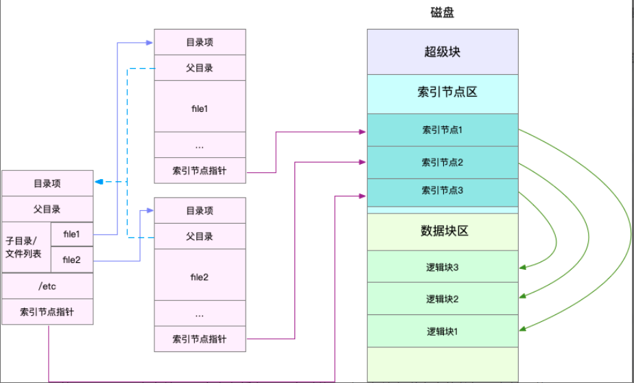
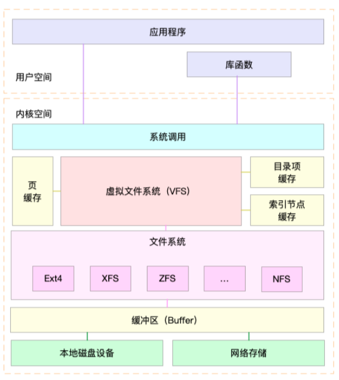
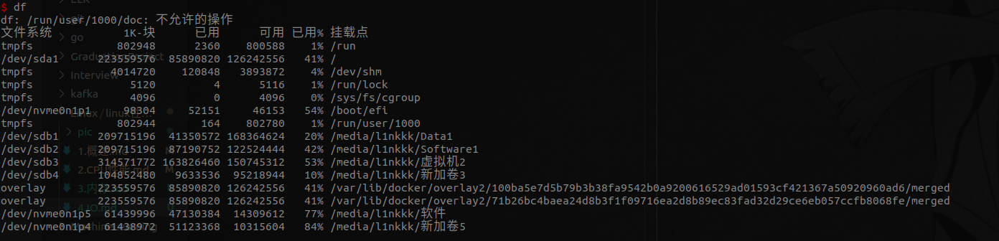
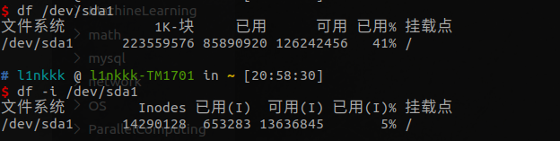
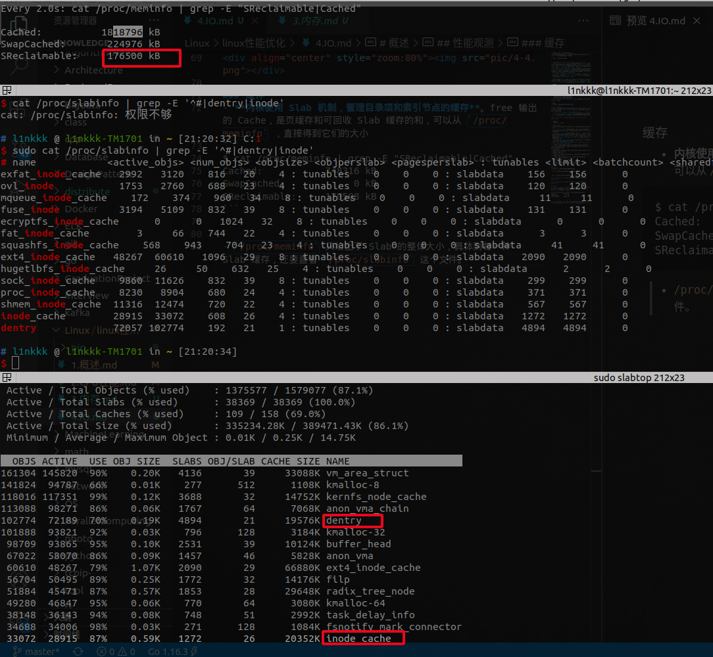
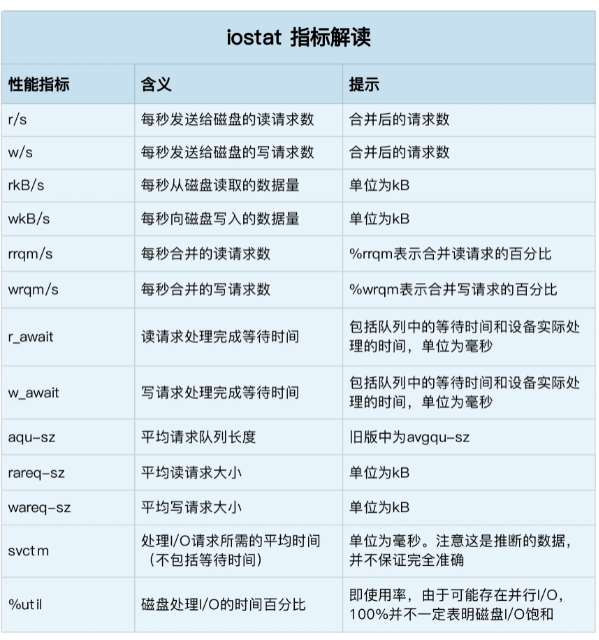
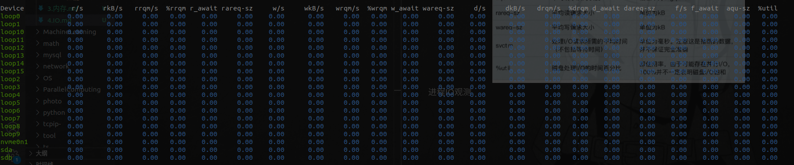
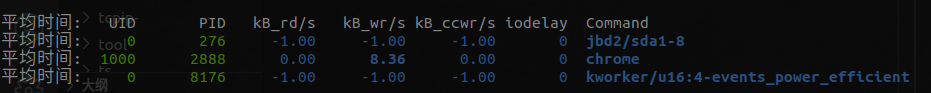
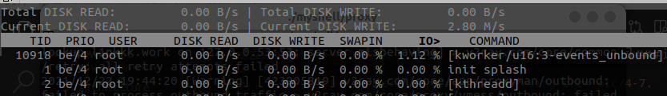

# 概述
- 磁盘：提供最基本的持久化存储能力
- 文件系统：对磁盘存储进行管理，决定数据在磁盘上的存放方式和组织，提供一个用来管理文件的树状结构。
  - **怎么读，怎么写，还得看具体的块设备其驱动程序提供的接口**。所以后面又通过 **通用块层**，来在文件系统 和 块设备硬件驱动上做抽象

- linux 一切（IO）皆文件

## 索引节点（index node）和目录项（directory entry）
- **索引节点**，简称为 inode，用来记录文件的**元数据**，比如 inode 编号、文件大小、访问权限、修改日期、**数据的位置**等。**索引节点和文件一一对应**，它跟文件内容一样，都会被持久化存储到磁盘中。所以记住，**索引节点同样占用磁盘空间**。
- **目录项**，简称为 dentry，用来记录文件的名字、索引节点指针以及与其他目录项的关联关系。多个关联的目录项，就构成了文件系统的目录结构。不过，不同于索引节点，目录项是由内核维护的一个**内存数据结构**，所以通常也被叫做**目录项缓存**。
  - **目录项和索引节点的关系是多对一**，你可以简单理解为，一个文件可以有多个别名。通过**硬链接为文件创建的别名**，就会对应不同的目录项，但是**其索引节点相同**。

- 磁盘读写的最小单位是扇区，然而扇区只有 512B 大小，每次读写这么小的单位，效率一定很低。所以文**件系统把连续的扇区组成逻辑块，每次都以逻辑块为最小单元**，来管理数据。常见的逻辑块大小为 4KB。

> 示意图

- 目录也是一个文件，存储再磁盘中（如索引节点3对应的文件，就是一个目录）
- 磁盘在执行文件系统格式化时，会被分成三个存储区域，超级块、索引节点区和数据块区
  - 超级块，存储整个文件系统的状态
  - 索引节点区，用来存储索引节点
  - 数据块区，则用来存储文件数据
- 目**录项、索引节点、逻辑块以及超级块**，构成了 Linux 文件系统的四大基本要素

> 疑问
- windows 文件系统，怎么做到兼容的

## 虚拟文件系统
- VFS：为了支持各种不同的文件系统，Linux 内核在用户进程和文件系统的中间，又引入了一个**抽象层**，也就是虚拟文件系统 VFS（Virtual File System）。
  - **VFS 定义了一组支持所有文件系统的数据结构和标准接口**
  - **用户进程和内核中的其他子系统**，只需要跟 VFS 提供的统一接口进行交互就可以了，而不需要再关心底层各种文件系统的实现细节

- 注意点：
  - Buffer 和 cache
- 是一个io设备，可以当文件来看，但不代表其有文件系统

## 文件系统分类
- 按存储位置（本地磁盘，内存，其他主机的文件系统），文件系统可以分为三类
  - 第一类是基于**磁盘**的文件系统，也就是把数据直接存储在计算机本地挂载的磁盘中。常见的 Ext4、XFS、OverlayFS 等，都是这类文件系统。
  - 第二类是基于**内存**的文件系统，也就是我们常说的虚拟文件系统。这类文件系统，不需要任何磁盘分配存储空间，但会占用内存。我们经常用到的 **/proc 文件系统**，其实就是一种最常见的虚拟文件系统。此外，**/sys 文件系统**也属于这一类，主要向用户空间导出层次化的内核对象。
  - 第三类是**网络文件系统**，也就是用来访问其他计算机数据的文件系统，比如 NFS、SMB、iSCSI 等。
- **这些文件系统，要先挂载到 VFS 目录树中的某个子目录（称为挂载点），然后才能访问其中的文件**
  - 用户通过文件系统的挂载点，来访问文件系统其管理的文件
- 无论是普通文件和块设备、还是网络套接字和管道等，它们都通过统一的 VFS 接口来访问。
- 像输入输出io应该是不归虚拟文件系统管的，但是系统调用还是一致的。
## 文件系统IO
- 文件IO的分类：缓冲与非缓冲 I/O、直接与非直接 I/O、阻塞与非阻塞 I/O、同步与异步 I/O
- 缓冲与非缓冲 I/O
  - 是否使用标准库里面的缓存，不使用的话直接从系统调用读写
- 直接与非直接 I/O
  - 是否使用操作系统的缓存，不使用的话直接从磁盘读写
- 阻塞 I/O 和非阻塞 I/O
  - 如果数据还没准备好，是否阻塞
- 同步和异步 I/O
  - 同步：用户要把数据从内核copy到用户缓冲区
  - 异步：内核copy到用户缓冲区后通知用户

## 性能观测——（容量，缓存）
### 容量
- df：查看所有挂载的文件系统容量情况

- df + 挂载点：该挂载点文件系统的容量情况

- df -i 挂载点：改挂载点文件系统的 inode 使用情况

### 缓存
- **内核使用 Slab 机制，管理目录项和索引节点的缓存**。free 输出的 Cache，是页缓存和可回收 Slab 缓存的和，可以从 `/proc/meminfo` ，直接得到它们的大小
  - `cat /proc/meminfo | grep -E "SReclaimable|Cached"`

- `/proc/meminfo` 只给出了 Slab 的整体大小，具体到每一种 Slab 缓存，还要查看 `/proc/slabinfo` 这个文件。
  - `cat /proc/slabinfo | grep -E '^#|dentry|inode'`
  - dentry 行表示目录项缓存，inode_cache 行，表示 **VFS 索引节点缓存**，其余的则是各种文件系统的索引节点缓存。

- `slabtop`：找到占用内存最多的缓存类型

# 磁盘
- 针对IO设备中的磁盘设备
## 磁盘分类
- 按介质：固态 和 机械
- 按接口：IDE（Integrated Drive Electronics）、SCSI（Small Computer System Interface） 、SAS（Serial Attached SCSI） 、SATA（Serial ATA） 、FC（Fibre Channel）

- 共同点：**磁盘实际上是作为一个块设备来管理的**
  - 引出通用块层

## 通用块层
- 功能：
  - （抽象）提供统一框架来管理这些块设备的驱动程序，向上为文件系统和应用程序，提供访问块设备的标准接口。
  - （调度机制）通用块层还会给文件系统和应用程序发来的 I/O 请求排队，并通过重新排序、请求合并等方式，提高磁盘读写的效率

### 调度机制
- Linux 内核支持四种 I/O 调度算法，分别是 NONE、NOOP、CFQ 以及 DeadLine
  - NONE，**更确切的说不是调度算法**，因为它完全不使用任何 I/O 调度器，对文件系统和应用程序的 I/O 其实**不做任何处理，常用在虚拟机**。
  - NOOP：**先入先出**的队列，只做一些最基本的请求合并，**常用于 SSD 磁盘**
  - CFQ（Completely Fair Scheduler）：也被称为完全公平调度器，是现在**很多发行版的默认 I/O 调度器**，它**为每个进程**维护了一个 I/O 调度队列，并按照**时间片**来均匀分布每个进程的 I/O 请求。
    - 注：类似CPU的调度方式。还可以为进程设置不同优先级调度。
    - 它**适用于运行大量进程的系统**，像是桌面环境、多媒体应用等
  - DeadLine：分别**为读、写请求创建了不同的 I/O 队列**，可以提高机械磁盘的吞吐量，并**确保达到最终期限（deadline）的请求被优先处理**。
    - **多用在 I/O 压力比较重的场景，比如数据库等**

## 磁盘IO层次
- 文件系统层，包括虚拟文件系统和其他各种文件系统的具体实现。它为上层的应用程序，提供标准的文件访问接口；对下会通过通用块层，来存储和管理磁盘数据
  - 注：感觉应该是为上层的系统调用才对
- 通用块层，包括块设备 I/O 队列和 I/O 调度器。它会对文件系统的 I/O 请求进行排队，再通过重新排序和请求合并，然后才要发送给下一级的设备层
  - 注：抽象和调度
- 设备层，包括存储设备和相应的驱动程序，负责最终物理设备的 I/O 操作
  - 注：负责实际操作物理设备

## 磁盘性能指标——（使用率、饱和度、IOPS、吞吐量以及响应时间）

- **使用率**，是指磁盘处理 I/O 的时间百分比。过高的使用率（比如超过 80%），通常意味着磁盘 I/O 存在性能瓶颈。
- **饱和度**，是指磁盘处理 I/O 的繁忙程度。过高的饱和度，意味着磁盘存在严重的性能瓶颈。当饱和度为 100% 时，磁盘无法接受新的 I/O 请求。
- **IOPS**（Input/Output Per Second），是指每秒的 I/O 请求数。
- **吞吐量**，是指每秒的 I/O 请求大小。
- **响应时间**，是指 I/O 请求从发出到收到响应的间隔时间。

- 注：
  - **使用率只考虑有没有 I/O，而不考虑 I/O 的大小**。换句话说，当使用率是 100% 的时候，磁盘依然有可能接受新的 I/O 请求。因为还可以有**排队的IO**，这也是饱和度考虑的范围。
  - 不要孤立的看某一项指标。应该结合 **读写比例、I/O 类型（随机还是连续）以及 I/O 的大小**，综合来分析。
  - 分场景分析：
    - （请求多，IO小）在数据库、大量小文件等这类随机读写比较多的场景中：IOPS更能反应整体性能。
    - （请求小，IO大）在多媒体等顺序读写较多的场景中：吞吐量才更能反映系统的整体性能。
- IO基准测试
  - **在为应用程序的服务器选型时，要先对磁盘的 I/O 性能进行基准测试，以便可以准确评估，磁盘性能是否可以满足应用程序的需求**。
  - 性能测试工具：fio
  - 需要根据应用的特点，来具体评估指标

### 磁盘IO观测
- iostat：提供了每个磁盘的使用率、IOPS、吞吐量等各种常见的性能指标

- 磁盘使用率：%util
- IOPS：`r/s+ w/s`
- 吞吐量：`rkB/s+wkB/s`
- 响应时间：`r_await+w_await`
- 饱和度：iostat 不能直接得到，其实没有其他简单的观测方法。
  - 方法：可以把观测到的，平均请求队列长度或者读写请求完成的等待时间，跟基准测试的结果（比如通过 fio）进行对比，综合评估磁盘的饱和情况

### 进程IO观测

> pidstat
- 用户 ID（UID）和进程 ID（PID） 。
- 每秒读取的数据大小（kB_rd/s） ，单位是 KB。
- 每秒发出的写请求数据大小（kB_wr/s） ，单位是 KB。
- 每秒取消的写请求数据大小（kB_ccwr/s） ，单位是 KB。
- 块 I/O 延迟（iodelay），包括等待同步块 I/O 和换入块 I/O 结束的时间，单位是时钟周期。

> iotop

- 前两行分别表示，进程的磁盘读写大小总数和磁盘真实的读写大小总数。因为缓存、缓冲区、I/O 合并等因素的影响，它们可能并不相等
- 剩下的部分，则是从各个角度来分别表示进程的 I/O 情况，包括线程 ID、I/O 优先级、每秒读磁盘的大小、每秒写磁盘的大小、换入和等待 I/O 的时钟百分比等