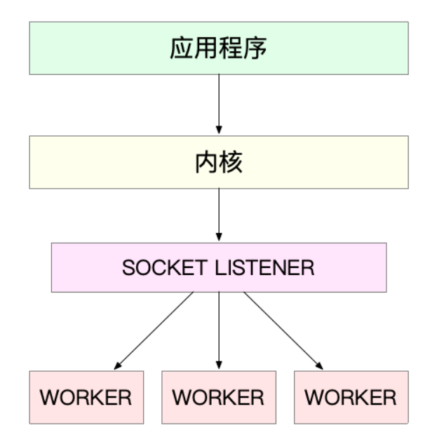
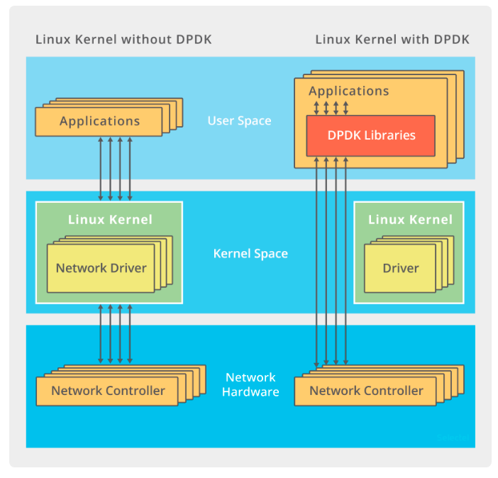

- [概述](#概述)
  - [接收与发送细节](#接收与发送细节)
- [性能指标](#性能指标)
  - [网络配置](#网络配置)
  - [套接字信息](#套接字信息)
  - [协议栈统计信息](#协议栈统计信息)
  - [网络吞吐和PPS](#网络吞吐和pps)
  - [连通性和延迟](#连通性和延迟)
- [C10K 和 C1000K 以及 C10M](#c10k-和-c1000k-以及-c10m)
  - [C10K问题](#c10k问题)
    - [工业模型优化](#工业模型优化)
  - [C1000K](#c1000k)
  - [C10M](#c10m)
  - [总结](#总结)
- [如何评估网络性能](#如何评估网络性能)
  - [各协议层的性能测试](#各协议层的性能测试)
    - [转发性能](#转发性能)
# 概述
- 网卡传输限制
  - 物理链路中并不能传输任意大小的数据包，网络接口配置的**最大传输单元（MTU）**，以太网中，MTU默认是1500。
  - 一旦网络包超过 MTU 的大小，就会在**网络层分片**
- 到了网络层，决定是交给上层的传输层还是转发

<div align="center" style="zoom:60%"></div>

## 接收与发送细节

<div align="center" style="zoom:60%"></div>

- 内核分配一个主内存地址段（**DMA缓冲区**)，网卡设备可以在DMA缓冲区中读写数据

- 接收：
  - 网卡收到网络帧后，把数据先放在 DMA缓冲区（收包队列）
  - 网卡通过硬件中断通知 中断处理程序
  - 中断处理程序会为网络帧分配**内核数据结构（sk_buff）**，并将数据帧**从DMA缓冲区（收包队列）拷贝到 sk_buff 缓冲区**中
  - 通过软中断，**通知内核**收到了新的网络帧
    - 注意是 通知内核
  - 内核协议栈（库）从缓冲区取出网络帧，通过网络协议栈，从下到上进行处理。
    - 在网络层决定转发还是向上提交
    - 再传输层中，根据 **< 源 IP、源端口、目的 IP、目的端口 > 四元组作为标识，找出对应的 Socket**，并**把数据拷贝到 Socket 的接收缓冲区中**
  - 注：DMA缓冲==>sk_buff==>socket接收缓冲区

- 发送：
  - 用户把发送的数据放在 socket缓冲区中
  - 调用系统调用（socket api），进入内核态。通过内核协议栈的层层封装，将数据放到 DMA缓冲区（发包队列）
  - socket发送缓冲区==>DMA缓冲
- 对上面的发送和接收细节，持有怀疑态度

# 性能指标

- **带宽**：表示链路的最大传输速率，单位通常为 b/s （比特 / 秒）
- **吞吐量**：表示单位时间内成功传输的数据量，单位通常为 b/s（比特 / 秒）或者 B/s（字节 / 秒）。吞吐量受带宽限制，而吞吐量 / 带宽，也就是该**网络的使用率**。
- **延时**：表示从网络请求发出后，一直到收到远端响应，所需要的时间延迟。在不同场景中，这一指标可能会有不同含义。比如，它可以表示，**建立连接需要的时间**（比如 TCP 握手延时），或**一个数据包往返所需的时间**（比如 RTT）
- **PPS**：是 Packet Per Second（包 / 秒）的缩写，表示**以网络包为单位的传输速率**。PPS 通常用来评估网络的转发能力，比如硬件交换机，通常可以达到线性转发（即 PPS 可以达到或者接近理论最大值）。而基于 Linux 服务器的转发，则容易受网络包大小的影响。    
  - 对 TCP 或者 Web 服务来说，更多会用并发连接数和每秒请求数（QPS，Query per Second）等指标，它们更能反应实际应用程序的性能
- 其他：
  - **网络的可用性**：网络能否正常通信
  - **并发连接数**：TCP 连接数量
  - **丢包率**：丢包百分比
  - **重传率**：重新传输的网络包比例

## 网络配置
- **ifconfig 或者 ip 命令**：查看网络接口的配置和状态
  - ifconfig 和 ip 分别属于软件包 net-tools 和 iproute2，iproute2 是 net-tools 的下一代。

<div align="center" style="zoom:80%"></div>
<div align="center" style="zoom:80%"></div>

- 特别关注：
  - 网络接口的状态标志（可用性）：fconfig 输出中的 `RUNNING` ，或 ip 输出中的 `LOWER_UP` ，**都表示物理网络是连通的**，即网卡已经连接到了交换机或者路由器中。如果你看不到它们，通常表示网线被拔掉了
  - MTU 的大小
  - 网络接口的 IP 地址、子网以及 MAC 地址
  - 网络收发的字节数、包数、错误数以及丢包情况，特别是 TX 和 RX 部分的 errors、dropped、overruns、carrier 以及 collisions 等指标不为 0 时，通常表示出现了网络 I/O 问题。其中：
    - `errors` 表示发生错误的数据包数，比如校验错误、帧同步错误等；
    - `dropped` 表示丢弃的数据包数，即数据包已经收到了 Ring Buffer，但因为内存不足等原因丢包；
    - `overruns` 表示超限数据包数，即网络 I/O 速度过快，导致 Ring Buffer 中的数据包来不及处理（队列满）而导致的丢包；
    - `carrier` 表示发生 carrirer 错误的数据包数，比如双工模式不匹配、物理电缆出现问题等；
    - `collisions` 表示碰撞数据包数。

## 套接字信息
- **netstat 或者 ss**：查看套接字、网络栈、网络接口以及路由表的信息
```sh

# head -n 3 表示只显示前面3行
# -l 表示只显示监听套接字
# -n 表示显示数字地址和端口(而不是名字)
# -p 表示显示进程信息
$ netstat -nlp | head -n 3
Active Internet connections (only servers)
Proto Recv-Q Send-Q Local Address           Foreign Address         State       PID/Program name
tcp        0      0 127.0.0.53:53           0.0.0.0:*               LISTEN      840/systemd-resolve

# -l 表示只显示监听套接字
# -t 表示只显示 TCP 套接字
# -n 表示显示数字地址和端口(而不是名字)
# -p 表示显示进程信息
$ ss -ltnp | head -n 3
State    Recv-Q    Send-Q        Local Address:Port        Peer Address:Port
LISTEN   0         128           127.0.0.53%lo:53               0.0.0.0:*        users:(("systemd-resolve",pid=840,fd=13))
LISTEN   0         128                 0.0.0.0:22               0.0.0.0:*        users:(("sshd",pid=1459,fd=3))
```

- **接收队列（Recv-Q）和发送队列（Send-Q）**，通常应该是 0。当你发现它们不是 0 时，说明有网络包的堆积发生。

- 对于ss的输出，套接字不同，含义不同。
  - 当套接字处于连接状态（Established）时：
    - Recv-Q 表示套接字缓冲还没有被应用程序取走的字节数（即接收队列长度）。
    - Send-Q 表示还没有被远端主机确认的字节数（即发送队列长度）。
  - 当套接字处于监听状态（Listening）时：
    - Recv-Q 表示**全连接队列**的长度。
    - Send-Q 表示全连接队列的最大长度。

- **全连接**，是指服务器收到了客户端的 ACK，完成了 TCP 三次握手，**然后就会把这个连接挪到全连接队列中**。这些全连接中的套接字，还需要被 `accept()` 系统调用取走，服务器才可以开始真正处理客户端的请求。
- 全连接队列相对应的，还有一个**半连接队列**。所谓半连接是指还没有完成 TCP 三次握手的连接，连接只进行了一半。服务器收到了客户端的 `SYN` 包后，就会把这个连接放到半连接队列中，然后再向客户端发送 `SYN+ACK` 包。


## 协议栈统计信息
- **netstat 或 ss**：查看协议栈的信息
  - ss 只显示已经连接、关闭、孤儿套接字等简要统计，
  - netstat 则提供的是更详细的网络协议栈信息。

```

$ netstat -s
...
Tcp:
    3244906 active connection openings
    23143 passive connection openings
    115732 failed connection attempts
    2964 connection resets received
    1 connections established
    13025010 segments received
    17606946 segments sent out
    44438 segments retransmitted
    42 bad segments received
    5315 resets sent
    InCsumErrors: 42
...

$ ss -s
Total: 186 (kernel 1446)
TCP:   4 (estab 1, closed 0, orphaned 0, synrecv 0, timewait 0/0), ports 0

Transport Total     IP        IPv6
*    1446      -         -
RAW    2         1         1
UDP    2         2         0
TCP    4         3         1
...
```

## 网络吞吐和PPS
- sar 增加 -n 参数就可以查看网络的统计信息，比如网络接口（DEV）、网络接口错误（EDEV）、TCP、UDP、ICMP
```sh

# 数字1表示每隔1秒输出一组数据
$ sar -n DEV 1
Linux 4.15.0-1035 (ubuntu)   01/06/19   _x86_64_  (2 CPU)

13:21:40        IFACE   rxpck/s   txpck/s    rxkB/s    txkB/s   rxcmp/s   txcmp/s  rxmcst/s   %ifutil
13:21:41         eth0     18.00     20.00      5.79      4.25      0.00      0.00      0.00      0.00
13:21:41      docker0      0.00      0.00      0.00      0.00      0.00      0.00      0.00      0.00
13:21:41           lo      0.00      0.00      0.00      0.00      0.00      0.00      0.00      0.00
```

- rxpck/s 和 txpck/s 分别是接收和发送的 PPS，单位为包 / 秒。
- rxkB/s 和 txkB/s 分别是接收和发送的吞吐量，单位是 KB/ 秒。
- rxcmp/s 和 txcmp/s 分别是接收和发送的压缩数据包数，单位是包 / 秒。
- %ifutil 是网络接口的使用率，即半双工模式下为 (rxkB/s+txkB/s)/Bandwidth，而全双工模式下为 max(rxkB/s, txkB/s)/Bandwidth

----

- 查看带宽

```
$ ethtool eth0 | grep Speed
  Speed: 1000Mb/s
```

## 连通性和延迟

```sh

# -c3表示发送三次ICMP包后停止
$ ping -c3 114.114.114.114
PING 114.114.114.114 (114.114.114.114) 56(84) bytes of data.
64 bytes from 114.114.114.114: icmp_seq=1 ttl=54 time=244 ms
64 bytes from 114.114.114.114: icmp_seq=2 ttl=47 time=244 ms
64 bytes from 114.114.114.114: icmp_seq=3 ttl=67 time=244 ms

--- 114.114.114.114 ping statistics ---
3 packets transmitted, 3 received, 0% packet loss, time 2001ms
rtt min/avg/max/mdev = 244.023/244.070/244.105/0.034 ms
```

# C10K 和 C1000K 以及 C10M

## C10K问题
- 提出时间和当时系统情：1999；32位系统，内存2GB，千兆网卡
- C10K问题：如何在单系统中支持并发 1 万的请求
- 分析：
  - **物理资源是足够的**：对 2GB 内存和千兆网卡的服务器来说，同时处理 10000 个请求，只要每个请求处理占用不到 200KB（2GB/10000）的内存和 100Kbit （1000Mbit/10000）的网络带宽就可以。
  - 瓶颈在于IO模型的问题上

- 结果：epoll的出现，还有其他一些高效率的IO模型（aio等）

### 工业模型优化
> 主进程 + 多个 worker 子进程
- 机制
  - 主进程执行 bind() + listen() 后，创建多个子进程；
  - 然后，在每个子进程中，都通过 accept() 或 epoll_wait() ，来处理相同的套接字。
- 例子：Nginx

<div align="center" style="zoom:80%"></div>

- 惊群问题：accept() 和 epoll_wait() 调用都存在。当网络 I/O 事件发生时，多个进程被同时唤醒，但实际上只有一个进程来响应这个事件，其他被唤醒的进程都会重新休眠。
  - accept() 的惊群问题，已经在 Linux 2.6 中解决了；
  - epoll 的问题，到了 Linux 4.5 ，才通过 EPOLLEXCLUSIVE 解决
- nginx解决惊群问题做法：
  - Nginx 在每个 worker 进程中，都增加一个了**全局锁（accept_mutex）**。这些 worker 进程需要首先竞争到锁，只有竞争到锁的进程，才会加入到 epoll 中，这样就确保只有一个 worker 子进程被唤醒。
  - 注：就是抢锁，抢到了才加入到本进程的epoll中，保证一次只唤醒一个worker

- 变体：也可以把epoll_wait放在主线程/进程中，每次唤醒的都是主线程，由主线程唤醒子进程进行后序请求处理。

> 监听到相同端口的多进程模型
- 机制：所有的进程都监听相同的接口，并且开启 `SO_REUSEPORT` 选项，**由内核负责将请求负载均衡到这些监听进程中去**。
  - 注意：居然还有这种操作，监听相同的端口，交给内核来负载均衡。
<div align="center" style="zoom:80%"></div>
<div align="center" style="zoom:80%"></div>

## C1000K
- 分析：
  - 需要大量资源。增加硬件性能，在如今系统上还是可以满足。
    - 每个请求需要 16KB 内存的话，那么总共就需要大约 15 GB 内存
    - 假设只有 20% 活跃连接，即使每个连接只需要 1KB/s 的吞吐量，总共也需要 1.6 Gb/s 的吞吐量。千兆网卡显然满足不了这么大的吞吐量，所以还需要配置万兆网卡，或者基于多网卡 Bonding 承载更大的吞吐量
  - 大量连接带来的中断处理，非常高的成本。
    - **深层优化以及软件硬化**。需要从应用程序到 Linux 内核、再到 CPU、内存和网络等各个层次的深度优化，特别是需要借助硬件，来**卸载那些原来通过软件处理的大量功能**

## C10M
- C10M问题：同时处理 1000 万的请求
- 分析：
  - 在C1000K的时候，软件和硬件的优化已经到头了。
  - 内核协议栈工作太繁重，路线太长。
    - 从网卡中断带来的硬中断处理程序开始，到软中断中的各层网络协议处理，最后再到应用程序，这个路径实在是太长了，就会导致网络包的处理优化，到了一定程度后，就无法更进一步了。
    - **跳过内核协议栈的冗长路径，把网络包直接送到要处理的应用程序那里去。** 两种常见的机制：**DPDK 和 XDP**

> DPDK
- DPDK：用户态网络的标准。它跳过内核协议栈，直接由用户态进程通过轮询的方式，来处理网络接收
<div align="center" style="zoom:80%"></div>

- DPDK的优化：DPDK 还通过大页、CPU 绑定、内存对齐、流水线并发等多种机制，优化网络包的处理效率

> XDP
- **XDP**（eXpress Data Path），则是 Linux 内核提供的一种高性能网络数据路径。它允许网络包，在进入内核协议栈之前，就进行处理，也可以带来更高的性能。XDP 底层跟我们之前用到的 bcc-tools 一样，都是基于 Linux 内核的 **eBPF** 机制实现的

<div align="center" style="zoom:80%"></div>

## 总结
- C10K问题：IO模型解决
- C10K==>C100K：增加系统资源
- C100K==>C1000K：需要许多软硬件优化
- C1000K==>C10M：需要用 XDP 的方式，在内核协议栈之前处理网络包；或者用 DPDK 直接跳过网络协议栈，在用户空间通过轮询的方式直接处理网络包

# 如何评估网络性能
- 重点：应该看应**用程序基于协议栈的哪一层**
  - （应用层）基于 HTTP 或者 HTTPS 的 Web 应用程序，显然属于应用层，需要我们测试 HTTP/HTTPS 的性能；
  - （传输层）而对大多数游戏服务器来说，为了支持更大的同时在线人数，通常会基于 TCP 或 UDP ，与客户端进行交互，这时就需要我们测试 TCP/UDP 的性能；
  - （网络层）当然，还有一些场景，是把 Linux 作为一个软交换机或者路由器来用的。这种情况下，你更关注网络包的处理能力（即 PPS），重点关注网络层的转发性能。

## 各协议层的性能测试
### 转发性能
- 看到第36节：套路篇：怎么评估系统的网络性能？
- 后面感觉最近用不到了，用到了再看