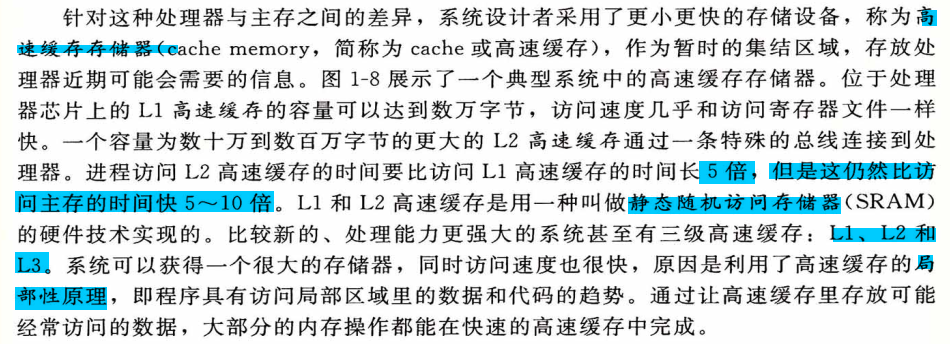

# 第一章-计算系机统漫游
## 程序编译运行过程

## 系统硬件组成
- 总线
  - 通常总线被设计成传送特定常的字节快，这个字节块就是`字`。64bit和32bit指的就是这个。

- I/O设备：
  - 每一个IO设备中都通过一个`适配器`或`控制器`与IO总线相连。
  - 控制器和适配器的区别在与`封装方式`
    - 控制器：就是IO设备本身或系统的主板上的芯片组
    - 适配器：是主板插槽上的卡

- 主存：
  - 一组动态随机存取存储器（DRAM）芯片组成 

- CPU：
  - 将`指令集架构`和`微体系结构`区分开来
    - 指令集架构：每条机器代码的效果
    - 微体系结构：描述处理器实际上是怎么实现的

## 高速缓存至关重要

## 操作系统管理硬件

### 进程

### 文件
- 文件就是字节序列，仅此而已。

## 重要主题
### Amdahl定律
- 性能最好的表现方法就是:Told/Tnew

### 并发和并行

> 线程级并发
- 一个例子

> 指令级并行
- 超标量：
  - 指处理器可以达到一个周期一条指令更快的执行速率。大多数现在的处理器都可以支持超标量操作。
- 单指令多数据并行(SIMD)：

### 计算机系统中抽象的重要性

# 第一部分 程序结构和执行
# 第二章 信息的表示和处理
## 信息存储
> 让程序更具移植性的建议

- 用int32_t和int64_t会更好
- 用signed char可能会更具移植性

- 建议使用0xFF，按一个字的大小自动补0。不建议使用0x000000FF,因为只适用在32bit

> 大端和小端在什么时候对程序有影响

- 在网络编程中需要注意
- 在阅读机器码的时候需要注意

- 在存在字节数变窄的强制类型转换的时候需要注意

## 后面的跳过没看
# 