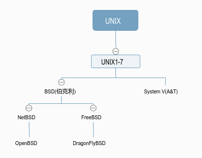
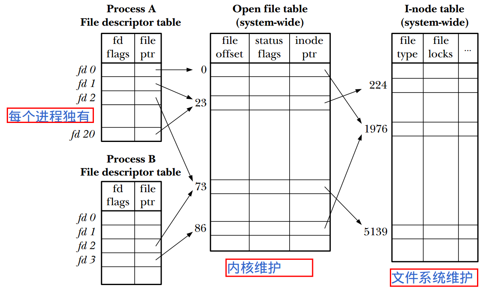
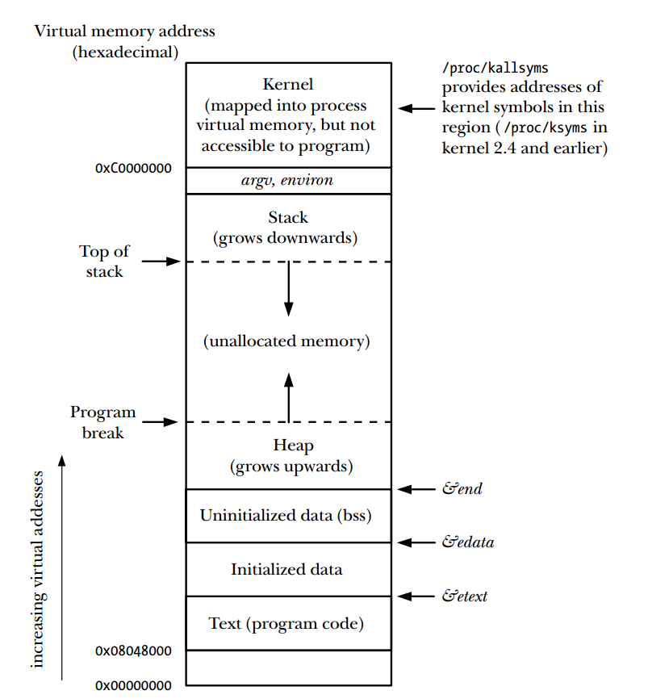
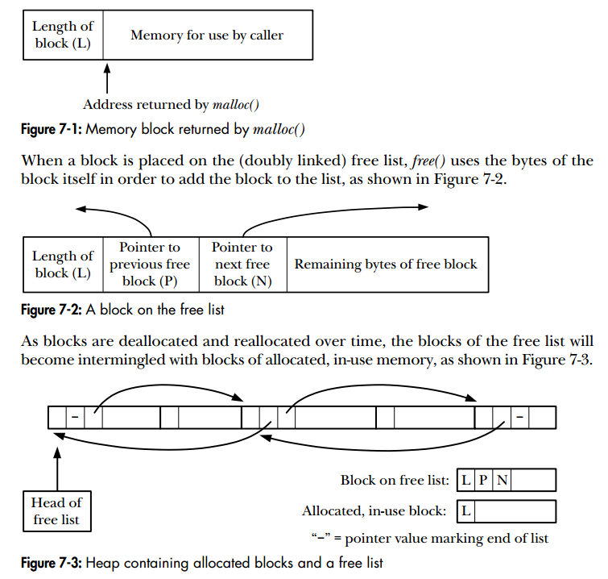
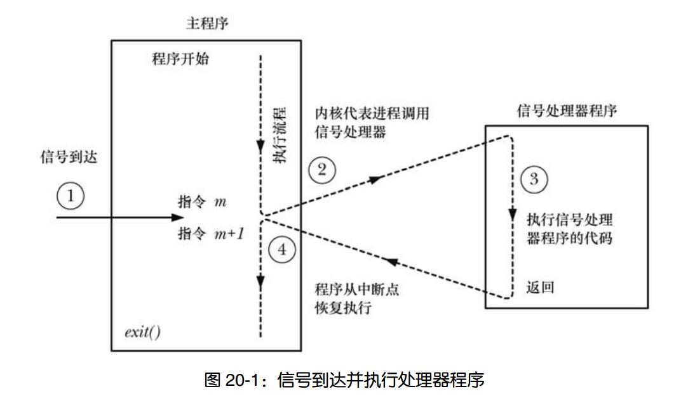
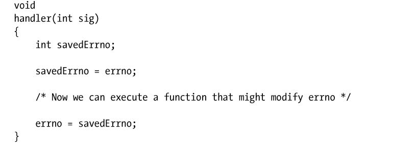
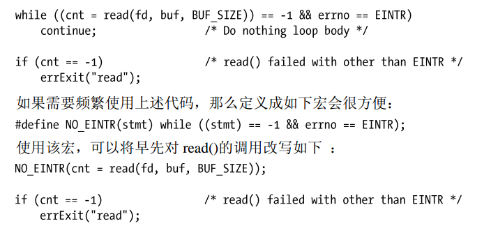
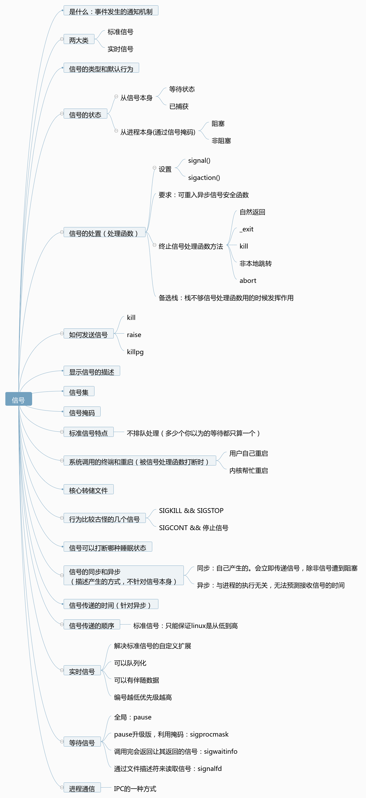
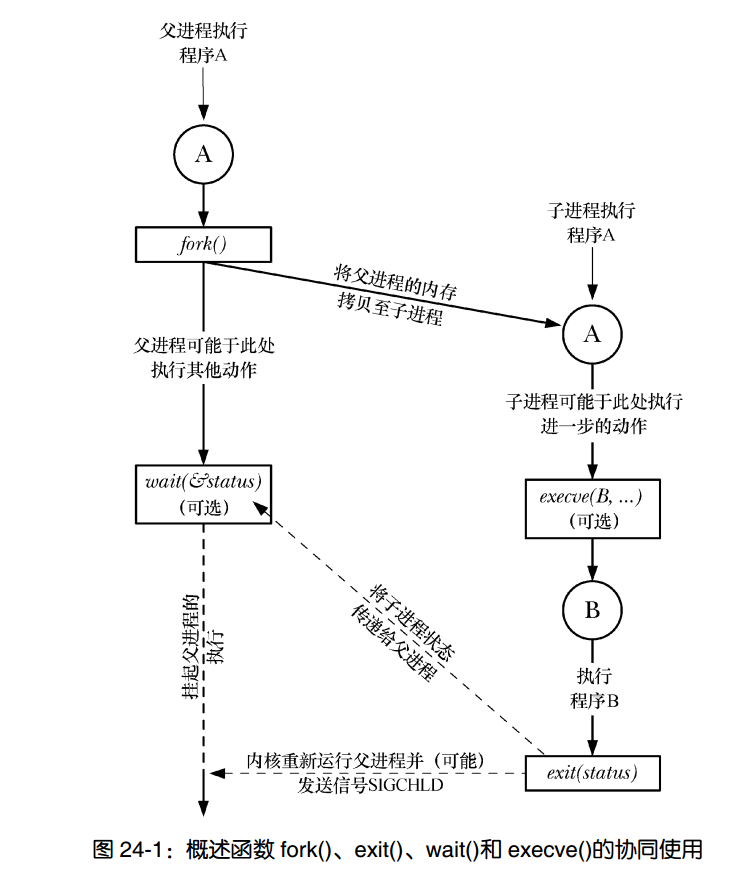

# 历史
<div align="center"></div>

# 第3章：系统编程概念
## 系统调用
- (**重点**)系统调用的过程(p34)
  - C语言函数库中的外壳函数发起
  - 修改特定寄存器值，传参和传系统调用编号
  - 外壳函数执行 int 80————处理器从**用户态切换到核心态**
  - 响应0x80中断，执行system_call()例程，例程如下
    - \#
    - 内核栈中保存寄存器值
    - 审核调用编号有效性，然后进行系统调用服务例程的检索
    - 对参数进行审核
    - \#
    - 执行服务例程，并返回结果给system_call
    - 从内核栈中恢复寄存器
    - 返回到外壳函数，切回用户态

<div align="center" style="zoom:70%"></div>

- 系统调用的消耗主要在上面过程中的`#`中间
- `调用系统调用xyz()，意味着调用外壳函数，由外壳函数去调用系统调用xyz()`

- c语言函数库(p37)
  - GNU C语言函数库（glibc）是linux上最常用的实现
  - 获取版本号的方法

## 错误处理
- 处理来自系统调用和库函数的错误
  - 方法：通过errno来诊断，可以知道是哪类错误；通过返回来判断，-1一般表示出错

- 处理错误行管库函数
  - `perror`：打印错误信息，同时可自定义加一段字符串
  - `strerror`：根据errno，返回错误信息

- 根据错误处理，可对库函数进行划分
  - 错了返回-1，而且会设置errno
  - 错了返回-1之外的值，但是还是会设置errno
  - 根本不使用errno
- enames.c.inc：与errno有关的字符串数组(p46)

## 可移植性
- 特性测试宏：(p49)
  - 为什么有：系统调用和库函数受到了各种标准(如posix1)的制约，希望各个头文件只显露符合规定标准的定义
  - 怎么用：
    - #define
    - 在编译时加入
- 系统数据类型（eg：size_t）
  - 建议：多使用，这样可移植性更强
- 打印的时候不知道打印的是int还是long如何处理（p53）
  - 解决：统一强制类型转换为long

# 第4章：文件I/O：通用的I/O模型
- 标准文件描述符(三种)
- open
  - 详解open中的flag(p61)
  - open发生错误时的errno p63
- write
- read
- creat
- close
- lseek：改变文件偏移

- 文件空洞 p68
  - 为什么要有
    - 省磁盘空间
  - 是什么
  - 函数
    - posix_fallocate:分配空间，避免write的时候因为空间耗尽而失败
    - fallocate：更高效分配空间
- ioctl：为执行 文件和设备的操作 提供一种多用途机制

# 第5章：深入探究文件IO
## 原子操作和竞争条件
- `所有的系统调用都是以原子操作方式执行的`
- 判断文件不存在后，创建文件，带来的竞争问题
  - 解决：结合O_CREAT和O_EXCL
- 向文件尾部追加数据
  - 原来:改变偏移量后加入数据
  - 解决：O_APPEND

----

- fcntl：功能很多，对一个打开的文件描述符执行一系列控制
  - 获取或修改其访问模式和状态标志

## (**重点**)文件描述符和打开文件之间的关系
- 相关数据结构(p76 了解都记录了些啥)
  - 进程级别的文件描述符表
  - 系统级的打开文件表(fcntl可以改这里的一些属性)
    - 记录了打开文件时的状态和模式（可读、可写等）
  - 文件系统的i-node表

<div align="center"></div>

- 情况说明
  - A进程中的fd1和fd20指向同一个打开文件句柄，可能是因为使用了dup、dup2或fcntl等函数
  - A和B的fd2都指向同一个打开文件句柄，可能是因为使用了fork
  - A和B的fd0和fd3，指向不同的文件句柄，但是指向了i-node表中的同一个位置，可能调用了多次open

- 如果指向了同一个打开文件句柄，那么他们共享文件的偏移量

## 复制文件描述符
- 为什么我要复制
  - 比如在`./myscript > results.log 2>&1`这种情况下，告诉让fd2指向fd1同一个打开文件句柄。如果使用了两次open，那么其文件偏移量不能同步会造成问题。
- 相关函数
  - dup
  - dup2
  - dup3:linux独有
  - fcntl

## 特定偏移量IO
- 为什么要用
  - 原子性
  - 为多线程提供用武之地，可同时对一个文件描述符进行IO操作，不会受其他线程影响。替代lseek和read（或write）
- 相关函数
  - pread
  - pwrite
- 特征：不会改变偏移量

## 分散输入和集中输出
- 为什么要用
  - 原子性输入/输出多个缓冲区
- 相关函数
  - readv
  - writev

## 特定偏移量分散输入，集中输出
- 就是前面的两个特性糅合
- 相关函数
  - preadv
  - pwritev

## 截断文件
- 作用：
  - 将文件大小设置为length参数指定的值
- 相关函数
  - truncate
  - ftruncate
## 非阻塞IO
写的很不详细，后面会介绍

## 大文件
- 为什么有
  - 对32bit系统而言，存放文件偏移量的数据类型off_t的实现为一个有符号的长整型。这将文件的大小置于2^31-1个字节（2GB）之下。所以又处理这种情况的一系列操作

## /dev/fd
- what
  - 虚拟的一个目录。`/dev/fd/n`里面只对进程可见。n为该进程打开的某个fd
  - 实际上是一个符号链接，链接到/proc/pid/fd中
  - 另外`/dev/stdin`、`/dev/stdout`、`/dev/stderr`分别链接到`/dev/fd/0-2`
- 使用
  - `fd = open("/dev/fd/1",O_WRONLY)` 等价`fd = dup(1)`
  - 很少用在程序里面，多用在shell中。如`ls | diff /dev/fd/0` oldfilelist


## 临时文件
- why
  - 有些程序需要临时文件，在运行期间使用，终止后删除
- 使用
  - 建立
    - mkstemp
    - tmpfile
  - 删除
    - unlink

# 第六章：进程
- 进程和程序的差别
- 进程号
  - getpid：得到进程号
  - getppid：得到父进程号
- 进程内存布局
  - text段、data段、bss段、stack段、heap段
<div align="center"></div>

- 虚拟内存管理
- 栈和栈帧
  - 增长方向是往低内存
- 命令行参数
  - argc和argv
  - `argv[0]`技巧：为同一个程序创建不同的硬链接，这样这个程序可以根据程序名执行不同任务
  - `/proc/PID/comline` ：存储进程的命令行参数
  - 记录文件绝对路径和文件名的两个全局变量：
    - `program_invocation_name`
    - `program_invocation_short_name`
  - argv和environ数组驻留在一块进程栈上面。从`ARG_MAX`可获取规定这块空间的大小，或者通过sysconf(_SC_ARG_MAX)获得
## 环境列表
- `char **environ`：存放环境变量的全局变量
- 设置环境变量方法
- `NAME=value program`：通过这种方式的环境变量只对该进程和其子进程有效
- 如何通过函数获取环境变量
- 如何修改环境

## 执行非局部跳转
- why
  - goto 有一个限制：不能从当前函数跳到另外的函数
  - 当深度嵌套的函数调用的时候发生错误，需要层层处理错误，在高层继续执行，保证健壮性。这样必须让每层都去处理这个错误，很麻烦。所以有了非局部跳转，本质应该就是修改栈寄存器和程序计数器（我觉得的）
- 函数
  - setjmp：确立跳转目标
  - longjmp：跳转
  - 使用的时候有许多限制和要求，建议先别使用，老老实实的
- 应该在设计和编码花点心思，避免这两个的使用。

# 内存分配
- **program break**:堆当前的内存边界
  - 最开始的时候,该边界和`未初始化数据段的末尾重合`
- 操纵 **program break**的两个系统调用。通常在代码中很少使用他们
  - brk：直接指定
  - sbrk：原有基础增加
    - sbrk(0):返回当前的program break
- malloc和free
  - 优点：
    - c标准一部分
    - 容易在多线程程序中使用
    - 接口简单
    - 允许随意释放，维护一种空心啊内存列表
  - free通常不会降低`program break`的位置，原因如下
    - 被释放的通常不是顶部
    - 减少`sbrk`的调用，减低开销
    - 一般情况下，释放了之后还要重新分配
- （p117）malloc 和 free的实现
<div align="center"></div>

- malloc和free很容易出错，也很难发现调试出
  - 可以借助malloc调试工具和库
- 其他库函数
  - calloc：分配一组相同对象的内存 
  - realloc：重新分配内存
  - 起始地址对齐
    - posix_memalign
    - memalign
  - 在栈中分配内存
    - alloca：不用也不能通过free释放
    - alloca不能作为参数传递
    - alloca和malloc相比较
      - 速度快
      - 可以自动释放

# 9.进程凭证
- 进程拥有
  - 实际用户ID（real user ID）和实际组 ID（real group ID）。
  - 有效用户 ID（ effective user ID）和有效组 ID（ effective group ID）。
  - 保存的 set-user-ID（ saved set-user-ID）和保存的 set-group-ID（ saved set-group-ID）。
  - 文件系统用户 ID（ file-system user ID）和文件系统组 ID（ file-system group ID）（ Linux专有）。
  - 辅助组 ID。
- 程序拥有
  - set-user-ID和set-group-ID

> 实际用户ID（real user ID）和实际组 ID（real group ID）。

- 一直很稳定，从父进程继承而来。（比如从shell继承而来）
- 登录shell时，从`/etc/passwd`中获取

> 有效用户 ID（ effective user ID）和有效组 ID（ effective group ID）

- 当进程尝试执行各种操作（即系统调用）时，将结合有效用户ID、有效组ID，连同辅助组ID一起来确定授予进程的权限。 
- **有效用户ID为0的进程**拥有超级用户的所有权限，这样的进程也称为`特权级进程`。
- 通常有效ID与实际ID相等，可以通过系统调用或者执行set-user-ID、set-group-ID程序来修改。

> set-user-ID和set-group-ID
- set-user-ID程序会将进程的有效用户ID设置为程序的属主用户ID，**从而获得常规情况下并不具有的权限**。
<div align="center"></div>

> saved set-user-ID和saved set-group-ID

- saved set-user-ID和saved set-group-ID意在与set-user-ID和set-group-ID程序结合使用，当执行程序时将会发生如下事件：

  - 若可执行文件的set-user-ID权限位已开启，则将进程的有效用户ID设置为可执行文件的属主，若未设置，则进程的有效用户ID将不变。
  - saved set-user-ID和saved set-group-ID的值由对应的有效ID复制而来，无论正在执行的文件是否设置了set-user-ID和set-group-ID权限位，这一复制都将进行。**有不少系统调用允许将set-user-ID程序的有效用户ID在实际用户ID和saved set-user-ID之间切换。** 这样对于与执行文件用户相关的任何权限程序都能够收放自如。

> 文件系统ID

- 在Linux系统中要进行诸如打开文件、改变文件属主、修改文件权限之类的文件系统操作时，决定其操作权限的是文件系统用户ID和组ID，而不是有效用户ID和组ID。通常文件系统用户ID和组ID的值等同于相应的有效用户或组ID（跟随其变化而变化），**只有当使用Linux特有的两个系统调用setfsuid()和setfsgid()时，** 才会制造出文件系统ID与相应有效ID的不同。 
- **从严格意义上讲，保留文件系统ID特性已无必要。**

> 辅助组ID

- 辅助组ID用于标识进程所属的若干附加的组，新进程从其父进程处继承这些ID，登录shell从系统组文件中获取其辅助的组ID。
- 将这些ID与有效ID以及文件系统ID相结合就能决定对文件、System V IPC对象和其他系统资源的访问权限。

## 获取和修改进程凭证
- 可以利用Linux系统特有的proc/PID/status文件，通过对其中Uid、Gid等信息的检查来获取任何进程的凭证。
- 其他系统调用。见p140

# 10.时间
- 软件时钟：事件相关的各种系统调用的精度受限于系统**软件时钟**（software clock）的分辨率，其度量单位称为**jiffiles**，是定义在内核源码中的常量，也是CPU分配进程时间的单位。
- 进程时间：进程创建后使用的CPU时间数量，内核把CPU时间分为两部分
  - **用户CPU时间**：是在用户模式下执行所花费的时间数量，对于进程来说是它已经得到的CPU时间；
  - **系统CPU时间**：是在内核模式中执行所花费的时间数量，是内核用于执行系统调用或代表程序执行其他任务的时间； 
  - 在执行shell程序时加上time命令，将获得这两个部分的时间：
  ```
  $ time ./myprog 
  real 0m4.84s
  user 0m1.030s 
  sys 0m3.43s
  ```

# 11.系统限制和选项（不是重点）
- 但凡 UNIX 实现，无不对各种系统特性和资源加以限制，并提供（或者选择不提供）由各种标准所定义的选项。
- 系统的限制和选项硬编码到程序中，会破坏程序的可移植性。
- 所以应该是动态获取限制值，做到可移植

## 系统限制
- SUSv3 要求，针对其所规范的每个限制，所有实现都必须支持一个最小值。其命名则冠以字符串 **_POSIX_** ，而且（通常）还包含字符串_MAX，因此，常量命名形如 **_POSIX_XXX_MAX** 。
  - 如果用这个值作为我们程序的限制，那么会损失特定的性能。通常更为可取的方法是使用<limits.h>文件、 sysconf()或 pathconf()。


- 有三种情况
  - 运行时恒定不变：通过limit.h
  - 路径名变量值：可以使用 pathconf()或 fpathconf()来获取该值。
    - eg:NAME_MAX 限制是路径名变量值的例子之一。
  - 运行时可增加量：通过调用 sysconf()
    - 运行时可增加值的例子之一是 NGROUPS_MAX， 该限制定义了一进程可同时从属的辅助组ID的最大数量
- 从 shell 中获取限制和选项： getconf


## 系统选项 
- 除了对各种系统资源的限制加以规范外， SUSv3 还规定了 UNIX 实现可支持的各种选项。这包括对诸如实时信号、 POSIX 共享内存、任务控制以及 POSIX 线程之类功能的支持。
- 如何获取
  - 通过在<unistd.h>文件中定义相应常量，实现能够在编译时通告其对特定 SUSv3 选项的支持。


# 12.系统和进程信息
- 为了提供更为简便的方法来访问内核信息，许多现代UNIX实现都提供了一个 **/proc虚拟文件系统** ，其中包含了用于展示各类内核信息的文件，并允许进程通过常规文件I/O系统调用来方便地读取，甚至修改、之所以将/proc文件系统称为虚拟，是因为**其包含的文件和子目录并未存储于磁盘上，而是由内核在进程访问此类信息时动态地创建而成**。

# 13.文件I/O缓冲
- read()和 write()系统调用在操作磁盘文件时**不会直接发起磁盘访问**，而是仅仅**在用户空间缓冲区与内核缓冲区高速缓存（ kernel buffer cache）之间复制数据**。例如：
```c
write(fd,"abc",3);
```
- write()随即返回。在后续的某个时刻内核会将其缓冲区中的数据写入（刷新至）磁盘，因此可以说系统调用与磁盘操作并不同步。如果在此期间另一进程试图读取文件的这几个字节，内核将自动从缓冲区高速缓存中提供这些数据，而不是从文件中（读取过期的内容）。
- read也是一样，会先从文件中预读一些到高速缓冲区中


# 20.信号：基本概念
## 概念和概述
- **什么是信号**：信号是事件发生时对进程的通知机制，有时也称为软件中断（不是和硬中断对应的软件中断意思），大多数情况下无法预测精确时间（与硬件中断的区别）。引发内核为进程产生信号的各类事件如下：
  - 硬件发生异常：比如执行了异常的机器语言指令、引用了无法访问的内存区域；
  - 终端特殊字符：用户键入了能够产生信号的终端特殊字符，比如Control-C、Control-Z等；
  - 发生了软件事件：如针对文件描述符的输出变为有效、调整了终端窗口大小、定时器到期、进程执行的CPU时间超限、某个子进程退出；

- **信号的编码定义**：针对每个信号都定义了一个唯一的整数，`<signal.h>`以SIGxxxx形式的符号名对这些整数做了定义。

- **信号的两大类**
  - 用于内核向进程通知事件，构成所谓的传统或者标准信号，Linux中标准信息范围为1-31；
  - 由实时信号构成；

- **信号的状态**：
  - 在产生和到达期间，信号处于**等待（pending）状态**。
  - 调用信号处理器程序以响应传递来的信号，则称之为信号**已处理（handled），或者已捕获（caught）。**
- 信号到达后进程视具体信号执行如下默认操作：
  - 忽略信息；
  - 终止进程；
  - 产生核心转储文件，同时进程终止；
  - 暂停进程执行；
  - 恢复进程执行；

- 给信号指定处理方式
  - 默认行为
  - 忽略
  - 自定义


- 细节  
  - 无法将信号处置设置为终止进程或者转储核心（除非这是对信号的默认处置）。效果最为近似的是为信号安装一个处理器程序，并于其中调用 exit()或者 abort()。**abort()** 函数为进程产生一个 SIGABRT 信号，该信号将引发进程转储核心文件并终止。
- 传统信号p323

- **改变信号的处置**：signal()(p329)和sigaction()(p345)
  - 推荐使用**sigaction()**

- **发送信号**：kill()
  - 多种发送方式，一对一，一对多
  - 可以发送多种信号
  - 还可以用来检查进程是否存在

- 信号处理函数调用过程：
  - 调用信号处理器程序，可能会随时打断主程序流程；内核代表进程来调用处理器程序，当处理器返回时，主程序会在处理器打断的位置恢复执行。
<div align="center"></div>

- 发送信号的其他方式：raise和killpg
  - raise：像自身发送信号。和kill(getpid(),sig)等同。支持线程的系统会将raise实现为pthread_kill(pthread_self(),sig)
  - killpg：向进程组发送信号

- 显示信号描述
  - 为什么有：每个信号都有一串与之相关的可打印说明。
  - 详见p336


- **信号集**
  - 为什么有：许多信号相关的系统调用都需要能表示一组不同的信号
  - 系统数据类型： `sigset_t`
  - 相关函数
    - sigemptyset()：(空集)初始化一个未包含任何成员的信号集
    - sigfillset()：（全集）初始化一个信号集，使其包含所有信号
    - 添加： sigaddset()
    - 删除： sigdelset()
    - 判断是否是成员：sigismember()
    - 交集：sigandset()
    - 并集：sigorset()
    - 是否为空：sigemptyset

- **信号掩码**：阻塞
  - 是什么：内核会为每个进程维护一个信号掩码，即一组信号，并将阻塞其针对该进程的传递。
  - 作用：如果将遭阻塞的信号发送给某进程，那么对该信号的传递将延后，直至从进程信号掩码中移除该信号，从而解除阻塞为止。
  - sigprocmask：获取，添加和删除信号掩码

- 等待信号集
  - 是什么：如果某进程接受了一个该进程正在阻塞的信号，那么会将该信号填加到进程的等待信号
集中。
  - 注意：未表明其发生的次数，所以如果同一个信号在阻塞状态下产生多次，那么会将该信号记录在等待信号集中，并在稍后仅传递一次。
  - sigpending:获取等待信号集

- 等待信号：pause()
  - 暂停进程的执行，直到处理器函数中断该调用为止

- 总结：
  - 信号是发生某种事件的通知机制，可以由内核、另一进程或者进程自身发送给进程，存在一系列的标准信号类型，每种都有唯一的编号和目的。信号传递通常是异步行为，意味着信号中断进程执行的位置是不可预测的。

# 21.信号：信号处理器函数
- 一般而言，将信号处理器函数设计得越简单越好

## 可重入和异步信号安全函数
- 可重入：如果同一个进程的多条线程可以同时安全地调用某一函数，那么该函数就是可重入的。
- 不可重入
  - 更新全局变量或静态数据结构的函数可能是不可重入的。比如malloc函数族
  - 还有一些函数库之所以不可重入，是因为它们使用了经静态分配的内存来返回信息。（会把前一次的覆盖）如crypt()
  - 如果信号处理器函数和主程序都要更新由程序员自定义的全局性数据结构，那么对于主程序而言，这种信号处理器函数就是不可重入的。

----

- 异步信号安全函数：如果信号处理器函数和主程序都要更新由程序员自定义的全局性数据结构，那么对于主程序而言，这种信号处理器函数就是不可重入的。
  - p352列出了规定中的有哪些
  - 注：printf不是此类函数，所以在信号处理函数中使用要避免
- errno引发的问题
  - 问题：可能会覆盖之前由主程序调用函数时所设置的 errno 值

<div align="center" style="zoom:80%"></div>

## 全局变量和 sig_atomic_t 数据类型
- 有时候主程序和信号处理程序需要共享一个全局变量，要注意以下几点：
  - 使用volatile：防止编译器将其优化到寄存器中
  - 使用 sig_atomic_t：保证读写操作的原子性
    - 注意：C 语言的递增（++）和递减（--）操作符并不在 sig_atomic_t 所提供的保障范围之内

## 终止信号处理器函数的方法
- return
- _exit，注意不是exit(),因为这个函数会在调用_exit之前多了一些操作，不是异步信号安全函数。
- 使用kill发送信号杀死进程
- 执行非本地跳转
- abort函数，终止进程，并产生核心转储
  - 这个函数主要是通过产生SIGABRT信号。这个信号无论是被设置为阻塞或忽略，都不影响。

## 备选栈中处理信号
- 为什么有`备选栈`
  - 信号处理函数会用进程栈的资源，如果进程栈满了怎么办？？？答案是：为进程产生SIGSEGV信号。但是已经栈满了，这个信号当然也没法处理，这个时候就需要我们的**备选栈**了
- sigaltstack()
  - 作用：
    - 告知已创建的备选栈
    - 创建备选栈

## SA_SIGINFO标识
- 使sigaction()创建处理器函数时，可以让处理器函数拥有更多信息。主要多了两个参数：**siginfo_t**和**ucontext**
- siginfo_t
  - 详见p361
- ucontext
  - 该结构提供了所谓的用户上下文信息，用于描述调用信号处理器函数前的进程状态，其中包括上一个进程信号掩码以及寄存器的保存值，例如程序计数器（cp）和栈指针寄存器（sp）。


## 系统调用的中断和重启
- 背景：当系统调用遭到阻塞时，之前创建了处理器函数的信号传递了过来，随即引发对处理器函数的调用。**信号处理器返回后又会发生什么？** 默认情况下，系统调用失败，并将 errno 置为 EINTR。
这是一种有用的特性。
  - **对于某些 Linux 系统调用，未处理的停止信号会产生 EINTR 错误**：在 Linux 上，即使没有信号处理器函数，某些阻塞的系统调用也会产生 EINTR 错误。如果系统调用遭到阻塞，并且进程因信号（SIGSTOP、 SIGTSTP、 SIGTTIN 或 SIGTTOU）而停止，之后又因收到 SIGCONT 信号而恢复执行时，就会发生这种情况。

- 重启的方法
  - 用户进程自己控制重启。
    - 引发的问题：繁琐
  <div align="center"></div>

  - 可以调用指定了 SA_RESTART 标志的 sigaction()来创建信号处理器函数，从而令**内核代表进程**自动重启系统调用
    - 问题：并不是对所有的系统调用都可以通过指定该标识重启。见p366

- siginterrupt：修改信号的SA_RESTART设置

# 22.信号：高级特性
## 核心转储文件
- 特定信号（比如Control-\产生的SIGQUIT）会引发进程创建一个核心转储文件，并终止运行。
- 核心转储文件就是当进程终止时，内存映像。
- 可以借助一些工具，即使不用退出也可以产生核心转储文件
- 不产生核心转储文件的情况：见p371
- 可以给核心转储文件命名：见p372

## 一些特殊情况的信号
- SIGKILL和SIGSTOP
  - 功能：一个是终止进程，一个是停止进程
  - 特点：
    - 行为无法被改变
    - 信号不能被阻塞
  - 意义：总是可以利用这些信号来杀死或者停止一个失控进程
- SIGCONT
  - 功能：恢复停止的进程
  - 特点：如果一个进程处于停止状态，那么一个 SIGCONT 信号的到来总是会促使其恢复运行，即使该进程正在阻塞或者忽略 SIGCONT 信号
  - 意义：停止的进程收到这个信号都会开始运行
  - 注：如果处于停止状态的进程正在阻塞 SIGCONT 信号（添加到信号掩码），并且已经为 SIGCONT 信号建立了处理器函数，那么在进程恢复运行后，只有当取消了对 SIGCONT的阻塞时，进程才会去调用相应的处理器函数。（也就是说自己定的处理器函数还是不会运行）
- 应该遵循的惯例（非硬性要求）：
  - 如果程序在执行时发现，已将对由终端产生信号的处置置为了 SIG_IGN（也就是怎么按都发不了信号过去），那么程序通常不应试图去改变信号处置。
  - 为什么：在34.7.3节解释

## 休眠状态
- TASK_INTERRUPTIBLE
  - 进程正在等待某一事件。例如，正在等待终端输入，等待数据写入当前的空管道，或者等待 System V 信号量值的增加。 STAT（进程状态）字段标记为字母 S。
- TASK_UNINTERRUPTIBLE
  - 进程正在等待某些特定类型的事件，比如磁盘 I/O 的完成。 STAT（进程状态）字段标记为字母 D。
  - 状态难以捕捉：TASK_UNINTERRUPTIBLE 状态的时间通常转瞬即逝，所以系统在进程脱离该状态时传递信号的现象也不易于被发现。
  - SIGKILL唯一无效的情况： 进程处于TASK_UNINTERRUPTIBLE休眠，将不会终止挂起进程
- TASK_KILLABLE（Linux引入，弥补TASK_UNINTERRUPTIBLE缺陷）
  - 该状态类似于 TASK_UNINTERRUPTIBLE，但是会在进程收到一个致命信号（即一个杀死进程的信号）时将其唤醒。

## 信号的同步生成和异步生成
- 异步：发生和进程无关。无法预测传递信号的时间。
- 同步：发生是进程执行造成的。立即传递的（除非阻塞），可以预测。
- 同步和异步是对信号产生方式的描述，不针对信号本身

## 信号传递的实际和顺序
- 时机：该进程正在执行，且发生由内核态到用户态的下一次切换时，如
  - 时间片的开始处
  - 系统调用完成时
- 接触多个信号的阻塞的时候，哪个先调用？
  - Linux：信号值小的

## 实时信号 
- 实时信号为什么有
  - 标准信号的不足
- 优势（相比标准信号）
  - 可扩展
  - 队列化
  - 信号可以有伴随数据
  - 编号越小，优先级越高（优势在于已经说好了）

- 如何发送和接收实时信号
- 如何处理实时信号

## 等待信号
- pause：全局
- sigsuspend：pause升级
- sigwaitinfo：返回可知哪个信号让它返回的
- signalfd：通过文件描述符获取信号，read默认阻塞

# 关于信号的总结
<div align="center"></div>


# 23.定时器与休眠
## 间隔定时器
- 相关系统调用
  - 以下这两个系统调用已废止（susv4）了
    - settimer：设置定时器，如果没有定时器就称其为屏蔽状态。可以设置一次性的，也可以是循环使用的
    - gettimer：获取定时器设置
  - alarm：创建一次性的实时定时器。和settimer共享同一实时定时器，也就是说调用后这两个控制的是同一个实时定时器。

## 定时器的调度和精度
- 关于调度：定时器到期时的，系统的调度总是会有一点点误差。但这个误差不会随着多次定时器到期而误差累加
- 精度：传统上和软件时钟jiffy有关。但是现在出现了**高分辨率定时器**，受限与jiffy不再成立

## 作用1：为阻塞设置超时
- 为某个阻塞系统调用设置其处于阻塞状态的时间上限，见p402

```cpp
void func(int sig){
    cout << "just a test,hhahahaha" << endl;
}

void blockTimeOut(){
    constexpr int bufsize = 100;
    char buf[bufsize]{0};
    int readrtn;
    int tempEno;
    // 1.创建SIGALRM信号处理函数,并排除SA_RESTART标识
    {
        struct sigaction sa;
        sa.sa_flags = 0; // 确保系统调用不会重新启动
        sa.sa_handler = func;
        sigaction(SIGALRM, &sa, nullptr);
    }

    // 2.设置定时器
    setitimer(ITIMER_REAL,new itimerval{{0,0},{2,0}}, nullptr);

    // 3. io操作
    readrtn = read(STDIN_FILENO,buf,bufsize);
    tempEno = errno;
    // 4.屏蔽定时器
    alarm(0);
    errno = tempEno;

    // 判断是哪种原因退出
    if(readrtn == -1){
        if(errno == EINTR)
            cout << "readTime out" << endl;
        else
            errExit("read");
    }else{
        cout << "Read successful:" << buf << endl;
    }
    exit(EXIT_SUCCESS);
}
```

## 休眠
- sleep
  - 较粗粒度休眠，linux底层实现是调用nanosleep。有些系统会将其用定时器实现（如SIGALRM信号和alarm）
- nanosleep
  - 细粒度休眠
  - 保证不是使用信号来实现的

## POSIX时钟
- POSIX时钟（原定义于 POSIX.1b）所提供的时钟访问 API 可以支持纳秒级的时间精度
- 获取时钟的值：clock_gettime
- 设置时钟的值：clock_settime
- 获取特定线程或进程的时钟
  -  clock_getcpuclockid
  -  pthread_getcpuclockid
### **高分辨率休眠**（推荐）
- 用到再详看，功能丰富而且杂
- 相关API
  - 创建定时器： timer_create()
  - 配备和解除定时器： timer_settime()
  - 获取定时器的当前值： timer_gettime()
  - 删除定时器： timer_delete()


# 24.进程的创建
## 4个重要系统调用
- fork()：允许一个进程创建一个新进程，新的子进程几近于对父进程的翻版，子进程将获得父进程的栈、数据段、堆和执行文本段的拷贝；
- exit(status)：终止一个进程，将进程占用的资源交还给内核，其参数status为一个整型变量表示进程的退出状态，父进程可以用系统调用wait()来获取该状态；
- wait(&status)：如果子进程尚未调用exit()终止，那么wait()会挂起父进程直至子进程终止，子进程的终止状态会通过status参数返回；
- execve(pathname,argv,envp)：加载一个新程序到当前进程的内存，这将丢弃现存的程序文本段，并为新程序重新创建栈、数据段以及堆；

<div align="center" style="zoom:80%"></div>

- 执行fork()时，子进程会获得父进程所有的文件描述符的副本。对于shell来说，shell创建子进程后会调用wait()来暂停运行，并等待子进程退出，只有当执行命令的子进程退出后，shell才会打印自己的提示符。

- fork的优化
  - 代码段共享
  - 数据段、堆段和栈段中的各页**写时复制**

# 25.进程的终止
- exit
  - 调用退出处理函数（通过atexit()和on_exit()注册的函数），其执行顺序与注册顺序相反；
  - 刷新stdio流缓冲区；
  - 使用status提供的值执行_exit()系统调用；
> exit和return
- 对于return返回
  - 程序的另一种终止方法是从main()函数中返回，或者执行到main()函数的结尾处。执行return n等同于执行对exit(n)的调用，因为main()的运行时函数会将main()的返回值作为exit()的参数。

------

- 不会调用退出处理函数的情况
  - 如果程序直接调用_exit()或因信号而异常终止，则不会调用退出处理程序。

- 通过fork()创建的子进程会继承父进程注册的退出处理函数，而进程调用exec()时，会移除所有已注册的退出处理函数。
- fork会继承父进程缓冲区 

> exit和_exit使用规范
- 在创建子进程的应用中典型的情况下仅有一个进程（一般为父进程）应通过调用exit()终止，而其他进程应通过调用_exit()终止，从而确保只有一个进程调用退出处理程序并刷新stdio缓冲区。

