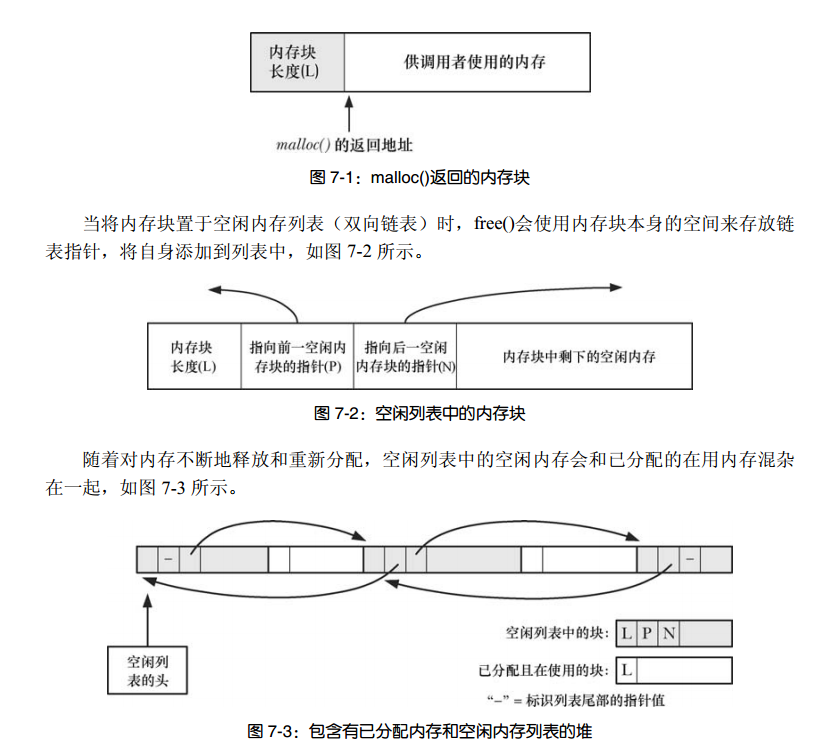
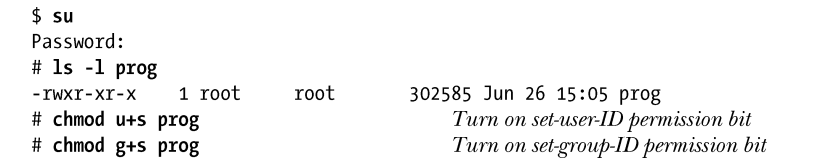
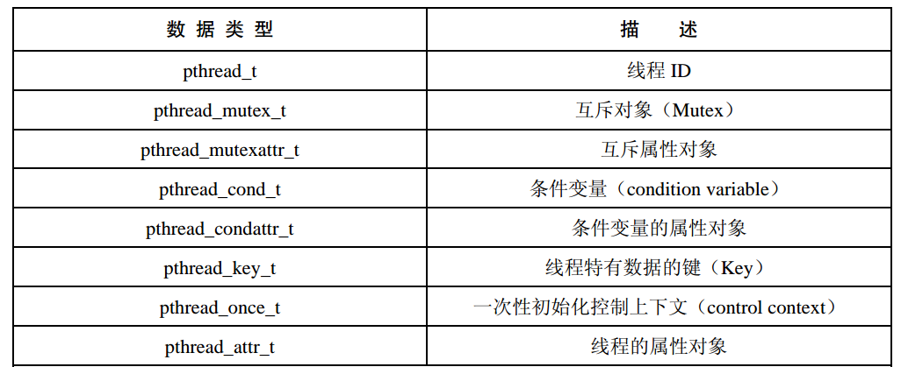

- [历史](#%E5%8E%86%E5%8F%B2)
  - [标准化](#%E6%A0%87%E5%87%86%E5%8C%96)
- [第3章：系统编程概念](#%E7%AC%AC3%E7%AB%A0%E7%B3%BB%E7%BB%9F%E7%BC%96%E7%A8%8B%E6%A6%82%E5%BF%B5)
  - [系统调用](#%E7%B3%BB%E7%BB%9F%E8%B0%83%E7%94%A8)
  - [错误处理](#%E9%94%99%E8%AF%AF%E5%A4%84%E7%90%86)
  - [可移植性](#%E5%8F%AF%E7%A7%BB%E6%A4%8D%E6%80%A7)
- [第4章：文件I/O：通用的I/O模型](#%E7%AC%AC4%E7%AB%A0%E6%96%87%E4%BB%B6IO%E9%80%9A%E7%94%A8%E7%9A%84IO%E6%A8%A1%E5%9E%8B)
- [第5章：深入探究文件IO](#%E7%AC%AC5%E7%AB%A0%E6%B7%B1%E5%85%A5%E6%8E%A2%E7%A9%B6%E6%96%87%E4%BB%B6IO)
  - [原子操作和竞争条件](#%E5%8E%9F%E5%AD%90%E6%93%8D%E4%BD%9C%E5%92%8C%E7%AB%9E%E4%BA%89%E6%9D%A1%E4%BB%B6)
  - [(**重点**)文件描述符和打开文件之间的关系](#%E9%87%8D%E7%82%B9%E6%96%87%E4%BB%B6%E6%8F%8F%E8%BF%B0%E7%AC%A6%E5%92%8C%E6%89%93%E5%BC%80%E6%96%87%E4%BB%B6%E4%B9%8B%E9%97%B4%E7%9A%84%E5%85%B3%E7%B3%BB)
  - [复制文件描述符](#%E5%A4%8D%E5%88%B6%E6%96%87%E4%BB%B6%E6%8F%8F%E8%BF%B0%E7%AC%A6)
  - [特定偏移量IO](#%E7%89%B9%E5%AE%9A%E5%81%8F%E7%A7%BB%E9%87%8FIO)
  - [分散输入和集中输出](#%E5%88%86%E6%95%A3%E8%BE%93%E5%85%A5%E5%92%8C%E9%9B%86%E4%B8%AD%E8%BE%93%E5%87%BA)
  - [特定偏移量分散输入，集中输出](#%E7%89%B9%E5%AE%9A%E5%81%8F%E7%A7%BB%E9%87%8F%E5%88%86%E6%95%A3%E8%BE%93%E5%85%A5%E9%9B%86%E4%B8%AD%E8%BE%93%E5%87%BA)
  - [截断文件](#%E6%88%AA%E6%96%AD%E6%96%87%E4%BB%B6)
  - [非阻塞IO](#%E9%9D%9E%E9%98%BB%E5%A1%9EIO)
  - [大文件](#%E5%A4%A7%E6%96%87%E4%BB%B6)
  - [/dev/fd](#devfd)
  - [临时文件](#%E4%B8%B4%E6%97%B6%E6%96%87%E4%BB%B6)
- [第六章：进程](#%E7%AC%AC%E5%85%AD%E7%AB%A0%E8%BF%9B%E7%A8%8B)
  - [虚拟内存管理](#%E8%99%9A%E6%8B%9F%E5%86%85%E5%AD%98%E7%AE%A1%E7%90%86)
  - [命令行参数](#%E5%91%BD%E4%BB%A4%E8%A1%8C%E5%8F%82%E6%95%B0)
  - [环境列表](#%E7%8E%AF%E5%A2%83%E5%88%97%E8%A1%A8)
  - [执行非局部跳转](#%E6%89%A7%E8%A1%8C%E9%9D%9E%E5%B1%80%E9%83%A8%E8%B7%B3%E8%BD%AC)
- [内存分配](#%E5%86%85%E5%AD%98%E5%88%86%E9%85%8D)
- [8.用户和组](#8%E7%94%A8%E6%88%B7%E5%92%8C%E7%BB%84)
- [9.进程凭证](#9%E8%BF%9B%E7%A8%8B%E5%87%AD%E8%AF%81)
  - [获取和修改进程凭证](#%E8%8E%B7%E5%8F%96%E5%92%8C%E4%BF%AE%E6%94%B9%E8%BF%9B%E7%A8%8B%E5%87%AD%E8%AF%81)
- [10.时间](#10%E6%97%B6%E9%97%B4)
- [11.系统限制和选项（不是重点）](#11%E7%B3%BB%E7%BB%9F%E9%99%90%E5%88%B6%E5%92%8C%E9%80%89%E9%A1%B9%E4%B8%8D%E6%98%AF%E9%87%8D%E7%82%B9)
  - [系统限制](#%E7%B3%BB%E7%BB%9F%E9%99%90%E5%88%B6)
  - [系统选项](#%E7%B3%BB%E7%BB%9F%E9%80%89%E9%A1%B9)
- [12.系统和进程信息](#12%E7%B3%BB%E7%BB%9F%E5%92%8C%E8%BF%9B%E7%A8%8B%E4%BF%A1%E6%81%AF)
- [13.文件I/O缓冲](#13%E6%96%87%E4%BB%B6IO%E7%BC%93%E5%86%B2)
  - [文件IO的内核缓冲](#%E6%96%87%E4%BB%B6IO%E7%9A%84%E5%86%85%E6%A0%B8%E7%BC%93%E5%86%B2)
  - [stdio缓冲](#stdio%E7%BC%93%E5%86%B2)
  - [控制内核缓冲](#%E6%8E%A7%E5%88%B6%E5%86%85%E6%A0%B8%E7%BC%93%E5%86%B2)
- [20.信号：基本概念](#20%E4%BF%A1%E5%8F%B7%E5%9F%BA%E6%9C%AC%E6%A6%82%E5%BF%B5)
  - [概念和概述](#%E6%A6%82%E5%BF%B5%E5%92%8C%E6%A6%82%E8%BF%B0)
- [21.信号：信号处理器函数](#21%E4%BF%A1%E5%8F%B7%E4%BF%A1%E5%8F%B7%E5%A4%84%E7%90%86%E5%99%A8%E5%87%BD%E6%95%B0)
  - [可重入和异步信号安全函数](#%E5%8F%AF%E9%87%8D%E5%85%A5%E5%92%8C%E5%BC%82%E6%AD%A5%E4%BF%A1%E5%8F%B7%E5%AE%89%E5%85%A8%E5%87%BD%E6%95%B0)
  - [全局变量和 sig_atomic_t 数据类型](#%E5%85%A8%E5%B1%80%E5%8F%98%E9%87%8F%E5%92%8C-sigatomict-%E6%95%B0%E6%8D%AE%E7%B1%BB%E5%9E%8B)
  - [终止信号处理器函数的方法](#%E7%BB%88%E6%AD%A2%E4%BF%A1%E5%8F%B7%E5%A4%84%E7%90%86%E5%99%A8%E5%87%BD%E6%95%B0%E7%9A%84%E6%96%B9%E6%B3%95)
  - [备选栈中处理信号](#%E5%A4%87%E9%80%89%E6%A0%88%E4%B8%AD%E5%A4%84%E7%90%86%E4%BF%A1%E5%8F%B7)
  - [SA_SIGINFO标识](#SASIGINFO%E6%A0%87%E8%AF%86)
  - [系统调用的中断和重启](#%E7%B3%BB%E7%BB%9F%E8%B0%83%E7%94%A8%E7%9A%84%E4%B8%AD%E6%96%AD%E5%92%8C%E9%87%8D%E5%90%AF)
- [22.信号：高级特性](#22%E4%BF%A1%E5%8F%B7%E9%AB%98%E7%BA%A7%E7%89%B9%E6%80%A7)
  - [核心转储文件](#%E6%A0%B8%E5%BF%83%E8%BD%AC%E5%82%A8%E6%96%87%E4%BB%B6)
  - [一些特殊情况的信号](#%E4%B8%80%E4%BA%9B%E7%89%B9%E6%AE%8A%E6%83%85%E5%86%B5%E7%9A%84%E4%BF%A1%E5%8F%B7)
  - [休眠状态](#%E4%BC%91%E7%9C%A0%E7%8A%B6%E6%80%81)
  - [信号的同步生成和异步生成](#%E4%BF%A1%E5%8F%B7%E7%9A%84%E5%90%8C%E6%AD%A5%E7%94%9F%E6%88%90%E5%92%8C%E5%BC%82%E6%AD%A5%E7%94%9F%E6%88%90)
  - [信号传递的时机和顺序](#%E4%BF%A1%E5%8F%B7%E4%BC%A0%E9%80%92%E7%9A%84%E6%97%B6%E6%9C%BA%E5%92%8C%E9%A1%BA%E5%BA%8F)
  - [实时信号](#%E5%AE%9E%E6%97%B6%E4%BF%A1%E5%8F%B7)
  - [等待信号](#%E7%AD%89%E5%BE%85%E4%BF%A1%E5%8F%B7)
- [关于信号的总结](#%E5%85%B3%E4%BA%8E%E4%BF%A1%E5%8F%B7%E7%9A%84%E6%80%BB%E7%BB%93)
- [23.定时器与休眠](#23%E5%AE%9A%E6%97%B6%E5%99%A8%E4%B8%8E%E4%BC%91%E7%9C%A0)
  - [间隔定时器](#%E9%97%B4%E9%9A%94%E5%AE%9A%E6%97%B6%E5%99%A8)
  - [定时器的调度和精度](#%E5%AE%9A%E6%97%B6%E5%99%A8%E7%9A%84%E8%B0%83%E5%BA%A6%E5%92%8C%E7%B2%BE%E5%BA%A6)
  - [作用1：为阻塞设置超时](#%E4%BD%9C%E7%94%A81%E4%B8%BA%E9%98%BB%E5%A1%9E%E8%AE%BE%E7%BD%AE%E8%B6%85%E6%97%B6)
  - [休眠](#%E4%BC%91%E7%9C%A0)
  - [POSIX时钟](#POSIX%E6%97%B6%E9%92%9F)
    - [**高分辨率休眠**（推荐）](#%E9%AB%98%E5%88%86%E8%BE%A8%E7%8E%87%E4%BC%91%E7%9C%A0%E6%8E%A8%E8%8D%90)
- [24.进程的创建](#24%E8%BF%9B%E7%A8%8B%E7%9A%84%E5%88%9B%E5%BB%BA)
  - [4个重要系统调用](#4%E4%B8%AA%E9%87%8D%E8%A6%81%E7%B3%BB%E7%BB%9F%E8%B0%83%E7%94%A8)
- [25.进程的终止](#25%E8%BF%9B%E7%A8%8B%E7%9A%84%E7%BB%88%E6%AD%A2)
- [26.监控子进程](#26%E7%9B%91%E6%8E%A7%E5%AD%90%E8%BF%9B%E7%A8%8B)
  - [僵尸进程和孤儿进程](#%E5%83%B5%E5%B0%B8%E8%BF%9B%E7%A8%8B%E5%92%8C%E5%AD%A4%E5%84%BF%E8%BF%9B%E7%A8%8B)
  - [SIGCHLD信号](#SIGCHLD%E4%BF%A1%E5%8F%B7)
- [27.程序的执行](#27%E7%A8%8B%E5%BA%8F%E7%9A%84%E6%89%A7%E8%A1%8C)
  - [信号与exec()](#%E4%BF%A1%E5%8F%B7%E4%B8%8Eexec)
- [28.详述进程创建和程序执行](#28%E8%AF%A6%E8%BF%B0%E8%BF%9B%E7%A8%8B%E5%88%9B%E5%BB%BA%E5%92%8C%E7%A8%8B%E5%BA%8F%E6%89%A7%E8%A1%8C)
  - [进程记账](#%E8%BF%9B%E7%A8%8B%E8%AE%B0%E8%B4%A6)
  - [系统调用clone()](#%E7%B3%BB%E7%BB%9F%E8%B0%83%E7%94%A8clone)
    - [clone的flags参数](#clone%E7%9A%84flags%E5%8F%82%E6%95%B0)
  - [总结](#%E6%80%BB%E7%BB%93)
- [29. 线程：介绍](#29-%E7%BA%BF%E7%A8%8B%E4%BB%8B%E7%BB%8D)
  - [Pthreads API的详细背景](#Pthreads-API%E7%9A%84%E8%AF%A6%E7%BB%86%E8%83%8C%E6%99%AF)
  - [基本操作](#%E5%9F%BA%E6%9C%AC%E6%93%8D%E4%BD%9C)
  - [线程vs进程](#%E7%BA%BF%E7%A8%8Bvs%E8%BF%9B%E7%A8%8B)
- [线程：线程同步](#%E7%BA%BF%E7%A8%8B%E7%BA%BF%E7%A8%8B%E5%90%8C%E6%AD%A5)
  - [互斥量](#%E4%BA%92%E6%96%A5%E9%87%8F)
  - [条件变量](#%E6%9D%A1%E4%BB%B6%E5%8F%98%E9%87%8F)
- [31.线程：线程安全和每线程存储](#31%E7%BA%BF%E7%A8%8B%E7%BA%BF%E7%A8%8B%E5%AE%89%E5%85%A8%E5%92%8C%E6%AF%8F%E7%BA%BF%E7%A8%8B%E5%AD%98%E5%82%A8)
  - [一次性初始化](#%E4%B8%80%E6%AC%A1%E6%80%A7%E5%88%9D%E5%A7%8B%E5%8C%96)
  - [线程特有数据](#%E7%BA%BF%E7%A8%8B%E7%89%B9%E6%9C%89%E6%95%B0%E6%8D%AE)
    - [典型实现](#%E5%85%B8%E5%9E%8B%E5%AE%9E%E7%8E%B0)
  - [线程局部存储](#%E7%BA%BF%E7%A8%8B%E5%B1%80%E9%83%A8%E5%AD%98%E5%82%A8)
- [32.线程取消](#32%E7%BA%BF%E7%A8%8B%E5%8F%96%E6%B6%88)
  - [清理函数](#%E6%B8%85%E7%90%86%E5%87%BD%E6%95%B0)
  - [异步取消](#%E5%BC%82%E6%AD%A5%E5%8F%96%E6%B6%88)
# 历史
<div align="center"></div>

- Unix的定义
  - 指通过SUS所规范的官方一致性测试、且有OPEN GROUP正式授权以“UNIX”的操作系统
  - 指运行方式类似经典UNIX系统的操作系统。
- UNIX最初由汇编编写，然后后面出现C语言，由c语言重写。
- GNU项目（GNU’s not UNIX）的重要成果之一是制定了GNU GPL（通用公共许可协议）。以GPL许可协议发布的软件不但必须开放源码，而且应该能够在GPL条款的约束下自由对其进行重新发布。可以不受限制地修改以GPL许可协议发布的软件，但是任何经修改后发布的软件仍需遵守GPL条款。
- linux2.6（2003）之后，次版本好为偶数表示稳定，为奇数表示开发版 的规则不再使用。
- linux为什么有发行商：因为linux只是指内核，其他的软件、编译器、文件系统这些都需要自行组装，但是如果不是专业人员很吃力。
## 标准化
- C语言标准独立于任何操作系统，即C语言并不依附于UNIX系统。也就是说，用标准c语言库编写的c语言程序可以移植到支持c语言实现的任何计算机或操作系统上。
- POSIX是由IEEE指定的标准，符合POSIX.1标准的操作系统应向程序提供调用各项服务的**API**，POSIX.1文档对此进行了规范。（API的规范）
- POSIX 1003.1-2001标准和SUSv3(Single Unix Specification)标准是一回事。让POSIX和SUS系列标准统一。

<div align="center" style="zoom:100%"></div>

- 遵守各种 UNIX 标准，尤其是符合 POSIX 和 SUS 规范，是 Linux（即内核、 glibc 以及工具）开发的总体目标。
- LSB:Linux Standard Base
- 同 Linux 发行公司提供的系统（往往）存在（细微的）差别。为了保证不同 Linux 发布版之间的兼容性， LSB 付出了不懈的努力。为了达成上述愿望， LSB开发并推广了一套 Linux 系统标准，其**主要目的是用来确保让二进制应用程序（即编译过的程序）能够在任何符合 LSB 规范的系统上运行**。

# 第3章：系统编程概念
## 系统调用
- (**重点**)系统调用的过程(p34)
  - C语言函数库中的外壳函数发起
  - 修改特定寄存器值，传参和传系统调用编号
  - 外壳函数执行 int 80————处理器从**用户态切换到核心态**
  - 响应0x80中断，执行system_call()例程，例程如下
    - \#
    - 内核栈中保存寄存器值
    - 审核调用编号有效性，然后进行系统调用服务例程的检索
    - 对参数进行审核
    - \#
    - 执行服务例程，并返回结果给system_call
    - 从内核栈中恢复寄存器
    - 返回到外壳函数，切回用户态

<div align="center" style="zoom:70%"></div>

- 系统调用的消耗主要在上面过程中的`#`中间
  - 与用户空间的函数调用相比，哪怕是最简单的系统调用都会产生显著的开销，其原因是为了执行系统调用，系统需要临时性地切换到，核心态，此外，内核还需验证系统调用的参数、用户内存和内核内存之间也有数据需要传递。
- `调用系统调用xyz()，意味着调用外壳函数，由外壳函数去调用系统调用xyz()`

- c语言函数库(p37)
  - 有些不会用到系统调用。有些则对系统调用进行封装，提供更方便的操作。
  - GNU C语言函数库（glibc）是linux上最常用的实现
  - 获取版本号的方法

## 错误处理
- 处理来自系统调用和库函数的错误
  - 方法：通过全局变量errno设置正值来诊断，可以知道是哪类错误；通过返回来判断，-1一般表示出错（也有例外）
  - **返回值**判断是否出错，errno定位具体错误
  - 注意：errno绝对不会在调用成功后被重置为0。所以必须先检查函数返回 在检查 errno

- 处理错误行管库函数
  - `perror`：打印错误信息，同时可自定义加一段字符串
  - `strerror`：根据errno，返回错误信息字符串

- 根据错误处理，可对库函数进行划分
  - 错了返回-1，而且会设置errno
  - 错了返回-1之外的值，但是还是会设置errno
  - 根本不使用errno
- enames.c.inc：与errno有关的字符串数组(p46)

## 可移植性
- 特性测试宏：(p49)
  - 为什么有：系统调用和库函数受到了各种标准(如posix1)的制约，希望各个头文件只显露符合规定标准的定义
  - 怎么用：
    - #define
    - 在编译时加入
- 系统数据类型（eg：size_t）
  - 建议：多使用，这样可移植性更强
- 打印的时候不知道打印的是int还是long如何处理（p53）
  - 解决：统一强制类型转换为long

# 第4章：文件I/O：通用的I/O模型
- 什么是文件描述符：文件描述符用于表示所有类型的已经打开的文件，包括管道、FIFO、socket、终端、设备和普通文件。
- 标准文件描述符(三种)
- 关于size_t和ssize_t
  - unsigned和signed的区别
- open
  - 详解open中的flag(p61)
  - open发生错误时的errno p63
- write
- read
- creat
- close
- lseek：改变文件偏移，只是调整内核中与文件描述符相关的文件偏移量记录，并没有引起任何对物理设备的访问

- 文件空洞 p68
  - 是什么：**write()函数**可以在文件结尾后的任意位置写入数据。从文件结尾后到新写入数据间的这段空间被称为**文件空洞**。
  - 为什么要有
    - 省磁盘空间
  - 函数
    - posix_fallocate:分配空间，避免write的时候因为空间耗尽而失败
      - 为什么有：write把一个空洞填满 或 内存不够了会出错
    - fallocate：更高效分配空间，底层调用posix_fallocate
- ioctl：ioctl()系统调用为通用I/O模型（write、read...）之外的专有特性提供了访问接口。

# 第5章：深入探究文件IO
## 原子操作和竞争条件
- `所有的系统调用都是以原子操作方式执行的`
- open，如果失败则判断文件是否不存在后，不存在则创建文件（第二次open），两个open中出现中断，则会出现竞争
  - 解决：结合O_CREAT和O_EXCL
- 向文件尾部追加数据
  - 原来:改变偏移量后加入数据
  - 解决：O_APPEND

----

- fcntl：功能很多，对一个打开的文件描述符执行一系列控制
  - 获取或修改其访问模式和状态标志

## (**重点**)文件描述符和打开文件之间的关系
- 相关数据结构(p76 了解都记录了些啥)
  - 进程级别的文件描述符表
  - 系统级的打开文件表(fcntl可以改这里的一些属性)
    - 记录了打开文件时的状态和模式（可读、可写等）
  - 文件系统的i-node表

<div align="center"></div>

- 情况说明
  - A进程中的fd1和fd20指向同一个打开文件句柄，可能是因为使用了dup、dup2或fcntl等函数
  - A和B的fd2都指向同一个打开文件句柄，可能是因为使用了fork
  - A和B的fd0和fd3，指向不同的文件句柄，但是指向了i-node表中的同一个位置，可能调用了多次open

- 如果指向了同一个打开文件句柄，那么他们共享文件的偏移量

## 复制文件描述符
- 为什么我要复制
  - 比如在`./myscript > results.log 2>&1`这种情况下，告诉让fd2指向fd1同一个打开文件句柄。如果使用了两次open，那么其文件偏移量不能同步会造成问题。
- 相关函数
  - dup
  - dup2
  - dup3:linux独有
  - fcntl

## 特定偏移量IO
- 为什么要用
  - 原子性
  - 为多线程提供用武之地，可同时对一个文件描述符进行IO操作，不会受其他线程影响。替代lseek和read（或write）
- 相关函数
  - pread
  - pwrite
- 特征：不会改变偏移量

## 分散输入和集中输出
- 为什么要用
  - 原子性输入/输出多个缓冲区
- 相关函数
  - readv
  - writev

## 特定偏移量分散输入，集中输出
- 就是前面的两个特性糅合
- 相关函数
  - preadv
  - pwritev

## 截断文件
- 作用：
  - 将文件大小设置为length参数指定的值
- 相关函数
  - truncate
  - ftruncate
## 非阻塞IO
写的很不详细，后面会介绍

## 大文件
- 为什么有
  - 对32bit系统而言，存放文件偏移量的数据类型off_t的实现为一个有符号的长整型。这将文件的大小置于2^31-1个字节（2GB）之下。所以又处理这种情况的一系列操作

## /dev/fd
- what
  - 虚拟的一个目录。`/dev/fd/n`里面只对进程可见。n为该进程打开的某个fd
  - 实际上是一个符号链接，链接到/proc/pid/fd中
  - 另外`/dev/stdin`、`/dev/stdout`、`/dev/stderr`分别链接到`/dev/fd/0-2`
  - /dev/fd实际上是一个符号链接，链接到Linux所专有的`/proc/self/fd`目录，后者是Linux特有的`/proc/PID/fd`目录族是
- 使用
  - `fd = open("/dev/fd/1",O_WRONLY)` 等价`fd = dup(1)`
  - 很少用在程序里面，多用在shell中。如`ls | diff /dev/fd/0` oldfilelist


## 临时文件
- why
  - 有些程序需要临时文件，在运行期间使用，终止后删除
- 使用
  - 建立
    - mkstemp
    - tmpfile
  - 删除
    - unlink

# 第六章：进程
- 进程和程序的差别
- 进程号
  - getpid：得到进程号
  - getppid：得到父进程号
- 进程内存布局
  - text段、data段、bss段、stack段、heap段
  - size命令可以显示二进制可执行文件的文本段、初始换数据段、BSS段的大小。


<div align="center"></div>


- 栈和栈帧
  - 增长方向是往低内存

> 进程号
- Linux内核限制进程号需**小于等于32767**，新进程创建时内核会按顺序将下一个可用的进程号分配给其使用，一旦进程号达到32767，会将进程号计数器**重置为300，而不是1**，因为低数值的进程号为系统进程和守护进程所长期占用，在此范围内搜索尚未使用的进程号是浪费时间。
- 在Linux 2.6中可以通过修改`/proc/sys/kernel/pid_max`文件来**调整进程号上限**。
- **pstree**命令可以查看系统当前的进程家族树
## 虚拟内存管理
- 局部性原理
  - 空间局部性：程序倾向于访问在最近访问过的内存地址附近的内存；（指令是顺序执行的，且有时会按顺序处理数据结构）
  - 时间局部性：程序倾向于在不久的将来再次访问最近刚访问过的内存地址；（循环）

- **页Page**：虚拟内存将每个程序使用的内存切割为小型的、固定大小的**页**单元。
- **驻留集**：相应地将RAM划分为一系列与虚拟内存页尺寸相同的页帧。任何时刻每个程序仅有部分页需要驻留于物理内存页帧中，这些页构成了所谓的`驻留集`
- **swap area**：程序未使用的页拷贝保存在**交换区(swap area)**中（磁盘空间中的保留区域），仅在需要时才会载入物理内存。

<div align="center" style="zoom:50%"></div>

## 命令行参数
  - argc和argv
  - `argv[0]`技巧：为同一个程序创建不同的硬链接，这样这个程序可以根据程序名执行不同任务
  - `/proc/PID/comline` ：存储进程的命令行参数
  - 记录文件绝对路径和文件名的两个全局变量：
    - `program_invocation_name`
    - `program_invocation_short_name`
  - argv和environ数组驻留在一块进程栈上面。从`ARG_MAX`可获取规定这块空间的大小，或者通过sysconf(_SC_ARG_MAX)获得
## 环境列表
- `char **environ`：存放环境变量的全局变量
- 设置环境变量方法
- `NAME=value program`：通过这种方式的环境变量只对该进程和其子进程有效
- 如何通过函数获取环境变量
- 如何修改环境

## 执行非局部跳转
- why
  - goto 有一个限制：不能从当前函数跳到另外的函数
  - 当深度嵌套的函数调用的时候发生错误，需要层层处理错误，在高层继续执行，保证健壮性。这样必须让每层都去处理这个错误，很麻烦。所以有了非局部跳转，本质应该就是修改栈寄存器和程序计数器（我觉得的）
- 函数
  - setjmp：确立跳转目标
  - longjmp：跳转
  - 使用的时候有许多限制和要求，建议先别使用，老老实实的
- 应该在设计和编码花点心思，避免这两个的使用。

# 内存分配
- **program break**:堆当前的内存边界
  - 最开始的时候,该边界和`未初始化数据段的末尾重合`
- 操纵 **program break**的两个系统调用。通常在代码中很少使用他们
  - brk：直接指定
  - sbrk：原有基础增加
    - sbrk(0):返回当前的program break
- malloc和free
  - 优点：
    - c标准一部分
    - 容易在多线程程序中使用
    - 接口简单
    - 允许随意释放，维护一张空闲内存列表
  - free通常不会降低`program break`的位置，原因如下
    - 被释放的通常不是顶部
    - 减少`sbrk`的调用，减低开销
    - 一般情况下，释放了之后还要重新分配
- （p117）malloc 和 free的实现
<div align="center" style="zoom:80%"></div>

- malloc和free很容易出错，也很难发现调试出
  - 可以借助malloc调试工具和库
- P118 使用malloc这些时应该遵守的规则。
- 其他库函数
  - calloc：分配一组相同对象的内存 
  - realloc：重新分配内存
  - 起始地址对齐
    - posix_memalign
    - memalign
  - 在栈中分配内存
    - alloca：不用也不能通过free释放
    - alloca不能作为参数传递
    - alloca和malloc相比较
      - 速度快
      - 可以自动释放

# 8.用户和组

- 用户可以隶属于**一个或多个组**，每个文件都属于某个特定的**用户和组**，而每个进程也拥有相应的**用户ID和组ID**，这就决定了进程的所有者以及进程访问文件时所拥有的权限。

- passwd文件
  - 允许同一个用户ID拥有多条记录，使得同一个用户ID拥有多个登录名。
  - finger(1)：获取注释
  
```sh
# 登录名:经过加密的密码:用户ID:组ID:注释:主目录:登录shell
mtk:x:1000:100:Michael Kerrisk:/home/mkt:/bin/bash
```
- shadow文件
  - 之所以设计`/etc/shadow`文件，其理念是用户的所有非敏感信息存放于人人可读的密码文件中`（/etc/passwd）`，而经过加密处理的密码则由shadow密码文件单独维护，仅供具有特权的程序读取。（注：避免被爆破）

- group文件
  - newgrp(1)：改变用户属组
  - groups(1)：当前shell进程的所属各组的信息。

```sh
# 组名:密码:组ID:用户列表
user:x:100:
```
> 库函数

- passwd文件
  - `getpwnam()`和`getwuid()`：从`/etc/passwd`中获取信息，传入的分别是用户名和用户ID。
- group文件
  - `getgrnam()`和`getgrgid()`
- 针对所有记录：
  - 针对passwd：getpwent、setpwent、endpwent
    - getpwent:逐条获取
    - setpwent：重返第一条
    - endpwent：关闭getpwent打开的文件
  - 针对group：getgrent、setgrent、endgrent
  - 针对shadow：getspnam、getspent、setspent、endspent；
  - 加密算法：crypt
  - 获取用户输入的密码：getpass

> 读取密码
- 读取密码的程序在读取后应该立即加密密码，并尽快将密码的明文从内存中抹去，以杜绝恶意程序借程序崩溃之机读取内核转储文件以获取密码。
- 此外，如果包含密码的虚拟内存页执行了换出操作，那么特权级程序就能**从交换文件中读取密码**。
- 另外，拥有足够权限的进程可以通过**读取/dev/mem**（虚拟设备之一，将计算机物理内存表示为有序字节流）来尝试发现密码。

# 9.进程凭证
- 进程拥有
  - 实际用户ID（real user ID）和实际组 ID（real group ID）。
  - 有效用户 ID（ effective user ID）和有效组 ID（ effective group ID）。
  - 保存的 set-user-ID（ saved set-user-ID）和保存的 set-group-ID（ saved set-group-ID）。
  - 文件系统用户 ID（ file-system user ID）和文件系统组 ID（ file-system group ID）（ Linux专有）。
  - 辅助组 ID。
- 程序拥有
  - set-user-ID和set-group-ID

> 实际用户ID（real user ID）和实际组 ID（real group ID）。

- 一直很稳定，从父进程继承而来。（比如从shell继承而来）
- 登录shell时，从`/etc/passwd`中获取

> 有效用户 ID（ effective user ID）和有效组 ID（ effective group ID）

- 当进程尝试执行各种操作（即系统调用）时，将结合有效用户ID、有效组ID，连同辅助组ID一起来确定授予进程的权限。 
- **有效用户ID为0的进程**拥有超级用户的所有权限，这样的进程也称为`特权级进程`。
- 通常有效ID与实际ID相等，可以通过系统调用或者执行set-user-ID、set-group-ID程序来修改。

> set-user-ID和set-group-ID
- set-user-ID程序会将进程的有效用户ID设置为程序的属主用户ID，**从而获得常规情况下并不具有的权限**。
<div align="center "></div>

> saved set-user-ID和saved set-group-ID

- saved set-user-ID和saved set-group-ID意在与set-user-ID和set-group-ID程序结合使用，当执行程序时将会发生如下事件：

  - 若可执行文件的set-user-ID权限位已开启，则将进程的有效用户ID设置为可执行文件的属主，若未设置，则进程的有效用户ID将不变。
  - saved set-user-ID和saved set-group-ID的值由对应的有效ID复制而来，无论正在执行的文件是否设置了set-user-ID和set-group-ID权限位，这一复制都将进行。**有不少系统调用允许将set-user-ID程序的有效用户ID在实际用户ID和saved set-user-ID之间切换。** 这样对于与执行文件用户相关的任何权限程序都能够收放自如。（注：我觉得就是一个用来暂存id的)
  - eg：假设某进程的实际用户 ID、有效用户 ID 和保存 set-user-ID 均为 1000，当其执行了 root 用户（用户 ID 为 0）拥有的 set-user-ID 程序后，进程的用户 ID 将发生如下变化：`real =1000 effective=0 saved=0`

> 文件系统ID

- 在Linux系统中要进行诸如打开文件、改变文件属主、修改文件权限之类的文件系统操作时，决定其操作权限的是文件系统用户ID和组ID，而不是有效用户ID和组ID。通常文件系统用户ID和组ID的值等同于相应的有效用户或组ID（跟随其变化而变化），**只有当使用Linux特有的两个系统调用setfsuid()和setfsgid()时，** 才会制造出文件系统ID与相应有效ID的不同。 
- **从严格意义上讲，保留文件系统ID特性已无必要。**

> 辅助组ID

- 辅助组ID用于标识进程所属的若干附加的组，**新进程从其父进程处继承这些ID，登录shell从系统组文件中获取其辅助的组ID**。
- 将这些ID与有效ID以及文件系统ID相结合就能决定对文件、System V IPC对象和其他系统资源的访问权限。

## 获取和修改进程凭证
- 可以利用Linux系统特有的`/proc/PID/status`文件，通过对其中Uid、Gid等信息的检查来获取任何进程的凭证。
- 其他系统调用——跟上述各ID相关。见p140

# 10.时间
- 软件时钟：时间相关的各种系统调用的精度受限于系统**软件时钟**（software clock）的分辨率，其度量单位称为**jiffiles**，是定义在内核源码中的常量，也是CPU分配进程时间的单位。
- 进程时间（总CPU时间）：进程创建后使用的CPU时间数量，内核把CPU时间分为两部分
  - **用户CPU时间**：是在用户模式下执行所花费的时间数量，对于进程来说是它已经得到的CPU时间；
  - **系统CPU时间**：是在内核模式中执行所花费的时间数量，是内核用于执行系统调用或代表程序执行其他任务的时间； 
  - 在执行shell程序时加上time命令，将获得这两个部分的时间：
  ```
  # 不包含sleep的
  $ time ./myprog 
  real 0m4.84s
  user 0m1.030s 
  sys 0m3.43s
  ```
- 总时间：实际上运行的时间。包含空闲。总CPU时间不包含空闲
# 11.系统限制和选项（不是重点）
- 但凡 UNIX 实现，无不对各种系统特性和资源加以限制，并提供（或者选择不提供）由各种标准所定义的选项。
- 系统的限制和选项硬编码到程序中，会破坏程序的可移植性。
- 所以应该是动态获取限制值，做到可移植

## 系统限制
- SUSv3 要求，针对其所规范的每个限制，所有实现都必须支持一个最小值。其命名则冠以字符串 **_POSIX_** ，而且（通常）还包含字符串_MAX，因此，常量命名形如 **_POSIX_XXX_MAX** 。
  - 如果用这个值作为我们程序的限制，那么会损失特定的性能。通常更为可取的方法是使用<limits.h>文件、 sysconf()或 pathconf()。


- 有三种情况
  - 运行时恒定不变：通过limit.h
  - 路径名变量值：可以使用 pathconf()或 fpathconf()来获取该值。
    - eg:NAME_MAX 限制是路径名变量值的例子之一。
  - 运行时可增加量：通过调用 sysconf()
    - 运行时可增加值的例子之一是 NGROUPS_MAX， 该限制定义了一进程可同时从属的辅助组ID的最大数量
- 从 shell 中获取限制和选项： getconf


## 系统选项 
- 除了对各种系统资源的限制加以规范外， SUSv3 还规定了 UNIX 实现可支持的各种选项。这包括对诸如实时信号、 POSIX 共享内存、任务控制以及 POSIX 线程之类功能的支持。
- 如何获取
  - 通过在<unistd.h>文件中定义相应常量，实现能够在编译时通告其对特定 SUSv3 选项的支持。


# 12.系统和进程信息
- 为了提供更为简便的方法来访问内核信息，许多现代UNIX实现都提供了一个 **/proc虚拟文件系统** ，其中包含了用于展示各类内核信息的文件，并允许进程通过常规文件I/O系统调用来方便地读取，甚至修改、之所以将/proc文件系统称为虚拟，是因为**其包含的文件和子目录并未存储于磁盘上，而是由内核在进程访问此类信息时动态地创建而成**。（注：访问的时候才创建）
- 使用系统调用`uname()`，能够获取UNIX的实现信息以及应用程序所运行的机器类型。

# 13.文件I/O缓冲
- 两种类型的缓冲
  - 系统I/O调用(内核)（write，read）
  - 标准C语言库I/O函数（fget、fscanf）


## 文件IO的内核缓冲
- read()和 write()系统调用在操作磁盘文件时**不会直接发起磁盘访问**，而是仅仅**在用户空间缓冲区与内核缓冲区高速缓存（ kernel buffer cache）之间复制数据**。例如：
```c
write(fd,"abc",3);
```
- write()随即返回。在后续的某个时刻内核会将其缓冲区中的数据写入（刷新至）磁盘，因此可以说系统调用与磁盘操作并不同步。如果在此期间另一进程试图read读取文件的这几个字节，内核将自动从缓冲区高速缓存中提供这些数据，而不是从文件中（读取过期的内容）。
- read()调用将从该缓冲区中读取数据，直至把缓冲区中的数据取完，这时，内核会将文件的下一段内容读入缓冲区高速缓存。（这里的描述有所简化。对于序列化的文件访问，内核通常会尝试执行预读，以确保在需要之前就将文件的下一数据块读入缓冲区高速缓存中。

- linux内核对缓冲区高速缓存的大小没有固定上限。linux内核2.4开始，linux不再维护一个单独的缓冲区告诉缓存，而是将其置于页面高速缓存中。


> **用户**缓冲区大小对IO系统调用性能的影响
- **内核将 内核缓冲区数据 写入磁盘的时间，不记在调用write的程序内。程序调用write的时间只是记录了从 用户缓冲区到内核缓冲区和系统调用耗时**
- 写入程序完成时，输出文件实际尚未写入磁盘！！！
- 例子1：read和write都调用，实现copy功能 
  - 当BUFSIZE为1的时候，这个时候的大多数时间都用在了系统调用（捕获调用，检查有效性，用户空间和内核空间之间数据传递）
  - 当在BUFSIZE为1024的时候达到最优，这个时候再扩展意义不大，总cpu用时主要在缓冲区之间的拷贝。而总用时-总cpu用时的时间，这部分是由内核将内核缓冲区写入磁盘产生的（主要是发生在read）。
<div align="center " style="zoom:60%"></div>
<div align="center " style="zoom:60%"></div>

- 例子2：只调用write时
  - 可以看出例子1中主要的消耗都在read中，因为read的时候，不得不到磁盘上去获取数据。这个时候总用时 == 总CPU用时，因为没有写入磁盘时的等待。

<div align="center " style="zoom:60%"></div>
<div align="center " style="zoom:60%"></div>


## stdio缓冲
- 上面中可以看出，用户缓冲区大小对于操作磁盘时的效率很有影响。C语言的函数库的IO函数就为我们提供一个用户级缓冲区，避免过多的系统调用。

- 可以通过调用 **setvbuf()** 时设置mode为_IONBF从而实现不对I/O进行缓冲，stderr默认属于这一类型。这个函数可以设置缓冲方式，p195
- setbuf：在setvbuf()之上，设置缓冲区大小
- setbuffer：类似setbuf
- fflush：刷新缓冲区，即调用write刷到内核缓冲区

## 控制内核缓冲
- SUSv3 将同步 I/O 完成1定义为：某一 I/O 操作，要么已成功完成到磁盘的数据传递，要么被诊断为不成功。
- SUSv3 定义了两种不同类型的同步 I/O 完成： **synchronized I/O data integrity completion**和 **Synchronized I/O file integrity completion**
  - synchronized I/O data integrity completion：数据传递到磁盘完毕，部分元数据传递完毕
  - Synchronized I/O file integrity completion：所有数据和元数据传递完毕。
- fsync：强制使文件处于`Synchronized I/O file integrity completion`，fsync要等对硬件设备传递完成后才返回。
- fdatasync：使文件处于`synchronized I/O data integrity `
- sync：只是将所有修改过的块缓冲区排入写队列。对于linux会等到写入磁盘才返回，而SUSv3规定它并不等待实际写磁盘操作结束。
- **若内容发生变化的内核缓冲区在30秒内未经显式方式同步到磁盘上，则一条长期运行的内核线程会确保将其刷新到磁盘上**，这一做法是为了规避缓冲区与相关磁盘文件内容长期处于不一致状态。在Linux2.6中该任务由pdflush内核线程执行。

> O_SYNC O_DSYNC O_RSYNC
- O_SYNC：open设置了之后，每次write都是`Synchronized I/O file integrity completion`，完成才返回。很影响效率。

- O_DSYNC：要求写操作按照`synchronized I/O data integrity`来执行

- O_RSYNC：结合O_SYNC 或O_DSYNC来使用。咋感觉 O_RSYNC多余呢。

<div align="center " style="zoom:60%"></div>

# 20.信号：基本概念
## 概念和概述
- **什么是信号**：信号是事件发生时对进程的通知机制，有时也称为软件中断（不是和硬中断对应的软件中断意思），大多数情况下无法预测精确时间。引发内核为进程产生信号的各类事件如下：
  - 硬件发生异常：比如执行了异常的机器语言指令、引用了无法访问的内存区域；
  - 终端特殊字符：用户键入了能够产生信号的终端特殊字符，比如Control-C、Control-Z等；
  - 发生了软件事件：如针对文件描述符的输出变为有效、调整了终端窗口大小、定时器到期、进程执行的CPU时间超限、某个子进程退出；

- **信号的编码定义**：针对每个信号都定义了一个唯一的整数，`<signal.h>`以SIGxxxx形式的符号名对这些整数做了定义。

- **信号的两大类**
  - 用于内核向进程通知事件，构成所谓的传统或者标准信号，Linux中标准信息范围为1-31；
  - 由实时信号构成；

- **信号的状态**：
  - 在产生和到达期间，信号处于**等待（pending）状态**。
  - 调用信号处理器程序以响应传递来的信号，则称之为信号**已处理（handled），或者已捕获（caught）。**
- 信号到达后进程视具体信号执行如下默认操作：
  - 忽略信息；
  - 终止进程；
  - 产生核心转储文件，同时进程终止；
  - 暂停进程执行；
  - 恢复进程执行；

- 给信号指定处理方式
  - 默认行为
    - 默认行为表：https://zh.wikipedia.org/wiki/Unix%E4%BF%A1%E5%8F%B7
  - 忽略
  - 自定义


- 细节  
  - 无法将信号处置设置为终止进程或者转储核心（除非这是对信号的默认处置）。效果最为近似的是为信号安装一个处理器程序，并于其中调用 exit()或者 abort()。**abort()** 函数为进程产生一个 SIGABRT 信号，该信号将引发进程转储核心文件并终止。
- 传统信号p323

- **改变信号的处置**：signal()(p329)和sigaction()(p345)
  - 推荐使用**sigaction()**

- **发送信号**：kill()
  - 多种发送方式，一对一，一对多
  - 可以发送多种信号
  - 还可以用来检查进程是否存在

- 信号处理函数调用过程：
  - 调用信号处理器程序，可能会随时打断主程序流程；内核代表进程来调用处理器程序，当处理器返回时，主程序会在处理器打断的位置恢复执行。
<div align="center"></div>

- 发送信号的其他方式：raise和killpg
  - raise：像自身发送信号。和kill(getpid(),sig)等同。支持线程的系统会将raise实现为pthread_kill(pthread_self(),sig)
  - killpg：向进程组发送信号

- 显示信号描述
  - 为什么有：每个信号都有一串与之相关的可打印说明。
  - 详见p336


- **信号集**
  - 为什么有：许多信号相关的系统调用都需要能表示一组不同的信号
  - 系统数据类型： `sigset_t`
  - 相关函数
    - sigemptyset()：(空集)初始化一个未包含任何成员的信号集
    - sigfillset()：（全集）初始化一个信号集，使其包含所有信号
    - 添加： sigaddset()
    - 删除： sigdelset()
    - 判断是否是成员：sigismember()
    - 交集：sigandset()
    - 并集：sigorset()
    - 是否为空：sigemptyset

- **信号掩码**：阻塞
  - 是什么：内核会为每个进程维护一个信号掩码，即一组信号，并将阻塞其针对该进程的传递。
  - 作用：如果将遭阻塞的信号发送给某进程，那么对该信号的传递将延后，直至从进程信号掩码中移除该信号，从而解除阻塞为止。
  - sigprocmask：获取，添加和删除信号掩码

- 等待信号集
  - 是什么：如果某进程接受了一个该进程正在阻塞的信号，那么会将该信号填加到进程的等待信号
集中。
  - 注意：未表明其发生的次数，所以如果同一个信号在阻塞状态下产生多次，那么会将该信号记录在等待信号集中，并在稍后仅传递一次。
  - sigpending:获取等待信号集

- 等待信号：pause()
  - 暂停进程的执行，直到处理器函数中断该调用为止

- 总结：
  - 信号是发生某种事件的通知机制，可以由内核、另一进程或者进程自身发送给进程，存在一系列的标准信号类型，每种都有唯一的编号和目的。信号传递通常是异步行为，意味着信号中断进程执行的位置是不可预测的。

# 21.信号：信号处理器函数
- 一般而言，将信号处理器函数设计得越简单越好

## 可重入和异步信号安全函数
- 可重入：如果同一个进程的多条线程可以同时安全地调用某一函数，那么该函数就是可重入的。
- 不可重入
  - 更新全局变量或静态数据结构的函数可能是不可重入的。比如malloc函数族
  - 还有一些函数库之所以不可重入，是因为它们使用了经静态分配的内存来返回信息。（会把前一次的覆盖）如crypt()
  - 如果信号处理器函数和主程序都要更新由程序员自定义的全局性数据结构，那么对于主程序而言，这种信号处理器函数就是不可重入的。

----

- **异步信号安全函数**：从信号处理器函数调用时，可以保证其实现是安全的。如果某一函数是可重入的，又或者信号处理器函数无法将其中断，就称该函数是异步信号安全的。
  - p352列出了规定中的有哪些
  - 注：printf不是此类函数，所以在信号处理函数中使用要避免
- errno引发的问题
  - 问题：可能会覆盖之前由主程序调用函数时所设置的 errno 值

<div align="center" style="zoom:80%"></div>

## 全局变量和 sig_atomic_t 数据类型
- 有时候主程序和信号处理程序需要共享一个全局变量，要注意以下几点：
  - 使用volatile：防止编译器将其优化到寄存器中
  - 使用 sig_atomic_t：保证读写操作的原子性
    - 注意：C 语言的递增（++）和递减（--）操作符并不在 sig_atomic_t 所提供的保障范围之内

## 终止信号处理器函数的方法
- return
- _exit，注意不是exit(),因为这个函数会在调用_exit之前多了一些操作，不是异步信号安全函数。
- 使用kill发送信号杀死进程
- 执行非本地跳转
- abort函数，终止进程，并产生核心转储
  - 这个函数主要是通过产生SIGABRT信号。这个信号无论是被设置为阻塞或忽略，都不影响。

## 备选栈中处理信号
- 为什么有`备选栈`
  - 信号处理函数会用进程栈的资源，如果进程栈满了怎么办？？？答案是：为进程产生SIGSEGV信号。但是已经栈满了，这个信号当然也没法处理，这个时候就需要我们的**备选栈**了
- sigaltstack()
  - 作用：
    - 告知已创建的备选栈
    - 创建备选栈

## SA_SIGINFO标识
- 使sigaction()创建处理器函数时，可以让处理器函数拥有更多信息。主要多了两个参数：**siginfo_t**和**ucontext**
- siginfo_t
  - 详见p361
- ucontext
  - 该结构提供了所谓的用户上下文信息，用于描述调用信号处理器函数前的进程状态，其中包括上一个进程信号掩码以及寄存器的保存值，例如程序计数器（cp）和栈指针寄存器（sp）。


## 系统调用的中断和重启
- 背景：当系统调用遭到阻塞时，之前创建了处理器函数的信号传递了过来，随即引发对处理器函数的调用。**信号处理器返回后又会发生什么？** 默认情况下，系统调用失败，并将 errno 置为 EINTR。
这是一种有用的特性。
  - **对于某些 Linux 系统调用，未处理的停止信号会产生 EINTR 错误**：在 Linux 上，即使没有信号处理器函数，某些阻塞的系统调用也会产生 EINTR 错误。如果系统调用遭到阻塞，并且进程因信号（SIGSTOP、 SIGTSTP、 SIGTTIN 或 SIGTTOU）而停止，之后又因收到 SIGCONT 信号而恢复执行时，就会发生这种情况。

- 重启的方法
  - 用户进程自己控制重启。
    - 引发的问题：繁琐
  <div align="center"></div>

  - 可以调用指定了 SA_RESTART 标志的 sigaction()来创建信号处理器函数，从而令**内核代表进程**自动重启系统调用
    - 问题：并不是对所有的系统调用都可以通过指定该标识重启。见p366

- siginterrupt：修改信号的SA_RESTART设置

# 22.信号：高级特性
## 核心转储文件
- 特定信号（比如Control-\产生的SIGQUIT）会引发进程创建一个核心转储文件，并终止运行。
- 核心转储文件就是当进程终止时，内存映像。
- 可以借助一些工具，即使不用退出也可以产生核心转储文件
- 不产生核心转储文件的情况：见p371
- 可以给核心转储文件命名：见p372

## 一些特殊情况的信号
- SIGKILL和SIGSTOP
  - 功能：一个是终止进程，一个是停止进程
  - 特点：
    - 行为无法被改变
    - 信号不能被阻塞
  - 意义：总是可以利用这些信号来杀死或者停止一个失控进程
- SIGCONT
  - 功能：恢复停止的进程
  - 特点：如果一个进程处于停止状态，那么一个 SIGCONT 信号的到来总是会促使其恢复运行，即使该进程正在阻塞或者忽略 SIGCONT 信号
  - 意义：停止的进程收到这个信号都会开始运行
  - 注：如果处于停止状态的进程正在阻塞 SIGCONT 信号（添加到信号掩码），并且已经为 SIGCONT 信号建立了处理器函数，那么在进程恢复运行后，只有当取消了对 SIGCONT的阻塞时，进程才会去调用相应的处理器函数。（也就是说自己定的处理器函数还是不会运行）
- 应该遵循的惯例（非硬性要求）：
  - 如果程序在执行时发现，已将对由终端产生信号的处置置为了 SIG_IGN（也就是怎么按都发不了信号过去），那么程序通常不应试图去改变信号处置。
  - 为什么：在34.7.3节解释

## 休眠状态
- TASK_INTERRUPTIBLE
  - 进程正在等待某一事件。例如，正在等待终端输入，等待数据写入当前的空管道，或者等待 System V 信号量值的增加。 STAT（进程状态）字段标记为字母 S。
- TASK_UNINTERRUPTIBLE
  - 进程正在等待某些特定类型的事件，比如磁盘 I/O 的完成。 STAT（进程状态）字段标记为字母 D。
  - 状态难以捕捉：TASK_UNINTERRUPTIBLE 状态的时间通常转瞬即逝，所以系统在进程脱离该状态时传递信号的现象也不易于被发现。
  - SIGKILL唯一无效的情况： 进程处于TASK_UNINTERRUPTIBLE休眠，将不会终止挂起进程
- TASK_KILLABLE（Linux引入，弥补TASK_UNINTERRUPTIBLE缺陷）
  - 该状态类似于 TASK_UNINTERRUPTIBLE，但是会在进程收到一个致命信号（即一个杀死进程的信号）时将其唤醒。

## 信号的同步生成和异步生成
- 异步：发生和进程无关。无法预测传递信号的时间。
- 同步：发生是进程执行造成的。立即传递的（除非阻塞），可以预测。
- 同步和异步是对信号产生方式的描述，不针对信号本身

## 信号传递的时机和顺序
- 时机：该进程正在执行，且发生由内核态到用户态的下一次切换时，如
  - 时间片的开始处
  - 系统调用完成时
- 接触多个信号的阻塞的时候，哪个先调用？
  - Linux：信号值小的

## 实时信号 
- 实时信号为什么有
  - 标准信号的不足
- 优势（相比标准信号）
  - 可扩展
  - 队列化
  - 信号可以有伴随数据
  - 编号越小，优先级越高（优势在于已经说好了）

- 如何发送和接收实时信号
- 如何处理实时信号

## 等待信号
- pause：全局
- sigsuspend：pause升级，传入mask代替进程的信号掩码
- sigwaitinfo：返回可知哪个信号让它返回的
- signalfd：通过文件描述符获取信号，read默认阻塞。通过read来阻塞。

# 关于信号的总结
<div align="center"></div>


# 23.定时器与休眠
## 间隔定时器
- 相关系统调用
  - 以下这两个系统调用已废止（susv4）了
    - settimer：设置定时器，如果没有定时器就称其为屏蔽状态。可以设置一次性的，也可以是循环使用的
    - gettimer：获取定时器设置
  - alarm：创建一次性的实时定时器。和settimer共享同一实时定时器，也就是说调用后这两个控制的是同一个实时定时器。

## 定时器的调度和精度
- 关于调度：定时器到期时的，系统的调度总是会有一点点误差。但这个误差不会随着多次定时器到期而误差累加
- 精度：传统上和软件时钟jiffy有关。但是现在出现了**高分辨率定时器**，受限与jiffy不再成立

## 作用1：为阻塞设置超时
- 为某个阻塞系统调用设置其处于阻塞状态的时间上限，见p402

```cpp
void func(int sig){
    cout << "just a test,hhahahaha" << endl;
}

void blockTimeOut(){
    constexpr int bufsize = 100;
    char buf[bufsize]{0};
    int readrtn;
    int tempEno;
    // 1.创建SIGALRM信号处理函数,并排除SA_RESTART标识
    {
        struct sigaction sa;
        sa.sa_flags = 0; // 确保系统调用不会重新启动
        sa.sa_handler = func;
        sigaction(SIGALRM, &sa, nullptr);
    }

    // 2.设置定时器
    setitimer(ITIMER_REAL,new itimerval{{0,0},{2,0}}, nullptr);

    // 3. io操作
    readrtn = read(STDIN_FILENO,buf,bufsize);
    tempEno = errno;
    // 4.屏蔽定时器
    alarm(0);
    errno = tempEno;

    // 判断是哪种原因退出
    if(readrtn == -1){
        if(errno == EINTR)
            cout << "readTime out" << endl;
        else
            errExit("read");
    }else{
        cout << "Read successful:" << buf << endl;
    }
    exit(EXIT_SUCCESS);
}
```

## 休眠
- sleep
  - 较粗粒度休眠，linux底层实现是调用nanosleep。有些系统会将其用定时器实现（如SIGALRM信号和alarm）
- nanosleep
  - 细粒度休眠
  - 保证不是使用信号来实现的

## POSIX时钟
- POSIX时钟（原定义于 POSIX.1b）所提供的时钟访问 API 可以支持纳秒级的时间精度
- 获取时钟的值：clock_gettime
- 设置时钟的值：clock_settime
- 获取特定线程或进程的时钟
  -  clock_getcpuclockid
  -  pthread_getcpuclockid
### **高分辨率休眠**（推荐）
<div align="center" style="zoom:80%"></div>

- 用到再详看，功能丰富而且杂，替代settimer
- 相关API
  - 创建定时器： timer_create()
  - 配备和解除定时器： timer_settime()
  - 获取定时器的当前值： timer_gettime()
  - 删除定时器： timer_delete()


# 24.进程的创建
## 4个重要系统调用
- fork()：允许一个进程创建一个新进程，新的子进程几近于对父进程的翻版，子进程将获得父进程的栈、数据段、堆和执行文本段的拷贝；
- exit(status)：终止一个进程，将进程占用的资源交还给内核，其参数status为一个整型变量表示进程的退出状态，父进程可以用系统调用wait()来获取该状态；
- wait(&status)：如果子进程尚未调用exit()终止，那么wait()会挂起父进程直至子进程终止，子进程的终止状态会通过status参数返回；
- execve(pathname,argv,envp)：加载一个新程序到当前进程的内存，这将丢弃现存的程序文本段，并为新程序重新创建栈、数据段以及堆；

<div align="center" style="zoom:80%"></div>

- 执行fork()时，子进程会获得父进程所有的文件描述符的副本。对于shell来说，shell创建子进程后会调用wait()来暂停运行，并等待子进程退出，只有当执行命令的子进程退出后，shell才会打印自己的提示符。

- fork的优化
  - 代码段共享
  - 数据段、堆段和栈段中的各页**写时复制**

# 25.进程的终止
- exit
  - 调用退出处理函数（通过atexit()和on_exit()注册的函数），其执行顺序与注册顺序相反；
  - 刷新stdio流缓冲区；
  - 使用status提供的值执行_exit()系统调用；
> exit和return
- 对于return返回
  - 程序的另一种终止方法是从main()函数中返回，或者执行到main()函数的结尾处。执行return n等同于执行对exit(n)的调用，因为main()的运行时函数会将main()的返回值作为exit()的参数。

------

- 不会调用退出处理函数的情况
  - 如果程序直接调用_exit()或因信号而异常终止，则不会调用退出处理程序。

- 通过fork()创建的子进程会继承父进程注册的退出处理函数，而进程调用exec()时，会移除所有已注册的退出处理函数。
- fork会继承父进程缓冲区 

> exit和_exit使用规范
- 在创建子进程的应用中典型的情况下仅有一个进程（一般为父进程）应通过调用exit()终止，而其他进程应通过调用_exit()终止，从而确保只有一个进程调用退出处理程序并刷新stdio缓冲区。

# 26.监控子进程
- 为什么有：在很多应用程序的设计中，父进程需要知道其某个子进程于何时改变了状态——子进程终止或因收到信号而停止。
> wait
- wait执行的动作： 
  - 如果子进程未被终止，则一直等待。如果某个子进程终止了，wait立即返回。
  - 可以通过status参数获得进程终止的信息。
  - 将子进程的运行总量追加到进程CPU时间和资源使用数据。
  - 终止进程的子ID作为wait的函数返回
> waitpid（推荐）
- 较于wait的优点
  - 可以指定子进程
  - 如果没有子进程退出，可以选择不阻塞。
  - **wait()只能发现那些已经终止的子进程**。对于子进程因某个信号（如 SIGSTOP 或SIGTTIN）而停止，或是已停止子进程收到 SIGCONT 信号后恢复执行的情况就无能为力了。

> waitid  
- waitid()提供了waitpid()所没有的扩展功能，对于应该等待的子进程事件，waitid()可以更为精确地控制：可通过在options中指定一个或多个标识符来实现这种控制。

> wait3()和wait4()
- 执行与waitpid()类似的工作，主要的语义差别在于wait3()和wait4()在参数rusage所指向的结构中返回终止子进程的资源使用情况，包括进程使用的CPU时间总量以及内存管理的统计数据。

## 僵尸进程和孤儿进程
- 僵尸
  - 子进程先结束
  - 子进程结束，**父进程没有调用wait**。此时释放子进程所把持的大部分资源以供其他进程使用。该进程所唯一保留的是内核进程表中的一条记录，其中记录了子进程的ID、终止状态、资源使用数据等信息。
  - 系统仍然 **允许其父进程在之后的某一时刻去执行wait()** 以确定该子进程是如何终止的，这个时候将删除僵尸进程
  - 建议：父进程应该使用wait()来防止僵尸进程的积累。
  - 注：僵尸进程无法kill，所以叫...
- 孤儿
  - 父进程先结束。
  - 子进程将变为孤儿进程，并会被init进程接管

## SIGCHLD信号
- 引入：子进程的终止属异步事件。父进程无法预知其子进程何时终止。通过wait阻塞或者waitpid轮训，都会带来性能上的不好。
- 关于SIGCHLD：无论一个子进程何时终止，系统都会**向其父进程发送SIGCHLD信号**，对该信号的**默认处理是将其忽略**，不过也可以安装信号处理程序来捕获并调用wait()来处理僵尸进程。
- 解决：在 SIGCHLD 处理程序内部循环 **以 WNOHANG 标志（注：立即返回，不会阻塞）** 来调用 waitpid()，直至再无其他终止的子进程需要处理为止

# 27.程序的执行
- 调用execve()之后，因为同一进程仍然存在，所以进程ID保持不变。由于是将调用程序取而代之，对execve()的成功调用将永不返回，而且也无需检查execve()的返回值，因为该值肯定为-1.实际上一旦函数返回，就表明发生了错误。
- 由exec()的调用程序所打开的所有文件描述符在exec()的执行过程中会保持打开状态，且在新程序中依然有效。shell可以利用这一特性为其所执行的程序处理I/O重定向。下面是利用这一特性的例子

<div align="center" style="zoom:100%"></div>

> 执行时关闭（close-on-exec）标志（FD_CLOEXEC）

- 内核为每个文件描述符提供了执行时关闭标志。如果设置了这一标志，那么在成功执行 exec()时，会自动关闭该文件描述符，如果调用 exec()失败，文件描述符则会保持打开状态。可以通过系统调用 **fcntl()**（ 5.2 节）来访问执行时关闭标志。 

## 信号与exec()
- 问题背景：
  - exec时，自定义的信号处理会丢失，因为exec()在执行时会将现有进程的文本段丢弃。内核就会将对所有已设信号的处置重置为 SIG_DFL。而**对所有其他信号**（即将处置置为 SIG_IGN 或 SIG_DFL 的信号）**的处置则保持不变**
  - 进程信号掩码以及挂起（ pending）信号的设置均得以保存。这一特性允许对新程序的信号进行阻塞和排队处理。
- 问题1：一个例外—— SIGCHLD （**忽略SIGCHLD 能够阻止僵尸进程的产生**）是例外，至于调用 exec()之后，是继续让遭忽略的 SIGCHLD 信号保持被忽略状态，还是将对其处置重置为 SIG_DFL， SUSv3 对此没有确定。Linux的做法是保持被忽略。
  - 解决：忽略 SIGCHLD 的
程序而言，要最大限度的保证可移植性，就应该在调用 exec()之前执行 `signal(SIGCHLD，SIG_DFL)`。

- 问题2：有许多程序都是假设被启动时，信号都是默认处理。所以可能会出错
  - 解决：在调用 exec()执行任何程序的过程中，不应当阻塞或忽略信号


# 28.详述进程创建和程序执行
## 进程记账
- **特权程序**打开进程记账功能后，内核会在每个进程终止时将一条记账信息写入系统级的进程记账文件。
- 这条账单记录包含了内核为该进程所维护的多种信息，包括**终止状态以及进程消耗的CPU时间**
- 自内核2.6.10开始，只有当最后一个线程退出时才会为整个进程保存一条账单记录。（不会为每个线程创建）
- 如果进程的信息并未由其父进程进行监控和报告（注：应该是没有wait的意思），那么就可以使用进程记账来获取。

- acct：打开进程记账功能
- 如果系统崩溃，则不会为当前运行的进程记录任何记账信息。
- 如果开启进程记账特性，且磁盘空闲空间低于low-water百分比，将暂停记账，如果磁盘空间升至high-water之上，则恢复记账。（/proc/sys/kernel/acct）


## 系统调用clone()
- 功能：创建一个新进程。linux特有，能够控制更加精细。
- 参数：
  - func：新进程调用的函数
  - child_stack：因为克隆产生的子进程可能共享父进程的内存，所以它不能使用父进程的栈。
  - flags：提供精细控制。主要是其特定资源是否共享。目的有二：
    - 低字节存放子进程的终止信号，为0表示不产生任何信号。
    - 其他字节为clone的精细操作控制。
  - func_arg：新进程传入的参数
  - ...：ptid、tls、ctid，这些参数与线程的实现相关，尤其是在针对线程 ID 以及线程本地存储的使用方面
<div align="center" style="zoom:80%"></div>

### clone的flags参数
- 对线程和进程的区分不过是在玩文字游戏，实际上是同一回事。都是“内核调度实体（ KSE， kernel scheduling entity）”，只是他们之间对属性的共享程度不同。
- linux平台对POSIX线程有两种主要实现：
  - 年长的LInuxThread
  - 年轻的NPTL
- unshare：利用该调用可以撤销 通过clone(或fork、vfork)调用创建的子进程 的某些属性的共享。

- 线程ID
  - 一个线程组内的每个线程都拥有一个唯一的线程标识符用以标识自身。
  - 线程可以通过gettid()来获取自己的线程ID。
  - 线程ID在整个系统中是唯一的，且除了线程担当进程中线程组首线程的情况之外，内核能够保证系统中不会出现线程ID和进程ID相同的情况。
- 线程组ID(TGID)
  - 线程组就是共享同一线程组标识（TGID）的一组KSE
  - getpid()所返回的就是调用者的TGID
  - TGID和进程ID是一回事。

<div align="center" style="zoom:80%"></div>

- 线程组中的所有线程都终止后， 其父进程才会收到 SIGCHLD 信号
- 如果一个线程组中的任一线程调用了exec()，那么除了首线程之外的其他线程都会终止，新进程将在首线程中执行。
- 如果线程组中的某个线程调用fork()或vfork()创建了子进程，那么组中的任何线程都可以使用wait()或类似函数来监控该子进程。

- 大体上来说，fork()相当于仅设置了flags为SIGCHID的clone()调用，而vfork()相当于设置了如下flags的clone()：`CLONE_VM | CLONE_VFORK | SIGCHLD`

- clone生成子进程对waitpid进行扩展
  - __WCLONE
  - __WALL
  - __WNOTHREAD

## 总结
fork()创建的子进程会从其父进程处继承（有时是共享）某些进程属性的副本，而对其他进程属性则不做继承。例如，子进程继承了父进程文件描述符表和信号处置的副本，但并不继承父进程的间隔定时器、记录锁或是挂起信号集合。相应地，进程执行 exec()时，某些进程属性保持不变，而会将其他属性重置为缺省值。例如，进程 ID 保持不变，文件描述符保持打开（除非设置了执行时关闭标志），间隔定时器得以保存，挂起信号依然挂起，不过会将对已处理信号的处置重置为默认设置，同时与共享内存段“脱钩”。

# 29. 线程：介绍
- 以下是同时执行4个线程的进程的虚拟内存空间
  - 其实做了一些简化。特别是，线程栈（ thread stack）的位置可能会与共享库和共享内存区域混杂在一起，这取决于创建线程、加载共享库，以及映射共享内存的具体顺序。
<div align="center" style="zoom:70%"></div>

- 线程主要是为了解决进程存在的两个问题：
  - 信息难以共享
  - fork的代价相对较高
- 线程哪些资源共享，哪些独有，见p511.

## Pthreads API的详细背景
> 数据类型
- 可移植的程序应该将这些视为不透明的数据
- 程序应避免对此类数据类型变量的结构或内容产生任何依赖。
- 尤其是，不能使用 C 语言的比较操作符（ ==）去比较这些类型的变量。


<div align="center" style="zoom:70%"></div>

> 线程和errno
- 每个线程都有自己的errno
- errno 机制在保留传统 UNIX API 报错方式的同时，也适应了多线程环境。

> Pthreads函数返回值
- 0表成功；失败返回一个正值，其值和含义和errno相同
- 线程程序对 errno 的每次引用都会带来函数调用的开销，不会直接将 Pthreads 函数的返回值赋给 errno，而是使用一个中间变量，并利用自己实现的诊断函数errExitEN()
<div align="center" style="zoom:70%"></div>

> 编译

- 需要设置 cc -pthread 的编译选项，效果如下
  - 定义_REENTRANT 预处理宏。这会公开对少数可重入（ reentrant）函数的声明。
  - 程序会与库 libpthread 进行链接（等价于-lpthread）。


## 基本操作
> 创建线程：
- pthread_create
  - 参数：
    - 创建的线程号
    - 属性
    - 调用的函数start
    - 调用的参数
<div align="center" style="zoom:70%"></div>

> 终止线程
- 4种终止方式
  - 线程 start 函数执行 return 语句并返回指定值。
  - 线程调用 pthread_exit()（详见后述）。
  - 调用 pthread_cancel()取消线程（在 32.1 节讨论）。
  - 任意线程调用了 exit()，或者主线程执行了 return 语句（在 main()函数中），都会导致进程中的所有线程立即终止

- return和pthread_exit区别
  - 调用 pthread_exit()相当于在线程的 start 函数中执行 return，不同之处在于，可在线程 start函数所调用的任意函数中调用 pthread_exit() 

> 线程ID
- **注：线程ID（Thread ID）和getpid返回值是不一样的**
  - 一个是线程库维护的，一个是内核维护的
- 线程ID的作用
  - 其他线程Pthread函数的调用
  - 用来作为数据结构体的标识，标识这个数据属于那个线程
- 在 Linux 的线程实现中，线程 ID 在所有进程中都是唯一的。不过在其他实现中则未必如此
- 获取线程ID：pyhread_self

> 连接已终止的线程
- 函数pthread_join()等待由thread标识的线程终止，如果线程已经终止，pthread_join()会立即返回。若线程未分离，则必须使用pthread_join()来进行连接，如果未能连接那么线程终止时将产生僵尸线程（与僵尸进程的概念类似）。pthread_join()执行的功能类似于针对进程的waitpid()调用，不过二者之间存在一些显著差别：
  - 线程之间的关系是对等的，进程中的任意线程均可以调用pthread_join()与该进程的其他任何线程连接起来。而如果父进程使用fork()创建了子进程，那么它将是唯一能够对子进程调用wait()的进程；
  - 无法连接任意线程，也不能以非阻塞方式进行连接；

> 线程的分离
- 需求：有时候可能不关心线程的返回状态，只是希望系统在线程终止时能够自动清理并移除之。
- 可以调用`pthread_detach()`，将该线程标记为处于**分离状态**。一旦线程处于**分离状态**，就不能再使用pthread_join()来获取其状态，也无法使其重返可连接状态。
- 终止机制还是和可连接的线程一样。

> 线程属性
- 在创建线程的时候可以设置属性
- 作用：
  - 比如可以将该线程在一开始的创建的时候，就设置为分离。

## 线程vs进程

- 线程优点：
  - 共享
  - 速度
- 进程优点
  - 隔离
  - 虚拟空间大
  - 线程安全要求低
- 进程还是线程，得看具体需求。

# 线程：线程同步
## 互斥量
- 临界区（critical section）： 是指访问某一共享资源的代码片段， 并且这段代码的执行应为原子（atomic）操作，亦即，同时访问同一共享资源的其他线程不应中断该片段的执行。


> 操作
- 两种状态：锁定，未锁定
- 加锁：pthread_mutex_lock
  - 如果被其他线程占用，则阻塞
- 解锁：pthread_mutex_unlock
- 不阻塞加锁：pthread_mutex_trylock
  - 如果被占用，返回EBUSY粗我
- 加锁指定超时：`pthread_mutex_timelock`，和`pthread_mutex_lock`差不多，只是在指定的时间后，还是没有加锁就会返回`ETIMEDOUT`错误

- 静态分配和动态分配
  - 静态分配：`pthread_mutex_t mtx = PTHREAD_MUTEX_INITIALIZER;`
    - 适用于：静态分配且携带默认属性
  - 动态分配：使用`pthread_mutex_init()`进行初始化。
    - 适用于：动态变量
    - 初始化一个已初始化的互斥量将导致未定义的行为，应当避免这一行为
    - 与静态分配不一样，需要使用`pthread_mutex_destroy`进行销毁，销毁后可以使用`pthread_mutex_init`继续初始化

> 性能
- 互斥量的实现采用了机器语言级的原子操作，只有发生锁的争用的时候才会发生系统调用。
- 使用互斥量的成本相对比较低廉。

> 死锁
- 当超过一个线程加锁同一组互斥量时，就可能发生死锁。要避免此类死锁问题主要有两种方法：
  - 最简单的方法是定义互斥量的层级关系，当多个线程对一组互斥量操作时总是应该以相同的顺序对改组互斥量进行锁定。
  - 另一种方案的使用频率较低，就是 **“尝试一下，然后恢复”**。在这种方案中，线程先使用函数 `pthread_mutex_lock()`锁定第 1 个互斥量，然后使用函数 `pthread_mutex_trylock() `来锁定其余互斥量。如果任一 `pthread_mutex_trylock()`调用失败（返回 `EBUSY`），那么该线程将释放所有互斥量，也许经过一段时间间隔，从头再试。


## 条件变量
- 引入：这段代码中，主线程不断的循环检查avail的状态，造成性能浪费。
- 解决：如果使用了条件变量，问题就迎刃而解
<div align="center" style="zoom:70%"></div>

- 机理：条件变量允许一个线程就某个共享变量或其他资源的状态变化通知其他线程，并让其他线程等待（阻塞于）这一通知。即允许一个线程休眠，直至接获另一线程的通知去执行某些操作
- **条件变量总是结合互斥量使用**，条件变量就共享变量的状态改变发出通知，而互斥量则
提供对该共享变量访问的互斥

> 使用
- 条件变量的主要操作是**发送信号和等待**。
- 如下所示的三个操作中，前两个可以发送信号给指定条件变量。（此信号不是前面几章所说的）
- `pthread_cond_wait`用于等待，只有收到相应条件变量的信号，才会唤醒。其步骤如下
  - 解锁互斥量mutex
  - 阻塞线程，知道另一线程就条件变量cond发出信号
  - 重新锁定互斥量
- `pthread_cond_timewait`：和pthread_cond_wait几乎一样，多了个可以设置等待时间
<div align="center" style="zoom:70%"></div>

- 同样有静态分配和动态分配，规则和互斥量一样。
> 实例

<div align="center" style="zoom:70%"></div>
<div align="center" style="zoom:70%"></div>

# 31.线程：线程安全和每线程存储
- **线程安全函数**：函数可同时供多个线程安全调用，则称之为线程安全函数；
- **可重入函数**：可重入函数则无需使用互斥量即可实现线程安全。其要诀在于避免对全局和静态变量的使用。不过，并非所有函数都可以实现为可重入。
- p540列出了所有SUSv3不要求线程安全的函数
- 对于一些不可重入的函数，**SUSv3** 标准为其定义了以后缀_r 结尾的可重入“替身”。有些系统（注：系统非标准）也是，为其不可冲入函数提供替身，但是为了兼容性，不建议使用这些。 
- 线程安全解决方案：
  - 互斥量与函数关联：并发性能下降
  - 互斥量与共享变量关联：加锁解锁带来的效率消耗
  - 可重入函数：最优解决
  - 线程特有数据或线程局部存储：折中，在可重入不适用情况下。

## 一次性初始化
- 需求：不管创建了多少线程，有些初始化动作只能发生一次
- pthread_once可以解决一次性初始化

## 线程特有数据
- 引入：实现函数线程安全**最为有效的方式**就是使其可重入。**但是**，对已经有了的不可重入函数库来说，如果使其可重入，意味着要修改接口，那么对于使用该函数的许多代码都要改。**现在想的就是，在保留接口的同时，对其进行重构，让其是线程安全的**
- 解决：使用线程特有数据

### 典型实现

<div align="center" style="zoom:100%"></div>

- **数据键key**：就是上图的pthread_keys的索引。用以将**不同函数**使用的线程特有数据项区分开来（注：**在同一个线程中**。我们在同一个线程中会可能给多个函数分配线程特有数据）。
  - 通过pthread_key_create：可以创建一个新键，参数中key为返回的键,destructor为解构器，线程销毁时会被调用
  - 一个value对应一个key，一个函数通常对应一个key。value可以是结构体，来适应需要多个的情况。

<div align="center" style="zoom:100%"></div>
<div align="center" style="zoom:70%"></div>

- **值**：线程给定的key相关的值。结构如上所示，上面展示的是三个线程的同一个函数对应的键值。
  - 当线程刚刚创建时，会将所有线程特有数据的指针都初始化为 `NULL`。 必须使用 `pthread_getspecific()`函数来检查该线程是否已有与 `key` 对应的关联值。如果没有，那么分配一块内存并通过 `pthread_setspecific()`保存指向该内存块的指针。
<div align="center" style="zoom:70%"></div>

- 线程特有数据限制：p549。一
- 般够用，SUS3 规定至少128个键

## 线程局部存储
- 非标准特性
- 似于线程特有数据，线程局部存储提供了持久的每线程存储。
- 创建线程局部变量，只需简单地在全局或静态变量的声明中包含`__thread` 说明符即可。如`static __thread buf[MAX_ERROR_LEN]`

# 32.线程取消
- 向线程发送一个请求，要求其立刻退出。
  - eg：gui界面的取消按钮

- 线程取消：pthread_cancel
> 取消的状态和类型（全局的设置，并不针对某一线程）
- 状态
  - 可取消
  - 不可取消
- 类型
  - 只到取消点取消
  - 任一点都可以取消

> 取消点
- SUSv3规定的**必须**是取消点的函数，p554,一般都是那种会阻塞的
- SUSv3还规定了大量可以由系统实现为取消点的函数。（**非必须**）
- SUSv3规定除了必须和可能为取消点的函数，其他都不能设置为取消点。
- pthread_testcancel：设置为取消点

## 清理函数
- 引入：一旦有处于挂起状态的取消请求，线程在执行到取消点时如果只是草草收场，这会将共享变量以及 Pthreads 对象（例如互斥量）置于一种不一致状态，可能导致进程中其他线程产生错误结果、死锁，甚至造成程序崩溃。
- pthread_cleanup_push：添加清理函数
- pthread_cleanup_pop：弹出清理函数
<div align="center" style="zoom:80%"></div>

- 调用 pthread_exit()而终止，则也会自动执行尚未从清理函数栈中弹出（pop）的清理函数。线程正常返回（return）时不会执行清理函数。

## 异步取消
- 异步取消的问题在于，尽管清理函数依然会得以执行，但处理函数却无从得知线程的具体状态。（比如这个资源是不是动态分配过，这个锁是不是被本线程获取了。）
- 可异步取消的线程不应该分配任何资源，也不能获取互斥量或锁。

