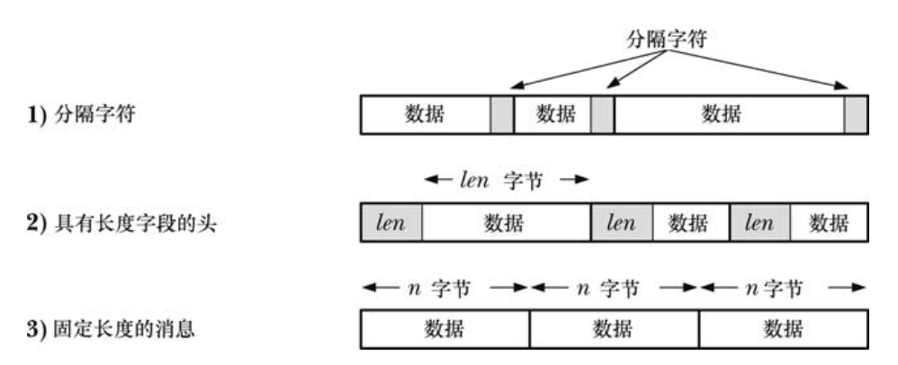

# 34.进程组、会话和作业控制
## 概述
- 会话和进程组的主要用途是用于shell作业控制。术语“作业”通常与术语“进程组”作为同义词来看待。
  - 一个"作业"/"任务"中的所有进程，必须被放置在同一个的进程组中
> https://www.zhihu.com/question/21711307

- **进程组**：一组相关进程的集合
- **会话**：一组相关进程组的集合
- **终端**：终端(Terminal)是对字符输入输出设备的抽象，在Linux中terminal是一种特殊的文件，在/dev目录下。通常情况下，键盘输入会写这个文件，而对应的终端驱动程序会执行诸如回显的工作（可以通过stty改变驱动程序的默认行为），如果没有了terminal，那么就无法响应键盘的输入.
  - 一个会话中所有的进程共享单个控制终端。
  - 会话中可以没有控制终端。
  - **控制终端**在会话首进程首次打开一个终端设备（如`/dev/tty`）时被建立。
  - 一个终端最多可能成为一个会话的控制终端。
- **控制进程**：当到控制终端的连接建立起来（即打开）之后，**会话首进程**会成为该终端的**控制进程**。成为控制进程的主要标志是当断开与终端之间的连接时内核会向该**进程**发送一个 **SIGHUP** 信号。
- **前台进程组和后台进程组**：会话中的其中一个进程组会成为终端的**前台进程组**，其他进程组会成为**后台进程组**。只有前台进程组中的进程才能从控制终端中读取输入。当用户在控制终端中输入其中一个信号生成终端字符之后(如ctrl + c)，该信号会被发送到**前台进程组中的所有成员**

> shell中运行程序的例子
- 从shell中发出的 **每个命令** 或 **通过管道连接的一组命令** 都会导致一个或多个进程的创建，并且 shell 会把所有这些进程都放在**一个新进程组中**。
- 当 **命令** 或 **以管道连接的一组命令** 以&符号结束时会在后台进程组中运行这些命令，否则就会在**前台进程组**中运行这些命令。在登录会话中创建的所有进程都会成为该会话的一部分。
- 在窗口环境中，控制终端是一个伪终端。每个终端窗口都有一个独立的会话，窗口的
启动 shell 是会话首进程和终端的控制进程。

## 进程组
- 新进程会继承父进程
- getpgrp：获取进程组ID
- setpgid：设置进程组ID
- setpgid限制：
  - 只能设置同等或下等进程
  - 进程组移动只能在同一个会话
  - 会话首进程不能
  - 一个进程在其子进程已经执行exec()之后就不能再修改子进程的进程组ID了
- 如果现在想fork之后修改进程组。在编写作业控制 shell 程序时需要让`父进程`和`子进程`在 fork()调用之后**立即调用 setpgid()**来将子进程的进程组 ID 设置为同样的值。

## 会话
- 新进程会继承父进程
- getsid：获取会话ID
- setsid：新建会话ID
  - 调用进程成为新会话的首进程和该会话中新进程组的首进程。调用进程的 进程组ID 和 会话ID 会被设置成该进程的 进程ID。
  - 调用进程**没有控制终端**。所有之前到控制终端的连接都会被断开。
- setsid约束：不能是进程组的首进程
  - 造成其他成员仍然在旧会话中，破话会话和进程组之间严格的两级层次。**进程组的成员必须属于同一个会话**

## 控制终端和控制进程
- 一个会话中的所有进程可能会有一个**控制终端**（一般是虚拟终端）。
- 会话刚创建出来的时候是没有控制终端的。
- 当**会话首进程**首次打开一个 还没有成为某个会话的控制终端的终端 时，会建立控制终端。除非open时指定`O_NOCTTY`。
- 当会话首进程打开了一个控制终端之后它同时也成为了该终端的**控制进程**。**控制进程通常是shell**
- 在发生终端断开之后，内核会向控制进程发送一个 SIGHUP 信号来通知这一事件的发生。
- 关于如何删除进程和控制终端之间的关联关系，见p579

## SIGHUP信号
- Linux在控制进程失去终端之后，会发送SIGHUP和SIGCONT（唤醒）信号
- 分为两种情况
  - 控制进程是shell：shell中的信号处理器会终止 shell，但在终止之前会向由 shell 创建的各个进程组（**包括前台和后台进程组**）发送一个 SIGHUP 信号。
  - 控制进程不是shell（比如在shell中用exec）：控制进程收到了SIGHUP信号终止，控制进程终止的这个行为，会导致SIGHUP信号发送给终端的前台进程组的所有成员。

> SIGHUP免疫
- nohup(1)命令可以用来使一个命令对 SIGHUP 信号免疫——即执行命令时将 SIGHUP 信号的处理设置为 SIG_IGN。
- bash 内置的命令 disown 提供了类似的功能，它从 shell 的任务列表中删除一个任务，这样在 shell 终止时就不会向该任务发送 SIGHUP 信号了。

## 作业控制
- `&` 表示命令在后台运行，`[]`里面的是作业号，作业号后面的数字是执行这个命令的进程的进程 ID 或 管道中最后一个进程的进程 ID。 

- fg：把任务弄到前台并恢复
- bg：把任务弄到后台并恢复
- **当前作业**：当前作业是在前台最新被停止的作业（）或者如果没有这样的作业的话，最新作业是在后台启动的任务。 
- fg和bg可以带%num，但是如果省略了就是默认当前作业。
- jobs：打印当前的所有任务，`+` 表示当前任务，`-` 表示前一个当前任务，都只有一个。
- ctrl+z：挂起前台任务，对于后台可以`kill -STOP`，发送SIGSTOP信号
- 终端的前台作业的概念还用于仲裁终端 I/O 请求。 只有前台作业中的进程才能从控制终端中读取数据。系统通过 `SIGTTIN` 信号的分送来防止后台作业读取数据，这个信号的默认动作是**停止作业**。如果设置了终端的 `TOSTOP` 标记，那么系统会通过 SIGTTOU 信号的发送来防止后台任务向控制终端写入数据，这个信号的默认动作是**停止作业**。

- 后面作业控制的实现部分用到再看。
- **孤儿进程组**：一个进程组，在这当中没有一个成员的父进程是与其在同一个会话但不同进程组的。
  - 问题：他们如果被停止了，没人知道，永远不会被唤醒残留在系统中。

# 35.进程优先调度
- Linux与大多数其他UNIX实现一样，调度进程使用CPU的默认模型是**循环时间共享**。每个进程轮流使用CPU直至时间片被**用光或自己自动放弃CPU**（如sleep或者被I/O阻塞）。
- 进程特性nice值（-20~19）允许进程间接地影响内核的调度算法。**非特权进程**只能降低自己的优先级，即赋予一个大于默认值0的nice值，这样做之后就对其他进程“友好（nice）”了。给一个进程赋予一个低优先级（即高nice值）并不会导致它完全无法用到CPU，但会导致它使用CPU的时间变少。

## 实时进程调度概述
- 为了满足**实时进程调度**（实时性要求很强的进程），内核必须要提供工具让高优先级进程能快速地取得 CPU 的控制权，抢占当前运行的所有进程
- 实时调度策略
  - SCHED_RR：有固定时间片，可以被抢占
  - SCHED_FIFO：没有固定时间片，可以被抢占。
- SCHED_OTHER：循环时间共享，时间片内不可以被抢占
- linux独有的调度策略
  - SCHED_BATCH、SCHED_IDLE：与默认的 SCHED_OTHER 策略类似
- API略
  - 获取优先级范围
  - 修改和获取策略和优先级
  - 释放CPU
  - 获取SCHED_RR时间片
  - 

- 释放CPU：
  - **实时进程**可以通过两种方式资源释放CPU：
    - 通过调用一个阻塞进程的系统调用
    - 调用sched_yield()(注：只能实时进程，就是实时调度策略下的进程)

## cpu亲和力
- 高速缓冲器中的一行与虚拟内存管理系统中的一页是类似的
- 多处理器架构在某个时刻只允许数据被存放在一个 CPU 的高速缓冲器中。这个使数据失效的过程会消耗时间。
- 软CPU亲和力：Linux（2.6）内核尝试了给进程保证**软CPU亲和力**——在条件允许的情况下进程重新被调度到原来的CPU上运行。
- **硬CPU亲和力**：有时候需要显示地（通过API）将其限制在可用 CPU 中的一个或一组 CPU 上运行。这就是设置了硬CPU亲和力
  - api见p613
- 实际上 CPU 亲和力是一个**线程级特性**，可以调整线程组中各个进程的 CPU 亲和力。可以将pid设定为线程中 gettid()调用返回的值。
- 进程的 CPU 亲和力掩码可以用来将进程限制在多处理器系统上可用 CPU 的子集中运行。这样就可以提高特定类型的应用程序的性能

## 36. 进程资源
- getrusage()允许一个进程监控自己及其子进程已经用掉的资源。getrlimit()/setrlimit()则可以用来修改和获取调用进程对各类资源的消耗限值。

- 使用shell的内置命令ulimit可以设置shell的资源限制。

## 37. DAEMON
- daemon是一种具备下列特征的进程：
  - 生命周期很长，通常伴随系统的整个运行过程；
  - 在后台运行且不拥有控制终端。由于没有控制终端，因此内核永远不会为daemon自动生成任何任务控制信号以及终端相关的信号，比如SIGHUP等；

- 要变成daemon，一个程序需要完成下面的步骤：
  - 执行fork()，之后父进程退出，子进程继续执行（使子进程成为init的子进程）；之所以需要这样做是因为假设程序是从命令行启动的，父进程终止时会被shell发现，shell在发现之后会显示出另一个shell提示符，并让子进程继续在后台运行；
  - 子进程调用setsid()开启一个新会话，并释放它与控制终端之间的所有关联关系；
  - 清除进程的umask，以确保当daemon创建文件和目录时拥有所需的权限；
  - 修改进程的当前工作目录，一般会改为根目录；
  - 关闭daemon从其父进程继承而来的所有打开着的文件描述符；
  - 在关闭了文件描述符0、1、2之后，daemon通常会打开/dev/null并使用dup2()使所有这些描述符指向这个设备； /dev/null是一个虚拟设备，会直接丢弃写入的数据。

- **becomeDaemon()函数**用来完成上述步骤以将调用者变成一个daemon。该函数接收一个掩码参数用来有选择地执行其中的步骤。

## syslog
- 引入：在编写 daemon 时碰到的一个问题是如何显示错误消息。**syslog** 工具就用于解决这个问题。

- syslog 工具有两个主要组件： syslogd daemon 和 syslog(3)库函数
  - syslogd daemon：通过配置文件完成一些日志转发工作等等。
  - syslog(3)库函数：供daemon进程调用，将日志写入该系统。

# 39.能力
- 问题：传统的一个进程要么拥有权限执行所有的操作（用户ID为0）或没有权限（用户 ID 非 0）执行操作的 all-or-nothing 权限机制
- 解决：Linux 能力模型将**特权操作**划分成不同的种类并允许一个进程在被授予一些能力的同时被禁止使用其他能力。
- **能力**：超级用户权限被划分成了不同的的单元，这个单元成为能力。
- 能力：
  - 进程能力
  - 文件能力
- 进程能力
  - 许可的：一个进程可能使用的能力；
  - 有效的：内核会使用这些能力来对进程执行权限检查；
  - 可继承的：当这个进程执行一个程序时可以将这些权限带入许可集中；

- 实际上能力是一个线程级的特性，进程中的每个线程的能力都可以单独进行调整，在 **/proc/PID/task/TID/status** 文件中可以查看一个多线程进程中某个具体线程的能力，**/proc/PID/status**文件显示了主线程的能力。

# 40.登录记账
- **utmp** 文件维护了所有当前登录进系统的用户记录； 
- **wtmp** 文件维护了所有登录和登出行为的审计信息； 
- **lastlog** 文件记录着每个用户最近一次登录系统的时间。
- 很多命令，如 who 和 last，都使用了这些文件中的信息。

# 41.共享库基础
- 问题：大量的目标文件会散落在系统上的各个目录中，从而造成目录中内容的混乱
- 解决：可以将一组目标文件组织成一个被称为**对象库**的单元。对象库分为两种：**静态的和共享的**。

## 静态库
- 静态库实际上就是一个保存所有被添加到其中的目标文件的副本的文件。静态库的名称的形式为 libname.a。
- 操作
  - 增删查p685

- 缺点：
  - 浪费磁盘空间
  - 浪费虚拟内存整体使用
  - 静态库修改，所有使用它链接的都需要重新编译。

## 共享库
- 基于静态库的缺点，提出了共享库。
- 根据惯例，共享库的前缀为 lib，**后缀为.so**（表示 shared object）。

- 位置独立的代码，因为在应用程序链接的时候是无法知道共享库代码位于内存的何处的。需要使用`-fPIC`来标识

- 使用一个共享库需要做两件事
  - 因为不再使用目标文件副本，需要某种机制来找到运行时的共享库。——通过动态依赖列表
  - 找到需要用到的共享库后，怎么去解析，然后找到共享库——通过**动态链接器**

> 动态依赖列表
- 共享库的名称嵌入到可执行文件中，在其**DT_NEEDED** 标签中。一个程序所依赖的所有共享库列表被称为程序的**动态依赖列表**。

> 动态链接器
- **动态链接器本身也是一个共享库**，其名称为`/lib/ld-linux.so.2`，所有使用共享库的 ELF 可执行文件都会用到这个共享库。
- 动态链接器会检查程序所需的共享库清单并使用一组预先定义好的规则来在文件系统上找出相关的库文件。其中一些规则指定了一组存放共享库的标准目录。如**很多共享库位于/lib和/usr/lib** 中。

> LD_LIBRARY_PATH 
- **LD_LIBRARY_PATH**：指定共享库目录

> 共享库工具
- ldd：命令显示了一个程序运行所需的共享库
- objdump：获取可执行文件的各类信息
- nm：命令会列出目标库或可执行程序中定义的一组符号

> 真实名称、soname、链接器名称
- **真实名称**的格式规范为`libname.so.major-id.minor-id`。
- 共享库的 **soname** 包括相应的真实名称中的主要版本标识符，但**不包含次要版本标识符**。
  - 每个库的主要版本的 soname 会指向在主要版本中最新的次要版本（如下所示）。

- **链接器名称**：只包含库名，不包含任何版本符号，其形式为 libname.so。
  - 可执行文件与共享库链接起来时会用到这个名称
  - 链接器名称一般连接到库的**最新**主要版本的 soname。 
  

  

- 总结： soname用来屏蔽次要版本，链接器名称屏蔽主要版本。方便ldconfig的工作

- 运行时符号解析不太懂。p700
### 共享库寻找
- 通知共享库位置：
  - 放在私有目录，然后设置环境变量**LD_LIBRARY_PATH**
  - 放在标准库目录。标准库目录如下所示。
  - 在静态编辑阶段可以在可执行文件中插入一个在运行时搜索共享库的目录列表，使用`-rpath`。DT_RPATH（默认）， DT_RUNPATH；`$ORIGIN`表示包含应用程序的目录。
    - 相对于` LD_LIBRARY_PATH` 环境变量的优先级： `DT_RPATH` 的优先级更高，而 `DT_RUNPATH` 的优先级则更低

> ldconfig
- 解决的问题：
  - 共享库可以位于各种目录，如果遍历各个目录去找共享库，很慢。
  - 如果库有版本变化，对于soname来说比较难手动维护。

- ldconfig的操作
  - 搜索在`/etc/ld.so.conf`中指定的目录，然后搜索其他标准库目录，将相应信息写到缓存文件`/etc/ld.so.cache`中。
    - 这些信息为：**每个库的主要版本的最新的次要版本**（注：多个主要版本就有多条信息）
  - 检查每个库的各个主要版本的最新次要版本以找出嵌入的 soname，然后**在同一目录中为每个 soname 创建（或更新）相对符号链接**。(注：只改soname)
    - 主版本升级，必须手动更新链接器名称的符号链接。
- 可以通过查看/proc/PID/maps文件来列出进程用到的所有共享库。

> 运行时寻找共享库原则：

# 42.共享库的高级特性
- `dlopen API`使得程序能够在运行时打开一个共享库，根据名字在库中搜索一个函数，然后调用这个函数（即延迟加载），在运行时采用这种方式加载的共享库通常称为动态加载的库。

- 有些时候需要监控动态链接器的操作以弄清它在搜索哪些库，可以通过LD_DEBUG环境变量来完成：通过将这个变量设置为一个或多个关键词可以从动态链接器中得到各种跟踪信息。
  - $ LD_DEBUG=libs date

# 43.进程间通信
- UNIX 系统上各种通信和同步工具，并根据功能将它们分成了三类。虽然一些工具关注点是同步，但是通用术语进程间通信（ IPC）通常指代所有这些工具。
  - 通信
  - 同步
  - 信号
- IPC工具分类如下所示

## 通信工具
- 通信工具分配两类
  - 数据传输工具：为了进行通信，一个进程将数据写入到IPC工具中，另一个进程从中读取数据，这些工具要求在用户内存和内核之间进行两次数据传输；工作方式如下所示。
  

  - 共享内存：通过将数据放到由进程间共享的一块内存中以完成信息的交换。不需要系统调用，速度快。

- 数据传输
  - 字节流：无分隔符的字节流
  - 伪终端：特殊情况下使用的通信工具
  - 消息：分隔符分隔消息
- 共享内存
  - System V共享内存；
  - POSIX共享内存；
  - 内存映射；
- 数据传输与共享内存
  - 数据传输读取会消耗数据。读写之间的同步是原子的。
  - 共享内存是牺牲同步换速度，经常使用信号量来实现同步。
## 同步工具
- 信号量：内核维护，一个不小于0的值。通常是二元信号量，就是0或1。
- 文件锁：读锁 写锁。
- 互斥体和条件变量：用于线程同步。

----------

- IPC工具比较那部分有点迷，太杂太散了。

# 44.管道和FIFO
- **管道与FIGO**：**管道**是UNIX上最古老的IPC方法，用来进行**相关**进程间的通信（注意是相关）。**FIFO**是管道概念的变体，他们之间的一个重要差别就是可以用于任意进程间通信。
- 管道例子：`$ ls | wc -l`
  - ls的标准输出连接到管道的写入端，而wc的标准输入链接到管道的读取端。**这个两个进程都不知道管道的存在**

## 管道
  - 管道是字节流，没有消息边界。
  - 数据传递是顺序的。
  - 无法随机访问数据（像lseek）
  - 读取没有数据将阻塞，写入端被关闭，读完剩余的数据将会看到文件结束（read返回0）
  - 管道是单向的。
  - 可以多个进程写入同一个管道，那么确保写入不超过`PIPE_BUF`的话，就是原子的。
  - 管道的容量是有限的，其是**内核内存**中维护的缓冲器。

## FIFO
- FIFO与管道类似，它们之间最大的差别在于FIFO在文件系统中拥有一个名称，并且其打开方式与打开一个普通文件是一样的。这样就能将FIFO用于**非相关进程**之间的通信。
- 可以使用`mkfifo`命令在shell中创建一个FIFO。一旦FIFO被创建，任何进程都可以打开它，只要它能够通过常规的文件权限检测。

- 分隔字节流中的消息的方法如下。
  - 不管使用这三种技术中的哪种，每条消息的总长度必须
要小于 PIPE_BUF 字节以防止内核对消息进行拆分。

