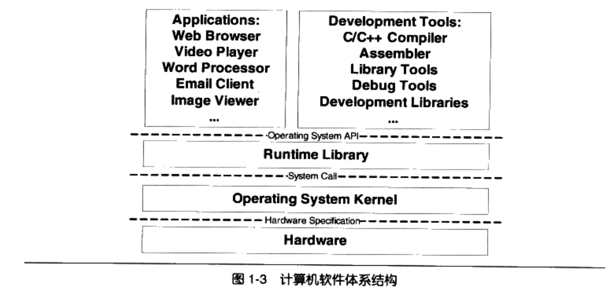

- [1. 简介](#1-%E7%AE%80%E4%BB%8B)
- [2.静态链接](#2%E9%9D%99%E6%80%81%E9%93%BE%E6%8E%A5)
  - [gcc编译过程](#gcc%E7%BC%96%E8%AF%91%E8%BF%87%E7%A8%8B)
  - [目标文件](#%E7%9B%AE%E6%A0%87%E6%96%87%E4%BB%B6)
    - [一些命令](#%E4%B8%80%E4%BA%9B%E5%91%BD%E4%BB%A4)
    - [段](#%E6%AE%B5)
    - [文件头](#%E6%96%87%E4%BB%B6%E5%A4%B4)
    - [段表](#%E6%AE%B5%E8%A1%A8)
    - [字符串表（.strtab和.shstrtab）](#%E5%AD%97%E7%AC%A6%E4%B8%B2%E8%A1%A8strtab%E5%92%8Cshstrtab)
    - [链接的接口：符号](#%E9%93%BE%E6%8E%A5%E7%9A%84%E6%8E%A5%E5%8F%A3%E7%AC%A6%E5%8F%B7)
    - [符号的修饰和签名](#%E7%AC%A6%E5%8F%B7%E7%9A%84%E4%BF%AE%E9%A5%B0%E5%92%8C%E7%AD%BE%E5%90%8D)
    - [强符号和弱符号](#%E5%BC%BA%E7%AC%A6%E5%8F%B7%E5%92%8C%E5%BC%B1%E7%AC%A6%E5%8F%B7)
    - [调试信息](#%E8%B0%83%E8%AF%95%E4%BF%A1%E6%81%AF)
  - [静态链接](#%E9%9D%99%E6%80%81%E9%93%BE%E6%8E%A5)
    - [重定位表](#%E9%87%8D%E5%AE%9A%E4%BD%8D%E8%A1%A8)
    - [符号解析](#%E7%AC%A6%E5%8F%B7%E8%A7%A3%E6%9E%90)
    - [COMMON块](#COMMON%E5%9D%97)
    - [C++问题](#C%E9%97%AE%E9%A2%98)
    - [静态库链接](#%E9%9D%99%E6%80%81%E5%BA%93%E9%93%BE%E6%8E%A5)
- [装载与动态链接](#%E8%A3%85%E8%BD%BD%E4%B8%8E%E5%8A%A8%E6%80%81%E9%93%BE%E6%8E%A5)
  - [装载](#%E8%A3%85%E8%BD%BD)
    - [虚拟空间分布](#%E8%99%9A%E6%8B%9F%E7%A9%BA%E9%97%B4%E5%88%86%E5%B8%83)
  - [动态链接](#%E5%8A%A8%E6%80%81%E9%93%BE%E6%8E%A5)
    - [地址无关代码](#%E5%9C%B0%E5%9D%80%E6%97%A0%E5%85%B3%E4%BB%A3%E7%A0%81)
# 1. 简介

- **软件终端**：系统调用接口在实现中往往通过软件中断int的方式提供（注：现在有新的手段了）
- **硬件规格**（即硬件接口）：操作系统内核层（驱动程序）是硬件接口的使用者，硬件的接口决定了操作系统的内核。
- 在x86平台上，共有65536个**硬件端口寄存器**，不同硬件被分配到了不同的**IO端口地址**。CPU通过两条专门的指令 **"in"和"out"** 来实现对硬件的读和写。
- 下图为计算机软件体系结构
<div style="zoom:50%" align="center">

</div>


- 页大小：现在操作系统的分页一般是（4KB）
- Page Fault：如果缺页的时候，产生Page Fault，操作系统接管进程，装入相应页到进程。
- MMU：内存管理单元，负责页映射
  
# 2.静态链接
## gcc编译过程
- 预编译
  - `gcc -E hello.c -o hello.i`
  - 当无法判断宏是否正确，可以看看预编译后的文件来确定
  - 功能：展开宏，去注释，加行号和文件标识（便于调试）；保留#pragma编译器指令，因为编译器需要用到
- 编译
  - `gcc -S hello.i -o hello.s`或`gcc -S hello.c -o hello.s`
  - 功能：经过词法分析，语法分析，语义分析，优化后生成**汇编代码**
- 汇编
  - `as hello.s -o hello.o`或`gcc -c hello.s -o hello.o`
    - `-c`表示只编译，不链接
  - 功能：将汇编一一转换成机器指令,生成**目标文件**
- 链接
  - `ld -static`
  - 功能：将多个目标文件链接成一个可执行文件

> 编译时的中间代码
- 引出中间代码：在语法树上优化比较难，所以一般将其转换为中间代码
- 中间代码：
  - 特点：目标机器无关；
  - 种类：（常见的）三地址码，P-代码
  - 意义：把编译器分为**前端和后端**，前端赋值产生机器无关的中间代码，后端将中间代码转换成目标机器代码。前端是机器无关的，所以针对不同环境，可以使用同一个前端，不同的后端。

- 编译的后端
  - 后端包括：代码生成器和目标到吗优化器

<div style="zoom:50%" align="center">

</div>

<div style="zoom:50%" align="center">

</div>


## 目标文件
- 可执行文件格式
  - WINDOWS：PE
  - Linux：ELF
  - 以上都是COFF格式的变种
- 动态链接库（dll，.so）、静态链接库(.lib，.a)的格式都和可执行文件的格式差不多
- ELF格式文件归为以下四类，可以通过`file`命令查看
  - 可重定位文件relocatable（可静态链接）
  - 可执行文件executable（可执行）
  - 共享目标文件shared object（可动态链接）
  - 核心转储文件（core dump）
<div style="zoom:70%" align="center">

</div>

### 一些命令
- **objdump**
  - `objdump -h SimpleSection.o`：查看文件内部结构（p62）
  - `objdump -s -d SimpleSection.o`：-s所有内容十六进制打出，-d对代码段反汇编
  - -x：在打印时显示段名
  - -r：查看重定位信息
  - -t：可以加上库文件，然后配合搜索工具，可以查找某个函数在哪个目标文件上
- **size**：查看运行时，text、data、bss段的长度
- **nm**：列出所有符号
- **readelf**
  - `readelf -h SimpleSection.o`：读取解析文件头
  -  `readelf -S SimpleSection.o`：打印段表
  -  `readelf -p 11 SimpleSection.o`：-p指定要以字符串形式打印哪个段
- ld
  - `ld a.o b.o -e main -o ab`:-e main将main作为程序入口，ld链接器的默认入口是start
- ar
  - -t：显示静态库文件包含哪些目标文件
  - -x：解压
- gcc
  - -verbos：打印过程步骤
<div style="zoom:60%" align="center">

</div>

### 段
- 总体来说，源代码编译后主要分为：程序指令和程序数据。
- ".text"或".code"段：存放代码
- ".data"：全局变量和局部静态变量数据
  - 有时编译器也会将字符串常量放在该段
- ".bss"：未初始化的全局变量和局部静态变量
  - 在硬盘中不占空间，在内存中时才占。
  - 有些不会将 全局的未初始化变量 存放在bss中，只是预留了一个未定义的全局变量符号（ **未定义的COMMON符号** ），等到**最终链接成可执行文件**的时候再在`.bss`段中分配空间。
- ".rel.text"：重定位表，静态链接的时候使用
- 其他常见段：
<div style="zoom:70%" align="center">

</div>

- 段Segment（节Section）的意义
  - 方便权限设置
  - 提高缓存命中率
  - 共享数据


- 段可以自定义（p68）
  - 通过`__attribute__((section("FOO"))) int global = 42;`
  - objcopy：将二进制文件导入目标文件（感觉没什么用）

### 文件头
- 见p69
- 只要分析了ELF文件头，就可以知道段表和段表字符串表的位置，从而解析整个ELF文件
### 段表
- 段的名字对于编译器、链接器来说是有意义的，但是对于操作系统来说就是没有实质的意义的。
- 一个段该如何处理取决于它的属性和权限，即由**段的类型**和**段的标志**这两个成员决定
  - 段的类型：程序段、重定位段、符号表...
  - 段的标志位：可读、可写、可运行
<div style="zoom:50%" align="center">

</div>

### 字符串表（.strtab和.shstrtab）

- **.shstrtab**：**段表字符串表**，保存段表中用到的字符串，保存段名之类的
  - 其在段表中的下标在 文件头 中。
  - 段表通过**sh_name**指向段名
- **.strtab**：普通字符串，比如符号用到的名字
  - 符号表中的st_name为在该表中的偏移

### 链接的接口：符号
- 目标文件之间之所以可以拼合，**实际上是因为目标文件之间对地址的引用**，即对函数和变量名的引用。
- 在链接中，将 函数和变量 统称为**符号**，函数名和变量名 就是**符号名**
- 目标文件的**符号表**中，记录目标文件用的所有符号。每一个符号对应一个**符号值**，**符号值就是他们的地址**。
- 没有定义在本目标文件中的符号，称为**外部符号**


> 特殊符号
- 链接的时候，会和链接器的库链接，再和其他目标文件链接，所以会引入一些自己没定义的特殊符号。

### 符号的修饰和签名
- C背景：早期C语言目标文件生成的符号名就是原本程序定义的。这样很容易在使用原本由汇编编写的目标文件时，符号名造成冲突。所以C就在他的符号名前加上下划线"`_`"
- C++背景：到了C++了，引入了**命名空间**，C++加了很多特性，重载、继承、模板这些，符号管理就更复杂了。比如针对`func(int)`和`func(double)`的情况怎么办，C++引入了**符号修饰**。
  - 不同编译器对符号修饰的手段不同
- `c++filt`命令可以将修饰后的名称还原

> 关于 extern "C"
- 如果C++调用c库的函数，那么在声明时（经常在头文件中）用`extern "C"`可以避免符号修饰。


> 关于 宏__cplusplus
- 比如在memset所在的库中，C++必须使用extern "C"来声明memset，但是C语言不支持extern "C"。为了避免定义两套头文件，利用宏 __cplusplus可以有效避免

### 强符号和弱符号
- **强符号**： 对于C/C++来说，编译器默认函数 和 初始化了的全局变量为强符号
- **弱符号**：未初始化的全局变量为弱符号。
  - 可以通过`__attribute__((weak))`来使一个强符号为弱符号
- 规则
  - 强符号只允许一个
  - 选择强符号
  - 若都是弱符号，选占空间最大的

- **强引用**：默认对外部目标文件的符号引用都是强引用。
- **弱引用**：使用`__attribute__((weakref))`声明
- 链接器在处理强引用和弱引用的过程几乎一样，只是弱引用没定义的时候，链接器不会认为是一个错误。

- 意义
  - 弱符号和弱引用可以作为一种库的扩展机制。
    - 弱符号可以为用户DIY。
    - 弱引用可以作为一种额外功能，即使去掉了这些功能的定义，还是可以正常链接。

```c
__attribute__((weakref)) void foo();
int main(){
    // 如果foo定义了
    if(foo) foo();
}

```

### 调试信息
- gcc 加上 -g 的时候可以加入一些调试相关的段
- 通过使用strip foo可以将这些段除去

## 静态链接
- 静态链接一般都是**两步链接**
  - 第一步 空间与地址分配
    - 形成**全局符号表**；合并相似段，更新段表
  - 第二步 符号解析与重定位（核心）

- 整个详细流程
  - 先将相似段合并，同时再把各个输入目标文件的符号表合并成了**全局符号表**，然后更新段表的映射
  - 在重定位的过程中也伴随着符号的解析过程，因为符号里的符号值，就是符号的地址。所以链接器会将各个输入文件中 `未定义的符号` 找出来，在`全局符号表`中查找，如果没找到，就报错。找到了，就在`重定位表`中，找到各个`重定位入口`，将重定位入口替换为真实地址。链接过程完毕


- ld
  - `ld a.o b.o -e main -o ab`:-e main将main作为程序入口，ld链接器的默认入口是start

- 示例程序如下
<div style="zoom:80%" align="center">

</div>

> 示例分析
- a.o
<div style="zoom:80%" align="center">

</div>


- b.o
<div style="zoom:80%" align="center">

</div>

- 链接后的文件ab。text段为原来a.o和b.o的text段的合并，而且给ELF文件分配了VMA，表示其在虚拟内存中的位置
<div style="zoom:80%" align="center">

</div>

### 重定位表
- 每一个要被重定位的地方叫做**重定位入口**，像swap和shared都是重定位入口。在实际编码的时候先通过一定的机制，将其设置为一个临时值。
- 在重定位表中，有
  - 重定位入口在符号表中的下标
  - 重定位入口类型
  - 重定位入口的位置，是其所在段的相对偏移。

> a.o的重定位表
- 在.rela.text中，表明在text中需要重定位的位置。
<div style="zoom:80%" align="center">

</div>

### 符号解析
- 就是在重定位之前，链接器会生成一个**全局的符号表**，如果某一个输入文件的符号表有未定义的，且在全局的符号表中没找到，那么链接器就会报错。
- 符号表中有**符号值**，符号值就是符号的地址。所以重定位的时候需要符号表提供符号值来进行重定位。

### COMMON块
- 如果一个弱符号定义在了多个目标文件中，而且他们的类型不同。更具弱符号规则，链接的时候取占空间最大的那个。所以在编译前的目标文件中，是不知道其究竟所占的空间是多少的。所以无法为其在bss中分配空间（虚拟内存中），所以在目标文件的时候未初始化的全局变量将其标记为一个COMMON变量。
- 可以设置不会COMMON

### C++问题
- c++的复杂性给其二进制兼容带来很大的问题
  - 像重载，虚拟函数，继承，异常，等等这些需要编译器和链接器的相互配合
> 模板带来的问题
- 模板带来的问题：模板被一个编译单元实例化，其不知道在其他地方是否也被实例化，所依会带来**重复代码**，造成
  - 空间浪费
  - 地址容易出错。比如指向同一个函数的指针，指针值不一样
  - cache命中减弱。

- 解决：每个实例化后的函数单独成一个段。最后链接的时候就可以区分这些相同模板实例了。

> 函数级别链接
- 编译器一般可以提供的功能
- 就是把每个函数都保留为一个段，链接的时候对于那些没有用到的，就抛弃。
- 优点：输出文件大小减少。
- 缺点
  - 编译、链接变慢
  - 目标文件的段大大增加

> 全局构造与析构
- 在main之前还需要做一些准备工作，这个时候其实第一次运行的不是main。linux一般是`_start`，其是程序的入口
- 在许多时候，程序要在main之前执行，这一部分会放在`.init段`里。一些需要在main之后执行，放在`.fini`段里。——全局构造和析构函数由此来实现。

> 二进制兼容性（ABI）
- 规定的是一些二进制层面上的标准。比如符号修饰标准，变量内存布局等等

### 静态库链接
- 一般标准库中的目标文件，是一个函数一个目标文件。这样避免只用了一个函数，把其他的代码都链接过来，造成空间浪费。


# 装载与动态链接
## 装载
- 进程的建立  
  - 首先创建虚拟地址空间
    - 创建了一个`页目录`，用来后续建立**虚拟地址与物理地址的映射**
  - 读取可执行文件头，并且简历虚拟空间与可执行文件的映射关系
    - 建立数据结构，建立**虚拟空间与可执行文件之间的映射**
  - 将CPU指令寄存器设置成可执行文件入口，启动运行。
    - 涉及内核堆栈和用户堆栈的切换、CPU运行权限的切换。
- 发生页错误时：查询**虚拟空间与可执行文件之间映射 的数据结构**=》找到**空页面所在的VMA**（虚拟内存）=》计算出可执行文件中的偏移（磁盘）=》物理内存分配一个物理页面（物理内存）将其导入=》虚拟页面与物理页建立关系（`页目录`）

- **VMA虚拟内存区域**（P159）：进程中虚拟空间中的一个段（Segment）
  - 操作系统使用VMA对进程的地址空间进行管理

### 虚拟空间分布
- 操作系统（或CPU）并不关心各个段的实际内容，实际上他只关心装载相关问题，最**重要的就是权限**。
- 段权限基本就下面三种
<div style="zoom:80%" align="center">

</div>

- 对于相同权限的段/节（section）将其合并成Segment进行映射
- 链接的时候也会把相同权限属性的段（section）分配在同一个空间。
- ELF的不同视图
  - 链接视图：Section
  - 装载视图：Segment
- 一般的，相同属性的Section归类为一个Segment，并且映射到同一个VMA
- **程序头**：一个描述Segment的结构，描述ELF文件该如何被操作系统映射到进程的虚拟空间
  - `readelf -l`
  - 如下所示，只有LOAD类型才会被加载到虚拟内存。
  - 结构p165
<div style="zoom:60%" align="center">

</div>

- **匿名虚拟内存区域**：没有映射到文件中的VMA
  - 堆和栈都有这样对应的一个VMA
  - VDSO是内核模块
<div style="zoom:60%" align="center">

</div>

- 进程可以分为如下几种VMA区域
<div style="zoom:60%" align="center">

</div>

<div style="zoom:80%" align="center">

</div>

## 动态链接
- 为什么要动态链接（静态链接的缺点）
  - 不能共享，空间浪费
  - 更新麻烦，如果更新了又要重新编译


- 动态链接优点
  - 空间大大释放
  - CPU命中增加，因为不同进程间的数据和指令都集中在同一个共享模块上。
  - 容易升级。只需要替换原来的共享模块
  - 解耦。使得各个木块更加独立，耦合度低。
  - 兼容性更好。动态链接库相当于操作系统和程序之间增加了一个**中间层**，从而消除不同系统平台之间的依赖差异性。（不用重新编译）
- 弊端
  - 动态链接库更新了之后，容易导致新旧不兼容，导致原有的运行不了。（如win上的DLL Hell）

- ELF中动态链接文件称为 **动态共享对象（DSO）**，简称**共享对象**。win上称为动态链接库（DLL）。
  - LINUX上常用的c语言库运行库glibc，动态链接形式版本保存在`/lib`下，文件名为libc.so

> 例子
```cpp
/* Program1.c*/
#include "Lib.h"
int main(){
    foobar(1);
    return 0;
}

/*Program2.c*/
#include "Lib.h"

int main(){
    foobar(2);
    return 0;
}

/*Lib.h*/
#ifndef LIB_H
#define LIB_h
void foobar(int i);

#endif

/*Lib.c*/
#include<stdio.h>
void foobar(int i){
    printf("Print from Lib.so %d\n", i);
    sleep(-1);
}

```
- `gcc -fPIC -shared -o Lib.so Lib.c`
  - -shared 表示产生共享对象
  - -fPIC 产生地址无关的代码
- `gcc -o Program1 Program1.c ./Lib.so`
  - 生成可执行文件
  - 为什么是动态链接还需要加入共享对象呢？
    - 因为在进行静态链接的时候，需要对**未定义符号**进行重定位，要让链接器知道这个是动态共享对象的符号，所以这个符号会被标记为一个**动态链接符号**。LIb.so保存着的符号信息，帮助静态链接做判断。
- `gcc -o Program2 Program1.c ./Lib.so`


<div style="zoom:60%" align="center">

</div>

- **动态链接器**：动态链接器和普通共享对象一样，被映射到了进程空间，在系统开始运行Program1前，首先把控制权给动态链接器，由他完成所有的动态链接工作之后把控制权交给Program1


### 地址无关代码
- readelf -l Lib.so：查看下Segment，发现没有指定在虚拟空间中的位置。

<div style="zoom:60%" align="center">

</div>

- **共享对象在编译时不能假设自己在进程虚拟空间中的位置，而是装载的时候再确定的**。
  - 为了避免地址冲突

> 装载时重定位
- 系统在装载的程序的时候，需要对程序的指令和数据中使用**绝对地址**的引用使用**重定位**，但这种重定位比静态链接的重定位简单很多。——**装载时重定位**（**基址重置**）
  - 共享模块中的程序相对位置是不会改变的，所以只要原有的相对位置加上基址就可以了。

- 这种方式的特点依然存在绝对地址。这会带来一个缺点。不同的程序可能将其装载的位置不同。这样的代码不能复用，损失了动态链接一大特性。——**故有了地址无关代码**。
> 地址无关代码
- 地址无关代码（PIC）技术：基本思想就是把指令中哪些需要被修改的部分分离出来，**跟数据部分放在一起**。**这样指令的部分就可以共享，每一个进程拥有一个数据部分副本**。详细见p191


