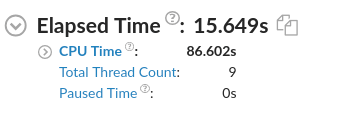

## Summary
### CPU运行时间

> Wall(Elapsed)/CPU time  
参考：https://zhuanlan.zhihu.com/p/39891521

- Wall time:从计算开始到计算结束等待的时间。
- CPU time：衡量的是CPU用来执行程序的时间。当软件使用一个线程时，由于需要等待IO完成或者用户输入等原因，CPU并不总是100%被使用，这导致CPU time一般比wall time小。当我们使用多线程的时候，程序的CPU time是各个线程的CPU time之和。

> 