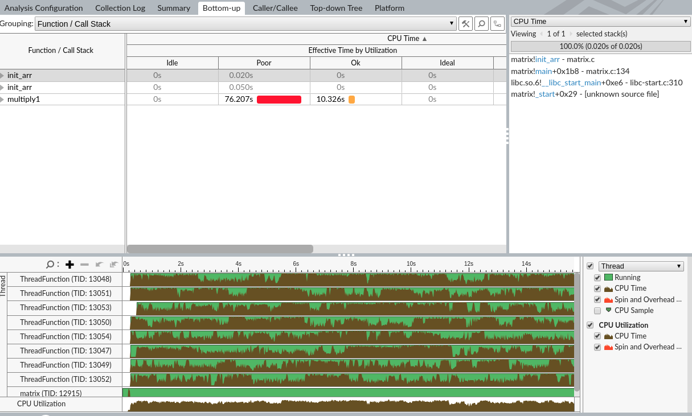

<a href="https://software.intel.com/content/www/us/en/develop/documentation/vtune-help">官方文档</a> 
<a href="https://zzqcn.github.io/perf/intel_vtune/intro.html">中文使用介绍</a>

- [介绍和使用](#%E4%BB%8B%E7%BB%8D%E5%92%8C%E4%BD%BF%E7%94%A8)
  - [运行](#%E8%BF%90%E8%A1%8C)
  - [类型](#%E7%B1%BB%E5%9E%8B)
- [使用笔记](#%E4%BD%BF%E7%94%A8%E7%AC%94%E8%AE%B0)
  - [Summary](#Summary)
    - [CPU运行时间](#CPU%E8%BF%90%E8%A1%8C%E6%97%B6%E9%97%B4)
    - [热点函数](#%E7%83%AD%E7%82%B9%E5%87%BD%E6%95%B0)
    - [CPU利用率直方图](#CPU%E5%88%A9%E7%94%A8%E7%8E%87%E7%9B%B4%E6%96%B9%E5%9B%BE)
  - [Bottom-up](#Bottom-up)
  - [Caller/Callee](#CallerCallee)
  - [Top-down](#Top-down)
# 介绍和使用
- 支持语言：C/C++，Golang，Python，Java等
- 支持系统：Linux、Windows、Mac

## 运行
- 环境：ubuntu18.04
- 安装 intel parallel studio
- 运行脚本配置环境：`source /opt/intel/parallel_studio_xe_2020.1.102/psxevars.sh`
- 执行：`vtune-gui`

## 类型
vtune提供了一套预置的分析类型, 可用于不同的性能优化目的。
- Hotspots
  - Hotpots 用于分析耗时代码, 优化算法
  - Memory Consumption 用于分析内存占用, 仅支持C/C++和Python代码和Linux
- Parallelism
  - Threading 可视化并行多线程, 定位导致并发问题的原因, 分析串行性能瓶颈
  - HPC Performance Characterization 分析计算密集型的OpenMP或MPI程序对CPU, 内存和FPU资源的占用
- Microarchitecture
# 使用笔记
## Summary
- Hotspots模式下

### CPU运行时间

> Wall(Elapsed)/CPU time  
参考：https://zhuanlan.zhihu.com/p/39891521

- Wall time:从计算开始到计算结束等待的时间。
- CPU time：衡量的是CPU用来执行程序的时间。当软件使用一个线程时，由于需要等待IO完成或者用户输入等原因，CPU并不总是100%被使用，这导致CPU time一般比wall time小。当我们使用多线程的时候，程序的CPU time是各个线程的CPU time之和。
- Paused Time：是指​​使用GUI，CLI命令或用户API暂停分析所用的时间

### 热点函数
- 函数根据占用时间的排行。这里的时间是`CPU TIME`

### CPU利用率直方图
- 纵坐标是`Wall/Elapsed Time`,横坐标是线程数
- 描述多少个核心一起运动时，其所占的`Elapsed Time`是多少
- 底下的ideal、ok、poor、Idel是可以调节的
- 两根虚线分别是`平均的利用率`和`目标利用率`。

## Bottom-up
- 呈现每个函数使用的CPU时间，以及CPU使用率情况。函数的展示是根据调用关系展示的。
- 这里的`Poor`，`ok`等级是在Summary视图可以自定义的

> spin and overhead time
- CPU时间包括旋转自旋锁所花费的时间，等待服务内存请求所花费的时间以及高速缓存一致性所花费的时间。这些一起在VTune术语中称为`“spin and overhead time”`。

---

- 双击函数可以进入源代码分析。以下进入`multiply1`函数.
  - 会根据高耗时的语句进行 耗时百分比说明。

- 查看对应汇编代码

## Caller/Callee
- 展示程序中函数的调用关系

## Top-down 
- 呈现函数调用树

