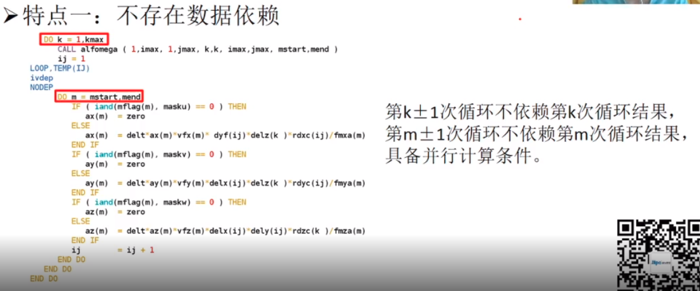

- [概述](#%E6%A6%82%E8%BF%B0)
  - [并行计算的必要性](#%E5%B9%B6%E8%A1%8C%E8%AE%A1%E7%AE%97%E7%9A%84%E5%BF%85%E8%A6%81%E6%80%A7)
    - [现代计算机体系架构下的并行化](#%E7%8E%B0%E4%BB%A3%E8%AE%A1%E7%AE%97%E6%9C%BA%E4%BD%93%E7%B3%BB%E6%9E%B6%E6%9E%84%E4%B8%8B%E7%9A%84%E5%B9%B6%E8%A1%8C%E5%8C%96)
  - [处理器重要技术](#%E5%A4%84%E7%90%86%E5%99%A8%E9%87%8D%E8%A6%81%E6%8A%80%E6%9C%AF)
    - [流水线](#%E6%B5%81%E6%B0%B4%E7%BA%BF)
    - [乱序执行](#%E4%B9%B1%E5%BA%8F%E6%89%A7%E8%A1%8C)
    - [向量化指令](#%E5%90%91%E9%87%8F%E5%8C%96%E6%8C%87%E4%BB%A4)
  - [并行计算系统发展趋势](#%E5%B9%B6%E8%A1%8C%E8%AE%A1%E7%AE%97%E7%B3%BB%E7%BB%9F%E5%8F%91%E5%B1%95%E8%B6%8B%E5%8A%BF)
    - [并行计算系统体系架构](#%E5%B9%B6%E8%A1%8C%E8%AE%A1%E7%AE%97%E7%B3%BB%E7%BB%9F%E4%BD%93%E7%B3%BB%E6%9E%B6%E6%9E%84)
    - [加速器](#%E5%8A%A0%E9%80%9F%E5%99%A8)
    - [调度系统](#%E8%B0%83%E5%BA%A6%E7%B3%BB%E7%BB%9F)
    - [编译和优化工具](#%E7%BC%96%E8%AF%91%E5%92%8C%E4%BC%98%E5%8C%96%E5%B7%A5%E5%85%B7)
  - [其他](#%E5%85%B6%E4%BB%96)
- [并行应用优化](#%E5%B9%B6%E8%A1%8C%E5%BA%94%E7%94%A8%E4%BC%98%E5%8C%96)
  - [自上而下的方法](#%E8%87%AA%E4%B8%8A%E8%80%8C%E4%B8%8B%E7%9A%84%E6%96%B9%E6%B3%95)
  - [性能指标](#%E6%80%A7%E8%83%BD%E6%8C%87%E6%A0%87)
    - [系统：CPU利用率](#%E7%B3%BB%E7%BB%9FCPU%E5%88%A9%E7%94%A8%E7%8E%87)
    - [系统：内存和swap分区](#%E7%B3%BB%E7%BB%9F%E5%86%85%E5%AD%98%E5%92%8Cswap%E5%88%86%E5%8C%BA)
    - [CPU：CPI](#CPUCPI)
    - [CPU：浮点运算峰值](#CPU%E6%B5%AE%E7%82%B9%E8%BF%90%E7%AE%97%E5%B3%B0%E5%80%BC)
    - [CPU：向量化比率](#CPU%E5%90%91%E9%87%8F%E5%8C%96%E6%AF%94%E7%8E%87)
    - [CPU：Cache Miss](#CPUCache-Miss)
  - [软件介绍](#%E8%BD%AF%E4%BB%B6%E4%BB%8B%E7%BB%8D)
- [Intel@ Parallel Studio XE 2020](#Intel-Parallel-Studio-XE-2020)
- [并行编程](#%E5%B9%B6%E8%A1%8C%E7%BC%96%E7%A8%8B)
  - [OpenMP编程](#OpenMP%E7%BC%96%E7%A8%8B)
    - [OpenMP编程简介](#OpenMP%E7%BC%96%E7%A8%8B%E7%AE%80%E4%BB%8B)
    - [OpenMP编程指导](#OpenMP%E7%BC%96%E7%A8%8B%E6%8C%87%E5%AF%BC)
    - [OpenMP库函数](#OpenMP%E5%BA%93%E5%87%BD%E6%95%B0)
    - [OpenMP环境变量](#OpenMP%E7%8E%AF%E5%A2%83%E5%8F%98%E9%87%8F)
    - [OpenMP计算实例](#OpenMP%E8%AE%A1%E7%AE%97%E5%AE%9E%E4%BE%8B)
  - [MPI编程](#MPI%E7%BC%96%E7%A8%8B)
- [优化技巧实战分析](#%E4%BC%98%E5%8C%96%E6%8A%80%E5%B7%A7%E5%AE%9E%E6%88%98%E5%88%86%E6%9E%90)
  - [算法改进](#%E7%AE%97%E6%B3%95%E6%94%B9%E8%BF%9B)
  - [实际优化项目](#%E5%AE%9E%E9%99%85%E4%BC%98%E5%8C%96%E9%A1%B9%E7%9B%AE)
# 概述
## 并行计算的必要性
- 计算需求的与日俱增
- 处理器发展趋势
    - 依靠主频加速应用的时代的终结，因为主频太高会带来大的能耗和散热
      - 无限制提高时钟频率带来的散热问题，带来的散热成本很高。
    - 多核多线程===>并行化
    - 这种趋势下并行化和并行化优化愈加重要

 
黄色：晶体管数；蓝色：单个线程的速度；绿色：频率；红色：能耗；黑色：CPU核心数

 
功耗墙

### 现代计算机体系架构下的并行化
- 指令级并行（ILP）
  - 流水线（Pipelining）
  - 多指令发射
  - 乱序执行
- 向量化(SIMD)
  - 单条指令执行能够同时处理多个数据片
- 多线程
- 多核

## 处理器重要技术

 

### 流水线

 

### 乱序执行

 

- 避免CPU的空转，让指令变紧凑
- 不能完全弥补内存速度慢带来的问题
- 乱序执行会带来问题，处理不好会带来bug

### 向量化指令

 

> 并行化向量化对性能影响
- SS：标量单线程
- VS：向量单线程
- SP：标量多线程
- VP：向量多线程

 

## 并行计算系统发展趋势
### 并行计算系统体系架构
> 对等多处理机SMP
- 在单个节点上做，限制比较大

> 大规模并行机(MPP)

> Cluster

> 趋势

 

### 加速器
- 需要对代码进行修改和重构
- 应用起来比较难

 

### 调度系统

 

### 编译和优化工具
- Inter Parallel Studio

## 其他
- 一些数学库：blas lapack mkl(\*) petsc(\*)

# 并行应用优化
## 自上而下的方法

 

> 大致流程

 

- 收集数据：主要是收集指标数据，围绕指标确定瓶颈

## 性能指标
- 系统性能指标
  - CPU利用率
  - 内存使用率及带宽
  - Swap分区使用率
  - 文件系统和硬件
  - 网络带宽
    - 以太网(千兆，百兆)
    - Infiniband网络(高速网络)
    - 当机器配置多种网络时，需要查看是否使用高速网络
- 处理器性能指标
  - CPI
  - 浮点运算峰值
  - 向量化比率

### 系统：CPU利用率
- 使用top查看CPU的一些状态，包括利用率

 

### 系统：内存和swap分区

 

### CPU：CPI

 

- 在0.25和0.75之间就还不错。

### CPU：浮点运算峰值
- 理论峰值是达不到的，只是一个理论的衡量
- 可以用一些算法去测试
  - DGEMM和LINPACK，会比较接近理论值。

 

### CPU：向量化比率

 

### CPU：Cache Miss
- Good：0.0005
- Poor：0.10

 

## 软件介绍
- 对这些性能指标直观的查看
- 付费
>Paramon和Paratune

 

# Intel@ Parallel Studio XE 2020
- vtune
# 并行编程
## OpenMP编程
- 基于共享内存单节点。 
### OpenMP编程简介
### OpenMP编程指导
### OpenMP库函数
### OpenMP环境变量
### OpenMP计算实例

## MPI编程

# 优化技巧实战分析
- 入门技巧
  - 不涉及算法优化部分
- 进阶技巧
  - 设计程序算法改动
- 实际优化项目
  - 需求推动
  - 多且杂的源码
  - 高重复性劳动

> 运算太多重载导致浪费时间(有点偏)
- 直接换成数组的访问

 

> 中间变量即用计算
- 循环合并
- 中间变量直接使用，不将其放在内存当中。

 

> 优化算法实现
- 两个循环合并为一个

 

> 多线程与向量化

 

- 编译选项优化
- 中间变量
- 缓存优化

## 算法改进
- 将并行效率低的往并行效率高的算法进行替换
- 问题：如何判断并行效率
- 问题：循环依赖的解除
> 相关文献

 

> 一个例子PCG===>CA-PCG

 

 

 

 

 

 

 

 

> PR-CG2

 

- 优化选项，不详细解释

 

- 算法内部实现优化

 

- 混合精度主要是为了提高cache命中率，精度下调，命中率会增加。

 

 
> 总结

 

## 实际优化项目

 

 

- 看哪一个模块被调用的比较多，将作为重点的优化对象。

 

- 并行计算条件
  - 不存在数据依赖

 

- 固定的网格计算
  - 说明可以进行分割，用不同的核心进行运算。

 

 

- 做异步

 

 

- 对库进行替换

> 总结

 

> 杂
- 如何编写代码获得更好的性能 
- 代码现代化CMP
- pile studio

- HPC应用 超线程 
- openMP
- icc 编译 

> 大规模线性方程组求解
- blas 数学库（矩阵）
- lapack
- mkl
- petsc 集合很多矩阵方面的求解