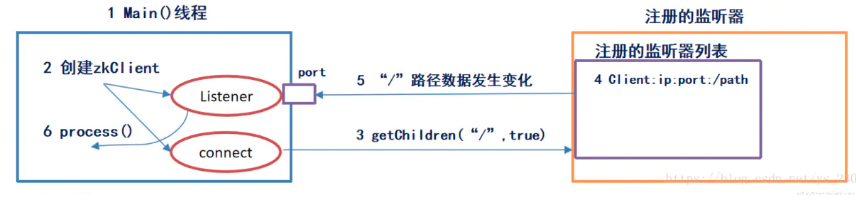
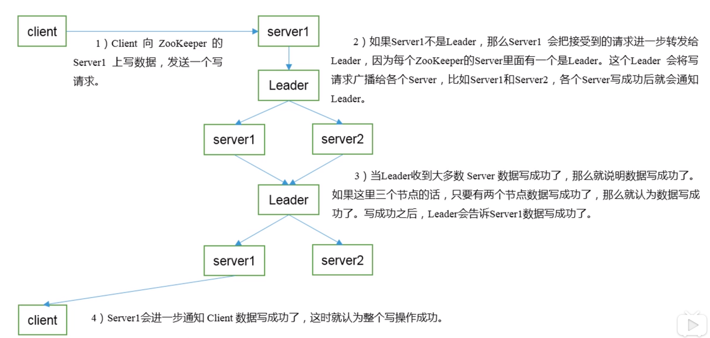

- [Zookeeper 概述](#Zookeeper-%E6%A6%82%E8%BF%B0)
  - [作用](#%E4%BD%9C%E7%94%A8)
  - [特点](#%E7%89%B9%E7%82%B9)
  - [数据结构](#%E6%95%B0%E6%8D%AE%E7%BB%93%E6%9E%84)
  - [应用场景](#%E5%BA%94%E7%94%A8%E5%9C%BA%E6%99%AF)
    - [统一命名服务](#%E7%BB%9F%E4%B8%80%E5%91%BD%E5%90%8D%E6%9C%8D%E5%8A%A1)
    - [统一配置管理](#%E7%BB%9F%E4%B8%80%E9%85%8D%E7%BD%AE%E7%AE%A1%E7%90%86)
    - [统一集群管理](#%E7%BB%9F%E4%B8%80%E9%9B%86%E7%BE%A4%E7%AE%A1%E7%90%86)
    - [服务器节点动态上下线](#%E6%9C%8D%E5%8A%A1%E5%99%A8%E8%8A%82%E7%82%B9%E5%8A%A8%E6%80%81%E4%B8%8A%E4%B8%8B%E7%BA%BF)
    - [软负载均衡](#%E8%BD%AF%E8%B4%9F%E8%BD%BD%E5%9D%87%E8%A1%A1)
  - [工作模式](#%E5%B7%A5%E4%BD%9C%E6%A8%A1%E5%BC%8F)
  - [三种端口号](#%E4%B8%89%E7%A7%8D%E7%AB%AF%E5%8F%A3%E5%8F%B7)
- [安装和使用](#%E5%AE%89%E8%A3%85%E5%92%8C%E4%BD%BF%E7%94%A8)
  - [单点](#%E5%8D%95%E7%82%B9)
    - [安装](#%E5%AE%89%E8%A3%85)
    - [运行](#%E8%BF%90%E8%A1%8C)
  - [集群部署](#%E9%9B%86%E7%BE%A4%E9%83%A8%E7%BD%B2)
  - [Docker集群](#Docker%E9%9B%86%E7%BE%A4)
- [配置](#%E9%85%8D%E7%BD%AE)
  - [日志文件重定向](#%E6%97%A5%E5%BF%97%E6%96%87%E4%BB%B6%E9%87%8D%E5%AE%9A%E5%90%91)
- [Zookeeper 内部原理](#Zookeeper-%E5%86%85%E9%83%A8%E5%8E%9F%E7%90%86)
  - [选举机制](#%E9%80%89%E4%B8%BE%E6%9C%BA%E5%88%B6)
  - [节点类型](#%E8%8A%82%E7%82%B9%E7%B1%BB%E5%9E%8B)
- [shell命令](#shell%E5%91%BD%E4%BB%A4)
  - [节点详细信息](#%E8%8A%82%E7%82%B9%E8%AF%A6%E7%BB%86%E4%BF%A1%E6%81%AF)
  - [监听原理](#%E7%9B%91%E5%90%AC%E5%8E%9F%E7%90%86)
  - [写数据流程](#%E5%86%99%E6%95%B0%E6%8D%AE%E6%B5%81%E7%A8%8B)
- [ACL](#ACL)
- [注意](#%E6%B3%A8%E6%84%8F)

> https://www.jianshu.com/p/5e012efb2d82

# Zookeeper 概述
## 作用
- 文件系统+通知机制
- 为分布式应用提供协调服务，是之间润滑剂
- 负责存储和管理大家都关心的数据，提供观察者的注册，一旦发生改变，就会通知已经在Zookeeper上注册的那些观察者

## 特点
- Zookeeper:一个领导者(Leader) ，多个跟随者(Follower) 组成的集群。

- 集群中只要有半数以上节点存活，Zookeeper集群 就能正常服务。

- 全局数据一致:每个Server保存一 份相同的数据副本，Client无论连接到哪个Server， 数据都是一 致的。4)更新请求顺序进行，来自同一个Client的更新请求按其发送顺序依次执行。

- 数据更新原子性，一次数据更新要么成功，要么失败。

- 实时性，在一定时间范围内，Client能 读到最新数据。

## 数据结构
ZooKeeper数据模型的结构与Unix文件系统很类似,整体.上可以看作是一棵树,每个节点称做一个ZNode。每一个ZNode默认能够存储1MB的数据 ,每个ZNode都可以通过其路径唯一标识。

可以把ZooKeeper当中的一个目录节点当做一个锁的互斥文件来实现并发安全控制
<div align="center">

</div>

## 应用场景
提供的服务包括：
- 统一命名服务
- 统一配置管理
- 统一集群管理
- 服务器节点动态上下线
- 软负载均衡

### 统一命名服务
<div align="center">

</div>

### 统一配置管理
<div align="center">

</div>

### 统一集群管理
<div align="center">

</div>

### 服务器节点动态上下线
<div align="center">

</div>

### 软负载均衡
<div align="center">

</div>

## 工作模式
- Standalone：单点模式，有单点故障问题。
- 伪分布式：在一台机器同时运行多个ZooKeeper实例，仍然有单点故障问题，当然，其中配置的端口号要错开的，适合实验环境模拟集群使用。
- 完全分布式：在多台机器上部署ZooKeeper集群，适合线上环境使用。

## 三种端口号
- 端口X：客户端连接ZooKeeper集群使用的监听端口号
- 端口Y：leader和follower之间数据同步使用的端口号
- 端口Z：leader选举专用的端口号

# 安装和使用
## 单点
### 安装
> 官网：https://zookeeper.apache.org/releases.html

- 官网直接安装压缩包
- 解压


### 运行
- 首次运行
  - 将配置文件zoo_sample.conf改名为zoo.conf
- 启动服务
  - `bin/zkServer.sh start`
- 查看进程是否启动成功
  - `jps`

```sh
l1nkkk@iZ2zebcdgh4e5liei40rzhZ:~/opt/zookeeper$ jps
17925 QuorumPeerMain
17962 Jps
```
- 检查状态
  - `./bin/zkServer.sh status`
  - standalone：表示单点

```sh
l1nkkk@iZ2zebcdgh4e5liei40rzhZ:~/opt/zookeeper$ ./bin/zkServer.sh status
/usr/bin/java
ZooKeeper JMX enabled by default
Using config: /home/l1nkkk/opt/zookeeper/bin/../conf/zoo.cfg
Client port found: 2181. Client address: localhost.
Mode: standalone
```
- 退出服务
  - `bin/zkServer.sh stop`

- 启动客户端
  - `./bin/zkCli.sh`

## 集群部署

- 在一台服务器上安装部署
- 使用脚本在多态服务进行文件同步
- 配置各个服务器的编号
  - **在zkData中创建myid文件，并且给他写入对应编号**。比如2。
- 配置zoo.conf
> server.A=B：C：D：  
> --A 是一个数字，表示这个是第几号服务器；  
> --B 是这个服务器的 ip 地址；  
> --C 表示的是这个服务器与集群中的 Leader 服务器交换信息的端口(上面的端口Y)；  
> --D 表示的是万一集群中的 Leader 服务器挂了，需要一个端口来重新进行选举，选出一个新的 Leader，而这个端口就是用来执行选举时服务器相互通信的端口(上面的端口Z)。  
> --如果是伪集群的配置方式，由于 B 都是一样，所以不同的 Zookeeper 实例通信端口号不能一样，所以要给它们分配不同的端口号。

```sh
server.1=192.168.211.1:2888:3888
server.2=192.168.211.2:2888:3888
```
- 之后依次启动就可以了
> 注
- 如果发生错误
  - `https://blog.csdn.net/cc1949/article/details/78196226`
- 只有leader才会开启2888

## Docker集群


# 配置

| 参数         | 作用                                                                                          |
| ------------ | --------------------------------------------------------------------------------------------- |
| tickTime     | 心跳时间周期，ms                                                                              |
| initLimit=10 | 1集群中的follower服务器(F)与leader服务器(L)之间初始连接时能容忍的最多心跳数（tickTime的数量） |
| syncLimit    | 集群中flower服务器（F）跟leader（L）服务器之间的请求和答应最多能容忍的心跳数。                |
| dataDir      | 集群中flower服务器（F）跟leader（L）服务器之间的请求和答应最多能容忍的心跳数                  |
| clientPort   | 客户端连接的端口                                                                              |

## 日志文件重定向
- https://blog.csdn.net/huanggang028/article/details/17560731

# Zookeeper 内部原理
## 选举机制
> https://www.cnblogs.com/leesf456/p/6107600.html

## 节点类型
> https://blog.csdn.net/lihao21/article/details/51810395
节点有两个维度，一个是永久的还是临时的，另一个是否有序。组合成的四种类型如下：

1：PERSISTENT：持久化节点

2：PERSISTENT_SEQUENTIAL：持久化排序节点

3：EPHEMERAL：临时节点
4：EPHEMERAL_SEQUENTIAL：临时排序节点


永久节点：节点创建后会被持久化，只有主动调用delete方法的时候才可以删除节点。

临时节点：节点创建后在创建者超时连接或失去连接的时候，节点会被删除。临时节点下不能存在字节点。

排序节点：创建的节点名称后自动添加序号，如节点名称为"node-"，自动添加为"node-1"，顺序添加为"node-2".


# shell命令
> https://www.jianshu.com/p/30752ba8059b
- 启动客户端
  - 本地：`zkCli.sh`
  - 远程：`zkCli.sh -server ip:port`
- 查看帮助
  - `help`
- 创建
  - 持久型：`create path data`
  - 短暂型：`create -e path data`,客户端宕掉就失效，这个时候监听会收到`type:NodeDeleted`类型事件
  - 带序号型：`create -s path data`
- 获取
  - `get path`
- 修改值
    - `set path data`
- 查看节点
  - `ls path`
  - 详细：`ls -s path` 或 `stat path`
- 删除
  - 删除单个：`delete path`
  - 递归删除：`deleteall path` 
- 监听
  - 监听节点变化：`get -w path`
  - 监听路径变化：`ls -w path`
  - 注：这些都是监听一次运行一次

## 节点详细信息

| 状态属性                 | 说明                                                                                     |
| ------------------------ | ---------------------------------------------------------------------------------------- |
| cZxid                    | 数据节点创建时的事务ID                                                                   |
| ctime                    | 数据节点创建时的时间                                                                     |
| mZxid                    | 数据节点最后一次更新时的事务ID                                                           |
| mtime                    | 数据节点最后一次更新时的时间                                                             |
| pZxid                    | 数据节点的子节点列表最后一次被修改（是子节点列表变更，而不是子节点内容变更）时的事务ID   |
| cversion	 子节点的版本号 |
| dataVersion              | 数据节点的版本号                                                                         |
| aclVersion               | 数据节点的ACL版本号                                                                      |
| ephemeralOwner           | 如果节点是临时节点，则表示创建该节点的会话的SessionID；如果节点是持久节点，则该属性值为0 |
| dataLength               | 数据内容的长度                                                                           |
| numChildren              | 数据节点当前的子节点个数                                                                 |

## 监听原理
<div align="center">

</div>

- 首先有一个main()线程

- 在main线程中创建Zookeeper客户端，会创建两个线程，connect负责网络连接通信，listener负责监听

- 通过connect线程将注册的监听事件发送给Zookeeper

- 在Zookeeper的注册监听器列表中将注册的监听事件添加到列表中

- Zookeeper监听到有数据或路径变化，就会将这个消息发送给listener线程

- listener线程内部调用了process（）方法

## 写数据流程
<div align="center">

</div>

# ACL
> https://blog.csdn.net/liuxiao723846/article/details/79391650

# 注意
- ZooKeeper虽然提供了在节点存储数据的功能，但它并不将自己定位为一个通用的数据库，也就是说，你不应该在节点存储过多的数据。Zk规定节点的数据大小不能超过1M，但实际上我们**在znode的数据量应该尽可能小**，因为数据过大会导致zk的性能明显下降。如果确实需要存储大量的数据，一般解决方法是在另外的分布式数据库（例如redis）中保存这部分数据，然后在znode中我们只保留这个数据库中保存位置的索引即可。
