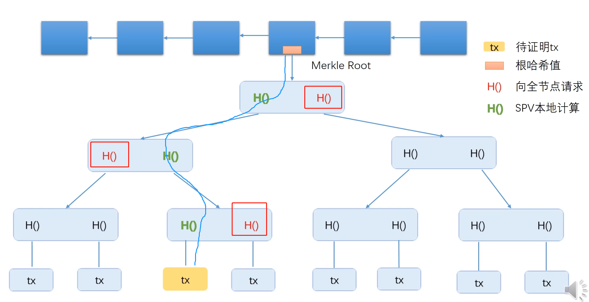
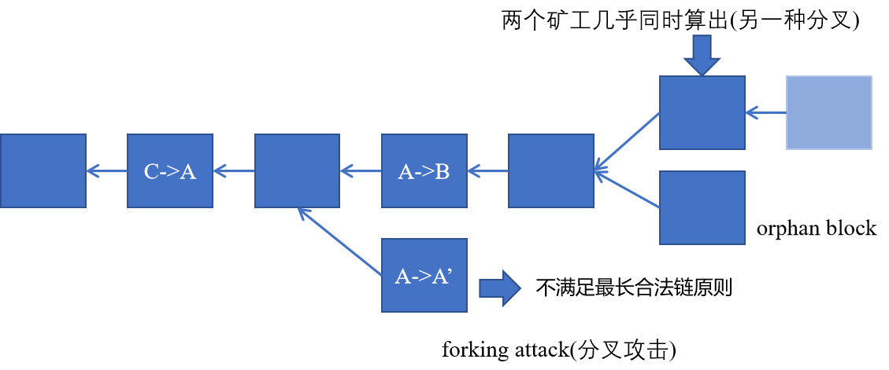

- [概述](#概述)
- [BTC 密码学基础](#btc-密码学基础)
  - [hash](#hash)
  - [签名](#签名)
- [BTC数据结构](#btc数据结构)
  - [hash pointer](#hash-pointer)
  - [Merkle tree](#merkle-tree)
    - [Merkle tree 作用：提供 Merkle proof](#merkle-tree-作用提供-merkle-proof)
- [BTC 协议](#btc-协议)
  - [引入: 数字货币（中心化）](#引入-数字货币中心化)
  - [去中心化](#去中心化)
  - [简化结构及其验证](#简化结构及其验证)
  - [Block Header/Body](#block-headerbody)
  - [一致性（分布式共识）](#一致性分布式共识)
  - [分叉](#分叉)
# 概述
- 下一代的价值互联网
- 世界上最慢的数据库
- 不要被bitcoin 限制了blockchain的想象力

> 比特币的价格走势（20220120）
<div style="zoom:80%" align="center"></div>


> 加密货币市场份额占比（20220120）
- https://coinmarketcap.com/charts/
<div style="zoom:80%" align="center"></div>

> 课程参考和大纲
<div style="zoom:40%" align="center"></div>
<div style="zoom:40%" align="center"></div>
<div style="zoom:40%" align="center"></div>


- 以太坊变化很快，文档有时候都和其目前实现不对应，最好的了解方式是看源码
# BTC 密码学基础
- ctypto-currency：加密货币其实内容并不加密，相反却是公开的。涉及到的密码学知识主要有两个：
  - hash
  - 前面

## hash
- 利用到了 hash 的三个特性：
  1. collision resistance：抗碰撞，很难构造一对碰撞的hash
     - 其实该性质不能够被证明，只能通过实践经验
  2. hiding：单向，不泄露输入的任何信息。
     - 条件：输入空间够大，且分布均匀。（不然很容易穷举，生成字典）。
     - H(msg || nonce) 可以保证输入空间够大。
  3. puzzle friendly：计算满足某条件的hash，只能穷举。
     - 0000xxxxx
     - 挖矿: `H(block_header || nonce) ≤ target`，算出满足条件的 nonce。difficult to solve, but easy to verify

- bitcoin 使用 sha256


## 签名
- bitcoin 的开户方式（去中心化），自己创建一对公私钥对就行。
- 性质：产生同一公私钥对的概率很小，可以忽略
  - 前提：a good source of randonness
- 注意：生成公钥和签名期间要有好的随机源，否则容易泄露私钥。


# BTC数据结构
- hash pointer 和 Merkle tree
## hash pointer
- hash pointer: 除了存对象的地址，还有存一个hash值，用来防篡改
  - 任何无环结构都可以使用hash pointer 代替 pointer。有环会出现相互依赖。
- 区块链：比特币中最基本的数据结构。由一个个区块组成的链表，用 hash pointer 代替普通指针。

<div style="zoom:40%; background-color: #ffffff;" align="center "></div>

- 用户可以进保存一部分，用到了再从其他节点找
- 恶意节点无法修改某个块，牵一发动全身。可以用最后一个块的hash，检验整个区块链

> 问题：
- 验证很早之前的block，那岂不是整个验证的链很长。
- 用户可以只存储一部分链，那么如何保证这整个部分链不是伪造的。
- 有没有可能某个人伪造了所有的block。
## Merkle tree
- Merkle tree 与 Binary tree 最主要的区别：使用了 hash pointer 代替普通的 pointer
- BTC中，每个区块组织成区块链，每个区块中的交易组织成 Merkle tree。
  - Merkle tree 中的每个 data block 为一个 交易。
- 每个区块分为两部分：
  - Block Header：包含 root hash，但没有区块中具体的交易信息。
  - Block body

- light node(轻节点) & full node(全节点)
  - light node：只保存 block header。比如手机上的BTC钱包
  - full node：整个merkle树都保存。

### Merkle tree 作用：提供 Merkle proof
> proof of membership/inclusion
- 目的：向 轻节点 证明**存在**某个交易（比如证明对方已经转账）
- 过程
  - 全节点 向 轻节点 提供红色部分的hash值
  - 轻节点 自己计算绿色部分的hash值
  - 自底向上计算，最后和 root hash 比对，即可证明
- 时间复杂度：o(log(n))
<div style="zoom:40%; background-color: #ffffff;" align="center "></div>

- light node 只能验证交易所在的分支，其他的hash值无法验证（包括 full node 所提供的），表面上似乎给篡改数据提供自由度
- 如果全节点是恶意的，其无法修改黄色的tx同时构造其相邻tx的hash，使得最终计算得到的结果和root hash 比对可以通过。
  - 原因：collision resistance

> proof of non-membership
- 目的：向 轻节点 证明**不存在**某个交易（比如证明对方已经转账）
- 最简单的方法，full node 发送整个 mercle tree 给 light node，然后分别去验证整个树的正确性
  - 复杂的：o(n)

- 高效方法：对mercle tree叶子节点进行hash值**从小到大排序**。
  - light node 先对要查询的 tx 生成一个hash，发送给 full node
  - full node 发送如下黄色部分内容，light 只需对其进行验证，即可证明如下两个交易是相邻的。如果这两个交易都不是所检索的，则证明该交易不存在。


<div style="zoom:40%; " align="center "></div>

# BTC 协议
## 引入: 数字货币（中心化）
<div style="zoom:40%; " align="center "></div>

- 假设：央行的私钥不会泄露
- 问题：double spending attack，即同一个电子货币可能被花两次

> 解决
- 对数字货币进行编号，并用数据库进行持有者记录，由CB统一验证
<div style="zoom:40%; " align="center "></div>

- 问题：
  - 正确性没有问题
  - 中心化问题
    - 如何去中心化

## 去中心化
- 两个问题：
  - 货币什么时候发行，发行多少
    - 铸币tx，区块奖励
  - 如何验证交易的有效性
    - 特殊数据结构，所有用户共同维护

## 简化结构及其验证
<div style="zoom:40%; background: #ffff;" align="center "></div>

- 上图说明：做了简化，实际上每个区块可以有很多交易，这些交易组织成 Mercle Tree

- BTC 系统中，每个账单(tx) 有输入和输出两部分
  - 输入：指向来源
  - 输出：收款人公钥的hash
- 上图涉及两种 hash pointer
  - 一种是区块间的 hash pointer
  - 一种为账单中指向货币来源的 hash pointer
    - 证明来源，防止 `double spending`。通过迭代回溯到输入所指向的区块，判断在这个子链中，其BTC是否被花过。

> 问题：A->B，A 如何知道 B的账户
- B 主动告知，类似于商家给你一个付款二维码

> 问题：B和其他节点如何知道A的公钥
- 为什么需要A的公钥：验证 tx 身份
- 如何告知
  - 直接卸载区块中的输入
- 如何防伪造公钥（比如B伪造了一个公钥，自己签名）
  - 每个tx中的输出都有收款人的公钥hash。溯源的时候，验证一下输入指向的区块中，A的公钥的hash与现给的公钥的hash是否一致，就可以防止伪造

## Block Header/Body
<div style="zoom:40%; background: #ffff;" align="center "></div>

- Block Header
  - version: BTC version
  - hash pointer: hash pointer of previous block header
  - Merkle root hash: merkle tree 的根hash
  - target: 挖矿相关
  - nonce: 矿工计算出来的nonce值

- Block Body: transaction

- node
  - full node：存储Block Header and Block Body
  - light node(大多数)：没参与区块链的构造和维护，只是利用一些信息做查询。只存储 Block Header

## 一致性（分布式共识）
- 假设：只有少部分恶意节点，如何设计

> 用户投票是否可行？
- 如果让每个用户各一票，来进行投票一致性决定，抛开效率不说，会容易遭受 **`sybil attack`**。
  - 某台服务器上创建大量的账户，来参与投票，一旦账户为系统的大多数，那么就可以掌握这个系统记账权
  - 除此之外，如何确定大多数也是一个问题

> 算力决定投票份额
- 过程
  - 本地组装候选Block。
  - `H(BlockHeader || nonce) ≤ target`： 计算nonce。
  - 其他节点（full node）vertify，成功则加入到本地区块链。

- 特点：**投票靠算力，与账户数无关**
  - 防止 sybil attack
> 节点为何记账，how to drive
- 可以决定哪些区块写入区块——不该成为主要动力
- **区块奖励**：**货币的发行的唯一方法**
  - 通过铸币tx（coin base），不用指定来源

```
# 每记录一个区块
50BTC ---(21w block 之后)--->  25BTC ---(21w block 之后)---> 12.5（目前阶段，2018） ---> ...
```

## 分叉
> 分叉攻击
- 抵制措施：最长合法链攻击，区块链往长链扩展
- 场景：有一个恶意的节点，故意产生一个会导致分叉的区块。这个区块是合法的（没有伪造的交易），其他节点通过最长合法链原则，会拒绝该区块

<div style="zoom:40%; background: #ffff;" align="center "></div>

> 自然产生的分叉
- 场景：当两个矿工几乎同时发布nonce，每个节点短时间内先后收到这两个区块，这个时候最长链原则不适用。
  - 这种情况的**分叉会维持一段时间**，根据后续节点的增长情况，来判断到底选择了哪个区块
  - 一批节点中，每个节点都会选择一个方向进行扩展，这个时候看谁的运气好，以及看谁的算力更强，形成更长的链
- 问题：
  - 旧的怎么办？