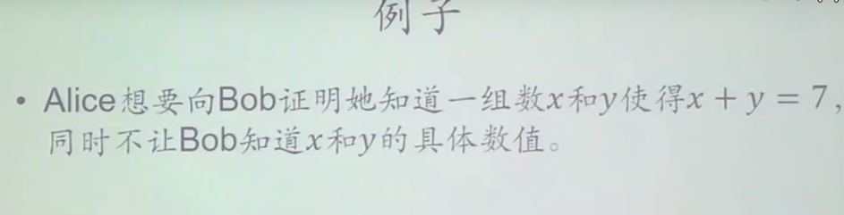

- [概述](#概述)
- [BTC 密码学基础](#btc-密码学基础)
  - [hash](#hash)
  - [签名](#签名)
- [BTC数据结构](#btc数据结构)
  - [hash pointer](#hash-pointer)
  - [Merkle tree](#merkle-tree)
    - [Merkle tree 作用：提供 Merkle proof](#merkle-tree-作用提供-merkle-proof)
- [BTC 协议](#btc-协议)
  - [引入: 数字货币（中心化）](#引入-数字货币中心化)
  - [去中心化](#去中心化)
  - [简化结构及其验证](#简化结构及其验证)
  - [Block Header/Body](#block-headerbody)
  - [一致性（分布式共识）](#一致性分布式共识)
  - [分叉](#分叉)
- [BTC 实现](#btc-实现)
  - [基于交易的账本模式](#基于交易的账本模式)
  - [Block && Transaction](#block--transaction)
    - [block summary](#block-summary)
    - [Transaction](#transaction)
  - [挖矿的概率分析](#挖矿的概率分析)
  - [BTC 记账](#btc-记账)
    - [forking attack](#forking-attack)
    - [Selfish mining](#selfish-mining)
- [BTC 网络](#btc-网络)
- [BTC 挖矿难度](#btc-挖矿难度)
- [BTC 挖矿](#btc-挖矿)
  - [矿池](#矿池)
- [BTC 脚本](#btc-脚本)
  - [交易结构](#交易结构)
    - [tx输入结构](#tx输入结构)
    - [tx输出结构](#tx输出结构)
    - [输入输出脚本的运行](#输入输出脚本的运行)
    - [输入输出脚本的形式](#输入输出脚本的形式)
  - [多重签名](#多重签名)
  - [proof of Burn](#proof-of-burn)
- [BTC 分叉](#btc-分叉)
  - [hard fork](#hard-fork)
  - [soft fork](#soft-fork)
- [BTC 匿名性](#btc-匿名性)
  - [匿名性保护](#匿名性保护)
  - [零知识证明](#零知识证明)
  - [盲签方法](#盲签方法)
  - [零币和零钞](#零币和零钞)
- [BTC QA](#btc-qa)
# 概述
- 下一代的价值互联网
- 世界上最慢的数据库
- 不要被bitcoin 限制了blockchain的想象力

> 比特币的价格走势（20220120）
<div style="zoom:80%" align="center"></div>


> 加密货币市场份额占比（20220120）
- https://coinmarketcap.com/charts/
<div style="zoom:80%" align="center"></div>

> 课程参考和大纲
<div style="zoom:40%" align="center"></div>
<div style="zoom:40%" align="center"></div>
<div style="zoom:40%" align="center"></div>


- 以太坊变化很快，文档有时候都和其目前实现不对应，最好的了解方式是看源码
# BTC 密码学基础
- ctypto-currency：加密货币其实内容并不加密，相反却是公开的。涉及到的密码学知识主要有两个：
  - hash
  - 签名

## hash
- 利用到了 hash 的三个特性：
  1. collision resistance：抗碰撞，很难构造一对碰撞的hash
     - 其实该性质不能够被证明，只能通过实践经验
  2. hiding：单向，不泄露输入的任何信息。
     - 条件：输入空间够大，且分布均匀。（不然很容易穷举，生成字典）。
     - H(msg || nonce) 可以保证输入空间够大。
  3. puzzle friendly：计算满足某条件的hash，只能穷举。
     - 0000xxxxx
     - 挖矿: `H(block_header || nonce) ≤ target`，算出满足条件的 nonce。difficult to solve, but easy to verify

- bitcoin 使用 sha256


## 签名
- bitcoin 的开户方式（去中心化），自己创建一对公私钥对就行。
- 性质：产生同一公私钥对的概率很小，可以忽略
  - 前提：a good source of randonness
- 注意：生成公钥和签名期间要有好的随机源，否则容易泄露私钥。


# BTC数据结构
- hash pointer 和 Merkle tree
## hash pointer
- hash pointer: 除了存对象的地址，还有存一个hash值，用来防篡改
  - 任何无环结构都可以使用hash pointer 代替 pointer。有环会出现相互依赖。
- 区块链：比特币中最基本的数据结构。由一个个区块组成的链表，用 hash pointer 代替普通指针。

<div style="zoom:40%; background-color: #ffffff;" align="center "></div>

- 用户可以进保存一部分，用到了再从其他节点找
- 恶意节点无法修改某个块，牵一发动全身。可以用最后一个块的hash，检验整个区块链

> 问题：
- 验证很早之前的block，那岂不是整个验证的链很长。
- 用户可以只存储一部分链，那么如何保证这整个部分链不是伪造的。
- 有没有可能某个人伪造了所有的block。假设大多数都是可信的，那么某些恶意用户构成不了什么威胁，那其他用户如何知道他拿到的东西是可信的，如果刚好的拿到的全是从恶意的节点来的怎么办？
  - 可以，但是没必要，伪造成本太高了，需要挖到nonce值。攻击者即使自己构造块，也无法构造tx，所以其自己只能扰乱系统，而不能获利


## Merkle tree
- Merkle tree 与 Binary tree 最主要的区别：**使用了 hash pointer 代替普通的 pointer**
- BTC中，每个区块组织成区块链，每个区块中的交易组织成 Merkle tree。
  - Merkle tree 中的每个 data block 为一个 交易。
  -  data block 为叶子节点
- 每个区块分为两部分：
  - Block Header：包含 root hash，但没有区块中具体的交易信息。
  - Block body

- light node(轻节点) & full node(全节点)
  - light node：只保存 block header。比如手机上的BTC钱包
  - full node：整个merkle树都保存。

### Merkle tree 作用：提供 Merkle proof
> proof of membership/inclusion
- 目的：向 轻节点 证明**存在**某个交易（比如证明对方已经转账）
- 过程
  - 全节点 向 轻节点 提供红色部分的hash值
  - 轻节点 自己计算绿色部分的hash值
  - 自底向上计算，最后和 root hash 比对，即可证明
- 时间复杂度：o(log(n))
<div style="zoom:40%; background-color: #ffffff;" align="center "></div>

- light node 只能验证交易所在的分支，其他的hash值无法验证（包括 full node 所提供的），表面上似乎给篡改数据提供自由度
- 如果全节点是恶意的，其无法修改黄色的tx同时构造其相邻tx的hash，使得最终计算得到的结果和root hash 比对可以通过。
  - 原因：collision resistance

> proof of non-membership
- 目的：向 轻节点 证明**不存在**某个交易（比如证明对方已经转账）
- 最简单的方法，full node 发送整个 mercle tree 给 light node，然后分别去验证整个树的正确性
  - 复杂度：o(n)

- 高效方法：对mercle tree叶子节点进行hash值**从小到大排序**。
  - light node 先对要查询的 tx 生成一个hash，发送给 full node
  - full node 发送如下黄色部分内容，light 只需对其进行验证，即可证明如下两个交易是相邻的。如果这两个交易都不是所检索的，则证明该交易不存在。


<div style="zoom:40%; " align="center "></div>

# BTC 协议
## 引入: 数字货币（中心化）
<div style="zoom:40%; " align="center "></div>

- 假设：央行的私钥不会泄露
- 问题：double spending attack，即同一个电子货币可能被花两次

> 解决
- 对数字货币进行编号，并用数据库进行持有者记录，由CB统一验证
<div style="zoom:40%; " align="center "></div>

- 问题：
  - 正确性没有问题
  - 中心化问题
    - 如何去中心化

## 去中心化
- 两个问题：
  - 货币什么时候发行，发行多少
    - 铸币tx，区块奖励
  - 如何验证交易的有效性
    - 特殊数据结构，所有用户共同维护

## 简化结构及其验证
<div style="zoom:40%; background: #ffff;" align="center "></div>

- 上图说明：做了简化，实际上每个区块可以有很多交易，这些交易组织成 Mercle Tree

- BTC 系统中，每个账单(tx) 有输入和输出两部分
  - 输入：指向来源
  - 输出：收款人公钥的hash
    - 没有直接暴露公钥
- 上图涉及两种 hash pointer
  - 一种是区块间的 hash pointer
  - 一种为账单中指向货币来源的 hash pointer
    - 证明来源，防止 `double spending`。通过迭代回溯到输入所指向的区块，判断在这个子链中，其BTC是否被花过。

> 问题：A->B，A 如何知道 B的账户
- B 主动告知，类似于商家给你一个付款二维码

> 问题：B和其他节点如何知道A的公钥
- 为什么需要A的公钥：**验证 tx 身份**
- 如何告知
  - 直接写在区块中的输入
  - **只有转账给其他人的时候，才会暴露公钥**
- 如何防伪造公钥（比如B伪造了一个公私钥对，自己签名）
  - 每个tx中的输出都有收款人的公钥hash。溯源的时候，验证一下输入指向的区块中，A的公钥的hash与现给的公钥的hash是否一致，就可以防止伪造

## Block Header/Body
<div style="zoom:40%; background: #ffff;" align="center "></div>

- Block Header
  - version: BTC version
  - hash pointer: hash pointer of previous block header
  - Merkle root hash: merkle tree 的根hash
  - target: 挖矿相关
  - nonce: 矿工计算出来的nonce值

- Block Body: transaction

- node
  - full node：存储Block Header and Block Body
  - light node(大多数)：没参与区块链的构造和维护，只是利用一些信息做查询。只存储 Block Header

## 一致性（分布式共识）
- 假设：只有少部分恶意节点，如何设计

> 用户投票是否可行？
- 如果让每个用户各一票，来进行投票一致性决定，抛开效率不说，会容易遭受 **`sybil attack`**（女巫攻击）。
  - 某台服务器上创建大量的账户，来参与投票，一旦账户为系统的大多数，那么就可以掌握这个系统记账权
  - 除此之外，如何确定大多数也是一个问题

> 算力决定投票份额
- 过程
  - 本地组装候选Block。
  - `H(BlockHeader || nonce) ≤ target`： 计算nonce。
  - 其他节点（full node）vertify，成功则加入到本地区块链。

- 特点：**投票靠算力，与账户数无关**
  - 防止 sybil attack
> 节点为何记账，how to drive
- 可以决定哪些区块写入区块链——不该成为主要动力
- **区块奖励**：**货币的发行的唯一方法**
  - 通过铸币tx（coin base），不用指定来源

```
# 每记录一个区块
50BTC ---(21w block 之后)--->  25BTC ---(21w block 之后)---> 12.5（目前阶段，2018） ---> ...
```

## 分叉
> 分叉攻击
- 抵制措施：最长合法链，区块链往长链扩展
- 场景：有一个恶意的节点，故意产生一个会导致分叉的区块。这个区块是合法的（没有伪造的交易），其他节点通过最长合法链原则，会拒绝该区块

<div style="zoom:40%; background: #ffff;" align="center "></div>

> 自然产生的分叉
- 场景：当两个矿工几乎同时发布nonce，每个节点短时间内先后收到这两个区块，这个时候最长链原则不适用。
  - 这种情况的**分叉会维持一段时间**，根据后续节点的增长情况，来判断到底选择了哪个区块
  - 一批节点中，每个节点都会选择一个方向进行扩展，这个时候看谁的运气好，以及看谁的算力更强，形成更长的链。
  - 我的想法：如果发现两个分叉一样长，这时如果需要插入新块，从中选择一个进行插入（运气）。如果是算出前一个分块的节点，那么其肯定是插入到自己的分叉（算力）。
    - 每十分钟大概一个区块，这个时间段有能力去完成区块链一致性
- 问题：
  - 旧的怎么办？

# BTC 实现

## 基于交易的账本模式
- **基于交易的账本模式**（transaction-base ledger）
  - 转账交易
  - 铸币交易
- 区别以太坊：
  - account-base ledger，基于账户的模式
  - 以太坊系统会显示记录每个系统有多少个币
  - 比特币隐私性要好一些，但是比较复杂。
- 特点：没有记录账户的余额，只能通过交易记录来推算出来。
  - 直接从UTXO快速算出

> UTXO: Unspent Transaction Output
- UTXO：还没被花出去的交易的输出集合
  - 每个元素: `(产生该输出的交易的hash, 在该交易中是第几个偏移)`
- 作用： **以便快速检测到 Double Spending**
- 记录在 **full node** 中
- 注：
  - 一个交易可能有多个输出
  - 每个交易要消耗一些UTXO元素，同时会产生新的输出作为UTXO元素。
```sh
# tx1
A-->B(3)
 |->C(5)
# tx2
B-->D(3)

# UTXO
C(5)
D(3)
```

> total inputs == total outputs
- **激励机制**
  - block reward
  - transaction fee
    - 奖励非常少
- 发布区块的节点为什么要将你的交易打包到区块里？
  - **transaction free**
- 注：
  - 一些交易没有交易费。
  - 21W block —— 4Y

## Block && Transaction
- 查看：https://www.blockchain.com/explorer
- 参考：https://zhuanlan.zhihu.com/p/75342764

### block summary 
<div style="zoom:40%; " align="center "></div>

- Output Total: 指在这个区块中总的输出
- Height 529709 : 区块高度(从0递增)
- Difficulty：这个是现在的挖矿难度系数。为了保证出块时间稳定在10分钟，所以每挖出2016个区块，挖矿难度会改变一次，这个周期大约是两个星期。难度的改变是根据上2016个区块的挖矿效率来决定的。可以用下列公式来表达。
  - `下一个难度=（上一个难度 x 2016 x 10分钟）/(产生上2016个区块所花费的时间)`
- Size：这个是区块大小是333.53KB.比特币中整个区块的大小控制在1M以内，比特币在刚产生时，交易非常少，一个区块才几KB，当时1M容量足够用。而现在比特币交易上升速度非常快，1MB空间不够用，造成交易拥堵，所以比特币扩容势在必行，只是扩容的技术方案上存在着许多争论。
- Bits：目标阈值，挖款难度相关，定期调整
- Weight：区块重量，主要是隔离见证和矿工使用的


> nonce
- 问题：只有2^32的可能性，按当前挖矿难度，全部遍历都可能找不到符合挖矿难度标准的要求
  - Block Header 里面看看哪些地方能改——**merkle root hash**
<div style="zoom:40%; " align="center "></div>
<div style="zoom:40%; " align="center "></div>

- **merkle root hash** 更改方式：调整**铸币交易**中的CoinBase
  - CoinBase里面可以填任何信息
- **搜索空间增加到了2^96**
  - 外层循环调整 coinbase，内层循环调整 nonce
<div style="zoom:40%; " align="center "></div>


### Transaction

- 输入和输出都是用脚本的形式来指定，比特币系统中，验证交易的合法性为：
  - 把input script（当前tx） 和 output script（输入执行的tx）配对后执行来完成的
  - 如果脚本拼接在一起能够顺利执行，不出现错误，则tx合法
<div style="zoom:40%; " align="center "></div>

## 挖矿的概率分析
- **挖矿每次尝试 nonce 可以看成是一个 Bernoulli trial**
  - Bernoulli trial（伯努利试验） : a random experiment with binary outcome（抛硬币）
  - **挖矿公平性的保证**
- **Bernoulli process** : a sequence of independent Bernoulli trial
  - **memoryless(无记忆性)** : 前面的结果不会影响本次
- **Bernoulli process 可以用 `Poisson process` 来近似**。
  - 试验的次数很多，每次成功概率很少
<div style="zoom:40%; " align="center "></div>

- 如果某一个节点已经挖了10分钟了，那么其接下来继续挖，还是需要大约大分钟。
- 如果不是这种 memoryless 的性质，会导致什么情况？
  - **会造成不成比例的优势**。算力 1：10 的两个机子，其挖到矿的概率大于 1:10 因为前面算的比较多，积累了许多经验，后面挖到的概率会更大。

- 比特币挖矿除了比拼算力，没有其他实际意义。出块奖励越来越少，但是 BTC 价值越来越高。
## BTC 记账
- geometric series（几何序列）
  - 数量：`21w*50+21w*25+21w*12.5+...` = 21w * 50 * (1+1/2+1/4+...) = 2100w

- 挖矿对于实际求解数学难题没什么意义，但是该**过程对维护安全性至关重要**。
  - **BitCoin is secured by mining**
- 安全假设前提：大多数节点是非恶意的。
  - 不能保证记账权不会落到恶意节点（只能保障大概率不会）
- 记账权落到恶意节点M，恶意节点能干嘛
  - 偷币？不能。 A->M 的交易需要 A 的签名，需要 A 的私钥
    - 如果硬写偷币tx到区块链怎么办？无效，诚实节点不会接受，因为其包含非法交易。（偷鸡不成）
  - Double Spending（forking attack）
  - 故意不记录某些合法交易？可以，问题不大。这些tx还是可以被写入其他区块，正常情况也会出现这种情况，比如某段时间交易过多

### forking attack
- 攻击者M->A转账，但是其想 Double attack，其故意产生一个新分支区块。
<div style="zoom:40%; " align="center "></div>

- 防范：多等几个区块再确认，默认 six confirmation。需要等一个小时。
  - 不影响大多数交易，比如付钱和发货之间有延迟，没到账取消发货就行了。 
<div style="zoom:40%; " align="center "></div>

- irrevocable ledger（不可篡改性）：只是一种概率保证，刚写的区块还是比较容易改，多等几个block，被攻击的概率大幅下降 


- Zero confirmation：tx一发布，就算付款成功

### Selfish mining
- 过程：自己挖矿，挖到后先不发布，自己偷偷挖，等挖到了一连串的区块，再全部发布出去
  - 好处1：可以用来减少下个区块的竞争，但是可能前面的别人也挖出来了，自己前面挖到的输入就可能损失了
    - 如果不发布就是自己挖，别人还在挖前一个公布的区块。
    - 如果自己已经挖两个了，看到别人挖到了一个，自己马上发布，别人的就无效了
    - 如果别人公布的进度和自己偷偷挖的等长，有自己挖的作废的风险，需要自己马上发布，和别人抢一抢。
  - 好处2：构造M->M'，之后不发布，等有一连串，再全部发布，替代M->A
  - 注：成功概率很小

# BTC 网络
- **P2P方式**
- BTC中所有节点都是平等的，**没有 Super node**
- 如果要加入网络，需要一个**种子节点**（seed node）
- 设计原则：**简单、鲁棒，而不是高效**
- 传输是一种 **flooding** 的形式，收到消息后，记录，并广播给所有邻居节点
  - 邻居节点选举是**随机**的，不考虑物理拓扑结构。（鲁棒性强，但牺牲效率）
- 每个节点中要维护一个**等待善变交易的集合**（还没构成区块加入区块链中的），收到一个tx则写入该集合并转发
  - 转发前提：该tx是合法的（有合法签名，没被花过）
  - 冲突时：如A->B，A->C（假如其花的同样的币），先听到哪个加入哪个，有冲突的就不用加入了。如果中途发现区块链中是A->C，那么 A->B 或 A->C 都要在该集合中删除

- best effort：尽最大能力交付
  - 可能收到的顺序不一致，可能不一定收到，可能存在很大延迟
  - 可能转发不合法的，可能不转发合法的（恶意节点）

# BTC 挖矿难度
- H(block header) ≤ target
  - 挖矿难度与目标阈值（target）成反比
- difficulty=(difficulty_1_target)/target
  - 难度最小为1
  - difficulty_1_target难度为1时的目标阈值
> 为什么调
1. 挖矿1s，传播1min
2. 容易分叉（甚至多分叉）
   - 对达成一致性和安全性无好处。算力分散在分叉，更容易受到fork attack。
   - 比如十个分叉，算力就被分散了

> 怎么调
- 间隔：2016 blocks，约14天
- `next_target = target * actual time/expected time`
  - `actual time` : time spent mining the last 2016 block
  - `expected time` : 2016 * 10

- next_target 为 256 bit，32Bytes。**nBits** 可以看成压缩编码形式，为4Bytes。
  - nBits 前面的 block 摘要有提到
> 怎么一致调
- 如果没调，大多数诚实节点会拒绝。

> 参数怎么定的
- 未知，可能是中本聪拍脑袋
- 从下图可以看到，算力和挖矿难度曲线基本一致
<div style="zoom:40%;font-size: 24px;" align="center "><span >算力</span></div>
<div style="zoom:40%; font-size: 24px;"" align="center "><span >挖矿难度</span></div>

# BTC 挖矿

<div style="zoom:40%; font-size: 24px;"" align="center "></div>
<div style="zoom:40%; font-size: 24px;"" align="center "></div>

- **挖矿设备演变**:CPU-->GPU-->ASIC(Application Specific Integrated circuit)
  - 性价比：CPU中很多指令是用不到的，内存中也只是用到了一小部分，大部分用不到
    - GPU中用于浮点数计算的部件也有点浪费，比特币挖矿只用到整数操作
  - 趋势：**通用==>专用**
  - ASIC 专门为挖矿设计，而且为某种加密货币设计的ASIC，只能挖那种货币。除非用一样的 **mining puzzle**
    - ASIC矿机头两个月为主要利润来源
- Alternative mining puzzle：目的是让通用的计算机也能够挖矿（ASIC resistance）
  - 有人认为ASIC这种趋势，违背比特币的初衷

## 矿池
- 矿池：有一个pool manager，其他为miner
  - pool manager（矿主）：负责全节点的其他职责，监听网上交易，交易打包。以及指派任务
  - miner（矿工）：只负责计算hash值

- 作用：
  - ASIC芯片只能计算hash值，不能干全节点的其他功能
  - 解决收入不稳定的问题。不同矿主加入矿池，大家一起挖，挖到了分红


- **矿池危害**：可以吸引矿工（赔本赚吆喝），发动攻击。
  - Double Spending：如果有51%的算力，则可以在被分叉区块有六个确认区块时（这时被认定为交易成功了），进行分叉攻击，因为其追赶速度快，在某个时间点会比原来的链更长。
    - 另外，**不要把51%当成攻击门槛**，都是概率性的
  - Boycott：不让某个用户的tx上链。比如不让用户A上链，当区块上有A的tx，立即分叉攻击
    - 与Double spending 区别：没必要等后序有六个区块确认（confirmation）。


- 注：
  - 矿工**转换矿池是很容易的**，加入矿池，只要**根据矿池的协议与矿主联系**，矿主将组装好的区块发给矿工，矿工进行nonce计算。
  - 矿主需要收取一定比例的出块奖励作为管理费，有的是抽取交易费


> 如何评价每个miner的工作量
- **share**：也称为almost valid block，不是一个合法的nonce，是一个降低难度后可以合法的nonce值。
  - 矿工挖到这个share后交给矿主，矿主进行记录，用来作为工作量证明。后面等到真正挖到某个区块，再按每个miner 提供的share个数进行分配。
- 问题1：miner 挖到了之后，不交给矿主，自己提交怎么办
  - 不可能，因为coinbase里面写的是矿主的地址。

> 矿池算力（2022.01）
- https://www.buybitcoinworldwide.com/mining/pools/
<div style="zoom:60%; font-size: 24px;" align="center "></div>

> 单个矿池算力(2014.12)
- GHash.IO在当时引起恐慌，算力占了大多数，随后GHash主动减少算力
<div style="zoom:60%; font-size: 24px;" align="center "></div>

> 目前矿池算力
- https://btc.com/stats/pool
<div style="zoom:60%; font-size: 24px;" align="center "></div>

# BTC 脚本
- 基于栈的语言：只能访问堆栈

## 交易结构
<div style="zoom:30%; font-size: 24px;" align="center "></div>

> 交易结构
- size：交易大小
- locktime：交易生效时间，0表示立即生效，如果非0，那么该交易要等一段时间才生效，比如10个区块之后再写入区块链
- vin：输入
- vout：输出
- blockhash：交易所在区块的hash
  - 应该不需要存在tx
- confirmation：该交易已经有多少个确认信息
  - 还没打包的时候，值为0。打包在最新区块时，值为1。增加新区块时再迭代++。
- time：交易产生的时间
- blocktime：区块产生的时间

### tx输入结构
- txid：之前交易的hash
- vout：txid交易的第几个输出
- scriptSig：输入脚本
<div style="zoom:30%; font-size: 24px;" align="center "></div>

### tx输出结构
- value：输出金额
- n：序号
- scriptPubKey：输出脚本
  - asm：输出脚本内容
  - reqSig：说明输出需要多少个签名才能兑现
  - type：输出类型
<div style="zoom:40%; font-size: 24px;" align="center "></div>

### 输入输出脚本的运行
- 过程
  - 早期，两个脚本拼接在一起执行，后来处于安全的考虑，这两个脚本改为分别执行。先执行输入脚本，没有出错，再执行输入脚本，如果最后栈顶为非0值，即true，则验证通过。
  - 如过有多个输入脚本，则每个输入脚本都要和对应的输出脚本进行匹配，从而进行验证，全部验证通过交易才算合法

### 输入输出脚本的形式
> P2PK(Pay to Public Key)
- 最简单的形式，因为pubkey直接再输出脚本给出
- 解析：
  - PUSHDATA：压栈
  - Sig：签名
    - 用私钥对输入脚本所在的整个交易的签名
  - pubkey：公钥
  - CHECKSIG：验证签名
<div style="zoom:40%; font-size: 24px;" align="center"></div>

- 实例如下：
<div style="zoom:40%; font-size: 24px;" align="center"></div>

> P2PKH(Pay to Public Key Hash)
- 最常用的形式
- 输出脚本中没有给出公钥，而是公钥的hash，这时需要输入提供。

- 解析：
  - DUP：复制栈顶
  - HASH160：对栈顶取hash
  - EQUALVERIFY：弹出栈顶两个元素，判断是不是相等的
    - 防止冒名顶替

<div style="zoom:40%; font-size: 24px;" align="center"></div>

- 实例如下：
<div style="zoom:40%; font-size: 24px;" align="center"></div>


> P2SH(Pay to Script Hash)
- 最复杂的一种
- 为什么有：对多重签名的支持
- 输出提供的不是收款人公钥的hash，而是收款人脚本的hash
  - redeemScript：赎回脚本
<div style="zoom:40%; font-size: 24px;" align="center"></div>

- 用P2SH实现P2PK：
  - 第一阶段验证
  - 第二阶段验证
<div style="zoom:40%; font-size: 24px;" align="center"></div>
<div style="zoom:40%; font-size: 24px;" align="center"></div>
<div style="zoom:40%; font-size: 24px;" align="center"></div>

## 多重签名
- 背景：某个公司的比特币账户，可能需要多个合伙人的签名。

> 方案1：P2PK（现很少使用）
- 功能：输出中有N个公钥，只要提供M个签名，验证都通过就是合法的。（N > M）
- CHECKMULTISIG bug：执行时会从堆栈弹出一个元素，因为是去中心化的，现在没法通过软件升级进行修改，所以实际采用的方案是在输入栈中多压一个dummy元素

<div style="zoom:30%; font-size: 24px;" align="center"></div>
<div style="zoom:30%; font-size: 24px;" align="center"></div>

- 缺点：给多重签名的用户转账，比较麻烦。
  - 比如电商A是一个多重签名方，用户给他转账，其outputScript中，需要 M、N、全部公钥的hash

> 方案2：P2SH
- 好处：对用户来说，付款的时候只需要包含 赎回脚本 的hash。内部细节不需要知道
<div style="zoom:30%; font-size: 24px;" align="center"></div>

- 过程：
  - 第一阶段：输入脚本、输出脚本
  - 第二阶段：赎回脚本
<div style="zoom:30%; font-size: 24px;" align="center"></div>
<div style="zoom:30%; font-size: 24px;" align="center"></div>

## proof of Burn 
- 作用：证明销毁比特币的一种方法。
  - 场景1：获得小的币种。小的币种，要求销毁一定数量比特币，才能够得到该币种，有时候称该币种为 AltCoin（Alternative Coin）
  - 场景2：往区块链写东西（利用区块链不可篡改特性），如digital commitment（知识产权保护，把某个内容取hash放在RETURN后面的文本，当出现纠纷，再把内容公布，证明在某个时间点已经知道某个知识）
    - coinbase也可以有这样的功能，里面的内容完全可以自定义，**但是其只能拥有记账权的节点才可以**。
    - 有些tx其实没有销毁，只是支付了交易费。
- 注：
  - 发布交易不需要有记账权，发布区块才需要。销毁比特币，换取往区块链写入东西的机会。
  - 矿工看到这种输出，知道其永远不可能兑现，所以**不会将其保存UTXO里**
<div style="zoom:30%; font-size: 24px;" align="center"></div>

- 实例1：
<div style="zoom:60%; font-size: 24px;" align="center"></div>

- 实例2：
<div style="zoom:60%; font-size: 24px;" align="center"></div>

# BTC 分叉
- state fork：区块链中出现分叉
  - 差不多同时挖到
  - forking attack（deliberate fork）：故意人为的攻击
  - protocol fork：由于协议升级，每个节点对协议产生分歧，用不同版本的协议造成的分叉。根据修改协议内容的不同，分为
    - 硬分叉 hard fork 
    - 软分叉 soft fork
    - 区别：
      - 旧node可否接受
      - 限制是变宽还是变窄

## hard fork
- 特点：永久性的分叉，社区分裂，各挖各的。
  - eg： ETC和ETH（真实存在的案例）
- 原因：新的协议中有新特性，新功能（限制变宽），**导致 old node不认可**
  - eg：block size limit 从 1MB 到4MB（假设的）

- 现在 1MB 大概可以存 4000个tx，10min==>7 tx/sec。
  - 不是越大越好，带宽是瓶颈

- 形成硬分叉，原来没分叉的前变成了两份。骚操作攻击
  - B->C，C拿到后去另一条链重放。这个时候B可以在此之前在另一条链中画完，防止这种操作。
  - B->C，然后退款，C->B。以上目的为了拿到C->B的tx，然后拿该tx去另一条链重放，白嫖一波。

<div style="zoom:60%; font-size: 24px;" align="center"></div>

## soft fork
- 特点：临时分叉
- 原因：加限制，之后原合法的可能变成不合法的（限制变窄）
- eg：给目前协议添加新规则（coinbase域，题意用来存UTXO的根hash，让UTXO组织成Mercle Tree）
  - Merkle Proof：证明某个交易存在
  - 为什么：light node 像 full node 查询余额时，无法证明正确性。通过以上操作，可以解决。
    - 猜测：应该是full node 将所有的相关输出和相邻的hash给light node，light node去进行 merkle proof，证明存在。
    - 但是我不把某个存在的输出给你，你也不知道呀？
- eg（真实存在）：P2SH，通过软分支方式加入到协议。。
  - redeemScript，old node 只能进行一轮check，而new node 要两轮。
  - 旧的认为合法，新的不一定认为合法。
  - 新的认为合法，旧的一定认为合法。
  - 限制变窄


# BTC 匿名性
- 混淆
  - 纸币线下交易的匿名性其实是很高的
  - 以前不需要实名的银行账号转账，匿名性比比特币高
  - **比特币匿名性的挑战，在于其对外公开且不可篡改**
- BTC泄露途径
  1. 地址账户关联（输入地址与输出地址，找零）——可以被分析出账户关联性
     - 需要找零的时候，需要一个找零的输出账户，**一般钱包软件会自动生成**
  2. BTC account 与现实关联——反洗钱（通过分析BTC的转入和转出）
     - 转入和转出
     - 线下支付购物（实际是一个bad idea，因为需要高额的free以及很长延迟，并且破坏匿名性）

> 地址账户关联
- 手段：钱包软件生成没必要的输出，进行混淆。
  - 就集中钱包，容易被分析，之后破解

## 匿名性保护
```
application layer(BTC协议)
-----------------
network layer(P2P overlay)
```

> network layer
- 如果不保护网络层匿名性，那么可以发现一个节点发出多个账户的交易，从IP地址可以推算真实世界中其身份。
- 解决:现技术比较成熟
  - 多路径转发（tor），中间的节点只知道上一个节点是谁，而不知道最开始节点是谁
  
> application layer
- 破坏匿名性原因：关联性，不可篡改
- 解决：**coin mixing（将不同人的币混合在一起），让别人分不清币从哪里来**
  - 有专门提供 coin mixing 的网站，提供服务，收取服务费。想做 coin mixing 的人，将币转给该网站，内部进行重组后再将币取出（**感觉取出时应该得是用其他账户**）。（看起来自己的币已经花出去了，实际上是转到了其他账户。内部实现比较复杂，先别管怎么弄的）
    - 问题：没有信誉度很高的coin mixing。（其实相当于又中心化了的感觉）可能会被别人卷款跑路
    - 实例1：在线钱包（感觉就是一个btc银行）。`A1->Band->A2`
    - 实例2：交易所。`A1->T(换美元); T(换BTC)->A2`
      - 前提：交易所不会泄露相关记录
- 问题：很奇怪，为什么交到网站，取出来，就有了保护匿名性效果。那我支付给某人要保护匿名性，这样的操作又有什么用呢？
  - **这里主要是避免关联性带来的身份泄露。通过一个节点，搁在中间，屏蔽输入输出之间的关联**。

## 零知识证明 
<div style="zoom:30%; font-size: 24px;" align="center"></div>

- eg: 证明比特币是自己的，即证明自己拥有该私钥
  - 是否是零知识证明，是有争议的，因为需要泄露私钥产生的签名（**与 “无需透露该陈述是正确的外的任何信息” 有差距， 要看应用场景**）

- **零知识证明的基础：同态隐藏**
  - 注意不是同态加密，同态加密不是单向的
- 三个性质
  - 性质1：没有碰撞
  - 性质2：单向的，不泄露信息
  - 性质3：可证明
<div style="zoom:30%; font-size: 24px;" align="center"></div>

> eg: 
<div style="zoom:40%; font-size: 24px;" align="center"></div>
<div style="zoom:40%; font-size: 24px;" align="center"></div>


## 盲签方法
- 数字货币问题：
  - 中心化
  - 央行什么都知道，每一笔和每个人交易央行都知道。（**有没有方法可以防止Double spending，又可以有一定匿名性呢**）
    - 匿名性保护关键：虚拟货币的编号不能是央行产生的，而是用户自己产生的。用户不告诉央行该编号。
    - 问题：编号不告诉央行，那么如何保证编号是不会被篡改的。
    - 解决：盲签
<div style="zoom:30%; font-size: 24px;" align="center"></div>

- A要转账之前自己产生SerialNum。
- **银行只知道给了A币，哪个编号的币不知道**
- B将SerialNum告诉银行的目的：防止Double Spending，银行要记录该序号的币是否被花过
- **银行收到SerialNum 和Token，并不知道这个编号的币是哪里来的**
- 很奇怪，银行记录Token是提供给A的，不就可以将A和B联系起来了吗？

## 零币和零钞 
  - 这些加密货币为了匿名性，付出一定代价。（性能，而）
- 动机：比特币一定程度上提供匿名性，但是**不能够完全消除关联性**。能不能设计一种新的加密货币，使得匿名性更好
<div style="zoom:30%; font-size: 24px;" align="center"></div>

- 基础币：比如BTC
- 零币在花的时候，只需要用花掉的是系统上存在的一个合法的币，但是**不用透露花的是具体的哪个币**
  - 而BTC每一笔tx都需要说明BTC来源
- 零钞：零钞是说花的币是以前区块链中某个合法存在的币，但是不知道具体是哪个。
- 零币和零钞在实现上很复杂，涉及比较深的密码学和数学。而且还不是很普遍、常用
  - 这些加密货币为了匿名性，付出一定代价。（性能差；而且在数学原理上对初始化有一定的要求）
  - 需要强匿名性的用户不是很多
  - **只解决了交易的关联性。与现实实体发生交互的时候，仍然会暴露身份。**

# BTC QA
- Q：挖矿找到nonce，会不会被别人抢了
- A：可以，但没必要。coinbase中有其挖矿人的收款地址。如果要偷钱，必须该coinbase，改了后root hash需要改，整个block header就被更改了。

- 怎么知道交易费给哪个矿工
  - 只要 `total inputs > total outputs`，这个差额就是交易费，
  - 一个交易可以有很多输入和输出，只要总输入-总输出，其差额就是交易费，**给谁不需要实现知道**，哪个矿工挖到矿就可以把该差额作为收入。

> 区块链大小
<div style="zoom:40%; font-size: 24px;" align="center"></div>

> UTXO 集合大小
<div style="zoom:40%; font-size: 24px;" align="center"></div>


> hash指针如何传播
- 问题：指针中的地址只在本地有意义，如何进行传播
- 实际上，BTC中的hash指针**只有hash，没有指针**。那如何知道hash对应区块的内容呢？
  - **全节点一般将区块存储在Key-Value数据库（levelDB）**

> 区块恋
- 多个人共享账户，不要用截断私钥的方法，用多重签名。
  - 2^256 >> 2^128 >> 2^64

> 分布式共识
- 分布式系统中取得共识是不可能的。实际如何变得可能呢？为什么BTC系统能够绕过分布式共识中的那些不可能结论？
  - 严格上说，btc并没有取得真正意义上的共识。因为随时可能被推翻，比如分叉攻击，理论上可以回滚到创世纪块。
  - 分布式系统理论要求：**共识一旦达成，就不可以更改**。

> 鸡汤
- **不要被学术界的思维限制了头脑，不要被程序员思维限制了想象力**。

> 比特币的稀缺性
- 实际上总量恒定的东西不适合作为货币。稀缺的东西不适合做货币，一个好的货币需要有通货膨胀的功能。
  - 比如黄金作为货币，社会创造的财富远大于环境被挖掘的速度，黄金越来越值钱。早期拥有黄金的，不用努力，靠金价的增长，别人怎么赶也赶不上，个人奋斗会变得没有意义。

> 量子计算
- 量子计算离实际使用还是很长。在BTC的有生之年，很可能不会造成威胁
- 与其担心量子计算对BTC的冲击，不如担心对传统金融业的冲击。
- BTC系统加了一层措施，防止 公钥 ==> 私钥
  - BTC设计的时候，没有用公钥本身，而是用公钥的hash，所以如果有人想偷账户的钱，需要将 `hash ==> 公钥 ===> 私钥`。hash ==> 公钥 是非常难的，即使是量子计算机也无法完成。
    - hash和加密不同，会造成信息损失 
  - BTC系统中，如果仅仅是为了收钱，只需要暴露公钥的hash生成的地址就行了。
  - **如果是取钱过程中，需要有公钥还有私钥产生的签名**
- **如果再取钱过程中，公钥被监听到了，怎么办**？
  - 攻击者需要 监听==>破解出私钥==>把钱转到自己的账户。
  - 这个时候用户每次取钱可以把账户的钱全部取走，这样对方即使拿到了私钥，就只能抢在用户前面进行tx，即使拥有量子计算机，也非常困难。
  - **从安全性角度看，BTC的每个地址用过了之后就不要再用了，取钱的时候最好一次性都取走**
- **即使是公钥，也不要随便泄露，如果担心量子计算的威胁**

> 趋势
- 大型矿池
- 矿机专业化