- [以太坊概述](#以太坊概述)
- [ETH 账户](#eth-账户)
- [ETH 状态树](#eth-状态树)
  - [数据结构](#数据结构)
    - [trie 树](#trie-树)
    - [Patricia tree](#patricia-tree)
    - [Merkle Patricia tree（MPT）](#merkle-patricia-treempt)
  - [区块代码定义](#区块代码定义)
  - [value的编码](#value的编码)
- [ETH 交易树和收据树](#eth-交易树和收据树)
  - [作用](#作用)
  - [transaction-driven state machine](#transaction-driven-state-machine)
  - [代码](#代码)
- [ETH GHOST](#eth-ghost)
  - [ETH真实案例](#eth真实案例)
- [ETH 挖矿算法](#eth-挖矿算法)
  - [Ethash](#ethash)
    - [伪代码](#伪代码)
  - [PoS 与PoW](#pos-与pow)
  - [pre-mining & pre-sale](#pre-mining--pre-sale)
  - [ETH趋势（图表，2022.2）](#eth趋势图表20222)
- [ETH难度调整](#eth难度调整)
  - [难度炸弹](#难度炸弹)
  - [ETH发展阶段](#eth发展阶段)
  - [难度变化](#难度变化)
  - [最难合法连](#最难合法连)
- [ETH 权益证明](#eth-权益证明)
  - [Casper](#casper)
- [ETH 智能合约](#eth-智能合约)
  - [solidity](#solidity)
    - [demo：网上拍卖的例子](#demo网上拍卖的例子)
  - [合约函数的调用](#合约函数的调用)
    - [外部账户调用](#外部账户调用)
    - [合约调用合约](#合约调用合约)
  - [智能合约的创建和运行](#智能合约的创建和运行)
  - [汽油费](#汽油费)
    - [Block Header abot gas](#block-header-abot-gas)
  - [错误处理](#错误处理)
    - [嵌套调用](#嵌套调用)
  - [智能合约信息及地址](#智能合约信息及地址)
    - [区块信息](#区块信息)
    - [调用信息](#调用信息)
    - [地址类型](#地址类型)
      - [转账三种方式](#转账三种方式)
- [ETH TheDAO](#eth-thedao)
  - [child DAO](#child-dao)
- [ETH 反思](#eth-反思)
- [ETH 美链](#eth-美链)
- [ETH 总结](#eth-总结)
# 以太坊概述
- 区块链2.0
- mining puzzle：memory hard，内存要求高，限制对 ASIC 芯片的使用（ASIC resistance）
- 出块从10min降到10几秒。
- proof of work --> proof of stake
  - 不用再工作量证明，而是权益证明
- 支持智能合约（smart contract）
- 单位：Wei
- 智能合约功能：
  - BitCoin：decentralized currency（去中心化货币）
  - Ethereum：dedcentralized contract（去中心化合约）
> 去中心化优势
- decentralized currency 与 fiat currency
  - 跨国转账，不需要繁琐的手续
- contract
  - 如果是中心化，如果签署方是来自世界各地，没有统一的司法管辖权，如果用司法手段维护合同有效性，比较困难。 
  - 从技术的手段，保证对方从一开始就不可能违约。（往智能合约中写入代码，谁也改不了，让大家只能按照代码的规则来执行。）

# ETH 账户
- 转账不需要说明具体转哪些ETH，也**不用说明ETH的来源**
- 有余额的概念
  - 天然防护 double spending attack。(发送不诚实)
  - 但是面临这 replay attack。（接收不诚实）
- 身份稳定（与BTC相比）
  - 不会签完合同身份变了
> 交易信息
```
————————————————————
|A->B(10ETH)        |
|           nonce=21|
|                   |
|        sighed by A|
————————————————————
```

> 账户类型
- externally owned account（外部账户，普通账户）
  - 公私钥对控制
  - 维护状态
    - balance：余额
    - nonce：序号
- smart contract account（合约账户）
  - 维护状态
    - nonce：序号
    - code：代码（智能合约相关）
    - storage：变量取值等
  - 不能主动发起交易

# ETH 状态树
- 内容：`addr-->state`
  - addr: 160bit，账户标识。公钥转换而来，公钥取hash，然后截断。
  - state: 账户状态
  - **本质为键值对**
- 存储方式
  1. 使用hashtable来存储
  2. 不用hashtable，直接用Merkle tree，在次基础上更新
> 1. 使用hashtable来存储
- 查询和更新的效率都为：O（1）
- 问题：**如果需要Merkle proof怎么办**（比如证明账户余额）
  - 在hashTable上构建一个Merkle Tree。
- Merkle Tree 除了 merkle proof 还有**维护节点状态一致性的功能**，如BTC中全节点根在block header中存root hash（使每个区块包含那些tx达成一致）
- 在account中维护Merkle tree问题：
  - account 是immutable的，而且数量级大（比BTC中的tx大），这样导致每次只变化一小部分account（在hashtable中进行account的修改，**每个tx其实只会修改一小部分account**），**都需要重新构造一遍**。
  

> 2. 不用hashtable，直接用Merkle tree，在次基础上更新
- 问题：
  - 没有高效的query和update
  - （无序）account构成的merkle tree 不唯一
    - BTC中也是不唯一的，但是其由获得记账权的节点说了算。如果ETH也这么做，需要把账户发布到区块里，代价非常大，并且每隔十几秒就发布一个区块
    - 解决：**排序**
- 用sorted merkle tree，所遇到的问题：
  - **插入和删除的代价太大**：**添加账户的时候可能是插在中间的**，后面的节点都得改变，相当于每次都需要重新生成merkle tree，那还不如直接用 hashtable


## 数据结构
### trie 树
<div style="zoom:40%; font-size: 24px;" align="center">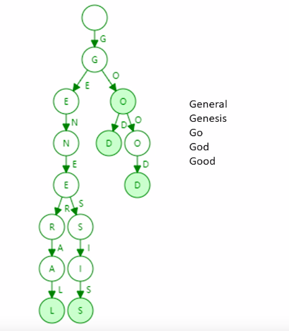</div>

- **分叉数**（branching factor）取决于Key值每个元素的取值范围，上面例子的分支数为27（包含一个结束标志位）

- 特点
  - addr可以拆成40个16进制的数，所以 **分叉数 为17**。
  - **trie的查找效率取决于Key的长度**，键的字节数越长，需要访问的内存次数越多。addr的字节数为40
  - trie只要两个addr不一样，就不会出现碰撞（不像hashtable）
  - **只要是相同的插入内容，无论是什么顺序，最后形成的trie树都是一样的**
  - 更新的局部性很好，更新的时候只需要改一小部分 
- 缺点：出现一连串只有一个子节点的节点，比如`ENE`，导致访问内存的次数较多。


### Patricia tree
- 描述：经过路径压缩的前缀树
- 比较稀疏的情况下，做路径压缩的效果比较大。
  - 2^160，ETH的账户空间，这个数值非常大，所以账户是非常稀疏的。这么大的原因是避免碰撞，在这种空间中，确实存在地址碰撞，但是概率比地球爆炸还小。
- 当更新的时候可能会发生**压缩的路径展开**。
<div style="zoom:40%; font-size: 24px;" align="center">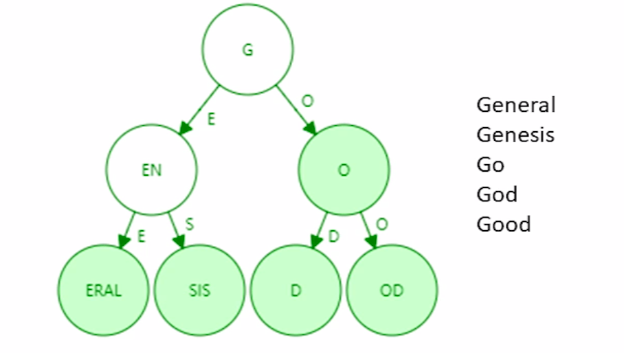</div>

### Merkle Patricia tree（MPT）
- 描述：把 Patricia tree 的普通指针变为 hash指针
- 状态树的root hash
  - 防篡改
  - Merkle proof
    - 证余额
    - 证不存在某个账户


> modified MPT
- ETH所用
<div style="zoom:40%; font-size: 24px;" align="center">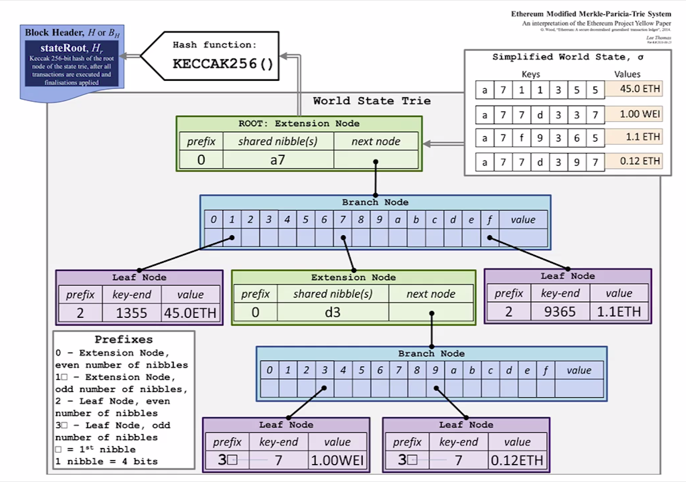</div>

- 每个区块都有一个状态树，但大多数节点是共享的，只有发生改变时，才新建分支。
  - **每个全节点不是只维护一个MPT，而是没出现一个区块，都要新建个MPT**（大部分节点共享）
- **大的MPT，包小的MPT**
  - 每个合约账户都存储小的MPT，如这里的Storage root 和Codehash，都是MPT的hash root。
<div style="zoom:40%; font-size: 24px;" align="center">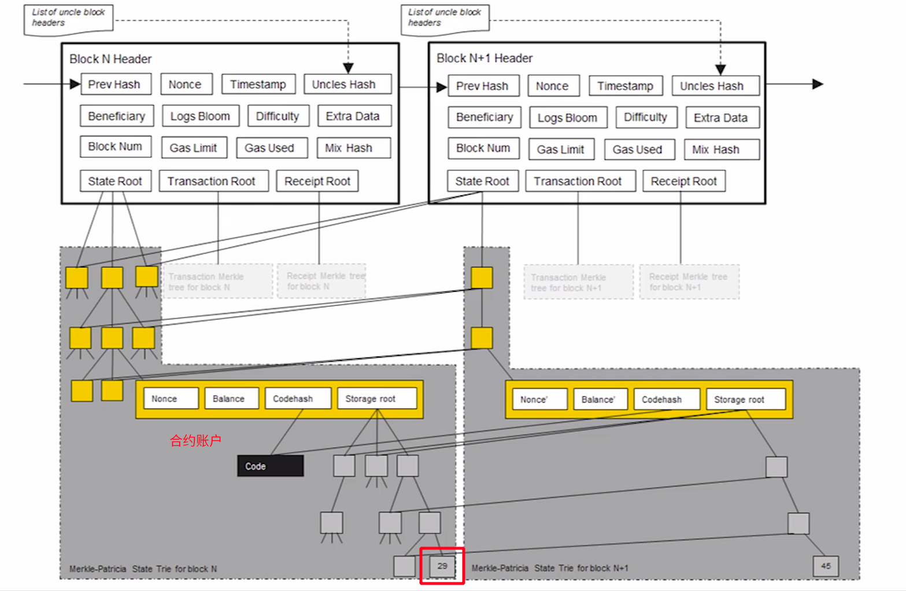</div>


- **为什么要保存历史信息，而不是直接修改**
  - 以太坊临时性分叉是常态，利用历史信息可以**方便节点状态进行rollback**
  - ETH中如不保存以前的状态，智能合约执行后，想退出前面状态是不可能的

## 区块代码定义
> Block Header
- ParentHash：前一个区块，区块块头的hash
- UncleHash：uncle区块的hash
- Coinbase：挖出区块矿工的地址
- Root、TxHash、ReceiptHash：状态树、交易树、收据树的根hash
- Bloom：与收据树相关，提供高效的查询，查询符合某种条件交易的执行结果
- Difficulty：挖矿难度
- GasLimit、GasUsed：跟汽油费相关。智能合约需要消耗汽油费，有点类似比特币的交易费。
- Time：区块产生时间
- MixDigest、Nonce：挖矿相关
  - Nonce：挖到的随机数
  - MixDigest：从Nonce随机数，经过计算，算出的hash
<div style="zoom:40%; font-size: 24px;" align="center">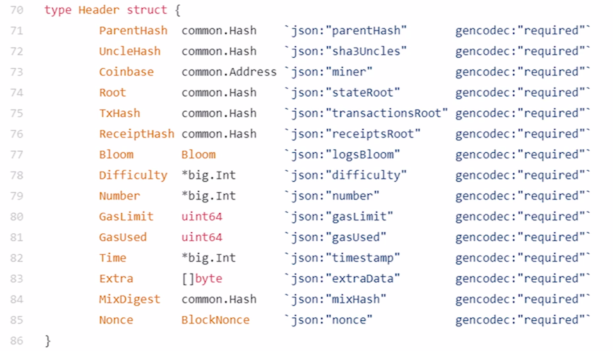</div>


> Block
- 主要为前三个：
  - header：前一个区块的指针
  - uncleHash：uncle区块的指针
  - transaction：交易列表
<div style="zoom:40%; font-size: 24px;" align="center">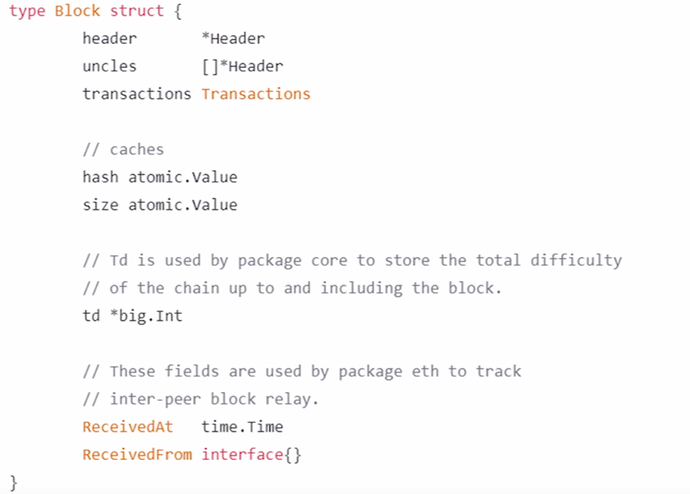</div>

> external block
- 区块发布出去的结构

<div style="zoom:40%; font-size: 24px;" align="center">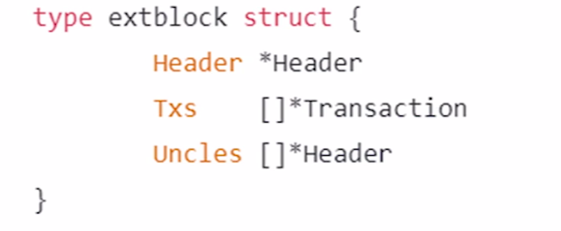</div>

## value的编码
- 前面讲的都是key的管理方式，value是如何存储的？
- 在value存储之前需要先进行**序列化**，序列化方式：**RLP（Recursive Length Prefix）**。
  - RLP理念是越简单越好，只支持 字节数组（nested array of bytes）
# ETH 交易树和收据树
- 交易树和收据树
  - 交易树：MPT，记录交易
  - 收据树：MPT，每个交易执行完后会形成收据，收据记录交易相关信息，
    - 收据树目的：考虑到智能合约执行过程复杂
    - 与交易树中节点一一对应
  - 为什么用MPT：可能为了方便，代码统一。
  - 查找的键：在区块中**发布的序号**，顺序为发布区块的节点决定。
- 状态树记录所有账户。**交易树和收据树只记录当前区块相关的，并且每个区块中的树都是独立的。**

## 作用
- 作用：Merkle proof
  - 证明某个交易存在
  - 证明某个交易执行结果
- 注：支持更复杂操作
  - 比如：过去10天和某个智能合约有关的所有交易
  - 通过 Bloom filter 实现
> Bloom filter 在ETH的应用
- tx 执行完，形成收据（包含tx类型，地址，**bloom filter**）
- 在块头中也有Bloom filter（**所有交易bloom filter 的并集**）
- 过程：
  - 先查区块块头中Bloom filter，是否有所需交易的类型
  - 如果没有，则表示整个区块里面没有所想要的
  - 如果有，查找区块里tx所对应的**收据树里的Bloom filter**
- 场景：轻节点中现在区块中查找，找到符合的区块，再请求全节点，查找具体区块里的内容。

> 问题：state tree 可以设计成只有当前区块tx相关的账户？
- 不行，造成查找效率低。A->B(10 ETH)，如果B是新创建的，要遍历到创世纪块。

## transaction-driven state machine
- ETH可以被认为是**交易驱动的状态机**：执行交易让系统从当前状态转移到下一个状态
- BTC也可以是交易驱动的状态机，其状态是UTXO
- 状态转移必须是确定性的：给定一个当前状态，和一组给定的tx，能够确定的转移到下一个状态


## 代码
> 创建 Block
<div style="zoom:60%; font-size: 24px;" align="center">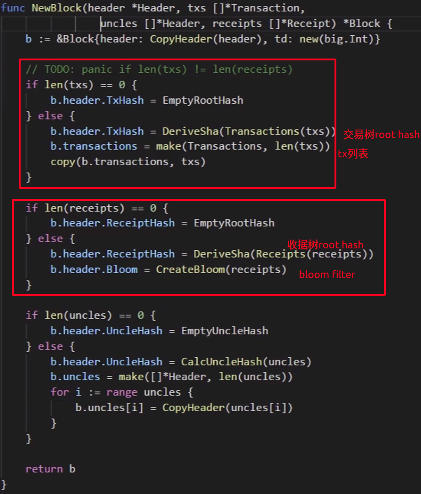</div>

> DeriveSha: 将tx和收据建为MPT
<div style="zoom:60%; font-size: 24px;" align="center">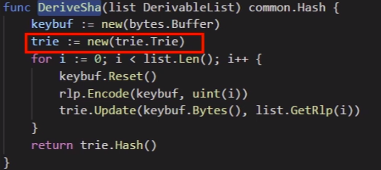</div>

<div style="zoom:60%; font-size: 24px;" align="center">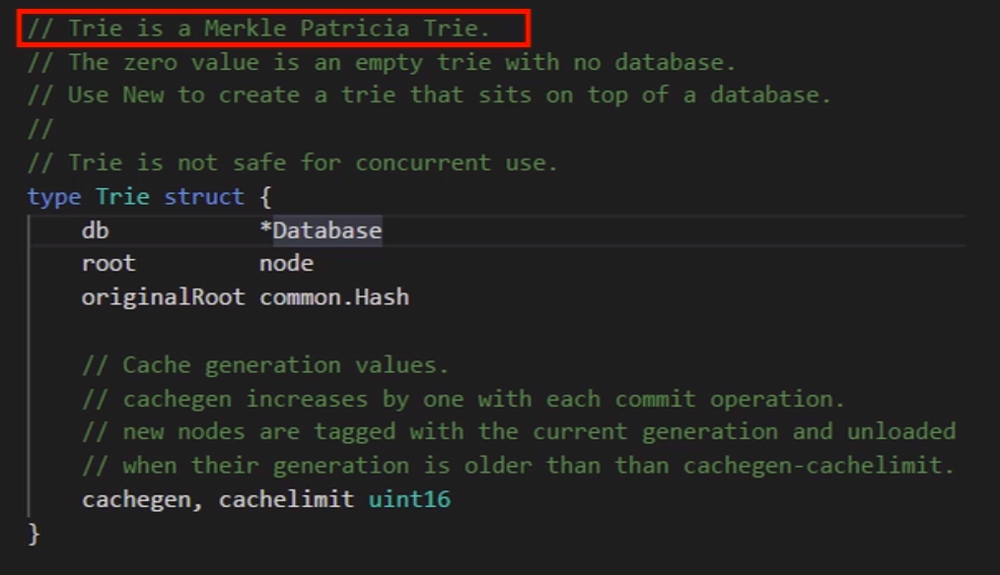</div>

> Receipt & Header 数据结构
- Bloom 根据 Logs 产生出来的
- status：告知交易执行的情况
<div style="zoom:60%; font-size: 24px;" align="center">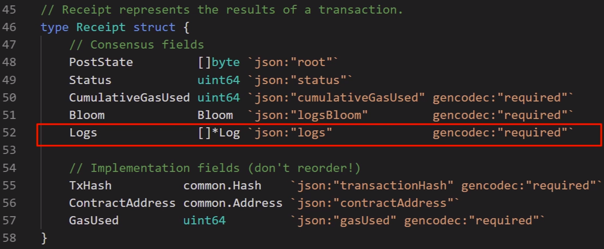</div>

<div style="zoom:60%; font-size: 24px;" align="center">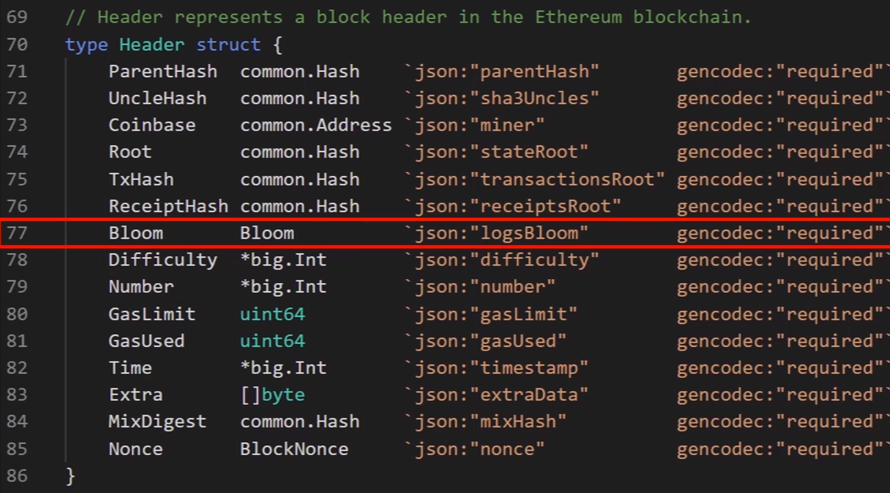</div>

> CreateBloom/LogsBloom/bloom9
- CreateBloom：生成每个收据的 Bloomfilter （通过LogsBloom函数）后，将生成的 Bloomfilter 合并

- LogsBloom：生成**单个收据**的 Bloomfilter。两层循环：外循环log，内循环log中的Topics。

- bloom9：将输入映射到 bloom filter 的三个位置。
  - 从中可以看出以太坊中 Bloom filter 的长度为 2048bit

<div style="zoom:60%; font-size: 24px;" align="center">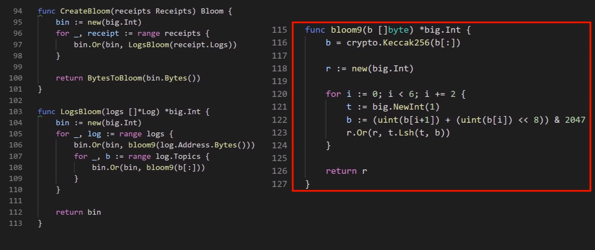</div>

> 查询bloom filter 中是否存在某个topic

<div style="zoom:60%; font-size: 24px;" align="center">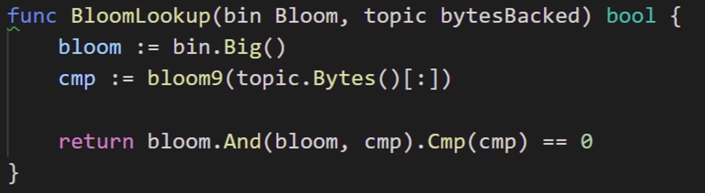</div>


# ETH GHOST
- 引出：如果以比特币的方式来实现以太坊，会导致很多矿工白挖，因为系统的分叉很多（十几秒一个区块）。会**造成不公平**，特别是个体矿工。
  - **公平**：希望的情况算力与收益比例一致。比如算力30%，收益也得是30%。
  - 大矿池肯定是沿着自己的分叉往下挖

- 解决：**基于GHOST协议的共识机制**
  - ETH之前已经有了，ETH对其进行修改
  - 核心思想：给分叉进行一些额外奖励，将其作为 **uncle block**

- uncle block 
  - 最多一个区块只能包含两个uncle block。
  - 当前区块得到 1/32 * block reward
    - 激励区块去包含uncle block，固定的
  - **不一定当代uncle，隔几代也可以包含**，uncle block 的miner 可以得到 `7/8, 6/8. 5/8, ..., 2/8 * block_reward` 的奖励。
    - 防止当前发布的block故意不包含uncle block，恶性竞争（所以隔几代也可以是uncle）
    - 必须与当前区块再7代内，存在共同祖先。防止维护过多状态，比如隔100代，那么得验证100代内，有没有可以包含但未被包含的uncle block。
    - 递减：鼓励出现分叉及早进行合并（因为可能uncle block的miner 和当前区块miner是同一个）
  - **只有分叉后的一个区块得uncle reward**


<div style="zoom:60%; font-size: 24px;" align="center">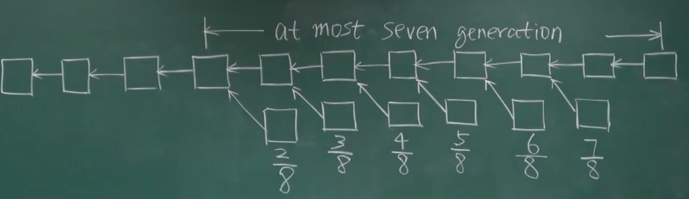</div>


- 奖励
  - block reward（static reward）
  - gas fee（dynamic reward）
    - uncle reward得不到
    - 执行智能合约获得
  - gas fee比例很小

- **ETH中没有规定减半 block reward**。


> 问题：包含 uncle 时，其tx要执行不
- 不需要执行。
  - 当前区块和uncle block可能有冲突的tx
- **同时不会检查uncle block tx的合法性，只查是否符合挖矿难度**

> 问题：分叉有多个区块，如果全部招安作为uncle会怎样
- 后果：fork attack 的成本太低
  - 成了，改交易。不成，被当成uncle，获得reward。

<div style="zoom:60%; font-size: 24px;" align="center">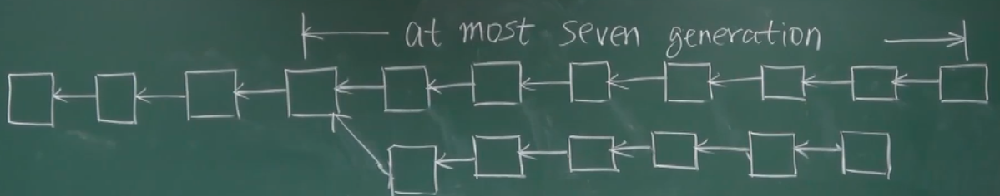</div>


## ETH真实案例
- https://etherscan.io/
<div style="zoom:60%; font-size: 24px;" align="center">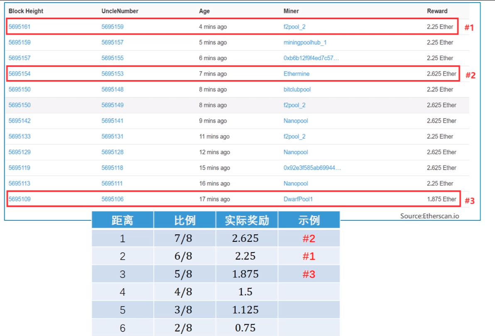</div>

<div style="zoom:60%; font-size: 24px;" align="center">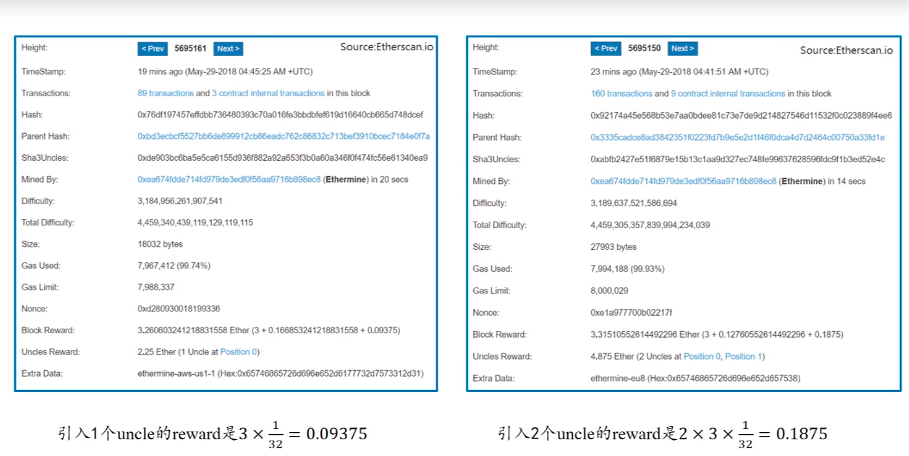</div>

- block reward：base_reward + gas fee + uncle

# ETH 挖矿算法
- **block chain is secure by mining**
  - BTC是一个天然的bug bounty，经受住了时间的验证
- BTC存在一个问题：**挖矿专业化，违背了BTC的初衷**
  - 所以之后的币，许多都有着 **ASIC Resistance** 的口号

> 例子：LiteCoin
- 思路：**增加mining puzzle对内存访问的要求**
- scrypt：对内存要求很高的hash函数。
  - 根据一个seed，依次进行运算，生成一个大数组。每个元素都由前一个元素计算得来。
  - 挖矿：需要随机获得某个位置的hash值，比如一开始读取A位置的数，运算后得出下一个需要读取B位置，再进行运算得出下一个需要读取C位置
    - **如果没有用内存缓存起来，那么需要从第一个位置的数，才能计算得到A位置的数**

<div style="zoom:60%; font-size: 24px;" align="center"></div>

- 缺点：对 light node 也是 memory hard
  - 原则：difficult to solve, but easy to verify
  - 所以 LiteCoin 只设置了 128 KB，非常小。导致后面出现这样的趋势：`GPU ---> ASIC`

- 冷启动问题解决的比较好
  - 冷启动：一开始没人参与，早期不是很安全，容易收到攻击
  - 得益于 LiteCoin 宣传，ASIC & GPU  resistance

- 注：
  - 出块速度是BTC的4倍，其他内容和BTC差不多
## Ethash
- 两部分
  - 16MB cache：用于验证
  - 1G dataset：用于挖矿
- 注
  - cache 的生成与 srypt 类似
  - cache 与 dataset **定期增长**


- 过程
  - dataset生成：**在 cache 中经过 256 轮的运算，得出一个hash值，作为dataset 的一个item**
  - 挖矿：在求解puzzle中，通过 block header & nonce，算出init hash，在data set中经过64次循环，每次取2个数，生成128个数后将其生成一个值。
    - 将该值与挖矿难度比较，判断是否符合，不符合再调整nonce值。
<div style="zoom:60%; font-size: 24px;" align="center"></div>

- **目前ETH挖矿以GPU为主，起到了ASIC resistance有关系**

- 一种算法：让通用计算机为挖矿主流是不安全的，导致攻击加密货币系统的成本降低。让ASIC一统天下才是最安全的。
### 伪代码
> mkcache
- 功能：生成cache
- 可以发现后一个的元素和前一个相关
<div style="zoom:60%; font-size: 24px;" align="center">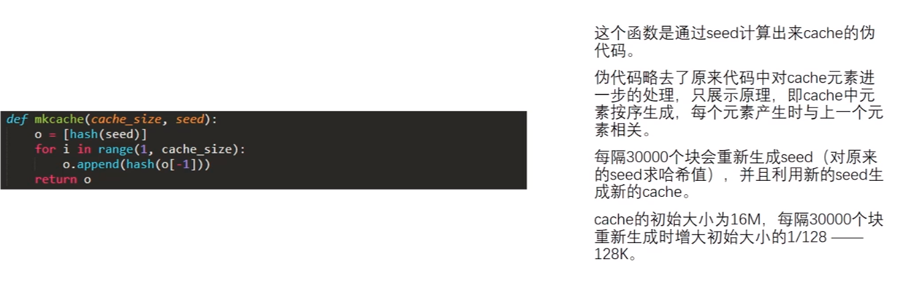</div>

> calc_dataset_item
- 功能：生成 dataset 中的第i个元素
- cache 和 i =gen=> init_mix
- 循环256 times
  - 通过mix获得读取cache的位置 cache_index（`get_int_from_item`）
  - 再获取到新的 mix值（`make_item`）
<div style="zoom:60%; font-size: 24px;" align="center">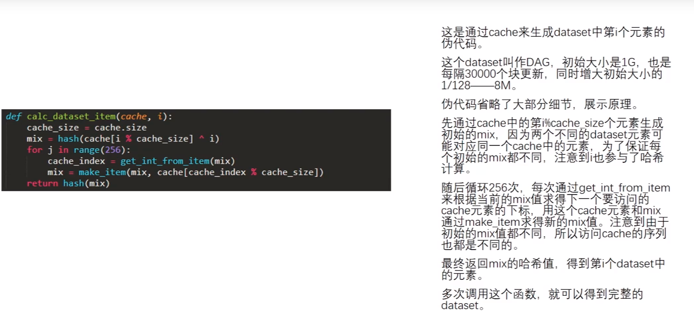</div>

> calc_dataset
- 功能：生成dataset
<div style="zoom:60%; font-size: 24px;" align="center">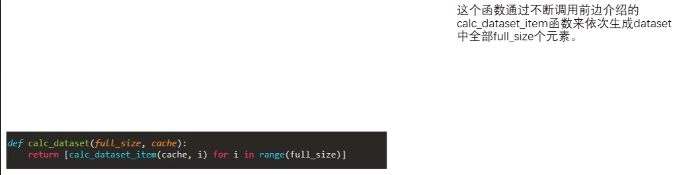</div>

> hashimoto_full & hashimoto_light
- hashimoto_full：矿工用来挖矿的函数
  - 参数
    - header：当前生成区块的block header
    - nonce：nonce值
    - full_size：dataset中元素的个数
    - dataset：大数据集
  - 过程：
    - header & nonce =gen=> mix_init
    - 每次取相邻的**两个数**，循环**64次**。（注意：**这两个数虽然是相邻的，但是没有联系的，不同于cache**）
- hashimoto_light：light node 验证的函数
  - 参数
    - header：当前生成区块的block header
    - nonce：发布在block header 的nonce值
    - full_size：dataset中元素的个数
    - cache：cache
  - **每次需要生成 dataset_item**

<div style="zoom:60%; font-size: 24px;" align="center">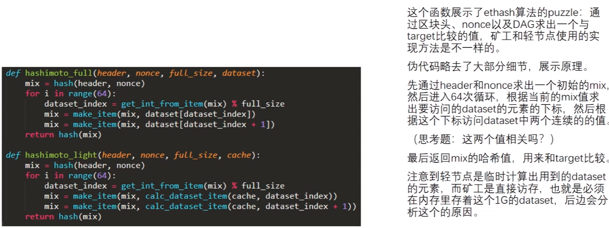</div>

> mime
- 功能：矿工挖矿的主循环
- **nonce的取值为 0 - 2^64**
- target 根据 难度进行调整
<div style="zoom:60%; font-size: 24px;" align="center">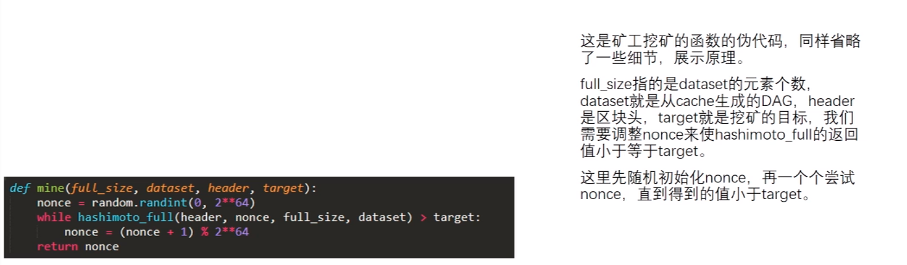</div>

> 汇总
- 为什么light node 不需要 dataset
- 为什么 ASIC resistance
<div style="zoom:60%; font-size: 24px;" align="center">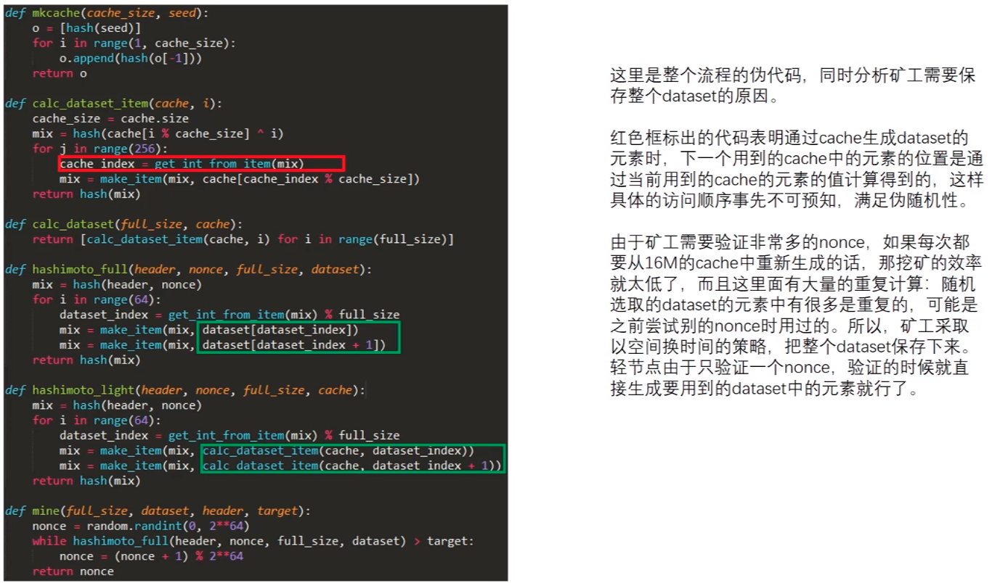</div>


## PoS 与PoW
- PoW：工作量证明
- PoS：权益证明
  - 不挖矿
- 以太网一直准备从PoW转Pos，如果转PoS那么ASIC将无效，不能产生任何价值，所以有利于吓唬ASIC产商
  - 目前仍然是PoW（2018）

## pre-mining & pre-sale
- pre-mining：ETH采用预挖矿，预留给开发者一部分币，作为开发奖励。
- pre-sale：把pre-mining中预留的币，通过出售来得到钱，用于开发工作（相当于众筹）
## ETH趋势（图表，2022.2）
> 价值和总价值
<div style="zoom:60%; font-size: 24px;" align="center">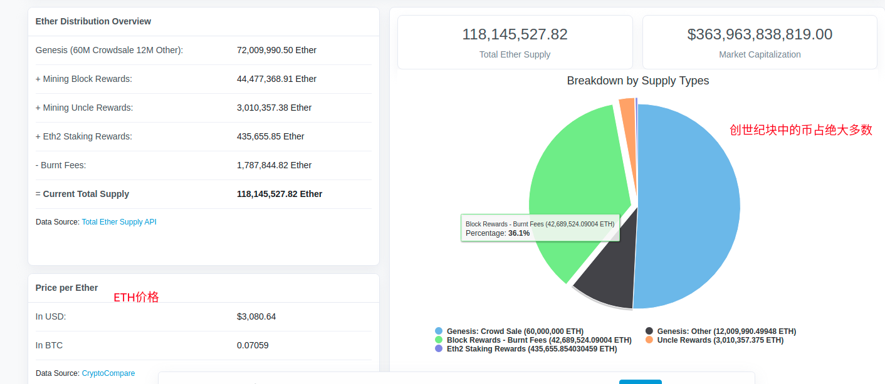</div>

> 价值趋势
<div style="zoom:60%; font-size: 24px;" align="center"></div>

> 矿池挖矿比例
<div style="zoom:60%; font-size: 24px;" align="center">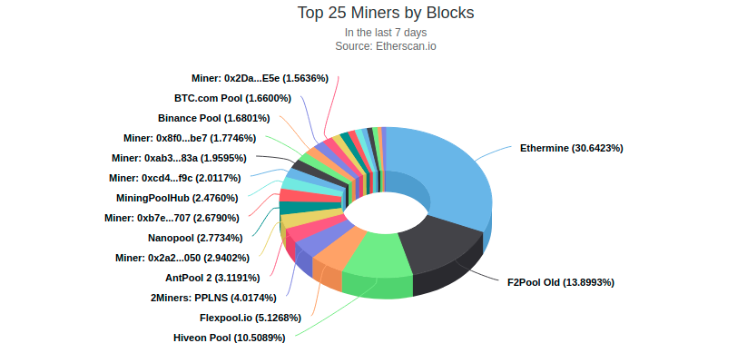</div>

> 所有矿工每秒计算的hash次数
- **不同的币的mining puzzle 如果不一样，那么是hash rate不可比的**
  - BTC与ETH不可比，计算ETH的一次nonce的工作量比BTC大得多
<div style="zoom:60%; font-size: 24px;" align="center"></div>


# ETH难度调整
- 每个区块都有可能调整挖矿难度，而且ETH改过了很多个版本

<div style="zoom:60%; font-size: 24px;" align="center">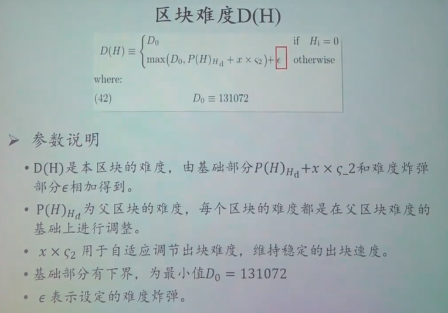</div>

- 难度炸弹：为了后面向PoS过渡

<div style="zoom:60%; font-size: 24px;" align="center">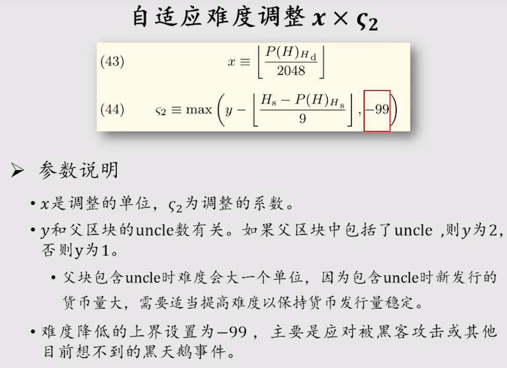</div>

- `44` 如果是负的，说明难度往下调。

<div style="zoom:60%; font-size: 24px;" align="center">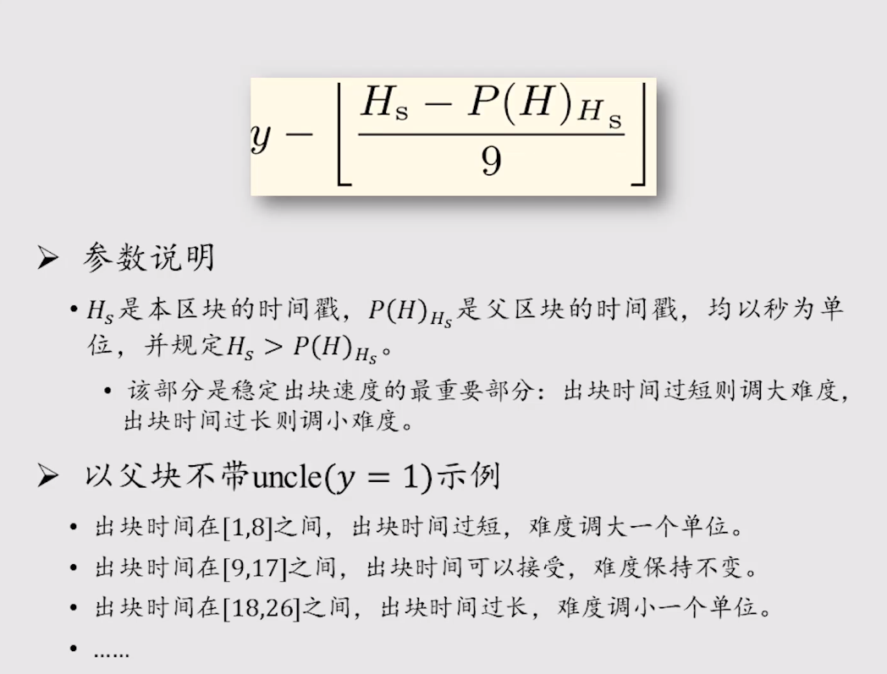</div>

## 难度炸弹
<div style="zoom:60%; font-size: 24px;" align="center">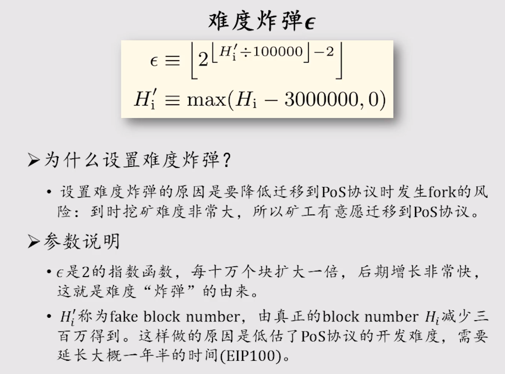</div>

- 作用：将硬分叉的一端堵死
- 当初思想：等到 难度炸弹开始发挥作用的时候，ETH就开始转入权益证明，大家那个时候比较愿意进入权益证明的分叉，因为挖矿难度太大。
  - **实际情况，基于权益证明的共识机制实际上有许多问题要解决，导致转入权益证明的时间点被推迟**，挖矿越来越难，但是还得继续挖，因为没有其他办法可以达成共识。

- 被迫调整：
<div style="zoom:60%; font-size: 24px;" align="center">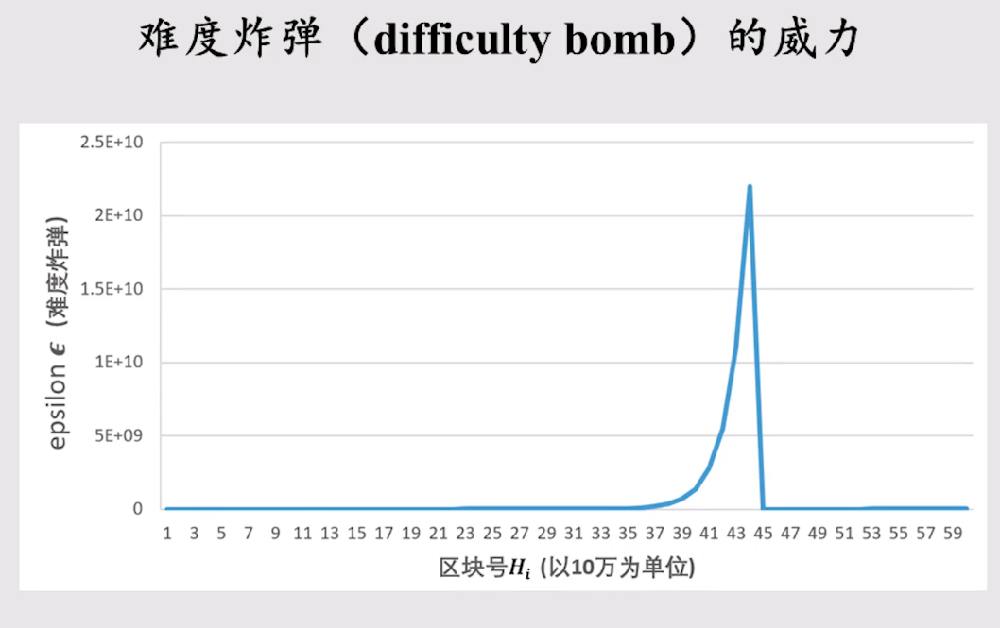</div>

## ETH发展阶段
<div style="zoom:60%; font-size: 24px;" align="center">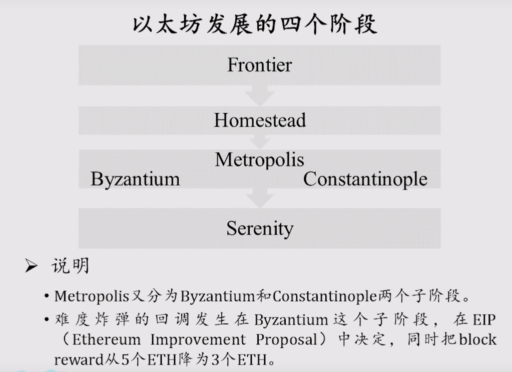</div>

## 难度变化
<div style="zoom:60%; font-size: 24px;" align="center"></div>

## 最难合法连
- 最长合法连对于ETH来说，应该是最难合法链
<div style="zoom:60%; font-size: 24px;" align="center">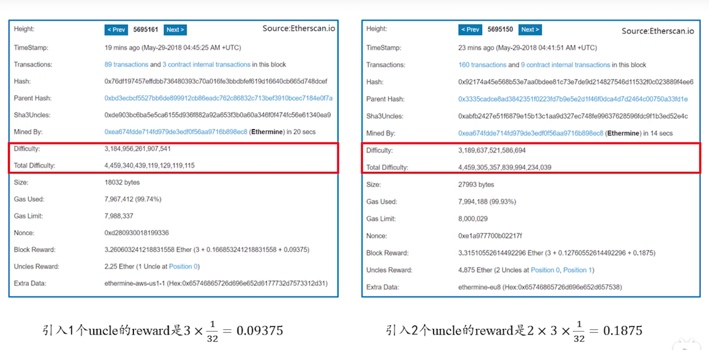</div>

- difficulty：当前区块难度
- Total difficulty：整条链的难度和

# ETH 权益证明
- 引入：PoW非常耗电
  - BTC一个tx就要耗费几千KWh（离谱）
  - 将BTC和ETH的耗电当成一个国家，耗电排行如下（2022）。
<div style="zoom:60%; font-size: 24px;" align="center">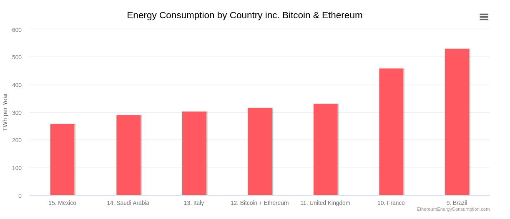</div>

> 前因后果
- 为什么要挖矿--->为了拿到奖励
- 为什么有奖励--->为了奖励miner参与维护系统

- **收益<---决定---挖多少区<---决定---算力<---决定---设备<---决定---投入**
  - **投入 决定 收益**
  - 为什么不把钱投入到区块链开发，由每个人投入的资金多少决定收益的分配
    - **以上是权益证明的基本思路**，通过持有货币数量进行投票（virtual mining）
- PoS 好处
  - 省去挖矿过程
  - PoW有一个问题，其维护区块链安全的资源不是一个闭环，发动攻击的资源可以从外界得来（比如某大型互联网公司用其底下服务器进行攻击）
    - AltCoin：就是在婴儿期遭受攻击，从而被扼杀。（被攻击后会导致Coin大量贬值）

> 对PoS区块系统的攻击
- PoS：有点类似股份制公司，按每个人的股份进行投票。**权益证明是按节点有多少币来进行投票**
  - 如果某个攻击者想发起攻击（如51%攻击），得设法获得该币种51%的份额。**发动攻击的资源，只能从系统的内部得到（之所以称为闭环）**。
    - 一旦有人大量购买加密货币，会导致币的价值上涨。这对开发者来说不一定是坏事，其可以大赚一笔


> PoS和PoW并不是互斥的，有的采用混合模型
- 仍然需要挖矿，挖矿难度和占有的权益是相关的。
- **挖矿的时候，持有的币越多，挖矿的难度越小。**
  - 问题：持有币最多的节点，每次挖矿最容易。
  - 解决：投入的币被锁定一段时间，一段时间不能使用（Proof of Deposit）
    - 挑战：两边下注（nothing at stake）。有时候不知道哪条链会是最长合法链，这个时候可以两边下注，没有形成最长合法链的，其区块挖矿时的币不会被锁定。（导致挖矿对持有币多的节点更友好，而且是不成比例的）
<div style="zoom:60%; font-size: 24px;" align="center">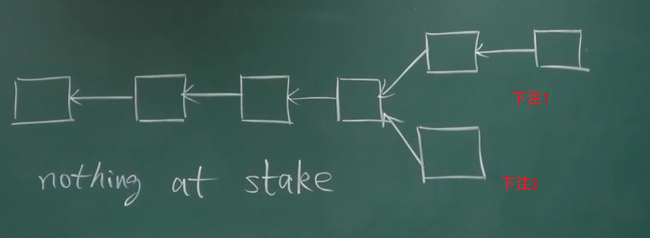</div>

## Casper
- 注：这一节有点难懂
- Casper the Friendly Finality Gadget（FFG）
- 其在过度阶段也需要和PoW混合使用，为PoW 提供 Finality的特性
  - **Finality是一种最终状态，包含在其中的 tx 不会被取消**
  - 问题：单纯基于挖矿的区块链缺乏 Finality，是有可能被回滚的。（比如BTC中，记录的tx会被遭到 forking attack）
  - 解决：Casper 引入一个概念 **验证者（validator）**

> validator
- 成为一个 validator 需要投入一定数量的ETH，作为**保证金，保证金被系统锁定**
- validator 职责：**推进系统达成共识，投票决定哪条链是最佳合法链，权重取决于保证金数目大小**
  - 做法类似数据库的 **two phase commit**（两阶段提交）

- two phase commit
  - prepare message
  - commit message

- 混用的时候还是存在挖矿的，挖矿的时候每挖出100个区块作为1个**epoch**，**要决定能不能成为 Finality，需要进行投票**。
  - 每一轮投票需要得到 2/3 以上验证者才能通过
  - **实际系统中，不存在两个 message，epoch 从原来的100个区块减少成50个区块**
    - 每个epoch只**需要一轮投票就行了**，这一轮投票对于上一个epoch是一个commit message，对于下一个epoch是一个prepare message。
    - 需要连续两个epoch都得到2/3以上的多数才算有效。

- validator参与过程的好处：
  - 如果其履行职责，可以得到奖励。
  - 如果有不良行为，则要受到相应惩罚。
    - 不作为：扣一部分
    - 乱作为：全扣（两边下注）
    - 注：没收的保证金直接销毁

- 每个 validator 有一定任期，即使交了保证金也不是一定永远当 validator，任期满了后，要进入一段时间**等待期**。
  - **等待期为了其他的节点进行检举揭发validator有没有什么不良行为，如果有则进行惩处，** 等待期过了后可以取回保证金以及得到的奖励。

- 原本Casper实现如下：
<div style="zoom:60%; font-size: 24px;" align="center">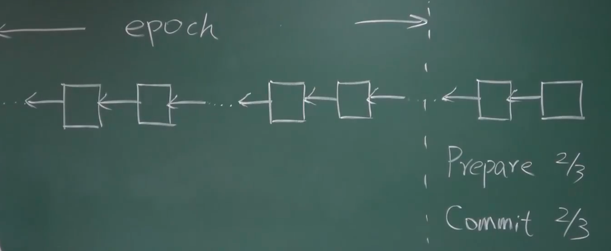</div>

- 优化后Casper实现如下
<div style="zoom:60%; font-size: 24px;" align="center">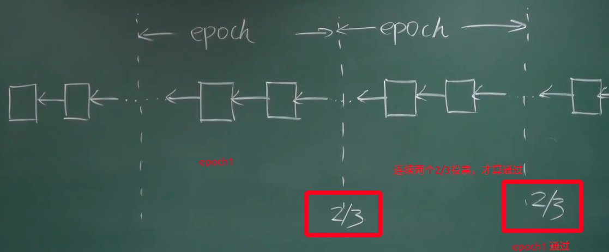</div>

> 问题：通过validator投票达成的 Finality 有没有可能被推翻？
- 假设有某个恶意组织要发动攻击，如果该组织仅仅是矿工，那么其无法推翻已经达成的 Finality
  - 因为 Finality 是投票投出来的，有恶意的矿工不论算力多强，没有验证者作为同伙是不可能推翻的
  - 攻击成功的情况：一定有大量的的验证者两边下注，给两个有冲突的 Finality 下注，Casper协议要求每轮投票有 2/3的投票者投票才算通过，如果出现这种情况，至少有 1/3的验证者两边都投票了（保证其中一边超过2/3?），这样如果发现这种情况，那么这些验证者的保证金将被没收。

> ETH所要的趋势
- **PoW过渡到PoS，随着时间推移，挖矿得到的奖励越来越少，权益证明得到的奖励越来越多，最后达到完全不用挖矿**

# ETH 智能合约
- 只有**合约账户**才有。
- 智能合约：运行在区块链上的一段代码，代码的逻辑定义了合约的内容。
  - 通常是**Solidity语言**，语法与 js 接近
- 智能合约的账户保存了合约当前的运行状态
  - balance：当前余额
  - nonce：交易次数
  - code：合约代码
  - storage：存储，数据结构是一颗MPT

- **过程**： 
  1. 将合约发布到区块链（往地址0x0转账，金额是0，gas照给）
  2. 矿工将只能合约发布到区块链上不返回智能合约地址（账户），此时合约就在区块链上了，所有人都可以调用
     - **智能合约都有一个合约账户，区块链维护其状态信息**

## solidity 
- `contract` 类似C++里的 `class`
- 强类型语言
- 不支持遍历，如果想遍历hash表中的元素，需要自己记录hash表中有哪些元素。
  - 如下面例子的 bidders 数组
- 数组可以固定长度，也可以是动态改变长度的
- 构造函数
  - 定义构造函数两种方法
    - 定义与 contract 同名的方法
    - 使用 `constructor`(更推荐)
  - 只有合约被创建才会被调用

### demo：网上拍卖的例子
- 事件（`event`）：用来记录日志，对程序的运行逻辑没有影响。使用 `emit` 来调用 `event`
  - HighestBidIncreased：拍卖的最高出价增加
  - Pay2Beneficiary：赢得拍卖（winner赢得拍卖的address，以及最后的出价 amount）

- `payable`：ETH规定，如果合约账户能接受转账（别人转给它），必须标识成 `payable`
- `bid`函数：进行竞拍出价的函数。
  - 如果你要进行竞拍拍卖，用100ETH，则调用 `bid` 函数，调用的过程中需要你把 100 ETH也发送过去，存储到合约里，直到拍卖结束。
  - 拍卖借宿后，如果没有最终买到物品，可以调用 withdraw 取回出价，**用户不需要把钱转给只能合约，而是仅仅将当初的钱取回，所以没必要使用payable**
<div style="zoom:60%; font-size: 24px;" align="center">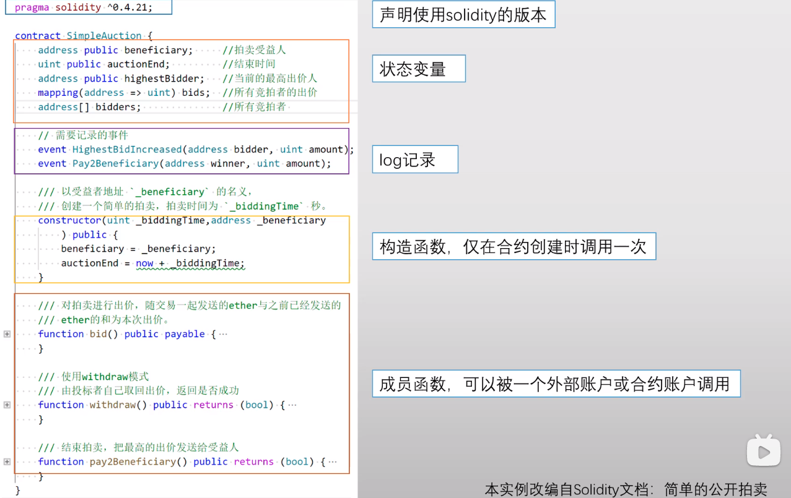</div>
<div style="zoom:60%; font-size: 24px;" align="center">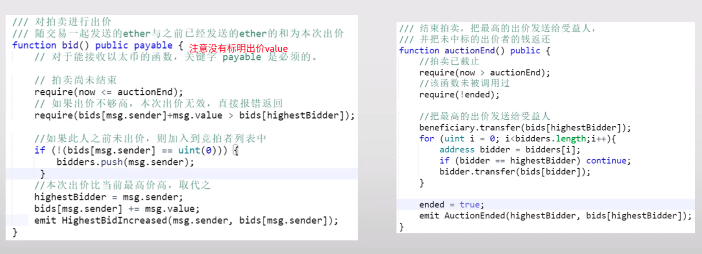</div>

> 该例子存在一个问题

<div style="zoom:60%; font-size: 24px;" align="center">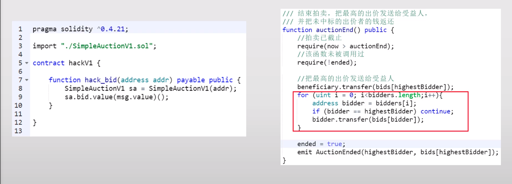</div>

- 问题：如果某个用户发布一个合约，由该合约来调用竞拍的合约。这个时候，当竞拍结束后，transfer ETH给竞拍失败的用户，**这个时候由于hackV1智能合约没有fallback函数，所以导致transfer调用失败，连锁异常，从而导致tx回滚，任何账户都拿不到前。**
  - **这些ETH再也无法拿出来**
- 发布智能合约时，一定要测试、测试、再测试
- 设置owner，给其一定权限，比如可以将钱转给某个用户，这样可以吗？
  - **不可以**，与智能合约的理念背道而驰，这样相当于必须相信这个owner不会卷款跑路。

> 第二版：投标者自己取回出价
<div style="zoom:60%; font-size: 24px;" align="center">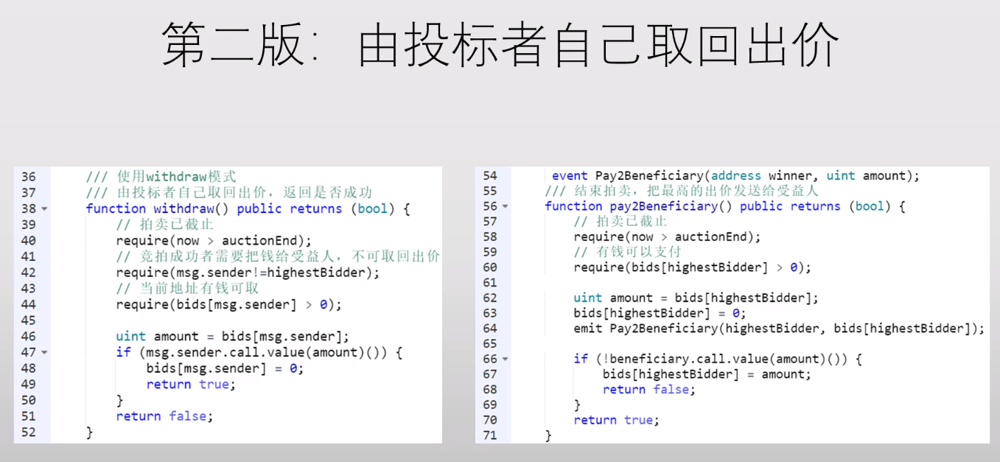</div>

- 会遭受重放攻击，因为 **清零的操作还没执行**，在转账中调用用户定义的 fallback，再次进行转账。
- 重复取钱持久到何时结束
  1. 拍卖合约的余额不够
  2. 汽油费不够
  3. 调用栈溢出
<div style="zoom:60%; font-size: 24px;" align="center">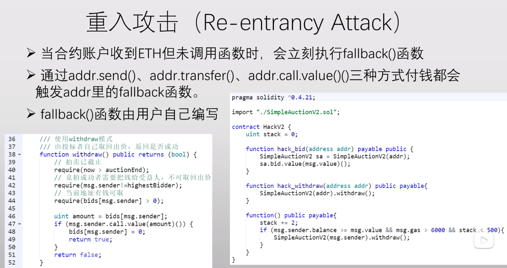</div>

- 修改方法
  - 先清0，再转账，比如Pay2Beneficiary函数
  - 使用send。转账发送过去的gas只有2300，不足以让接收的合约再发起一个新的调用，只够写一个log

<div style="zoom:60%; font-size: 24px;" align="center">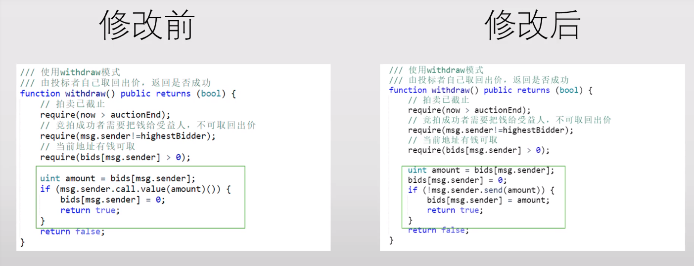</div>


## 合约函数的调用
### 外部账户调用
- **智能合约的调用：** 对于交易A->B
  - 如果B是普通账户，那么这个就是一个普通的转账交易（和BTC的转账是差不多的）
  - 如果B是一个合约账户：该 tx 发起一次对B合约的调用。**具体哪个函数再data域说明，data域中同时说明了函数参数的取值**
  - 下图信息：
    - sender address：发起合约调用的address
    - to contract address：调用智能合约的地址
    - value：转账金额
    - gas used：耗费的汽油费
    - gas price：每单位汽油费的价格
    - gas limit：该tx最多接受多少汽油费
- 转账金额可以是0，但是汽油费必须给，不然矿工不会将你的tx记录


> fallback 函数
- 没有参数，没有返回。
- 什么时候调用：
  - 当A调用B的合约，但是在data域中没指定调用的函数时，就调用该函数
  - 当A调用B的合约，但是再data域中指定的函数在B中没找到时，就调用该函数。
- 合约中可以没有fallback函数，如果没有出现上面的情况，将抛出异常
<div style="zoom:60%; font-size: 24px;" align="center">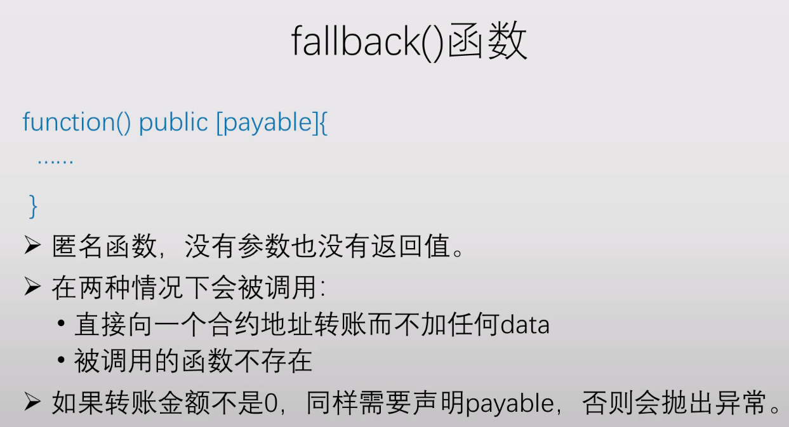</div>


### 合约调用合约

> 直接调用
- 下面的例子存在两个合约：A和B
- **一个tx只有外部账户才能够发起，合约账户不能主动发起，** 所以该demo中需要有一个外部账户调用合约B中的函数
<div style="zoom:60%; font-size: 24px;" align="center">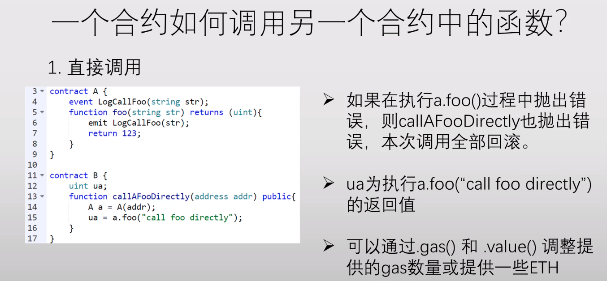</div>


> 使用 address 类型的 call() 函数
- **如果调用失败，call会返回false。直接调用是会错误传递的。**
<div style="zoom:60%; font-size: 24px;" align="center">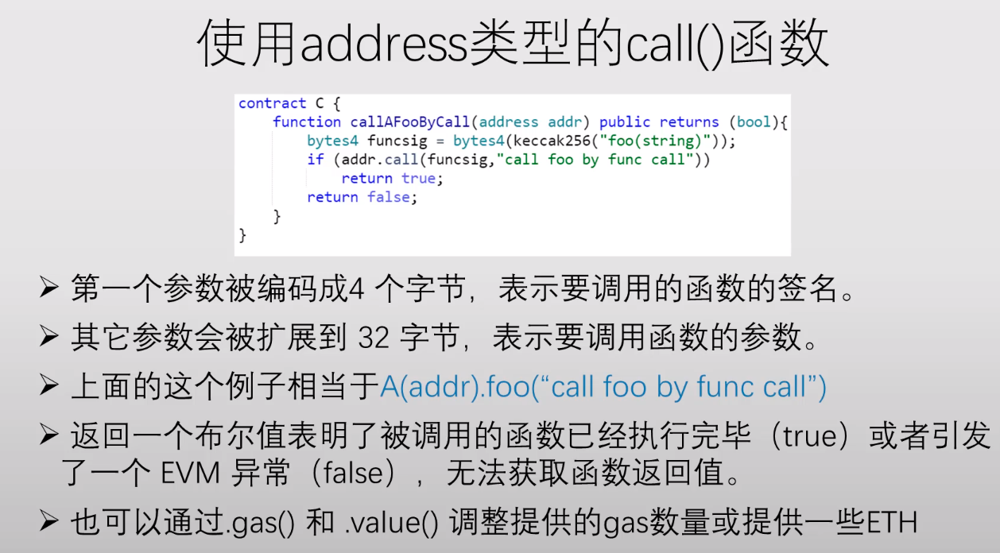</div>

> delegatecall
- 与call类似，最主要的区别就是 **delegatecall 不需要切换到被调用合约的环境中执行**，在当前合约的环境中执行就行了。
<div style="zoom:60%; font-size: 24px;" align="center">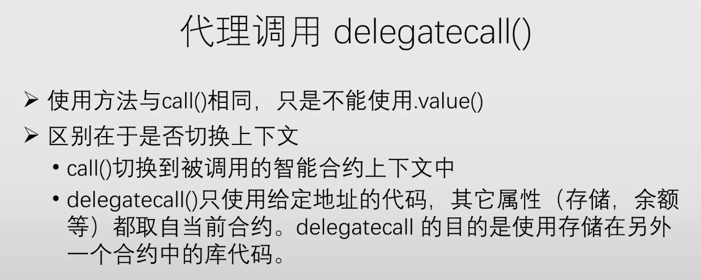</div>

## 智能合约的创建和运行

- 注：
  - 代码放data域
  - **智能合约发布到区块链后，每个矿工都需要执行交易**
<div style="zoom:60%; font-size: 24px;" align="center">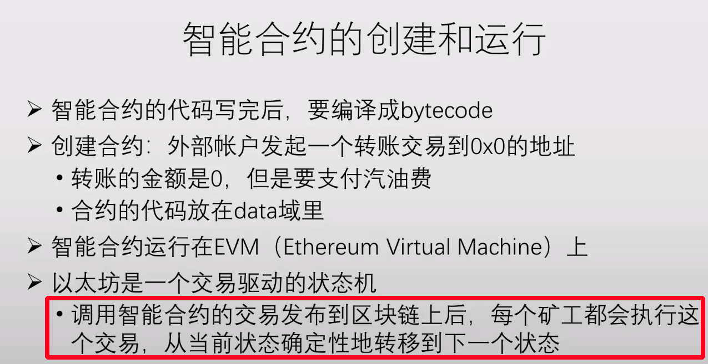</div>

> 问题：
- Q: 打包一个区块进行挖矿的时候，里面的交易有一些智能合约，这个时候是需要先挖矿还是先执行合约？
- A: 先执行，再挖矿。需要执行后更改状态（如把该收的汽油费收了），然后才能知道三棵树的rootHash（写在Header里），才能进行挖矿。
- 注：挖不到矿，执行也都执行了，最后还得回滚，并且**没有任何补偿**

> 问题：
- Q: 矿工不验证区块怎么办，反正验证也不给钱。（但区块链的安全保证要求所有的节点独立验证区块的合法性，这样少数恶意的节点才无法篡改区块链内容）
- A: 不行，如果跳过验证的步骤，以后就不能再挖矿了，因为验证的时候需要把区块的交易执行一遍，更新本地的三棵树，如果不验证，本地三棵树的内容无法更新（发布的区块没有这三棵树的内容，只有三棵树的根hash值）

- Q：那可不可别人验证后，自己在别人基础上拷过来？
- A：可以，这就类似矿池的概念，矿工本身不验证，pool manager 进行统一验证

> 问题：
- Q: 如果智能合约执行过程中发生错误，要不要发送
- A: 要，需要扣汽油费

> 问题：
- Q：支不支持多线程
- A：solidity不支持，因为多线程复杂，且可能带来不确定性。而区块链要求最终每个节点的执行结果是确定的。（状态机）
- 注：**ETH中智能合约产生的随机数都是伪随机数，不然每个节点产生的随机数都不一定，就达成一致性。**


## 汽油费
- 如何知道代码调用起来会不会出现死循环？
  - 这是一个 halting problem(停机问题)，是无解的，无法
  - 解决办法：**将问题推给发起交易的账户**


- txdata
  - AccountNonce：交易序号，防止 replay attack
  - Price、GasLimit：单位汽油价格和愿意支付的最大汽油量。相乘为可能消耗的最大汽油费
  - Recipient：收款人地址
  - Amount：转账金额
  - Payload：data域
- 过程：
  - 当一个全节点收到一个对智能合约的调用时，先按调用中的 GasLimit、Price **算出可能花掉的最大汽油费，然后从发起调用的账户中扣除。再根据实际执行花了多少汽油费，多的部分将退还；如果汽油费不够，将回滚，并不退已经消耗的汽油费**
<div style="zoom:60%; font-size: 24px;" align="center">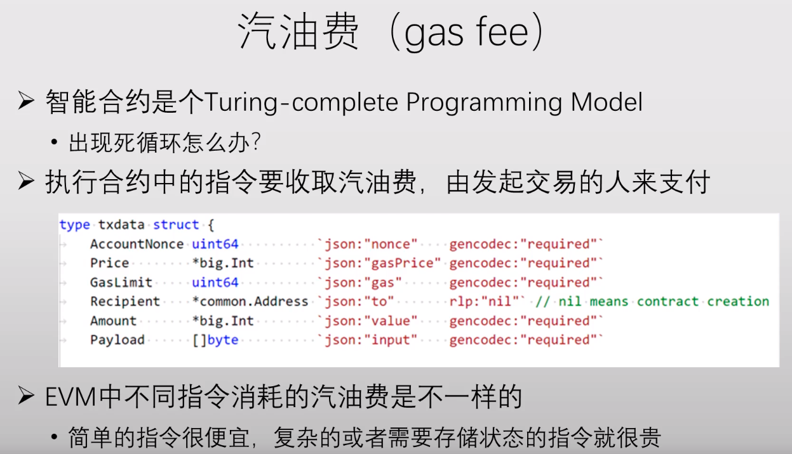</div>

### Block Header abot gas


<div style="zoom:60%; font-size: 24px;" align="center">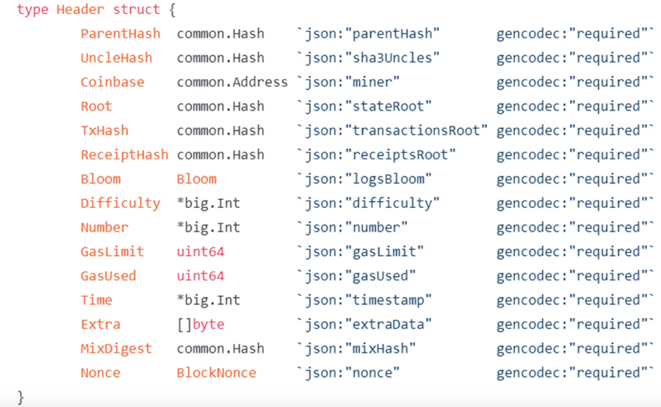</div>

- **GasUsed**：区块中所有tx消耗的汽油费
- **GasLimit**：该区块所有汽油能够消耗的上限（不能无限消耗，否则可能发送一个对资源消耗很大的区块）
  - **BTC中对区块字节数进行限制，BTC中可以通过交易的字节数来衡量tx消耗的资源有多少。但是ETH中不行，因为智能合约的过程很复杂，其可能字节数很小，但是code消耗的资源很多**
  - 为什么不是常量：因为BTC中有人认为1MB太小了，所以ETH中允许区块进行微调，可以上下浮动上一个区块 `GasLimit` 的 1/1024。
    - 最后 GasLimit 会趋向于所有矿工的平均意见

## 错误处理
- 交易原子性：要么一个tx全部执行，要么不执行，不会执行一半（交易中可能即包括转账，又包括智能合约调用，所以在该tx中出现任何错误，将导致整个交易的执行回滚）
<div style="zoom:60%; font-size: 24px;" align="center">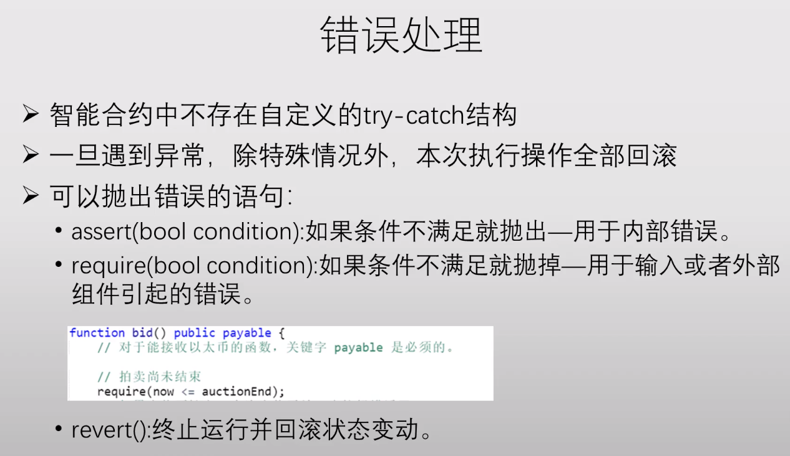</div>

### 嵌套调用
- 一个智能合约调用另一个智能合约，是否会发生连锁回滚
  - 看调用的方式

## 智能合约信息及地址
- 由于一致性，不能使用类似syscall等系统调用获得系统信息
### 区块信息
<div style="zoom:60%; font-size: 24px;" align="center">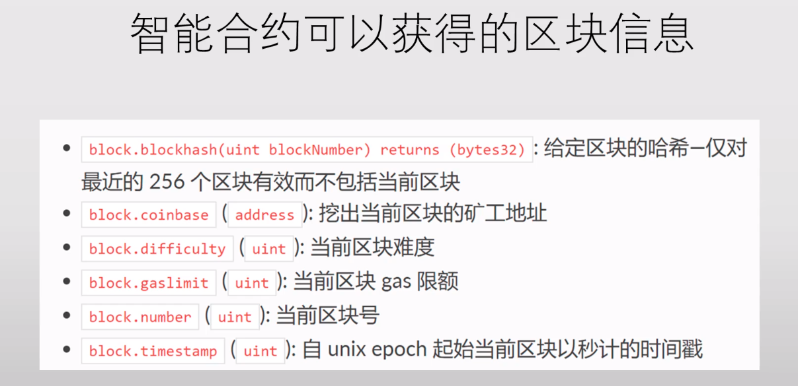</div>


### 调用信息
- msg.data: 数据域（调用了哪个函数，以及函数的参数取值）
- 智能合约中无法获得精确的时间，只能获得当前区块相关的时间
<div style="zoom:60%; font-size: 24px;" align="center">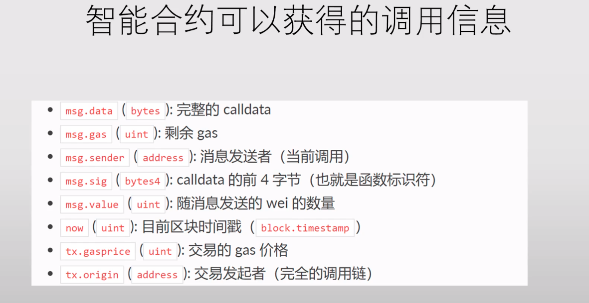</div>


<div style="zoom:60%; font-size: 24px;" align="center">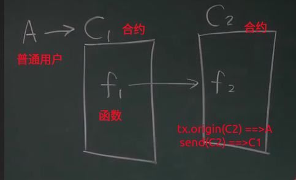</div>

### 地址类型
- `<address>.balance`：成员变量，uint256是类型。其他都是成员函数
- `<address>.transfer`：成员函数，像 address 转amount的钱
<div style="zoom:60%; font-size: 24px;" align="center">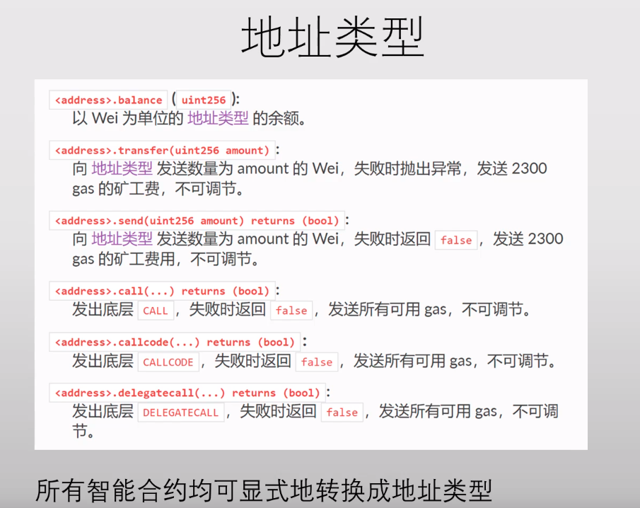</div>


#### 转账三种方式
- 区别
  - transfer、send： transfer会导致连锁回滚，send不会
  - transfer、send专门用于转账，call本意是用于发动函数调用，call也不会导致连锁回滚。transfer、send用的汽油费很少，只用2300gas。而call会把当前调用剩余的所有汽油都发送过去。（比如call所在的合约，本身被调用的时候可能还剩8000gas，其调用其他合约的时候用call的方式转账，会把剩余的8000gas都发送过去，没有用完会撤回）
<div style="zoom:60%; font-size: 24px;" align="center">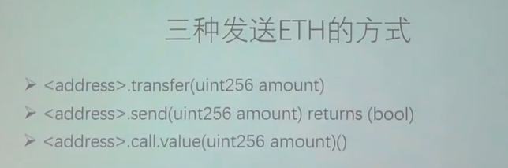</div>

# ETH TheDAO
- DAO：Decentralized Autonomous Orgarization(去中心化自治组织)
  - **建立在代码基础上**，通过区块链的共识机制，来维护规章制度的正常执行
  - 一个通用概念，凡是去中心化的自治组织，都可称为DAO

- TheDAO：众筹投资基金组织，用于投资项目的，是一个特定的DAO。
  - 本质是一个运行在以太网的智能合约，如果想投资，将ETH发给该智能合约，得到TheDao的**代币**，需要决定投资哪个项目的时候，大家进行投票决定，**代币越多，权重越大。**

- DAC: Decentralized Autonomous Corporation（去中心化公司）
  - 盈利目的，并不是实际公司。
  - 一个概念，DAC出于盈利目的，DAO不一定。
## child DAO
- 引入：如果想要把投资到TheDAO的钱拿出来，怎么办
- split DAO：拆分的方法不是单纯用来取回收益，也是一种建立资金的方法（child DAO）
  - 比如，一小部分人的投资理念和大部分不一样，这个时候可以拆分，从而形成自己的子基金 child DAO，原来的 **代币**要被收回，同时换成一定数量的ETH转到 child DAO，之后这一小部分人可投资想投的项目
  - 取回投资ETH：拆分的极端例子，单个投资者成立一个child DAO，该资金中其可以将钱投给自己。（**取回投资和收益的唯一途径**）

- **辩论期**：拆分之前有7天辩论期（讨论拆分好不好，以及决定加不加入该拆分）
- **锁定期**：拆分之后有28天锁定期，child DAO里的ETH要28天才能取出

<div style="zoom:60%; font-size: 24px;" align="center">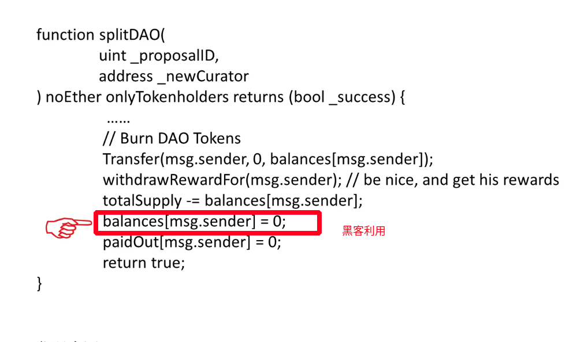</div>

# ETH 反思
- 智能合约并不智能，更类似于一种自动合约（如ATM机）
- 不可篡改性是一个双刃剑
  - 好处：溯源等
  - 坏处：TheDAO，无法修改bug


- nothing is irrevocable（没有什么是不可撤销的）
  - 区块链遇到重大问题，想改还是改得了的（分叉更新程序）


- solidity 语言的正确性
  - 有人建议使用函数式编程语言，使用**formal verification**（用形式化方法证明程序正确性，实现起来很难，这是一个高大上目标，目前只能证明逻辑比较简单的程序）来验证智能合约正确性
  - 图灵完备（方式计算机能够完成的工作，该语言都能实现）的语言是不是好事情，是不是应该选取表达能力适中的语言。
    - 很难设计，难以意料未来的使用和漏洞 
  - 专门编写智能合约的机构、智能合约模板


- 开源的不一定比不开源的安全（实际上只有很少的人才会去看代码）


- 硬分叉是不是就是ETH开发团队说了算？
  - 不是，ETH团队无法强制矿工升级。对规则的修改需要去中心化的方式进行
  - ETH需要得到大多数矿工的支持
  - 分叉恰恰是去中心化的体现，存在分叉恰恰是民主的体现


- 分布式（distributed） ≠ 去中心化（decentralized）
  - 分布式：大规模计算，大规模存储
    - 云服务平台
  - 去中心化（智能合约）：编写控制逻辑
    - ETH


# ETH 美链
<div style="zoom:60%; font-size: 24px;" align="center">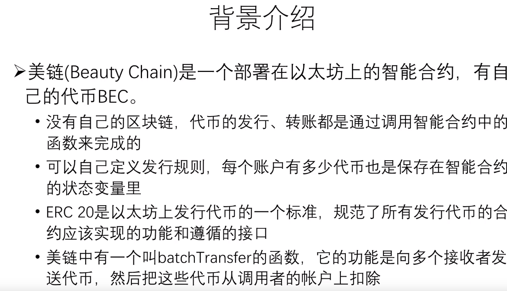</div>

> 问题
- 整数相乘溢出
<div style="zoom:60%; font-size: 24px;" align="center">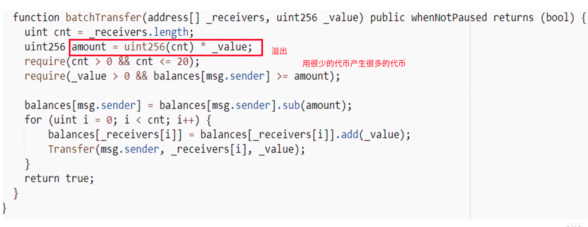</div>

> 预防

<div style="zoom:60%; font-size: 24px;" align="center">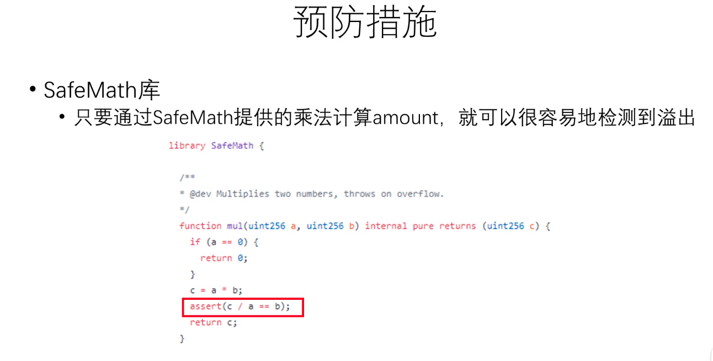</div>

# ETH 总结
- 加密货币应该用在已有技术领域解决不太好的领域。
  - 用在线下购买咖啡等领域没必要
  - Internet使得信息传播变得方便（跨国界），但是支付没有跟得上（美国支付到中国，周期长，服务费贵）。（**现在的金融体系当中，缺少一种全球范围流通的电子货币，而且货币的支付方式要能够和信息传播方式结合在一起**）
  - 趋势：支付渠道和信息传播渠道融合，使得价值交换和信息传播一样方便

- 能耗这么大，那么加密货币有什么好处
  - 加密货币不应该用于与已有支付方式竞争
  - 随着区块链技术的发展，共识协议的不断改进，支付效率会大大提高
  - **评价一个支付方式效率的好坏，要与当时特定的历史条件去判断，要与当时的其他支付方式相比较**（比如跨国交易的效率，银行租办公室，雇人，也是需要算到能耗里一起去比较的）

- 智能合约有这么多问题，为什么还要用。普通合约不是代码，还可能看得懂。
  - 智能合约还处于早期，出现的问题比较多是正常的
  - 出现问题不等于不使用
  - 软件将会改变世界，这是一个大趋势
  - 不要以为智能合约能解决所有问题
  - 不要以为民主投票做的选择一定是正确的。