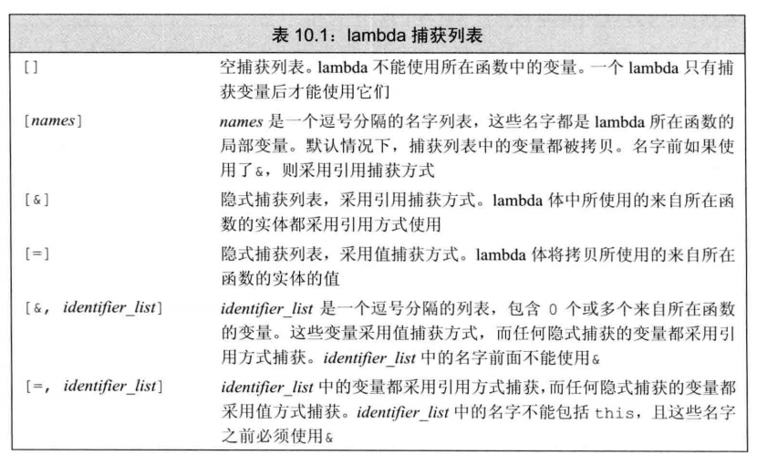
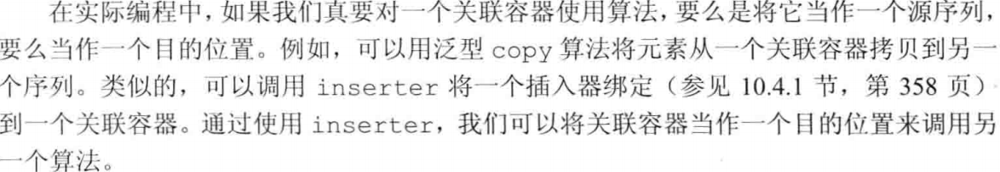
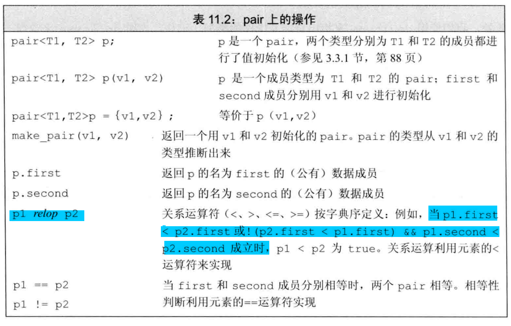
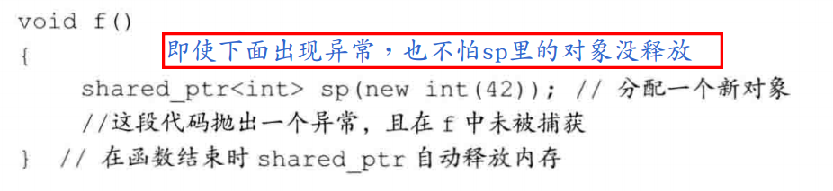
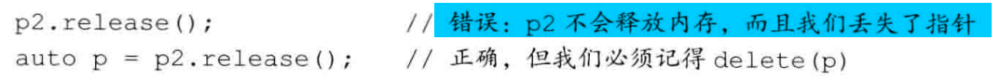

- [IO类](#IO%E7%B1%BB)
  - [IO类](#IO%E7%B1%BB-1)
    - [条件状态](#%E6%9D%A1%E4%BB%B6%E7%8A%B6%E6%80%81)
    - [管理输出缓存](#%E7%AE%A1%E7%90%86%E8%BE%93%E5%87%BA%E7%BC%93%E5%AD%98)
  - [文件输入输出](#%E6%96%87%E4%BB%B6%E8%BE%93%E5%85%A5%E8%BE%93%E5%87%BA)
    - [文件模式](#%E6%96%87%E4%BB%B6%E6%A8%A1%E5%BC%8F)
  - [string 流](#string-%E6%B5%81)
- [顺序容器](#%E9%A1%BA%E5%BA%8F%E5%AE%B9%E5%99%A8)
  - [顺序容器概述](#%E9%A1%BA%E5%BA%8F%E5%AE%B9%E5%99%A8%E6%A6%82%E8%BF%B0)
  - [容器库概览](#%E5%AE%B9%E5%99%A8%E5%BA%93%E6%A6%82%E8%A7%88)
    - [迭代器](#%E8%BF%AD%E4%BB%A3%E5%99%A8)
    - [容器的类型成员](#%E5%AE%B9%E5%99%A8%E7%9A%84%E7%B1%BB%E5%9E%8B%E6%88%90%E5%91%98)
    - [容器定义和初始化](#%E5%AE%B9%E5%99%A8%E5%AE%9A%E4%B9%89%E5%92%8C%E5%88%9D%E5%A7%8B%E5%8C%96)
    - [赋值和swap](#%E8%B5%8B%E5%80%BC%E5%92%8Cswap)
    - [容器的大小](#%E5%AE%B9%E5%99%A8%E7%9A%84%E5%A4%A7%E5%B0%8F)
    - [容器大小的比较](#%E5%AE%B9%E5%99%A8%E5%A4%A7%E5%B0%8F%E7%9A%84%E6%AF%94%E8%BE%83)
  - [顺序容器操作](#%E9%A1%BA%E5%BA%8F%E5%AE%B9%E5%99%A8%E6%93%8D%E4%BD%9C)
    - [向顺序容器添加元素](#%E5%90%91%E9%A1%BA%E5%BA%8F%E5%AE%B9%E5%99%A8%E6%B7%BB%E5%8A%A0%E5%85%83%E7%B4%A0)
    - [访问元素](#%E8%AE%BF%E9%97%AE%E5%85%83%E7%B4%A0)
    - [删除元素](#%E5%88%A0%E9%99%A4%E5%85%83%E7%B4%A0)
    - [特殊的forward_list](#%E7%89%B9%E6%AE%8A%E7%9A%84forwardlist)
    - [改变容器大小](#%E6%94%B9%E5%8F%98%E5%AE%B9%E5%99%A8%E5%A4%A7%E5%B0%8F)
    - [容器操作可能使迭代器失效](#%E5%AE%B9%E5%99%A8%E6%93%8D%E4%BD%9C%E5%8F%AF%E8%83%BD%E4%BD%BF%E8%BF%AD%E4%BB%A3%E5%99%A8%E5%A4%B1%E6%95%88)
    - [vector和string对象是如何增长的](#vector%E5%92%8Cstring%E5%AF%B9%E8%B1%A1%E6%98%AF%E5%A6%82%E4%BD%95%E5%A2%9E%E9%95%BF%E7%9A%84)
  - [额外的string操作](#%E9%A2%9D%E5%A4%96%E7%9A%84string%E6%93%8D%E4%BD%9C)
  - [容器适配器](#%E5%AE%B9%E5%99%A8%E9%80%82%E9%85%8D%E5%99%A8)
    - [定义设配器](#%E5%AE%9A%E4%B9%89%E8%AE%BE%E9%85%8D%E5%99%A8)
    - [栈适配器](#%E6%A0%88%E9%80%82%E9%85%8D%E5%99%A8)
    - [队列适配器](#%E9%98%9F%E5%88%97%E9%80%82%E9%85%8D%E5%99%A8)
- [泛型算法](#%E6%B3%9B%E5%9E%8B%E7%AE%97%E6%B3%95)
  - [概述](#%E6%A6%82%E8%BF%B0)
  - [初识泛型函数](#%E5%88%9D%E8%AF%86%E6%B3%9B%E5%9E%8B%E5%87%BD%E6%95%B0)
    - [只读算法](#%E5%8F%AA%E8%AF%BB%E7%AE%97%E6%B3%95)
    - [写容器元素的算法](#%E5%86%99%E5%AE%B9%E5%99%A8%E5%85%83%E7%B4%A0%E7%9A%84%E7%AE%97%E6%B3%95)
    - [重排容器的算法](#%E9%87%8D%E6%8E%92%E5%AE%B9%E5%99%A8%E7%9A%84%E7%AE%97%E6%B3%95)
  - [定制操作](#%E5%AE%9A%E5%88%B6%E6%93%8D%E4%BD%9C)
    - [向算法传递函数](#%E5%90%91%E7%AE%97%E6%B3%95%E4%BC%A0%E9%80%92%E5%87%BD%E6%95%B0)
    - [lambda表达式](#lambda%E8%A1%A8%E8%BE%BE%E5%BC%8F)
    - [参数绑定](#%E5%8F%82%E6%95%B0%E7%BB%91%E5%AE%9A)
  - [再探迭代器](#%E5%86%8D%E6%8E%A2%E8%BF%AD%E4%BB%A3%E5%99%A8)
    - [插入迭代器](#%E6%8F%92%E5%85%A5%E8%BF%AD%E4%BB%A3%E5%99%A8)
    - [iostream迭代器](#iostream%E8%BF%AD%E4%BB%A3%E5%99%A8)
    - [反向迭代器](#%E5%8F%8D%E5%90%91%E8%BF%AD%E4%BB%A3%E5%99%A8)
  - [泛型算法结构](#%E6%B3%9B%E5%9E%8B%E7%AE%97%E6%B3%95%E7%BB%93%E6%9E%84)
    - [迭代器类别](#%E8%BF%AD%E4%BB%A3%E5%99%A8%E7%B1%BB%E5%88%AB)
    - [算法形参模式](#%E7%AE%97%E6%B3%95%E5%BD%A2%E5%8F%82%E6%A8%A1%E5%BC%8F)
    - [算法命名规范](#%E7%AE%97%E6%B3%95%E5%91%BD%E5%90%8D%E8%A7%84%E8%8C%83)
  - [特定容器的算法](#%E7%89%B9%E5%AE%9A%E5%AE%B9%E5%99%A8%E7%9A%84%E7%AE%97%E6%B3%95)
- [关联容器](#%E5%85%B3%E8%81%94%E5%AE%B9%E5%99%A8)
  - [使用](#%E4%BD%BF%E7%94%A8)
    - [类型别名](#%E7%B1%BB%E5%9E%8B%E5%88%AB%E5%90%8D)
    - [关联容器迭代器](#%E5%85%B3%E8%81%94%E5%AE%B9%E5%99%A8%E8%BF%AD%E4%BB%A3%E5%99%A8)
    - [增删改查](#%E5%A2%9E%E5%88%A0%E6%94%B9%E6%9F%A5)
      - [添加](#%E6%B7%BB%E5%8A%A0)
      - [删除元素](#%E5%88%A0%E9%99%A4%E5%85%83%E7%B4%A0-1)
      - [map的下标操作](#map%E7%9A%84%E4%B8%8B%E6%A0%87%E6%93%8D%E4%BD%9C)
      - [查找访问](#%E6%9F%A5%E6%89%BE%E8%AE%BF%E9%97%AE)
    - [pair](#pair)
  - [无序容器](#%E6%97%A0%E5%BA%8F%E5%AE%B9%E5%99%A8)
    - [管理桶](#%E7%AE%A1%E7%90%86%E6%A1%B6)
    - [无序容器对关键字类型的需求](#%E6%97%A0%E5%BA%8F%E5%AE%B9%E5%99%A8%E5%AF%B9%E5%85%B3%E9%94%AE%E5%AD%97%E7%B1%BB%E5%9E%8B%E7%9A%84%E9%9C%80%E6%B1%82)
- [动态内存](#%E5%8A%A8%E6%80%81%E5%86%85%E5%AD%98)
  - [动态内存与智能指针](#%E5%8A%A8%E6%80%81%E5%86%85%E5%AD%98%E4%B8%8E%E6%99%BA%E8%83%BD%E6%8C%87%E9%92%88)
    - [shared_ptr类](#sharedptr%E7%B1%BB)
    - [demo1:共享内存数据](#demo1%E5%85%B1%E4%BA%AB%E5%86%85%E5%AD%98%E6%95%B0%E6%8D%AE)
    - [直接管理内存](#%E7%9B%B4%E6%8E%A5%E7%AE%A1%E7%90%86%E5%86%85%E5%AD%98)
    - [shared_ptr 和new结合使用](#sharedptr-%E5%92%8Cnew%E7%BB%93%E5%90%88%E4%BD%BF%E7%94%A8)
    - [智能指针和异常](#%E6%99%BA%E8%83%BD%E6%8C%87%E9%92%88%E5%92%8C%E5%BC%82%E5%B8%B8)
    - [shared_ptr基本规范](#sharedptr%E5%9F%BA%E6%9C%AC%E8%A7%84%E8%8C%83)
    - [unique_ptr](#uniqueptr)
    - [weak_ptr](#weakptr)
    - [demo2:weak_ptr的运用](#demo2weakptr%E7%9A%84%E8%BF%90%E7%94%A8)
  - [动态数组](#%E5%8A%A8%E6%80%81%E6%95%B0%E7%BB%84)
    - [new和数组](#new%E5%92%8C%E6%95%B0%E7%BB%84)
    - [allocator类](#allocator%E7%B1%BB)
# IO类
## IO类
> IO库类型和头文件
- w开头的对应的是来操作宽字符版本的类型`wchar_t`。
<div align="center"></div>

> IO类型之间的关系
- ifstream和istringstream都继承自istream
- ofstream和ostringstream都继承自ostream
- `所以istream和ostream可以使用的，继承他们的都可以使用`

---
> IO对象无拷贝或赋值
- 一般都是通过引用方式传递和返回流
- 读写一个IO对象会改变状态，所以不能用const


### 条件状态
> IO库与条件状态相关的成员函数和变量
<div align="center"></div>
<div align="center"></div>

> 直接将其当条件来使用
- 可以判断一个流是否有效（或是否错误），但是不能知道具体发生什么（不知道细节）。

> 查询流的细节
- iostate类型：作为一个位的集合来使用。
  - badbit：不可恢复，系统级错误
  - failbit：可恢复，读错，eg：要int来char。eofbit被置位，其也会被置位。
  - eofbit：读到EOF
  - goodbit：值为0，表示流未发生错误
- `badbit和failbit和eofbit任意个被置位，当条件的时候就会为false。`等价于，`!fail()`
<div align="center"></div>

- 拥有相对应的函数来获取某个状态的置位情况。

<div align="center"></div>

> 管理条件状态
- rdstate()方法：返回iostate
- setstate()方法：设置iostate
- clear()方法：
  - 不带参数：清除所有的错误标记位，good()会返回true，也就是goodbit置0
  - 接收iostate值：eg，cin.rdstate和cin.failbit等成员的位操作结合，用来设置流的新状态。
  
<div align="center"></div>

```cpp
int main(){
    int a;
    stringstream ss;
    ss << "www";
    ss >> a;
    cout << "good:"<< (ss.good()?0:1) << endl;
    cout << "fail:"<< (ss.fail()?1:0) << endl;
    cout << "bad:" << (ss.bad()?1:0) << endl;
    cout << "eof:"<< (ss.eof()?1:0) << endl;
    // failbit 复位
    // 1. 不能对goodbit复位，没有什么效果
    // ss.clear(ss.rdstate() & ~ss.goodbit );
    // 2. 对failbit复位了之后，good将自动置0
    ss.clear(ss.rdstate() & ~ss.failbit );
    cout << "after clear:" << endl;
    cout << "good:"<< (ss.good()?0:1) << endl;
    cout << "fail:"<< (ss.fail()?1:0) << endl;
    cout << "bad:" << (ss.bad()?1:0) << endl;
    cout << "eof:"<< (ss.eof()?1:0) << endl;
    return 0;
}
```
### 管理输出缓存
> 导致缓冲刷新的原因
<div align="center"></div>

> 操作符显示刷新缓冲区
- endl：刷新并换行
- ends：刷新打空格
- flush：刷新什么都不做
```cpp
cout << "hello" << flush;
```

> unitbuf操作符

<div align="center"></div>

> 关联输入和输出流
- 标准库中cin和cout关联在一起，所以cin的时候，会把所有cout的缓存都打印
- 每个流最多关联到一个流。但是多个流可以关联到同个流。
- istream和ostream都可以关联到一个ostream。

- 用来创建关联的方法：`tie`，以下是其用法描述

<div align="center"></div>

- tie的示例代码

<div align="center"></div>

## 文件输入输出
> fstream 特有操作
<div align="center"></div>

> open和close

- open失败，failbit会被置位。如果对一个已经打开的文件流进行open，也会失败，并置位failbit。
- open之后也需要将流对象作为条件来检查。
- 如果要让一个文件流关联到另外一个文件，需要先关闭，再open新文件。重新open之后可以重新指定文件模式。如果open时不指定模式，将用隐式的设置
- 当一个fstream对象被销毁，close会自动调用。

### 文件模式
<div align="center"></div>

> 指定文件模式的限制关系

<div align="center"></div>

- 每个文件流类型都定义了一个`默认的文件模式`。
<div align="center"></div>

> out模式打开文件，数据会丢失
<div align="center"></div>

## string 流

> stringstream 特有操作
<div align="center"></div>


# 顺序容器
## 顺序容器概述
- 顺序容器：可以顺序的访问和控制元素的存储。
- 不同顺序容器在以下两方面做折中
  - 非顺序访问的时候的代价
  - 添加删除的代价

- 顺序容器类型
  - vector
  - deque
  - list
  - forward_list：C++11
  - array：C++11
  - string
<div align="center"></div>

- 多使用标准库容器，而不要使用内置的了，或者自己实现的。因为标准库中都是优化到最好的了

> 确定使用哪种顺序容器
- 首选vector
- 内存开销
  - 容器中元素类型很小，空间额外开销重要，不要使用list和forward_list
- 访问
  - 要随机访问：vector，deque
- 添加和删除
  - 要在容器中间添加和删除：list，forwardlist
  - 只需要头尾插入和删除：deque
- 只有在读取的时候需要中间插入，随后需要随机访问
  - 确定是否真的需要一开始就在容器中间位置添加元素
    - 不需要：先用vector追加来存储，再用sort重排。
    - 需要：输入阶段用list，之后拷贝到vector。
- 既需要随机访问，又需要容器中间位置插入
  - 取决于list、forward_list中访问元素和vector、deque中插入/删除元素的相对性能。
  - 这种就要从访问多还是插入删除多来分析。有必要分别测试应用的性能。

## 容器库概览
### 迭代器
> 迭代器类型
- iterator
- const_iterator：C++11，为了方便auto
- 反向迭代器
  - reverse_iterator
  - const_reverse_iterator

> 获取迭代器
- begin()，end()
- cbegin()，cend()
- rbegin()，rend()：rbegin为首元素之前位置
- crbegin()，crend()

- 注:
  - begin对于容器是const的，返回const的迭代器
    - 显示指定类型：`list<string>::const_iterator it = a.begin()`
  - 不需要写访问时，应该用cbegin和cend
> 迭代器范围
- 左闭右开
  - 好处：在处理的时候方便
    - begin == end：范围为空
    - begin != end：肯定不为空
    - begin可以++，使得begin == end
- 构成范围要求
  - 指向同一个容器
  - begin通过++可以到达end

- forward_list 迭代器不支持递减运算符’`--`‘

### 容器的类型成员
- `iteration`
- `const_iteration`
- `reverse_iterator`
- `const_reverse_iterator`
- `size_type`:无符号整型，保存容器最大可能大小
- `difference_type`:带符号整型，足够保存的两个迭代器之间的距离
- `value_type`：元素类型
- `reference`：元素的左值类型，与value_type&含义一样
- `const_reference`：const value_type&

### 容器定义和初始化
- 除了array，其他容器默认构造函数都会创建一个空容器，并且可以指定容器大小和初始值的参数
<div align="center"></div>

> 容器拷贝
- 两种
  - 容器->容器：格式要求严格
  - 迭代器范围->容器：格式要求不严格。元素类型char*->string，容器类型：list->vector，这种方式是允许的。

> 列表初始化
- C++11标准
- 除了array，初始化列表还隐含了指定容器大小
<div align="center"></div>

> 与顺序容器大小相关的构造函数
- `采用的是值初始化`而不是默认初始化，所以没指定的时候，内置类型被置于0.
- 如果元素是类，而且没有默认初始化，需要提供一个初始化值。

<div align="center"></div>

> 标准库array具有固定大小

- 为了使用array类型，我们必须同时指定元素的类型和大小。
```cpp
#include <list>
#include <array>
using std::array;
int main(){
    array<int,10> intArray{1,2,3,4,5};
    array<int,10>::size_type i = intArray[3];
    cout << i << endl;
    return 0;
}
```
- 默认初始化：未定义
  - `array<int,10> ia1`
- 值初始化：0
  - `array<int,10> ia1{1}`

### 赋值和swap
- array与内置的数组不同，允许通过array数组赋值
```cpp
int main(){
    array<int,10> intArray{1,2,3,4,5};
    array<int,10> t;
    t = intArray;
    return 0;
}
```
<div align="center"></div>

> assign的使用
- 允许从一个不同但相容的类型赋值，或者从容器的一个子序列，容器内容还可以不同。
- 用法
  - 给一个容器范围
  - 初始化列表
  - 给一个整型值和一个元素值。等价与clear和insert的组合
```cpp
// 给一个容器范围
#include <list>
#include <array>
using std::list;
using std::array;
int main(){
    vector<int> vInt{1,2,3,4};
    list<int> lInt;
    lInt.assign(vInt.begin(),vInt.end());
    for(auto a:lInt){
        cout << a << " ";
    }
    return 0;
}
```

```cpp
// 给一个整型值和一个元素值
#include <list>
#include <array>
using std::list;
using std::array;
// out: 1 1 1 1 1 1 1 1 1 1
int main(){
    list<int> lInt{1};
    lInt.assign(10,1);
    // 等价于：
    // lInt.clear();
    // lInt.insert(lInt.begin(),10,1);
    for(auto a:lInt){
        cout << a << " ";
    }
    return 0;
}
```

> 使用swap
- 除了array外，交换两个容器内容会很快，是常数级别的没元素本身不会变，就是改变容器内部的数据结构。
- 针对大多数
  - 原本的迭代器指向的元素值没变，但是所属的容器变了
- 针对string
  - swap后，迭代器，指针，引用在swap后失效
- 针对array
  - 不会失效。
  - 但是原本指向的元素值换了
  - 容器的容量必须相等
- 有成员版本的swap和非成员版本的swap，swap在泛型编程中非常重要，`统一使用非成员版本的swap是个好习惯`
```cpp
#include <list>
#include <array>
using std::list;
using std::array;
int main(){
    list<int> lInt1{1,2,3,4,5};
    list<int> lInt2{6,7,8,9};
    auto it1 = lInt1.begin();
    auto it2 = lInt2.begin();

    swap(lInt1,lInt2);
    // out:1
    cout << "it1:" << *it1 << endl;
    // out:6
    cout << "it2:" << *it2 << endl;
    // out: 1 2 3 4 5
    for(;it1 != lInt2.end();it1++){
        cout << *it1 << " " ;
    }
    cout << "\n-------\n";

    array<int,5> aInt1{1,2,3,4,5};
    array<int,5> aInt2{6,7,8,9};
    auto it3 = aInt1.begin();
    auto it4 = aInt2.begin();

    swap(aInt1,aInt2);
    // out:6
    cout << "it3:" << *it3 << endl;
    // out:1
    cout << "it4:" << *it4 << endl;
    // out: 6 7 8 9 10
    for(;it3 != aInt1.end();it3++){
        cout << *it3 << " " ;
    }

    return 0;
}

```

### 容器的大小
- 成员函数
  - size：forward_list不支持
  - empty：是否为空
  - max_size：返回一个大于或者等于该类型容器的最大元素数的值。

### 容器大小的比较
- 所有的容器都支持`==`和`!=`，但是只有顺序容器支持`> < <= >=`
- 和string的比较规则是一样的
- 只有当其元素类型也定义了比较运算的时候才能进行比较
> 比较规则
<div align="center"></div>

## 顺序容器操作
### 向顺序容器添加元素
- array在这些操作中全都不能用

<div align="center"></div>

> push_back
- 支持：除了array和forward_list不支持，其他都支持
- 创建一个元素，然后加入到容器末尾。


```cpp
// out：1 2 3
int main(){
    list<int> lInt;
    lInt.push_back(1);
    lInt.push_back(2);
    lInt.push_back(3);
    for(auto a : lInt){
        cout << a << " ";
    }
    return 0;
}
```

> push_front
- 支持：vector和string不支持。
- 创建一个元素，然后加到容器末尾
- debug可以保证在首位加入时是常数时间


```cpp
// out：3 2 1
int main(){
    list<int> lInt;
    lInt.pust_front(1);
    lInt.pust_front(2);
    lInt.pust_front(3);
    for(auto a : lInt){
        cout << a << " ";
    }
    return 0;
}
```
> insert
- 插入到vetor和debug和string会非常耗时
- insert插入的地方是`指定迭代器之前`
- 插入的时候，不能是被插入的容器 的容器范围。
- 用法：
  - 在特定位置添加元素
    - 参数：1.位置，2.元素
  - 插入一个容器范围内元素
    - 参数：1.位置，2.范围
    - 范围可以是`2-1.初始化列表`，`2-2.迭代器范围`，`2-3. n个重复值`
- 返回：第一个新加入元素的迭代器

```cpp
// out:init init One 22 33 null null null null 44
int main(){
    vector<string> vsin{"22","33","44"};
    vector<string> vs;
    // 1.插入元素
    vs.insert(vs.begin(), "One");
    // 2.插入容器范围
    vs.insert(vs.end(),vsin.begin(),vsin.end());
    // 3.插入指定数量初始值元素
    vs.insert(vs.begin()+3,4,"null");
    // 4.插入初始化列表
    vs.insert(vs.begin(),{"init","init"});
    for(auto t : vs){
        cout << t << " ";
    }

    return 0;
}
```

> emplace
- c++11
- 分别有emplace_front、emplace、emplace_back，与insert_front、insert、insert_back。
- 区别：不是将元素类型对象传递给他们，然后拷贝到容器中。而是在emplace时，调用元素类型的构造函数，在容器管理的内存空间中直接构造函数。
  - push_back是创建一个临时对象，然后再将其拷贝到容器中。

```cpp
class Student{
public:
    Student(string aname, string asex, string aage):name(aname),sex(asex),age(aage){};
    void show(){
        cout << name << " " << sex << " " << age << endl;
    }
private:
    string name;
    string sex;
    string age;

};

int main(){
    vector<Student> vStu;
    vStu.emplace(vStu.begin(),"l1nkkk", "man", "22");
    vStu.at(0).show();
    return 0;
}
```

### 访问元素
<div align="center"></div>

- front，back：
  - bach不适用与forward_list
  - 分别返回首元素和尾元素的引用。注意：不是尾后元素
  - 在调用的时候，应该注意要确保容器非空，不然的话接下来的行为未定义的
  - `auto &a = c.back()`,如果希望使用此变量改变元素的值，记得用引用类型
- begin和end：
  - 返回的是迭代器,而且end返回的是尾后指针
  - 要使用元素需要`*`
- at：
  - 只支持：string，vector。deque，array这些非链式顺序结构
  - 与`[]`的区别在于这个如果访问越界，会抛出`out_of_range`异常

### 删除元素
<div align="center"></div>

- pop_front，pop_back：
  - 支持：
    - vector,string,array不支持pop_front
    - forward_list不支持pop_back
- 从容器内部删除一个元素(erase)： 
  - 可以删除一个元素，也可以删除迭代器范围里的元素。
  - 返回：删除的元素之后位置的迭代器
- clear
  - 删除所有元素

### 特殊的forward_list
<div align="center"></div>

- 因为添加和删除一个元素都需要其前驱
- forward_list未定义insert、emplace、erase，而是定义`insert_after`，`emplace_after`，`erase_after`
- `before_begin`返回一个首前迭代器，相当于尾后元素，这样就可以让链表在首元素之前添加删除元素。
- 当对其操作的时候需要关注两个迭代器，一个指向我们要处理的元素，一个指向其前驱。如以下代码所示

```cpp
// out: 2 4 6 8
int main(){
    forward_list<int> fls{1,2,3,4,5,6,7,8,9};
    auto prev = fls.before_begin();
    auto curr = fls.begin();
    while(curr != fls.end()){
        if(*curr%2 )
            curr = fls.erase_after(prev); // 返回删除的后一个
        else{
            prev = curr;
            ++curr;
        }
    }
    for(auto a:fls){
        cout << a << " ";
    }
}
```

### 改变容器大小
- array不支持resize
<div align="center"></div>

### 容器操作可能使迭代器失效
<div align="center"></div>
<div align="center"></div>

- 考虑erase和insert，因为其可以返回迭代器
- 不要缓存end()，直接v.end()

### vector和string对象是如何增长的
> vector和string管理容量的成员函数
- c.shrink_to_fit：容容器的容量减少为size()。不保证一定退回内存空间
- c.capacity：返回容器容量
- c.reserve：设置容器容量，设置的比目前的容量大才会生效。分配的大小至少为需要的内存大小，可能比这个值大。


-----------

- 随着元素的增加，用一定的算法自动扩容。
<div align="center"></div>

## 额外的string操作


- 提供了其他顺序容器所没有的操作
- 详见9.5章节

- string的构造
  - 使用const char*和下标
  - 使用string和下标
  - 使用string字串
<div align="center"></div>
<div align="center"></div>

- string的插入和删除和替代
  - insert和erase提供下标的版本
  - insert和assign支持c风格字符数组
  - append和replace为新的成员函数
    - append：在后面添加字符串
    - replace：替代
<div align="center"></div>
<div align="center"></div>

- string的搜索
<div align="center"></div>
<div align="center"></div>

- compare操作
<div align="center"></div>

- string和其他数值类型之间的转化
<div align="center"></div>


## 容器适配器
- 适配器：接受一个已有的东西，但是使其行为看起来像另外一种不同的类型
- 有三个顺序容器的适配器：queue、stack、priority_queue。

<div align="center"></div>

### 定义设配器
- 默认情况下，queue和stack是基于deque，priority_queue 是基于vector。
- 可以通过指定第二个类型参数来重载默认容器类型。eg:`stack<string,vector<string>>`
  - `stack`要求push_back、pop_back和back操作，所以只要不是array和forward_list就都可以
  - `queue`要求push_back,pop_front,back,front，所以可以是list和deque，不能是vector。
  - `priority_queue`要求front、push_back和pop_back操作之外，还需要随机访问的能力，所以可以是vector和deque，不能是list1。

### 栈适配器
<div align="center"></div>

### 队列适配器
- queue和priority_queue都定义在头文件queue中
- priority_queue是根据一个优先级来插入排队的，而不是一脑门FIFO

<div align="center"></div>

<div align="center"></div>

# 泛型算法
## 概述
- 引入：顺序容器中方法的操作很少，就是些增删改的操作。如果我们想要查找，替换或删除特定的值或者排序，这章给我们介绍了一些方法。`标准库没给这些操作定义方法，而是通过定义一组泛型算法`，`泛型`指可以用于不同元素类型的多种容器。
  - 库：`algorithm`和`numeric`
- 一般情况下操作的不是容器，而是两个迭代器指定的元素范围。

- 迭代器令算法不依赖于容器，但是算法依赖于元素类型的操作

- 使用算法的时候有这些假定
  - 不会改变容器大小
  - 可能改变元素的值
  - 可能改变元素的顺序，但是永远不会添加或删除元素
> 插入器

- 一种特殊的迭代器，当给这类迭代器赋值的时候，在底层实现的是执行插入操作，这是迭代器操作的，算法本身不会这样去做。

> find函数

- 由两个迭代器指定范围，第三个参数是要查找的值
  - 返回：失败返回第二个参数来表示搜索失败


## 初识泛型函数
- 理解这些算法最基本方法是了解
  - 是否读取元素
  - 是否改变元素
  - 是否重排元素位置

### 只读算法

> accumulate

- 定义在numeric中
- 参数：前两个是范围，最后一个是和的初始值
  - 元素类型不用严格匹配
- 返回：累加的结果
- 功能：累加

- 注意
  - 第三个参数决定了使用的运算符,以下代码将出错，因为`const char *`并没有+运算符
```
string sum = accumulate(v.cbegin(),v.cend(),"");
```

> equal

- 功能：判断两个迭代器范围是不是一样
- 参数：前两个为一个迭代器范围，第三个表示第二个序列的首元素
  - 元素类型和容器类型不用严格匹配
  - 假设第二个序列至少和第一个一样长，所以用的时候要小心，保证这点是用户的责任

### 写容器元素的算法
- 当使用这类算法时，要确保序列原大小至少不小于我们所要求写入改变的。

> fill
- 提供改变的范围，一般这种不会危险。
- 参数：一个迭代器范围，第三个为一个值
- 功能：将一个指定值赋值给一个指定范围
- 返回：void

```cpp
int main(){
    vector<int> a{1,2,3,4,5,6,7};
    fill(a.begin(),a.end(),0);
    for(auto t :a){
        cout << t << " ";
    }
}
```


> fill_n    

- 参数：一个单迭代器，一个计数值，一个值
- 返回：void
- 功能：从迭代器开始，将赋予给定数量的值。

- 这段代码将带来灾难，因为a中还没有元素，其是空的，结果未定义。
```cpp
int main(){
    vector<int> a;
    fill(a.begin(),10,0);
    for(auto t :a){
        cout << t << " ";
    }
}
```

> 插入迭代器

- back_inserter(容器) 将返回一个插入迭代器
- 头文件：\<iterator>
- 以下代码利用fill_n,和插入迭代器来实现对容器的插入添加

```cpp
vector<int> a;
auto it = back_inserter(a);
fill_n(it,10,0);
for(auto t : a){
    cout << t << " ";
}
```


> copy

- 参数（3）：一个输入范围（2），第三个表示目的序列的起始位置
- 返回：拷贝到目的序列的后一个位置
- 功能：将一个输入范围拷贝到目的序列

```cpp
// output：1 1 1 1 1 1 0 0 0 0
int a[10] = {1,1,1,1,1,1};
int b[10];
copy(begin(a),end(a),b);

for(auto t : b){
    cout << t << " ";
}
```

> replace

- 功能：替代
- 参数：
  - 一个迭代器范围（2），一个搜索值，一个新值


> replace_copy

- 功能：替代,但不改变原迭代器的范围
- 参数：
  - 一个迭代器范围（2），一个接收改变的迭代器，一个搜索值，一个新值

```cpp
vector<int> a{1,2,3,4,5,0,0,0,0};
vector<int> b;

replace_copy(a.begin(),a.end(),back_inserter(b),0,11);
for(auto tb : b){
    cout << tb << " ";
}
return 0;
```

### 重排容器的算法
- sort、unique
- 标准库算法是对迭代器而不是容器进行操作，因此`算法不能(直接)添加或者删除`，可以通过插入迭代器


> unique

- 功能：使得连续重复的元素只出现一次。如果要删除，要用容器的方法最后对其删除
- 参数：迭代器范围（2）
- 返回：一个指向不重复值范围的末尾的迭代器。
- 注：
  - 返回的迭代器后面的内容是不能再利用的，因为其不保证是将原本的重复值换到后面去。
```cpp
vector<int> a{4,5,3,2,6,8,1,24,5,63,2,1,3,5,6,2,9};
sort(a.begin(),a.end());

//out:1 1 2 2 2 3 3 4 5 5 5 6 6 8 9 24 63
for(auto t:a){
    cout << t << " ";
}
cout << endl;

// out:1 2 3 4 5 6 8 9 24 63 5 6 6 8 9 24 63
auto unique_end = unique(a.begin(),a.end());
for(auto t:a){
    cout << t << " ";
}
cout << endl;

a.erase(unique_end,a.end());
// out:1 2 3 4 5 6 8 9 24 63
for(auto t:a){
    cout << t << " ";
}

```

## 定制操作
- 有时候标准库默认的操作我们不想要，因此为我们提供自定义操作。
  - 比如：sort默认使用<,可以提供一个`谓词`，来指定其操作。

### 向算法传递函数
- 谓词分两类：
  - 一元谓词：只接受一个参数
  - 二元谓词：接受两个参数

> sort和stable_sort
- 传给sort一个二元谓词

- stable_sort:如果相等则用原本的比较方式
  - 好奇怪啊，不是我想要的感觉
```cpp
// 二元谓词
bool isShorter(const string &s1,const string &s2){
    return s1.size() < s2.size();
}
int main(){
    vector<string> vs{"the","quick","red","fox","jumps","over","the","slow","red","turtle","aaa","aax"};
    vector<string> vs1 = vs;
    vector<string> vs2 = vs;
    sort(vs.begin(),vs.end());
    // aaa aax fox jumps over quick red red slow the the turtle
    for(auto ts : vs){
        cout << ts << " ";
    }
    cout << endl;


    // 传入谓词
    sort(vs1.begin(),vs1.end(),isShorter);
    // the red fox the red aaa aax over slow quick jumps turtle
    for(auto ts : vs1){
        cout << ts << " ";
    }
    cout << endl;

    // stable_red
    stable_sort(vs2.begin(),vs2.end(),isShorter);
    // the red fox the red aaa aax over slow quick jumps turtle
    for(auto ts : vs2){
        cout << ts << " ";
    }
    cout << endl;
}
```

> find_if

- 功能：查找容器范围满足要求的元素
- 参数：迭代器范围（2），谓词
- 返回：返回一个迭代器（第一个满足条件的）,如果没找到，返回最后一个迭代器位置
```cpp
auto wc = find_if(words.begin(), words.end(), [sz](const string &a){return a.size() >= sz;})
```

> for_each
- 功能：对迭代器范围的每个元素，进行统一处理
- 参数：迭代器范围（2），谓词
- 返回：void
```cpp
for_each(words.begin(),words.end(),[](const string &s){cout << s << " "});
```

### lambda表达式
> 可调用对象

- 定义：可以使用调用运算符的，则称之为可调用的。

- `可调用对象`
  - 函数
  - 函数指针
  - 重载了函数调用运算符的类
  - lambda表达式

----

<div align="center"></div>

- 没有用捕获完全可以用函数来替代

> lambda格式

<div align="center"></div>

- 如果忽略了参数列表，则表示无形参
- 如果忽略了返回类型。**且函数体只有一条return语句**，则会自己进行类型推断。如果包含除了return之外的语句，则编译器假定该lambda返回void。
- `[]捕获列表只用于局部非static变量，lambda中可以直接使用局部static变量和所在函数之外声明的名字。`
- 关于参数：不能有默认参数，其他差不多
> 捕获和返回
- 捕获的都是局部变量
- 值捕获
  - 前提：变量可以捕获
  - 和参数不同的是，是在lambda创建的时候拷贝，而不是在调用的时候。`随后的修改不会影响到lambda内对应的值`
  - 默认不可对该变量进行修改

- 引用捕获
  - 可不可以对变量进行修改取决于捕获的是不是const 引用。
  - 必须确保在lambda执行的时候引用对象存在  
  - 如果函数返回一个lambda，则lambda不能包含引用捕获
- 建议：
  - 如果我们捕获一个指针或迭代器，或者采用引用捕获方式，就必须确保当lambda执行时，绑定的迭代器、指针或引用的对象仍然给存在。而且，要确保有预期的值。
  - 尽量减少捕获的数据量。如果可能，避免捕获指针和引用。

- demo1
```cpp
int main(){
    int a = 3;
    auto f = [a]()mutable {return ++a;};
    a = 0;
    // out:4 5 0
    cout << f() << " " << f() << " " << a << endl;

    int b = 4;
    auto f1 = [&b]() {return ++b;};
    b = 0;
    // out:1 2 2
    cout << f1() << " " << f1() << " " << b << endl;
}
```

- demo2
```cpp
bool isShorter(const string &s1, const string &s2){
    return s1.size() < s2.size();
}

int main(){
    vector<string> vs{"the","quick","red","fox","jumps","over","the","slow","red","turtle","aaa","aax"};

    // stable_red
    stable_sort(vs.begin(),vs.end(),isShorter);
    // the red fox the red aaa aax over slow quick jumps turtle
    for(auto ts : vs){
        cout << ts << " ";
    }
    cout << endl;

    
    string::size_type sz = 4;
    auto it = find_if(vs.begin(), vs.end(), [sz](const string & s){ return s.size() > 4;});
    vs.erase(it,vs.end());
    for(auto ts : vs){
        cout << ts << " ";
    }
    cout << endl;
}
```


- 建议
  - 如果捕获有指针、迭代器和引用，那么必须确保执行时，这些对象存在，而且保证是预期的那样。
  - 一般来说，减少捕获的数据量，避免潜在的捕获导致的问题。而且避免引用、指针和迭代器的捕获。

- 隐式捕获
  - 让编译器根据lambda体中代码来推断我们需要捕获那些变量
  - 需要加上`=`或者`&`
    - =：表示是值捕获
    - &：表示是引用捕获
  - 也可以混合隐式捕获和显式捕获，确保第一个元素是`=`或者`&`

<div align="center"></div>

- 可变lambda
  - 对于值捕获：加入mutable
  - 对于引用捕获：关键在于引用指向的是一个const还是非const

- 指定lambda返回类型
  - 如果不止有return的时候，那么就要显示指定返回类型

### 参数绑定
- 对于很多条语句才能完成的操作，使用函数而不是lambada更好
- 引入：对于捕获局部变量的lambda，用函数来替代他没那么简单，需要使用bind。

> bind

- 其可以看做一个通用的函数适配器
- 头文件：functional
- 一般形式：

<div align="center"></div>

- 使用`placeholders`名字
  - _n定义在`std`命名空间中的`placeholders`命名空间中。
  - `using std::placeholders::_1`;
  - `using namespace std::placeholders`


- demo1:参数重排

```cpp
void test(int a, int b, int c, int d, int e){ cout << a << " " << b << " " << c << " " << d << " " << e;}

int main(){
    auto f = bind(test,3,3,_2,3,_1);
    // out:3 3 2 3 1
    f(1,2);
}
```

- **demo2:修正参数**

```cpp
int main(){
    vector<string> vs{"the","quick","red","fox","jumps","over","the","slow","red","turtle","aaa","aax"};

    // stable_red
    stable_sort(vs.begin(),vs.end(),isShorter);
    // the red fox the red aaa aax over slow quick jumps turtle
    for(auto ts : vs){
        cout << ts << " ";
    }
    cout << endl;


    string::size_type sz = 4;
    auto it = find_if(vs.begin(), vs.end(), bind(
            [](const string & s,const string::size_type sz)
            { return s.size() > sz;}
            , _1, sz));
    vs.erase(it,vs.end());
    for(auto ts : vs){
        cout << ts << " ";
    }
    cout << endl;
}
```

> 绑定引用参数
- 默认情况下，bind的哪些不是占位符的参数被拷贝到bind返回的可调用对象中。std::thread 也一样
- ref：引用
- cref：常引用
- 定义在：functional中


```cpp
void test(ostream& os, int a, int b, int c, int d, int e){ os << a << " " << b << " " << c << " " << d << " " << e;}

int main(){
    auto f = bind(test,ref(cout),_5,_4,_3,_2,_1);
    // out:5 4 3 2 1
    f(1,2,3,4,5);
}
```

## 再探迭代器


<div align="center"></div>

### 插入迭代器
- 一种迭代器适配器 

<div align="center"></div>

```cpp
int main(){
    list<int> l1{1,2,3,4,5,6};
    list<int> l2,l3;

    // 1. inserter
    // out:1 2 3 4 5 6 
    auto in_it = inserter(l2, l2.begin());
    for(auto a : l1){
        *in_it = a;
    }
    for(auto a : l2){
        cout << a << " ";
    }
    cout << endl;

    // 2. front_inserter
    // out:6 5 4 3 2 1
    auto front_it = front_inserter(l3);
    for(auto a : l1){
        *front_it = a;
    }
    for(auto a : l3){
        cout << a << " ";
    }
    cout << endl;

}
```

### iostream迭代器
<div align="center"></div>

- 只要类型有定义`>>`，就可以使用`istream_iterator`。只要类型有定义`<<`，就可以使用`ostream_iterator`。
- `#include <iterator>`
> istream_iterator

- 懒惰求值：不保证迭代器立即从流读取数据，具体实现可以推迟从流中读取数据，`直到我们使用迭代器时才获取`。
- *it 不会跳到下一个值。*it++就会跳到下一个值。跳的跨度取决绑定类型T，相当于实现`>>`

- demo1：从标注输入读取数据
```cpp
// 内部需要调用>>，需要指定要读取的数据类型
// eof调用默认构造函数，可以当作尾后值使用的迭代器
// 直到遇到EOF退出
istream_iterator<int> in(cin),eof;
vector<int> vi;
// in：11 22 33 44
// linux 下ctrl+d停止循环
while (in != eof){
    vi.push_back(*in++);
}
// in：11 22 33 44
for(auto a:vi){
    cout << a << endl;
}

```

- demo2：从文件中读取数据

```data
123 www aaa
345 sss mm
666
```

```cpp
ifstream fin("/home/l1nkkk/clionObj/test/1.data");
istream_iterator<string> str_it(fin);
istream_iterator<string> eof;
// output:123 www aaa 345 sss mm 666 
while(str_it != eof){
    cout << *str_it++ << " ";
}
```

- `demo3:构造容器`

```cpp
// intput: 1 2 34 
istream_iterator<int> istIt(cin),eof;
// 1. 构造容器
vector<int> vi(istIt,eof);
// output: 1 2 34
for_each(vi.begin(),vi.end(),[](const int& t){cout << t << " ";});
```

- demo4:算法操作流迭代器
```cpp
// input:1 2 3 4 5
istream_iterator<int> istIt(cin),eof;
// output: 15
cout << accumulate(istIt,eof,0);
```

> ostream_iterator
- 只要有`<<` 运算符,就能使用
- \*和++对其没影响，但是还是推荐使用`*p++`的形式，因为和其他迭代器的使用保持一直，修改起来也方便，读起来也方便。
<div align="center"></div>

- demo1:
  - 通过for打印
  - 通过copy打印
```cpp
istream_iterator<int> in(cin),eof;
vector<int> vi;
// in：11 22 33 44
// linux 下ctrl+d停止循环
while (in != eof){
    vi.push_back(*in++);
}

// 1. 会在每一次<< 的时候执行 << " ".
ostream_iterator<int> outIter(cout," ");
// out:11 22 33 44
for (auto e:vi){
    *outIter++ = e;
}
cout << endl;
// 2. 通过copy打印
copy(vi.begin(), vi.end(), outIter);
```
- demo2:
  - 运用到自定义类中

```cpp
class Student{
    string name;
    string sex;
    int age;
    friend ostream & operator << (ostream & out, const Student &aStudent);
    friend istream & operator >> (istream & in, Student &aStudent);
};

ostream & operator << (ostream & out,const Student &aStudent){
    out << "Name:" << aStudent.name << " Sex:" << aStudent.sex << " Age:" << aStudent.age << endl;
    return out;
}
istream & operator >> (istream & in, Student &aStudent){
    in >> aStudent.name >> aStudent.sex >> aStudent.age;
    return in;
}

int main(){

    istream_iterator<Student> istIte(cin),eof;
    ostream_iterator<Student> ostIte(cout,"\n");
    // 1. 构造容器
    vector<Student> vs(istIte,eof);

    // 2. 输出数据,注意这里的捕获
    //for_each(vs.begin(),vs.end(),[&ostIte](const Student& s){*ostIte++=s;});
    copy(vs.begin(),vs.end(),ostIte);
}
```

```sh
# 输入输出
l1nkkk man 20
liyuyi woman 18
xx man 11
^D
Name:l1nkkk Sex:man Age:20

Name:liyuyi Sex:woman Age:18

Name:xx Sex:man Age:11
```

### 反向迭代器
- 除了forward_list之外都支持反向迭代器。
- 反向迭代器是++向前迭代，通过base可以反向转正向


- demo1:遍历查找
```cpp
// 1.打印第一个
auto comma = find(a.begin(),a.end(),',');
cout << string(a.begin(),comma);
cout << endl;

// 2.打印第二个
auto rcomma = find(a.rbegin(),a.rend(),',');
cout << string(rcomma.base(),a.end());
return 0;
```

<div align="center"></div>

- demo2:sorts   

```cpp
int main(){

    vector<int> vi{1,2,3,4,5};
    // 降序
    sort(vi.rbegin(),vi.rend());
    for_each(vi.begin(),vi.end(),[](const int & a){cout << a << " ";});
    return 0;

}
```

## 泛型算法结构

- 任何算法的最基本的特性是`他要求其迭代器提供哪些操作`。
<div align="center"></div>

### 迭代器类别
- 迭代器按他们的操作来分类，而这种分类形成了一个层次，高层的支持底层的所有操作，除了输出迭代器之后，也就是从前向迭代器开始适用。

- 如果用错类别的迭代器，一般编译器不会警告。
  
<div align="center"></div>
<div align="center"></div>
<div align="center"></div>
<div align="center"></div>
<div align="center"></div>
<div align="center"></div>

### 算法形参模式
<div align="center"></div>

- dest传入时调用都是假定：有足够的空间，通过传的是插入迭代器。
- beg2的算法假定：从beg2开始的学列与beg和end所表示的范围至少一样大


### 算法命名规范
- p368

## 特定容器的算法
- 链表类型：list和forward_list定义了几个成员函数形式的算法。如sort、merge、remove、reverse和unique
- 通用版本的sort要求随机访问迭代器，所以链表类型的不能用。
- 对于链表类型的应该优先考虑其使用的成员函数版本，而不是通用算法。
- 链表特有版本与通用版本一个至关重要的区别在于`链表版本会改变底层容器`，如remove会删除指定的元素，unique会删除第二个和后继的重复元素。

<div align="center"></div>
<div align="center"></div>

> splice算法

- 用来插入一堆元素的
<div align="center"></div>

# 关联容器
- 8个容器，三个维度
  - 是set还是map
  - 可以重复否
  - 保存是否有序
- set与map
<div align="center"></div>

```cpp
class Student{
public:
    friend ostream &operator <<(ostream & out,const Student astu);
    Student(const string& aname,const int& aage):name(aname),age(aage){};
    string getName() const {return name;};
    int getAge() const {return age;};
private:
    string name;
    int age;
};

ostream &operator <<(ostream & out,const Student astu){
    cout << "Name: "<< astu.name << " Age:" << astu.age;
}

bool compareStudent(const Student &s1,const Student &s2){
    return s1.getName() < s2.getName();
}
int main(){
    vector<string> vs1{"1","1","2","2","3","3"};

    // 1-1. 定义空set
    set<string> ss1;
    // 1-2. 定义空map
    map<string,string> mss1;

    // 2-1.列表初始化set
    set<string> ss2{"one","two","three","one","two","three"};
    // output:one three two
    for(auto a : ss2){
        cout << a << " ";
    }
    cout << endl;
    // 2-2.列表初始化map
    map<string,string> mss2{
            {"One","1"},
            {"Two","2"},
            {"Three","3"}
    };

    // 3-1. 容器范围初始化 set
    set<string> ss3(vs1.begin(),vs1.end());
    // 3-2. 容器范围初始化 multiset
    multiset<string> ms1(vs1.begin(),vs1.end());

    // 4 定义自定义类,必须要传给一个比较函数。
    set<Student, decltype(compareStudent) *> sStu1(compareStudent);
    // 等价于：set<Student, decltype(compareStudent) *> sStu1(&compareStudent);
    sStu1.insert({"l1nkkk",3});
    sStu1.insert({"l1nkkz",3});
    sStu1.insert({"l1nkka",3});
    // 没有效果的，因为已经存在了
    sStu1.insert({"l1nkkk",4});
    for(auto a:sStu1){
        cout << a << endl;
    }
    return 0;
}
```
- 如果word还没在map中，下标运算符会创建一个新元素，之后进行值初始化.
```cpp
map<string, size_T> word_count;
string word;
while(cin >> word)
    ++word_count[word];
```

## 使用

- 在实际编程中，重要的是，如果一个类型定义了“行为正常”的<运算符，则它可以用作关键字类型(map的key和set的元素)。
- 也可以定义一个比较函数来传给容器。

### 类型别名
<div align="center"></div>

### 关联容器迭代器
map中每个元素是一个pair对象
- 当解引用关联容器的迭代器的时候，将返回value_type
  - map返回的是pair，first成员变量是const类型的
  - set返回的是const的
- 可以用迭代器遍历关联的容器，和顺序容器一样写法。
  - 迭代器俺关键字升序遍历元素。
- 通常不对关联容器使用泛型算法。关联容器定义一个名为`find`的成员函数，用这个比一般泛型find快很多。
- 虽然set定义了iterator和const_iterator类型，但两种类型都**只允许只读**访问set中的元素。对于map中的关键字也一样。

<div align="center"></div>

### 增删改查
#### 添加

- 方式
  - 添加一个元素
  - 添加一个范围
  - 存入一个迭代器ｐ作为提示，指出从哪里开始搜索新元素应该存储的位置

- 返回类型由依赖与传入insert(或emplace)的参数和容器的类型。
  - （`如果是不可重复关键字的容器`）添加单一元素的时候，返回一个`pair`，first为一个迭代器，指向给定关键字的元素，second为一个`bool`值，false表示本来就存在，什么都没做；true表示插入成功。
  - （`如果是可重复关键字的容器`）添加单一元素的时候，返回一个指向`新元素的迭代器`。
- 下面的操作是关联容器共有的操作

<div align="center"></div>

- demo:set
```cpp

// 5-1. set添加元素，迭代器范围
ss2.insert(vs1.begin(),vs1.end());
// output:1 2 3 one three two
for(auto a:ss2){
    cout << a << " ";
}
cout << endl;

// 5-2. set添加元素，初始化器列表
ss2.insert({"4","5","6"});
// output:1 2 3 4 5 6 one three two
for(auto a:ss2){
    cout << a << " ";
}
cout << endl;
```
- demo:map
```cpp
// 6-1 map添加元素，花括号初始化
mss2.insert({"Four","4"});
// Key已存在，不起作用
auto res = mss2.insert({"Three","4"});
// output:插入无效
cout << (res.second ? "插入成功\n":"插入无效\n");

// 6-2 map添加元素，调用make_pair
mss2.insert(make_pair("Five","5"));

// 6-3 map添加元素，显示构造pair
mss2.insert(pair<string,string>("Six","6"));

// 6-4 map添加元素，模板类类型显示构造pair
mss2.insert(pair<string,string>("Seven","7"));
// output:Key:Five Value:5 ; Key:Four Value:4 ; Key:One Value:1 ; Key:Seven Value:7 ; Key:Six Value:6 ; Key:Three Value:3 ; Key:Two Value:2 ;
for(auto it = mss2.cbegin();it != mss2.cend();it++){
    cout << "Key:"<< it->first << " Value:" << it->second << " ; ";
}
```
> map检查insert返回

- demo：
  - 其中`++ret.first->second`解析为`++((ret.first)->second)`
```cpp
int main(){
    map<string, size_t> word_count;
    string word;
    while(cin >> word){
        auto ret = word_count.insert({word,1});
        if(!ret.second)
            ++ret.first->second;
    }
    for(const auto & t : word_count){
        cout << t.first << " " << t.second << "\n";
    }
}
```
```sh
#输入输出
abc
def
abc
abc
^D
abc 3
def 1

Process finished with exit code 0

```

#### 删除元素
- 方式
  - 指定关键字（与顺序容器的不同）
  - 指定迭代器
  - 指定迭代器范围

<div align="center"></div>

#### map的下标操作
- 只能对map和unordered_map执行`下标运算符[]和at函数`
- map的下标运算符返回的类型与解引用map迭代器得到的类型不同。
- 下标运算符步骤`：a["test"]=1`
  - 搜索关键字是否存在
  - 找到，就返回关键字为k的元素。没有找到，就将其作为新的关键字插入到map容器中，然后其值进行值初始化。提取出新插入的元素，并将值1赋予它。

<div align="center"></div>

#### 查找访问

- 对于map如果只想要单纯的查找的话，使用find。因为使用下标运算符会创建一个值初始化的元素。
<div align="center"></div>
<div align="center"></div>

- 如果multimap或multiset中有多个元素具有给定关键字，则这些元素在容器中会相邻存储

- demo:查找可重复关联容器中的元素
```cpp
// 7-1 可重复关联容器的遍历：通过find+count
auto endcount = ms1.count("1");
auto ms1_it = ms1.find("1");
cout << "--------multiset show1:\n";
while(endcount){
    cout << *ms1_it++ << " ";
    endcount--;
}
cout << "\n--------end" << endl;

// 7-2 可重复关联容器的遍历：通过lower_bound和upper_bround
cout << "--------multiset show2:\n";
for(auto lbit = ms1.lower_bound("2"), ubit = ms1.upper_bound("2");
lbit != ubit;
++lbit){
    cout << *lbit << " ";
}
cout << "\n--------end" << endl;

// 7-3 可重复关联容器的遍历：通过equal_range
cout << "--------multiset show3:\n";
for(auto erit = ms1.equal_range("3");
    erit.first != erit.second;
    ++erit.first){
    cout << *erit.first << " ";
}
cout << "\n--------end" << endl;
```

### pair
- 头文件：utility

- pair的数据成员是public的，两个成员分别为first和second
- make_pair返回类型从参数的类型推断出来
- 初始化
  - pair的默认构造函数对数据成员进行值初始化。
  - 也可以使用初始化器：`pair<string, string> author("l1nkkk","www")`，特殊在于，其居然等价于`pair<string, string> author{"l1nkkk","www"}`
  
<div align="center"></div>

- demo1:return pair
```cpp
pair<int,int>
testpait(){
    return {1,2};
    // 等价于：return pair<int,int>();
    // 等价于： return makepair(1,1);
}
```

## 无序容器
- 使用的不再是`<`来组织，而是使用`==`和一个hash函数
  - `==`用于比较hash返回值一样的情况
  - hash用来分配桶。
- 曾经用于`map和set`的操作都能用于`unordered_map和unordered_set`。
- 要求关键字类型有==运算。如果没有，需要自定义，或者给他传入一个方法。
- 如果想要为一个自定义的类构造无序容器，需要提供一个`==`的重载或者函数来替代，以及hash函数。

### 管理桶
- 无序容器在存储上为`一组桶`，每个桶保存零个或多个元素。关键字的hash相同的在同一个桶。
- 性能依赖于hash函数质量和桶的数量和大小
- 桶的操作如下所示

<div align="center"></div>

### 无序容器对关键字类型的需求
- 需要有==运算符
- 需要hash函数，标准库为内置类型（包括指针），一些标准库类型如string和只能指针等定义了hash，提供了hash模板。
<div align="center"></div>

# 动态内存
- 使用动态内存的原因：
  - 不知道自己需要多少对象
  - 不知道所需对象的准确类型
  - 程序需要在多个对象间共享数据
## 动态内存与智能指针
- 智能指针（两种）
  - shared_ptr：允许多个指向同一个对象
  - unique_ptr：独占所指向对象
  - week_ptr:伴随类，是一种弱引用，指向shared_ptr所管理对象


- 智能指针共有的操作如下

<div align="center"></div>

### shared_ptr类
- shared_ptr独有操作
  - 构造智能指针
  - 智能指针拷贝（赋值）
  - 判断是否独占
  - 返回共享数量
<div align="center"></div>

> make_share
- 和emplace成员函数一样，make_share使用其参数来构造给定类型的对象。
- 不传任何参数，对象就会进行值初始化
- make_share之后的的指针就是有对象的了
```cpp
// 1. 定义share_ptr，默认初始化。初始化智能指针保存一个nullptr
shared_ptr<int> p1;
// output:nullptr
if(p1 == nullptr) cout << "nullptr" << endl;

// 2-1. 定义，且初始化;调用make_shared参数给元素构造对象
shared_ptr<Student> p2 = make_shared<Student>("l1nkkk",22);
// output:Name: l1nkkk Age:22
cout << *p2 << endl;

// 2-2. 定义且初始化；内部通过参数调用string的构造函数
shared_ptr<string> p3 = make_shared<string>(10,'9');
// output:9999999999
cout << *p3 << endl;

// 2-3. 定义且初始化；不传参数，进行值初始化
shared_ptr<int> p4 = make_shared<int>();
// output:0
cout << *p4 << endl;
```


> 引用计数与内存管理

- 每个shared_ptr都有一个关联的计数器即`引用计数`。拷贝的时候会+1，销毁的时候会-1，如果变为0，就会释放管理的这个对象。
- 如果有一个指向这个对象，所占用的内存就不会被释放
<div align="center"></div>

- share_ptr在无用之后仍然保留的一种可能情况：如果将shared_ptr存放在一个容器中，而后不再需要全部元素，而只使用其中一部分，要记得用erase删除不再需要的哪些元素。不然其内存不会释放

### demo1:共享内存数据
```cpp
    class ShareStr{
    public:
        typedef vector<string>::size_type size_type;
        ShareStr():data(make_shared<vector<string>>()){};
        ShareStr(initializer_list<string> ail):data(make_shared<vector<string>>(ail)){};
        size_type size() const{ return data->size();}
        bool empty()const{ return  data->empty();}
        void push_back(const string &t){data->push_back(t);}
        void pop_back();
        void show(){
            for(auto a : *data){
                cout << a << " ";
            }
            cout << endl;
        };
        // 元素访问
        string &front();
        string &back();
    private:
        shared_ptr<vector<string>> data;
        void check(size_type i, const string &msg)const;
    };

    void ShareStr::check(size_type i, const string &msg)const{
        if(i >= data->size())
            throw out_of_range(msg);
    }

    string& ShareStr::front() {
        check(0,"front on empty ShareStr");
        return data->front();
    }

    string& ShareStr::back() {
        check(0,"back on empty ShareStr");
        return data->back();
    }

    void ShareStr::pop_back(){
        check(0,"pop_back on empty ShareStr");
        data->pop_back();
    }

    int main(){
        ShareStr b1;
        {
            ShareStr b2 = {"a", "an", "the"};
            b1 = b2;
            b2.push_back("about");
        }
        b1.show();
    }
```

### 直接管理内存
> 使用new动态分配和初始化对象

- 注：
  - 只有括号中仅有单一初始化器的时候才可以使用auto

```cpp
// 1.默认初始化，*p1的值未定义
int *p1 = new int;
// 2.值初始化
int *p2 = new int();
// 3.初始化时使用构造函数,999999999
string *ps = new string(9,'9');
// 4.使用列表初始化
vector<int> *pv = new vector<int>{0,1,2,3,4,,5,6};
// 5.使用auto,p3指向一个与*p1相同类型（int类型）的对象，并且用*p1进行初始化
auto p3 = new auto(*p1);
// error:auto p3 = new auto{*p1,*p2};
```

> 动态分配const对象
- 对于一个定义`默认构造函数`的类类型，可以隐式初始化，其他类型必须显示初始化`

```cpp
// 必须显示
const int *pci = new const int(1024);
// 可以隐式
const string *pcs = new const string;
```

> 内存耗尽
- 一旦一个程序没有可用内存,new就会失败,抛出bad_alloc异常。但是可以`改变new的方式来阻止`它抛出异常，即`定位new`。
- 定位new表达式允许我们向new传递额外的参数

```cpp
// 如果分配失败，new抛出std::bad_alloc
int *p1 = new int;
// 如果分配失败，返回一个空指针
int *p2 = new (nothrow) int;
```

> 释放动态内存
- 执行两个动作
  - 销毁给定的指针指向的对象
  - 释放对应的内存
- 传递给delete的指针
  - 必须是动态分配的内存或者是空指针
  - 若果是非new分配的内存或者是释放多次的内存，其行为未定义。
<div align="center"></div>

- 返回指向动态内存的指针的函数给调用者一个负担——必须记得释放内存。


- 空悬指针：保存了一块已经被释放（delete）了的内存数据的指针
  - 避免空悬指针问题：在指针即将要离开其作用域之前释放掉他所关联的内存。如果需要继续使用指针，可以在delete之后将其用nullptr赋值。但是这个方法只是只对这个指针有效，对其他任何指向内存的指针是没有作用的。
  - 技巧：`delete之后将其指针设为nullptr`
<div align="center"></div>

### shared_ptr 和new结合使用
- 可以用new返回的指针，来初始化只能指针。
- 不能进行内置指针到智能指针的隐式转换，因为设置了explicit
- 默认情况下，初始化智能指针的必须指向动态内存。默认使用delete来释放所关联的对象，但是可以给他传递可调用对象来代替delete
```cpp
// error:必须直接初始化
// shared_ptr<int> p1 = new int(1024)
// legal
shared_ptr<int> p1(new int(1024))
```

- 定义和改变shared_ptr的其他方法

<div align="center"></div>
<div align="center"></div>

- 不要混合使用普通指针和智能指针，推荐使用make_shared来初始化
  - 因为`可能将同一块内存绑定到多个独立创建的shared_ptr`,从而造成当一个销毁的时候出现空悬指针。
- 下面的两个例子对比体现混用的危险
```cpp
// 没有问题的版本
void process(shared_ptr<int>p){
    cout << "Conut:" << p.use_count() << endl;
}
int main(){
    int *x(new int(42));
    std::shared_ptr<int> p(x);
    process(p);
    // output:1
    cout << p.use_count() << endl;
    // output:42
    cout << *x;
}
```

```cpp
// x管理的内存在process执行后被释放
void process(shared_ptr<int>p){
    cout << "Conut:" << p.use_count() << endl;
}
int main(){
    int *x(new int(42));
    // 函数退出后，x指向的内存会被释放
    process(shared_ptr<int>(x));
    // 未定义的行为，x是空悬指针
    cout << *x;
}
```

- 当一个shared_ptr绑定到一个普通指针时，我们将内存的管理责任交给了这个shared_ptr

> get成员函数
- 不要使用成员函数get初始化另外一个智能指针或reset。
- 使用get只是为了一种情况设计，就是我们不能给代码传递智能指针，则需要一个内置指针，这个时候还要确定代码中不会delete。

<div align="center"></div>

> reset成员函数
- 让只能指针重新绑定，原本与之绑定对象一样的count都会减一。如果为0，就释放对象。
- 经常与unique一起使用
<div align="center"></div>


### 智能指针和异常
- 在发生异常后，资源是否正确释放和处理是一个值得考虑的问题。
  - 比较简单确保其被释放的方法：使用智能指针

> demo来体会

- 使用智能指针
<div align="center"></div>

- 没有使用智能指针
<div align="center"></div>


> 智能指针和哑类

- 背景：有一些类使用的时候分配了资源，其自身并没有提供析构函数释放。这个时候如果在手动释放之前遇到了错误或者遗忘释放，将会产生资源泄露。如：套接字，文件等操作

- 这个时候可以使用智能指针来解决，类似go的defer功能。传入非new，得给其传递一个`删除器`。

```cpp
int main(){
    FILE *fp = fopen("/home/l1nkkk/clionObj/test/1.data","r");
    shared_ptr<FILE> spf(fp,[](FILE *fp){
        cout << "In close, FILE:" << fp;
        fclose(fp);
    });

    cout << "USER_COUNT:" << spf.use_count()<< endl;
}
```
### shared_ptr基本规范
<div align="center"></div>

### unique_ptr
- unique_ptr与shared_ptr不同，某一个时刻只能有一个unique_ptr指向一个给定的对象。
- 没有make_shared类似的操作进行初始化，只能通过new返回的指针。
- 不支持unique_ptr的普通拷贝和赋值操作。

<div align="center"></div>

```cpp
// 1-1.legal
unique_ptr<int> p0;
// 1-2.legal
unique_ptr<int> p1(new int(33));
// 1-3.illegal，不支持拷贝
unique_ptr<int> p2(p1);
// 1-4.illegal，不支持赋值
p0 = p1;
// 2. 将所有权从p1转到p2
p0.reset(p1.release());
```

- 如果不用另一个智能指针来保存release返回的指针，资源的释放就交给了我们

<div align="center"></div>

> 传递unique_ptr参数和返回unique_ptr
- 不能拷贝的一个例外，可以拷贝或赋值一个将要销毁的unique_ptr
- 编译器知道要返回的对象将要被销毁，所以进行一种`特殊的拷贝`，在13.6.2介绍
<div align="center"></div>

> 向unique_ptr传递删除器
- 管理删除器的方式和shared_ptr不同，原因在16.1.6介绍


```cpp
void close(FILE *fp){
    cout << "In close, FILE:" << fp;
    fclose(fp);
}

int main(){
    FILE *fp = fopen("/home/l1nkkk/clionObj/test/1.data","r");
    unique_ptr<FILE, decltype(close)*> upf(fp,close);
    // ...文件操作
}
```

> shared_ptr为什么没有release
- 因为其多个shared_ptr可以共同指向同一内存，如果release可能导致内存错误。


### weak_ptr
- `weak_ptr`:将一个weak_ptr绑定到一个shared_ptr不会改变shared_ptd的引用计数。
- 如果要初始化，要用shared_ptr来初始化。
<div align="center"></div>

- expired为true表示对象已经被销毁
- 不能使用weak_ptr直接访问对象，必须用lock
```cpp
if (shared_ptr<int> np = wp.lock){//如果np不为空则条件成立
    // 在if中，np与p共享对象
}
```

> 为什么要weak_ptr
- 对象被析构了，weakptr会自动等于nullptr
- weakptr可以还原成sharedptr而不会让引用计数错乱(注：指的是load函数的功能)  这两者普通指针都是做不到的
- 下面这代码可以体现为什么需要weak_ptr
```cpp
// from:https://www.cnblogs.com/DswCnblog/p/5628314.html
#include <iostream>
#include <memory>
#include <vector>
using namespace std;

class ClassB;

class ClassA
{
public:
    ClassA() { cout << "ClassA Constructor..." << endl; }
    ~ClassA() { cout << "ClassA Destructor..." << endl; }
    shared_ptr<ClassB> pb;  // 在A中引用B
};

class ClassB
{
public:
    ClassB() { cout << "ClassB Constructor..." << endl; }
    ~ClassB() { cout << "ClassB Destructor..." << endl; }
    shared_ptr<ClassA> pa;  // 在B中引用A
};

int main() {
    shared_ptr<ClassA> spa = make_shared<ClassA>();
    shared_ptr<ClassB> spb = make_shared<ClassB>();
    spa->pb = spb;
    spb->pa = spa;
    std::cout << "spa use_cout:" << spa.use_count() << " spb use_cout:" << spb.use_count() << std::endl;　　//spa: 2 spb:2

　　// 函数结束，思考一下：spa和spb会释放资源么？ 超过作用于时引用计数减一，此时为2，减一后不为0，所以内存不释放}
```
> 知乎上一个回答
- 智能指针一个很重要的概念是“所有权”，所有权意味着当这个智能指针被销毁的时候，它指向的内存（或其它资源）也要一并销毁。这技术可以利用智能指针的生命周期，来自动地处理程序员自己分配的内存，避免显示地调用delete，是自动资源管理的一种重要实现方式。
- 为什么要引入“弱引用”指针呢？弱引用指针就是没有“所有权”的指针。有时候我只是想找个指向这块内存的指针，但我不想把这块内存的生命周期与这个指针关联。这种情况下，弱引用指针就代表“我指向这东西，但这东西什么时候释放不关我事儿……”
- 有些地方为了方便，直接用原始指针（raw pointer）来表示弱引用。然后用这种原始指针，其弱引用的含义不够明确，万一别人写个delete xxxx，你就被坑了……而且弱引用指针还有其它一些方便你正确使用它的好处。

作者：旺旺
链接：https://www.zhihu.com/question/26851369/answer/34271911
来源：知乎
著作权归作者所有。商业转载请联系作者获得授权，非商业转载请注明出处。  

---
### demo2:weak_ptr的运用
- 这个例子非常好
```cpp
class ShareStrPtr;
// 这是一个可以多个对象共享统一资源的类，共享vector<string>
class ShareStr{
public:
    typedef vector<string>::size_type size_type;
    friend class ShareStrPtr;
    ShareStr():data(make_shared<vector<string>>()){};
    ShareStr(initializer_list<string> ail):data(make_shared<vector<string>>(ail)){};
    size_type size() const{ return data->size();}
    bool empty()const{ return  data->empty();}
    void push_back(const string &t){data->push_back(t);}
    void pop_back();
    void show(){
        for(auto a : *data){
            cout << a << " ";
        }
        cout << endl;
    };
    // 元素访问
    string &front();
    string &back();

    ShareStrPtr begin();
    ShareStrPtr end();
private:
    shared_ptr<vector<string>> data;
    void check(size_type i, const string &msg)const;
};

void ShareStr::check(size_type i, const string &msg)const{
    if(i >= data->size())
        throw out_of_range(msg);
}

string& ShareStr::front() {
    check(0,"front on empty ShareStr");
    return data->front();
}

string& ShareStr::back() {
    check(0,"back on empty ShareStr");
    return data->back();
}

void ShareStr::pop_back(){
    check(0,"pop_back on empty ShareStr");
    data->pop_back();
}

// 伴随指针类
class ShareStrPtr{
public:
    ShareStrPtr():curr(0){}
    ShareStrPtr(ShareStr &a, size_t sz = 0):
        wptr(a.data),curr(sz){}


    bool operator !=(const ShareStrPtr& sp){ return this->curr != sp.curr;}
    // 解引用shared_ptr
    string& deref() const;
    // 递增ShareStrPtr的curr
    ShareStrPtr& incr();

private:
    // msg 为报错信息
    shared_ptr<vector<string>> check(size_t i, const string& msg)const;
    weak_ptr<vector<string>> wptr;
    size_t curr;
};

shared_ptr<vector<string>> ShareStrPtr::check(size_t i, const string& msg)const{
    auto ret = wptr.lock();
    // 看是否已经绑定了shared_ptr
    if(!ret)
        throw runtime_error("没有绑定ShareStrPtr");
    if(i >= ret->size())
        throw std::out_of_range(msg);
    return ret;
}

string& ShareStrPtr::deref() const {
    auto p = check(curr,"deference past end");
    return (*p)[curr];
}

ShareStrPtr& ShareStrPtr::incr() {
    // curr已经到了尾后位置
    check(curr,"increment past end of StrBlobPtr");
    ++curr;
    return *this;
}

// 重点理解begin和end
ShareStrPtr ShareStr::begin() {
    return ShareStrPtr(*this);
}
ShareStrPtr ShareStr::end() {
    return ShareStrPtr(*this, data->size());
}

int main(){
    ShareStr ss({"lin","kkkk","hello"});
    ShareStrPtr ssp(ss);
    // 用到了重载的!=
    for(auto it = ss.begin();it != ss.end();it.incr()){
        cout << it.deref() << " ";
    }
}
```
## 动态数组
- new
  - 分配并初始化化
- allocator
  - 分配和初始化分离。会提供更好的性能和更灵活的内存管理能力
### new和数组

> 动态分配一个数组
- 实际上返回的是一个元素类型的指针，不是一个数组类型，所以不能调用begin和end，也不可以用在范围for
- 默认情况是默认初始化，如果加了`()`就是值初始化了
  - 不能在`()`中给出初始化器，所以不能用auto分配数组
- 可以使用初始化器，如果初始化器规模过大将抛出`bad_array_new_length`异常
- 可以使用数组类型的别名来分配一个数组

```cpp
// 1. 默认初始化和值初始化
int *pint = new int[10]; // 默认初始化
int *pint2 = new int[10](); // 值初始化

// 2.使用初始化器,剩下的用值初始化解决
int *pint3 = new int[10]{1,2,3,4,5,6};
string *pstr = new string[10]{"22","33",string(3,'x')};

// 3.使用数组类型别名
typedef int[10] intten;
int *p = new intten;
```

- 动态分配一个大小为0的数组是合法的
  - 此指针保证与new返回的其他任何指针都不相同
  - 可以让这个指针像尾后迭代器一样使用
  - 注：感觉没什么用
```cpp
char arr[0]; // illegal
char *cp = new char[0];//legal
```


> 释放动态数组

- 销毁需要在delete后面加上`[]`，如果忽略了行为是未定义的
- 数组中的元素按逆序销毁。

```cpp
delete []p;
```

> 智能指针和动态数组

- 标准库提供了一个可以管理new分配的数组的`unique_ptr`版本
- 会自动启动delete
- 指向数组的unique_ptr提供的操作与之前使用的操作有些不同，不能使用点运算符和箭头成员运算算符。但是且可以用下标运算符
```cpp
class TestUtr{
public:
    TestUtr(int ano):no(ano){
        cout << "TestUtr init:" << no << endl;
    }
    ~TestUtr(){
        cout << "TestUtr delete:" << no << endl;
    }
private:
    int no{0};
};

/*
    TestUtr init:3
    TestUtr init:2
    TestUtr init:1
    TestUtr delete:1
    TestUtr delete:2
    TestUtr delete:3
 */
int main(){
    TestUtr *pt = new TestUtr[3]{{3},{2},{1}};
    unique_ptr<TestUtr[]> up(pt);
    // 自动调用delete
    up.reset();
}
```

<div align="center"></div>

- shared_ptr不直接支持管理动态数组，如果希望使用，必须提供自己定义的删除器

```cpp
shared_ptr<int> sp(new int[10],[](int *p){delete []p;})

for(size_t i = 0; i != 10; ++i){
    *(sp.get() + i) = i;
}
```

### allocator类
- 引入
  - new的时候，内存分配和对象的构造（初始化）是绑在一起的
  - delete的时候，析构和内存释放也是绑在一起的
  - 有时候我们要配一个大内存，然后用的时候再创建数据，但是使用new会直接就构造了，而且对于没有默认构造函数的还很棘手。
- 为了将这些步骤分离，引入allocator类，其定义在头文件`memory`
<div align="center"></div>

- 如果使用了未构造的内存，行为未定义。
- 只能对真正构造了的元素进行destroy操作
- 传递给deallocate的指针不能为空，而且分配内存时提供的大小参数要和释放的时候一样。

```cpp

int main(){
    allocator<string> alloc;
    // 分配内存
    auto const p = alloc.allocate(5);
    auto q = p; // p 指向最后构造的元素之后

    // 构造
    alloc.construct(q++,3,'q');
    alloc.construct(q++,"11");
    for(auto i = p;i != q;++i){
        cout << *i << " ";
    }
    cout << endl;

    while(q!=p)
        //析构
        alloc.destroy(--q);
    // 释放内存
    alloc.deallocate(p,5);
    cout << endl;
    return 0;
}
```

> 拷贝和填充未初始化的内存的算法
- 在用copy和fill的时候，都是对初始化过的进行拷贝和填充，现在我们是对没有初始化过的进行填充和拷贝。
- 与copy不同，uninitialized_copy在给定目的的位置初始化。
<div align="center"></div>

- 返回都是返回最后一个构造的元素之后的位置
```cpp
auto p = alloc.allocate(vi.size()*2);
// 拷贝
auto q = uninitialized_copy(vi.begin(),vi.end,p);
// 剩余的部分用42填充
uninitialized_fill_n(q, vi.size(),42);
```