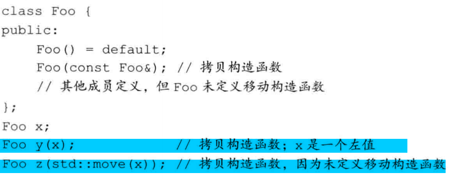
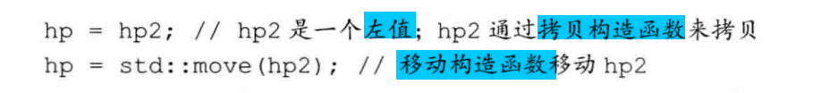
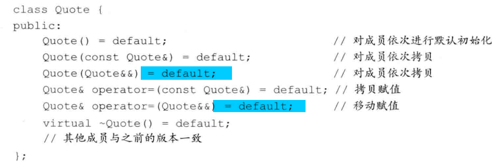
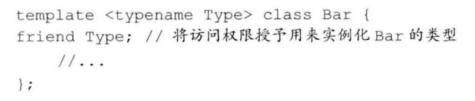
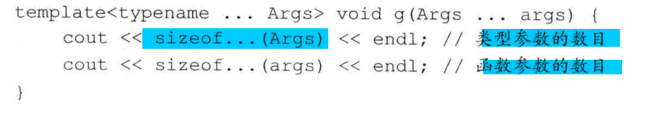
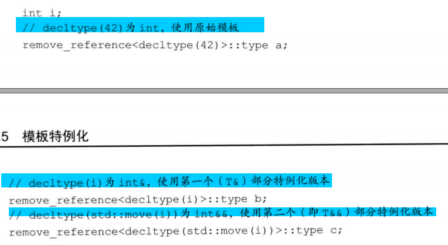
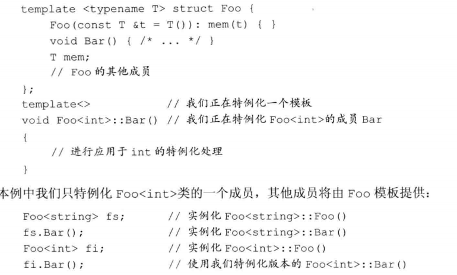

- [拷贝控制](#%E6%8B%B7%E8%B4%9D%E6%8E%A7%E5%88%B6)
  - [拷贝赋值与销毁](#%E6%8B%B7%E8%B4%9D%E8%B5%8B%E5%80%BC%E4%B8%8E%E9%94%80%E6%AF%81)
    - [拷贝构造函数](#%E6%8B%B7%E8%B4%9D%E6%9E%84%E9%80%A0%E5%87%BD%E6%95%B0)
    - [拷贝赋值运算符](#%E6%8B%B7%E8%B4%9D%E8%B5%8B%E5%80%BC%E8%BF%90%E7%AE%97%E7%AC%A6)
    - [析构函数](#%E6%9E%90%E6%9E%84%E5%87%BD%E6%95%B0)
    - [三/五法则](#%E4%B8%89%E4%BA%94%E6%B3%95%E5%88%99)
    - [使用=default](#%E4%BD%BF%E7%94%A8default)
    - [阻止拷贝](#%E9%98%BB%E6%AD%A2%E6%8B%B7%E8%B4%9D)
  - [拷贝控制和资源管理](#%E6%8B%B7%E8%B4%9D%E6%8E%A7%E5%88%B6%E5%92%8C%E8%B5%84%E6%BA%90%E7%AE%A1%E7%90%86)
    - [行为像值的类](#%E8%A1%8C%E4%B8%BA%E5%83%8F%E5%80%BC%E7%9A%84%E7%B1%BB)
    - [定义行为像指针的类](#%E5%AE%9A%E4%B9%89%E8%A1%8C%E4%B8%BA%E5%83%8F%E6%8C%87%E9%92%88%E7%9A%84%E7%B1%BB)
    - [demo:综合应用(很好例子多写几遍)](#demo%E7%BB%BC%E5%90%88%E5%BA%94%E7%94%A8%E5%BE%88%E5%A5%BD%E4%BE%8B%E5%AD%90%E5%A4%9A%E5%86%99%E5%87%A0%E9%81%8D)
  - [交换操作](#%E4%BA%A4%E6%8D%A2%E6%93%8D%E4%BD%9C)
    - [demo:在赋值运算符中使用swap](#demo%E5%9C%A8%E8%B5%8B%E5%80%BC%E8%BF%90%E7%AE%97%E7%AC%A6%E4%B8%AD%E4%BD%BF%E7%94%A8swap)
  - [拷贝控制实例](#%E6%8B%B7%E8%B4%9D%E6%8E%A7%E5%88%B6%E5%AE%9E%E4%BE%8B)
  - [动态内存管理类](#%E5%8A%A8%E6%80%81%E5%86%85%E5%AD%98%E7%AE%A1%E7%90%86%E7%B1%BB)
  - [对象移动](#%E5%AF%B9%E8%B1%A1%E7%A7%BB%E5%8A%A8)
    - [右值引用](#%E5%8F%B3%E5%80%BC%E5%BC%95%E7%94%A8)
    - [移动构造函数和移动赋值函数](#%E7%A7%BB%E5%8A%A8%E6%9E%84%E9%80%A0%E5%87%BD%E6%95%B0%E5%92%8C%E7%A7%BB%E5%8A%A8%E8%B5%8B%E5%80%BC%E5%87%BD%E6%95%B0)
  - [右值引用和成员函数](#%E5%8F%B3%E5%80%BC%E5%BC%95%E7%94%A8%E5%92%8C%E6%88%90%E5%91%98%E5%87%BD%E6%95%B0)
    - [13.6.3 右值引用和成员函数](#1363-%E5%8F%B3%E5%80%BC%E5%BC%95%E7%94%A8%E5%92%8C%E6%88%90%E5%91%98%E5%87%BD%E6%95%B0)
- [重载运算与类型转换](#%E9%87%8D%E8%BD%BD%E8%BF%90%E7%AE%97%E4%B8%8E%E7%B1%BB%E5%9E%8B%E8%BD%AC%E6%8D%A2)
  - [基本概念](#%E5%9F%BA%E6%9C%AC%E6%A6%82%E5%BF%B5)
  - [输入和输出运算符](#%E8%BE%93%E5%85%A5%E5%92%8C%E8%BE%93%E5%87%BA%E8%BF%90%E7%AE%97%E7%AC%A6)
    - [重载输出运算符](#%E9%87%8D%E8%BD%BD%E8%BE%93%E5%87%BA%E8%BF%90%E7%AE%97%E7%AC%A6)
    - [重载输入运算符](#%E9%87%8D%E8%BD%BD%E8%BE%93%E5%85%A5%E8%BF%90%E7%AE%97%E7%AC%A6)
  - [算数关系运算符](#%E7%AE%97%E6%95%B0%E5%85%B3%E7%B3%BB%E8%BF%90%E7%AE%97%E7%AC%A6)
    - [相等运算符](#%E7%9B%B8%E7%AD%89%E8%BF%90%E7%AE%97%E7%AC%A6)
    - [关系运算符](#%E5%85%B3%E7%B3%BB%E8%BF%90%E7%AE%97%E7%AC%A6)
    - [赋值运算符](#%E8%B5%8B%E5%80%BC%E8%BF%90%E7%AE%97%E7%AC%A6)
  - [下标运算符](#%E4%B8%8B%E6%A0%87%E8%BF%90%E7%AE%97%E7%AC%A6)
  - [递增和递减运算符](#%E9%80%92%E5%A2%9E%E5%92%8C%E9%80%92%E5%87%8F%E8%BF%90%E7%AE%97%E7%AC%A6)
  - [成员访问运算符](#%E6%88%90%E5%91%98%E8%AE%BF%E9%97%AE%E8%BF%90%E7%AE%97%E7%AC%A6)
  - [函数的调用运算符](#%E5%87%BD%E6%95%B0%E7%9A%84%E8%B0%83%E7%94%A8%E8%BF%90%E7%AE%97%E7%AC%A6)
    - [lambda是函数对象](#lambda%E6%98%AF%E5%87%BD%E6%95%B0%E5%AF%B9%E8%B1%A1)
    - [标准库定义的函数对象](#%E6%A0%87%E5%87%86%E5%BA%93%E5%AE%9A%E4%B9%89%E7%9A%84%E5%87%BD%E6%95%B0%E5%AF%B9%E8%B1%A1)
    - [可调用对象与function](#%E5%8F%AF%E8%B0%83%E7%94%A8%E5%AF%B9%E8%B1%A1%E4%B8%8Efunction)
  - [重载、类型转换与运算符](#%E9%87%8D%E8%BD%BD%E7%B1%BB%E5%9E%8B%E8%BD%AC%E6%8D%A2%E4%B8%8E%E8%BF%90%E7%AE%97%E7%AC%A6)
    - [类型转换运算符](#%E7%B1%BB%E5%9E%8B%E8%BD%AC%E6%8D%A2%E8%BF%90%E7%AE%97%E7%AC%A6)
  - [避免有二义性的类型转换](#%E9%81%BF%E5%85%8D%E6%9C%89%E4%BA%8C%E4%B9%89%E6%80%A7%E7%9A%84%E7%B1%BB%E5%9E%8B%E8%BD%AC%E6%8D%A2)
  - [函数匹配与重载运算符](#%E5%87%BD%E6%95%B0%E5%8C%B9%E9%85%8D%E4%B8%8E%E9%87%8D%E8%BD%BD%E8%BF%90%E7%AE%97%E7%AC%A6)
- [面向对象程序设计](#%E9%9D%A2%E5%90%91%E5%AF%B9%E8%B1%A1%E7%A8%8B%E5%BA%8F%E8%AE%BE%E8%AE%A1)
  - [定义基类和派生类](#%E5%AE%9A%E4%B9%89%E5%9F%BA%E7%B1%BB%E5%92%8C%E6%B4%BE%E7%94%9F%E7%B1%BB)
    - [定义基类](#%E5%AE%9A%E4%B9%89%E5%9F%BA%E7%B1%BB)
    - [定义派生类](#%E5%AE%9A%E4%B9%89%E6%B4%BE%E7%94%9F%E7%B1%BB)
      - [派生类对象及派生类向基类的类型转换](#%E6%B4%BE%E7%94%9F%E7%B1%BB%E5%AF%B9%E8%B1%A1%E5%8F%8A%E6%B4%BE%E7%94%9F%E7%B1%BB%E5%90%91%E5%9F%BA%E7%B1%BB%E7%9A%84%E7%B1%BB%E5%9E%8B%E8%BD%AC%E6%8D%A2)
      - [派生类构造函数](#%E6%B4%BE%E7%94%9F%E7%B1%BB%E6%9E%84%E9%80%A0%E5%87%BD%E6%95%B0)
      - [派生类使用基类成员](#%E6%B4%BE%E7%94%9F%E7%B1%BB%E4%BD%BF%E7%94%A8%E5%9F%BA%E7%B1%BB%E6%88%90%E5%91%98)
      - [继承与静态成员](#%E7%BB%A7%E6%89%BF%E4%B8%8E%E9%9D%99%E6%80%81%E6%88%90%E5%91%98)
      - [防止继承发生](#%E9%98%B2%E6%AD%A2%E7%BB%A7%E6%89%BF%E5%8F%91%E7%94%9F)
    - [类型转换与继承](#%E7%B1%BB%E5%9E%8B%E8%BD%AC%E6%8D%A2%E4%B8%8E%E7%BB%A7%E6%89%BF)
  - [虚函数](#%E8%99%9A%E5%87%BD%E6%95%B0)
  - [抽象基类](#%E6%8A%BD%E8%B1%A1%E5%9F%BA%E7%B1%BB)
  - [访问控制与继承](#%E8%AE%BF%E9%97%AE%E6%8E%A7%E5%88%B6%E4%B8%8E%E7%BB%A7%E6%89%BF)
    - [类的设计与受保护的成员](#%E7%B1%BB%E7%9A%84%E8%AE%BE%E8%AE%A1%E4%B8%8E%E5%8F%97%E4%BF%9D%E6%8A%A4%E7%9A%84%E6%88%90%E5%91%98)
  - [继承中的类作用域](#%E7%BB%A7%E6%89%BF%E4%B8%AD%E7%9A%84%E7%B1%BB%E4%BD%9C%E7%94%A8%E5%9F%9F)
  - [构造函数和拷贝控制](#%E6%9E%84%E9%80%A0%E5%87%BD%E6%95%B0%E5%92%8C%E6%8B%B7%E8%B4%9D%E6%8E%A7%E5%88%B6)
    - [虚析构函数](#%E8%99%9A%E6%9E%90%E6%9E%84%E5%87%BD%E6%95%B0)
    - [合成拷贝控制与继承](#%E5%90%88%E6%88%90%E6%8B%B7%E8%B4%9D%E6%8E%A7%E5%88%B6%E4%B8%8E%E7%BB%A7%E6%89%BF)
    - [派生类的拷贝控制函数](#%E6%B4%BE%E7%94%9F%E7%B1%BB%E7%9A%84%E6%8B%B7%E8%B4%9D%E6%8E%A7%E5%88%B6%E5%87%BD%E6%95%B0)
    - [继承的构造函数](#%E7%BB%A7%E6%89%BF%E7%9A%84%E6%9E%84%E9%80%A0%E5%87%BD%E6%95%B0)
  - [容器与继承](#%E5%AE%B9%E5%99%A8%E4%B8%8E%E7%BB%A7%E6%89%BF)
  - [demo](#demo)
- [模板与泛型编程](#%E6%A8%A1%E6%9D%BF%E4%B8%8E%E6%B3%9B%E5%9E%8B%E7%BC%96%E7%A8%8B)
  - [定义模板](#%E5%AE%9A%E4%B9%89%E6%A8%A1%E6%9D%BF)
    - [函数模板](#%E5%87%BD%E6%95%B0%E6%A8%A1%E6%9D%BF)
    - [类模板](#%E7%B1%BB%E6%A8%A1%E6%9D%BF)
    - [模板参数](#%E6%A8%A1%E6%9D%BF%E5%8F%82%E6%95%B0)
    - [成员模板](#%E6%88%90%E5%91%98%E6%A8%A1%E6%9D%BF)
    - [控制实例化](#%E6%8E%A7%E5%88%B6%E5%AE%9E%E4%BE%8B%E5%8C%96)
    - [效率与灵活性](#%E6%95%88%E7%8E%87%E4%B8%8E%E7%81%B5%E6%B4%BB%E6%80%A7)
  - [模板实参推断](#%E6%A8%A1%E6%9D%BF%E5%AE%9E%E5%8F%82%E6%8E%A8%E6%96%AD)
    - [类型转换与模板类型参数](#%E7%B1%BB%E5%9E%8B%E8%BD%AC%E6%8D%A2%E4%B8%8E%E6%A8%A1%E6%9D%BF%E7%B1%BB%E5%9E%8B%E5%8F%82%E6%95%B0)
    - [函数模板的显示实参](#%E5%87%BD%E6%95%B0%E6%A8%A1%E6%9D%BF%E7%9A%84%E6%98%BE%E7%A4%BA%E5%AE%9E%E5%8F%82)
    - [尾置返回类型与类型转换](#%E5%B0%BE%E7%BD%AE%E8%BF%94%E5%9B%9E%E7%B1%BB%E5%9E%8B%E4%B8%8E%E7%B1%BB%E5%9E%8B%E8%BD%AC%E6%8D%A2)
    - [模板实参推断——引用](#%E6%A8%A1%E6%9D%BF%E5%AE%9E%E5%8F%82%E6%8E%A8%E6%96%AD%E5%BC%95%E7%94%A8)
    - [理解std::move](#%E7%90%86%E8%A7%A3stdmove)
    - [转发](#%E8%BD%AC%E5%8F%91)
  - [重载与模板](#%E9%87%8D%E8%BD%BD%E4%B8%8E%E6%A8%A1%E6%9D%BF)
  - [可变参数模板](#%E5%8F%AF%E5%8F%98%E5%8F%82%E6%95%B0%E6%A8%A1%E6%9D%BF)
    - [编写可变参数的函数模板](#%E7%BC%96%E5%86%99%E5%8F%AF%E5%8F%98%E5%8F%82%E6%95%B0%E7%9A%84%E5%87%BD%E6%95%B0%E6%A8%A1%E6%9D%BF)
    - [包扩展](#%E5%8C%85%E6%89%A9%E5%B1%95)
    - [**重点：转发参数包**](#%E9%87%8D%E7%82%B9%E8%BD%AC%E5%8F%91%E5%8F%82%E6%95%B0%E5%8C%85)
  - [模板特例化](#%E6%A8%A1%E6%9D%BF%E7%89%B9%E4%BE%8B%E5%8C%96)
    - [函数模板的特例化](#%E5%87%BD%E6%95%B0%E6%A8%A1%E6%9D%BF%E7%9A%84%E7%89%B9%E4%BE%8B%E5%8C%96)
    - [类的特例化](#%E7%B1%BB%E7%9A%84%E7%89%B9%E4%BE%8B%E5%8C%96)
    - [类模板的部分特例化](#%E7%B1%BB%E6%A8%A1%E6%9D%BF%E7%9A%84%E9%83%A8%E5%88%86%E7%89%B9%E4%BE%8B%E5%8C%96)
    - [特例化 模板类的 成员函数](#%E7%89%B9%E4%BE%8B%E5%8C%96-%E6%A8%A1%E6%9D%BF%E7%B1%BB%E7%9A%84-%E6%88%90%E5%91%98%E5%87%BD%E6%95%B0)
# 拷贝控制
- 拷贝控制操作
  - 拷贝构造函数
  - 拷贝赋值运算符
  - 移动构造函数
  - 移动赋值运算符
  - 析构函数
- 如果没有定义`拷贝控制操作`，编译器会为我们合成。
- 初始化：拷贝构造函数，移动构造函数
- 赋值：拷贝赋值运算符，移动赋值运算符
- 销毁：析构函数

## 拷贝赋值与销毁
### 拷贝构造函数
- 参数
  - 参数必须是引用类型。（不然无限循环）
  - 一般参数都是const
- 合成拷贝构造函数
  - 没提供时，编译器合成的
  - 对类类型成员，调用其拷贝构造函数。
  - 对内置类型，直接拷贝。
  - 对数组，如是内置类型，直接逐元素拷贝；如是类类型，直接逐元素调用拷贝构造函数

> 拷贝初始化
- 直接初始化是匹配函数过程，拷贝初始化是处理同种类型初始化赋值过程。
- 直接初始化：使用`()`
- 拷贝初始化：使用`=`

<div align="center"></div>

- 拷贝初始化通常使用拷贝构造函数来完成，有时使用移动构造函数来完成。

> 拷贝初始化不仅在=定义变量时发生
- 传非引用实参
- 返回非引用对象
- 用花括号列表初始化一个数组中的元素或一个聚合类中的成员
- 初始化标准库容器或者调用其push和insert成员时，容器会对其元素进行拷贝初始化。

- eg：下面蓝色标注的就是使用了拷贝初始化的

<div align="center"></div>

> 编译器可以绕过拷贝构造函数
- 有时候编译器会跳过拷贝初始化，直接创建对象。
- 原本的逻辑是先让9999转string对象，然后再将其拷贝给null_book
<div align="center"></div>

### 拷贝赋值运算符
- 还是一样有一个`合成拷贝赋值运算符`
- 注：这个和`拷贝构造函数`不同的是，其发生不是在初始化，而是在赋值。

> 一个例子，体现拷贝和赋值
```cpp
/*output:

    In HasPtr(const HasPtr& hp)
    ----------
    In operator=

*/
class HasPtr {
public:
    HasPtr(const std::string& s = std::string()) : ps(new std::string(s)), i(0)
    {
    }
    HasPtr(const HasPtr& hp):ps(new string(*hp.ps)),i(hp.i){
        cout << "In HasPtr(const HasPtr& hp)" << endl;
    };
    HasPtr& operator= (const HasPtr& hp){
        cout << "In operator=" << endl;
        auto tnew = new string(*hp.ps);
        delete ps;
        ps = tnew;
        i = hp.i;
        return *this;
    }
private:
    std::string* ps;
    int i;
};
int main(){
    HasPtr ahp,bhp;
    // 拷贝
    HasPtr hp1 = ahp;
    cout << "----------" << endl;
    // 赋值
    hp1 = bhp;
    return 0;
}
```

### 析构函数
- 对于给定的类，只有唯一一个析构函数。因为其不接受参数，不能被重载。
- 构造函数中，成员初始化是按其在类中出现的顺序进行，并且发生在函数体执行之前。而析构是`逆序销毁`，其先执行函数体的内容，再销毁成员。
- 销毁类类型成员需要执行其自己的析构函数。内置类型没有析构函数，因此销毁内置类型成员什么也不需要做。
- 析构函数不直接销毁成员，成员在析构函数体之后隐含的析构阶段中被销毁。函数体作为销毁步骤之外的另一部分而进行。
- 合成析构函数
  - 在没显示写出析构函数的时候，编译器会合成
> 什么时候使用析构函数
<div align="center"></div>

- 当一个对象的引用或指针离开作用域，析构函数不会执行


### 三/五法则
- c++并不要求我们定义所有的拷贝控制操作，但是操作通常应该被看做一个整体。只需要定义其中一个而其他不用定义的情况很少。所以有了三/五法则
- 需要析构函数的几乎都需要拷贝构造函数和和拷贝赋值运算符
- 需要拷贝构造函数的几乎都需要拷贝赋值函数，反之亦然。
  - 一种不需要析构的例子：为每个对象分配一个不同的uid。

### 使用=default
- 我们可以使用`=default`来显示要求编译器使用合成的版本.

<div align="center"></div>

### 阻止拷贝
- 有时候拷贝和赋值是需要阻止的，比如iostream，我们不能让多个对象写入和读取。这个时候可以通过`删除的函数`来阻止。
- `=delete`.
  - 可以指定任何函数
  - 析构函数不能是删除的成员
<div align="center"></div>

- 对某些类来说，编译器将合成的成员定义为删除的函数，一些规则如下：
  - 总结起来：如果一个类有数据成员不能默认构造、拷贝、赋值或销毁，则对应的成员函数将被定义为删除的。
<div align="center"></div>

| 删除或不可访问（private）  | 合成默认构造函数  | 合成拷贝构造函数 | 合成拷贝赋值函数 | 合成析构函数  |
|---| :---:  | :---: | :---:  | :---: |
| 析构函数  | N | N |  Y | N |
| 拷贝构造函数 |  Y | N |  Y | Y |
| 拷贝赋值函数 | Y | Y |  N | Y |
| 默认构造函数 | N | Y |  Y | Y |
| 类有一个引用成员 | N | Y |  N | Y |
| 类有一个const成员 |  Y | Y |  N | Y |

- 一个删除或不可访问的析构函数会导致合成的默认和拷贝构造函数被定义为删除的。因为没有这条规则，我们会创建出无法销毁的对象。

> private拷贝控制

- 在新版本之前，类是通过将其拷贝构造函数和拷贝赋值运算符声明为private来阻止拷贝。
- 设置为private仍然可以被友元和成员函数拷贝，因此可以只声明不定义。这样是合法的，如果外部使用是一个编译错误，成员和友元访问是一个链接错误。


## 拷贝控制和资源管理
- 行为像值的类，副本和原对象是完全独立的（所以这个时候就需要对动态分配的进行再次分配后拷贝）eg：string
- 行为像指针的类（共享动态分配的内存，要维护一个计量数。），eg：shared_ptr
- 在定义类的时候,如果类里面有动态资源，我们要考虑以上这两种类类型


### 行为像值的类

> 赋值运算符
- 赋值运算符通常`组合了析构函数和构造函数的操作`。
  - 析构自己的动态成员
  - 构造新的动态成员
- 即使将**一个对象赋值他自身，也保证安全**
  - 写的时候要考虑这点
- 如果可能，编写的赋值运算符应该是异常安全的——当发生异常时，能将左侧运算对象置于一个有意义的状态。

```cpp
class HasPtr {
public:
    HasPtr(const std::string& s = std::string()) : ps(new std::string(s)), i(0)
    {
    }
    HasPtr(const HasPtr& hp):ps(new string(*hp.ps)),i(hp.i){
        cout << "In HasPtr(const HasPtr& hp)" << endl;
    };
    ~HasPtr(){delete ps;}
    HasPtr& operator= (const HasPtr& hp){
        cout << "In operator=" << endl;
        // 必须释放之前，先构造用一个临时的指针指向
        auto newp = new string(*hp.ps)
        delete ps;
        ps = newp;
        i = hp.i;
        return *this;
    }
private:
    std::string* ps;
    int i;
};
```

### 定义行为像指针的类
- 不使用shared_ptr情况下，使用自己的引用计数来管理

<div align="center"></div>

> 一个例子

```cpp
class HasPtr {
public:
    HasPtr(const string& s = string()) : ps(new std::string(s)), i(0),use(0)
    {
    }
    HasPtr(const HasPtr& hp):ps(hp.ps),i(hp.i),use(hp.use){
        cout << "In HasPtr(const HasPtr& hp)" << endl;
        // 引用数++
        ++*hp.use;
    };
    ~HasPtr(){
        if(--*use == 0){
            delete ps;
            delete use;
        }

    }
    HasPtr& operator= (const HasPtr& hp){
        cout << "In operator=" << endl;
        // 1. 先递增引用计数
        ++*hp.use;
        // 2. 先看看要不要释放
        if(--*use == 0){
            delete ps;
            delete use;
        }
        // 3. 拷贝赋值
        ps = hp.ps;
        i = hp.i;
        use = hp.use;
        return *this;
    }
private:
    string* ps;
    int i;
    size_t *use;
};
```

### demo:综合应用(很好例子多写几遍)
```cpp
// 像引用的类
class TreeNode{
public:
    TreeNode():left(nullptr),right(nullptr){
        *count = 1;
    }
    TreeNode(const TreeNode& tn):value(tn.value), left(tn.left), right(tn.right){
        ++*count;
    }
    TreeNode& operator=(const TreeNode & tn){
        ++*tn.count;
        if(--*count == 0){
            if(left){
                delete left;
                left = nullptr;
            }
            if(right) {
                delete right;
                right = nullptr;
            }
            delete count;
            count = nullptr;
        }
        count = tn.count;
        left = tn.left;
        right = tn.right;
        value = tn.value;
        return *this;
    }
    ~TreeNode(){
        if(--*count == 0){
            if(left){
                delete left;
                left = nullptr;
            }
            if(right) {
                delete right;
                right = nullptr;
            }
            delete count;
            count = nullptr;
        }
    }
private:
    string value;
    int *count;
    TreeNode* left,*right;
};

class BinStrTree{
public:
    BinStrTree():root(nullptr){}
    BinStrTree(const BinStrTree& bst):root(new TreeNode(*bst.root)){
    }
    BinStrTree& operator=(const BinStrTree &bst){
        auto newt = new TreeNode(*bst.root);
        delete root;
        root = newt;
        return *this;
    }
    ～BinStrTree(){delete root;}
private:
    TreeNode *root;
};
```

## 交换操作
- 对于那些重排元素一起使用的类，定义swap非常重要。因为这类算法在需要交换两个元素的时候，会使用swap函数
- `对于分配了资源的类`，定义swap可能是一种很重要的优化手段。
  - 对于像值一样的类，少了两次内存的构造(3-1)，使用自定义的swap，在进行=时，需要一次拷贝构造函数，也就是一次动态分配内存。
  - 对于像指针一样的类，其实在处理=上优化不是很大。
> 标准库中的swap
- 实现的其实是引入一个中间对象。然后彼此之间进行拷贝，如以下：
```cpp
HasPtr temp = v1;
v1 = v2;
v2 = temp;
```
- 对于这种情况，会调用一次`拷贝构造函数`和两次`拷贝赋值运算符`
  - 由此课可会对string进行构造，然后对原来绑定的进行delete。这样是否有点浪费性能？我们可以交换他们中的`string *`指针就万事大吉了的

> 自定义swap
<div align="center"></div>

> 为什么需要using std::swap
- 在上面的例子中，因为swap的是内置成员，没有自己版本的swap。所以可以不用加`using std::swap`。
- 现在假设有一个场景。一个名为Foo的类，里面有成员变量HasPtr，HasPtr有自己的swap。
  - 如果使用如下代码,调用的其实是标准库版本的swap
  ```cpp
  void swap(Foo &lhs, Foo &rhs){
      std::swap(lhs.h,rhs.h);
  }
  ```
  - 正确如下
    - 每个swap调用应该都是未加限定的。即应该是swap而不是std::swap。如果存在类型特定的swap版本，其匹配程度会优于std中定义的版本。
  ```cpp
  void swap(Foo &lhs, Foo &rhs){
      using std::swap;
      swap(lhs.h,rhs.h);
  }
  ```


### demo:在赋值运算符中使用swap
- `HasPtr& operator= (HasPtr hp)`是重点
- 这个技术会自动处理自赋值情况且天然就是异常安全的
```cpp
/*
In HasPtr(const string& s = string())
In HasPtr(const string& s = string())
In HasPtr(const HasPtr& hp)
In operator=
*/
class HasPtr;
void swap(HasPtr &hp1,HasPtr &hp2);
class HasPtr {
public:
    friend void swap(HasPtr &hp1,HasPtr &hp2);
    HasPtr(const string& s = string()) : ps(new std::string(s)), i(0),use(new size_t(1))
    {
        cout << "In HasPtr(const string& s = string())" << endl;
    }
    HasPtr(const HasPtr& hp):ps(hp.ps),i(hp.i),use(hp.use){
        cout << "In HasPtr(const HasPtr& hp)" << endl;
        // 引用数++
        ++*hp.use;
    };
    ~HasPtr(){
        if(--*use == 0){
            delete ps;
            delete use;
        }

    }
    HasPtr& operator= (HasPtr hp){ //hp在这里的初始化调用拷贝构造函数
        cout << "In operator=" << endl;
        swap(*this,hp);
        return *this;
    }
private:
    string* ps;
    int i;
    size_t *use;
};

void swap(HasPtr &hp1,HasPtr &hp2){
    using std::swap;
    swap(hp1.ps,hp2.ps);
    swap(hp1.use,hp2.use);
}

int main(){
    HasPtr hp1("l1nkkk");
    HasPtr hp2;
    // 调用HasPtr& operator= (HasPtr hp)
    hp2 = hp1;
    return 0;
};
```

## 拷贝控制实例
- 两个类Message和Folder

<div align="center"></div>

> 13-38

<div align="center"></div>

- [跳转](./Exercise3.md#13-34)

- 使用swap来设计的赋值运算符只在有动态分配内存的时候有意义，其他其实是没有意义的。
- 正常设计下，赋值运算符需要清除自己在Folder的保存，然后重新赋值之后再添加到赢保存到的Folder中
- 如果使用swap，那么将需要调用一次拷贝构造函数，然后再调用swap，这里面过多不必要的操作，比如又添加folder又从folder删除

## 动态内存管理类
- 介绍strVec：这是一个自己实现的vector的string版本。
- 引入：strVec里面动态维护一个内存，存储string。如果对strVec进行拷贝或者重新分配空间的话，每一个string都要被拷贝，那这样会带来许多消耗。如果我们在只是**移动**了原本string底层的char*空间而不是**拷贝**，那么效率就会提高
  - 进而引出了移动构造函数和移动赋值函数
- 通过新标准引入了两种机制，可以避免string的拷贝。
  - 第一个就是移动构造函数和移动赋值函数
  - 第二个机制就是move的标准库函数。
- 关于move：
  - 定义在utility头文件中
  - 必须调用move来表示希望使用string的移动构造函数。如果漏掉了move调用，将会使用string的拷贝构造函数

- 对于以下代码，旧的strVec内存中，string包含什么值我们不知道，但是我们保证对它执行析构函数是安全的。
<div align="center"></div>

## 对象移动
### 右值引用
- 通过`&&`而不是通过`&`
- 一个重要性质：只能绑定到一个即将销毁的对象
- 左值引用和右值引用有着相反的绑定特性。
<div align="center"></div>

- 左值持久，右值短暂。左值有持久的状态，到作用域结束才释放，而右值要么是一个字面常量，要么是在表达式求值过程中创建的临时对象。
  - 由此可知，右值引用有如下特性，可以得知使用右值引用的代码可以自由接管所引用对象的资源
    - 所引用的对象将要被销毁
    - 该对象没有其他用户
  - 这意味着右值引用的代码可以自由的接管所引用的对象的资源。

- 变量表达式也有左值/右值属性，变量表达式是左值。**所以不能将一个右值引用绑定到另外一个右值引用**，因为变量表达式是左值属性。
```cpp
// 1.legal
int &&r1 = 22;
// 2.illegal
// int &&r2 = r1;
// 3.legal
int &&r2 = std::move(r1);
```
> 标准库move
- 针对：变量表达式是左值属性
- 不能直接右值引用绑定一个左值，但是可以显式将左值转换成对应的右值引用类型。
- 告诉编译器有一个左值，想要将其当右值处理。
- 调用move意味着我们要做一些承诺
  - 除了对其赋值和销毁，其他操作都不能使用。
- 使用move应该用std::move，这样避免潜在的名字冲突。

### 移动构造函数和移动赋值函数
- 除了完成资源移动，移动构造函数还必须确保
  - `移动完，销毁源对象是无害的`
  - `一旦移动成功资源的所有权不再属于原来的对象`
  - 对象仍然是有效的，可以安全的对其赋予新值
- noexcept告诉标准库，构造函数不抛出任何异常。
  - C++11
  - 必须在声明和定义中都指定`noexcept`。
  - `如果不会抛出异常必须noexcept`
  - 下面这个例子中不存在任何新内存分配，不会存在任何运行异常。
  - 移动操作通常不会抛出任何异常。当我们可以确保其不会发生异常，应该将其标注
```cpp

// 如果可以保证不会抛出运行时错误，那么可以声明noexcept
StrVec::StrVec(StrVec &&s) noexcept: firstP(s.firstP),firstFree(s.firstFree),endP(s.endP){
    cout << "---In StrVec(StrVec &&s)" << endl;
    // 将其状态置于和默认初始化后的状态是一样的，此时对其free是安全的。
    s.firstP = s.firstFree = s.endP = nullptr;
    cout << endl;
}

```
- 形参为非const的引用
> 为什么要告诉标准库这个函数不会抛出错误
- 因为标准库默认会为处理抛出错误的可能性做一些额外的工作，所以告诉标注库不会抛出错误可以减少这些额外的工作。
- 一个例子
  - 首先现在有两个相互关联的事实：1.移动操作抛出异常是被允许的 2.标准库容器对异常发生时其自身行为提供保障，这是对使用者的承诺。
  - 比如vector，如果移动了一个对象，重新分配更大的空间时使用了移动构造函数，在移动到了一半的时候，抛出了一个异常，就会产生问题。违背了其给使用者的承诺，所以如果不显示指定为noexcept的话，其都是使用拷贝构造函数比较保险。
  - 综上，`除非vector元素类型的移动构造函数不会抛出异常，否则在重新分配内存的过程中，他会使用 拷贝构造函数 而不是 移动构造函数`

---
> 移动赋值运算符
- 如果不会抛出异常，一样必须`noexcept`

```cpp
StrVec &StrVec::operator=(StrVec && s) noexcept {
    if(this != &s){
        free(); // 释放原有资源
        // 接管资源
        firstP = s.firstP;
        firstFree = s.firstFree;
        endP = s.endP;
        // 析构安全化
        s.firstP = s.firstFree = s.endP = nullptr;
    }
    return this;
}

```
> 是右值，为什么需要自检查呢
- 因为可能是move调用的结果


--- 

> 移后源对象 必须处于的状态

- 当移动操作过后，必须让源对象进入可析构的状态
- 而且要保证对象仍然是有效的（有效指的是可以安全为其赋予新值或者可以安全的使用而不用对当前值做任何假设），一般可将其状态置于 `默认初始化状态`

> 合成的移动操作
- 合成移动操作的条件与合成拷贝操作的条件大不相同。
  - 如果定义了拷贝构造函数 或 拷贝赋值运算符 或 析构函数，编译器就不会为它合成移动构造函数 和 移动运算符了。
- 规则（合成移动构造函数 和 移动赋值运算符）
  - `没有任何自定义的拷贝控制成员`
  - `且 每个 非static数据成员都 可移动`

- 可移动
  - 内置类型
  - 定义了对应移动操作的类类型
<div align="center"></div>

---


- 与拷贝操作不同，移动操作永远不会隐式定义为删除的函数（这啥意思，没懂）
- 如果要求编译器生成=default的移动操作，且编译器不能移动所有成员，则移动操作将是删除的函数

> 定义为删除的函数的原则
- 和合成拷贝操作类型
<div align="center"></div>

- `只要定义了一个移动操作后，拷贝操作就默认为删除的，所以需要自己定义自己的拷贝操作`


> 移动右值，拷贝左值：
- 如果一个类，定了了移动操作，那么其根据函数匹配规则来确定选择移动版本还是拷贝版本。
<div align="center"></div>

> 如果没有移动构造函数，右值也被拷贝
<div align="center"></div>

- 可以将Foo&&转换为一个const Foo&
- `用拷贝操作代替移动操作几乎都是安全的`


---
> 拷贝并交换赋值运算符和移动操作
- 赋值运算符+swap == 拷贝赋值运算符 | 移动赋值运算符  

| 函数 | swap? | 描述 |
| :---: | :---:  | --- |
| a=b | N | c左值引用b；构造b中的动态对象；有必要则销毁a中的原有的动态对象；对a中的动态对象赋值 |
| a=b | Y |c用b进行拷贝构造：构造b中的动态对象；swap：交换a和c中的动态对象指针和其他变量；c析构：删除a中原有的动态对象 |
| a=std::move(b) | N | c右值引用b：调用了移动赋值函数；交换a和b中的动态对象指针和其他变量；令b置于符合规范的状态（一般是默认初始化状态）  |
| a=std::move(b) | Y |  c用b进行移动构造：把b的动态对象交个c管理，令b置于符合规范的状态；swap：交换a和c中的动态对象指针和其他变量； |

```cpp
    HasPtr(HasPtr&& s) noexcept :ps(s.ps),use(s.use){
        cout << "In HasPtr(HasPtr&& s):移动构造" << endl;
        s.ps =  nullptr;
        // 没有这一步析构会出错，而且为了让其和默认初始化后的样子一样
        s.use = new size_t (0);
        i = 0;
    }
```
- 这里的决定性因素是在`(HasPtr rhs)`形参的时候使用的是什么构造函数。
<div align="center"></div>


> 跟新三/五法则
- 所有的拷贝控制成员应该看作一个整体
- 一般来说，如果定义了任何一个拷贝操作，就应该定义所有五个操作。
- 拷贝一个资源会带来开销，这个时候可以看看移动操作是否可以避免。

> Message类的移动操作
- 向set插入可能引发`bad_alloc`异常，所以这里不能加`noexcept`

- 以下添加三个函数
  - `move_Folders`：用来将Message从他所在的所有Folder中删去

```cpp
void Message::move_Folders(Message *m) {
    // 关键，调用set的移动赋值运算符
    folders = std::move(m->folders);
    for(auto f: folders){
        f->remMsg(*m);
        f->addMsg(*this);
    }
    m->folders.clear(); //确保销毁m是无害的
}

Message::Message(Message &&m):contents(std::move(m.contents)) { // 调用string的拷贝构造函数
    move_Folders(&m);
}

Message &Message::operator=(Message &&m) {
    // 判断是否自赋值
    if(this != &m){
        this->remove_from_Folders();
        this->contents = std::move(m.contents); // 移动赋值运算符
        this->move_Folders(&m);
    }
    return *this;
}

```

--- 
> 移动迭代器
- 在前面StrVec的reallocate的使用是一个个construct过去的。但其实，结合`移动迭代器 + uninitialized_copy`来构建将比循环更简单。
- `一般`一个 迭代器的解引用运算符 返回的是一个`指向元素的左值`
- 移动迭代器
  - C++11
  - **解引用生成右值引用**
  - 使用`make_move_iterator`来获取
  - 标准库不保证哪些算法适用移动迭代器，哪些不适用
- uninitialized_copy对输入序列中的每个元素调用construct来将元素“拷贝”到目的位置
```cpp
void StrVec::reallocate() {
    auto newcap = size()? size()*2 : 1 ;
    // 分配内存
    auto newdata = alloc.allocate(newcap);
    auto dest = newdata;

    // 1.c从旧的考到新的
    // for(auto it = firstP; it == firstFree; ++it){
    //     alloc.construct(dest++,std::move(*it));
    // }

    // 2.使用移动迭代器 + uninitialized_copy
    dest = uninitialized_copy(make_move_iterator(begin()),make_move_iterator(end()),newdata);
    // 释放旧空间
    free();
    // 更新指针
    firstP = newdata;
    firstFree = dest;
    // 不再firstFree == endP
    endP = newdata+newcap;
}
```

## 右值引用和成员函数
- 也可以给其他成员函数同时提供拷贝和移动版本。
- 当我们实在想要窃取实参的数据的时候，才搞右值引用。
- 像标准库中的push_back其实都是有拷贝和移动两个版本的。
- 下面为前面的 StrVec 定义一个新的push_back,基于右值的

<div align="center"></div>

- 下面是使用时的选择
```cpp
StrVec vec;
string s = "l1nkkk";
vec.push_back(s); // 调用push_back(const string&);
vec.push_back("qqq"); // 调用push_back(string&&);
```

### 13.6.3 右值引用和成员函数
<div align="center"></div>

> 引用限定符
- 必须同时出现在函数的声明和定义中
- 引用限定符可以是`&`或`&&`，分别可以指向一个`左值或右值`。这个是来限定对象的，限定对象是一个左值还是右值才可以调用。
<div align="center"></div>
<div align="center"></div>

- 和const同时使用的时候，必须在const的后面，如`Foo fi() const &;`
- 可以根据调用对象的类型（左值，右值）来确定一个成员函数的重载版本
- 下面是一个例子
<div align="center"></div>

- 对右值执行，可以安全直接对data成员排序，因为是一个右值，没有其他用户，可以随意改变对象。
<div align="center"></div>

- 如果一个成员函数有引用限定符，则具有相同参数列表的所有版本都必须有引用限定符。

<div align="center"></div>


# 重载运算与类型转换
## 基本概念
- 由关键字operator和其要重载的运算符共同组成
- 除了重载函数调用运算符`operator()`外，其他的重载不能含有默认实参

> 运算符是否可被重载的情况
<div align="center"></div>

> 调用
- 非成员运算符
```cpp
data1 + data2;
operator+(data1,data2); // 与上面等价
```
- 成员运算符
```cpp
data1 + data2;
data1.operator+(data2); // 与上面等价
```

> 默写运算符不建议重载
- 逗号、取地址、逻辑与逻辑或运算符不应该被重载，原因如下
<div align="center"></div>

> 使用与内置类型一致的含义
- 我们在设计类的时候应该先确定需要哪些操作，再想想这些操作哪些可以设成普通函数，哪些需要重载。
- 可以重载的规则：含义和内置类型很像，使用后容易理解。
<div align="center"></div>

--- 
- 如果有算数运算符或者位运算符，最好也定义复合赋值运算符。
> 定义重载运算符成员和非成员的选择
- 以下是一些准则
<div align="center"></div>

- 如果想要提供含有类对象的混合类型表达式，则运算符必须定义成非成员函数。
<div align="center"></div>

> 什么时候重载运算符和内置运算符有区别，什么又是一样的
- 相同：运算符的优先级
- 不同：
  - 一些内置运算符有短路原则。但是重载的不行
  - 一些内置运算符可保证对操作数求值的顺序。重载的不能保证
  - 重载的运算符必须是类的成员，或者至少具有一个类类型的参数


## 输入和输出运算符
### 重载输出运算符
- 令输出运算尽量减少格式化操作，这样用户在使用的时候可以更自由。比如不要在里面打印换行这些，最多用空格将这些不同的成员隔开。

<div align="center"></div>

### 重载输入运算符
- 输入运算符必须处理输入可能失败的情况，而输出运算符不用
  - 当读取的时候发生错误，应该负责从错误中恢复
- 输入运算符执行的时候可能发生下面的错误
  - 读取的时候可能读取到错误的类型，比如要int来double
  - 当读取的时候遇到了文件末尾或者输入流的其他错误
  - 这些错误发生时不会抛出异常，还能继续跑
<div align="center"></div>

> 有些时候可以我们自己表示输入的错误位failbit
<div align="center"></div>

## 算数关系运算符
- 如果类定义了算术运算符，则一般也会定义一个对应的复合赋值运算符，然后最有效的是使用复合赋值来定义算术运算符
<div align="center"></div>

> 为什么使用+=来实现+更好呢
- 因为+=是一个成员函数
- 如果不用+=，上面将出现`sum.units_sold = lhs.units_sold+rhs.units_sold`;如果使用了复合赋值，将省略lhs.units_sold+rhs.units_sold产生的临时对象。
- https://stackoverflow.com/questions/21071167/why-is-it-more-efficient-to-define-operator-to-call-operator-rather-than-the


### 相等运算符
- 一般定义`==`就得定义`!=`,其中一个负责比较，而另外一个只需要调用它就可以了。

### 关系运算符
- 关联容器和一些算法要用到小于运算符`<`，所以定义`operator <`会比较有用
- 如果同时还包含`==`，当且仅当`<`的定义和`==`在比较方式是一样的时候才定义`<`运算符
### 赋值运算符
- 除了拷贝赋值和移动赋值运算符，还可以定义其他运算符，`使得将别的类型作为右侧运算对象`。
- 重载的赋值运算符都需要先释放当前的内存空间，在创建一片新空间。只不过，不是拷贝赋值和移动赋值的`不用进行 自身赋值 这种情况的检查`

## 下标运算符
- 下标运算符必须是成员函数
- 下标运算符通常返回元素的引用作为返回值，最好同事定义下标运算符的常量版本和非常量版本。
<div align="center"></div>

## 递增和递减运算符
- 应该同时定义前置版本和后置版本

> 前置版本
<div align="center"></div>


> 区分前置和后置
- 通过int类型的形参，来确定这是一个后置，这个形参唯一的作用就是区分前置和后置

> 后置版本
- 一般前置返回的是对象的引用，而后置返回的是对象的原值
- 在后置中一般调用的是自己的前置

<div align="center"></div>

> 显式调用
<div align="center"></div>

## 成员访问运算符
- 对`*`和`->`的重载
  - 定义为const，因为内部不会改变对象状态。而且->必须是成员函数，*推荐是成员函数
<div align="center"></div>

> 对->的返回值的限定
- 其他运算符的重载都是不会有限定的。
- 但是对与`->`:必须返回类的指针或者自定义了箭头运算符的某个类的对象。
- 调用`->`的只能是指向类对象的指针 或者 是一个重载了 `->`的类对象。根据point类型的不同，point->mem分别等于:
```cpp
(*poinmt).mem;          //point 是一个内置的指针类型 
point.operator()->men;  //point 是一个类的对象，其实`->`后还隐含的有一个`.`的调用
```
<div align="center"></div>

## 函数的调用运算符
- 我们可以重载调用运算符，这样可以像使用函数一样使用该类的对象
- 一个类可以定义多个不同版本的调用运算符，参数数量和类型上应该有所区别

- 函数对象：定义了调用运算符的类
- 函数对象常常作为泛型算法的实参

```cpp
/*
    Hello L1nkkkk 
    Hello-L1nkkkk-
*/
class PrintString{
public:
    PrintString(ostream &aout = cout, const string &anap = " "):out(aout),nap(anap){};
    void operator ()(const string &s) const{out << s << nap;}
private:
    ostream &out;
    string nap;
};


int main(){
    PrintString ps;
    vector<string> vs{"Hello","L1nkkkk"};
    for_each(vs.begin(),vs.end(),ps);
    cout << endl;
    for_each(vs.begin(),vs.end(),PrintString(cout,"-"));
    return 0;
}
```

### lambda是函数对象
- 当我们编写一个lambda后，编译器将其表达为一个未命名类的未命名对象。
- 在lambda表达式产生的类中含有一个重载的函数调用运算符。
<div align="center"></div>

- 默认情况下，lambda产生的类中的函数调用运算符是一个const成员函数。如果lambda声明为可变的，则调用运算符就不是const的了。

> 表示 lambda及相应捕获行为的类
- 如果是引用捕获，编译器确保lambda调用的时候的引用所引的对象确实存在，所以可以直接使用该引用，不需要将其存储为数据成员。
- 如果是值捕获的变量，产生的类为每个值捕获的变量建立对应的数据的数据成员，同时创建构造函数，使用捕获的变量来初始化数据成员
<div align="center"></div>

- lambada表达式产生的类不含默认构造函数、赋值运算符及默认析构函数。是否含有默认的拷贝/移动构造函数通常要视捕获第数据成员类型而定。

### 标准库定义的函数对象
- 标准库定义了`一组表示算数运算符、关系运算符和逻辑运算符的类`
- 头文件：functional
<div align="center"></div>

> eg:使用实例

<div align="center"></div>

> 使用地方：常常用来替换算法中的默认运算符

- 比如升序改降序
```cpp
// 代表 > ，注意这里greater<string>()是生成一个对象。
sort(v.begin(),v.end(),greater<string>())
```

- `标准库规定其函数对象对于指针同样适用`
  - 我们用`<`去比较两个无关指针将产生未定义的行为。
- 如果我们希望用指针的内存地址来sort指针的vector，那么使用标准库函数对象来实现：
<div align="center"></div>

- 关联容器使用less<>来对元素进行排序，所以将指针作为set和map中的关键值时，不需要声明less


### 可调用对象与function
- 调用形式：返回的类型以及传递给调用的实参类型。eg:int(int,int),其表示一个函数类型，接收两个int，返回一个int

> 不同类型具有相同的调用形式。
- 比如普通函数，lambda，函数对象类...
```cpp
int add(int i,int j){return i+j;}

auto mod = [](int i,int j){return i%j;};

struct divide{
    int operator()(int i, int j){
        if(j == 0)return 0;
        return i/j;
    }
};

```

> 引入：funciton
- 如果我们现在想要定义个一个函数表，用来存储可调用对象，当我们要用的时候从表中查找调用。我们可以这样子定义：`map<string,int(*)(int,int)> ops;`,但是这个只能insert `add函数`。
- `我们可以用function类型解决这个问题`
- function
  - C++11
  - functional头文件
  - function是一个模板，提供调用形式来实例化它。
<div align="center"></div>

```cpp
/*output
    15
    5
    50
    2
    0
 */
int main(){
    map<string, function<int(int,int)>> ops = {
            {"+",add},
            {"-",std::minus<int>()},
            {"/",divide()},
            {"*",[](int i, int j){ return i * j;}},
            {"%",mod}
    };
    cout << ops["+"](10,5) << endl;
    cout << ops["-"](10,5) << endl;
    cout << ops["*"](10,5) << endl;
    cout << ops["/"](10,5) << endl;
    cout << ops["%"](10,5) << endl;

    return 0;
}
```

> 重载的函数与function
- 不能直接将重载函数的名字存入function类型的对象中
  - 解决方法：1.传入存储函数的指针 2.lambda
<div align="center"></div>

## 重载、类型转换与运算符
- 注：二义性方面太复杂了，用的时候再看。建议看看书，这部分太散了，不好总结
- 类类型转换
  - 转换构造函数
  - 类型转换运算符
- 和使用重载运算符一样，这种需要明智谨慎的使用。避免过度使用。除非是那种很明确的一对一的关系，否则不要用
- 在类类型转换的之前或者之后可能出现某种内置类型的隐式转换，如下面例子所示。
- 除了显式的向bool类型的转换之外,我们应该尽量避免定义类型转换函数。
> 一个例子
<div align="center"></div>

```cpp
// 在这一步中，将4.3转int型，然后再调用转换构造函数
SmallInt a = 4.3;
// 在这一步中，会将a调用类型转换运算符，然后再转double
double b = a;
```

### 类型转换运算符
- 一种特殊的成员函数
- 不允许转换成数组和函数，但是可以是指针或者引用类型。
- 不能声明返回和形参，通常是const。

> 类型转换运算符可能产生意外结果
- 在早期的c++中出现的一个问题。因为istream可以转换成bool，bool是一种算术类型。所以以下这种情况会出现`<<`呈现的是移位。
```cpp
int i = 3;
cin << i;
```
- 为了解决这个问题,c++11引入了`显示的类型转换运算符`，加了个`explicit`。但是显示的在**某些情况下会被隐式执行**，所以当作为条件的时候还是可以被隐式转换。
  - 向bool的类型转换通常用在条件部分，所以一帮都定义为explicit

<div align="center"></div>

## 避免有二义性的类型转换
<div align="center"></div>

> 二义性：转换构造函数和类型转换运算符两难
<div align="center"></div>

- 解决：显示指定调用

> 二义性：存在到内置算数类型的多个类型转换
- 下面这个例子中，可以转到int也可以转到double
<div align="center"></div>

<div align="center"></div>

- 经验规则
<div align="center"></div>

> 二义性：重载函数与转换构造函数带来的两难
- `如果在调用重载函数时，需要使用构造函数或者强制类型转换来改变实参的类型，这通常意味着程序设计的不足`
<div align="center"></div>

- 解决：显示构造

> 二义性：重载函数与用户定义的类型转换
- 如果现在重载函数是通过两个类的类型转换得到匹配（即不同的类型转换函数），那么不管标准类型转换的级别，都会产生二义性。
<div align="center"></div>

## 函数匹配与重载运算符
- 使用重载的运算符的时候，他的 候选函数集 的规模比我们使用调用运算符`()`调用函数的时候更大。
  - 比如：不能知道是自定义的非成员版本，还是内置版本；如果左边是一个类，那么还可能是成员版本。a op b ====>（a.op(b) 或 op(a,b)）
- 如果对一个类提供了重载的运算符，也提供了到算术类型的转换，则会遇到`重载运算符与内置运算符的二义性`
<div align="center"></div>


-----

# 面向对象程序设计

## 定义基类和派生类
### 定义基类
- 虚成员：我们希望其在派生类中定义自己的版本
- 基类通常都应该定义一个`虚析构函数`，即使该函数不执行任何实际操作也是如此。如下面代码所示
- 类必须将它的两种`成员函数`区分开来：
  - 希望派生类进行覆盖——使用虚函数
  - 不希望派生类改变的函数
- virtual声明虚函数的时候，只能出现在声明语句，而不能出现在函数的定义。
- 某个类要被当作基类，必须在被继承之前定义，而不能仅仅只是声明。
- 基类(p533)
  - 直接基类
  - 间接基类
```cpp
using namespace std;
class Quote {
public:
    Quote():bookNo(),price(0){};
    Quote(const Quote&) = default;
    Quote(string abookNo, double aprice):bookNo(abookNo),price(aprice){};
    string isbn()const{return bookNo;}
    virtual double netPrice(size_t n)const{return price * n;}
    // 1. 虚析构函数，对析构函数进行动态绑定。
    virtual ~Quote() = default;
private:
    // 编号
    string bookNo;
protected:
    // 价格
    double price;
};
```

### 定义派生类
- 如果继承来的一些成员函数`需要覆盖`，那么派生类必须重新声明。
- 派生类`经常(当不总是)`但不总是覆盖它继承的虚函数。
  - C++11:Override,显式注明它使用某个成员函数覆盖继承的虚函数
```cpp
class BulkQuote: Quote{
public:
    // 类内定一个初值，就可以直接这样子
    BulkQuote() = default;
    BulkQuote(const size_t &amin_qty,const double &adiscount):min_qty(amin_qty),discount(adiscount){};
    // 1. 注意这里的函数声明
    double netPrice(size_t n) const override;
private:
    size_t min_qty = 0;//适用折扣的最低购买量
    double discount = 1;//折扣
};
```
#### 派生类对象及派生类向基类的类型转换
- 一个派生类包含：
  - 自己定义的非静态成员
  - 继承的非静态成员
- 继承基类的部分和派生类自定义的部分不一定是连续存储的（c++ 标准没有明确指定）
<div align="center"></div>

- `可以把基类的指针和引用绑定到派生类对象中的基类部分，可以把派生类的对象当成基类对象来使用`，编译器会隐式完成派生类到基类的转换。
  - 称为：**派生类到基类的类型转换**，和其他类型转换一样，编译器会隐式地执行派生类到基类的转换

#### 派生类构造函数
- 派生类构造函数必须使用基类构造函数来初始化。**每个类控制自己成员的初始化**
  - 如果没指出将使用基类的默认初始化。
  - **初始化顺序**：先初始化基类的部分，然后按照声明的顺序依次初始化派生类的承运啊
- 派生类可以直接初始化基类的成员吗？
  - 不能，因为每个类负责定义各自的接口。要想与类的对象交互必须使用该类的接口，即使这个对象是派生类的基类部分也是如此

#### 派生类使用基类成员
```cpp
double BulkQuote::netPrice(size_t n) const {
    if(n > this->min_qty)
        return (1-this->discount) * this->price * n;
    else
        return n * this->price;
}

```

- 每个类负责自己的结构，想与类的对象交互必须**使用该类的接口**，而**不是直接拿他的成员变量来用**。所以不要直接初始化基类的成员。

#### 继承与静态成员
- 在基类中定义一个`静态成员`，在整个继承体系中`只存在该成员的唯一定义`。

#### 防止继承发生
- C++11:`final`,防止继承发生，跟在类名后。


### 类型转换与继承
- **理解基类和派生类之间的类型转换是理解C++语言面向对象编程的关键所在**
- 智能指针也支持派生类向基类的类型转换
- 如果表达式既不是引用也不是指针

> 静态类型和动态类型
- 在使用继承的时候，要区分静态类型和动态类型。比如：一个`item`的静态类型是`Quote&`，那么，他的动态类型是`Bulk_quote`还是`Quote`在运行前是未确定的
- 静态类型：我们所看到的，编译时知道的
- 动态类型：内存中实际的，运行时才知道的
<div align="center"></div>

- 如果表达式不是引用也不是指针，动态类型永远与静态类型一致。**即基类的指针或引用的静态类型可能与动态类型不一致**

> 不存在从基类向派生类的隐式类型转换
<div align="center"></div>

- **只存在于指针或引用,如果是在对象之间，则不是类型转换了，是调用其中的 拷贝/移动操作**。
  - 因为其中的参数存在引用。
- 可以用派生类去构造或者赋值一个基类，这样会切掉原本派生类所特有的部分。
<div align="center"></div>

## 虚函数
- 动态绑定只有当我们通过指针或引用调用虚函数的时候才会发生
- 我们在派生类中覆盖某个虚函数，可以`显式指定其为virtual`，但是不是必须的，因为`虚函数在所有的派生类中都是虚函数`。
- 在派生类中的虚函数返回类型一般都和基类匹配，例外：当虚函数返回类型是类本身的指针或引用的时候，**派生类可以返回自身的引用或指针**。这样的返回类型要求是从派生类到基类的类型转换是可访问的。

> final和override
- 引出override：有些时候我们想覆盖一个虚函数，但是我们不小心把形参列表写错了，这仍然是合法的，**编译器认为新定义的函数与基类中的那个是独立的**，就只是一个函数隐藏（注意：这里不是重载，因为是不同作用域）。
- override：说明这个函数是来覆盖虚函数的，所以当检查到不是覆盖已存在的虚函数时将报错。

- final：指定final后的函数，任何想要覆盖这个函数的都会报错。
  - final也可以表示修饰一个类，表示不可继承
<div align="center"></div>

- final和override出现在函数体之前的位置。

> 虚函数和默认参数
- 如果我们通过基类的引用或指针调用函数，则使用基类中定义的默认实参，即使实际上运行的是派生类中的函数。
- 如果虚函数使用了默认实参，基类和派生类中定义的默认实参最好一致。

> 回避虚函数的机制

- 在某些时候我们可能不要虚函数动态绑定，而是想要其执行某个特定版本。可以通过如下方法强行指定。
- 下面的代码，强行执行基类中的虚函数，而不管他的动态类型是派生类还是基类。
```cpp
double undiscounted = baseP->Quote::netPrice(10);
```

- 使用场景
  - 派生类的虚函数对基类的虚函数做功能的扩充，在 **派生类中的虚函数调用基类的虚函数**
  - 一般情况下，只有成员函数或友元中的代码才需要使用回避虚函数的机制。

> 有必要同时声明override和final吗
- 有的，如果还有其他类派生当前这个派生类，那么定义final约束其对一些成员函数的覆盖


## 抽象基类
- 引出純虚函数：从基类中继承而来，但是基类中的虚函数定义了也没有意义，不定义了又怕用户乱用，这个时候将其定义为純虚函数。
- 純虚函数不需要函数的定义，后面写上 `=0` 即可。可以不用定义纯虚函数，但是**定义也可以**，这个时候**必须定义在类外**。

```cpp
class DiscQuote : public Quote{
    DiscQuote() = default;
    DiscQuote(const string abooknum,double price,size_t qty,double disc):
        Quote(abooknum,price,qty,disc);
    double netPrice(size_t) const override = 0;
protected:
    size_t quantity = 0;// 折扣适用的购买量
    double discount = 0.0;// 表示值扣的小数值
};

```

> 含有純虚函数的类是抽象基类
- 抽象基类用来定义好接口。
- 不能创建抽象基类的对象
- 虚函数不一定要被覆盖，继承类可以置之不理
> 让BulkQuote去继承DiscQuote完成重构
```cpp

class BulkQuote:public DiscQuote{
public:
    BulkQuote() = default;
    BulkQuote(const string &abookNo, const double &aprice, size_t qty,double adiscount):
            DiscQuote(abookNo, aprice, qty, adiscount){};
    double netPrice(size_t n = 5) const override;
    // ostream & debug(ostream &os) const override {
    //     this->Quote::debug(os) << "; min_qty:" << min_qty << "; discount:" << discount;
    // }
};

double BulkQuote::netPrice(size_t n) const {
    if(n > this->quantity)
        return (1-this->discount) * this->price * n;
    else
        return n * this->price;
}
```

> 关于重构

<div align="center"></div>

## 访问控制与继承
> protected的成员
- 类的对象不能访问
- 类的继承者可以访问
- `派生类的`成员函数 或 友元只能通过该派生类对象来访问基类的受保护成员。
  - 如果被允许的话，那么只要自己定义一个类似Sneaky的新类，就可以规避掉了protected的保护
- 派生类对于一个**基类对象中的受保护成员没有任何访问特权**。如下面错误例子所示

<div align="center"></div>


> 共有、私有和受保护继承
- 影响继承而来的成员的访问权限受到两个因素影响
  - 基类中成员的访问说明符
  - 派生类的派生列表中的访问说明符。
<div align="center"></div>


- 派生访问说明符对于 **派生类的成员能否访问其`直接基类`** 的成员没什么影响。其只与基类中的访问说明符有关。

- 派生访问说明符的目的是
  - 控制派生类用户对于基类成员的访问权限。比如用户定义一个派生类对象，这个对象的访问权限。
  - 控制继承自派生类的新类的访问权限。

> **派生类向基类转换的可访问性**
- 这里的转换是前面所说的，引用或指针的隐式转换。
- 当D继承自B，有以下所示规则
  - **简言之**：对于代码中的某个给定节点来说，如果基类的`公有成员`在这是可访问的，则派生类向基类的类型转换也是可行的。
<div align="center"></div>

- 不考虑继承的话：可以认为一个类有两种不同用户：**普通用户和类的实现者**，进一步考虑继承，将有第三种用户：**派生类**。
  - 普通用户：只能访问公有（接口）成员；
  - 访问类：公有部分和私有部分都可以访问；
  - 派生类：公有的和保护的都可以访问
- 基类应该将接口成员声明为共有，而剩下部分分为两部分：可以派生类访问，另一组为基类和基类的友元访问。


> 友元与继承
- 准则：每个类负责控制各自成员的访问权限。
- 友元关系不能传递，同时，友元也不能继承。基类的友元函数 能够使用 派生类对象的基类部分的成员。`每个类负责控制各自成员的访问权限。`
<div align="center"></div>

- Pal是Base的友元，所以Pal能够访问Base对象的成员，这种可访问性包括了Base对象内嵌在其派生类对象中的情况。


> 改变个别成员的可访问性
- 派生类只能为那些他能访问的名字提供using声明。
- 比如将其从private改public
<div align="center"></div>

> 默认继承保护级别
- struct：public
- class：private

### 类的设计与受保护的成员
- 一个类三种用户
  - 普通用户：使用类的对象。只能访问类的公有接口成员。
  - 类的实现者：类的内部成员，及友元。类内部全部都能访问
  - 派生类：派生自该类的类。基类的受保护成员和公有成员

## 继承中的类作用域
- **派生类的作用域嵌套在基类的作用域之内**。如果一个名字在派生类的作用域内无法正确析构，则编译器将在外层的基类作用中寻找改名字的定义、
- 派生类的成员将隐藏同名的基类成员
- 通过作用域运算符使用隐藏的成员
- 建议：除了覆盖继承而来的虚函数之外，派生类最好不要重用其他定义在基类中的名字。
- 调用成员函数的时候先名字查找，再类型检查。
- 声明在内层作用域的函数不会重载声明在外层作用域的函数——所以`派生类不会重载基类中的成员，而是被覆盖`。

> **函数调用解析过程**
<div align="center"></div>

> 覆盖重载的函数
- 引入：
  - 比如现在在基类中有多个函数名为`fn`的重载函数。
  - 现在在其继承类中定义了一个fn函数，将会对原来基类的fn进行了覆盖，原本的多个重载函数被隐藏。那么这个时候要保留，一种做法是每个都对其进行覆盖，及其繁琐。
- 解决：**通过一条uisng声明语句**，加的只是一个函数名，不用形参列表这些，如果用using进行声明，就可以**把该函数的所有重载实例添加到派生类作用域中**。
- using声明的一般规则同样适用于重载函数的名字，基类函数的每个实例**在派生类中必须是可访问的**
- 用法：using声明语句指定一个名字，而不指定形参列表。

## 构造函数和拷贝控制
- 派生类合成的版本都是一层层调用其基类的相应操作，这些操作是合成的或自定义的都没关系。

### 虚析构函数
- 基类中必须要有一个虚析构函数，不然如果发生**继承类到基类**的类型转换后，对其进行delete，将调用的是基类的delete，这种行为产生的后果是未定义的。

> 虚析构函数将阻止合成移动操作
- 基类需要虚析构函数，会对基类和派生类的定义产生一个影响：**如果一个类定义了析构函数，编译器不会为这个类合成移动操作**

### 合成拷贝控制与继承
- 基类成员是合成的版本还是自定义的都无所谓，唯一要求是 **相应成员应该可访问**

> 派生类中删除的拷贝控制与基类的关系
<div align="center"></div>

> 移动操作与继承
- 因为基类都会定义一个虚析构函数，因此默认情况下，基类不会含有合成移动的操作。而且在它的派生类中也没有合成的移动操作。
- 基类缺少移动操作会阻止派生类拥有自己的移动操作，所以我们**确实需要执行移动操作时，首先在基类中进行定义**
- 可以对类进行如下定义：
  - 以下定义了之后，将可以对Quote对像的析构、拷贝构造、拷贝赋值、移动构造、移动赋值进行操作。
<div align="center"></div>

### 派生类的拷贝控制函数
- 当派生类定义了拷贝或移动操作时，该操作负责执行基类部分的成员的拷贝或移动。

> 定义派生类的拷贝或移动构造函数
- 使用对应的基类构造函数来初始化对象的基类部分。
  - 默认是执行基类的默认构造函数
<div align="center"></div>


> 派生类赋值运算符
- 下面是继承类使用合成的赋值运算符
```cpp
class A{
public:
    A() = default;
    A(int aa):a(aa){}
    ~A(){};
    virtual void show(){
        cout << "a : "<< a << ";";
    }
private:
    int a;
};

class B:public A{
public:
    B(){}
    B(int aa,int bb):A(aa),b(bb){};
    void show(){
        A::show();
        cout << "b:" << b;
    }
private:
    int b;
};
// output：
// 3,4
// 3,4
int main(){
    B ab(3,4);
    B bb = ab;
    ab.show();
    cout << endl;
    bb.show();
}
```
- 下面是继承类自定义自己的赋值运算符
  - 需要显式的写出调用基类的赋值运算符
<div align="center"></div>

> 派生类析构函数
- 会自动调用基类的析构函数
<div align="center"></div>

> 在构造函数和析构函数中调用虚函数
- 析构和构造的函数体中，调用的虚函数要调用当前所处类的版本

### 继承的构造函数
- 类不能继承默认、拷贝和移动构造函数。如果派生类没有直接定义这些构造函数，则编译器将为派生类合成他们。使用了using也不行
- 引入：现在有一种需要，我们只需要初始化直接的基类，那么继承类的构造函数其实和直接基类的很类似了。那么可以直接从基类中拿过来用。
- C++11:using声明语句
  - using声明语句一般情况下，只是另某个名字在当前作用域内可见，而**当作用于构造函数时，声明语句将令编译器产生代码**
- 生成如下所示的形式
<div align="center"></div>

> 继承的构造函数的特点
- **不会改变该构造函数的访问级别**，比如，原来如果是private的构造函数，将继续还是private的构造函数。
- using声明语句不能指定explicit或constexpr，如果原来有这些类型，现在继承类中也有。
- 当有默认实参的时候，这些实参不会被继承。而是，**派生类会得到多个继承的构造函数，其中每个构造函数分别省略掉一个有默认实参的形参**。
- 一般用了using之后会继承所有的构造函数，有两个例外
  - using之后，我们可以自己定义某种，然后对其进行覆盖
  - 默认，拷贝，移动构造函数都不会被继承，而是由编译器自己生成。

## 容器与继承
- 在容器中放置（智能）指针，而非对象
<div align="center"></div>

## demo
[go to demo](./Exercise3.md)

# 模板与泛型编程
- 模板是C++泛型编程的基础
## 定义模板

> **实例化函数模板**
- 编译器可以根据函数的实参来推断.
```cpp
template <typename T>
bool compare(const T &v1, const T &v2){
    return v1 < v2 ? false : true;
}


int main(){
    // output:0
    cout << compare(3,4);
}
```
### 函数模板
> 模板参数

- 模板参数列表中,有`类型参数`和`非类型参数`
- 类型参数前必须使用关键字class或typename。如`template <typename T, U> T cal(const T&, const U&)`是错的
- 非类型参数:表示一个值,而非一个类型。
  - 当被实例化时，该参数被一个用户提供的或编译器推断出的值所代替,必须是常量表达式
  - 模板参数：整型，引用或指针（注：有要求，如下图所示）
    - 整型：常量表达式
    - 引用或指针：静态生存期，
```cpp
template<unsigned N,unsigned M>
int comapre(const char(&p1)[N], const char (&p2)[M]){
    return strcmp(p1,p2);
}
compare("ww","wwww")
```
<div align="center"></div>


> inline和constexpr的函数模板
- 模板可以被声明为这两种类型
- 将其放在模板参数列表之后

> 编写类型无关的代码
- 两个重要的原则
  - 模板中的函数参数是const的引用
    - 让那些不能拷贝，是cosnt的都可以使用
  - 函数体中的条件判断仅使用<比较运算
    - 精简，有些没有定义>
    - 如果真的关心类型无关和可移植性，可能需要用less，这样可以处理指针，如下所示。
- `模板程序应该尽量减少对实参类型的要求`
<div align="center"></div>

> 模板编译
- 普通的函数在调用的时候，知道其声明就好了。因此定义可以放在源文件，声明放在头文件。但是
- 实例化一个函数模板时，编译器需要知道函**数模板或类模板成员函数**的定义。因此**需要在其头文件中声明且定义**

- 保证传递给模板的实参支持模板所要求的操作，以及操作在模板中能正确工作是调用者的责任。


> 模板和头文件
- 啥玩意
<div align="center"></div>


### 类模板
- 与函数模板不同之处是：
  - 不能为类模板推断模板参数类型
- 例子：p584
  - 实例化类模板
  - 类模板定义 p583
  - 成员函数 p585
  - 构造函数 p587
- **对于一个实例化了的类模板，成员只有在使用时才会被实例化**
  - 比如成员函数要被用到的时候才会被实例化。`这样可以保证，即使某种类型不能完全符合目标操作的要求，仍然能用该类型实例化类`

> 在类代码内简化模板类名的使用
- 背景：类模板的名字不是一个类型名，要加上模板参数，才能作为类型名。
- **在类的作用域中**（注：也就是在类内定义），可以直接使用模板名而不提供实参。当成员函数返回模板类的类型时，如下面可以不用`BlogPtr<T>&`。
<div align="center"></div>

> 在类模板外使用模板名
- 直到遇到类名才表示进入了类的作用域
<div align="center"></div>

> 类模板和友元
- 非模板友元：友元可以访问所有模板
- 模板友元：特定友元只是授权给特定的类

> 通用和特定的模板友好关系

- 友元类是不是模板
  - 是
    - 友元这个模板类的所有实例：当场实例化，不加template
    - 友元这个模板类的单个实例：只是声明模板，要加template
  - 否：和往常一样使用

<div align="center"></div>

> 另模板自己的类型参数成为友元

<div align="center"></div>

- 虽然友元通常是一个类或者函数，但是这里可以用一个内置类型来实例化Bar，这种与内置类型的友好关系是允许的，以便用内置类型来实例化。


> 模板类型别名

- 将一个模板实例化后的类类型取别名
```cpp 
typedef Blob<string> StrBlob;
```

- 将一个模板取别名
  - typedef只能对类型进行别名，不能对模板
  - C++11:可以通过using
  - 当使用模板类型别名时，可以固定一个或多个模板参数。
```cpp
template<typename T>using twin = pair<T, T>;
twin<string> authors;


// 使用using固定部分模板参数
template <typename T> using partNo = pair<T,unsigned>;
// partNo<string,unsigned>类型
partNo<string> books;
// partNo<Student,unsigned>类型
partNo<Student> kids;

```

> static 成员
- 与任何成员函数一样，只有在使用的时候才会实例化
```cpp
template<typename T>
struct Foo{
    T t1;
    static size_t ctr;
}
// 和普通成员一样，把static的定义也定义成模板，放在头文件
template<typename T>
Foo<int>::ctr = 0;
```

### 模板参数

> 模板参数与作用域
- 遵循普通的作用域规则
- 模板参数会隐藏外层作用域中声明的相同名字

> 模板声明
- 声明中的模板参数的名字不必与定义中的相同。
<div align="center"></div>
- 一个特定文件所需要的所有模板的声明通常一起放置在文件开始位置，出现于任何使用这些模板的代码之前。（注：看不太懂，在617页解释）
```cpp
template<typename T> int compare(const T&,const T&);
template<typename T>class Blob;
```

> 使用类的类型成员
- 比如`T::size_t`，我们不知道这个是一个static  数据成员 还是一个 类型成员
  - 如`T::size_type *p`有两种含义：1. 定义一个名为p的变量；2. 一个名为size_type的static数据与名为p的变量相乘。
- C++默认情况下是假定他不是类型成员，而是static数据成员。用`typename`来表示这个是类型成员
<div align="center"></div>

> 默认模板实参
- C++11
- 与函数的默认实参一样，对于一个模板参数，只有当它右侧所有的参数都有默认实参时，才可以有默认实参。
- 好好分析下面的例子
<div align="center"></div>
<div align="center"></div>

- 类模板
  - 类模板在使用的时候，必须给模板名接上尖括号。所以如果给 类模板的模板参数 提供 默认实参，且我们希望使用这些 默认实参，就必须在模板名之后跟一个`空尖括号<>`。
<div align="center"></div>

### 成员模板
- 成员模板：类的一个成员是模板函数则成为成员模板。不能是虚函数


> 普通类的成员模板


```cpp
// 函数对象类，自定义的一个删除器
class DebugDelete{
public:
    DebugDelete(ostream &s = std::cerr):os(s){}
    // T的类型可以由编译器推断
    template <typename T> void operator()(T *p)const{
        os << "deleting unique_ptr； data ：" << *p << endl;
        delete p;
    }
private:
    ostream &os;
};

int main(){
    double  *p = new double(11);
    DebugDelete d;
    d(p);

    string *sp = new string("1111");
    d(sp);

    // unique_ptr的析构函数会调用DebugDelete的调用运算符
    unique_ptr<int,DebugDelete> upInt(new int(555),DebugDelete());

}

```

> 类模板的成员模板
- 这种情况下，类和成员函数有各自的、独立的模板参数


```cpp
// 类模板
// 类模板
template <typename T> class Share{
public:
    // 成员模板
    template <typename It> Share(It b, It e);
    void show(){
        for(auto a : *data){
            cout << a << " ";
        }
        cout << endl;
    };
private:
    shared_ptr<vector<T>> data;
};
```
- 定义成员模板
```cpp
template<typename T> // 类的模板参数
template<typename It> // 构造函数的模板参数
Share<T>::Share(It b, It e):data(make_shared<vector<T>>(b,e)){
    cout << "类型：" << typeid(*b).name() << endl;
}
```

- 使用
  - 成员模板函数：隐式确定类型参数
```cpp
// 输出：
// 类型：i
// 类型：d
// 1 2 3 4 5 
// 2 3 4 

int main(){
    vector<int> av{1,2,3,4,5};
    vector<double> dv{2.2,3.3,4.4};

    Share<int> si = Share<int>(av.begin(), av.end());
    Share<int> sd = Share<int>(dv.begin(),dv.end());

    si.show();
    sd.show();
}


```

- 显示的实例化类模板，然后成员函数模板通过av.begin这些的类型来推断

### 控制实例化
- 引入：原先我们都是用到了再对模板进行实例化。但是如果多个文件独立编译，就会出现同个模板有多个相同的实例。这在大系统中，额外的开销可能非常严重。
- 显式实例化避免开销。
- 显示实例化，分两种，下图为其表示方法
  - 实例化声明
  - 实例化定义
<div align="center"></div>

- 实例化声明就表示承诺在其他位置有该实例化的一个非extern声明。
- 由于编译器在使用一个模板的时候自动实例化，所以如果想 显式实例化 在使用之前extern声明必须出现在其使用**之前**。下图为其使用：
<div align="center"></div>

- 显示实例化的定义，会实例化该模板的所有成员，包括内联的成员函数。所以在实例化定义中，所用的 **类型** 必须能用于模板的所有成员。


### 效率与灵活性
- 这节不容易总结，重要。建议多看几遍
- shared_ptr和unique_ptr在删除器上有差异。
> shared_ptr的删除器：动态绑定
- 在shared_ptr的实例化时候，不需要提供删除提的类型，我们直接给其传递一个可调用对象。因为可调用对象有多种，所以我们实际上**不可能将其删除器的类型 直接作为 shared_ptr的类成员**，删除器必须保存为一个指针或一个封装了指针的类（如**fuction类**）。
- 所以我们得直到运行时才知道删除器的类型，不能够直接保存删除器。
- 假设现在是通过del成员来间接访问删除器。则**del(p)实际上还要调用一次跳转操作**。这就是效率较低的地方！！！
- 可调用对象：函数指针，函数，可调用类，lambada表达式（实质是可调用类）

> unique_ptr的删除器：静态绑定
- 在这个类中，删除器的类型是类类型的一部分，unique_ptr有两个模板参数，一个表示管理的指针，一个是删除器的类型。删除器成员的类型在编译时是知道的。
- 所以在调用的时候是直接调用的，没有存在中间跳转。

## 模板实参推断
### 类型转换与模板类型参数
- 如果一个**函数形参**的类型使用了**模板类型参数**，那么它采用特殊的形参初始化规则。（注：和普通的函数不一样），主要规则如下：
  1. 对象：实参中的const可以被忽略
  2. const转换:可以将一个**非const对象的引用（或指针）**传递给一个const对象的引用（或指针）
  3. **数组 或 函数** 其指针的转换：如果函数的形参不是 引用类型，则将 数组 或 函数类型 当作实参进行**模板函数调用**的时候，会进行指针转换
- 总结来说：将实参床底给带模板类型的函数形参时，能够自动应用的类型转换只有 const转换 及 数组或函数 到指针的转换。

<div align="center"></div>

> 形参用来同个模板参数时

- 出现下面情况是的解决方法
  - 不要使用同一个类型参数，换成template <typename A, typename B>;
  - 使用显示模板实参。后面讲到
```
long lng;
// 错误：不能实例化为(long,int)
compare(lng,1024);
```

> 模板函数可以有普通函数的形参，其进行正常的类型转换。
<div align="center"></div>


### 函数模板的显示实参

- 场景：
  1. 返回类型 和 参数列表中的类型 不一样时，编译器无法推出；
  2. 或者想要自己控制实例化的时候。这时就需要提供**显式模板实参**。
```cpp
// 场景1
teplate<typename T1,typename  T2, typename T3> T1 sum(T2,T3);

// 提供显示模板实参,T1显式指定，T2，T3还是推断。
auto val3 = sum<long long>(i,lng);
``` 

> 显示模板实参按从左至右的顺序与对应的模板参数匹配。
<div align="center"></div>

```cpp
// 场景2
long lng;
compare(lng, 1024);// error 模板参数不匹配
compare<long>(lng,1024); // right 调用compare(long ,long);
```

### 尾置返回类型与类型转换
- 引入：有时候，我们无法显示指定 函数模板 的实参。
  - 例如：编写一个函数，接收一对迭代器，想返回一个元素的引用。如下所示。我们不知道返回结果的准确类型，但是知道所需类型是所处理的序列的元素类型。
  
> 返回元素的引用
<div align="center"></div>

- 这个时候我们需要使用 **尾置返回类型**，如下所示。

<div align="center"></div>

> 返回元素值，而不引用

- 引入：如果希望返回的不是引用，可能有点麻烦，因为*it得到的是一个元素的引用。
- 这个时候应该使用标准库的**类型转换模板**解决。定义在type_traits头文件中。

- 下面我们可以使用这里面的remove_reference来解决这个问题。我们用一个 引用类型实例化 remove_reference，则type将表示被引用的类型。**比如remove_reference<int &>,type 为int**。 代码如下。
<div align="center"></div>

- 注：因为这里type为类型变量，所以要用关键字typename。

> 标准类型转换模板
- 如果不可能（或者不必要）转换模板参数，则type成员就是模板参数类型本身
<div align="center"></div>

### 模板实参推断——引用
- 时刻记住两点
  - 编译器会应用正常的绑定引用规则
  - const是底层的，不是顶层的
> 左值
1. 模板类型参数是一个 **普通引用 时（如T&）**,则只能传递给它左值（一个变量或一个返回引用类型的表达式）。注：(没有const的左值是可修改左值)

- 示例如下所示。
<div align="center"></div>

2. 模板类型参数是一个 **常量引用 时（如const T&）**，则只能传递一个对象（const或非const），临时对象或是字面常量值。
- 示例如下所示。
<div align="center"></div>

> 右值(特殊)
- 可以给其传递一个右值（临时对象，字面值常量，std::move）。如下所示
普通左值引用参数（T&）
<div align="center"></div>
  
- **但是也可以传递左值**，两个规则
  - 如果一个函数参数是一个指向模板类型参数的右值引用（如T&& ），则**可以被绑定一个左值**；且
  - 推断出来的实参(如`T`)将是一个左值引用，且函数参数将被实例化为一个

- eg:如果i是一个int型，则f3(i),编译器将推断T是`int &`

- 通常我们不能直接定义一个 **引用的引用**，但是通过**类型别名** 或 **通过模板类型参数间接定义** 是可以的！！，其将发生引用的折叠。规则如下

<div align="center"></div>


> **编写 接受右值引用参数的模板函数时 可能遇到的问题。**

```cpp
template <typename T> void f3(T&& val){
    T t = val;// 拷贝 or 引用
    t = fcn(t);// 赋值改变的是对象t 还是 t引用的对象？
    if(val == t); // 如果T是引用类型，一直为true
}
```

- 这样使得在函数体编写正确的代码变得异常困难，所以建议的写法如下所示。

<div align="center"></div>

### 理解std::move
- 回顾：作用就是可以返回一个右值。
- 其定义如下

<div align="center"></div>

- 调用

```cpp
string s1("hhhh"),s2;
s2 = std::move(string("wwwww"));
s2 = std::move(s1);
```

> 解析
- 调用`std::move(string("wwwww"));`时
  - 传入的是右值，T的类型推断为string
  - remove_reference 用string进行实例化，type为string类型
  - move的返回类型为string&&
  - 函数参数t的类型为string&&。
- 调用`std::move(s1);`
  - 传入的是左值，T推断为`string &`类型
  - remove_reference 用`string &`进行实例化，type为`string`类型
  - move的返回类型为`string&&`
  - 函数的参数t实例化为`string& && t`，折叠为`string&`
- 用static_cast可以讲一个左值转换为右值引用。

### 转发
- 什么是转发：某些函数需要将一个或者多个实参 **连同类型** 不变的转发给其调用的函数。——比如保持 **类型的const性质 以及 实参是左值函数右值** 

> 引入：转发的时候会遇到问题
<div align="center"></div>

- 问题1：flips1顶层的const和引用会丢失

```cpp
f(42,i); // 调用完，i可以被改变

// 被解析成void flip1(void (*fcn)(int, int&), int t1, int t2)
flip1(f,j,42);// 在flip1中调用p，不会改变j
```
> 解决：另类型参数为右值引用。flip2
<div align="center"></div>

- 如果一个函数的参数是指向模板类型参数的右值引用（如T&&），则对应的实参的const属性和左值/右值属性就能够得到保持。

> 问题2：调用的函数参数出现右值
- 知识点：变量都是左值表达式。
<div align="center"></div>

> 解决：在调用中使用std::forward
- 使用std::forward：保持实参的左值/右值属性
  - 头文件：utility
- 解析例子如下
<div align="center"></div>

- **当用于一个指向模板参数类型的右值引用函数参数（T&&）时，forward会保持实参类型的所有细节**

<div align="center"></div>


## 重载与模板
- 主题：函数模板可以被**另一个模板**或者**一个普通非模板函数重载**。

> 匹配规则
<div align="center"></div>

- 例子p615-618

## 可变参数模板
- 概念：
  - 可变参数模板：**可变数目模板参数**的 模板函数 和 模板类 
  - 参数包：可变数目的参数，成为参数包
    - 模板参数包：表示0或多个模板参数
    - 函数参数包：表示0或多个函数参数
  - 省略号`...`来指出一个模板参数或函数参数表示一个包。 

```cpp
// Args表示0或多个模板参数
// rest表示0或多个函数参数
template<typename T, typename... Args>
void foo(const T &t, const Args& ...rest);
```
<div align="center"></div>

> `sizeof...` 运算符
- 可获得：一个常量表达式
  - 类型参数的数目
  - 函数参数的数目

<div align="center"></div>

### 编写可变参数的函数模板
- 可变参数函数通常是递归的，第一步调用处理包中的第一个实参，剩余实参调用自身。
  - 最后一次两个都可以匹配，但是因为特例化
<div align="center"></div>

### 包扩展
- 对于一个参数包，除了获取其大小，唯一能做的就是`扩展`。
- **模式**：扩展的时候，对扩展出来的每个元素所应用的操作。
- **扩展**：将一个包分解为构成的的元素，然后再把模式应用到每个元素，最后得到扩展之后的列表。
> 下面是一个扩展的例子：
- 一共有两个扩展，一个是模板参数的扩展，一个是函数参数的扩展。
- 对Args的扩展
  - 模式：`const Args&`.
  - 将没收应用到模板参数包Args中每个元素，形成一个列表，列表中有0个或多个元素，每个类型都形如`const type&`。
  - 如：`print(cout,i,s,42)` ===> `ostream & print(ostream&,const int&, const string&, const int&);`
- 对函数参数包的扩展(rest)
  - 模式：rest（注：也就是只扩展，什么都不做）
  - 扩展出一个由包中元素组成的、逗号分割的列表。    
  - print(os)
<div align="center"></div>

> 函数参数包更加复杂的扩展。
- 扩展中的模式会独立应用于包中的每个元素。
<div align="center"></div>
<div align="center"></div>

### **重点：转发参数包**

- 可变参数模板与forward机制来编写函数，实现将其 实参不变地传递给其他函数。像实现emplace之类的函数。
<div align="center"></div>

## 模板特例化
- 背景：在某些情况下，通用的模板的定义对特定的类型是不合适的。当我们不希望使用模板版本的时候，可以定义类或函数模板的一个特例化版本。

### 函数模板的特例化
<div align="center"></div>

> 出现的问题
- 如果传入的是字符指针
<div align="center"></div>

- 我的问题：为什么不直接定义一个const char *的，不就好了吗，不用模板特例化了，直接利用函数匹配的特例化原则。
> 模板特例化
- 用法：使用关键字template 后跟`<>`，`<>`指出我们将为源模板的所有模板参数提供实参。
- 当我们定义一个特例化的版本时，函数参数类型必须与一个先前声明的模板中对应的类型匹配。
  - 比如下面的例子中，原本模板定义的是顶层const，所以特例化的时候必须是指针常量。
<div align="center"></div>

> 为什么要特例化而不是重载
- 函数特例化的本质：接管了编译器的工作，给模板的一个特殊实例提供了定义。
- **一个特例化版本本质上是一个实例，而非函数名的一个重载版本**
- 特例化不影响函数匹配（注：非模板函数优先）
- 比如：如果上面的compare例子，为匹配字符指针，而重载了一个compare函数，调用compare("hi","mon")就不会调用第二版本的函数模板，而是调用能够匹配的非函数模板。


-----


- 模板及其特例化版本应该声明在同一个头文件中。所有同名模板的声明应该放在前面，然后是这些模板的特例化版本。
  - 如果丢失一个特例化声明，因为编译器通常可以用原模板生成，所以很难发现。

### 类的特例化
- 例子：特例化hash类，要求和代码如下。
- 必须在原模板定义**所在的命名空间**中特例化。
- 一个hash类必须定义：
<div align="center"></div>

- 代码
<div align="center"></div>

- 必须设定友元
<div align="center"></div>

### 类模板的部分特例化
- **类模板**的特例化不必为所有模板参数提供实参。
- 一个类模板的部分特例化本身是一个模板
- **部分特例化版本的模板参数列表 是 原始模板的参数列表的一个子集或者是一个特例化版本**.下面两个部分特例化版本的 类型就是属于 类型的一个特例化版本。因为原本T可以是普通类型、左值引用、右值引用。现在两个局部特例化的 参数列表分别是其特例化版本，即左值引用和右值引用。
<div align="center"></div>

- 调用
<div align="center"></div>

### 特例化 模板类的 成员函数
- 可以只特例化特定成员函数，而不特例化整个模板。


<div align="center"></div>