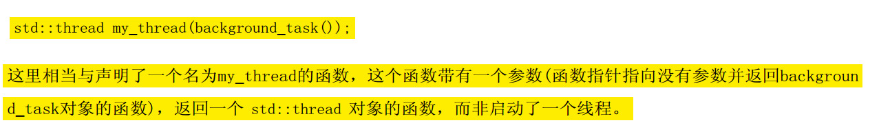
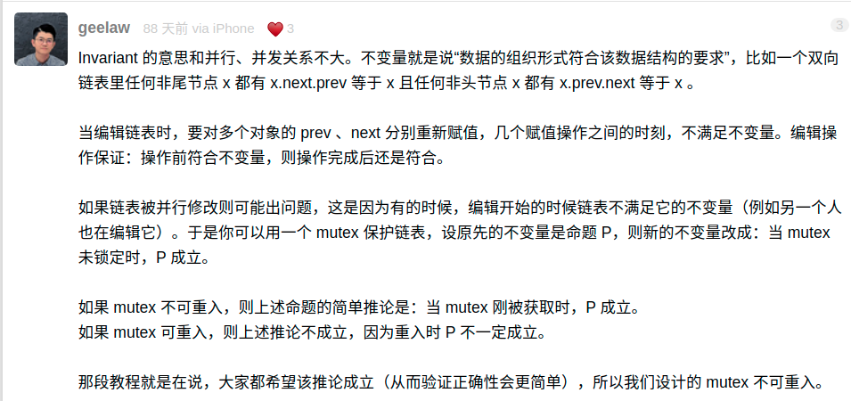
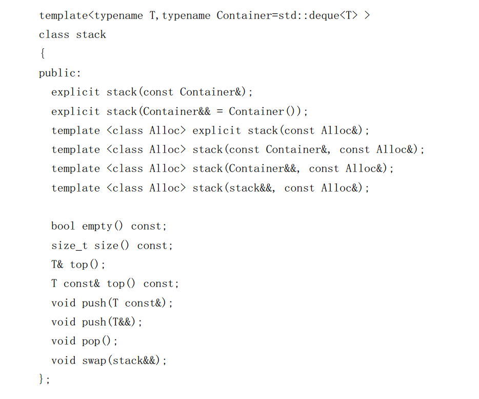
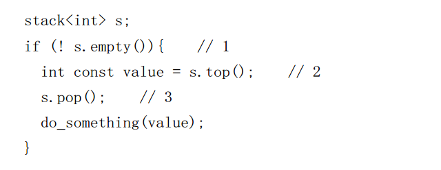
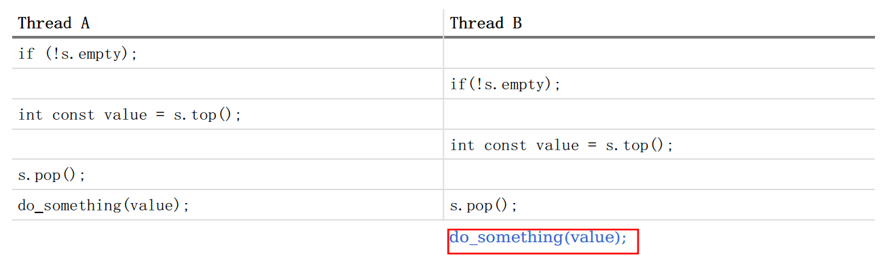
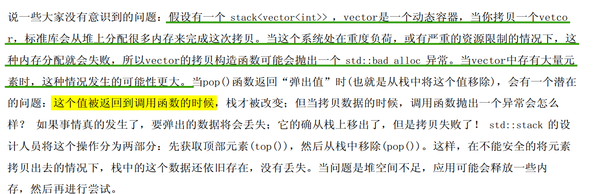
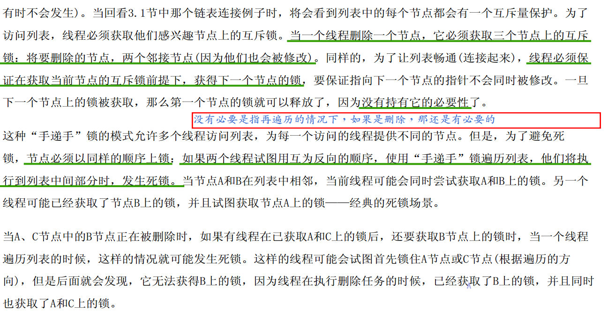
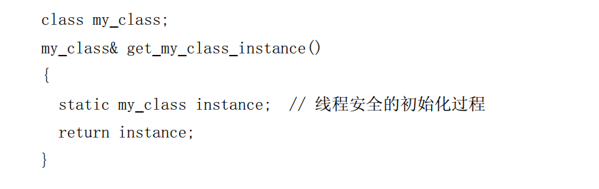
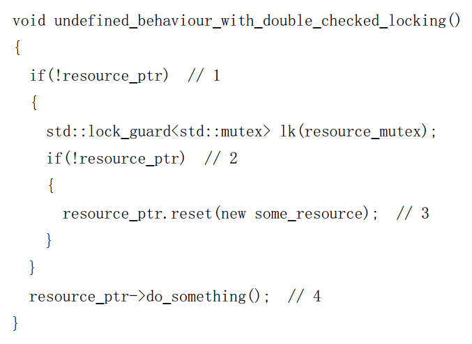
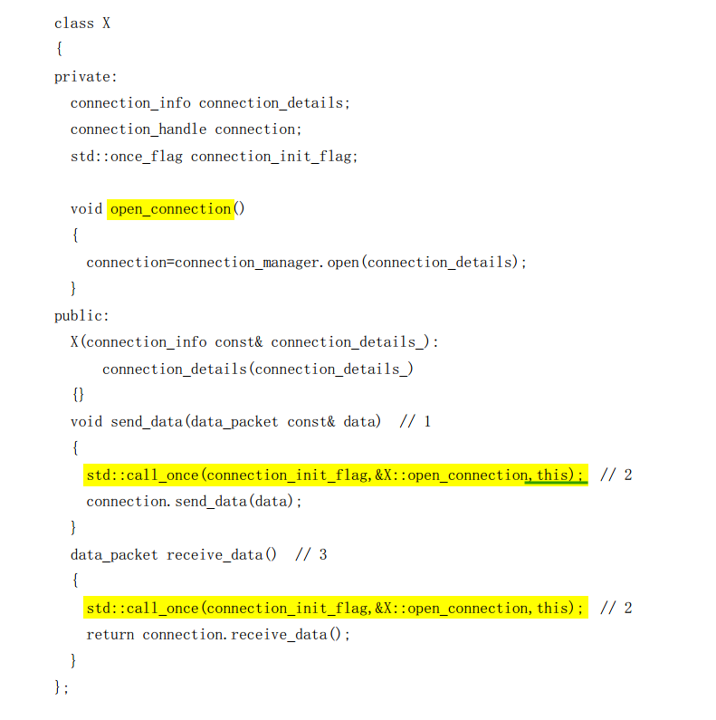

- [1.入门](#1入门)
  - [demo1:hello world](#demo1hello-world)
- [2.线程管理](#2线程管理)
  - [启动线程](#启动线程)
    - [demo2：调用对象会复制到新线程空间](#demo2调用对象会复制到新线程空间)
  - [join or detach](#join-or-detach)
    - [demo3：分离线程](#demo3分离线程)
    - [demo4：join()的复杂调用时机（try catch 和 RAII）](#demo4join的复杂调用时机try-catch-和-raii)
  - [向std::thread构造函数传递参数](#向stdthread构造函数传递参数)
    - [*demo5：静态常量 和 动态变量指针 线程函数参数传递](#demo5静态常量-和-动态变量指针-线程函数参数传递)
    - [demo6：给线程函数 传递变量的引用](#demo6给线程函数-传递变量的引用)
    - [demo7：成员函数指针 作为线程函数](#demo7成员函数指针-作为线程函数)
  - [转移线程所有权std::move](#转移线程所有权stdmove)
    - [demo8： 线程所有权转移](#demo8-线程所有权转移)
    - [demo9:线程对象 做 函数参数或者函数返回](#demo9线程对象-做-函数参数或者函数返回)
    - [demo10：对象移动的应用](#demo10对象移动的应用)
  - [运行时决定线程数量](#运行时决定线程数量)
    - [demo11:控制多线程数量的并发，实现多线程版本accumulate](#demo11控制多线程数量的并发实现多线程版本accumulate)
  - [其他操作](#其他操作)
- [3.线程间共享数据](#3线程间共享数据)
  - [使用互斥量保护共享数据](#使用互斥量保护共享数据)
    - [4种mutex类](#4种mutex类)
    - [2种RAII技术的Lock类](#2种raii技术的lock类)
    - [关于mutex的使用](#关于mutex的使用)
    - [关于BasicLockable和Lockable](#关于basiclockable和lockable)
    - [std::lock_guard 以及关于第二个参数](#stdlock_guard-以及关于第二个参数)
    - [std::unique_lock](#stdunique_lock)
    - [demo12：互斥量的使用，并发安全的list](#demo12互斥量的使用并发安全的list)
    - [demo13: 逃出互斥量保护范围](#demo13-逃出互斥量保护范围)
  - [接口内在的条件竞争](#接口内在的条件竞争)
  - [死锁](#死锁)
    - [避免死锁的经验（针对锁造成的死锁）](#避免死锁的经验针对锁造成的死锁)
    - [避免死锁的经验（针对同步造成的死锁）](#避免死锁的经验针对同步造成的死锁)
    - [demo14: swap导致的死锁及使用std::lock解决](#demo14-swap导致的死锁及使用stdlock解决)
    - [*demo15：层级互斥量实现(重点)](#demo15层级互斥量实现重点)
    - [demo16：unique_lock开启新模式，延迟lock](#demo16unique_lock开启新模式延迟lock)
    - [demo17：unique_lock所有权传递](#demo17unique_lock所有权传递)
  - [锁的粒度](#锁的粒度)
  - [除了互斥量——保护共享数据的替代方案](#除了互斥量保护共享数据的替代方案)
    - [保护共享数据的初始化（延迟初始化）](#保护共享数据的初始化延迟初始化)
      - [demo18：类成员延迟初始化](#demo18类成员延迟初始化)
    - [保护很少更新的数据结构](#保护很少更新的数据结构)
      - [demo19：读写锁——dns例子](#demo19读写锁dns例子)
    - [嵌套锁](#嵌套锁)
# 1.入门
- 为什么使用并发
  - 关注点分离SOC和性能。（应该是使用并发的唯一原因）
    - 当为了SOC而选择并发时，设计线程的数量的依据不再依赖于硬件系统上可用内核数量
- 利用并发提高性能两种方式
  - 任务并行：一个任务分成几部分
  - 数据并行：每个线程再不同的数据部分执行相同的操作
- 除非可以很好的分离业务或者是提高性能，否则别用并发。
  - 线程资源有限，一个如果1MB，那么4GB内存也就4096个线程
  - 线程越多，上下文切换越多
- 不适用并发的原因
  - 划不来
- 之前的线程库：Boost和ACE

## demo1:hello world
- 每个线程都必须由一个初始函数。主线程的初始函数是`main`。以下新线程的初始函数是`hello`
```cpp
void hello() {
    std::cout << " hello parallel" << std::endl;
}

void demo1(){
    // 启动线程
    std::thread t(hello);
    // 等待线程，只能join一次
    t.join();
}
```


# 2.线程管理

## 启动线程
- 使用c++线程库启动线程，可以归结为std::thread对象的构造
  - `std::thread` 执行的任务不能有返回值。
  - `std::thread` 只能移动不能拷贝
- 提供的函数对象 会复制到 **新线程的存储空间**中。（注：对原始函数对象修改不会影响新线程的行为）

- 同std::unique_ptr，std::thread也只能移动不能拷贝。 std::thread 实例不会如 std::unique_ptr 去占有一个动态对象所有权，但是它会占用一部分资源的所有权：每个实例都管理一个执行线程。 std::thread 所有权可以在多个实例中互相转移，因为这些实例是可移动(movable)且不可复制(aren't copyable)。**在同一时间点，就能保证只关联一个执行线程**；

> 语义解析问题
- 这里background_task是一个可调用对象的类
<div align="center" style="zoom:60%"></div>

- 解决
```cpp
std::thread my_thread((background_task())); 
std::thread my_thread{background_task()};
```


### demo2：调用对象会复制到新线程空间
> source
```cpp
// change func demo
struct funcChange{
    int i ;
    void operator()(){
        sleep(3);
        std::cout << i <<std::endl;
    }
};

void ChangeFuncDemo(){
    funcChange f;
    f.i = 4;
    std::thread t(f);
    f.i = 1;
    t.join();

}
```

> output
```
4
```


## join or detach
- 可被 `joinable` 的 `std::thread` 对象必须在他们销毁之前被主线程 `join` 或者将其设置为 `detached`.
- 启动线程之后要考虑是 等待线程结束(`加入式`)还是 让线程自主运行(`分离式`)。
  - 如果再std::thread 对象销毁之前没有做出决定，拥有该对象资源的线程就会被终止(`std::thread`的析构函数调用`std::terminate()`)
  - 一个线程必须且只能被join或detach一次

> join与detach的细节
- `join`
  - `join()`只是简单的让线程等待，不能灵活控制，比如不能看某个条件触发之类的。（需要**条件变量和期待（future）** 完成）
  - 除了等待线程作用，另一个作用是回收对应创建的线程的资源，避免造成资源的泄露。
  - `join`的时机需要把握好，最好用**RAII的方式**解决。demo4
- detach
  - 如果是分离式，要考虑分离的线程中数据的可访问性。 (demo3-1)
  - 如果线程分离，那么就不可能有 std::thread 对象能引用它。C++运行库保证，当线程退出时，相关资源的能够正确回收，后台线程的归属和控制C++运行库都会处理
  - detach之后
    - *this 不再代表任何的线程执行实例。
    - joinable() == false
    - get_id() == std::thread::id()

### demo3：分离线程

> demo3-1
- 两次析构,**因为对std::thread对可调用对象进行拷贝**
- 结果是不可预测的
```cpp
struct func{
    // the error reason when detach
    int &info;

    explicit func(int &s):info(s){}
    void operator()(){
        for(int i = 1;i < 10000; ++i){
            ++info;
        }
    }
    ~func(){
        std::cout << "destructor: "  << info << std::endl;
    }
};

void errorDemo(){
    int localVar = 3;
    func f(localVar);
    std::thread t(f);
    t.detach(); // 分离式
    std::cout << "out put: " << localVar << std::endl;
}
```
> output
- 输出不唯一
```sh
out put: 1410
destructor: 6673
destructor: 10002
#---------------------------也可能
out put: 3
destructor: 3 # 
```

> demo3-2
- 对调用detach之后get_id()的变化
```cpp
void detachInfDemo(){
    std::thread t1([](){
        std::cout <<std::this_thread::get_id() << std::endl;
        std::this_thread::sleep_for(std::chrono::milliseconds(1000));
    });
    std::this_thread::sleep_for(std::chrono::milliseconds(500));
    // 测试detach前后get_id的情况
    std::cout << "Before detach   ----" <<t1.get_id() << std::endl;
    t1.detach();
    std::cout << "After detach   ----" <<t1.get_id() << std::endl;
}
```
> output
```
140496525522496
Before detach   ----140496525522496
After detach   ----thread::id of a non-executing thread
```

### demo4：join()的复杂调用时机（try catch 和 RAII）
- `detach()`只要再初始化`thread`之后就可以调用了，但是`join()`必须找一个合适的时机
- `join()`之前的代码会遇到异常，要避免因为异常而跳过join，导致线程生命周期的问题

- 注：func再demo3中定义
> try catch
- 只能捕获轻量级错误
```cpp
void goodDemo(){
    int localVar = 3;
    func f(localVar);
    std::thread t(f);
    try{
        std::cout << "Start : " << localVar << std::endl;
    } catch(...) {
        std::cout << "In catch" << std::endl;
        t.join();
        throw ;
    }
    t.join();
}
```
> 正解：RAII
- 重点
  - 资源获取即初始化
  - joinable()，因join只能给对象调用一次
  - 避免`threadWrap`拷贝操作
  - 利用构造函数启动线程，获取资源；利用析构函数来释放资源
```cpp
class threadWrap{
public:
    explicit threadWrap(std::thread &at) : t(at){}
    ~threadWrap(){
        // 我的问题：这里不会因为不是原子操作而有问题吗？如果只有一个调用点则不会
        if(t.joinable()){
            t.join();
            std::cout << "destructor threadWrap" << std::endl;
        }
    }
    threadWrap (const threadWrap&) = delete;
    threadWrap & operator=(const threadWrap&) = delete;
private:
    std::thread &t;
};
```

## 向std::thread构造函数传递参数
- **动态变量的指针**作为参数传递给线程函数的时候，要特别注意。demo5（注：动态体现在，可以被销毁）
  - 在通过thread的构造函数给 **线程函数** 传递参数的时候，是通过拷贝的方式，即使线程函数需要的是引用。
- 向线程函数传递参数的时候，类似std::bind()，并不传引用，都是传拷贝，要传引用的话，需要用到 **`std::ref`**（demo6）

- 可以传递一个**成员函数指针**作为线程函数，并提供一个合适的对象指针作为第一个参数(demo7)
- note：线程传递的可执行对象不一定是返回void的。


### *demo5：静态常量 和 动态变量指针 线程函数参数传递

> 静态常量
- 因为"hello word"再rdata区，所以不会出错
```
void f(const std::string& s){
    std::cout << s << std::endl;
}

void staticDemo(){
    std::thread t(f, "hello word");
    t.detach();
    std::cout << "main print: want to wait thread t" << std::endl;
}
```

> output

```
main print: want to wait thread t
hello word
```

> 动态常量
- 这种情况下的问题是，想要依赖隐式转换将字面值转换为函数期待的 std::string 对象，但因 **std::thread 的构造函数会复制提供的变量** ，就只复制了没有转换成期望类型的字符指针。
- 其在指针指向的字面值转化为std::string对象之前很可能字面值已经释放，导致未定义行为。
  - 因为`autoErrorDemo`退出，buffer被释放。
```cpp
void autoErrorDemo(){
    char buffer[1024];
    sprintf(buffer, "%i",123447777777777);
    std::thread t(f,buffer);
    t.detach();
}
```
- 解决方法如下
  - 传递到 std::thread 构造函数之前就将字面值转化为 std::string 对象
```cpp
void autoGreateDemo(){
    char buffer[1024];
    sprintf(buffer, "%i",123447777777777);
    // important
    std::thread t(f,std::string(buffer));
    t.detach();
}
```


### demo6：给线程函数 传递变量的引用
- 与 `bind` 类似，都要使用 `std::ref` 来传引用，否则 `thread` 的构造函数就只是拷贝
```cpp
void fref(std::string& s){
    s = "l1nkkk";
}

void refDemo(){
    std::string s = "init";
    // importand: ref
    std::thread t(fref, std::ref(s));
    sleep(1);
    std::cout << s << std::endl;
}
```


### demo7：成员函数指针 作为线程函数
- 重点：
  - thread的参数
    - 两种模式：引用和值
  - 输出理解
```cpp
class X{
public:
    int a;
    X(int aa) :a(aa){}
    void ThreadDone(int b){
        std::cout << "X res:" << a+b << std::endl;
    }
    X(X& x) {
        a = x.a;
        std::cout << "left value" << std::endl;
    };
    X(X&& x) {
        a = x.a;
        std::cout << "right value" << std::endl;
    };
    ~X(){
        std::cout << "destructor X" << std::endl;
    }
};

void memberDemo(){
    X ax(3);
    {
        std::thread t(&X::ThreadDone, ax, 4);
        t.join();
    }
    std::cout << "--------------------------" <<std::endl;
    ax.a = 5;
    {
        std::thread t(&X::ThreadDone, &ax, 4);
        t.join();
    }
}
```

> output
- 第一次destructor是在thread的内部空间中触发的；
- 第二次destructor是在memberDemo退出后触发的；
```
left value
X res:7
destructor X
--------------------------
X res:9
destructor X
```


## 转移线程所有权std::move
- C++标准库中有很多资源占有(resource-owning)类型，比如 std::ifstream , std::unique_ptr 还有 std::thread 都是可移动(movable)，但不可拷贝(cpoyable)。
- 为什么要移动线程呢
  - 方便资源的管理（个人觉得）
### demo8： 线程所有权转移
- 重点
  - 备注
  - 只能再detach之前转移。detach之后就解绑了

```cpp
int f1(){
    sleep(1);
    std::cout << "thread 1" << std::endl;
}

int f2(){
    sleep(2);
    std::cout << "thread 2" << std::endl;
}

void transOwnDemo(){
    std::thread t1(f1);
    std::thread t2(std::move(t1));
    // 隐式调用移动赋值函数
    t1 = std::thread(f2);
    t1.join();
    t2.join();

    // 这个时候join已经对线程数据进行回收了，可以重新给线程对象赋值了
    std::cout << "--------------" << std::endl;
    t1 = std::thread(f1);
    std::thread t3 = std::thread(f2);
    std::cout << "before error" << std::endl;
    // 程序崩溃，t1已经有关联的线程了。
    t1 = std::move(t3);
    t1.join();
}
```
> output
```
thread 1
thread 2
--------------
before error
terminate called without an active exception
```

### demo9:线程对象 做 函数参数或者函数返回
- 得益于线程对象的可移动 

```cpp
std::thread fret(){
    return std::thread(f1);
}

void fpar(std::thread t){
    t.join();
}

void moveUseDemo(){
    fpar(fret());
}
```

### demo10：对象移动的应用
- 对比demo4
  - 这里使用的是实例，而不是引用

```cpp
class threadWrapper{
public:
    explicit threadWrapper(std::thread at): t(std::move(at)){
        if(!t.joinable())
            throw std::logic_error("No thread");
    }

    ~threadWrapper(){
        t.join();
    }
    threadWrapper(const threadWrapper &) = delete;
    threadWrapper operator = (const threadWrapper &) = delete;

private:
    // 不是引用
    std::thread t;
};
void wrapDemo(){
    // 需要再加一层括号，否则是声明
    threadWrapper tw((std::thread(f1)));
}
```

- std::thread 对象的容器，如果这个容器是移动敏感的(比如，标准中的 std::vector<> )，那么移动操作同样适
用于这些容器

```cpp
void f3(int i){
    std::cout << i << std::endl;
}

void threadContainDemo(){
    std::vector<std::thread> vt;
    for(int i = 0; i < 10; ++i){
        vt.push_back(std::thread(f3,i));
    }
    std::for_each(vt.begin(), vt.end(), std::mem_fn(&std::thread::join));
}
```

## 运行时决定线程数量
- `std::thread::hardware_concurrency()`
  - 可能无法获取系统信息返回0
- std::this_thread::get_id()：获取当前线程id


### demo11:控制多线程数量的并发，实现多线程版本accumulate
- 因为不能直接从一个线程中返回一个值，所以需要传递results容器的引用到线程中去。另一个办法，通过地址来获取线程执行的结果，后面通过期望来实现该方案。
- 因为上下文频繁的切换会降低线程的性能，所以你肯定不想启动的线程数多于硬件支持的线程数量(称为超额认购(oversubscription))
- 启动的线程数必须比num_threads少1个，因为在启动之前已经有了一个线程(主线程)
```cpp
template<typename Iterator, typename T>
struct  accumulate_block{
    void operator()(Iterator first, Iterator last,T& result){
        std::cout << std::this_thread::get_id()<< std::endl;
        result = std::accumulate(first, last, result);
    }
};

template<typename  Iterator, typename T>
T paraller_accumulate(Iterator first, Iterator last, T init){
    const uint length= std::distance(first, last);
    if(!length)
        return init;
    const uint minPerThread = 25;
    const uint maxThreads = (length - 1)/minPerThread + 1;
    // 可能返回0，当系统信息无法读取
    const uint hardwareThreads = std::thread::hardware_concurrency();
    // important
    const uint numThreads = std::min(hardwareThreads != 0?hardwareThreads:2, maxThreads);
    const uint blockSize = length/numThreads;

    // 结果和线程容器
    std::vector<std::thread> threads(numThreads - 1);
    std::vector<T> results(numThreads);

    Iterator blockStart = first;
    // 注意-1。多线程并发处
    for(int i  =0; i < numThreads - 1; ++i){
        Iterator blockEnd = blockStart;
        std::advance(blockEnd, blockSize);
        threads[i] = std::thread(accumulate_block<Iterator, T>(), blockStart, blockEnd, std::ref(results[i]));
        blockStart = blockEnd;
    }

    // 计算剩余的块
    accumulate_block<Iterator, T>()( blockStart, last , results[numThreads - 1]);
    // join, men_fn的使用
    std::for_each(threads.begin(), threads.end(), std::mem_fn(&std::thread::join));
    return std::accumulate(results.begin(), results.end(), init);
}

void accumulateDemo(){
    std::vector<int> vi(100);
    for(int i = 0;i < 100;++i){
        vi[i] = i;
    }
    auto res = paraller_accumulate(vi.begin(), vi.end(), 0);
    std::cout << res << std::endl;
}
```
> output
```
140358556354112
140358405350976
140358556358464
140358547961408
4950
```
## 其他操作
- `yield`: 当前线程放弃执行，操作系统调度另一线程继续执行。
  - 用处：可以避免一直循环，占cpu
- 休眠
  - sleep_until
  - sleep_for

> 识别线程
- 两种方式获取std::thread::id 
  - 线程对象 std::thread：成员函数get_id()
  - 线程中：std::this_thread::get_id()
- 性质
  - 如果相等
    - 是同一个一个线程。
    - 或者没有线程
  - 如果不等
    - 是不同线程
    - 或者一个有线程，一个没有
  - 可以比较
    - 意味着能作为key
- 用法
  - std::thread::id 实例常用作检测线程是否需要进行一些操作，比如一般主线程需要更多操作。
  - 存到一个集合中，表示允许某项操作的线程集合。
  - 作为键值


# 3.线程间共享数据

> 不变量
- 重点：**不变量（invariant）**，其是一个命题，当没有被破坏的时候，这个命题永真.(注：感觉就是一种状态，但是这种状态一旦变了,就..)
  - 有点像事务的**一致性**，比如保持a+b=10
  - https://liam.page/2017/06/10/protecting-data-sharing-between-threads/
  - https://www.v2ex.com/t/753310

<div align="center" style="zoom:60%"></div>


> 条件竞争
```
竞争条件指多个线程或者进程在读写一个共享数据时结果依赖于它们执行的相对时间的情形。
竞争条件发生在当多个进程或者线程在读写数据时，其最终的的结果依赖于多个进程的指令执行顺序。
                                        ——百度百科
```

- 一般因素：共享数据——>条件竞争
- **避免恶性条件竞争方法**
  - `互斥量`：最简单的办法就是对数据结构采用某种保护机制，**确保只有进行修改的线程才能看到不变量被破坏时的中间状态**（如互斥量）
  - `无锁编程`：对数据结构和不变量的设计进行修改，修改完的结构必须能完成一系列不可分割的变化，也就是保证每个不变量保持稳定的状态，这就是所谓的**无锁编程**(lock-free programming)
    - 一般很难，会让工作变得复杂
  - `软件事务`：使用事务(transacting)的方式去处理数据结构的更新(这里的"处理"就如同对数据库进行更新一样)。全部操作完后提交生效，称为**软件事务内存**(STM)。（注：事务保护一致性，即保护不变量）

## 使用互斥量保护共享数据
- `构造`：std::mutex**没有拷贝和移动构造函数**
- lock()进行上锁，unlock()进行解锁。
  - 一般不手动lock，C++标准库为互斥量提供了一个**RAII语法**的模板类 std::lock_guard 
- `一般用法`：大多数情况下，互斥量通常会与保护的数据放在同一个类中，（注：并将其设置为私有）而不是定义成全局变量。(demo12)
- `注意事项`：互斥量保护的数据需要对接口的设计相当谨慎，要确保互斥量能锁住任何对保护数据的访问，并且不留后门
  - 当其中一个成员函数返回的是保护数据的**指针或引用**时，会**破坏对数据的保护**
  - 当成员函数内部存在 针对保护对象的指针或引用的调用时 需要特别注意，可能会逃出互斥量的保护范围。（demo13）


### 4种mutex类
1. `std::mutex`，最基本的 Mutex 类，该类提供了最基本的上锁和解锁操作。同时，基本的互斥量不允许某个线程在已获得互斥量的情况下重复对该互斥量进行上锁操作，所以重复上锁将会导致死锁（结果通常未定义的）。
2. `std::recursive_mutex`，递归 Mutex 类，与 `std::mutex` 功能基本相同，但是允许互斥量的拥有者（通常是某个线程）重复对该互斥量进行上锁操作而不会产生死锁，但必须保证上锁和解锁的次数相同。
3. `std::time_mutex`，定时 Mutex 类，与 `std::mutex` 功能基本相同，但是提供了两个额外的定时上锁操作，`try_lock_for` 和 `try_lock_until`，即某个线程在规定的时间内对互斥量进行上锁操作，如果在规定的时间内获得了锁则返回 `true`, 超时则返回 `false`。
4. `std::recursive_timed_mutex`，定时递归 Mutex 类，既提供了重复上锁功能，又提供了定时上锁的特性（即在规定的时间内没有获得锁则返回 `false`），相当于 `std::recursive_mutex` 和 `std::time_mutex` 的组合。

### 2种RAII技术的Lock类

1. `std::lock_guard`，与 Mutex RAII 相关，方便线程对互斥量上锁。
2. `std::unique_lock`，与 Mutex RAII 相关，方便线程对互斥量上锁，但提供了更好的上锁和解锁控制。


### 关于mutex的使用
- 构造函数，std::mutex不允许拷贝构造，也不允许 move 拷贝，最初产生的 mutex 对象是处于 unlocked 状态的。

> lock、unlock 和trylock
- lock()，调用线程将锁住该互斥量。线程调用该函数会发生下面 3 种情况：
  1. 如果该互斥量当前没有被锁住，则调用线程将该互斥量锁住，直到调用 unlock之前，该线程一直拥有该锁。
  2. 如果当前互斥量被其他线程锁住，则当前的调用线程被阻塞住。
  3. 如果当前互斥量被当前调用线程锁住，则会产生死锁(deadlock)。
- unlock()， 解锁，释放对互斥量的所有权。
- try_lock()，尝试锁住互斥量，如果互斥量被其他线程占有，则当前线程也不会被阻塞。线程调用该函数也会出现下面 3 种情况，

    1. 如果当前互斥量没有被其他线程占有，则该线程锁住互斥量，直到该线程调用 unlock 释放互斥量。
    2. 如果当前互斥量被其他线程锁住，则当前调用线程返回 false，而并不会被阻塞掉。
    3. 如果当前互斥量被当前调用线程锁住，则会产生死锁(deadlock)。

###  关于BasicLockable和Lockable
- BasicLockable
  - 标准库中定义几种基本的 `BasicLockable` 类型，分别 `std::mutex`, `std::recursive_mutex`, `std::timed_mutex`，`std::recursive_timed_mutex` 以及 `std::unique_lock`
- Lockable
  - 在`BasicLockable`基础上添加`try_lock` 操作

- `std::unique_lock`和`std::lock_guard`都是需要 `BasicLockable`类型


### std::lock_guard 以及关于第二个参数
- 用来作为锁的包装器
- https://en.cppreference.com/w/cpp/thread/lock_tag
- 第二个参数(经过测试只能传这一个，也合理)
  - adopt_lock_t：assume the calling thread already has ownership of the mutex

- 自c++17起，应该使用std::scoped_lock代替std::lock_guard
### std::unique_lock
- 比lock_guard更加灵活，但是资源开销比较大。
- 第二个参数
  - defer_lock_t：do not acquire ownership of the mutex
  - try_to_lock_t：try to acquire ownership of the mutex without blocking
  - adopt_lock_t：assume the calling thread already has ownership of the mutex
- 对比lock_guard:
  - 参考：https://blog.csdn.net/qq_37233607/article/details/80159873  
  - 参考：https://stackoverflow.com/questions/20516773/stdunique-lockstdmutex-or-stdlock-guardstdmutex
  - 可以锁定和解锁多次，而lock_guard只能在构造的时候锁定一次，在析构的时候解锁（demo16）
  - 可以进行交换操作（demo17）, std::unique_lock 是可移动，但不是可赋值的类型
  - std::unique_lock 实例不会总与互斥量的数据类型相关


### demo12：互斥量的使用，并发安全的list
- 注意
  -  `std::lock_guard` 使用
  -  互斥量与保护数据一起封装
  -  lambda的值传递和引用传递
```cpp
class parallelList{
public:
    void addList(int a){
        // important
        std::lock_guard<std::mutex> guard(mtx);
        intList.push_back(a);
    }
    bool exist(int a){
        // important
        std::lock_guard<std::mutex> guard(mtx);
        return std::find(intList.begin(), intList.end(), a) != intList.end();
    }

    void show(){
        for(auto &a:intList){
            // 可以优化为读写锁
            std::lock_guard<std::mutex> guard(mtx);
            std::cout << a << " ";
        }
    }

private:
    std::list<int> intList;
    std::mutex mtx;
};

void mutexDemo(){
    // share data
    parallelList pl;
    // thread set
    std::vector<std::thread> threads(3);

    // parallel
    for(int i = 0; i < 3;++i){
        // 注意是值引用i
        threads[i] = std::thread([i,&pl](){
            for(int j = 0; j < 10; ++j){
                pl.addList(j+10*i);
            }
        });
    }
    std::cout << pl.exist(0) << std::endl;

    
    for(int i = 0; i < 3;++i)
        threads[i].join();
    pl.show();
}
```

> output
```cpp
0
0 1 2 3 4 5 6 7 8 9 20 21 22 23 24 25 26 27 28 29 10 11 12 13 14 15 16 17 18 19 
```

### demo13: 逃出互斥量保护范围
- 需要特别注意成员函数中 **针对保护对象的指针或引用** 的作为参数的函数调用
  - 传出去相当于把私有保护的数据带到外面去，逃离互斥量的保护
- 经验：切勿将 受保护数据的指针或引用 传递到互斥锁作用域之外，无论是函数返回值，还是存储在外部可见内存，亦或是 以参数的形式传递到 用户提供的函数 中去。
```cpp
class dangerList{
public:
    void opt(void func(std::list<int>&)){
        std::lock_guard<std::mutex> guard(mtx);
        func(intList);
    }
private:
    std::list<int> intList;
    std::mutex mtx;
};

void mtxDangerDemo(){
    std::list<int> *unprotect_pl;

    // danger !!!!,escape the mutex zoom
    auto fun = [&unprotect_pl](std::list<int >& refL){
        unprotect_pl = &refL;
    };
    // can doing something to pl without mutex
}

```

## 接口内在的条件竞争
- **并不是使用了互斥量保护了不变量的变化过程了之后就没什么风险了**
>  比如3.2.3所讲的例子
- 假设现在我们用 互斥量 保护了list的不变量， 基于list作为容器去构造stack。这个时候stack的接口如下所示。
  - 即使修改了top()，使其返回一个拷贝而非引用(即遵循了3.2.2节的准则)，对内部数据使用一个互斥量进行保护，这个接口仍存在条件竞争。
<div align="center" style="zoom:60%"></div>

- 现在以下的实现对于单线程来说是安全的，但是对于多线程，却是不安全的。因为在top和pop之间存在条件竞争。
  - **问题发生在接口设计上，所以解决的方法也就是改变接口设计**。
<div align="center" style="zoom:60%"></div>

- 以上代码一种可能产生问题的情况
  - 如果stack的容量是1的话，那么pop就会出错
  - **有点像事务的写倾斜，即使内部有写锁还是会出现问题。一个事务的执行影响了另一个事务的结果（A线程的pop影响了B线程的empty结果）**
    - 典型的： `判断----读----改`
<div align="center" style="zoom:60%"></div>


> 为什么设计人员不把top的功能结合到pop中（让pop带出数据）
- 好处：如果这样做，可以让用户调用pop的时候，弹出数据的同时返回。
  - 这样就可以用一个互斥量控制pop，避免竞争（但是对于empty还是又问提吧）
- 缺点：这个值被返回到调用函数的时候，如果这个过程中**拷贝构造报错**，那么数据将丢失。
  - 基于这个原因，设计人员将这操作分为两部分——取顶部数据top，从栈中删除pop
  - 这样的**拆分**造成了条件竞争。（为什么呢？？）
- 详细描述如下：
  - 为什么要拆分
<div align="center" style="zoom:60%"></div>


> 解决拆分所造成条件竞争的方法
- 选项1：传入一个引用
  - 缺点：
    - 需要临时构造出一个堆中类型的实例，效率不高（有些可能只想弹出，不想接收数据）
    - 重点：需要可赋值的存储类型（=），这是一个重大限制：

```cpp
std::vector<int> result;
some_stack.pop(result);
```

- 选项2：无异常抛出的拷贝构造函数或移动构造函数
  - note：可这和解决冲突有什么关系
  - 对于有返回值的pop()函数来说，只有“异常安全”方面的担忧，消除这一担忧就可以用这种接口了
  - 做法：使用 `std::is_no_throw_copy_constructible` 和 `std::is_nothrow_move_constructible` 类型特征。表明在拷贝构造和移动构造中不会抛出错误。
  - 缺点：让拷贝或移动构造函数不抛出异常，但是这种方式的**局限性太强**。很多用户定义类型有可抛出异常的拷贝构造函数，没有移动构造函数；或是，都不抛出异常的构造函数(这种改变会随着C++11中左值引用，越来越为大众所用)。（注：后面括号的不懂）


- 选项3：返回指向弹出值的指针
  - 做法：返回一个指向弹出元素的指针，而不是直接返回值。指针的优势是自由拷贝，并且不会产生异常，这样你就能避免Cargill提到的异常问题了
  - 缺点：缺点就是返回一个指针需要对对象的内存分配进行管理
    - 针对该缺点可以使用动态指针避免
      - note：这不是扯淡吗，如果容器存的是指针

```cpp
std::shared_ptr<T> pop();
```


## 死锁
- `引入`：如果锁的粒度太大了，程序会简单点，但是发挥不了并发的优势。如果粒度太小了又容易造成死锁。
- `避免死锁的一般建议`：`让两个互斥量总以相同的顺序上锁。`但是这个对于swap这样的操作是没有用的（或者说有点困难），这种情况下可以用std::lock来解决，如demo14。
  - 注：我觉得只要一定保证锁的顺序就不会死锁问题。swap只是再交换参数的时候，导致锁的顺序变化，从而带来了死锁。
- `std::lock`可以帮助在获取两个锁时避免死锁，但是再获取一个锁时的情况死锁却无能为力，这个时候需要靠程序员的经验了。

### 避免死锁的经验（针对锁造成的死锁）
- 锁只是产生死锁的一般原因。并不是唯一原因
- 比如现在又线程1和线程2，在无锁情况下，这两个线程交叉join的话，那么这两个线程就造成了死锁

> 建议1：避免嵌套锁
- 一个线程已获得一个锁时，再别去获取第二个。
- 当你需要获取多个锁，使用一个 std::lock 来做这件事(对获取锁的操作上锁)，避免产生死锁
> 建议2：避免在持有锁时调用用户提供的代码
- 用户的代码可能也有 获得锁的操作。会破坏建议1

> 建议3：**使用固定顺序获取锁**（**手递手**）
- 当硬性条件要求你获取两个以上(包括两个)的锁，并且不能使用 std::lock 单独操作来获取它们;那么最好在每个线程上，用固定的顺序获取它们获取它们(锁)。
- 下面的例子是一个很好的例子，举的是双向链表的例子，每个元素都有自己的互斥量，如果允许双向遍历的操作，那么将打破固定顺序获得锁的建议。
  - 因为：再遍历的时候，需要获取当前节点的锁。在删除某个节点的时候，需要获取三个节点的锁。如ABC的链表，再同时删除A和C的多线程中，要同时获得B的锁，那么将产生死锁。
  - 如果只允许从左到右的方式，将可以避免。
  - 详细如下所示。
<div align="center" style="zoom:60%"></div>

> 建议4：使用锁的层次结构
- 注：我觉得本质上还是保证了获得锁的顺序 
- 含义：上了低层级的之后，不能上更高层级的
- 在层级互斥量上产生死锁，是不可能的。
- 缺点：必须给每个互斥量指定比其前一个更低的层级，有时候不可以实现，比如调用用户自己写的代码的时候。


### 避免死锁的经验（针对同步造成的死锁）
- 给线程一个层级，让一个线程只能等待比他层级低的线程，这样就能避免死锁

### demo14: swap导致的死锁及使用std::lock解决
```cpp
// 假设有一个类型A：
A a;
A b;

// 有一个函数：
void a_swap(A& a,A& b) {
a.mut_.lock();
b.mut_.lock();
...
}

// thread 1:
a_swap(a, b);

// thread 2:
a_swap(b, a);
```

> 解决

- lock_guard
  - **std::adopt_lock**表示传递过来的互斥量已经lock过了，构造函数的时候不需要lock，只管析构时unlock就好了
- lock可以一次性锁住两个互斥量，而且没有副作用
  - 需要注意的是，当使用 std::lock 去锁lhs.m或rhs.m时，**可能会抛出异常**；这种情况下，异常会传播到 std::lock 之外。当 std::lock 成功的获取一个互斥量上的锁，并且当其尝试从另一个互斥量上再获取锁时，就会有异常抛出，**第一个锁也会随着异常的产生而自动释放，所以 std::lock 要么将两个锁都锁住，要不一个都不锁**。

```cpp
// 这里的std::lock()需要包含<mutex>头文件
class some_big_object;
void swap(some_big_object& lhs,some_big_object& rhs);
class X
{
private:
    some_big_object some_detail;
    std::mutex m;
public:
    X(some_big_object const& sd):some_detail(sd){}
    friend void swap(X& lhs, X& rhs)
    {
        if(&lhs==&rhs)
        return;
        // important!!!
        std::lock(lhs.m,rhs.m); // 1
        std::lock_guard<std::mutex> lock_a(lhs.m,std::adopt_lock); // 2
        std::lock_guard<std::mutex> lock_b(rhs.m,std::adopt_lock); // 3
        swap(lhs.some_detail,rhs.some_detail);
    }
};
```

### *demo15：层级互斥量实现(重点)
- 使用层次锁可以在许多场景下避免死锁，但是这个不是标准库的，要自己实现。
- 内部状态的更新必须再内部mtx形成的临界区下进行。
```cpp
class levelMutex{
public:
    explicit levelMutex( uint32_t p):parrentLeve(p), preLevel(0){}

    // std::lock_guard<>接口，以下三个
    void lock(){
        checkLevel();
        mtx.lock();
        preLevel = this_thread_level;
        this_thread_level = parrentLeve;
    }
    void unlock(){
        // 注意：需要放在unlock前面
        this_thread_level = preLevel;
        mtx.unlock();
    }
    bool try_lock(){
        checkLevel();
        if (!mtx.try_lock())
            return false;
        preLevel = this_thread_level;
        this_thread_level = parrentLeve;
        return true;
    }

private:
    // 注意： "thread_local"的使用
    static thread_local unsigned long this_thread_level;

    void checkLevel() const{
        if(parrentLeve >= this_thread_level){
            throw std::logic_error("mutex level violate");
        }
    }
private:
    std::mutex mtx;
    const uint32_t parrentLeve;
    uint32_t preLevel;
};
thread_local unsigned long levelMutex::this_thread_level{UINT32_MAX};

levelMutex lm1(100);
levelMutex lm2(10);

void rightDemo(){
    std::lock_guard<levelMutex> glm1(lm1);
    std::lock_guard<levelMutex> glm2(lm2);
    std::cout << "right Demo" << std::endl;
}

void errorDemo(){
    std::lock_guard<levelMutex> glm1(lm2);
    std::lock_guard<levelMutex> glm2(lm1);
    std::cout << "error Demo" << std::endl;
}
```


  
### demo16：unique_lock开启新模式，延迟lock
- 利用的是
- `std::defer_lock` 的使用，只能`unique_lock` 。指的是构造的时候不需要mutex所有权
```cpp
class some_big_object;
void swap(some_big_object& lhs,some_big_object& rhs);
class X
{
private:
  some_big_object some_detail;
  std::mutex m;
public:
  X(some_big_object const& sd):some_detail(sd){}
  friend void swap(X& lhs, X& rhs)
  {
    if(&lhs==&rhs)
      return;
    // 重点，使用了std::defer_lock
    std::unique_lock<std::mutex> lock_a(lhs.m,std::defer_lock); // 1 
    std::unique_lock<std::mutex> lock_b(rhs.m,std::defer_lock); // 1 std::def_lock 留下未上锁的互斥量
    std::lock(lock_a,lock_b); // 2 互斥量在这里上锁
    swap(lhs.some_detail,rhs.some_detail);
  }
};

```

### demo17：unique_lock所有权传递

```cpp
std::unique_lock<std::mutex> get_lock()
{
    extern std::mutex some_mutex;
    std::unique_lock<std::mutex> lk(some_mutex);
    prepare_data();
    return lk; // 1. 移动构造函数
}
void process_data()
{
    std::unique_lock<std::mutex> lk(get_lock()); // 2
    do_something();
}
```

## 锁的粒度
- 在可能的情况下，锁住互斥量的同时只能对共享数据进行访问；试图对锁外数据进行处理，特别是一些费时的IO，多线程带来的性能效益会被抵消。

```cpp
void get_and_process_data()
{
    std::unique_lock<std::mutex> my_lock(the_mutex);
    some_class data_to_process=get_next_data_chunk();
    my_lock.unlock();  // 1 不要让锁住的互斥量越过process()函数的调用

    // 无锁区，让出锁
    result_type result=process(data_to_process);

    my_lock.lock(); // 2 为了写入数据，对互斥量再次上锁
    write_result(data_to_process,result);
}
```

## 除了互斥量——保护共享数据的替代方案

### 保护共享数据的初始化（延迟初始化）
- 懒汉模式的多线程安全问题
- 当局部变量为static时，在以前c++11之前的编译器，其存在条件竞争，static 一运行到该处声明就被初始化，每个线程都认为自己是第一个初始化的，但是在c++11之后初始化及定义都是在一个线程中。所以也有了懒汉模式的另外一种并发安全的方案。方案如下：
<div align="center" style="zoom:60%"></div>


> 双重检查锁（不安全）
- 指针赋值了，但还没构造的情况
<div align="center" style="zoom:60%"></div>

> 解决
- C++标准库提供了 std::once_flag 和 std::call_once 来处理这种情况。
```cpp
std::shared_ptr<some_resource> resource_ptr;
std::once_flag resource_flag; // 1
void init_resource()
{
    resource_ptr.reset(new some_resource);
}
void foo()
{
    std::call_once(resource_flag,init_resource); // 可以完整的进行一次初始化
    resource_ptr->do_something();
}
```

#### demo18：类成员延迟初始化
- 有点类似数据库类的那种使用时才连接的操作
<div align="center" style="zoom:60%"></div>


### 保护很少更新的数据结构
- 引入了读写锁，但是c++11不支持读写锁。所以使用Boost
- 更新时：
  - 可以使用 std::lock_guard<boost::shared_mutex> 和 std::unique_lock<boost::shared_mutex> 进行上锁
- 查找时：
  - 可以使用 boost::shared_lock<boost::shared_mutex> 

#### demo19：读写锁——dns例子
```cpp
#include <map>
#include <string>
#include <mutex>
#include <boost/thread/shared_mutex.hpp>

class dns_entry;

class dns_cache
{
  std::map<std::string,dns_entry> entries;
  mutable boost::shared_mutex entry_mutex;
public:
  dns_entry find_entry(std::string const& domain) const
  {
    boost::shared_lock<boost::shared_mutex> lk(entry_mutex);  // 1
    std::map<std::string,dns_entry>::const_iterator const it=
       entries.find(domain);
    return (it==entries.end())?dns_entry():it->second;
  }
  void update_or_add_entry(std::string const& domain,
                           dns_entry const& dns_details)
  {
    std::lock_guard<boost::shared_mutex> lk(entry_mutex);  // 2
    entries[domain]=dns_details;
  }
};
```


### 嵌套锁
- 引入：当一个线程已经获取一个 std::mutex 实例时(已经上锁)，并对其再次上锁，这个操作就是错误的，并且继续尝试这样做的话，会**产生未定义行为**。
- 嵌套锁：C++标准库提供了 std::recursive_mutex 类。
  - 可以lock多次，但是也要对应次数unlock——通过 std::lock_guard来保障
  - 当需要用到自个，就应该反思自己的设计

- 使用场景：
  - 嵌套锁一般用在可被多线程并发访问的类上，所以其拥有一个互斥量保护其成员数据。每个公共成员函数都会对互斥量上锁，然后完成对应的功能，之后再解锁互斥量。不过，有时一个公共成员函数会调用另一个公共函数作为其操作的一部分。在这种情况下，第二个成员函数也会试图锁住互斥量，这就会导致未定义行为的发生。——这样的使用方式是不推荐的。
    - 不推荐原因：当锁被持有时，对应类的不变量通常是正在被修改的，这就意味着，当不变量正在改变的时候，第二个成员函数还需要继续执行。
    - 替代方案：**抽出私有方法，给公有方法调用，而且这个私有方法中，不对互斥量进行操作**

