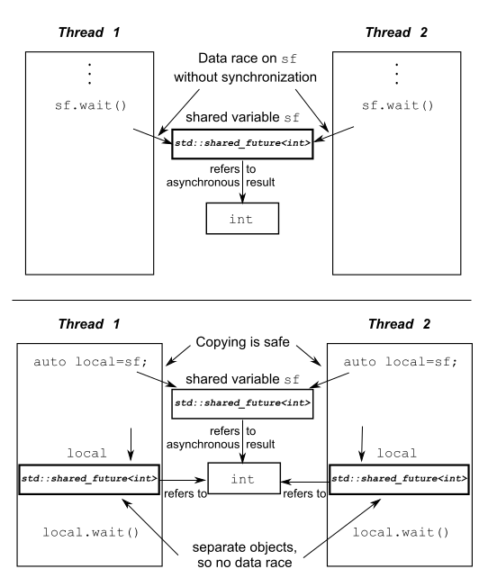

- [同步并发操作（线程同步）](#同步并发操作线程同步)
  - [条件变量](#条件变量)
    - [使用](#使用)
    - [*demo1:条件变量的入门使用](#demo1条件变量的入门使用)
    - [demo2(重要):线程安全的队列](#demo2重要线程安全的队列)
- [异步](#异步)
  - [期望future：使用期望等待一次性事件](#期望future使用期望等待一次性事件)
    - [demo3：期望的入门使用](#demo3期望的入门使用)
    - [demo4：future的参数传递](#demo4future的参数传递)
  - [任务与期望std::packaged_task](#任务与期望stdpackaged_task)
    - [demo5.1：std::packaged_task任务post和get](#demo51stdpackaged_task任务post和get)
    - [demo5.1：std::packaged_task任务与get_future的使用](#demo51stdpackaged_task任务与get_future的使用)
  - [std::promise](#stdpromise)
    - [demo6: promise 的初步使用，线程间传值](#demo6-promise-的初步使用线程间传值)
    - [demo7: promise的使用，线程间传递任务（函数）](#demo7-promise的使用线程间传递任务函数)
  - [为future存储异常](#为future存储异常)
  - [多个线程的等待——share_future](#多个线程的等待share_future)
    - [demo8: shared_future的初步使用](#demo8-shared_future的初步使用)
  - [限定等待时间](#限定等待时间)
    - [时钟](#时钟)
    - [时延](#时延)
    - [时间点](#时间点)
    - [使用超时功能的函数](#使用超时功能的函数)
  - [使用同步操作简化代码](#使用同步操作简化代码)
# 同步并发操作（线程同步）
- 当一个线程等待另一个线程完成时，有以下实现选择。
  - 可以持续的检查共享数据标志
    - 太损耗效率了
  - 等待间隙检查共享标志。`std::this_thread::sleep_for(std::chrono::milliseconds(100))`
    - 不知道多大合适
  - 条件变量或期望（推荐）
    - 条件变量使用入demo1所示


## 条件变量
- 引入：使用队列在多个线程中转移数据是很常见的。如果做的好的话，**同步操作可以限制在队列本身**，同步问题和条件竞争出现的概率也会降低。
  - 所以可以编写线程安全的队列 demo2(注：和前面的安全stack类似)

### 使用
> wait的使用
```
template <class Predicate>
void wait (unique_lock<mutex>& lck, Predicate pred)
```
- `std::condition_variable` 提供了两种 `wait()` 函数
  - 第一种 : 只使用lck。当前线程调用 wait() 后将被阻塞(此时当前线程应该获得了锁（mutex），不妨设获得锁 lck)，直到另外某个线程调用 notify_* 唤醒了当前线程。
  - 第二种：设置了`Predicate`。只有当 `pred` 条件为 `false` 时调用 `wait()` 才会阻塞当前线程，并且在收到其他线程的通知后只有当 `pred` 为 `true` 时才会被解除阻塞。

- 时间相关的方法：`wait_for` 、`wait_until`

- 在线程被阻塞时，该函数会自动调用 `lck.unlock()` 释放锁，使得其他被阻塞在锁竞争上的线程得以继续执行。另外，一旦当前线程获得通知(`notified`，通常是另外某个线程调用 `notify_*` 唤醒了当前线程)，`wait()` 函数也是自动调用 `lck.lock()`，使得 `lck` 的状态和 `wait` 函数被调用时相同。


> notify
- std::condition_variable::notify_all()
- std::condition_variable::notify_one()

> std::condition_variable_any
- 与 `std::condition_variable` 类似，只不过 `std::condition_variable_any` 的 `wait` 函数可以接受任何 `lockable` 参数，而 `std::condition_variable` 只能接受 `std::unique_lock<std::mutex>` 类型的参数，除此以外，和 `std::condition_variable` 几乎完全一样。


### *demo1:条件变量的入门使用
- `wait`唤醒的时候会调用条件判断函数，再此之前已经重新上锁了。
```cpp
std::mutex mtx;
std::queue<std::string> dataQueue;
std::condition_variable cond;

void producer(){
    int a = 0;
    while(true){
        // 睡眠1s
        std::this_thread::sleep_for(std::chrono::milliseconds(1000));
        // 可以是lock_guard
        std::lock_guard<std::mutex> lgLock(mtx);
        dataQueue.push("hahaha"+std::to_string(a));
        if(a == 5) {
            dataQueue.push("end");
            // 注：唤醒xonsumer线程
            cond.notify_one();
            return;
        }
        else ++a;
        cond.notify_one();
    }
}
void consumer(){
    while (true){
        // 必须是unique_lock不能是lock_guard，因为需要随时解锁和上锁
        std::unique_lock<std::mutex> ulLock(mtx);
        // 注：第二个参数为返回bool的函数，若为假，则睡眠并释放锁。
        cond.wait(ulLock,[](){return    dataQueue.pop();
        std::cout << data << std::endl;
        if("end" == data)
            return;
    }

}

void condDemo(){
    std::thread t1(producer);
    std::thread t2(consumer);
    t1.join();
    t2.join();
    std::cout << "bye~" << std::endl;
}!dataQueue.empty();});

        auto data = dataQueue.front();
        dataQueue.pop();
        std::cout << data << std::endl;
        if("end" == data)
            return;
    }

}

void condDemo(){
    std::thread t1(producer);
    std::thread t2(consumer);
    t1.join();
    t2.join();
    std::cout << "bye~" << std::endl;
}
```

> output
``` 
hahaha0
hahaha1
hahaha2
hahaha3
hahaha4
hahaha5
end
bye~
```


### demo2(重要):线程安全的队列
- 功能和demo1一样
```cpp
template<typename T>
class threadSafeThread{
public:
    threadSafeThread()=default;
    threadSafeThread(const threadSafeThread& rv){
        std::lock_guard<std::mutex> lgLock(rv.mtx);
        m_queue = rv.m_queue;
    }
    threadSafeThread &operator = (const threadSafeThread &) = delete;

    void push(T v){
        std::lock_guard<std::mutex> lgLock(mtx);
        m_queue.push(v);
        cond.notify_one();
    }

    bool tryPop(T &rv){
        std::lock_guard<std::mutex> lgLock(mtx);
        if(_empty()) return false;
        else{
            rv = m_queue.front();
            m_queue.pop();
            return true;
        }
    }
    std::shared_ptr<T> tryPop(){
        std::lock_guard<std::mutex> lgLock(mtx);
        if(_empty()) return nullptr;
        else{
            auto res(m_queue.front());
            m_queue.pop();
            return res;
        }
    }

    void waitAndPop(T &rv){
        std::unique_lock<std::mutex> lgLock(mtx);
        cond.wait(lgLock, [this](){return !this->_empty();});
        rv = m_queue.front();
        m_queue.pop();
    }
    std::shared_ptr<T> waitAndPop(){
        std::unique_lock<std::mutex> lgLock(mtx);
        cond.wait(lgLock, [this](){return !this->_empty();});
        auto res(m_queue.front());
        m_queue.pop();
        return res;
    }

    bool empty(){
        return _empty();
    }
private:
    bool _empty(){
        return m_queue.empty();
    }
    // 可被const函数修改
    mutable std::mutex mtx;
    std::condition_variable cond;
    std::queue<T> m_queue;
};

threadSafeThread<string> tst;
void producer(){
    int a = 0;
    while(true){
        std::this_thread::sleep_for(std::chrono::milliseconds(1000));
        tst.push("hahahaha"+std::to_string(a));
        if(a == 5) {
            tst.push("end");
            return;
        }
        else ++a;
    }
}

void comsuper(){
    string data;
    while (true){
        // 必须是unique_lock不能是lock_guard，因为需要随时解锁和上锁
        tst.waitAndPop(data);
        std::cout << data << std::endl;
        if("end" == data)
            return;
    }
}

void queueCondDemo(){
    std::thread t1(comsuper);
    std::thread t2(producer);
    t1.join();
    t2.join();

}
```


> output
``` 
hahahaha0
hahahaha1
hahahaha2
hahahaha3
hahahaha4
hahahaha5
end
```

# 异步

## 期望future：使用期望等待一次性事件
- future只能移动不能拷贝

- 当等待线程只等待一次，当条件为true时，它就不会再等待条件变量了，所以一个条件变量可能并非同步机制的最好选择。尤其是，条件在等待一组可用的数据块时。在这样的情况下，期望(future)就是一个适合的选择。
- 为什么有future
  - 一个异步的返回对象
  - 可以让线程调用的函数有返回
  - 用来阻塞弥补wait的不足，不会一直阻塞到线程结束
  - 注：等另一个阶段，再深入理解，据说这种方式也不是很好。
  - https://stackoverflow.com/questions/25814365/when-to-use-stdasync-vs-stdthreads

- `wait`和`get`
  - `wait`：只是等待异步任务完成
  - `get`：等待结束返回异步任务返回值

- valid(): 返回 future 对象是否拥有**共享状态**
  - 来源：https://blog.csdn.net/u013271656/article/details/115185870#commentBox
  1. 对于使用默认构造产生的 future 对象，该函数返回 false。
  2. 通过调用std::async、std::packaged_task、std::promise 来初始化 future 对象。该函数返回 true。
  3. 一旦调用了std::future::get() 函数，再调用此函数将返回 false。

- std::async 启动一个异步任务，**但并不总是启动一个线程**
- 两种期望（仿照 std::unique_ptr 和 std::share
d_ptr ）
  -  唯一期望(unique futures)( std::future<> )
  - 共享期望(shared futures)( std::shared_future<> )
  - 区别： std::future 的实例只能与一个指定事件相关联，而 std::shared_future 的实例就能关联多个事件

- 在与数据无关的地方，可以使用 std::future<void> 与 std::shared_future<void> 的特化模板。
  - 即使async的函数是有返回的也可以

> future析构
- async返回的furture必须接收，不然会再`~future()`中block
```cpp
int main() {
    auto sleep = [](int s) { std::this_thread::sleep_for(std::chrono::seconds(s)); };
    {
        std::async( std::launch::async, sleep, 3 ); // 临时对象被析构，阻塞 3s
        // 三秒后执行cout
        cout << "。。。" << endl;
        std::async( std::launch::async, sleep, 3 ); // 临时对象被析构，阻塞 3s
        // future 对象析构，等待睡眠结束
    }
}
```

```cpp
int main() {
    auto sleep = [](int s) { std::this_thread::sleep_for(std::chrono::seconds(s)); };
    {
        auto f = std::async( std::launch::async, sleep, 5 ); // 开启一个异步任务，睡眠 5s
        cout << "..." << endl; // 立即执行
        // future 对象析构，等待睡眠结束
    }
}
```

> 什么是std::future的共享状态shared state
- A `std::future` has a `std::future::valid` method, which indicates whether the future object refers to some **shared state**. None of the constructors construct a future object that refers to shared state (except the move constructor, which can move the shared state from one future object to another). All the methods of the class (`get, wait, wait_for and wait_until` **require the future object to have shared state as a precondition**(they have undefined behaviour if valid() == false)
- You do not normally use a **std::future** in **isolation**; you use it with a `std::promise`. The `std::promise` constructors set up some shared state. You can then use the `std::promise::get_future()` method to get a `std::future` that refers to that shared state.
- 参考：https://stackoverflow.com/questions/50020793/what-gives-a-stdfuture-some-shared-state


> std::async与std::thread的对比
- 一个是异步，一个是多线程
- https://zhuanlan.zhihu.com/p/370871810
- std::async调用时时，传递调用函数以及其参数形式和std::thread的初始化 差不多。demo3,demo4
- 同样都是支持移动不支持拷贝，故支持用作函数的参数和函数的返回。
- std::future可以带值返回
- std::async更抽象，屏蔽许多细节。其默认不一定会创建新线程，而是根据目前资源考量。
- std::async开启多少线程数是运行库决定的。

> std::launch
- launch是枚举类型，用于启动异步任务时，传递给函数async的参数
```cpp
enum class launch {
	async = 0x1,
	deferred = 0x2
};
```
- **launch::async**：表示在调用async构造函数的时候就开始调用。
-  **launch::deferred**： launch::deferred表示延迟调用，在调用future中的wait()或者get()函数时，才执行入口函数。（实际上，并没有创建新线程，是在主线程中调用的入口函数）
- **launch::async | launch::deferred**（默认）：可能开始调用，也可能延迟调用。系统会根据当前的资源情况选择合适的方式。

### demo3：期望的入门使用
- 多次get将触发调用terminate
```cpp
int getRes(int a, int &b) {
    std::cout << "getRes runing:" << std::endl;
    return a + b;
}
void futureDemo(){
    int b = 4;
    // 可以带返回值
    std::future<int> res = std::async(getRes, 3, std::ref(b));

    std::this_thread::sleep_for(std::chrono::milliseconds(100));
    std::cout << "before call get" << std::endl;
    std::cout << res.get() <<  std::endl;
    // terminate
    // std::cout << res.get() <<  std::endl;
}

```
> output
```cpp
getRes runing:
before call get
7

```

### demo4：future的参数传递

```cpp
struct optClassX{
    void foo(int a, const std::string& b){
        std::cout << a << ": " << b << std::endl;
    }

    std::string bar(const std::string &s){
        return s+" decorator";
    }
    ~optClassX(){
        static int times = 0;
        std::cout << "Deconstruct:" <<  ++times << std::endl;
    }
};

struct optClassY{
    double valueDeal(double x){
        return x*2;
    }
};

optClassX x;
// 传递1：值传递，注释试试，注释将减少两次析构
auto f1 = std::async(&optClassX::foo, x, 3, "l1nkkk");
// 传递2：引用传递
auto f2 = std::async(&optClassX::bar, std::ref(x), "linux");

optClassY y;
// 传递3：指针传递
auto f3 = std::async(&optClassY::valueDeal, &y,3);
void futureDemo2(){
    std::cout << "f1:" ;
    // 注释不注释都没问题
    // f1.get();
    std::cout << "f2:" << f2.get() <<std::endl;
    std::cout << "f3:" << f3.get() <<std::endl;
}
```
> output不固定
```
Deconstruct:1
3: l1nkkk
f1:f2:linux decorator
f3:6
Deconstruct:2
Deconstruct:3
```

## 任务与期望std::packaged_task
- 构造：只能移动不能拷贝
- 为什么有std::packaged_task？
  - std::packaged_task做了抽象。使一个**可调用对象或函数callable**绑定一个**期望future**
  - 其本身也是一个可调用对象。
  - 普通的可调用函数对象转换为异步执行的任务，对其进行包装
  - 注：方便了任务的传递等好处，有点**行为模式**的味道
- 当传入的函数执行完成后，future就会被设置为**就绪状态**。
- `packaged_task`是`std::function`与`std::future的封装`
> 与async区别
- https://stackoverflow.com/questions/18143661/what-is-the-difference-between-packaged-task-and-async
- `packaged_task`不会自己执行，`async`将会尝试再不同线程运行
- `async`不能控制哪个线程运行，`packaged_task`可以（直接扔给thread）
- `packaged_task`需要再get前被调用`()`，不然会一直阻塞
- 使用`async`如果只想做一些事情，而不管其他事情。使用`packaged_task`如果想要控制再哪个线程运行，或者再某个时机调用。


### demo5.1：std::packaged_task任务post和get
- 使用 std::packaged_task<void()> 创建任务，其包含了一个无参数无返回值的函数或可调用对象(如果当这个调用有返回值时，返回值会被丢弃)。
- 一个std::packaged_task任务被get_future多次将报错，只能被调用一次。
```cpp
std::mutex mtx;
std::queue<std::packaged_task<void()>> tasks; // 任务
class cmd{
public:
    void done(){
        std::lock_guard<std::mutex> lgm(mtx);
        flag = true;
    }
    bool isDone(){
        std::lock_guard<std::mutex> lgm(mtx);
        return flag;
    }
private:
    std::mutex mtx;
    bool flag = false;
};
cmd c;
void getTaskThread(){
    while(!c.isDone()){
        std::packaged_task<void()> task;
        {
            std::lock_guard<std::mutex> lgm(mtx);
            if(tasks.empty())
                continue;
            task = std::move(tasks.front());
            tasks.pop();
        }
        task();
    }
}

// 这里使用模板可以传入任意函数签名
template <typename Func> std::future<void> postTaskThread(Func f){
    // 函数签名需要和future对应
    std::packaged_task<void()> task(f);
    // 获得期望
    std::future<void> res = task.get_future();
    std::lock_guard<std::mutex> lgm(mtx);
    tasks.push(std::move(task));
    return res;
}
void taskDemo(){
    std::thread t1(getTaskThread);
    // 传入string()函数，返回值会被丢弃
    postTaskThread([](){
        std::cout << "hello" << std::endl;
        return std::string("www");
    });
    // 传入int()函数
    postTaskThread([](){
        std::cout << " word" << std::endl;
        c.done();
        return 1;
    });
    t1.join();
}
```
> output
```cpp
hello
 word
```

### demo5.1：std::packaged_task任务与get_future的使用
```cpp
std::mutex mtx;
std::queue<std::packaged_task<std::string()>> tasks; // 任务
class cmd{
public:
    void done(){
        std::lock_guard<std::mutex> lgm(mtx);
        flag = true;
    }
    bool isDone(){
        std::lock_guard<std::mutex> lgm(mtx);
        return flag;
    }
private:
    std::mutex mtx;
    bool flag = false;
};
cmd c;
void getTaskThread(){
    while(!c.isDone()){
        std::packaged_task<std::string()> task;
        {
            std::lock_guard<std::mutex> lgm(mtx);
            if(tasks.empty())
                continue;
            task = std::move(tasks.front());
            tasks.pop();
        }
        task();
    }
}

template <typename Func> std::future<std::string> postTaskThread(Func f){
    // 函数签名需要和future对应
    std::packaged_task<std::string()> task(f);
    std::future<std::string> res = task.get_future();
    std::lock_guard<std::mutex> lgm(mtx);
    tasks.push(std::move(task));
    return res;
}
void taskDemo(){
    std::thread t1(getTaskThread);

    std::future<std::string> f1 = postTaskThread([](){
        std::cout << "hello" << std::endl;
        return std::string("first");
    });

    std::future<std::string> f2 = postTaskThread([](){
        std::cout << " word" << std::endl;
        c.done();
        return std::string("end");
    });
    t1.join();
    std::cout << "f1 res:" << f1.get() << std::endl;
    std::cout << "f2 res:" << f2.get() << std::endl;

}
```
> output
```
hello
 word
f1 res:first
f2 res:end
```

## std::promise 
- https://blog.csdn.net/godmaycry/article/details/72844159 ： 完出花来
- 解释`promise`作用：https://stackoverflow.com/questions/11004273/what-is-stdpromise
- 构造：只能移动不能拷贝
- 区别于std::packaged_task
  - std::packaged_task能做的std::promise一定能做
  - std::packaged_task更抽象
- std::promise<T> 提供设定值的方式(类型为T)，这个类型会和后面看到的 std::future<T> 对象相关联。一一对应
- 为什么有
  - 可以用来多个线程中传递值（任务结果）或者函数（任务）
- `std::promise` 的 `operator=` 没有拷贝语义，即 `std::promise` 普通的赋值操作被禁用，`operator=` 只有 move 语义，所以 `std::promise` 对象是禁止拷贝的

### demo6: promise 的初步使用，线程间传值
- 发送消息的线程传promise，另一个传future
- https://stackoverflow.com/questions/45626919/stdpromise-set-value-and-thread-safety
  - `set_value`并不是线程安全的。绝了
```cpp
void postPromiseThread(std::promise<std::string>& rpm){
    std::this_thread::sleep_for(std::chrono::milliseconds(1000));
    rpm.set_value("l1nkkk xixiix");
    std::cout << "msg send" << std::endl;
}
void getPromiseThread(std::future<std::string>& rft){
    std::string msg = rft.get();
    std::cout << "msg recv:" << msg << std::endl;
}
void promiseValDemo(){
    std::promise<std::string> pm;
    std::future<std::string> ft = pm.get_future();
    std::thread t1(postPromiseThread, std::ref(pm));
    std::thread t2(getPromiseThread, std::ref(ft));
    t1.join();
    t2.join();
}

```

> output
```
msg send
msg recv:l1nkkk xixiix
```


### demo7: promise的使用，线程间传递任务（函数）
```cpp
// 发布端
template<typename Func>
void postTaskThread(std::promise<Func> &rpm, Func fun){
    std::this_thread::sleep_for(std::chrono::milliseconds(1000));
    // 传递函数
    rpm.set_value(fun);
    std::cout << "func send" << std::endl;
}

// 接收端
template<typename Func, typename ...Args>
void getTaskThread(std::future<Func> &rft, Args&& ...args){
    // 没有任务就阻塞
    auto fun = rft.get();
    fun(std::forward<Args>(args)...);
    std::cout << "func recv" << std::endl;
}

void promiseTaskDemo(){
    auto func = [](std::string &sa, int ib, double dc){
        std::cout << sa << " " << ib << " " << dc << std::endl;
        return "l1nkkk";
    };
    typedef decltype(func) T;

    // 初始化
    std::promise<T> pm;
    std::future<T> ft = pm.get_future();

    std::string input = "hahahha";

    std::thread t1(postTaskThread<T>, std::ref(pm), func);
    std::thread t2(getTaskThread<T,std::string&, int, double>, std::ref(ft), std::ref(input), 1, 3.14);
    t1.join();
    t2.join();
}

```

> output
```
func send
hahahha 1 3.14
func recv
```

## 为future存储异常
- std::async 中传递的函数调用遇到异常时，那么这个异常就会存储到“期望”的结果数据中，之后“期望”future的状态被置为“就绪”，之后调用get()会抛出这个存储的异常。 std::packaged_task 也一样存在future中。

> std::promise的做法
<div align="center" style="zoom:60%"></div>

## 多个线程的等待——share_future
- 引入： std::future 也有局限性，在很多线程在等待的时候，只有一个线程能获取等待结果。当多个线程需要等待相同的事件的结果，你就需要使用 std::shared_future 来替代 std::future 了。（注：一个任务加入多个线程处理）
  - 当多线程在没有额外同步的情况下，访问一个独立的 std::future 对象时，就会有数据竞争和未定义的行为。而且其只能get一次。

- std::shared_future 实例是可拷贝的，std::future 只能移动。
  
- 当需要多个线程等待同一个任务时，可以用std::shared_future


### demo8: shared_future的初步使用
- 为了防止多个线程之间再shared_future的竞争，应该使用shared_future的拷贝对象，不能用引用。
<div align="center" style="zoom:80%"></div>


```cpp
auto f = [](){
    std::cout << std::this_thread::get_id() << std::endl;
};

// 不能用引用，不然有竞争
void threadTest(std::shared_future<decltype(f)> sft){
    auto res = sft.get();
    res();
}

void sharedFutureDemo(){

    std::promise<decltype(f)> pm;
    // 右值拷贝
    std::shared_future<decltype(f)> sft = pm.get_future();
    std::thread t1(threadTest,sft);
    std::thread t2(threadTest,sft);
    std::thread t3(threadTest,sft);
    // 传递任务
    pm.set_value(f);
    t1.join();
    t2.join();
    t3.join();

}
```

> output

```cpp
139839203915328139839195522624
139839212308032
```

## 限定等待时间
- 线程库使用到的所有C++时间处理工具，都在 std::chrono 命名空间内
- 两种方式
  - 持续时间
  - 绝对时间
  - 注：多数等待函数提供变量，对两种超时方式进行支持。处理持续时间的变量以“_for”作为后缀，处理绝对时间的变量以"_until"作为后缀.（如条件变量std::condition_variable的两个成员wait_for()和wait_until()）

### 时钟
- c++标准库时钟提供4种不同的信息
  - 现在时间。 
    - 通过now()获取（三种时钟都有）
  - 时钟节拍
  - 时间类型
  - 通过时钟节拍的分布，判断时钟是否稳定

> 时钟节拍

时钟节拍被指定为1/x(x在不同硬件上有不同的值)秒，这是由时间周期所决定——一个时钟一秒有25个节拍，因此一个周期为 std::ratio<1, 25> ，当一个时钟的时钟节拍每2.5秒一次，周期就可以表示为 std::ratio<5,2> 

> 稳定时钟
- 当时钟节拍均匀分布(无论是否与周期匹配)，并且不可调整，这种时钟就称为稳定时钟。
  - `is_steady`静态数据成员为true时，表明这个时钟就是稳定的

> 三种时钟类型
- 稳定闹钟对于超时的计算很重要，所以C++标准库提供一个稳定时钟 std::chrono::steady_clock 
-  std::chrono::system_clock 代表了系统时钟的“实际时间”，并且提供了函数可将时间点转化为time_t类型的值
-   std::chrono::high_resolution_clock 可能是标准库中提供的具有最小节拍周期(因此具有最高的精度[分辨率])的时钟。


### 时延
- std::chrono::duration<> 
  - https://blog.csdn.net/zhoupian/article/details/104225605
- 应用：

```cpp
std::future<int> f=std::async(some_task);
if(f.wait_for(std::chrono::milliseconds(35))==std::future_status::ready)
    do_something_with(f.get());
```
> 三种状态
- std::future_status::deferred：
- std::future_status::timeout：超时
- std::future_status::ready：已就绪

### 时间点
- std::chrono::time_point<>

### 使用超时功能的函数
-  std::this_thread::sleep_for() 和 std::this_thread::sleep_until() 


## 使用同步操作简化代码

看书
