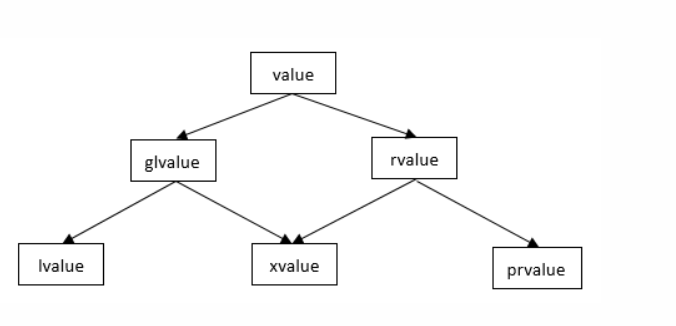

> 引用
- https://www.jianshu.com/p/4538483a1d8a
- https://www.cnblogs.com/zpcdbky/p/5275959.html

# 概述
- C++98： 左值 右值
- C++11：lvalue（左值）、**rvalue（右值）**、prvalue（纯右值）、xvalue（将亡值）、**gvalue（泛左值）**

> 表达式
- **表达式**： 由运算符(operator)和运算对象(operand)构成的计算式
  - EG： 字面值(literal)和变量(variable)是最简单的表达式，函数的返回值也被认为是表达式。
- 在c++11以后，表达式按值类别分，必然属于以下三者之一：**左值(left value,lvalue)，将亡值(expiring value,xvalue)，纯右值(pure rvalue,pralue)**。
  - 其中， **左值** 和 **将亡值** 合称 **泛左值**(generalized lvalue,glvalue) ， **纯右值** 和 **将亡值** 合称 **右值**(right value,rvalue)。
- 严格来讲，“左值”是**表达式的结果的一种属性**，但更为普遍地，我们通常用“左值”来指代左值表达式

# 详细阐述
- 事实上，无论是左值、将亡值还是纯右值，我们**目前都没有一个精准的定义**
  - 表征了表达式的属性，具体体现在使用上。
## 左值
- 能够用&取地址的表达式是左值表达式。
- eg：
  - 函数名和变量名
  - 返回左值引用的函数调用
  - 前置自增/自减运算符连接的表达式++i/--i
  - 由赋值运算符或复合赋值运算符连接的表达式
  - **解引用表达式*p**
    - `&(*p)`
  - **字符串字面值"abc"**

## 纯右值
1. 本身就是赤裸裸的、纯粹的字面值，如3、false；
2. 求值结果相当于字面值或是一个不具名的临时对象
- eg：
  - 字符串字面值以外的字面值
  - 返回非引用类型的函数调用
  - 后置自增/自减运算符连接的表达式i++/i--
  - 算术表达式（a+b、a&b、a<<b）
    - 得到的是不具名的临时对象
  - 逻辑表达式（a&&b、a||b、~a）
    - 同上
  - 比较表达式（a==b、a>=b、a<b）
    - 同上
  - **取地址表达式（&a）**

## 将亡值
- C++11中的将亡值是随着右值引用的引入而新引入的，“将亡值”概念的产生，是由右值引用的产生而引起的，将亡值与右值引用息息相关
  - 返回右值引用的函数的调用表达式(`T&& func()`)
  - 转换为右值引用 的转换函数的调用表达式(eg:`move()`)
- 将亡值不过是C++11提出的一块晦涩的语法糖。它**与纯右值在功能上及其相似**，**如都不能做操作符的左操作数，都可以使用移动构造函数和移动赋值运算符**。

## 泛左值
- https://www.cnblogs.com/zpcdbky/p/5275959.html