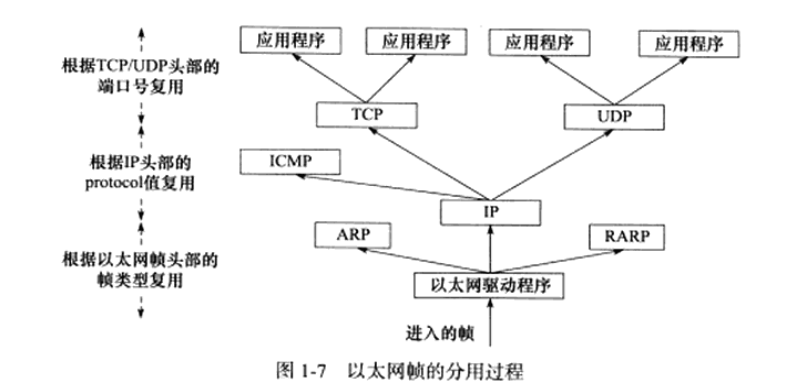
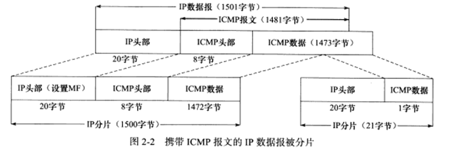
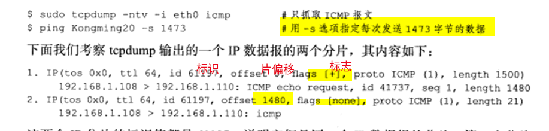
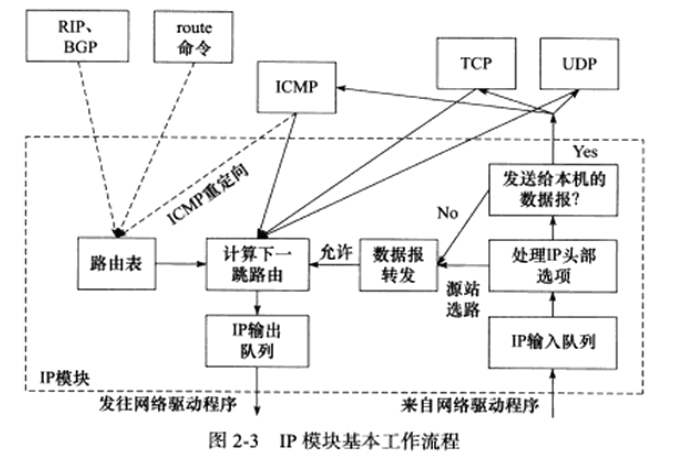
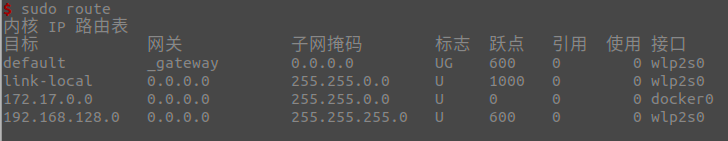
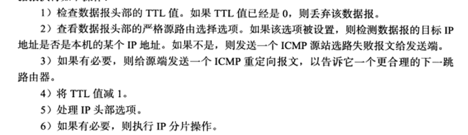
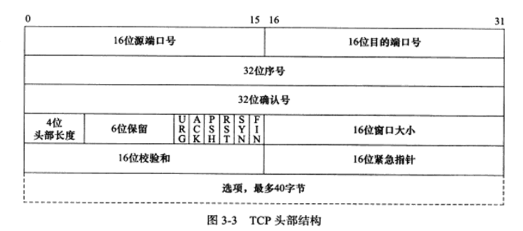
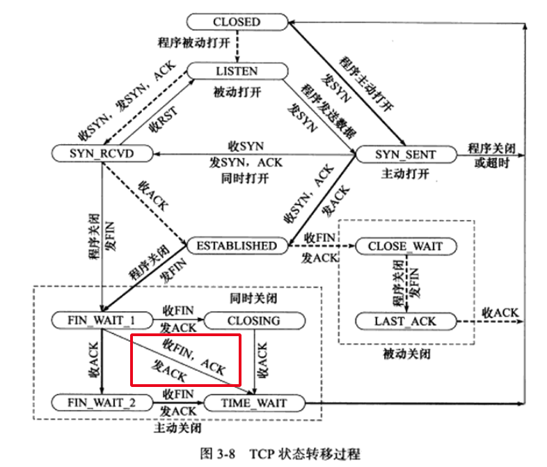
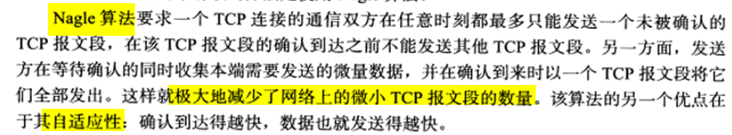
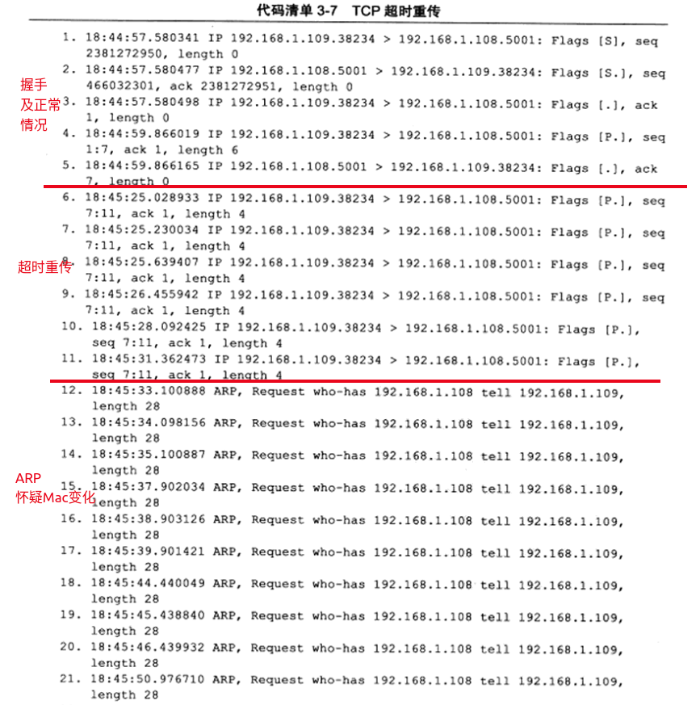

- [协议](#协议)
  - [IP层](#ip层)
    - [IP分片](#ip分片)
    - [IP路由](#ip路由)
  - [传输层](#传输层)
    - [TCP](#tcp)
    - [TCP超时重传](#tcp超时重传)
    - [拥塞控制](#拥塞控制)
# 协议
- ref:《Linux高性能服务器编程》
> 测试网络

 

> 封装

 

> 分用

 

> 层次和相关概念
- 传输层：
  - TCP段（TCP报文段）
    - MSS（最大报文长度）:经常设置为MTU-40，对于以太网来说为1460
  - UDP数据报
- 网络层
  - IP数据报
  - **整个**IP数据报最大长度（包括头）：65535
- 数据链路层
  - 帧（以太网帧，令牌环帧，...）
  - 以太网帧：
    - MTU（最大传输单元）：1500B（46-1500）。
      - 可以通过`ifconfig`或`netstat`查看
    - 过长的IP数据报需要**分片（fragment）**

## IP层
- 无状态、无连接、不可靠服务
  - 无状态：IP通信双方不同步传输数据的状态信息。没窗口、序号这些；**两个IP数据报之间在网络层看来没有半毛线关系**。
    - 最大缺点：**不能处理乱序和重复**
    - 优点：简单、高效
  - 无连接：双方都不长久地维持对方的任何信息。
    - 每次调用都需要指定IP，而TCP socket就维护了一个socket地址了。
  - 不可靠：尽力，但不保证送达
    - 不会重传
- **接收数据特点**：接受到了直接交给上层协议模块（如TCP，TCP可以自己处理乱序和重复）
- **ipv4头**:一般20字节
  - 服务类型中有有4位TOS（其他几位不管），分别是**最小时延，最大吞吐量，最高可靠性，最小费用**。根据实际需求设置。
    - ssh、telnet一般需要最小时延
    - ftp一般需要最大吞吐量
  - 16位标识：唯一标识主机发送的每一个数据报。（更新++）
    - **用来分片重组的**，而不是用来指示接收顺序的。
  - 3位标志：保留|DF|MF
    - DF：禁止分片。，超过MTU返回ICMP差错报文，并丢弃。
    - MF：表示后面有更多分片。除了数据报最后一个，其他都为1.
  - 选项
    - 记录路径
    - 记录转发时间戳
    - 路由选择
      - 宽松：必须包含所指定所有路由器
      - 严格：必须且只能通过所有指定路由器
  - 其他见：p19(2)

 

### IP分片
- 分片可能发生在发送端，也可能发生再中转路由。**重组只可能发生在接收端**
- 分片相关：16位标识、标志、片偏移
- 例子：1501字节的IP数据报（上层ICMP）

 

 

### IP路由

 

> IP模块工作流程
1. 处理IP头部
   1. CRC校验
   2. 是否设置了源站路由选项（松散源路由选择和严格源路由选择）。如果是，调用 **数据报转发子模块** 处理数据报
   3. 是否是本机的某个IP或者广播地址。如果是，根据上层是哪个协议交给 **上层协议模块**
   4. 如果不是本机的。调用 **数据报转发子模块**。
2. 数据报转发子模块
   1. 首先检查是否允许转发，不允许则丢弃
   2. 如果允许转发，进行一系列操作（**路由过程**），交给 **IP数据报输出子模块**
> 路由表
- **IP路由过程**：应该发送给哪个下一跳路由（或目标机器），哪个网卡（接口）来发送
- 修改路由表
  - route（静态）
  - 协议（RIP OSPF BGP） 动态
  - ICPM也可以修改路由表

  - `/proc/sys/net/ipv4/ip_forward`

 

 

> 路由过程
- 有没有直接匹配IP的
- 有没有匹配网络号的
- 走默认路由项
> 转发
- 路由器都能执行转发，但是主机一般只发送和接受。
- 转发细节

 

## 传输层
> 广播和多播
  - TCP是一对一的，所以基于广播和多播的应用不能使用TCP。
  - UDP更适合

> TCP send的时候
1. 调用send函数向一个TCP连接写入数据
2. 内核中的TCP模块将这些数据拷贝到连接对应的 **TCP内核发送缓冲区** 中。
3. 在某一个时刻TCP模块调用**IP模块**提供的服务，将 **TCP头部信息和TCP发送缓冲区中的数据** 作为参数传递。

> UDP send的时候
- 和TCP的类似
- 不同点：**用完不在内核缓冲区保存副本，而是直接丢掉**

> 字节流服务和数据报服务
- 字节流服务和数据报服务，区别之一
  - 双方是否必须执行相同次数的读写操作。
- 字节流服务：发送和接受没有边界限制
- 数据报服务：每执行一次写，就封装成一个UDP。如果用户没有足够多的缓冲区读取UDP数据报，将被截断。
- **TCP和SCTP有接收和发送缓冲区，而UDP只有一个接收缓冲区**。

 

### TCP 
> 头部（20-60）

 

 

- 16位窗口大小：指的是接收通告窗口（RWND），告诉对方本端的TCP缓冲区能容纳多少数据。(最大65535)
- 检验和：头+数据
- 16位紧急指针：紧急偏移。一个正的偏移量，和序号相加表示最后一个紧急数据的下一字节序号。
- 选项：(p34)
  - kind = 0：表结束
  - kind = 1：空操作，填充
  - kind = 2：协商MSS，通常为MTU-40
  - kind = 3：窗口扩大因子M。接收窗口N太小，启用窗口扩大因子后，时机接收窗口为`N << M`。（只能出现再SYN）
  - kind = 4：SACK（选择性确认）。避免一个没收到，后面都重传。（SYN时协商）
  - kind = 8：计算RTT
      - RTT与超时重传时间有关

 

 

> 连接超时（和超时重传区分）
- 超时重传是已经建立连接了，然而里面一些报文段超时了。
- 超时时间：1，2，4，8，16，32..
- 重传了：5次
  - 重传次数设置：`/proc/sys/net/ipv4/tcp_syn_retries `

 

> 状态变化
- 注意
  - 从FIN_WAIT_1直接到TIME_WAIT的情况：收到带确认信息的结束报文段（ACK,FIN）
  - **孤儿连接**：客户端连接停留再FIN_WAIT_2的状态，这个时候**强行退出**。客户端的连接由内核接管，形成**孤儿连接**。
    - 避免孤儿连接：
      - 能接管的孤儿连接数：`/proc/sys/net/ipv4/tcp_max_orphans`
      - 孤儿连接再内核的生存时间：`/proc/sys/net/ipv4/tcp_fin_timeout`

 

 

> TIME_WAIT
- TIME_WAIT状态一般要维持2MSL（报文段最大生存时间）
- 为什么有：
  - 可靠的终止TCP。
    - 针对上图。服务端没收到ACK时，服务端会重新发FIN，这时客户端可以重新发送ACK
  - 保证迟来的TCP报文段有足够时间被识别和丢弃。

> 复位报文段（RST）
- 为什么有：
  - 通知对方关闭连接或重新建立连接
- 出现情况：
  - 访问不存在的端口（主机已存在）
  - 异常终止连接（连接已建立）
  - 处理**半打开连接**（一方已经关闭强制中断，另一方没收到，还以为正在连接。当另一方继续write，将收到RST）。

> 交互数据和成块数据
- 划分方法：按TCP报文段数据长度划分
  - **交互数据**：适合实时性要求高的，ssh、telnet。eg：p46(2)
  - **成块数据**：传输效率高的，ftp。eg:p48(2)

> Nagle算法
- 广域网上，交互数据流可能受到很大延迟（这样超时再重传，会给网络带来很大的压力）
- 目的：避免拥塞
- 简单概括就是上一个段被确认前，不能发送下一个段，只能积累待发送数据。
- 优点：自适应。网络越好，发的越快，越多。

 

### TCP超时重传
- 超时重传策略：关于重传的超时时间选择和重传次数选择。
- 超时重传相关的内核参数
  - `/proc/sys/net/ipv4/tcp_retries1`：最少重传次数
  - `/proc/sys/net/ipv4/tcp_retries2`：最多重传次数
- 快速重传(**快重传**)：超时会导致TCP报文段重传，但是**TCP报文段的重传可以发生在超时之前，即快速重传**
> 例子

 

 

### 拥塞控制
- 参考：
  - https://blog.csdn.net/lishanmin11/article/details/77165077
  - 万字好文：https://zhuanlan.zhihu.com/p/144273871
- 与发送窗口相关
- 目的：
  - 提高网络利用率
  - 降低丢包率
  - 保证网络资源对每条数据流的公平性
- 内容：
  - 慢启动
  - 拥塞避免
  - 快重传
  - 快恢复
- 实现算法：reno算法、vegas算法、cubic算法
  - 部分或全部实现了上面的4个内容
  - 查看所用算法：`/proc/sys/net/ipv4/tcp_congestion_control`
- 太复杂了
- 先抓几个要点就好了
  - 快重传使得数据报可以快速被重传，不用等到RTT时间
  - 发送窗口是由接收窗口和拥塞窗口一起决定的。