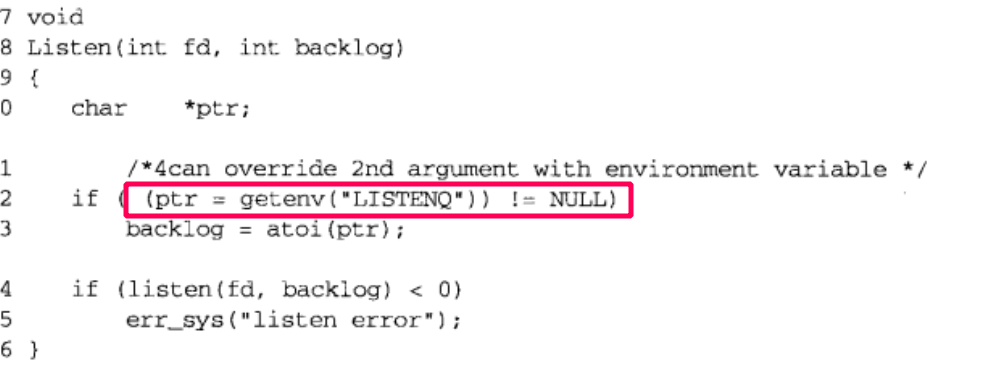

- [3.套接字编程简介](#3套接字编程简介)
  - [套接字地址结构](#套接字地址结构)
    - [sockaddr_in：IPv4](#sockaddr_inipv4)
    - [sockaddr_in6：IPv6](#sockaddr_in6ipv6)
    - [sockaddr：旧通用套接字地址结构](#sockaddr旧通用套接字地址结构)
    - [sockaddr_storage：新的通用套接字地址结构](#sockaddr_storage新的通用套接字地址结构)
    - [总结](#总结)
    - [思考](#思考)
  - [值-结果参数](#值-结果参数)
  - [大小端](#大小端)
    - [大小端字节序](#大小端字节序)
    - [测试大小端的代码](#测试大小端的代码)
    - [转换函数](#转换函数)
  - [关于字节操作的函数](#关于字节操作的函数)
  - [地址表示与数值的转换](#地址表示与数值的转换)
    - [协议无关的转换](#协议无关的转换)
- [4.基本的TCP套接字编程](#4基本的tcp套接字编程)
  - [socket函数](#socket函数)
  - [connect函数](#connect函数)
  - [bind函数](#bind函数)
  - [listen函数](#listen函数)
    - [backlog](#backlog)
  - [accept函数](#accept函数)
  - [fork 和 exec](#fork-和-exec)
    - [fork](#fork)
    - [exec](#exec)
  - [demo：（重点在close）并发服务器](#demo重点在close并发服务器)
  - [close函数](#close函数)
  - [getsockname，getpeername函数](#getsocknamegetpeername函数)
  - [问题总结](#问题总结)
    - [一个端口可以多个连接](#一个端口可以多个连接)
    - [accept细节](#accept细节)
- [5.TCP客户/服务端程序示例](#5tcp客户服务端程序示例)
  - [慢系统调用（slow system call）](#慢系统调用slow-system-call)
  - [wait和waitpid](#wait和waitpid)
  - [一些意外情况](#一些意外情况)
    - [accept返回前连接终止（收到RST）](#accept返回前连接终止收到rst)
    - [服务器进程终止](#服务器进程终止)
      - [SIGPIPE信号](#sigpipe信号)
    - [服务端主机崩溃（不能发出任何东西）](#服务端主机崩溃不能发出任何东西)
    - [服务器主机崩溃后重启](#服务器主机崩溃后重启)
    - [服务器主机关机](#服务器主机关机)
  - [数据格式](#数据格式)
  - [总结](#总结-1)


# 3.套接字编程简介
## 套接字地址结构
### sockaddr_in：IPv4
- <netinet/in.h>
```cpp
// ipv4 套接字地址结构
// 使用单独的结构体存储 IP 地址有历史原因，早期in_addr是一个联合体，但是现在是无类地址编码，所以也就不需要该联合了。
struct in_addr{
	in_addr_t s_addr;  // 32 位的 IP 地址（uint32_t）
};

struct sockaddr_in{
	uint8_t        sin_len;      // 套接字地址的长度，并不是所有厂家都支持，而且POSIX规范不要求，在我自己的unbuntu上没看到有，所有的地址结构都不包括
	sa_family_t    sin_family;   // AF_INET（unsigned short）
	in_port_t      sin_port;     // 16 位的 ipv4 或 ipv6 端口号（uint16_t）
	struct in_addr sin_addr;     // 32 位 ipv4 地址
	char           sin_zero[8];
}；
```
- 无须设置和检查 sin_len 字段，除非涉及路由套接字
- POSIX只关注三个字段即可：**`sin_family, sin_addr, sin_port`**
  - `sin_addr`和`sin_port`总是以外露哦字节序来存储
  - sin_family再IPv4中为AF_INET
- `sin_zero`未曾使用，不过一般我们都初始化为0


### sockaddr_in6：IPv6
- <netinet/in.h>
- 关注三个字段即可：**`sin_family, sin_addr, sin_port`**
- IPv6 的地址族是 AF_INET6，IPv4 的地址族是 AF_INET.
- sin6_flowinfo 字段分为两个字段：
  - 低序 20 位是流标；
  - 高序 12 位保留；
```cpp
struct in6_addr{
	unit8_t s6_addr[16];  // 128bit IPV6 地址
};
#define SIN6_LEN
struct sockaddr_in6{
	uint8_t         sin6_len;       // 一般没有，不用管
	sa_family       sin6_family;
	in_port_t       sin6_port;
	uint32_t        sin6_flowinfo;
	struct in6_addr sin6_addr;
	uint32_t        sin6_scope_id;
};
```

### sockaddr：旧通用套接字地址结构
- <sys/socket.h>
- 目的：可以使套接字函数支持**任何协议族**的套接字地址结构
  - **IPv6也可以支持，比如在`connect bind getaddrinfo`中**，即使类型的字节数比他多。`(struct sockaddr_storage *)(void *)(addr)`，其中addr为`sockadd`r类型
- 从应用程序员看，这个结构的唯一作用就是用来强制类型转换的而已。
```cpp
struct sockaddr{
	uint8_t      sa_len;
	sa_family_t  sa_family;
	char         sa_data[14];
};
```


### sockaddr_storage：新的通用套接字地址结构
- <netinet/in.h>
- 针对IPv6相对sockaddr过长的限制
- 和旧的通用套接字地址相比差异
  - 如果系统支持任何套接字地址结构有对其需要，sockaddr_storage可以满足最苛刻的对其要求
  - sockaddr_storage足够大，可以满足系统支持的所有套接字地址结构
```cpp
struct sockaddr_storage{
	uint8_t     ss_len;     // length
	sa_family_t ss_family;  // AF_XXX
	// 其余的字段对用户来说是透明的，转换为特定地址结构进行使用
};
```

### 总结
<div style="zoom: 60%" align="center"> </div>

### 思考
- 关于IPv6的`sockaddr_in6*`与`sockaddr*`之间的类型转换是可以的，也就是说参数类型为`sockaddr*`的话，可以传入`sockaddr_in6*`，因为一般函数在传入之后还会再传入一个结构长度。

## 值-结果参数
- 在传递结构的长度的时候（如地址的结构），可能是传值，也可能是传引用，**传递方式取决于该结构的传递方向**
    - 进程到内核，如`bind(), connect(), sendto()`
    ```cpp
    struct sockaddr_in serv;  
    connect(sockfd, (SA*) &serv, sizeof(serv)); //其中大小参数的类型是socklen_t(uint32_t) 
    ```
  - 内核到进程(传引用，为了让内核修改后作为结果返回。)，如`accept(), recvfrom(), getsockname(), getpeername()`

## 大小端
### 大小端字节序
- 网络字节序是大端的
<div style="zoom: 60%" align="center"> </div>

### 测试大小端的代码
```cpp
int main(int argc, char** argv){
	union{
		short s;
		char c[sizeof(short)];
	} un;
	un.s = 0x0102;
	if (sizeof(short) == 2){
		if(un.c[0] == 1 && un.c[1] == 2){
            // 高位在低字节
			printf("big endian\n");
		}
		else if(un.c[0] == 2 && un.c[1] == 1){
			printf("little endian\n");
		}
		else{
            // 高位在高字节
			printf("unknow");
		}
	}
	exit(0);
}
```

### 转换函数
```cpp
#include<netinet/in.h>
uint16_t htons(uint16_t );
uint32_t hton1(uint32_t );   //均返回，网络字节序的值
uint16_t ntohs(uint16_t );
uint32_t ntoh1(uint32_t );   //均返回，主机字节序的值
```
- h -> host, n -> network, s -> short(16), l -> long(32)
- 在系统是大端的操作系统中，这四个函数一般为空

## 关于字节操作的函数
- 作者推荐使用`bzero`，不容易出错
```cpp
#include<strings.h> 
void bzero(void* dest, size_t nytes) .
void bcopy(const void* src, void* dest, size_t nbytes)
int bcmp(const void* ptrl, const void* ptr2, size_t nbytes)

void *memset(void* desk, int e, size_t len); 
void *memcpy(void* desk, const void* src, size_t nbytes); 
int memcpy(const void* ptrl, const void* ptr2, size_t nbytes); 
```

## 地址表示与数值的转换
- a:"address"; n:"numberic"
```cpp
#include<arpa/inet.h>
int inet_aton(const char* strptr, struct in_addr* addr_ptr);   //若字符串有效则为1，否则为0
in_addr_t inet_addr(const char* strptr);     //若字符串有效，则返回32位二进制IPv4地址，否则为INADDR_NONE（通常为32位均为1的值）有bug，已经废弃
char* inet_ntoa(struct in_addr inaddr);      //返回一个指向点分十进制的字符串指针
```

> 推荐使用
- 这两个函数拓展了对IPv6的支持，现在基本都使用这两个
- p:"persentation"; n:"numeric"

```cpp
#include<arpa/inet.h>
// family 代表转换地址的类型
int inet_pton(int family, const char* strptr, void* addrptr);   //成功返回1，失败返回0，出错返回-1
const char* inet_ntop(int family, const void* addrptr, char* strptr, size_t len);     //成功返回指向字符串的指针，失败返回NULL
```
### 协议无关的转换
- 使用 `inet_pton` 和 `inet_ntop`的时候需要传入family，造成代码与协议相关不好移植。
```cpp
char* sock_ntop(const struct sockaddr* sa, socklen_t salen){
	char portstr[8];
	static char str[128];
	switch(sa->sa_family){
		case AF_INET: {
			struct sockaddr_in* sin = (struct sokaddr_in *) sa;

			if(inet_ntop(AF_INET, &sin->sin_addr, str, sizeof(str)) == NULL)
				return (NULL);
			if(ntohs(sin->sin_port) != 0){
				snprintf(portstr, sizeof(portstr), ":%d", ntohs(sin->sin_port));
				strcat(str, portstr);
			}
			return(str);
		}
        case AF_INET6:{
            ...
        }
	}
}
```

# 4.基本的TCP套接字编程
<div style="zoom: 60%" align="center"> </div>

## socket函数
```cpp
#include <sys/socket.h>
int socket(int family, int type, int protocol);
```
- 参数
  - famiy：代表协议族
  - type：指明套接字类型
  - protocol：设置为某个协议类型常值，或为0，用来选择所给定family和type组合的系统默认值

> family和type

- 并不是所有的组合都是有效的

<div style="zoom: 60%" align="center"> </div>

> AF_xxx 和PF_xxx
- 历史因素，现在没有差别
- 一个是表示地址族，一个是协议族。为了满足协议族支持多个地址族的情况，但是现在还没有这种协议

## connect函数
```cpp
#include <sys/socket.h>
int connect(int sockfd, const struct sockaddr* servaddr, socklen_t addrlen);
//返回：成功返回0，出错返回-1
```

> 出错时的几种情况
- **超时**。没有收到响应SYN的分节，会重发SYN，如果一段时间还是没收到，返回 `ETIMEDOUT` 错误。
- **主机端口上没有服务**。对客户的响应是RST，这是硬错误，所以会立刻返回 `ECONNREFUSED` 错误
- **主机不可达**。软错误，会重发，如果一段时间后还是一样，返回 `EHOSTUNREACH` 或 `ENETUNREACH` 错误


- 注：若失败，该套接字不可以使用，不可以再调用 `connect` ，**必须先 close 当前的套接字描述符并重新调用 `socket`**
> 状态转移

- 客户端：CLOSE ---> SYN_SENT ---->ESTABLISHED
- 服务端：LISTEN ---> SYN_RCVD--->ETABLISHED

## bind函数
```cpp
#include <sys/socket.h>
int bind(int sockfd, const struct *myaddr, socklen_t addrlen);
```
- 如果没有`bind`，在 listen 或 connect 的时候内核会自动分配。
- 服务器可以通过 bind 来绑定一个众所周知的端口，否则系统自动为其分配，但是这种情况十分少见，比如远程过程调用（通过RPC端口映射器，进行注册）
> 可以只绑定端口和地址其中一个
- 通配地址
  - v4: `INADDR_ANY`，一般是0
  - v6: `in6addr_any`
<div style="zoom: 60%" align="center"> </div>


## listen函数
```cpp
#include <sys/socket.h>
int listen(int sockfd, int backlog);
```

- 当 `socket` 创建一个套接字时，他被假设为一个**主动套接字**，它是一个将调用 `connect` 发起连接的客户套接字。 `listen` 把一个未连接的套接字变为一个**被动的套接字**，指示内核应接收指向该套接字的连接请求。调用 `listen` 将套接字由 `CLOSE` 态转换为 `LISTEN` 状态。

### backlog
- 不要设置为 0 ，不同系统解释不同，不想使用可以关闭套接字
- 如果收到一个 SYN 但是未完成队列已满，忽略它，并且不返回 RST，等待客户端重新发送
> 内核监听套接字维护的两个队列

- 未完成连接队列，由某客户端发送SYN到服务器，但还未完成三次握手过程，套接字处于STN_RCVD状态
- 已完成连接队列：已完成三次握手，套接字处于ESTABLISHED状态，但是还没有被accept拿到
<div style="zoom: 60%" align="center"> </div>

> 关于该值的定义
- 没有明确，但就是和上面两个队列相关，也有可能只和 `已完成连接队列相关`
  - 内核2.2后的linux，表示已完成连接的队列上限（来自linux高性能服务器）


> 通过环境变量获取backlog
- 支持不用重新编译，就可以动态改这个值
<div style="zoom: 60%" align="center"> </div>编程

## accept函数
```cpp
#include < sys/socket.h>
int accept(int sockfd, struct sockaddr* cliaddr, socklen_t *addrlen);
```
- accept函数由TCP服务进行调用，用于从**已完成队列**中返回下一个已完成连接，如果已完成队列为空，则投入睡眠
- 该函数只是简单的从队列中拿到一个连接，而不关系连接的状态（是ESTABLISHED还是CLOSE_WAIT）
- 参数
  - `sockfd` ：监听的套接字
  - `cliaddr，addrlen` ：用来返回已完成连接的客户端的协议地址，addr_len 是**值-结果参数**


## fork 和 exec
### fork
```cpp
#include<unistd.h>
pid_t fork(void); // 子进程中返回 0，父进程返回子进程 ID，出错为 -1
```
- 用法：
  - 创建自身副本
  - 执行另一个程序（借助exec）


### exec
- 一共六个函数。区别在于以下
  - 执行的是文件名还是路径名
  - 新程序参数是一一列出还是一个指针数组来引用
  - 继承环境还是指定新环境

- 接口见p91


## demo：（重点在close）并发服务器
```cpp
pid_t pid;
int listenfd,connfd;
// 服务器开始监听
listenfd = Socket();
Bind(listenfd, ...);
Listen(listenfd, LISTENQ);

for(;;){
    confd = Accept(listenfd, ...);
    if((pid = Fork()) == 0){
        // 子进程进行处理操作
        Close(listenfd); // *****注意 1-close
        doit(connfd);
        Close(connfd); // *****注意 2-close
        exit(0)
    }
    // 关闭套接字描述符
    Close(connfd); // *****注意 3-close
}
```

- 第二个 `close` 可以不用，因为后面调用 `exit` 函数会关闭所有套接字描述符.
- **重点**：子进程关闭监听套接字（1--close），父进程则继续等待并关闭已连接套接字（3-close）。
  - 关键：引用计数，为0才清除套接字描述符的资源

## close函数
```cpp
#include <unistd.h>
int close(int sockfd);
```
- close一个TCP套接字**默认行为**（可以通过SO_LINGER更改这种默认行文）是将其标记成以关闭，然后立即返回到调用进程，即该套接字不能再作为read，write操作的参数，而且会尝试发送 TCP正在排队等待发送到对端的数据， 发送完就正常的TCP连接关闭过程。

- 如果我们确实想关闭一个套接字（在其引用计数不为0的情况下）这里使用`shutdown()`函数即可实现

## getsockname，getpeername函数
- getsockname：本地地址
- getpeername：外地地址
```cpp
#include <sys/socket.h>
int getsockname(int sockfd, struct sockaddr *localaddr, socklen_t *addrlen);
int getpeername(int sockfd, struct sockaddr *peeraddr, socklen *addrlen);
//二者成功均返回0，失败均返回-1
```

## 问题总结
### 一个端口可以多个连接
> https://blog.csdn.net/u011580175/article/details/80306414
- 一个连接的唯一标识是`[server ip, server port, client ip, client port， protocol]`——一个套接字与之对应

### accept细节
> https://github.com/jason--liu/Blog/issues/4

- 如果在 `accept` 收到第三次握手的ACK之前收到了客户发来的数据怎么办？
  - TCP有序，超前的数据表不会被应用接收，所以先暂存在内核缓存


# 5.TCP客户/服务端程序示例
> 网络编程中可能遇到的三种情况
  - 当fork子进程时必须捕获SIGCHLD信号
  - 当捕获信号时，必须处理被中断的系统调用（如accept中被中断，errno被设置为EINTR的时候）
  - SIGCHLD的信号处理函数必须正确编写，应使用waitpid函数，以免留下僵死进程

## 慢系统调用（slow system call）
- 慢系统调用：如那些可能永远阻塞的系统调用，比如 `accept`。
- 当阻塞于某个慢系统调用的一个进程捕获某个信号 且相应信号处理函数返回时，系统调用可能返回一个EINTR错误。虽然可以在信号处置上进行`SA_RESTART`设置，来让系统调用可以**自动重启**，但是很可能出现移植性问题，因为各个系统不一样，并且有些系统调用也不支持这个设置。所以最好不要依赖这个设置，而是自己处理。

- 正确处理方式
  - 对于 `accept`、`read`、`select`和 `write`来说是适用的
  - 对于 `connect`来说是不合适的，其被一个信号中断而不自动重启时，必须调用`select`来等待连接完成
```cpp
for( ; ; ){
    client = sizeof(cliaddr);
    if( (connfd = accept(listenfd, (SA*) &cliaddr, &clilen)) < 0) {
        if(errno == EINTR)
            continue;
        else
            err_sys("accept error");
    }
}
```

## wait和waitpid
- `wait和waitpid` 默认都是如果 没有已终止进程，并且有一个或者多个子进程正在执行，就会阻塞。
- `waitpid` 就等待哪个进程以及是否阻塞给了我们更多控制。
  - `WNOHANG` 告知内核 在没有已终止子进程时 不要阻塞。

> 例子
- 一个客户进程与服务器进程同时建立多个连接（服务端每个连接建立fork一个子进程），当客户进程退出时，服务端同时收到5个子进程的`SIGCHLD`。由于标准信号不能队列化，所以处理不好，很可能产生僵尸进程

<div style="zoom: 60%" align="center"> </div>


- 错误版本。
```cpp
void
sig_chld(int signo)
{
	pid_t	pid;
	int		stat;

	pid = wait(&stat);
	printf("child %d terminated\n", pid);
	return;
}

```

- 正确版本。同时多个子进程退出时，不会忽略了某一个进程的处理
  - 为什么正确：
    - 因为`waitpid`支持不阻塞，这样可以再一个信号处理函数中处理多个子进程的退出
    - 还有一个更重要的原因是信号处理函数调用前会先阻塞该信号，等到调用完后恢复

```cpp
void
sig_chld(int signo)
{
	pid_t	pid;
	int		stat;

	while ( (pid = waitpid(-1, &stat, WNOHANG)) > 0)
		printf("child %d terminated\n", pid);
	return;
}

```

> 服务端正确处理示例
- p111 图5-12，要点：
  - 阻塞被信号中断时的处理
  - 对`SIGCHLD`的处理（使用waitpid）


## 一些意外情况
### accept返回前连接终止（收到RST）
- 导致accept返回非致命的错误
  1. 信号处理函数 打断
  2. 如下所述
- 当三次握手完毕，服务器准备调用 `accept` 之前，客户端发送了 `RST`导致连接终止
  - 这种情况下，不同系统返回的errno不同，在POSIX下返回ECONNABORTED.
  - 这种情况不是致命的错误，只用重新运行一次accept就行李

<div style="zoom: 60%" align="center"> </div>

### 服务器进程终止
- 总结：不能单纯阻塞在这两**个源中某个特定源的输入上**。**而是应该阻塞在其中任何一个源的输入上**。这正是poll和select的目的之一，后面的处理方式是：一旦杀死服务器子程序，客户会立即被告知已收到FIN

#### SIGPIPE信号
- 当一个进程向 **某个已收到RST的套接字** 执行写操作时，内核向该进程发送一个SIGPIPE信号，默认行为是终止进程。
- 出现时怎么处理 P114

### 服务端主机崩溃（不能发出任何东西）
- 这个时候服务器发不出任何东西。
- 客户端给服务器发完后就阻塞在read上，之后因为内核在一定时间内不断重传无果后返回错误，之后退出程序。如果是服务器崩溃不可达，返回ETIMEOUT，如果是中间路由器表示不可达则响应一个“destination unreachable"的ICMP消息，这时返回的错误为EHOSTUNREACH或ENETUNREACH。详见p115
- 可以给read设置超时，避免过久阻塞


### 服务器主机崩溃后重启
- 详见p115 过程描述
- 服务器意外终止，客户端并没有被告知。
- 如果客户需要实时监测服务器是否崩溃，则要采用一些技术（SO_KEEPALIVE套接字选项或/某些客户/服务器心博函数）

### 服务器主机关机
- init进程会给所有进程发送 `SIGTERM` 信号（可被捕获），并等待一段时间，然后给所有仍在运行的进程发送 `SIGKILL` 信号（不可捕获）。这么做是为了将一小段时间给进程做清除和终止。当服务器子进程终止，它所有打开的描述符都需要关闭释放，我们必须在客户中使用select或poll函数，使得服务器一终止，客户端可以检查到（否则会阻塞在某一与之无关的描述符上）。

## 数据格式
- 两种格式
  - 文本串
  - 二进制串

- 二进制串形式在不同系统有着大小端、系统位数、结构打包方式等方面的不同
  - 解决方法
    - 把数值数据作为文本串来传递，确保机器上的字符集相同即可
    - 显示定义所支持数据类型的二进制格式（位数，大小端字节序）RPC 通常使用这种方式

## 总结
- 服务端fork后，僵尸进程的问题
  - 涉及wait和waitpid的差别

- 意外情况发生时，客户进程和服务进程、以及他们的内核怎么处理
- 意外：
  - 系统调用被中断
  - accept返回前收到RST
  - 客户端未被告知的情况：服务子进程被kill（客户端内核感知【内核收到了FIN并返回对方ACK了】，但客户程序还未感知【被终端输入阻塞了】），服务端主机崩溃、服务端主机关机、服务端主机崩溃后重启
- 数据格式：
  - 考虑：系统之间的差异


